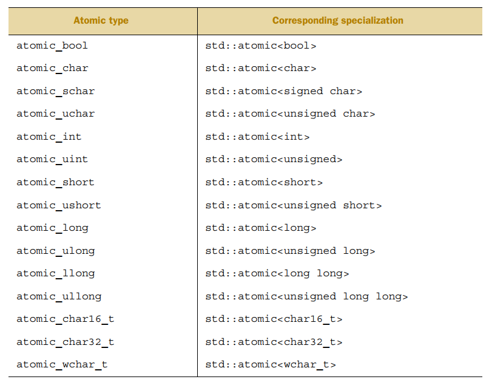
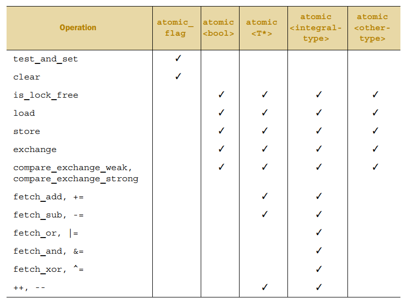
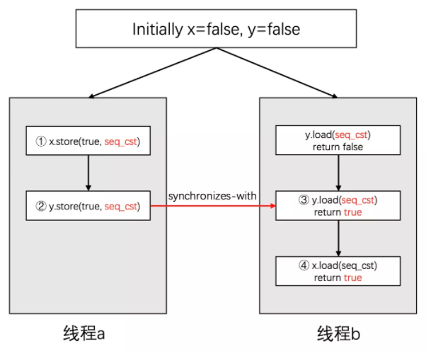
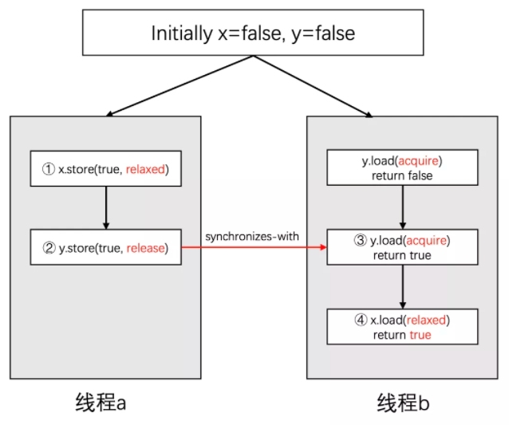
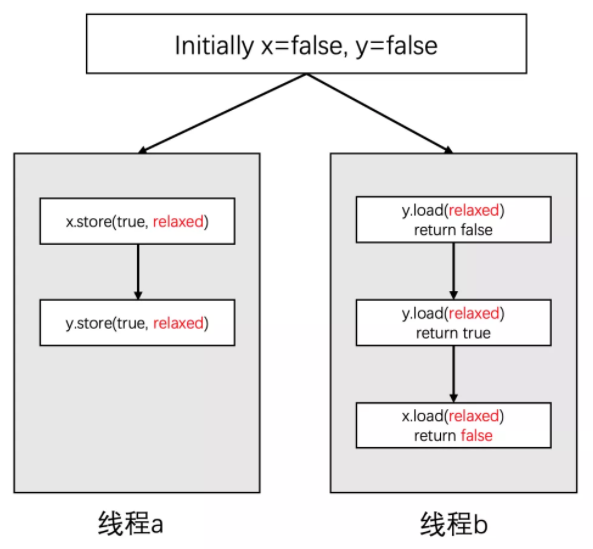
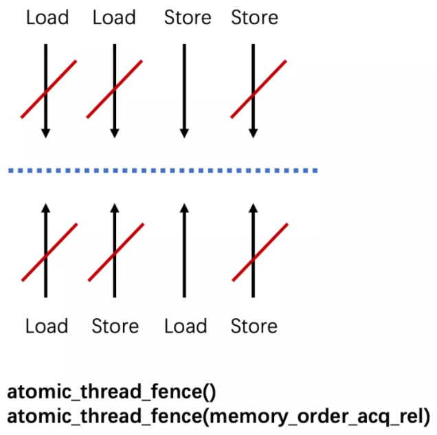
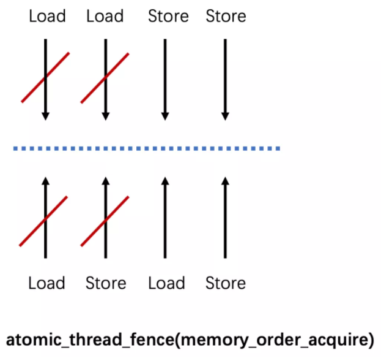
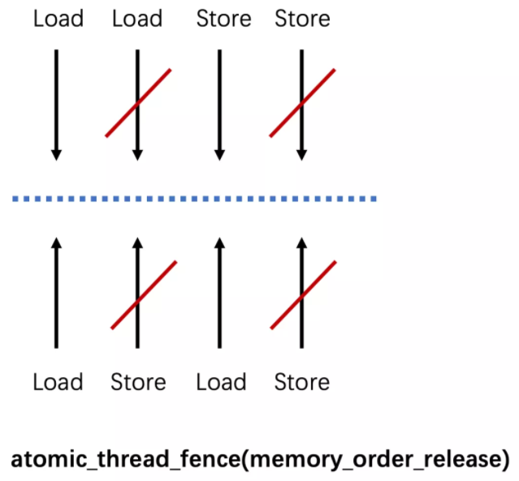

为了避免 race condition，线程就要规定执行顺序：

- 一种方式是使用 mutex，后一线程必须等待前一线程解锁
- 第二种方式是使用原子操作来避免竞争访问同一内存位置

原子操作是不可分割的操作，要么做了要么没做，不存在做一半的状态。

# 原子操作和原子类型

## 标准原子类型

标准原子类型定义在 `<atomic>` 中。也可以用 mutex 模拟原子操作，实际上标准原子类型可能就是这样实现的，它们都有一个 is_lock_free 函数，返回 true  说明该原子类型操作是无锁的，用的是原子指令，返回 false 则是用锁。

```
struct A { int a[1000]; };
struct B { int x, y; };

std::cout << std::boolalpha
    << std::atomic<A>{}.is_lock_free()
    << "\n"
    << std::atomic<B>{}.is_lock_free()
    << "\n";
```

原子操作的主要用处是替代 mutex 实现同步。如果原子操作内部是用 mutex 实现的，就不会有期望的性能提升，还不如直接用 mutex 来同步。C++17 中每个原子类型都有一个 is_always_lock_free  成员变量，为 true 时表示该原子类型在此平台上 lock-free。

```
std::cout << std::atomic<int>{}.is_always_lock_free; //@ 1
```

C++17 之前可以用标准库为各个原子类型定义的 ATOMIC_xxx_LOCK_FREE 宏来判断该类型是否无锁：

- 值为 0 表示原子类型是有锁的
- 值为 2 表示无锁
- 值为 1 表示运行时才能确定

```
//@ VS2017中的定义
#define ATOMIC_BOOL_LOCK_FREE        2
#define ATOMIC_CHAR_LOCK_FREE        2
#define ATOMIC_CHAR16_T_LOCK_FREE    2
#define ATOMIC_CHAR32_T_LOCK_FREE    2
#define ATOMIC_WCHAR_T_LOCK_FREE     2
#define ATOMIC_SHORT_LOCK_FREE       2
#define ATOMIC_INT_LOCK_FREE         2
#define ATOMIC_LONG_LOCK_FREE        2
#define ATOMIC_LLONG_LOCK_FREE       2
#define ATOMIC_POINTER_LOCK_FREE     2
```

标准库中为 std::atomic 对内置类型的特化定义了类型别名，比如：

```
namespace std {
    using atomic_bool = std::atomic<bool>;
    using atomic_char = std::atomic<char>;
}
```

通常类型 `std::atomic<T>` 的别名就是 atomic_T，只有以下几种例外：signed 缩写为 s，unsigned 缩写为 u，long long 缩写为 llong：



原子类型不允许由另一个原子类型拷贝赋值，因为拷贝赋值调用了两个对象，破坏了操作的原子性。但可以用对应的内置类型赋值：

```
T operator=(T desired) noexcept;
T operator=(T desired) volatile noexcept;
atomic& operator=(const atomic&) = delete;
atomic& operator=(const atomic&) volatile = delete;
```

std::atomic 为支持赋值提供了成员函数：

```
std::atomic<T>::store //@ 替换当前值
std::atomic<T>::load //@ 返回当前值
std::atomic<T>::exchange //@ 替换值，并返回被替换前的值

//@ 与期望值比较，不等则将期望值设为原值并返回false
//@ 相等则将原子值设为目标值并返回true
//@ 在缺少CAS（compare-and-exchange）指令的机器上，weak版本在相等时可能替换失败并返回false
//@ 因此weak版本通常要求循环，而strong版本返回false就能确保不相等
std::atomic<T>::compare_exchange_weak
std::atomic<T>::compare_exchange_strong

std::atomic<T>::fetch_add //@ 原子加法，返回相加前的值
std::atomic<T>::fetch_sub
std::atomic<T>::fetch_and
std::atomic<T>::fetch_or
std::atomic<T>::fetch_xor
std::atomic<T>::operator++ //@ 前自增等价于fetch_add(1)+1
std::atomic<T>::operator++(int) //@ 后自增等价于fetch_add(1)
std::atomic<T>::operator-- //@ fetch_sub(1)-1
std::atomic<T>::operator--(int) //@ fetch_sub(1)
std::atomic<T>::operator+= //@ fetch_add(x)+x
std::atomic<T>::operator-= //@ fetch_sub(x)-x
std::atomic<T>::operator&= //@ fetch_and(x)&x
std::atomic<T>::operator|= //@ fetch_or(x)|x
std::atomic<T>::operator^= //@ fetch_xor(x)^x
```

这些成员函数有一个用来指定内存序的参数 std::memory_order：

```
typedef enum memory_order {
    memory_order_relaxed,
    memory_order_consume,
    memory_order_acquire,
    memory_order_release,
    memory_order_acq_rel,
    memory_order_seq_cst
} memory_order;
```

store 的顺序参数只能是：

- memory_order_relaxed
- memory_order_release
- memory_order_seq_cst (默认)

load 的顺序参数只能是：

- memory_order_relaxed
- memory_order_consume
- memory_order_acquire
- memory_order_seq_cst (默认)

## std::atomic_flag

std::atomic_flag 是一个原子的布尔类型，也是唯一保证 lock-free 的原子类型。它只能在  set 和 clear 两个状态之间切换。

如果在初始化时没有明确使用 ATOMIC_FLAG_INIT初始化，那么新创建的 std::atomic_flag 对象的状态是未指定的（unspecified）（既没有被 set 也没有被 clear）

ATOMIC_FLAG_INIT：如果某个 std::atomic_flag 对象使用该宏初始化，那么可以保证该 std::atomic_flag 对象在创建时处于 clear 状态。

只支持两种操作：

- test-and-set
  - test_and_set 函数检查 std::atomic_flag 标志，如果 std::atomic_flag 之前没有被设置过，则设置 std::atomic_flag 的标志，并返回先前该 std::atomic_flag 对象是否被设置过，如果之前 std::atomic_flag 对象已被设置，则返回 true，否则返回 false
  - test-and-set 操作是原子的，可以指定 Memory Order
- clear
  - 清除 std::atomic_flag 对象的标志位，即设置 atomic_flag 的值为 false
  - test-and-set 操作是原子的，可以指定 Memory Order

用 std::atomic_flag 实现自旋锁：

```
class  SpinMutex
{
public:
	void lock()
	{
		while(flag.test_and_set(std::memory_order_acquire))
			;
	}

	void unlock()
	{
		flag.clear(std::memory_order_release);
	}

private:
	std::atomic_flag flag = ATOMIC_FLAG_INIT;
};
```

测试：

```
SpinMutex g_mutex;

void fn1()
{
	for (int i = 0; i < 5; i++)
	{
		g_mutex.lock();
		std::cout << "thread\t" << std::this_thread::get_id() << ":\t" << "The fun1 is called !" << std::endl;
		g_mutex.unlock();
	}
}

void fn2()
{
	for (int i = 0; i < 5; i++)
	{
		g_mutex.lock();
		std::cout << "thread\t" << std::this_thread::get_id() << ":\t" << "The fun2 is called !" << std::endl;
		g_mutex.unlock();
	}
}

int main()
{
	std::thread t1(fn1);
	std::thread t2(fn2);
	t1.join();
	t2.join();


	return 0;
}
```

## 其他原子类型

### std::atomic_bool

std::atomic_flag 功能过于局限，甚至无法像布尔类型一样使用，相比之下，`std::atomic<bool>` 更易用。但是 `std::atomic<bool>` 不保证 lock-free，可以用 is_lock_free 检验在当前平台上是否 lock-free。

```
std::atomic<bool> x(true);
x = false;
bool y = x.load(std::memory_order_acquire); //@ 读取x值返回给y
x.store(true); //@ x写为true
y = x.exchange(false, std::memory_order_acq_rel); //@ x用false替换，并返回旧值true给y

bool expected = false; //@ 期望值
/* 不等则将期望值设为x并返回false，相等则将x设为目标值true并返回true
weak版本在相等时也可能替换失败而返回false，因此一般用于循环 */
while (!x.compare_exchange_weak(expected, true) && !expected)
	;
```

### 指针原子类型

指针原子类型 `std::atomic<T*>` 也支持 is_lock_free、load、store、exchange、compare_exchange_weak 和 compare_exchange_strong，与 `std::atomic<bool>` 语义相同。此外指针原子类型还支持运算操作：fetch_add、fetch_sub、++、--、+=、-= 。

```
class A {};
A a[5];
std::atomic<A*> p(a); //@ p为&a[0]
A* x = p.fetch_add(2); //@ p为&a[2]，并返回原始值a[0]
assert(x == a);
assert(p.load() == &a[2]);
x = (p -= 1);  //@ p为&a[1]，并返回给x，相当于x = p.fetch_sub(1) - 1
assert(x == &a[1]);
assert(p.load() == &a[1]);
```

### 整型原子类型

整型原子类型（如 `std::atomic<int>`）在上述操作之外，还支持 fetch_or、fetch_and、fetch_xor、=、&=、^=。

```
std::atomic<int> i(5);
int j = i.fetch_and(3); //@ 101 & 011 = 001，i为1，j为5
```

### 自定义原子类型

如果原子类型是自定义类型，该自定义类型必须可平凡复制（trivially copyable），也就意味着该类型不能有虚函数或虚基类。这可以用 is_trivially_copyable 检验。

```
#include <iostream>
#include <type_traits>

struct A {
	int m;
};

struct B {
	B(B const&) {}
};

struct C {
	virtual void foo();
};

struct D {
	int m;

	D(D const&) = default; // -> trivially copyable
	D(int x) : m(x + 1) {}
};

int main()
{
	std::cout << std::boolalpha;
	std::cout << std::is_trivially_copyable<A>::value << '\n'; //@ true
	std::cout << std::is_trivially_copyable<B>::value << '\n'; //@ false
	std::cout << std::is_trivially_copyable<C>::value << '\n'; //@ false
	std::cout << std::is_trivially_copyable<D>::value << '\n'; //@ true
}
```

自定义类型的原子类型不允许运算操作，只允许 is_lock_free、load、store、exchange、compare_exchange_weak 和 compare_exchange_strong，以及赋值操作和向自定义类型转换的操作。

### C  风格 API

除了每个类型各自的成员函数，原子操作库还提供了通用的 C 风格 API，只不过函数名多了一个 `atomic_` 前缀，参数变为指针类型：

```
std::atomic<int> i(42);
int j = std::atomic_load(&i); //@ 等价于i.load()
```

compare_exchange_weak 和 compare_exchange_strong 的第一个参数是引用，因此 std::atomic_compare_exchange_weak 和 std::atomic_compare_exchange_strong 的参数用的是指针：

```
bool compare_exchange_weak(T& expected, T desired,
	std::memory_order success,
	std::memory_order failure);

template<class T>
bool atomic_compare_exchange_weak(std::atomic<T>* obj,
	typename std::atomic<T>::value_type* expected,
	typename std::atomic<T>::value_type desired);

template<class T>
bool atomic_compare_exchange_weak_explicit(std::atomic<T>* obj,
	typename std::atomic<T>::value_type* expected,
	typename std::atomic<T>::value_type desired,
	std::memory_order succ,
	std::memory_order fail);
```

除 std::atomic_is_lock_free 外，每个自由函数有一个 `_explicit` 后缀版本，`_explicit` 函数额外接受一个 std::memory_order 参数。

```
std::atomic<int> i(42);
//@ i.load(std::memory_order_acquire) 
std::atomic_load_explicit(&i, std::memory_order_acquire); 
```

自由函数不仅可用于原子类型，还为 std::shared_ptr 提供了特化版本：

```
std::shared_ptr<int> p(new int(42));
std::shared_ptr<int> x = std::atomic_load(&p);
std::shared_ptr<int> q;
std::atomic_store(&q, p);
```

这个特化将在 C++20 中弃用，C++20 直接允许 std::atomic 的模板参数为 std::shared_ptr：

```
std::atomic<std::shared_ptr<int>> x; //@ C++20
```



# 内存模型

事实上，开发者编写的代码和最终运行的程序往往会存在较大的差异，之所以会产生差异，原因主要来自下面三个方面：

- 编译器优化
- CPU out-of-order 执行
- CPU Cache 不一致性


## 关系术语

### sequenced-before

sequenced-before是一种单线程上的关系，这是一个非对称，可传递的成对关系。

对于两个操作 A 和 B，如果 A sequenced-before B，则 A 的执行应当在B的前面，并且 A 执行后的结果 B 也能看到，它引入了一个局部有序性。

 ```
 int i = 7; 	//@ 1
 i++;        //@ 2
 ```

这里的 1 sequenced-before 2。

但是同一个语句中的多个子表达式上没有这个关系的。特别极端的，对于下面这个语句：

```
i = i++ + i;
```

由于等号右边的两个子表达式无法确定先后关系，因此这个语句的行为是未定义的。这意味着，你永远不应该写这样的代码。

### happens-before

happens-before 关系是 sequenced-before 关系的扩展，因为它还包含了不同线程之间的关系。

如果 A happens-before B，则 A 的内存状态将在 B 操作执行之前就可见，这就为线程间的数据访问提供了保证。

同样的，这是一个非对称，可传递的关系。如果 A happens-before B，B happens-before C。则可推导出 A happens-before C。

### synchronizes-with

synchronizes-with 描述的是一种状态传播关系。如果 A synchronizes-with B，则就是保证操作 A 的状态在操作 B 执行之前是可见的。

原子操作的 acquire-release 具有 synchronized-with 关系。除此之外，对于锁和互斥体的释放和获取可以达成 synchronized-with 关系，还有线程执行完成和 join 操作也能达成 synchronized-with 关系。

借助 synchronizes-with 可以达成 happens-before 关系。


## memory order

C++ 中的内存模型：

```
typedef enum memory_order {
    memory_order_relaxed, //@ 无同步或顺序限制，只保证当前操作原子性
    memory_order_consume, //@ 标记读操作，依赖于该值的读写不能重排到此操作前
    memory_order_acquire, //@ 标记读操作，之后的读写不能重排到此操作前
    memory_order_release, //@ 标记写操作，之前的读写不能重排到此操作后
    memory_order_acq_rel, //@ 仅标记读改写操作，读操作相当于acquire，写操作相当于release
    memory_order_seq_cst //@ sequential consistency：顺序一致性不允许重排，所有原子操作的默认选项
} memory_order;
```

当多个线程中包含了多个原子操作，这些原子操作因为其`memory_order`的选择不一样，将导致运行时不同的内存模型强度。从强至弱，有三种情况：

- Sequential Consistency：顺序一致性，简称 seq-cst
- Acquire and Release：获取和释放，简称 acq-rel
- Relaxed：松散模型

### seq-cst 模型

当使用原子操作而又不指定 memory_order 时将使用默认的内存顺序：memory_order_seq_cst，因此调用这些函数时指定或者不指定这个值效果是一样的。

这是最严格的内存模型，seq-cst 有两个保证：

- 程序指令与源码顺序一致，读操作相当于 memory_order_acquire，写操作相当于 memory_order_release，读改写操作相当于 memory_order_acq_rel
- 所有线程的所有操作存在一个全局的顺序

在这种模型下，每个线程中所有操作的先后关系，其顺序对于所有线程都是可见的。因此它是所有线程的全局同步。

这种模型很容易理解，但缺点是它的性能较差。因为为了实现顺序一致需要添加很多手段来对抗编译器和CPU的优化。

```
std::atomic<bool> x, y;
std::atomic<int> z;

void write_x_then_y()
{
	x.store(true); 	//@ 1
	y.store(true);  //@ 2
}

void read_y_then_x()
{
	while (!y.load())  //@ 3 
		;
	if (x.load()) //@ 4       
		++z; //@ 5 
}

int main()
{
	x = false;
	y = false;
	z = 0;

	std::thread a(write_x_then_y);
	std::thread b(read_y_then_x);
	a.join();
	b.join();

	assert(z.load() != 0); //@ 6

	return 0;
}
```

这段代码中的`assert`将永远不会触发。这是因为发生在线程 a 中的时序也将同步到线程 b 中。

对于 y 的 store 和 load 操作构成了 synchronized-with 关系。因此我们可以得到：

- 1 happens-before 2，2 happens-before 3，3 happens-before 4
- 因此 z 肯定会进行自增操作
- 而线程的启动和 join 也能构成 happens-before 关系，由此 assert 肯定不会触发



### acq-rel 模型

一旦打破顺序一致性，情况就会变得复杂。同一个原子变量上的 acquire 和 release 操作将引入 synchronizes-with 关系。除此之外，将不再有全局的一致顺序。

- memory_order_release：应了写操作
- memory_order_acquire：对应了读操作
- memory_order_acq_rel：对应了既读又写

acq-rel 模型有如下保证：

- 同一个对象上的原子操作不允许被乱序
- release 操作禁止了所有在它之前的读写操作与在它之后的写操作乱序
- acquire 操作禁止了所有在它之前的读操作与在它之后的读写操作乱序

```
std::atomic<bool> x, y;
std::atomic<int> z;

void write_x_then_y()
{
	x.store(true, std::memory_order_relaxed); //@ 1
	y.store(true, std::memory_order_release); //@ 2
}

void read_y_then_x()
{
	while (!y.load(std::memory_order_acquire)) //@ 3
		; 
	if (x.load(std::memory_order_relaxed))
		++z;  //@ 4
}

int main()
{
	x = false;
	y = false;
	z = 0;

	std::thread a(write_x_then_y);
	std::thread b(read_y_then_x);
	a.join();
	b.join();
	assert(z.load() != 0); //@ 5

	return 0;
}
```

虽然对 x 的读写使用 relaxed 方式。但对于 y 的读写使用了release-acquire模型。在这种情况下：

- 2 与 3 建立了 synchronized-with 关系
- 同时，1 happens-before 2，3 happens-before 4
- 于是，可以推导出 1，2，3，4 的执行顺序



### relaxed 模型

在进行原子操作时，指定 memory_order_relaxed 时将使用 relaxed 模型。这是最弱的内存模型。

这个模型下唯一可以保证的是：对于特定原子变量存在全局一致的修改顺序，除此以外不再有其他保证。这意味着，即便是同样的代码，不同的线程可能会看到不同的执行顺序。

```
std::atomic<bool> x, y;
std::atomic<int> z;

void write_x_then_y()
{
	x.store(true, std::memory_order_relaxed); //@ 1
	y.store(true, std::memory_order_relaxed); //@ 2
}

void read_y_then_x()
{
	while (!y.load(std::memory_order_relaxed)) //@ 3
		; 
	if (x.load(std::memory_order_relaxed)) //@ 4
		++z;  //@ 5
}

int main()
{
	x = false;
	y = false;
	z = 0;
	std::thread a(write_x_then_y);
	std::thread b(read_y_then_x);
	a.join();
	b.join();

	assert(z.load() != 0); //@ 6

	return 0;
}
```

从原子变量 y 的角度来看，即便这段代码的逻辑保证了顺序 2 => 3 => 4。但是对于线程 a 来说的先 1 后 2 这个顺序并不会同步到线程b中。所以有可能线程 a 看到的执行顺序是：1234 ，而线程 b 看到的执行顺序是：2134。这就是我们在前面“修改顺序”中所说的“并不要求所有的变量存在一个全局的一致顺序”。



a，b 两个线程是并行执行的，发生在线程a的事件并不要求同步到线程 b。

### memory_order_consume

- 对当前要读取的内存施加 release 语义（store），在代码中这条语句后面所有与这块内存有关的读写操作都无法被重排到这个操作之前
- 在这个原子变量上施加 release 语义的操作发生之后，consume 可以保证读到所有在 release 前发生的并且与这块内存有关的写入

暂时不鼓励使用 memory_order_consume。

```
a = 0;
c = 0;
thread 1:{
    a = 1; 
    c.store(3, memory_order_release);
}
thread 2:{ 
    while (c.load(memory_order_consume) != 3) ; 
    assert(a == 1); //@ assert 可能失败也可能不失败
}
```

### 模型选择

在大部分情况下，seq-cst 模型应该是比较好的选择，因为它最容易理解。

但是如果想要追求更高的性能，就要考虑 relaxed 或者 rel-acq 模型了。

性能测试：

```
const int kLoopCount = 100000000;

using namespace std;

void increment(atomic<int>* value, memory_order order) {
	for (int i = 0; i < kLoopCount; i++) {
		value->fetch_add(1, order);
	}
}

void thread_worker(atomic<int>* value, memory_order order) {
	thread t1(increment, value, order);
	thread t2(increment, value, order);
	thread t3(increment, value, order);
	t1.join();
	t2.join();
	t3.join();
}

int main() {

	atomic<int> a(0);
	atomic<int> b(0);

	auto start = chrono::steady_clock::now();
	thread_worker(&a, memory_order_relaxed);
	auto end = chrono::steady_clock::now();
	auto time1 = chrono::duration_cast<chrono::milliseconds>(end - start);

	start = chrono::steady_clock::now();
	thread_worker(&b, memory_order_seq_cst);
	end = chrono::steady_clock::now();
	auto time2 = chrono::duration_cast<chrono::milliseconds>(end - start);

	cout << "Relaxed order cost " << time1.count() << "ms" << endl;
	cout << "Seq_cts order cost " << time2.count() << "ms" << endl;

	return 0;
}
```

## 内存栅栏

编译器和处理器都会提供一些手段给开发者以对乱序优化进行控制，但这些手段是平台相关，可移植性不好。

C++ 作为一个跨平台的编程语言，也提供了相应机制。从C++11开始，提供了下面两个机制：

- std::atomic_thread_fence：在线程间进行数据访问的同步
- std::atomic_signal_fence：线程和信号处理器间的同步

Fence有三种情况：

- full fence：指定了memory_order_seq_cst 或者 memory_order_acq_rel
- acquire fence：指定了 memory_order_acquire
- release fence：指定了 memory_order_release

不同类型的Fence对于乱序的保护是不一样的。我们可以将读和写的交错分成下面四种情况：

- Load-Load：读接着读
- Load-Store：先读后写
- Store-Load：先写后读
- Store-Store：写接着写

三种类型的 fence 均不会禁止先写后读的乱序。

### full fence

full fence 不能防止 Store-Load：



### acquire fence

acquire fence 阻止了所有在它之前的读操作与在它之后的读写操作乱序：



### release fence

release fence 阻止了所有在它之前的读写操作与在它之后的写操作乱序：



回顾 relaxed 模型中的代码。那里之所以会出现问题是因为线程a中对于x和y的写操作有可能会被乱序。只要我们阻止这个乱序的发生，那么问题也就不会发生：

```
std::atomic<bool> x, y;
std::atomic<int> z;

void write_x_then_y()
{
	x.store(true, std::memory_order_relaxed); //@ 1
	std::atomic_thread_fence(std::memory_order_release);
	y.store(true, std::memory_order_relaxed); //@ 2
}

void read_y_then_x()
{
	while (!y.load(std::memory_order_relaxed)) //@ 3
		;
	std::atomic_thread_fence(std::memory_order_acquire);
	if (x.load(std::memory_order_relaxed))
		++z;  //@ 4
}
```

在原先的 1和 2，以及 3 和 4 之间增加了一个 fence。并且，分别使用了 memory_order_release 和 memory_order_acquire。，它们位于中间来阻隔前后代码的乱序，由此阻止了问题的发生。

