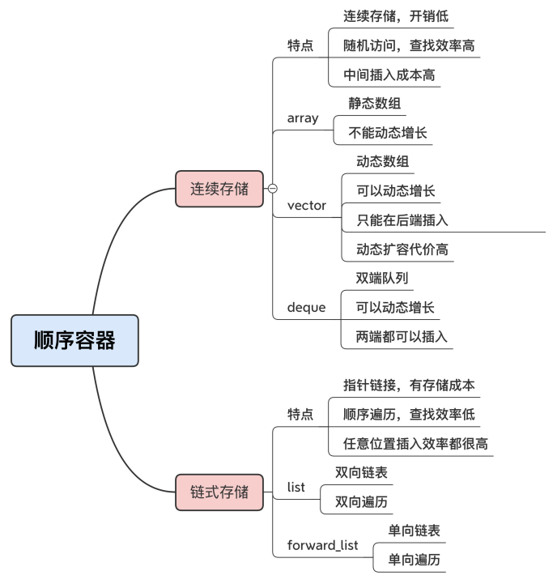
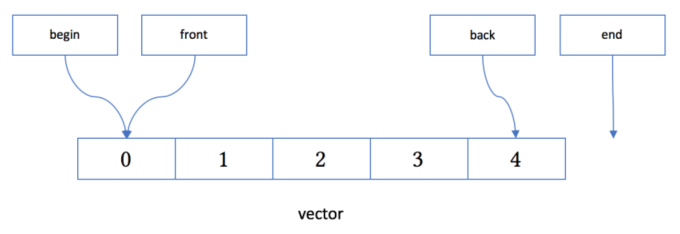
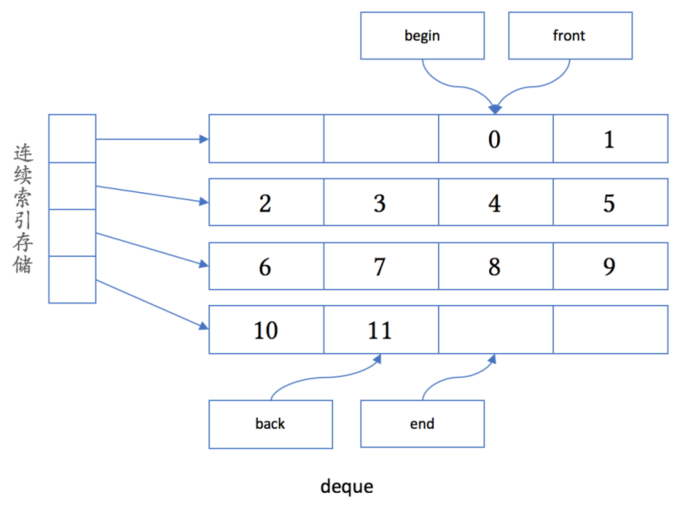
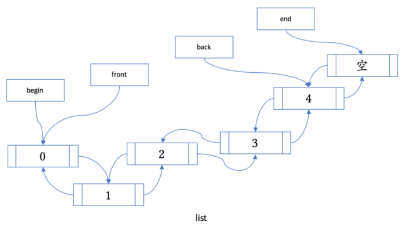
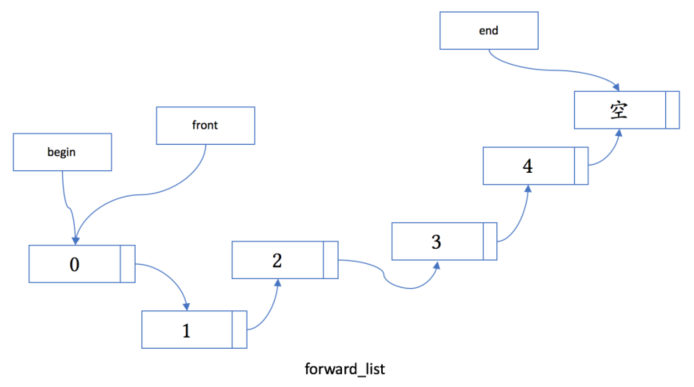
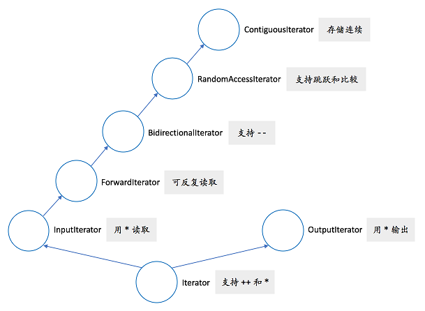

# 线性容器

## std::array

与 `std::vector` 不同，`std::array` 对象的大小是固定的，如果容器大小是固定的，那么可以优先考虑使用 `std::array` 容器。

由于 `std::vector` 是自动扩容的，当存入大量的数据后，并且对容器进行了删除操作，容器并不会自动归还被删除元素相应的内存，这时候就需要手动运行 `shrink_to_fit()` 释放这部分内存。

使用 `std::array` 很简单，只需指定其类型和大小即可：

```
std::array<int, 4> arr = { 1, 2, 3, 4 };

arr.empty(); // 检查容器是否为空
arr.size();  // 返回容纳的元素数
```

## std::forward_list

std::forward_list` 是一个列表容器，使用方法和 `std::list` 基本类似。

和 `std::list` 的双向链表的实现不同，`std::forward_list` 使用单向链表进行实现，提供了 `O(1)` 复杂度的元素插入，不支持快速随机访问（这也是链表的特点），也是标准库容器中唯一一个不提供 `size()` 方法的容器。当不需要双向迭代时，具有比 `std::list` 更高的空间利用率。

# 无序容器

传统 C++ 中的有序容器 std::map/std::set，这些元素内部通过红黑树进行实现，插入和搜索的平均复杂度均为 O(log(size))。在插入元素时候，会根据 < 操作符比较元素大小并判断元素是否相同，并选择合适的位置插入到容器中。当对这个容器中的元素进行遍历时，输出结果会按照 < 操作符的顺序来逐个遍历。

而无序容器中的元素是不进行排序的，内部通过 Hash 表实现，插入和搜索元素的平均复杂度为 O(n)，在不关心容器内部元素顺序时，能够获得显著的性能提升。

C++11 引入了两组无序容器：std::unordered_map/std::unordered_multimap 和 std::unordered_set/std::unordered_multiset。

有序容器内部是红黑树，插入元素时会自动排序。无序容器内部是散列表，通过哈希实现，不需要排序，因而效率更高。

因为无序容器内部是散列表，因此无序容器的 key 需要提供 hash_value 函数。对于自定义 key，需要提供 hash 函数和相等比较函数。

```
struct Key
{
	std::string first;
	std::string second;
};

struct KeyHash
{
	std::size_t operator()(const Key& k) const
	{
		return std::hash<std::string>()(k.first) ^ (std::hash<std::string>()(k.second) << 1);
	}
};

struct KeyEqual
{
	bool operator()(const Key& lhs, const Key& rhs) const
	{
		return lhs.first == rhs.first && lhs.second == lhs.second;
	}
};

int main()
{
	//@ 自定义类型需要提供哈希函数和比较函数
	std::unordered_map<Key, std::string, KeyHash, KeyEqual> m = {
		{{"John","Doe"},"example"},
		{{"Mary","Sue"},"another"}
	};
	return 0;
}
```

# std::tuple

std::tuple 元组是一个固定大小的不同类型值的集合。可以当作结构体用，又不需要创建结构体，但是对于多段结构体，为了可读性，建议不使用。

## 基本操作

- std::make_tuple: 构造元组
- std::get: 获得元组某个位置的值
- std::tie: 元组拆包，使用 std::ignore 忽略不想解包的元素
- std::forward_as_tuple: 创建右值引用元组

```
auto get_student(int id)
{
	if (id == 0)
		return std::make_tuple(6.7,'A',"Mike");
	if (id == 1)
		return std::make_tuple(9.0, 'B', "Tom");
	if (id == 2)
		return std::make_tuple(0.1, 'C', "Jim");
}

void print_pack(std::tuple<std::string&&, int&&> pack) 
{
	std::cout << std::get<0>(pack) << ", " << std::get<1>(pack) << '\n';
}

int main() {
	
	auto student = get_student(2);
	std::cout << std::get<0>(student) << ","
		<< std::get<1>(student) << ","
		<< std::get<2>(student) << "\n";


	double gpa;
	char grade;
	std::string name;

	std::tie(gpa, grade, std::ignore) = get_student(1);
	std::cout << gpa << "," << grade << ",";
		
	std::string str("John");
	print_pack(std::forward_as_tuple(str + " Smith", 25));
		
	return 0;
}
```

C++14 增加了使用类型来获取元组中的对象：

```
std::tuple<std::string, double, double, int> t("123", 4.5, 6.7, 8);
std::cout << std::get<std::string>(t) << std::endl;
//std::cout << std::get<double>(t) << std::endl; //@ 非法, 引发编译期错误
std::cout << std::get<3>(t) << std::endl;
```

## 运行期索引

std::get<> 依赖一个编译期的常量，所以下面的方式是不合法的：

```
int index = 1;
std::get<index>(t);
```

C++ 17 引入 std::variant<> ，可以让一个 variant<> 从而容纳提供的几种类型的变量:

```
template <size_t n, typename... T>
constexpr std::variant<T...> _tuple_index(const std::tuple<T...>& tpl, size_t i) {
    if constexpr (n >= sizeof...(T))
        throw std::out_of_range("越界.");
    if (i == n)
        return std::variant<T...>{ std::in_place_index<n>, std::get<n>(tpl) };
    return _tuple_index<(n < sizeof...(T)-1 ? n+1 : 0)>(tpl, i);
}

template <typename... T>
constexpr std::variant<T...> tuple_index(const std::tuple<T...>& tpl, size_t i) {
    return _tuple_index<0>(tpl, i);
}

template <typename T0, typename ... Ts>
std::ostream & operator<< (std::ostream & s, std::variant<T0, Ts...> const & v) { 
    std::visit([&](auto && x){ s << x;}, v); 
    return s;
}
```

这样就能：

```
int i = 1;
std::cout << tuple_index(t, i) << std::endl;
```

## 元组合并与遍历

合并两个元组可以通过 std::tuple_cat 来实现：

```
std::tuple<std::string, double, int> t1{"hello",3.45,10};
std::tuple<char, std::string> t2{'c'," world"};

auto t = std::tuple_cat(t1,t2);
```

获取元组的长度:

```
std::cout << std::tuple_size<decltype(t)>::value << std::endl;
```

# emplace_back 

emplace_back 能就地通过函数构造对象，不需要拷贝或者移动内存，相比于 push_back  能更好地避免内存的拷贝与移动，使容器插入元素的性能得到进一步提升。在大多数情况下应该优先使用 emplace_back 来代替 push_back。标准库中类似的方法有：emplace，emplace_hint，emplace_front，emplace_after，emplace_back。

emplace_back  通过构造函数的参数就可以构造对象，因此，要求对象有相应的构造函数，如果没有会编译报错。

```
struct Complicated
{
	int year_;
	double country_;
	std::string name_;

	Complicated(int a, double b, std::string s) : year_(a), country_(b), name_(s)
	{
		std::cout << "is constructed" << std::endl;
	}

	Complicated(const Complicated& other) : year_(other.year_), country_(other.country_), name_(other.name_)
	{
		std::cout << "is copied" << std::endl;
	}

	Complicated(Complicated&& other) : year_(other.year_), country_(other.country_), name_(other.name_)
	{
		std::cout << "is moved" << std::endl;
	}
};

int main()
{
	std::map<int, Complicated> m;
	int i = 4;
	double d = 5.0;
	std::string s = "C++";

	std::cout << "---insert---" << std::endl;
	m.insert(std::make_pair(1, Complicated(i, d, s)));

	std::cout << "---emplace---" << std::endl;
	m.emplace(2, Complicated(i, d, s));

	std::vector<Complicated> v;
	std::cout << "---emplace_back---" << std::endl;
	v.emplace_back(i, d, s);

	std::cout << "---push_back---" << std::endl;
	v.push_back(Complicated(i, d, s));

	return 0;
}
```

# 容器分类

C++ 里的容器很多，常见的一种分类是依据元素的访问方式，分成顺序容器、有序容器和无序容器三大类别。

## 顺序容器

顺序容器就是数据结构里的线性表，一共有 5 种：array、vector、deque、list、forward_list，按照存储结构，这 5 种容器又可以再细分成两组：

- 连续存储的数组：array、vector 和 deque  
- 指针结构的链表：list 和 forward_list  

array 和 vector 直接对应 C 的内置数组，内存布局与 C 完全兼容，所以是开销最低、速度最快的容器。它们两个的区别在于容量能否动态增长。array 是静态数组，大小在初始化的时候就固定了，不能再容纳更多的元素。而 vector 是动态数组，可以容纳任意数量的元素。    

deque 也是一种可以动态增长的数组，它和 vector 的区别是，它可以在两端高效地插入删除元素，这也是它的名字 double-end queue 的来历，而 vector 则只能 在末端追加元素。  

vector 和 deque 里的元素因为是连续存储的，所以在中间的插入删除效率就很低，而 list  和 forward_list 是链表结构，插入删除操作只需要调整指针，所以在任意位置的操作都很 高效。

链表的缺点是查找效率低，只能沿着指针顺序访问，这方面不如 vector 随机访问的效率 高。list 是双向链表，可以向前或者向后遍历，而 forward_list，顾名思义，是单向链表， 只能向前遍历，查找效率就更低了。

链表结构比起数组结构还有一个缺点，就是存储成本略高，因为必须要为每个元素附加一个 或者两个的指针，指向链表的前后节点。

vector/deque 和 list/forward_list 都可以动态增长来容纳更多的元素，但它们的内部扩容 机制却是不一样的。

当 vector 的容量到达上限的时候（capacity），它会再分配一块两倍大小的新内存，然后 把旧元素拷贝或者移动过去。这个操作的成本是非常大的，所以，你在使用 vector 的时候 最好能够“预估”容量，使用 reserve 提前分配足够的空间，减少动态扩容的拷贝代价。

vector 的做法太“激进”，而 deque、list 的的扩容策略就“保守”多了，只会按照固定 的“步长”（例如 N 个字节、一个节点）去增加容量。但在短时间内插入大量数据的时候 就会频繁分配内存，效果反而不如 vector 一次分配来得好。

如果没有什么特殊需求，首选的容器就是 array 和 vector，它们的速度最 快、开销最低，数组的形式也令它们最容易使用，搭配算法也可以实现快速的排序和查找。 剩下的 deque、list 和 forward_list 则适合对插入删除性能比较敏感的场合，如果还很在意空间开销，那就只能选择非链表的 deque 了。



std::vector 的内存布局：



std::deque 的内存布局：



std::list 的内存布局：



std::forward_list 的内存布局：



## 有序容器

顺序容器的特点是，元素的次序是由它插入的次序而决定的，访问元素也就按照最初插入的 顺序。而有序容器则不同，它的元素在插入容器后就被按照某种规则自动排序，所以是“有 序”的。

C++ 的有序容器使用的是树结构，通常是红黑树——有着最好查找性能的二叉树。标准库里一共有四种有序容器：set/multiset 和 map/multimap。set 是集合，map 是关 联数组。有 multi 前缀的容器表示可以容纳重复的 key，内部结构与无前缀的相同。

在定义容器的时候必须要指定 key 的 比较函数。只不过这个函数通常是默认的 less，表示小于关系，不用特意写出来：

```
template<class Key,class Compare = std::less<Key>>
class set;

template<class Key,class T,class Compare = std::less<Key>>
class map;
```

但很多自定义类型没有默认的比较函数，要作为容器的 key 就有点麻烦。解决这个问题有两种办法：一个是重载“<”，另一个是自定义模板参数。

```
class Edge final
{
public:
	Edge(int u, int v) : u_(u), v_(v)
	{
	}

	bool operator < (const Edge& edge) const noexcept
	{
		return this->u_ < edge.u_;
	}

private:
	int u_;
	int v_;
};

//@ 或者使用全局定义
bool operator < (const Edge& lhs, const Edge& rhs)
{
	return lhs.u_ < rhs.u_;
}

std::set<Edge> edge_set;
edge_set.emplace(1, 2);
edge_set.emplace(3, 4);
```

另一种方式是编写专门的函数对象或者 lambda 表达式，然后在容器的模板参数里指定。 这种方式更灵活，而且可以实现任意的排序准则：

```
struct EdgeComp
{
	bool operator()(const Edge& lhs, const Edge& rhs)
	{
		return lhs.u_ < rhs.v_;
	}
};

std::set<Edge, EdgeComp> edge_set;
edge_set.emplace(1, 2);
edge_set.emplace(3, 4);
```

因为有序容器在插入的时候会自动排序，所以就有隐含的插入排 序成本，当数据量很大的时候，内部的位置查找、树旋转成本可能会比较高。

如果你需要实时插入排序，那么选择 set/map 是没问题的。如果是非实时，那么最 好还是用 vector，全部数据插入完成后再一次性排序，效果肯定会更好。

## 无序容器

无序容器也有四种，名字里也有 set 和 map，只是加上了 unordered（无序）前缀，分别 是 unordered_set/unordered_multiset、unordered_map/unordered_multimap。

无序容器同样也是集合和关联数组，用法上与有序容器几乎是一样的，区别在于内部数据结 构：它不是红黑树，而是散列表（也叫哈希表，hash table）。

因为它采用散列表存储数据，元素的位置取决于计算的散列值，没有规律可言，所以就 是“无序”的，你也可以把它理解为“乱序”容器。

无序容器虽然不要求顺序，但是对 key 的要求反而比有序容器更“苛刻”一些：

```
/*
 - key 类型
 - 元素类型
 - 散列值的函数对象
 - 相等比较函数
*/
template<class Key,class T,class Hash = std::hash<Key>,class KeyEqual = std::equal_to<Key>>
class unordered_map;
```

它要求 key 具备两个条件，一是可以计算 hash 值，二是能够执行相等比较操作。第一个 是因为散列表的要求，只有计算 hash 值才能放入散列表，第二个则是因为 hash 值可能会 冲突，所以当 hash 值相同时，就要比较真正的 key 值。要把自定义类型作为 key 放入无序容器，必须要实现这两个函数。

“==”函数比较简单，可以通过重载操作符来实现，或者定义函数对象或者 lambda 表达式。散列函数就略麻烦一点，你可以用函数对象或者 lambda 表达式实现，内部最好调用标准 的 std::hash 函数对象，而不要自己直接计算，否则很容易造成 hash 冲突。

```
auto edge_hash = [](const Edge& rhs)
{
	return std::hash<int>()(rhs.u_);
};

std::unordered_set<Edge, decltype(edge_hash)> s(10, edge_hash);
s.emplace(1, 2);
s.emplace(4, 5);
```

如果只想要单纯的集合、字典，没有排序需求，就应该用无序容 器，没有比较排序的成本，它的速度就会非常快。

## 容器适配器

容器适配器特别点在于它们都不是完整的实现，而是依赖于某个现有的容器。

queue  是先进先出（FIFO）的数据结构。queue 缺省用 deque 来实现。它的实际内存布局当然是随底层的容器而定的。从概念上讲，它的结构可如下所示：    

stack 是后进先出（LIFO）的数据结构。  stack 缺省也是用 deque 来实现 。 

priority_queue  在使用缺省的 less 作为其 Compare 模板参数时，最大的数值会出现在容器的“顶部”。如果需要最小的数值出现在容器顶部，则可以传递 greater 作为其 Compare 模板参数。  

## 总结


# 算法

## 迭代器

C++ 里的迭代器也有很多种，比如输入迭代器、输出迭代器、双向迭代器、随机访问迭代器。



容器一般都会提供 begin()、end() 成员函数，调用它们就可以得到表示两个端点的迭代 器，具体类型最好用 auto 自动推导，不要过分关心。也可以使用更加通用的全局函数 begin()、end()，虽然效果是一样的，但写起来比较方便，看起来也更清楚（另外还有 cbegin()、cend() 函数，返回的是常量迭代器）：

```
std::vector<int> vec{1,2,3,4,5,6};

auto it1 = std::begin(vec);
auto it2 = std::cbegin(vec);
```

迭代器和指针类似，也可以前进和后退，但你不能假设它一定支持“++”，“--”操作符， 最好也要用函数来操作，常用的有这么几个：

- distance()，计算两个迭代器之间的距离
- advance()，前进或者后退 N 步
- next()/prev()，计算迭代器前后的某个位置

一般而言，iterator 可写入，  const_iterator 类型不可写入。

back_inserter 返回的类型 back_inserter_iterator，用它我们可以很方便地在容器的尾部进行插入操作。

ostream_iterator，方便我们把容器内容“拷贝”到一个输出流。

 ```
std::vector<int> v1{1,2,3};
std::vector<int> v2;

std::copy(v1.begin(), v1.end(), std::back_inserter(v2));	
std::copy(v2.begin(), v2.end(), std::ostream_iterator<int>(std::cout,","));
 ```

## 常用算法

### 手写循环的替代品

```
std::vector<int> vec{1,2,3,4,5,6};

std::for_each(vec.begin(), vec.end(), [](const int& val) {std::cout << val << std::endl; });
```

### 排序算法

C++ 准备了多种不同的排序算法：

- 快速排序算法，应该用 sort，通常用它准没错
- 要求排序后仍然保持元素的相对顺序，应该用 stable_sort，它是稳定的
- 选出前几名（TopN），应该用 partial_sort
- 选出前几名，但不要求再排出名次（BestN），应该用 nth_element
- 中位数（Median）、百分位数（Percentile），应该用 nth_element
- 按照某种规则把元素划分成两组，应该用 partition
- 第一名和最后一名，应该用 min_element，max_element，minmax_element

```
std::vector<int> vec{ -1,9,3,0,1,2,5,4,7,8,3,6,3 };

//@ 排序前3名
std::partial_sort(vec.begin(),std::next(vec.begin(),3),vec.end());
//@ 中位数
auto mid_it = std::next(vec.begin(),vec.size()/2);
std::nth_element(vec.begin(), mid_it, vec.end());
auto mid = *mid_it;
//@ 找出大于 6 的所有数字
auto pos = std::partition(vec.begin(), vec.end(), [](const int& x) {
return x > 6;
});
std::vector<int> bigeer_than_6(vec.begin(),pos);
//@ 最大值和最小值
auto value = std::minmax_element(vec.begin(),vec.end());
auto min_val = *value.first;
auto max_val = *value.second;
```

在使用这些排序算法时，还要注意一点，它们对迭代器要求比较高，通常都是随机访问迭代 器（minmax_element 除外），所以最好在顺序容器 array/vector 上调用。

如果是 list 容器，应该调用成员函数 sort()，它对链表结构做了特别的优化。有序容器 set/map 本身就已经排好序了，直接对迭代器做运算就可以得到结果。而对无序容器，则 不要调用排序算法，原因你应该不难想到（散列表结构的特殊性质，导致迭代器不满足要 求、元素无法交换位置）。

### 查找算法

算法 binary_search，顾名思义，就是在已经排好序的区间里执行二分查找。但糟糕的是， 它只返回一个 bool 值，告知元素是否存在，而更多的时候，我们是想定位到那个元素，所 以 binary_search 几乎没什么用。

```
std::vector<int> vec{ -1,9,3,0,1,2,5,4,7,8,3,6,3 };
std::sort(vec.begin(),vec.end());
bool found = std::binary_search(vec.begin(),vec.end(),9);
```

想要在已序容器上执行二分查找，要用到一个名字比较怪的算法：lower_bound，它返回 第一个“大于或等于”值的位置，lower_bound 的返回值是一个迭代器，所以就要做一点判断工作，才能知道是否真的找到 了。判断的条件有两个，一个是迭代器是否有效，另一个是迭代器的值是不是要找的值。

注意 lower_bound 的查找条件是“大于等于”，而不是“等于”，所以它的真正含义 是“大于等于值的第一个位置”。相应的也就有“大于等于值的最后一个位置”，算法叫 upper_bound，返回的是第一个“大于”值的元素。

它俩的返回值构成一个区间，这个区间往前就是所有比被查找值小的元素，往后就是所有比 被查找值大的元素，可以写成一个简单的不等式：

```
begin < x <= lower_bound < upper_bound < end
```

对于有序容器 set/map，就不需要调用这三个算法了，它们有等价的成员函数 find/lower_bound/upper_bound，效果是一样的。

```
std::multiset<int> s{3,5,1,2,3,3,6,6,7,8};
auto pos = s.find(8);

auto lower_pos = s.lower_bound(6);
auto upper_pos = s.upper_bound(6);

std::for_each(lower_pos, upper_pos, [](const int x) {std::cout << x << std::endl; });
```

除了 binary_search、lower_bound 和 upper_bound，标准库里还有一些查找算法可以 用于未排序的容器，虽然肯定没有排序后的二分查找速度快，但也正因为不需要排序，所以 适应范围更广。这些算法以 find 和 search 命名，其中用于查找区间的 find_first_of/find_end。

```
std::vector<int> vec{ -1,9,3,0,1,2,5,4,7,8,3,6,3 };
auto pos = std::find_if(vec.begin(), vec.end(), [](const int& x) {return x % 2 == 0; });

std::array<int, 2> arr{ 7, 8 };
pos = std::find_first_of(vec.begin(), vec.end(), arr.begin(), arr.end());
```

