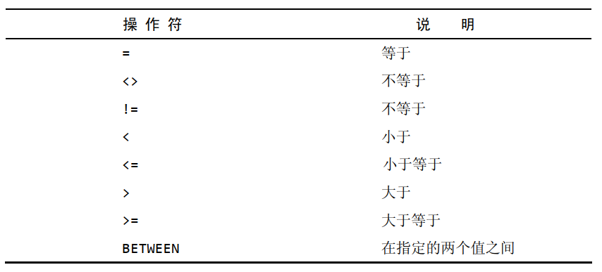
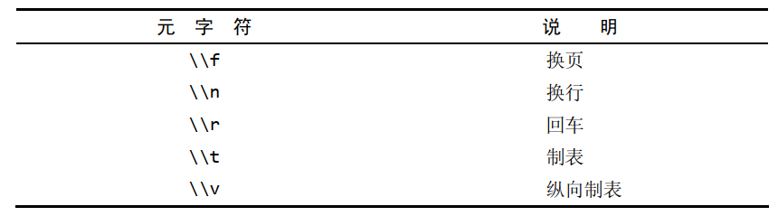
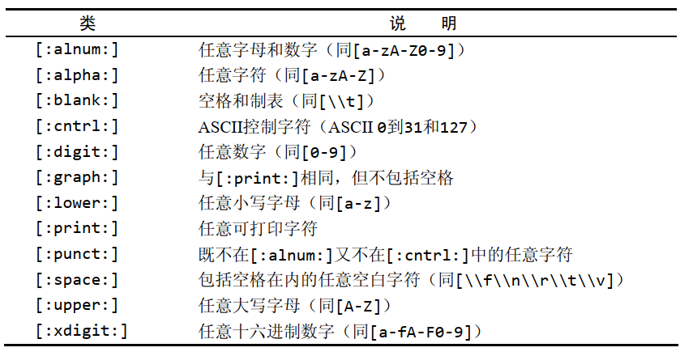

# 了解SQL  

- 数据库（database） 保存有组织的数据的容器（通常是一个文件或一组文件）
- 表（table） 某种特定类型数据的结构化清单  
- 模式（schema） 关于数据库和表的布局及特性的信息  
- 列（column） 表中的一个字段。所有表都是由一个或多个列组成的
- 数据类型（datatype） 所容许的数据的类型。每个表列都有相应的数据类型，它限制（或容许）该列中存储的数据   
- 行（row） 表中的一个记录  
- 主键（primary key）一列（或一组列），其值能够唯一区分表中每个行   
  - 任意两行都不具有相同的主键值  
  - 每个行都必须具有一个主键值（主键列不允许NULL值）  

SQL 是结构化查询语言（Structured Query Language）的缩写。 SQL是一种专门用来与数据库通信的语言。  

# 使用MySQL  

选择数据库：

```
USE <数据库名称>
```

查看可用数据库的一个列表：

```
SHOW DATABASE;
```

获得一个数据库内的表的列表：

```
SHOW TABLES;
```

显示表列：

```
SHOW COLUMNS FROM <表名称>;
DESCRIBE <表名称>;
```

显示服务器错误或警告消息：

```
SHOW ERRORS;
SHOW WARNINGS;
```

# 检索数据

检索单个列：

```
SELECT <列名称> FROM <表名称>;
```

检索多个列：

```
SELECT <列名称1>,<列名称2>,<列名称3>,... FROM <表名称>;
```

检索所有列：

```
SELECT * FROM <表名称>;
```

**一般，除非你确实需要表中的每个列，否则最好别使用*通配符。虽然使用通配符可能会使你自己省事，不用明确列出所需列，但检索不需要的列通常会降低检索和应用程序的性能。**  

检索不同的行：

```
SELECT DISTINCT <列名称> FROM <表名称>;
```

**不能部分使用DISTINCT DISTINCT关键字应用于所有列而不仅是前置它的列。如果给出SELECT DISTINCT column1,column2，除非指定的两个列都不同，否则所有行都将被检索出来。    **

限制结果：

```
SELECT <列名称> FROM <表名称> LIMIT <限制行数>;
```

返回不超过"限制数量"的行数。

```
SELECT <列名称> FROM <表名称> LIMIT <偏移行数>,<限制行数>;
SELECT <列名称> FROM <表名称> LIMIT <限制行数> OFFSET <偏移行数>;
```

**LIMIT中指定要检索的行数为检索的最大行数。如果没有足够的行， MySQL将只返回它能返回的那么多行。**

使用完全限定的表名：

```
SELECT <表名称>.<列名称> FROM <表名称>;
SELECT <表名称>.<列名称> FROM <库名称>.<表名称>;
```

# 排序检索数据

**关系数据库设计理论认为，如果不明确规定排序顺序，则不应该假定检索出的数据的顺序有意义。  **

```
SELECT <查询列名称> FROM <表名称> ORDER BY <排序列名称>;
```

按多个列排序：

```
SELECT <查询列名称> FROM <表名称> ORDER BY <排序列名称1>,<排序列名称2>;
```

**排序完全按所规定的顺序进行。**

指定排序方向：

降序排列使用 DESC，升序排列使用 ASC，默认是升序排列。

```
SELECT <查询列名称> FROM <表名称> ORDER BY <排序列名称> DESC;
```

多个列排序：

```
SELECT <查询列名称> FROM <表名称> ORDER BY <排序列名称1> <序列形式>,<排序列名称2> <序列形式>;
```

如果是升序上面的"序列形式"可以省略，但是如果是降序则必须指明。

# 过滤数据

```
SELECT <列名称> FROM <表名称> WHERE <条件>;
```

WHERE子句操作符：



**MySQL在执行匹配时默认不区分大小写。**

范围值检查：

```
SELECT <列名称> FROM <表名称> WHERE <条件列名称> BETWEEN <value_samll> AND <value_big>;
```

**在使用BETWEEN时，必须指定两个值即所需范围的低端值和高端值。这两个值必须用AND关键字分隔。 BETWEEN匹配范围中所有的值，包括指定的开始值和结束值。**  

检查具有NULL值的列：

````
SELECT <列名称> FROM <表名称> WHERE <条件列名称> IS NULL;
````

**NULL 无值（no value），它与字段包含0、空字符串或仅仅包含空格不同。**  

**操作符（operator） 用来联结或改变WHERE子句中的子句的关键字。也称为逻辑操作符（ logical operator） 。 ** 

AND操作符：

```
SELECT <列名称> FROM <表名称> WHERE <条件1> AND <条件2>;
```

OR操作符：

```
SELECT <列名称> FROM <表名称> WHERE <条件1> OR <条件2>;
```

IN操作符：

```
SELECT <列名称> FROM <表名称> WHERE <列名称> IN (value1,value2,...);
```

**IN操作符用来指定条件范围，范围中的每个条件都可以进行匹配。 IN取合法值的由逗号分隔的清单，全都括在圆括号中。**

- IN操作符一般比OR操作符清单执行更快  
- 在使用长的合法选项清单时， IN操作符的语法更清楚且更直观  
- 在使用IN时，计算的次序更容易管理（因为使用的操作符更少）  
- IN的最大优点是可以包含其他SELECT语句，使得能够更动态地建立WHERE子句  

NOT操作符：

```
SELECT <列名称> FROM <表名称> WHERE NOT <条件>;
```

**WHERE子句中的NOT操作符有且只有一个功能，那就是否定它之后所跟的任何条件。**  

# 用通配符进行过滤  

LIKE操作符：

- 通配符（wildcard） 用来匹配值的一部分的特殊字符
  - 不要过度使用通配符。如果其他操作符能达到相同的目的，应该使用其他操作符
  - 在确实需要使用通配符时，除非绝对有必要，否则不要把它们用在搜索模式的开始处。把通配符置于搜索模式的开始处，搜索起来是最慢的  
  - 仔细注意通配符的位置。如果放错地方，可能不会返回想要的数据  
- 搜索模式（search pattern）由字面值、通配符或两者组合构成的搜索条件

百分号（ %）通配符：

```
SELECT <列名称> FROM <表名称> WHERE LIKE <"prefix%suffix">;
```

**%表示任何字符出现任意次数。**

**根据MySQL的配置方式，搜索可以是区分大小写的。  **

下划线 （ _）通配符：

```
SELECT <列名称> FROM <表名称> WHERE LIKE <"prefix_suffix">;
```

**下划线总是匹配一个字符，不能多也不能少  。  **

MySQL中的匹配不区分大小写。为区分大小写，可使用BINARY关键字：

```
SELECT <列名称>  FROM <表名称> WHERE <表名称> LIKE BINARY <表达式>;
```


# 使用MySQL正则表达式  

基本字符匹配：

```
SELECT <列名称>  FROM <表名称> WHERE <表名称> REGEXP <'正则表达式'>;
```

进行OR匹配：

```
SELECT <列名称>  FROM <表名称> WHERE <表名称> REGEXP <'表达式1 | 表达式2 | 表达式3...''>;
```

匹配几个字符之一：

```
SELECT <列名称>  FROM <表名称> WHERE <表名称> REGEXP <'[字符集]'>;
```

匹配范围：

```
SELECT <列名称>  FROM <表名称> WHERE <表名称> REGEXP <'[a-z0-9]'>;
```

匹配特殊字符：

```
SELECT <列名称>  FROM <表名称> WHERE <表名称> REGEXP <'\\特殊字符'>;
```

空白元字符：



匹配字符类：



匹配多个实例：

