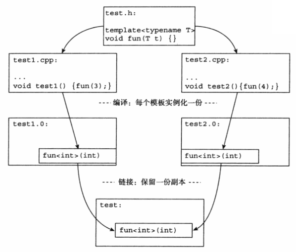
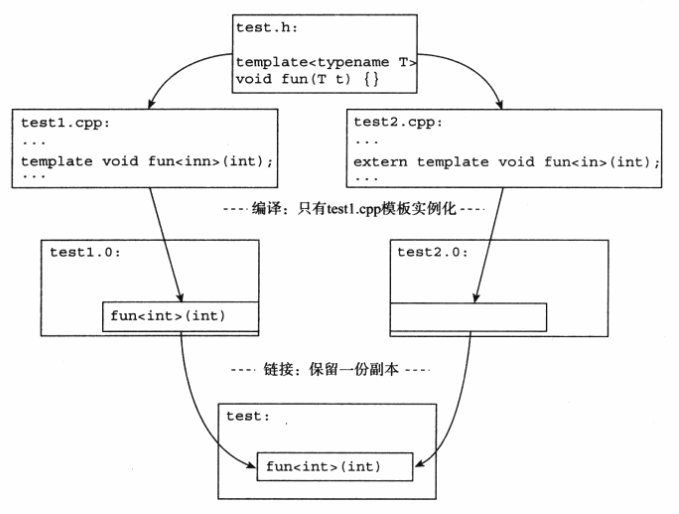
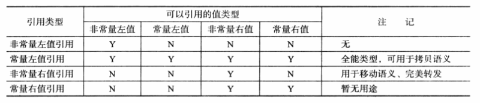

# 稳定性与兼容性

## 宏

C++ 11 中定义了与预处理指令 `#pragma` 功能相同的操作符 `_Pragma`，格式为：

```
_Pragma (字符串字面量)
```

例如：

```
_Pragma("once");
```

变长参数的宏定义是指在宏定义中参数列表的最后一个参数为省略号，预定义宏 `__VA_ARGS__` 则可以在宏定义实现部分替换省略号所代表的字符串：

```
#define LOG(...)                                              \
    {                                                         \
        fprintf(stderr, "%s:Line %d:\t", __FILE__, __LINE__); \
        fprintf(stderr, __VA_ARGS__);                         \
        fprintf(stderr, "\n");                                \
    }
```

##　long long

C++ 11 整型的最大改变就是多了 long long 类型：long long 和 unsigned long long，可以使用 LL 后缀或者 ll 后缀 标识 long long 类型，ULL，ull，Ull，uLL 标识 unsigned long long 类型的字面量。

C++ 11 要求 long long 类型在不同的平台上有不同的长度，但是至少 64 位。

## 断言

断言就是将一个返回值总是需要为真的判别式放在语句中，用于排除在设计的逻辑上不应该产生的情况。`<cassert>` 中定义的 `assert` 宏用于运行时断言。使用 `NDEBUG` 可以禁用 `assert` 宏：

```
#ifdef NDEBUG
#define assert(expr)   (static_cast<void>(0))
#else
...
#endif
```

静态断言 `static_assert(表达式,警告信息)` 作用在编译时期，`static_assert` 的断言表达式的结果必须是在编译时期可以计算的表达式，即必须是常量表达式。

## noexcept 修饰符与 noexcept 操作符

`noexcept` 修饰符有两种形式：

- 简单地在函数声明后加上 `noexcept`

```
void func() noexcept;
```

- 可以接受一个常量表达式作为参数，常量表达式会被转换成一个 bool 类型的值，该值为 true 表示函数不会抛出异常，反之则可能抛出异常

```
void func() noexcept(常量表达式);
```

C++ 11 中如果 `noexcept` 修饰的函数抛出了异常，编译器可以直接选择调用 `std::terminate()` 函数终止程序。

`noexcept` 操作符通常可以用于模板：

```
template <typename T>
void func() noexcept(noexcept(T()))
{}
```

第二个 `noexcept` 是一个操作符，其参数 `T()` 有可能抛出异常的时候返回 false，否则返回 true。

C++ 11 标准中让类的析构函数默认是 `noexcept(true)` 的，如果显示的指定了析构函数 `noexcept` 或者类的基类或者成员中有 `noexcept(false)` 析构函数，析构函数就不会保持默认值。

## 快速初始化成员变量

C++ 11 中允许对非静态成员变量使用 `=` 或者 `{}` 执行就地初始化。

```
struct TEST
{
    std::string s1{"hello"};  //@ OK
    std::string s2 = "hello"; //@ OK
    std::string s3("hello");  //@ ERROR
};
```

对于非常量的静态成员变量，C++ 11 与 C++ 98 保持一致，程序需要在头文件外定义它，这会保证编译时，类静态成员的定义最后只存在于一个目标文件中。

## 扩展的 friend 语法

firend 关键字用于声明类的友元，友元可以无视类中成员的属性，无论成员是 public，protected，private的，友元类或友元函数都可以访问，这就破坏了封装性，因而存在一定的争议。

C++ 11 中声明一个类为另一个类的友元时， 不需要使用 class 关键字。这一改变使得可以为类模板声明友元。

```
class P;

template <typename T>
class People
{
	friend T;
};

People<P> pp;	//@ 类型 P 是 People 类型的友元
People<int> pi;	//@ 对于 int 类型模板参数，友元声明被忽略
```

## final/override 控制

C++ 11 中 final 关键字作用是使派生类不可覆盖它所修饰的虚函数。

C++ 中还有一个特点，就是对于基类声明为 virtual 的函数，之后重载的版本都不需要再声明该函数为 virtual，即使在派生类中声明了 virtual，该关键字也是编译器可以忽略的。C++ 11 引入了 override，如果派生类在虚函数声明时使用了 override 描述符，那么该函数就必须在其基类中的同名函数，否则代码将无法通过编译。

## 模板函数的默认模板参数

C++ 11 中模板和函数一样，可以有默认的参数。

默认类模板参数的定义需要按照从右向左的顺序定义，否则编译无法通过：

```
//@ 编译通过
template<typename T1,typename T2 = int>
class DefClass1;

//@ 编译无法通过
template<typename T1 = int, typename T2>
class DefClass2;
```

函数模板的默认模板参数的位置则比较随意：

```
//@ 编译通过
template<typename T1 = int,typename T2>
void DefFunc1(T1 a, T2 b);

//@ 编译通过
template<typename T1, int a = 0>
void DefFunc2(T1 a);
```

## 外部模板

考虑如下情况：

`test.h` 中声明一个目标函数：

```
template <typename T>
void fun(T t)
{}
```

`test1.cpp` 中定义：

```
#include "test.h"

void test1()
{
	fun(3);
}
```

`test2.cpp` 中定义：

```
#include "test.h"

void test2()
{
	fun(4);
}
```

由于两个源代码使用的模板函数的参数类型一致，所以在编译 `test1.cpp` 和 `test2.cpp` 时候都会实例化函数 `func<int>(int)`，就会导致代码重复。



解决办法：

`test1.cpp`：

```
#include "test.h"

template void fun<int>(int);	//@ 显示实例化
void test1()
{
	fun(3);
}
```

`test2.cpp`：

```
#include "test.h"

extern template void fun<int>(int); 	//@ 外部模板声明
void test2()
{
	fun(4);
}
```



C++ 11 中允许局部类型和匿名类型做模板类的实参：

```
template <typename T>
class X
{
};

template <typename T>
void TempFunc(T t)
{
}

struct A
{
} a;

struct
{
    int i;
} b; //@ b 是匿名类型变量
typedef struct
{
    int i;
} B; //@ B 是匿名类型

int main()
{
    struct C
    {
    } c; //@ c是局部变量

    X<A> x1;
    X<B> x2;
    X<C> x3;
 }
```

# 通用为本，专用为末

## 继承构造函数

派生类构造基类时，通常通过"透传"的方式实现：

```
struct A
{
	A(int i) {}
	A(double d, int i) {}
};


struct  B : A
{
	B(int i) :A(i) {}
	B(double d, int i) : A(d, i) {}
};
```

C++ 11 中子类可以使用 `using` 声明来声明继承基类的构造函数：

```
struct A
{
	A(int i) {}
	A(double d, int i) {}
};


struct B : A
{
	using A::A; //@ 继承构造函数
};
```

通过继承构造函数，把基类的构造函数系数继承到派生类 B 中，如此"透传"的方式就不需要了，并且 C++ 11 标准继承构造函数被设计为跟派生类中的各种类默认函数(默认构造，析构，拷贝构造等)一样是隐式声明的，这意味着如果一个继承构造函数不被相关代码使用，编译器不会为期产生真正的代码，这相比于 "透传" 方式节省了目标代码空间。

不过继承构造函数只会初始化基类中的成员变量，对于派生类中的成员变量则无能为力。因而在派生类中一般会使用成员变量初始化的方式：

```
struct A
{
	A(int i) {}
	A(double d, int i) {}
};


struct B : A
{
	//using A::A; //@ 继承构造函数
	int i{ 0 }; //@ 成员变量初始化
};
```

有的时候，基类构造函数的参数会有默认值，对于继承构造函数来讲，参数的默认值是不会被继承，事实上，默认值会导致基类产生多个构造函数的版本，这些函数版本都会被派生类继承：

```
struct A {
	A(int a = 3, double b = 2.4) 
	{}
};

struct B : A
{
	using A::A;
};
```

B 可能从A 中继承：

```
A(int a = 3, double b = 2.4);  //@ 使用两个参数的情况	
A(int a = 3);	//@ 减掉一个参数的情况
A(const A&);	//@ 默认的复制构造函数
A();		   //@ 不使用参数的情况

B(int, double);  	//@ 继承构造函数
    B(int a);	   //@ 减掉一个参数的继承构造函数
B(const B&);	  //@ 复制构造函数，不是继承来的
B();		     //@ 不含参数的默认构造函数
```

继承构造函数冲突的情况，通常发生在派生类拥有多个基类的时候：

```
struct A
{
	A(int) {}
};

struct B
{
	B(int) {}
};


struct C : A,B
{
	using A::A;
	using B::B;
};
```

继承类中的冲突的构造函数将导致不合法的派生类代码。为了解决此问题，可以显式定义继承类的冲突构造函数，阻止隐式生成相应的继承构造函数：

```
struct A
{
	A() = default;
	A(int) {}
};

struct B
{
	B() = default;
	B(int) {}
};


struct C:A,B
{
	using A::A;
	using B::B;
	C(int) {}
};
```

## 委派构造函数

委派构造函数也是 C++ 11 构造函数的一项改进：

```
class A
{
public:
	A(int num) : A(num,'a'){}
	A(char c) : A(1,c) {}

private:
	A(int i, char c) : number(i), name(c) {}
	int number;
	char name;
};
```

对于异常：

```
class DExcept
{
public:
	DExcept(double d) try : DExcept(1, d) {
		//@ ...
	}
	catch (...)
	{
		//@ ...
	}

private:
	DExcept(int i, double d) : ii(i), dd(d)
	{
		//@ ...
	}

	int ii;
	double dd;

};
```

## 右值引用

如果类中包含一个指针成员，编写拷贝构造函数时应该特别注意，因为默认生成的拷贝构造函数执行浅拷贝，可能导致内存泄露。一般使用深拷贝代替浅拷贝解决此问题。

C++ 11 中可以使用移动构造函数减少拷贝次数，提高执行效率。

## 左值、右值与右值引用

笼统定义：

- 赋值表达式左侧的为左值，赋值表达式右侧的为右值
- 可以取地址的有名字的是左值，不能取地址，没有名字的是右值

C++ 11 中右值得概念：

- 将亡值

  - 返回右值引用的 T&& 的函数返回值
  - std::move() 的返回值
  - 转换为 T&& 类型转换函数的返回值

- 纯右值

  - 非引用返回的函数返回值
  - 一些表达式：1+2
  - 字面量：2，"hi"，true
  - 类型转换函数的返回值
  - lambda 表达式


C++ 11 中所有的值必属于左值，将亡值，纯右值三者之一。

C++ 11 中右值引用就是对一个右值进行引用的类型，由于右值通常不具有名字，通常只能通过引用的方式找到它的存在。

```
T && t = ReturnValue();
```

`ReturnValue()` 返回的右值再表达式语句结束之后，其""生命就终结"了，通过右值引用的声明，该右值又"重获新生"，相比于：

```
T t = ReturnValue();
```

减少了一次对象的析构和一次对象构造。

但是需要注意的是 `ReturnValue()` 返回的必须是一个右值，通常情况下，右值引用无法绑定到任何的左值的。



判断引用类型：

```
#include <type_traits>

is_rvalue_reference<>;
is_lvalue_reference<>;
is_reference<>;
```

## std::move

`std::move()`  的作用是强制一个左值成为右值，实际上等同于一个强制类型转换：

```
static_cast<T&&>(lvalue);
```

## 移动语义的一些问题

```
Moveable(const Moveable &&);
const Moveable ReturnVal();
```


