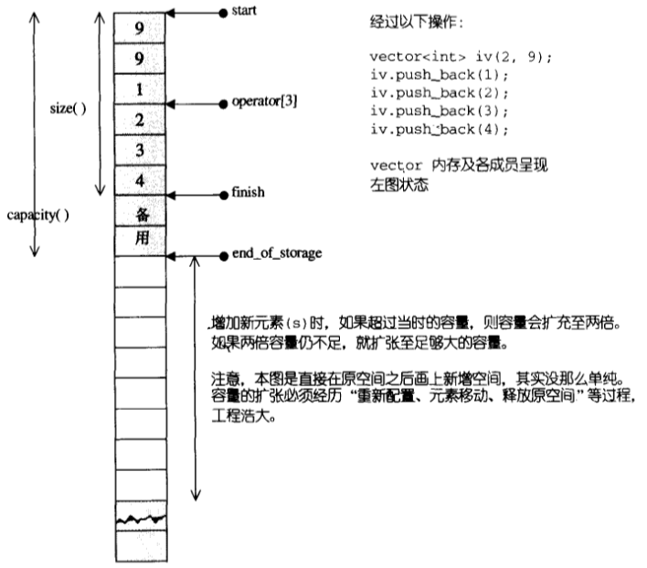
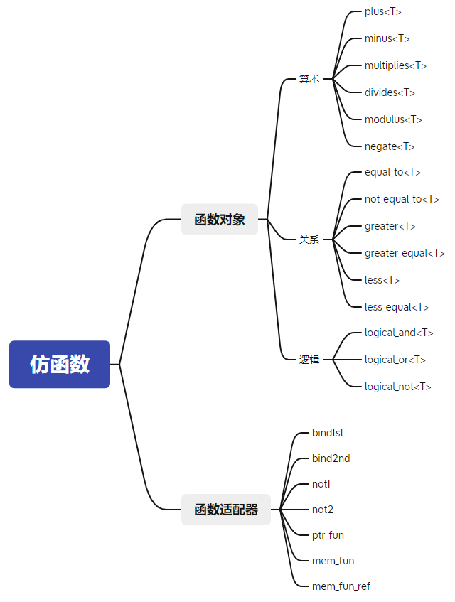

# 顺序容器

顺序容器就是数据结构里的线性表，一共有 5 种：array、vector、deque、list、forward_list，按照存储结构，这 5 种容器又可以再细分成两组：

- 连续存储的数组：array、vector 和 deque  
- 指针结构的链表：list 和 forward_list  

## std::vector

由于 std::vector 是自动扩容的，当存入大量的数据后，并且对容器进行了删除操作，容器并不会自动归还被删除元素相应的内存，这时候就需要手动运行 shrink_to_fit() 释放这部分内存。

当 vector 的容量到达上限的时候，它会再分配一块两倍大小的新内存，然后把旧元素拷贝或者移动过去。这个操作的成本是非常大的，所以在使用 vector 的时候 最好能够“预估”容量，使用 reserve 提前分配足够的空间，减少动态扩容的拷贝代价。




## std::array

std::array 对象的大小是固定的，如果容器大小是固定的，那么可以优先考虑使用 std::array 容器。使用 std::array 很简单，只需指定其类型和大小即可：

```
std::array<int, 4> arr = { 1, 2, 3, 4 };
```

## std::deque 

deque 也是一种可以动态增长的数组，它和 vector 的区别是，它可以在两端高效地插入删除元素，这也是它的名字 double-end queue 的来历，而 vector 则只能 在末端追加元素。  


deque 的迭代器十分复杂，因而要尽量避免使用 deque，尽量使用 vector，例如给 deque 排序时，可以先将元素复制到 vector 中，排序完成后再复制回 deque。


deuqe 中控器、缓冲区、迭代器之间的关系：


## std::list

list 是双向链表，可以向前或者向后遍历。


## std::forward_list

和 std::list 的双向链表的实现不同，std::forward_list 使用单向链表进行实现，提供了 O(1)  复杂度的元素插入，不支持快速随机访问（这也是链表的特点），也是标准库容器中唯一一个不提供 size() 方法的容器。当不需要双向迭代时，具有比 std::list 更高的空间利用率。

## 小结


- array 和 vector 直接对应 C 的内置数组，内存布局与 C 完全兼容，所以是开销最低、速度最快的容器
- vector 和 deque 里的元素因为是连续存储的，所以在中间的插入删除效率就很低，而 list  和 forward_list 是链表结构，插入删除操作只需要调整指针，所以在任意位置的操作都很 高效
- 链表的缺点是查找效率低，只能沿着指针顺序访问，这方面不如 vector 随机访问的效率高
- 链表结构比起数组结构还有一个缺点，就是存储成本略高，因为必须要为每个元素附加一个 或者两个的指针，指向链表的前后节点
- 如果没有什么特殊需求，首选的容器就是 array 和 vector，它们的速度最快、开销最低，数组的形式也令它们最容易使用，搭配算法也可以实现快速的排序和查找。 剩下的 deque、list 和 forward_list 则适合对插入删除性能比较敏感的场合，如果还很在意空间开销，那就只能选择非链表的 deque 了

# 关联容器

## 有序容器

顺序容器的特点是，元素的次序是由它插入的次序而决定的，访问元素也就按照最初插入的顺序。而有序容器则不同，它的元素在插入容器后就被按照某种规则自动排序，所以是“有序”的。

C++ 的有序容器使用的是树结构，通常是红黑树——有着最好查找性能的二叉树。标准库里一共有四种有序容器：set/multiset 和 map/multimap。set 是集合，map 是关联数组。有 multi 前缀的容器表示可以容纳重复的 key，内部结构与无前缀的相同。

在定义容器的时候必须要指定 key 的比较函数。只不过这个函数通常是默认的 less，表示小于关系，不用特意写出来：

```
template<class Key,class Compare = std::less<Key>>
class set;

template<class Key,class T,class Compare = std::less<Key>>
class map;
```

但很多自定义类型没有默认的比较函数，要作为容器的 key 就有点麻烦。解决这个问题有两种办法：一个是重载 “<”，另一个是自定义模板参数。

```
class Edge final
{
public:
	Edge(int u, int v) : u_(u), v_(v)
	{
	}

	bool operator < (const Edge& edge) const noexcept
	{
		return this->u_ < edge.u_;
	}

private:
	int u_;
	int v_;
};

//@ 或者使用全局定义
bool operator < (const Edge& lhs, const Edge& rhs)
{
	return lhs.u_ < rhs.u_;
}

std::set<Edge> edge_set;
edge_set.emplace(1, 2);
edge_set.emplace(3, 4);
```

另一种方式是编写专门的函数对象或者 lambda 表达式，然后在容器的模板参数里指定。 这种方式更灵活，而且可以实现任意的排序准则：

```
struct EdgeComp
{
	bool operator()(const Edge& lhs, const Edge& rhs)
	{
		return lhs.u_ < rhs.v_;
	}
};

std::set<Edge, EdgeComp> edge_set;
edge_set.emplace(1, 2);
edge_set.emplace(3, 4);
```

因为有序容器在插入的时候会自动排序，所以就有隐含的插入排序成本，当数据量很大的时候，内部的位置查找、树旋转成本可能会比较高。

如果你需要实时插入排序，那么选择 set/map 是没问题的。如果是非实时，那么最 好还是用 vector，全部数据插入完成后再一次性排序，效果肯定会更好。


## 无序容器

无序容器也有四种，分别是 unordered_set/unordered_multiset、unordered_map/unordered_multimap。

无序容器同样也是集合和关联数组，用法上与有序容器几乎是一样的，区别在于内部数据结构：它不是红黑树，而是散列表（也叫哈希表，hash table）。因为它采用散列表存储数据，元素的位置取决于计算的散列值，没有规律可言，所以就 是“无序”的。

无序容器虽然不要求顺序，但是对 key 的要求反而比有序容器更“苛刻”一些：

```
/*
 - key 类型
 - 元素类型
 - 散列值的函数对象
 - 相等比较函数
*/
template<class Key,class T,class Hash = std::hash<Key>,class KeyEqual = std::equal_to<Key>>
class unordered_map;
```

它要求 key 具备两个条件，要把自定义类型作为 key 放入无序容器，必须要具备这两个条件：

- 一是可以计算 hash 值，只有计算 hash 值才能放入散列表
- 二是能够执行相等比较操作，hash 值可能会冲突，所以当 hash 值相同时，就要比较真正的 key 值

“==”函数比较简单，可以通过重载操作符来实现，或者定义函数对象或者 lambda 表达式。

散列函数就略麻烦一点，可以用函数对象或者 lambda 表达式实现，内部最好调用标准 的 std::hash 函数对象，而不要自己直接计算，否则很容易造成 hash 冲突。

```
auto edge_hash = [](const Edge& rhs)
{
	return std::hash<int>()(rhs.u_);
};

std::unordered_set<Edge, decltype(edge_hash)> s(10, edge_hash);
s.emplace(1, 2);
s.emplace(4, 5);
```

如果只想要单纯的集合、字典，没有排序需求，就应该用无序容器，没有比较排序的成本，它的速度就会非常快。

## 小结


# 容器适配器

容器适配器特别点在于它们都不是完整的实现，而是依赖于某个现有的容器。

## std::queue

queue  是先进先出（FIFO）的数据结构。queue 缺省用 deque 来实现。它的实际内存布局当然是随底层的容器而定的。


## std::stack

stack 是后进先出（LIFO）的数据结构。  stack 缺省也是用 deque 来实现 。 


## priority_queue  

priority_queue  在使用缺省的 less 作为其 Compare 模板参数时，最大的数值会出现在容器的“顶部”。如果需要最小的数值出现在容器顶部，则可以传递 greater 作为其 Compare 模板参数。  


# std::tuple

std::tuple 元组是一个固定大小的不同类型值的集合。可以当作结构体用，又不需要创建结构体，但是对于多段结构体，为了可读性，建议不使用。

## 基本操作

- std::make_tuple: 构造元组
- std::get: 获得元组某个位置的值
- std::tie: 元组拆包，使用 std::ignore 忽略不想解包的元素
- std::forward_as_tuple: 创建右值引用元组

```
auto get_student(int id)
{
	if (id == 0)
		return std::make_tuple(6.7,'A',"Mike");
	if (id == 1)
		return std::make_tuple(9.0, 'B', "Tom");
	if (id == 2)
		return std::make_tuple(0.1, 'C', "Jim");
}

void print_pack(std::tuple<std::string&&, int&&> pack) 
{
	std::cout << std::get<0>(pack) << ", " << std::get<1>(pack) << '\n';
}

int main() {
	
	auto student = get_student(2);
	std::cout << std::get<0>(student) << ","
		<< std::get<1>(student) << ","
		<< std::get<2>(student) << "\n";


	double gpa;
	char grade;
	std::string name;

	std::tie(gpa, grade, std::ignore) = get_student(1);
	std::cout << gpa << "," << grade << ",";
		
	std::string str("John");
	print_pack(std::forward_as_tuple(str + " Smith", 25));
		
	return 0;
}
```

C++14 增加了使用类型来获取元组中的对象：

```
std::tuple<std::string, double, double, int> t("123", 4.5, 6.7, 8);
std::cout << std::get<std::string>(t) << std::endl;
//std::cout << std::get<double>(t) << std::endl; //@ 非法, 引发编译期错误
std::cout << std::get<3>(t) << std::endl;
```

## 运行期索引

std::get<> 依赖一个编译期的常量，所以下面的方式是不合法的：

```
int index = 1;
std::get<index>(t);
```

C++ 17 引入 std::variant<> ，可以让一个 variant<> 从而容纳提供的几种类型的变量:

```
template <size_t n, typename... T>
constexpr std::variant<T...> _tuple_index(const std::tuple<T...>& tpl, size_t i) {
    if constexpr (n >= sizeof...(T))
        throw std::out_of_range("越界.");
    if (i == n)
        return std::variant<T...>{ std::in_place_index<n>, std::get<n>(tpl) };
    return _tuple_index<(n < sizeof...(T)-1 ? n+1 : 0)>(tpl, i);
}

template <typename... T>
constexpr std::variant<T...> tuple_index(const std::tuple<T...>& tpl, size_t i) {
    return _tuple_index<0>(tpl, i);
}

template <typename T0, typename ... Ts>
std::ostream & operator<< (std::ostream & s, std::variant<T0, Ts...> const & v) { 
    std::visit([&](auto && x){ s << x;}, v); 
    return s;
}
```

这样就能：

```
int i = 1;
std::cout << tuple_index(t, i) << std::endl;
```

## 元组合并与遍历

合并两个元组可以通过 std::tuple_cat 来实现：

```
std::tuple<std::string, double, int> t1{"hello",3.45,10};
std::tuple<char, std::string> t2{'c'," world"};

auto t = std::tuple_cat(t1,t2);
```

获取元组的长度:

```
std::cout << std::tuple_size<decltype(t)>::value << std::endl;
```

# emplace_back 

emplace_back 能就地通过函数构造对象，不需要拷贝或者移动内存，相比于 push_back  能更好地避免内存的拷贝与移动，使容器插入元素的性能得到进一步提升。在大多数情况下应该优先使用 emplace_back 来代替 push_back。标准库中类似的方法有：emplace，emplace_hint，emplace_front，emplace_after，emplace_back。

emplace_back  通过构造函数的参数就可以构造对象，因此，要求对象有相应的构造函数，如果没有会编译报错。

```
struct Complicated
{
	int year_;
	double country_;
	std::string name_;

	Complicated(int a, double b, std::string s) : year_(a), country_(b), name_(s)
	{
		std::cout << "is constructed" << std::endl;
	}

	Complicated(const Complicated& other) : year_(other.year_), country_(other.country_), name_(other.name_)
	{
		std::cout << "is copied" << std::endl;
	}

	Complicated(Complicated&& other) : year_(other.year_), country_(other.country_), name_(other.name_)
	{
		std::cout << "is moved" << std::endl;
	}
};

int main()
{
	std::map<int, Complicated> m;
	int i = 4;
	double d = 5.0;
	std::string s = "C++";

	std::cout << "---insert---" << std::endl;
	m.insert(std::make_pair(1, Complicated(i, d, s)));

	std::cout << "---emplace---" << std::endl;
	m.emplace(2, Complicated(i, d, s));

	std::vector<Complicated> v;
	std::cout << "---emplace_back---" << std::endl;
	v.emplace_back(i, d, s);

	std::cout << "---push_back---" << std::endl;
	v.push_back(Complicated(i, d, s));

	return 0;
}
```

# 算法

## 迭代器

C++ 里的迭代器也有很多种，比如输入迭代器、输出迭代器、双向迭代器、随机访问迭代器。


容器一般都会提供 begin()、end() 成员函数，调用它们就可以得到表示两个端点的迭代 器，具体类型最好用 auto 自动推导，不要过分关心。也可以使用更加通用的全局函数 begin()、end()，虽然效果是一样的，但写起来比较方便，看起来也更清楚（另外还有 cbegin()、cend() 函数，返回的是常量迭代器）：

```
std::vector<int> vec{1,2,3,4,5,6};

auto it1 = std::begin(vec);
auto it2 = std::cbegin(vec);
```

迭代器和指针类似，也可以前进和后退，但你不能假设它一定支持 “++”，“--” 操作符， 最好也要用函数来操作，常用的有这么几个：

- distance()，计算两个迭代器之间的距离
- advance()，前进或者后退 N 步
- next()/prev()，计算迭代器前后的某个位置

一般而言，iterator 可写入，  const_iterator 类型不可写入。

迭代器适配器：


 ```
std::vector<int> v1{1,2,3};
std::vector<int> v2;

std::copy(v1.begin(), v1.end(), std::back_inserter(v2));	
std::copy(v2.begin(), v2.end(), std::ostream_iterator<int>(std::cout,","));
 ```

## 算法头文件


## 常用算法

### 手写循环的替代品

```
std::vector<int> vec{1,2,3,4,5,6};

std::for_each(vec.begin(), vec.end(), [](const int& val) {std::cout << val << std::endl; });
```

### 排序算法

C++ 准备了多种不同的排序算法：

- 快速排序算法，应该用 sort，通常用它准没错
- 要求排序后仍然保持元素的相对顺序，应该用 stable_sort，它是稳定的
- 选出前几名（TopN），应该用 partial_sort
- 选出前几名，但不要求再排出名次（BestN），应该用 nth_element
- 中位数（Median）、百分位数（Percentile），应该用 nth_element
- 按照某种规则把元素划分成两组，应该用 partition
- 第一名和最后一名，应该用 min_element，max_element，minmax_element

```
std::vector<int> vec{ -1,9,3,0,1,2,5,4,7,8,3,6,3 };

//@ 排序前3名
std::partial_sort(vec.begin(),std::next(vec.begin(),3),vec.end());
//@ 中位数
auto mid_it = std::next(vec.begin(),vec.size()/2);
std::nth_element(vec.begin(), mid_it, vec.end());
auto mid = *mid_it;
//@ 找出大于 6 的所有数字
auto pos = std::partition(vec.begin(), vec.end(), [](const int& x) {
return x > 6;
});
std::vector<int> bigeer_than_6(vec.begin(),pos);
//@ 最大值和最小值
auto value = std::minmax_element(vec.begin(),vec.end());
auto min_val = *value.first;
auto max_val = *value.second;
```

在使用这些排序算法时，还要注意一点，它们对迭代器要求比较高，通常都是随机访问迭代 器（minmax_element 除外），所以最好在顺序容器 array/vector 上调用。

如果是 list 容器，应该调用成员函数 sort()，它对链表结构做了特别的优化。有序容器 set/map 本身就已经排好序了，直接对迭代器做运算就可以得到结果。而对无序容器，则 不要调用排序算法，原因你应该不难想到（散列表结构的特殊性质，导致迭代器不满足要 求、元素无法交换位置）。

### 查找算法

算法 binary_search，顾名思义，就是在已经排好序的区间里执行二分查找。但糟糕的是， 它只返回一个 bool 值，告知元素是否存在，而更多的时候，我们是想定位到那个元素，所 以 binary_search 几乎没什么用。

```
std::vector<int> vec{ -1,9,3,0,1,2,5,4,7,8,3,6,3 };
std::sort(vec.begin(),vec.end());
bool found = std::binary_search(vec.begin(),vec.end(),9);
```

想要在已序容器上执行二分查找，要用到一个名字比较怪的算法：lower_bound，它返回 第一个“大于或等于”值的位置，lower_bound 的返回值是一个迭代器，所以就要做一点判断工作，才能知道是否真的找到 了。判断的条件有两个，一个是迭代器是否有效，另一个是迭代器的值是不是要找的值。

注意 lower_bound 的查找条件是“大于等于”，而不是“等于”，所以它的真正含义 是“大于等于值的第一个位置”。相应的也就有“大于等于值的最后一个位置”，算法叫 upper_bound，返回的是第一个“大于”值的元素。

它俩的返回值构成一个区间，这个区间往前就是所有比被查找值小的元素，往后就是所有比 被查找值大的元素，可以写成一个简单的不等式：

```
begin < x <= lower_bound < upper_bound < end
```

对于有序容器 set/map，就不需要调用这三个算法了，它们有等价的成员函数 find/lower_bound/upper_bound，效果是一样的。

```
std::multiset<int> s{3,5,1,2,3,3,6,6,7,8};
auto pos = s.find(8);

auto lower_pos = s.lower_bound(6);
auto upper_pos = s.upper_bound(6);

std::for_each(lower_pos, upper_pos, [](const int x) {std::cout << x << std::endl; });
```

除了 binary_search、lower_bound 和 upper_bound，标准库里还有一些查找算法可以 用于未排序的容器，虽然肯定没有排序后的二分查找速度快，但也正因为不需要排序，所以 适应范围更广。这些算法以 find 和 search 命名，其中用于查找区间的 find_first_of/find_end。

```
std::vector<int> vec{ -1,9,3,0,1,2,5,4,7,8,3,6,3 };
auto pos = std::find_if(vec.begin(), vec.end(), [](const int& x) {return x % 2 == 0; });

std::array<int, 2> arr{ 7, 8 };
pos = std::find_first_of(vec.begin(), vec.end(), arr.begin(), arr.end());
```

# 仿函数



## 标准的函数配接器

如果可配接对象的 operator() 接受一个参数则使用 not1；如果可配接对象的 operator() 接受两个参数则使用 not2。

 bind1st 表示绑定第一个参数，bind2nd 表示绑定第二个参数。

## 普通函数和类的成员函数配接

- mem_fun：将成员函数转换为函数对象(指针版本)
- mem_fun_ref：将成员函数转换为函数对象(引用版本)
- ptr_fun：将函数指针转换为函数对象

```
class Widget
{
public:
	void test() {}
};

void test(Widget& w) {}

void test_fun()
{
	std::vector<Widget> vec;

	std::for_each(vec.begin(),vec.end(),test);
	std::for_each(vec.begin(), vec.end(), std::ptr_fun(test));
	std::for_each(vec.begin(), vec.end(), std::mem_fun_ref(&Widget::test));

	std::vector<Widget*> vec2;
	std::for_each(vec2.begin(), vec2.end(), std::mem_fun(&Widget::test));
}
```

C++11 中已不再推荐使用 ptr_fun、mem_fun、mem_fun_ref、bind1st、bind2nd  等相关函数。

# STL 使用注意事项

## 谨慎使用 `vector<bool>`

`vector<bool>` 并不是一个真正的容器，也并不存储真正的 bool 类型，为了节省空间，它存储的是 bool 的紧凑表示，通常是一个 bit。由于指向单个 bit 的指针或引用都是不被允许的，`vector<bool>` 采用代理对象模拟指针指向单个 bit。 

```
std::vector<bool> v;

bool* p = &v[0]; //@ 错误
std::vector<bool>::reference * pr = &v[0]; //@ OK
```

可以考虑两种方式替代 `vector<bool>`：

- `deque<bool>` 但是要注意 `deque` 的内存布局与数组并不一致
- `bitse`，`bitset` 不是 STL 容器所以不支持迭代器，其大小在编译器就已经确定，bool 也是紧凑的存储在内存中

##　调用 empty() 而不是检查 size() 是否为空

empty() 对于所有标准容器都是常数时间，而对 list 操作，size() 耗费线性时间。

## 包含裸指针的容器使用 remove 这一类算法时要特别小心

```
class Widget
{
public:
	bool is_certificated() const { return true; }
};


int main()
{
	std::vector<Widget*> vec;
	for (int i = 0; i < 3; i++)
		vec.push_back(new Widget);

	vec.erase(std::remove_if(vec.begin(), vec.end(), std::mem_fun(&Widget::is_certificated)),vec.end()); //@ 导致内存泄露

	return 0;
}
```

这种情况下应该在容器中存放智能指针。

## 逐个字符的输入考虑使用 istreambuf_iterator

常用的 istream_iterator 内部使用的 `operator >>` 实际上执行了格式化的输入，每一次的 `operator >>` 操作都有很多的附加操作：

- 一个内部 sentry 对象的构造和析构(设置和清理行为的对象)
- 检查可能影响行为的流标志
- 检查可能发生的读取错误
- 出现错误时检查流的异常屏蔽标志以决定是否抛出异常

对于 istreambuf_iterator，它直接从流的缓冲区中读取下一个字符，不存在任何的格式化，所以效率相对 istream_iterator 要高得多。对于非格式化的输出，也可以考虑使用 ostreambuf_iterator 代替 ostream_iterator（损失了格式化输出的灵活性） 。

```
//@ 把一个文本文件的内容拷贝到一个string对象中
std::ifstream inputFile("interestingData.txt");
inputFile.unsetf(std::ios::skipws); //@ 禁止忽略inputFile中的空格
std::string fileData((std::istream_iterator<char>(inputFile)), std::istream_iterator<char>()); 
//@ 速度慢

std::string fileData2((std::istreambuf_iterator<char>(inputFile)), std::istreambuf_iterator<char>()); //@ 速度快
```

## 使用函数对象而不是函数作为 STL 算法的参数

在 C/C++ 中并不能真正地将一个函数作为参数传递给另一个函数。如果我们试图将一个函数作为参数进行传递，则编译器会隐式地将它转换成一个指向该函数的指针，并将该指针传递过去。函数指针参数抑制了内联机制。以函数对象作为 STL 算法的参数，这种做法提供了包括效率在内的多种优势。从代码被编译器接受的程度而言，它们更加稳定可靠。

## vector 和 string 与旧的API

将 vector 传递给接受数组指针的函数，要注意 vector 为空的情况。迭代器并不等价于指针，所以不要将迭代器传递给参数为指针的函数：

```
void foo(const int* ptr, size_t size);

vector<int> v;
...
foo(v.empty() ? NULL : &v[0], v.size());
```

将 string 传递给接受字符串指针的函数。该方法还适用于 s 为空或包含 `\0`  的情况：

```
void foo(const char* ptr);

string s;
...
foo(s.c_str());
```

C++ 标准要求 vector 中的元素存储在连续的内存中，就像数组一样：

```
void doSomething(const int* pInts, size_t numInts) {}

std::vector<int> v{ 1, 2 };

//@  doSomething(v.begin(), v.size()); //@  错误的用法

doSomething(&v[0], v.size());
doSomething(v.data(), v.size()); //@  C++11	
doSomething(&*v.begin(), v.size()); //@  可以，但不易于理解
```

## 切勿直接修改 set 或 multiset 的键

set、multiset、map、multimap 都会按照一定的顺序存储其中的元素，但如果修改了其中用于排序的键值，则将会破坏容器的有序性。

对于 map 和 multimap 而言，其存储元素的类型为 `pair<const key, value>`，修改 map 中的 key 值将不能通过编译(除非使用 const_cast)。
对于 set 和 multiset，其存储的键值并不是 const 的，在修改其中元素的时候，要小心不要修改到键值。

```
std::map<int, std::string> m{ { 0, "xxx" } };
//@ m.begin()->first = 10; //@ build error, map的键不能修改

std::multimap<int, std::string> mm{ { 1, "yyy" } };
//@ mm.begin()->first = 10; //@ build error, multimap的键同样不能修改

std::set<int> s{ 1, 2, 3 };
//@ *(s.begin()) = 10; //@ build error, set的键不能修改
const_cast<int&>(*s.begin()) = 10; // 强制类型转换
```

## 确保目标区间足够大

无论何时，如果所使用的算法需要指定一个目标区间，那么必须确保目标区间足够大，或者确保它会随着算法的运行而增大。

```
int transmogrify(int x) { return (x + 1); }

int test()
{
	std::vector<int> values{ 1, 2, 3 };
	std::vector<int> results;
	results.reserve(results.size() + values.size()); //@ 可避免内存的重新分配
	//@std::transform(values.cbegin(), values.cend(), results.end(), transmogrify); //@ 错误，segmentation fault
	std::transform(values.cbegin(), values.cend(), std::back_inserter(results), transmogrify); //@ 正确
	//@ 在内部，std::back_inserter返回的迭代器将使得push_back被调用，所以back_inserter可适用于所有提供了push_back方法的容器

	std::list<int> results2;
	std::transform(values.cbegin(), values.cend(), std::front_inserter(results2), transmogrify);
	//@ std::front_inserter在内部利用了push_front，所以front_inserter仅适用于那些提供了push_front成员函数的容器

	return 0;
}
```

## 容器的成员函数优先于同名的算法

有些 STL 容器提供了一些与算法同名的成员函数。比如：

- 关联容器提供了：count、find、lower_bound、upper_bound 和 equal_range

- list 则提供了：remove、remove_if、unique、sort、merge 和 reverse

大多数情况下，应该使用这些成员函数，而不是相应的 STL 算法。这里有两个理由：

- 成员函数往往速度快
- 成员函数通常与容器(特别是关联容器)结合得更加紧密，这是算法所不能比的。原因在于，算法和成员函数虽然有同样的名称，但是它们所做的事情往往不完全相同

如果真的要从一个容器中删除对象的话，在调用了 remove、remove_if 或者 unique 算法之后，必须紧接着再调用 erase；而 list 的 remove、remove_if 和 unique 成员函数则实实在在地删除了元素，所以无需再调用 erase 了。

在 sort 算法与 list 的 sort 函数之间有一个很重要的区别是，前者根本不能被应用到 list 容器上，这是因为，list 的迭代器是双向迭代器，而 sort 算法要求随机访问迭代器。

在 merge 算法和 list 的 merge 函数之间也存在行为上的隔阂：merge 算法是不允许修改其源区间的，而 list::merge 则总是在修改它所操作的链表。

## 慎重删除元素

要在循环内做某些(除了删除对象之外的)操作：

- 如果容器是一个标准序列容器，则写一个循环来遍历容器中的元素，记住每次调用 erase 时，要用它的返回值更新迭代器
- 如果容器是一个标准关联容器，则写一个循环来遍历容器中的元素，记住当把迭代器传给 erase 时，要对迭代器做后缀递增

```
bool condition(int );
void dosth();

//@ 对于标准序列容器，循环遍历容器内容，利用erase的返回值更新迭代器
for(containerIt = container.begin(); containerIt != container.end())
{
	if(condition(*containerIt))
	{
		doSth();
		//@ 当标准容器中的一个元素被删除掉时，所有指向该元素以及该元素之后的迭代器都被设为无效，所以要利用erase的返回值
		containerIt = container.erase(containerIt++);
	}
	else
	{
		containerIt++;
	}
}
 
//@ 对于标准关联容器，循环遍历容器内容，并在erase之前后缀递增迭代器
for(assocIt = associatedContainer.begin(); assocIt != associatedContainer.end())
{
	if(condition(*assoIt))
	{
		dosth();
		associatedContainer.erase(assoIt++); 
	}
	else
	{
		assocIt++;
	}
}
```

## map 添加元素

从效率方面的考虑，当向 map 中添加元素时，应该使用 insert，当需要修改一个元素的值的时候，需要使用 operator[]。如果使用 operator[] 添加元素：

```
class Widget {
public:
	Widget() { std::cout << "Widget::Widget" << std::endl; }
	~Widget() { }
	Widget(const Widget& w) { std::cout << "Widget::Widget(const Widget& w)" << std::endl; }
	Widget& operator = (const Widget& w) { std::cout << "Widget::Widget& operator = (const Widget& w)" << std::endl; return *this; }
};


int main()
{
	std::map<int, Widget> m;
	Widget w1;

	//@ 如果m[0]没有对应的值，则会通过默认的构造函数生成一个widget对象
	//@ 然后再用operator=将w的值赋给这个widget对象。
	m[0] = w1;
	//@ Widget构造函数被调用两次 

	std::cout << "-------------------------------------------------------------------------------"<<std::endl;

	Widget w2;
	m.insert(std::map<int, Widget>::value_type(0, w2));  //@ 没有调用构造函数


	return 0;
}
```

