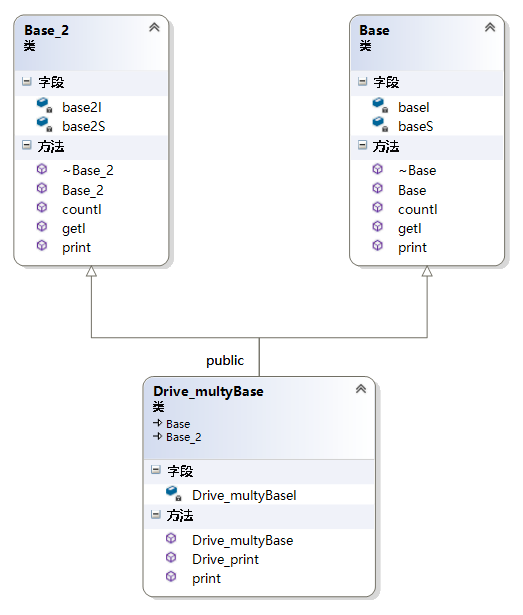

# 三种经典类对象内存布局

在C++中，成员分为成员变量和成员函数：

- 成员变量分别静态成员变量、非静态成员变量
- 成员函数分为静态成员函数、非静态成员函数、虚函数

```
class Base
{
public:
	Base(int n) :iBase(n) {};
	virtual ~Base(void) {};
	int getIBase() const { return iBase; };
	static int instanceCount() { return count; };
	virtual void print() const {};


public:
	int iBase;
	static int count;
};
int Base::count = 0;
```

## 简单对象模型


原理：

对象并没有直接保存成员而是保存了成员的指针，所有的成员占用相同的空间（跟成员类型无关），对象只是维护了一个包含成员指针的一个表，表中放的是成员的地址，无论成员变量还是函数，都是这样处理。排列的顺序与声明的顺序一致。

优缺点：

- 节省内存空间，每一个槽大小固定，无论成员内存是多大，都只有一个指针大小
- 执行效率低下，继承越多，效率急速下降

## 表格驱动对象模型


原理：

将成员分成函数和数据用两个表格保存，然后对象只保存了两个指向表格的指针。这个模型可以保证所有的对象具有相同的大小，相比于简单对象模型还与成员的个数相关。其中数据成员表中包含实际数据；函数成员表中包含的实际函数的地址（与数据成员相比，多一次寻址）。

优缺点：

- 降低了对象的slot，也就是意味着提高了访问成员的效率，直接存取变量提高了效率和内存紧凑方便寻址
- 成员变量一级寻址和成员函数二级寻址执行效率仍然很低，继承越多，效率下降越明显

## C++ 对象模型


原理：

在此模型中，non static 数据成员被放置到对象内部，static 数据成员， static and nonstatic 函数成员均被放到对象之外。对于虚函数的支持则分两步完成：

- 每一个 class 产生一堆指向虚函数的指针，放在表格之中。这个表格称之为虚函数表（virtual table，vtbl）
- 每一个对象被添加了一个指针，指向相关的虚函数表 vtbl。通常这个指针被称为 vptr。vptr 的设定和重置都由每一个 class 的构造函数，析构函数和拷贝赋值运算符自动完成

另外，虚函数表地址的前面设置了一个指向 type_info 的指针，RTTI（Run Time Type Identification）运行时类型识别是编译器生成的特殊类型信息，包括对象继承关系，对象本身的描述，RTTI 是为多态而生成的信息，所以只有具有虚函数的对象在会生成。

虚函数表以 0x0000000 结束，类似字符串以 ’\0’ 结束。

优缺点：

- 这个模型的优点在于它的空间和存取时间的效率
- 如果应用程序本身未改变，但当所使用的类的 non static 数据成员添加删除或修改时，需要重新编译

# 测试

## type_info 头文件

```
typedef unsigned long DWORD;

struct TypeDescriptor
{
	DWORD ptrToVTable;
	DWORD spare;
	char name[8];
};
struct PMD
{
	int mdisp;  //@ member displacement
	int pdisp;  //@ vbtable displacement
	int vdisp;  //@ displacement inside vbtable
};
struct RTTIBaseClassDescriptor
{
	struct TypeDescriptor* pTypeDescriptor; //@ type descriptor of the class
	DWORD numContainedBases; //@ number of nested classes following in the Base Class Array
	struct PMD where;        //@ pointer-to-member displacement info
	DWORD attributes;        //@ flags, usually 0
};

struct RTTIClassHierarchyDescriptor
{
	DWORD signature;      //@ always zero?
	DWORD attributes;     //@ bit 0 set = multiple inheritance, bit 1 set = virtual inheritance
	DWORD numBaseClasses; //@ number of classes in pBaseClassArray
	struct RTTIBaseClassArray* pBaseClassArray;
};

struct RTTICompleteObjectLocator
{
	DWORD signature; //@ always zero ?
	DWORD offset;    //@ offset of this vtable in the complete class
	DWORD cdOffset;  //@ constructor displacement offset
	struct TypeDescriptor* pTypeDescriptor; //@ TypeDescriptor of the complete class
	struct RTTIClassHierarchyDescriptor* pClassDescriptor; //@ describes inheritance hierarchy
};
```

## 无继承

```
void test_base_model()
{
	Base b1(1000);
	std::cout << "对象b1的起始内存地址：" << &b1 << std::endl;

	cout << "type_info 信息：" << ((int*)*(int*)&b1 - 1) << std::endl;
	RTTICompleteObjectLocator str = *((RTTICompleteObjectLocator*)*((int*)*(int*)(&b1) - 1));
	string classname(str.pTypeDescriptor->name);
	classname = classname.substr(4, classname.find("@@") - 4);
	std::cout << "class name:" << classname << std::endl;

	std::cout << "虚函数表地址：\t\t\t" << (int*)(&b1) << std::endl;
	std::cout << "虚函数表 — 第1个函数地址：\t" << (int*)*(int*)(&b1) << "\t即析构函数地址：" << (int*)*((int*)*(int*)(&b1)) << std::endl;
	std::cout << "虚函数表 — 第2个函数地址：\t" << ((int*)*(int*)(&b1) + 1) << "\t";

	typedef void(*Fun)(void);
	Fun pFun = (Fun)*(((int*)*(int*)(&b1)) + 1);
	pFun();
	b1.print();
	std::cout << std::endl;

	std::cout << "推测数据成员iBase地址：\t\t" << ((int*)(&b1) + 1) << "\t通过地址取值iBase的值：" << *((int*)(&b1) + 1) << std::endl;
	std::cout << "Base::getIBase(): " << b1.getIBase() << std::endl;

	b1.instanceCount();
	std::cout << "静态函数instanceCount地址： " << b1.instanceCount << std::endl;
}
```

- 对象的首地址就是虚函数表的地址，然后依次是非静态数据成员
- 虚函数表中的排列顺序与函数的声明顺序一致

## 单继承

不管是单继承、多继承，还是虚继承，如果基于“简单对象模型”，每一个基类都可以被派生类中的一个slot指出，该slot内包含基类对象的地址。这个机制的主要缺点是，因为间接性而导致空间和存取时间上的额外负担；优点则是派生类对象的大小不会因其基类的改变而受影响。

如果基于“表格驱动模型”，派生类中有一个 slot 指向基类表，表格中的每一个 slot 含一个相关的基类地址（这个很像虚函数表，内含每一个虚函数的地址）。这样每个派生类对象含有一个 bptr，它会被初始化，指向其基类表。这种策略的主要缺点是由于间接性而导致的空间和存取时间上的额外负担；优点则是在每一个派生类对象中对继承都有一致的表现方式，每一个派生类对象都应该在某个固定位置上放置一个基类表指针，与基类的大小或数量无关。第二个优点是，不需要改变派生类对象本身，就可以放大，缩小、或更改基类表。

不管上述哪一种机制，“间接性”的级数都将因为集成的深度而增加。C++实际模型是：

- 对于一般继承是扩充已有存在的虚函数表
- 对于虚继承添加一个虚函数表指针

### 无重写的单继承

无重写，即派生类中没有于基类同名的虚函数。

```
class Derived :	public Base
{
public:
	Derived(int n) : Base(n){};
	virtual ~Derived(void) {};
	virtual void derived_print(void) {};

protected:
	int iDerived;
};
```


```
void test_single_inherit_norewrite()
{
	Derived d(9999);
	std::cout << "对象d的起始内存地址：" << &d << std::endl;

	std::cout << "type_info信息：" << ((int*)*(int*)(&d) - 1) << std::endl;
	RTTICompleteObjectLocator str =	*((RTTICompleteObjectLocator*)*((int*)*(int*)(&d) - 1));
	//abstract class name from RTTI
	string classname(str.pTypeDescriptor->name);
	classname = classname.substr(4, classname.find("@@") - 4);
	std::cout << classname << endl;

	std::cout << "虚函数表地址：\t\t\t" << (int*)(&d) << endl;
	std::cout << "虚函数表 — 第1个函数地址：\t" << (int*)*(int*)(&d) << "\t即析构函数地址" << std::endl;
	std::cout << "虚函数表 — 第2个函数地址：\t" << ((int*)*(int*)(&d) + 1) << "\t";
	typedef void(*Fun)(void);
	Fun pFun = (Fun)*(((int*)*(int*)(&d)) + 1);
	pFun();
	d.print();
	cout << endl;

	std::cout << "虚函数表 — 第3个函数地址：\t" << ((int*)*(int*)(&d) + 2) << "\t";
	pFun = (Fun)*(((int*)*(int*)(&d)) + 2);
	pFun();
	d.derived_print();
	std::cout << endl;

	std::cout << "推测数据成员iBase地址：\t\t" << ((int*)(&d) + 1) << "\t通过地址取得的值：" << *((int*)(&d) + 1) << std::endl;
	std::cout << "推测数据成员iDerived地址：\t" << ((int*)(&d) + 2) << "\t通过地址取得的值：" << *((int*)(&d) + 2) << std::endl;
}
```

### 有重写的单继承

```
class DerivedOverrite :	public Base
{
public:
	DerivedOverrite(int n) : Base(n) {};
	virtual ~DerivedOverrite(void) {};
	virtual void print(void) const {};

protected:
	int iDerived;
};
```


```
void test_single_inherit_rewrite()
{
	DerivedOverrite d(111111);
	std::cout << "对象d的起始内存地址：\t\t" << &d << std::endl;

	std::cout << "虚函数表地址：\t\t\t" << (int*)(&d) << std::endl;
	std::cout << "虚函数表 — 第1个函数地址：\t" << (int*)*(int*)(&d) << "\t即析构函数地址" << std::endl;
	std::cout << "虚函数表 — 第2个函数地址：\t" << ((int*)*(int*)(&d) + 1) << "\t";
	typedef void(*Fun)(void);
	Fun pFun = (Fun)*(((int*)*(int*)(&d)) + 1);
	pFun();
	d.print();
	std::cout << std::endl;

	std::cout << "虚函数表 — 第3个函数地址：\t" << *((int*)*(int*)(&d) + 2) << "[结束]\t";
	std::cout << std::endl;

	std::cout << "推测数据成员iBase地址：\t\t" << ((int*)(&d) + 1) << "\t通过地址取得的值：" << *((int*)(&d) + 1) << std::endl;
	std::cout << "推测数据成员iDerived地址：\t" << ((int*)(&d) + 2) << "\t通过地址取得的值：" << *((int*)(&d) + 2) << std::endl;
}
```

## 多继承

```
class Base_1
{
public:
	Base_1(int);
	virtual ~Base_1(void);
	virtual void print(void) const;
protected:
	int iBase_1;
};

class Derived_Mutlip_Inherit :	public Base, public Base_1
{
public:
	Derived_Mutlip_Inherit(int n) : Base(n), Base_1(n) {};
	virtual ~Derived_Mutlip_Inherit(void) {};
	virtual void print(void) const {};
	virtual void test_fun(void) {};

protected:
	int iDerived_Mutlip_Inherit;
};
```



```
void test_multip_inherit()
{
	Derived_Mutlip_Inherit dmi(666);
	std::cout << "对象dmi的起始内存地址：\t\t" << &dmi << std::endl;

	std::cout << "虚函数表_vptr_Base地址：\t" << (int*)(&dmi) << std::endl;
	std::cout << "_vptr_Base — 第1个函数地址：\t" << (int*)*(int*)(&dmi) << "\t即析构函数地址" << std::endl;
	std::cout << "_vptr_Base — 第2个函数地址：\t" << ((int*)*(int*)(&dmi) + 1) << "\t";

	typedef void(*Fun)(void);
	Fun pFun = (Fun)*(((int*)*(int*)(&dmi)) + 1);
	pFun();
	std::cout << std::endl;
	std::cout << "_vptr_Base — 第3个函数地址：\t" << ((int*)*(int*)(&dmi) + 2) << "\t";
	pFun = (Fun)*(((int*)*(int*)(&dmi)) + 2);
	pFun();
	std::cout << std::endl;
	std::cout << "_vptr_Base — 第4个函数地址：\t" << *((int*)*(int*)(&dmi) + 3) << "[结束]\t";
	std::cout << std::endl;
	std::cout << "推测数据成员iBase地址：\t\t" << ((int*)(&dmi) + 1) << "\t通过地址取得的值：" << *((int*)(&dmi) + 1) << std::endl;

	std::cout << "---------------------------------------------------------------------------------" << std::endl;

	std::cout << "虚函数表_vptr_Base1地址：\t" << ((int*)(&dmi) + 2) << std::endl;
	std::cout << "_vptr_Base1 — 第1个函数地址：\t" << (int*)*((int*)(&dmi) + 2) << "\t即析构函数地址" << std::endl;
	std::cout << "_vptr_Base1 — 第2个函数地址：\t" << ((int*)*((int*)(&dmi) + 2) + 1) << "\t";

	typedef void(*Fun)(void);
	pFun = (Fun)*((int*)*((int*)(&dmi) + 2) + 1);
	pFun();
	std::cout << std::endl;
	
	std::cout << "_vptr_Base1 — 第3个函数地址：\t" << *((int*)*(int*)((int*)(&dmi) + 2) + 2) << "[结束]\t";
	std::cout << std::endl;

	std::cout << "推测数据成员iBase1地址：\t" << ((int*)(&dmi) + 3) << "\t通过地址取得的值：" << *((int*)(&dmi) + 3) << std::endl;
	std::cout << "推测数据成员iDerived地址：\t" << ((int*)(&dmi) + 4) << "\t通过地址取得的值：" << *((int*)(&dmi) + 4) << std::endl;
}
```

