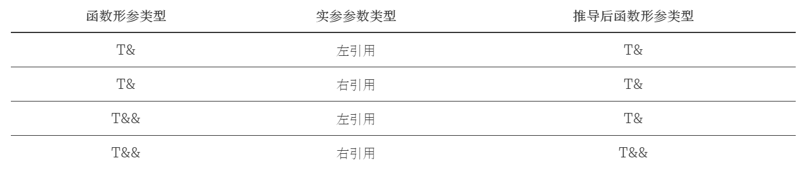

#  Lambda 表达式

Lambda 表达式的基本语法如下：

```
[捕获列表](参数列表) mutable(可选) 异常属性 -> 返回类型 {
	// 函数体
}
```

## 捕获列表

lambda 表达式内部函数体在默认情况下是不能够使用函数体外部的变量的，这时候捕获列表可以起到传递外部数据的作用。根据传递的行为，捕获列表也分为以下几种：

### 值捕获

与参数传值类似，值捕获的前提是变量可以拷贝，不同之处则在于，被捕获的变量在 lambda 表达式被创建时拷贝，
而非调用时才拷贝：

```
void lambda_value_capture() {
	int value = 1;
	auto copy_value = [value]
	{
		return value;
	};

	value = 100;
	auto stored_value = copy_value();
	std::cout << "stored_value: " << stored_value << std::endl; //@ stored_value 是 1
}
```

### 引用捕获

与引用传参类似，引用捕获保存的是引用，值会发生变化。

```
void lambda_reference_capture() {
	int value = 1;
	auto copy_value = [&value] {
		return value;
	};

	value = 100;
	auto stored_value = copy_value();
	std::cout << "stored_value = " << stored_value << std::endl; //@ stored_value 是 100
}
```

### 隐式捕获

手动书写捕获列表有时候是非常复杂的，这种机械性的工作可以交给编译器来处理，这时候可以在捕获列表中写一个 
& 或 = 向编译器声明采用引用捕获或者值捕获。捕获列表的最常用的四种形式可以是：

- \[\] 空捕获列表
- \[name1, name2, ...\] 捕获一系列变量
- \[&\] 引用捕获, 让编译器自行推导捕获列表
- \[=\] 值捕获, 让编译器执行推导捕获列表

### 表达式捕获

C++14 允许捕获的成员用任意的表达式进行初始化，这就允许了右值的捕获，被声明的捕获变量类型会根据表达式进行判断，判断方式与使用 `auto` 本质上是相同的：

```
int main() {
	auto important = std::make_unique<int>(1);
	auto add = [v1 = 1, v2 = std::move(important)](int x, int y) -> int {
		return x + y + v1 + (*v2);
	};
	std::cout << add(3, 4) << std::endl;
	return 0;
}
```

## 泛型 Lambda

从 C++14 开始，Lambda 函数的形式参数可以使用 auto 关键字来产生意义上的泛型：

```
auto add = [](auto x, auto y) {
    return x+y;
};

add(1, 2);
add(1.1, 2.2);
```

# 函数对象包装器

## std::function

在 C++11 中，统一了这些概念，将能够被调用的对象的类型，统一称之为可调用类型。而这种类型，便是通过 std::function 引入的。

C++11 std::function 是一种通用、多态的函数封装，它的实例可以对任何可以调用的目标实体进行存储、复制和调用操作，它也是对 C++ 中现有的可调用实体的一种类型安全的包裹（相对来说，函数指针的调用不是类型安全的），换句话说，就是函数的容器。当我们有了函数的容器之后便能够更加方便的将函数、函数指针作为对象进行处理。

```
int foo(int para) {
	return para;
}

int main() {
	std::function<int(int)> func = foo;

	int important = 10;
	std::function<int(int)> func2 = [&](int value) -> int {
		return 1 + value + important;
	};

	std::cout << func(10) << std::endl;
	std::cout << func2(10) << std::endl;
}
```

## std::bind 和 std::placeholder

std::bind 则是用来绑定函数调用的参数的，它解决的需求是我们有时候可能并不一定能够一次性获得调用某个函数的全部参数，通过这个函数，我们可以将部分调用参数提前绑定到函数身上成为一个新的对象，然后在参数齐全后，完成调用。

```
int foo(int a, int b, int c) {
	return a + b + c;
}

int main() 
{
	auto bindFoo = std::bind(foo, std::placeholders::_1, 1, 2);

	bindFoo(1);
}
```

# 右值引用

## 左值、右值的纯右值、将亡值、右值

左值，顾名思义就是赋值符号左边的值。准确来说，左值是表达式（不一定是赋值表达式）后依然存在的持久对象。

右值，是指表达式结束后就不再存在的临时对象。

C++11 中为了引入强大的右值引用，将右值的概念进行了进一步的划分，分为：纯右值、将亡值。

纯右值，要么是纯粹的字面量，例如：10，true；要么是求值结果相当于字面量或匿名临时对象，例如：1+2。非引用返回的临时变量、运算表达式产生的临时变量、原始字面量、Lambda 表达式都属于纯右值。

将亡值，是 C++11 为了引入右值引用而提出的概念（因此在传统 C++中，纯右值和右值是同一个概念），也就是即将被销毁、却能够被移动的值。

## 右值引用和左值引用

需要拿到一个将亡值，就需要用到右值引用的申明：T &&，其中 T 是类型。右值引用的声明让这个临时值的生命周期得以延长、只要变量还活着，那么将亡值将继续存活。

C++11 提供了 std::move 这个方法将左值参数无条件的转换为右值，有了它我们就能够方便的获得一个右值临时对象。

```
void reference(std::string& str) {
	std::cout << "左值" << std::endl;
}

void reference(std::string&& str) {
	std::cout << "右值" << std::endl;
}


int main()
{
	std::string lv1 = "string,"; //@ lv1 是一个左值
	// std::string&& r1 = lv1; //@ 非法, 右值引用不能引用左值
	std::string&& rv1 = std::move(lv1); //@ 合法, std::move 可以将左值转移为右值
	std::cout << rv1 << std::endl; //@ string,

	const std::string& lv2 = lv1 + lv1; //@ 合法, 常量左值引用能够延长临时变量的生命周期
	// lv2 += "Test"; //@ 非法, 常量引用无法被修改
	std::cout << lv2 << std::endl; //@ string,string

	std::string&& rv2 = lv1 + lv2; //@ 合法, 右值引用延长临时对象生命周期
	rv2 += "Test"; //@ 合法, 非常量引用能够修改临时变量
	std::cout << rv2 << std::endl; //@ string,string,string,Test

	reference(rv2); //@ 输出左值

	return 0;
}
```

## 移动语义

传统的 C++ 没有区分移动和拷贝的概念，造成了大量的数据拷贝，浪费时间和空间。右值引用的出现解决了这两个概念的混淆问题。

```
int main() {

	std::string str = "Hello world.";
	std::vector<std::string> v;

	//@ 将使用 push_back(const T&), 即产生拷贝行为
	v.push_back(str);

	//@ 将使用 push_back(const T&&), 不会出现拷贝行为
	//@ 而整个字符串会被移动到 vector 中，所以有时候 std::move 会用来减少拷贝出现的开销
	//@ 这步操作后, str 中的值会变为空
	v.push_back(std::move(str));

	return 0;
}
```

## 完美转发

在传统 C++ 中，我们不能够对一个引用类型继续进行引用，但 C++ 由于右值引用的出现而放宽了这一做法，从而产生了引用坍缩规则，允许我们对引用进行引用，既能左引用，又能右引用。但是却遵循如下规则：



无论模板参数是什么类型的引用，当且仅当实参类型为右引用时，模板参数才能被推导为右引用类型。

完美转发就是基于上述规律产生的。所谓完美转发，就是为了让我们在传递参数的时候，保持原来的参数类型（左引用保持左引用，右引用保持右引用）。为了解决这个问题，我们应该使用 `std::forward` 来进行参数的转发。


