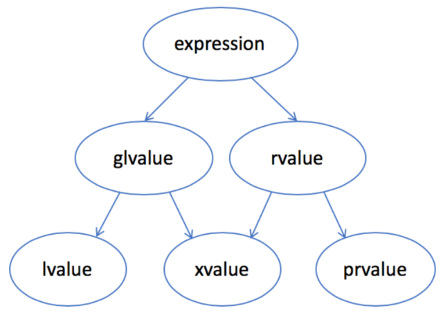
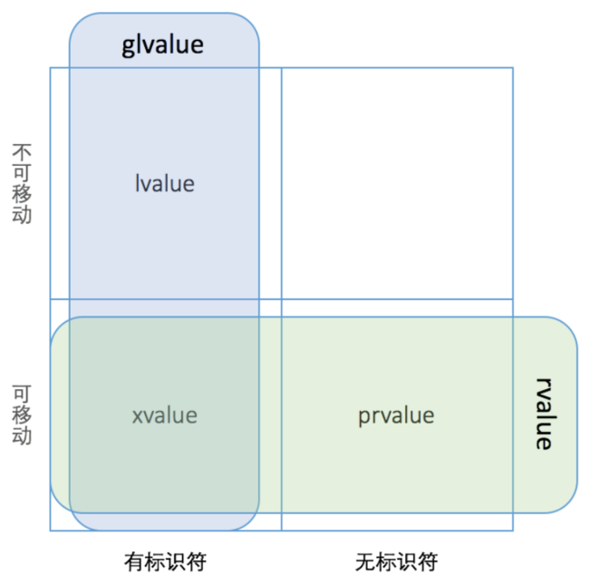
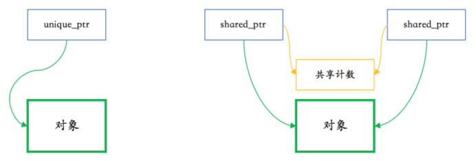
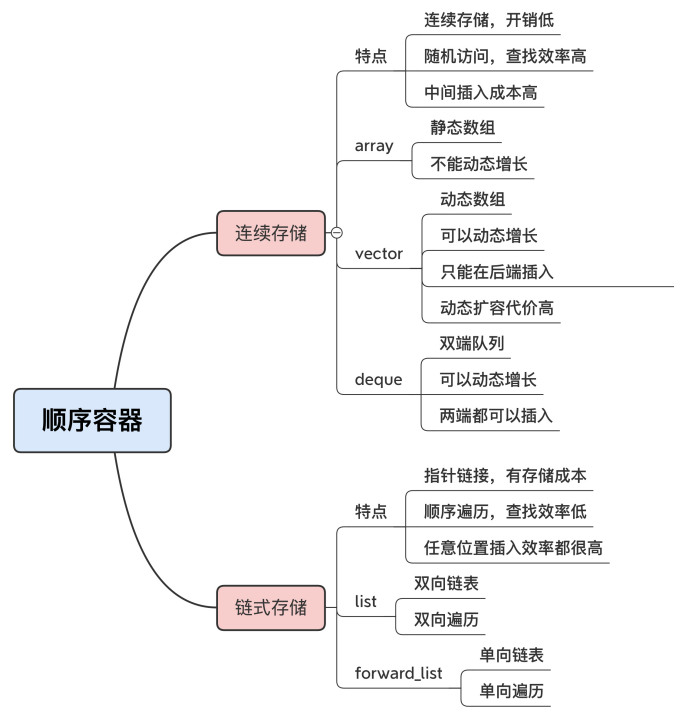
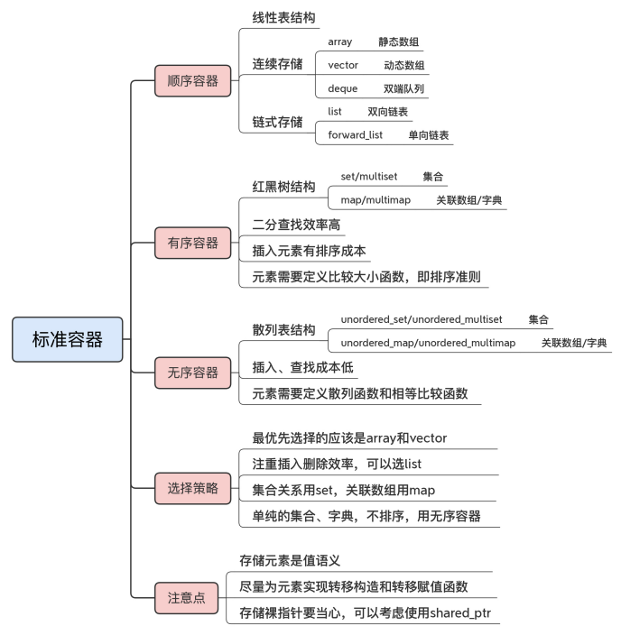
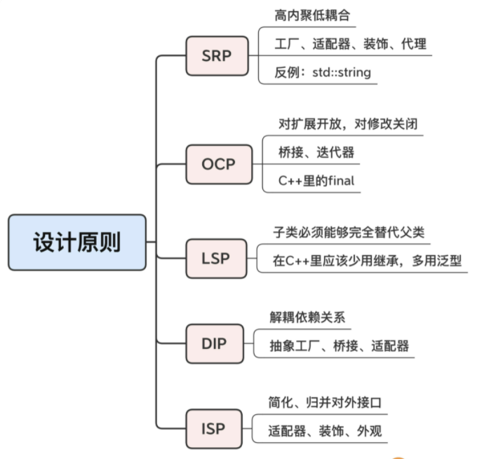
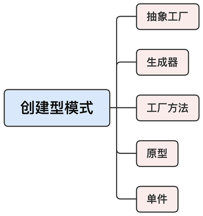
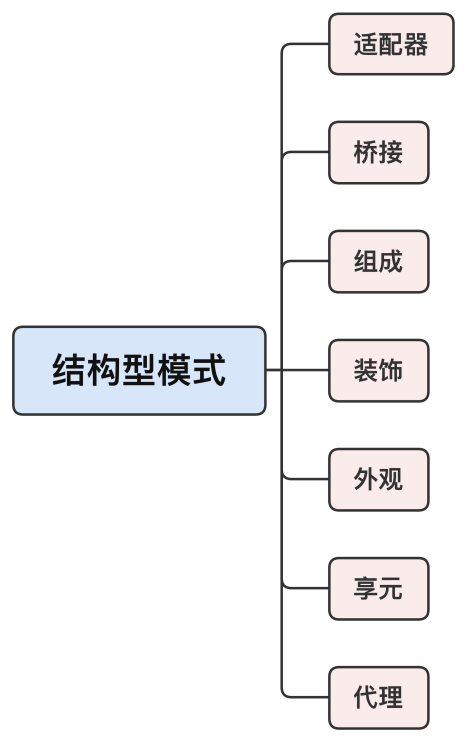
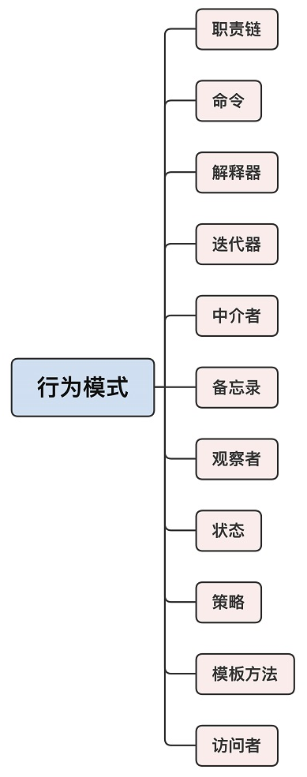

# 生命周期和编程范式

## C++ 程序的生命周期


###  编译阶段编程

```
template <int N>
struct Fib
{
	static const int value = Fib<N - 1>::value + Fib<N - 2>::value;
};

template <>
struct Fib<1>
{
	static const int value = 1;
};

template <>
struct Fib<0>
{
	static const int value = 1;
};

int main()
{
	std::cout << Fib<2>::value << std::endl; 
	std::cout << Fib<40>::value << std::endl;
	return 0;
}
```

### 静态断言

```
template <int N>
struct Fib
{
	static_assert(N >= 0,"N >= 0");
	static const int value = Fib<N - 1>::value + Fib<N - 2>::value;
};
```

static_assert 运行在编译阶段，只能看到编译时的常数和类型，看不到运行时的变量、指针、内存数据等。  

```
template <typename I,typename P>
struct Test{
	static_assert(std::is_integral<I>::value,"int");
	static_assert(std::is_pointer<P>::value, "ptr");
};
```

## C++ 语言的编程范式：


### 面向对象编程

面向对象编程的核心思想：封装，继承和多态。

注意：尽量少用继承和虚函数，减少继承的层次，一般不应该超过三层。  

"final" 标识符可以用于禁止继承：

```
struct Interface {
};

struct Implement final : public Interface{
};
```

现代 C++ 中一共有 6 个基本函数：

- 默认构造函数，拷贝构造函数，移动构造函数
- 赋值函数，移动赋值函数
- 析构函数

"default" 可以强制编译器提供某个函数的默认实现，"delete" 可以强制编译器删除某个函数的实现：

```
struct Test final
{
	Test() = default;
	Test(const Test& t) = delete;
};
```

"explicit"  关键字可以防止类隐式类型转换：

```
struct Test
{
	explicit Test(int i)  //@ 显式单参构造
	{
	}
	
	explicit operator bool() //@ 显式转换为 bool 类型
	{}
};
```

#### 委托构造函数

一个构造函数直接调用另一个构造函数，把构造工作“委托”出去，既简单又高效。  

```
struct Test final
{
public:
	Test(int a) : i(a)
	{
	}

	Test() : Test(0)
	{
	}

	Test(const std::string& s) : i(std::stoi(s))
	{
	}
private:
	int i;
};
```

#### 类内初始化

在 C++11 里，你可以在类里声明变量的同时给它赋值，实现初始化，这样不但简单清晰，也消除了隐患。  

```
struct Test final
{
public:
	Test(int a) : i(a) //@ 可以单独初始化某个数据成员
	{
	}

	Test() = default;  //@ 需要默认构造函数
	~Test() = default; //@ 需要默认析构函数

private:
	int i = 10;
	std::string s{"hello"};
	std::vector<int> v{ 1,2,3 };
};
```

#### 类型别名

C++11 扩展了关键字 using 的用法，增加了 typedef 的能力，可以定义类型别名。  

```
struct Test final
{
public:
	using VecI = std::vector<int>;
};
```

# 类型推导

## auto

auto 的“自动推导”能力只能用在“初始化”的场合。  具体来说，就是赋值初始化或者花括号初始化（初始化列表、Initializer list），变量右边必须要有一个表达式。这样你才能在左边放上 auto，编译器才能找到表达式，帮你自动计算类型。如果不是初始化的形式，只是“纯”变量声明，那就无法使用 auto。因为这个时候没有表达式可以让 auto 去推导：

```
auto x = 0UL; //@ x -> unsigned long
auto y = &x;  //@ y -> unsigned long
auto z{ &x }; //@ z -> unsigned long*
auto err; //@ 错误，没有用于推导的表达式
```

类成员变量初始化时候，不能使用 auto 进行类型推导：

```
struct Test final
{
	auto a = 10;  //@ 错误，类内初始化不支持 auto 类型推导
};
```

auto 推导规则：

- auto 总是推导出“值类型”，绝不会是“引用”，auto 可以附加上 const、volatile、*、& 这样的类型修饰符，得到新的类型  
- auto 将忽略顶层 const 而保留底层 const
- auto 可以附加上 const、volatile、*、& 这样的类型修饰符，得到新的类型  

```
int a = 1;
int &r = a;
const int* const  p = &a;
auto b = p; //@ b -> const int*
auto c = r; //@ c -> int
const auto & d = c; //@ d -> const int &
```

## decltype

decltype 的形式很像函数，后面的圆括号里就是可用于计算类型的表达式。

decltype  推导规则：

- decltype 不仅能够推导出值类型，还能够推导出引用类型，也就是表达式的“原始类型”
- auto 可以附加上 const、volatile、*、& 这样的类型修饰符，得到新的类型  

```
int x = 0;
int& r = x;

decltype(x) x1; //@ x1 -> int
decltype(&x) x2; //@ x2 -> int*
decltype(x)& x3 = x; //@ x3 -> int&
decltype(r)& x4 = x; //@ x4 -> int&
decltype(x)* x5; //@ x5 -> int*

const decltype(x) x6 = 0; //@ x6 -> const int
```

完全可以把 decltype 看成是一个真正的类型名，用在变量声明、函数参数 / 返回值、模板参数等任何类型能出现的地方，只不过这个类型是在编译阶段通过表达式“计算”得到的。  

```
int x;
using int_ptr = decltype(&x);
```

它也有个缺点，就是写起来略麻烦，特别在用于初始化的时候，表达式要重复两次（左边的类型计算，右边的初始化），把简化代码的优势完全给抵消了。所以，C++14 就又增加了一个“decltype(auto)”的形式，既可以精确推导类型，又能像 auto 一样方便使用。  

```
int x = 0;

decltype(auto) x1 = (x); //@ x1->int&,因为 (expr) 是引用类型
decltype(auto) x2 = &x; //@ x2->int*
decltype(auto) x3 = x1; //@ x1->int&

auto a = (x);  //@ a -> int，auto 推导只是值推导
decltype((x)) a = x;  //@ a -> int&，decltype 推导是完整类型推导
```

## auto 与 decltype 的应用

auto：

- 在变量声明时应该尽量多用 auto，尤其是在 range-based-for 中
- 在 C++14 里，auto 还新增了一个应用场合，就是能够推导函数返回值  

```
auto get_vec()
{
	return std::vector<int>{1,2,3,4};
}
```

decltype：

它是 auto 的高级形式，更侧重于编译阶段的类型计算，所以常用在泛型编程里，获取各种类型，配合 typedef 或者 using 会更加方便。当你感觉“这里我需要一个特殊类型”的时候，选它就对了。  

```
//@ UNIX 信号函数原型
void(*signal(int signo, void(*func)(int)))(int);
using sig_func_ptr_t = decltype(&signal);
```

在定义类的时候，因为 auto 被禁用了，所以这也是 decltype 可以“显身手”的地方。它可以搭配别名任意定义类型，再应用到成员变量、成员函数上，变通地实现 auto 的功能。

```
struct Test final
{
    using set_type = std::set<int>;

    set_type set_;
    using iter_type = decltype(set_.begin());
    iter_type pos_;
};
```

# 右值和移动

C++ 中的值类别：

- lvalue 是通常可以放在等号左边的表达式，左值
- rvalue 是通常只能放在等号右边的表达式，右值
- glvalue 是 generalized lvalue，广义左值
- xvalue 是 expiring lvalue，将亡值
- prvalue 是 pure rvalue，纯右值  





左值 lvalue 是有标识符、可以取地址的表达式，最常见的情况有：  

- 变量、函数或数据成员的名字  
- 返回左值引用的表达式，如 ++x、x = 1、cout << ' '  
- 字符串字面量如 "hello world"  

在函数调用时，左值可以绑定到左值引用的参数，如 T&。一个常量只能绑定到常左值引用，如 const T&。  

纯右值 prvalue 是没有标识符、不可以取地址的表达式，一般也称之为“临时对象”。最常见的情况有：  

- 返回非引用类型的表达式，如 x++、x + 1
- 除字符串字面量之外的字面量，如 42、true  

C++11 开始，C++ 语言里多了一种引用类型——右值引用。右值引用的形式是 T&&，比左值引用多一个 & 符号。  

## 生命周期和表达式类型  

C++ 的规则是：一个临时对象会在包含这个临时对象的完整表达式估值完成后、按生成顺序的逆序被销毁，除非有生命周期延长发生。  

```
struct Shape
{
	virtual ~Shape() {}
};

struct Circle final : Shape
{
	Circle()
	{
		std::cout << "Circle()" << std::endl;
	}

	~Circle()
	{
		std::cout << "~Circle()" << std::endl;
	}
};

struct Triangle final : Shape
{
	Triangle()
	{
		std::cout << "Triangle()" << std::endl;
	}

	~Triangle()
	{
		std::cout << "~Triangle()" << std::endl;
	}
};

struct Result
{
	Result()
	{
		std::cout << "Result()" << std::endl;
	}

	~Result()
	{
		std::cout << "~Result()" << std::endl;
	}
};

Result process_shape(const Shape& shape1, const Shape& shape2)
{
	std::cout << "process_shape" << std::endl;
	return Result();
}

int main()
{
	process_shape(Circle(),Triangle());
	return 0;
}
```

为了方便对临时对象的使用，C++ 对临时对象有特殊的生命周期延长规则。这条规则是：如果一个 prvalue 被绑定到一个引用上，它的生命周期则会延长到跟这个引用变量一样长。    

```
Result&& r= process_shape(Circle(),Triangle());
```

需要万分注意的是，这条生命期延长规则只对 prvalue 有效，而对 xvalue 无效。如果由于某种原因，prvalue 在绑定到引用以前已经变成了 xvalue，那生命期就不会延长。  

```
Result&& r = std::move(process_shape(Circle(), Triangle()));
//@ r 指向的对象已经不存在了，对 r 的解引用是一个未定义行为，由于 r 指向的是栈空间，通常不会立即导致程序崩溃，而会在某些复杂的组合条件下才会引致问题
```

## 移动的意义  

实现移动的意义是减少运行的开销，在引用计数指针的场景下，这个开销并不大。在使用容器类的情况下，移动更有意义。  

 ```
 std::string name = "jim";
 std::string result = std::string("Hello, ") + name + ".";
 ```

在 C++11 之前的年代里，这种写法是绝对不推荐的。因为它会引入很多额外开销，为了生成临时对象，会多次调用复制构造函数和析构函数，因此比较好的写法：

```
std::string result("Hello, ");  //@ 调用一次构造函数
result += name; //@ 调用一次 operator +
result += ".";	//@ 调用一次 operator +
```

从 C++11 开始，就需要了，因为引入了移动构造，就不需要反复调用复制构造函数和析构函数。可以直接写成：

```
std::string result = std::string("Hello, ") + name + ".";
```

一句话总结，移动语义使得在 C++ 里返回大对象（如容器）的函数和运算符成为现实，因而可以提高代码的简洁性和可读性，提高程序员的生产率。所有的现代 C++ 的标准容器都针对移动进行了优化。  

## 如何实现移动  

设计的对象支持移动的话，通常需要下面几步：  

- 应该有分开的拷贝构造和移动构造函数（除非只打算支持移动，不支持拷贝——如：unique_ptr）
- 对象应该有 swap 成员函数，支持和另外一个对象快速交换成员  
- 对象的名空间下，应当有一个全局的 swap 函数，调用成员函数 swap 来实现交换。支持这种用法会方便在其他对象里包含你的对象，并快速实现它们的 swap 函数
- 实现通用的 operator=  
- 上面各个函数如果不抛异常的话，应当标为 noexcept。这对移动构造函数尤为重要  

## 不要返回本地变量的引用  

在函数里返回一个本地对象的引用。由于在函数结束时本地对象即被销毁，返回一个指向本地对象的引用属于未定义行为。理论上来说，程序出任何
奇怪的行为都是正常的。  

在 C++11 之前，返回一个本地对象意味着这个对象会被拷贝，除非编译器发现可以做返回值优化（named return value optimization，或 NRVO），能把对象直接构造到调用者的栈上。从 C++11 开始，返回值优化仍可以发生，但在没有返回值优化的情况下，编译器将试图把本地对象移动出去，而不是拷贝出去。这一行为不需要用 std::move 进行干预——使用std::move 对于移动行为没有帮助，反而会影响返回值优化。    

## 引用坍缩和完美转发  

引用坍缩（又称“引用折叠”）对于一个实际的类型 T，它的左值引用是 T&，右值引用是 T&&。    

实上，很多标准库里的函数，连目标的参数类型都不知道，但我们仍然需要能够保持参数的值类型：左值的仍然是左值，右值的仍然是右值。这个功能在 C++ 标准库中已经提供了，叫 std::forward。它和 std::move 一样都是利用引用坍缩机制来实现。  

T&& 的作用主要是保持值类别进行转发，它有个名字就叫“转发引用”。因为既可以是左值引用，也可以是右值引用，它也曾经被叫做“万能引用”。  

# const/volatile/mutable

## const  和 volatile

最简单的用法就是，定义程序用到的数字、字符串常量，代替宏定义。它和宏定义还是有本质区别的：const 定义的常量在预处理阶段并不存在，而是直到运行阶段才会出现。所以，准确地说，它实际上是运行时的“变量”，只不过不允许修改，是“只读”的，叫“只读变量”更合适。既然它是“变量”，那么，使用指针获取地址，再“强制”写入也是可以的：      

```
//@ 需要加入 volatile 修饰，运行时才能看到效果
const volatile int kMaxLen = 1024;
auto ptr = (int*)(&kMaxLen);

*ptr = 2048;
std::cout << kMaxLen << std::endl; //@ 输出 2048
```

编译器会对“真正的常数”进行优化，例如在用到常数的时候直接替换，const 常量虽然不是“真正的常数”，但在大多数情况下，它都可以被认为是常数，在运行期间不会改变。所以，对于没有 volatile 修饰的 const 常量来说，虽然你用指针改了常量的值，但这个值在运行阶段根本没有用到，因为它在编译阶段就被优化掉了。    

volatile  含义是“不稳定的”“易变的”，在 C++ 里，表示变量的值可能会以“难以察觉”的方式被修改（比如操作系统信号、外界其他的代码），所以要禁止编译器做任何形式的优化，每次使用的时候都必须“老老实实”地去取值。 kMaxLen 虽然是个“只读变量”，但加上了 volatile 修饰，就表示它不稳定，可能会悄悄地改变。编译器在生成二进制机器码的时候，不会再去做那些可能有副作用的优化，而是用最“保守”的方式去使用 kMaxLen。也就是说，编译器不会再把 kMaxLen 替换为 1024，而是去内存里取值。

volatile 会禁止编译器做优化，所以除非必要，应当少用 volatile，最好不要用。

## 基本的 const 用法  

常量引用：

```
int x = 0;

const int& cr = x;
```

const& 被称为万能引用，它可以引用任何类型，即不管是值、指针、左引用还是右引用，它都能“照单全收”。而且，它还会给变量附加上 const 特性，这样“变量”就成了“常量”，只能读、禁止写。  在设计函数的时候，尽可能地使用它作为入口参数，一来保证效率，二来保证安全。    

const 与指针：

常量指针：表示指针指向的内容是常量，不能通过指针修改其值

```
int x = 0;
int y = 1;

const int* cp = &x;
*cp = y;	//@ 不允许使用指针修改变量的值
cp = &y;	//@ OK
```

指针常量：指针本身是常量，不能指向别的对象，但是它指向的变量的值可以修改

```
int x = 0;
int y = 1;

int* const cp = &x;
*cp = y; //@ OK
cp = &y; //@ 不允许，指针本身是常量类型
```

指向常量的指针常量：

```
int x = 0;
int y = 1;

const int* const cp = &x;
*cp = y; //@ 不允许
cp = &y  //@ 不允许
```

顶层 const 与底层 const

- 顶层 const：指 const 定义的变量本身是一个常量
- 底层 const：指 const 定义的变量所指向的对象是一个常量

```
const int i = 0; 　　 　　//@ 顶层 const，变量i就是常量
const int  * a =  &i;    //@ 底层 const, a 所指向的对象 *a 是常量
int * const b = &i;　　　 //@ 顶层 const, 变量 b 本身就是一个常量
```

- 执行对象拷贝时有限制，常量的底层 const 不能赋值给非常量的底层 const
- const_cast 只能改变运算对象的底层const

```
int num = 3;
const int * p = &num;
int * p2 = p; //@ 不允许

int *p3 = const_cast<int*>(p);  //@ OK
```

## 与类相关的 const 用法  

const 成员函数，const 成员变量：

```
struct Test final
{
public:
	int get_value() const
	{
		return value;
	}
	
private:
	const long kMaxSize = 256L;
	int value;
};
```

const 成员函数的作用：函数的执行过程是 const 的，不会修改对象的状态（即成员变量），也就是说，成员函数是一个“只读操作”。  

因为“常量引用”“常量指针”关联的对象是只读、不可修改的，那么也就意味着，对它的任何操作也应该是只读、不可修改的，否则就无法保证它的安全性。所以，编译器会检查const 对象相关的代码，如果成员函数不是 const，就不允许调用。  


## mutable  

mutable 却只能修饰类里面的成员变量，表示变量即使是在 const 对象里，也是可以修改的。换句话说，就是标记为 mutable 的成员不会改变对象的状态，也就是不影响对象的常量性，所以允许 const 成员函数改写 mutable 成员变量。  

对于有特殊作用的成员变量，你可以给它加上 mutable 修饰，解除 const 的限制，让任何成员函数都可以操作它。  

```
struct Test final
{
public:
	void save_data() const
	{
		//@ do something wirth mutex
	}
private:
	mutable std::mutex mutex;
};
```

不过要当心，mutable 也不要乱用，太多的 mutable 就丧失了 const 的好处  

# 智能指针

C++ 里也是有垃圾回收的，不过不是 Java、Go 那种严格意义上的垃圾回收，而是广义上的垃圾回收，这就是构造 / 析构函数和 RAII 惯用法（Resource Acquisition Is Initialization）。  

在现代 C++ 中，绝对不要再使用“裸指针（naked pointer）”了，而是应该使用“智能指针（smart pointer）”。  

## unique_ptr 

```
std::unique_ptr<std::string> ptr(new std::string("hello"));
assert(ptr != nullptr); //@ 可以判断是否为空指针
assert(*ptr == "hello"); //@ 可以判断是否为空指针
ptr->size(); //@ 可以使用->调用成员函数
```

unique_ptr 虽然名字叫指针，用起来也很像，但它实际上并不是指针，而是一个对象。所以，不要企图对它调用 delete，它会自动管理初始化时的指针，在离开
作用域时析构释放内存。  

unique_ptr 没有定义算术运算：

```
std::unique_ptr<int> ptr(new int (42));
ptr ++; //@ 不允许
ptr += 2; //@ 不允许
```

未初始化的 unique_ptr 表示空指针，这样就相当于直接操作了空指针，运行时就会产生致命的错误（比如 core dump）：

```
std::unique_ptr<int> ptr;
*ptr = 42;
```

C++ 14 中工厂函数 make_unique()，强制创建智能指针的时候必须初始化。  在 C++ 11 中实现：

```
template <typename T,typename... Args>
std::unique_ptr<T> make_unique(Args&& ... args)
{
	return std::unique_ptr<T>(new T(std::forward<Args>(args)...));
}
```

unique_ptr  表示指针的所有权是“唯一”的，不允许共享，任何时候只能有一个“人”持有它  

unique_ptr 应用了 C++ 的“转移”（move）语义，同时禁止了拷贝赋值，所以，在向另一个 unique_ptr 赋值的时候，要特别留意，必须用 std::move() 函
数显式地声明所有权转移。  赋值操作之后，指针的所有权就被转走了，原来的 unique_ptr 变成了空指针，新的unique_ptr 接替了管理权，保证所有权的唯一性：  

```
std::unique_ptr<int> ptr = make_unique<int>(42);
assert(ptr); //@ OK
std::unique_ptr<int> ptr2 = std::move(ptr);
assert(ptr); //@  错误
```

## shared_ptr

```
std::shared_ptr<std::string> ptr(new std::string("hello"));	
assert(*ptr == "hello"); //@ 可以使用*取内容
ptr->size(); //@ 可以使用->调用成员函数
assert(ptr != nullptr); //@ 可以判断是否为空指针

auto ptr2 = std::make_shared<std::string>("zelda"); //@ 工厂函数创建智能指针
```

shared_ptr 的所有权是可以被安全共享的，也就是说支持拷贝赋值，允许被多个“人”同时持有，就像原始指针一样。  

```
auto ptr = std::make_shared<std::string>("hello"); 
assert(ptr.unique()); //@ 此时智能指针唯一
auto ptr2 = ptr;  //@ 直接拷贝，不需要 move
assert(ptr.use_count() == 2); //@ 引用计数为 2
```

shared_ptr 支持安全共享的秘密在于内部使用了“引用计数”。引用计数最开始的时候是 1，表示只有一个持有者。如果发生拷贝赋值——也就是共享的时候，引用计数就增加，而发生析构销毁的时候，引用计数就减少。只有当引用计数减少到0，也就是说，没有任何人使用这个指针的时候，它才会真正调用 delete 释放内存。  

因为 shared_ptr 具有完整的“值语义”（即可以拷贝赋值），所以，它可以在任何场合替代原始指针，而不用再担心资源回收的问题。

shared_ptr  缺陷：

- 引用计数的存储和管理都是成本
- 导致循环引用 

智能指针的简单实现：



```
//@ 引用计数类
class SharedCount
{
private:
	long count_;

public:
	SharedCount() noexcept : count_(1)
	{
	}

	void add_count() noexcept
	{
		++count_;
	}

	long reduce_count() noexcept
	{
		--count_;
		return count_;
	}

	long get_count() const noexcept
	{
		return count_;
	}
};

//@ 智能指针类
template <typename T>
class SharedPtr
{
private:
	T* ptr_;
	SharedCount* shared_count_;

public:
	//@ 声明友元，访问其他实体类型的引用变量
	template <typename U>
	friend class SharedPtr;

	//@ 构造函数
	explicit SharedPtr(T* ptr = nullptr) : ptr_(ptr)
	{
		if (ptr)
		{
			shared_count_ = new SharedCount();
		}
	}

	//@ 析构函数
	~SharedPtr()
	{
		if (ptr_ && shared_count_->reduce_count() == 0)
		{
			delete ptr_;
			delete shared_count_;
		}
	}

	//@ 拷贝构造函数
	SharedPtr(const SharedPtr& other) noexcept
	{
		ptr_ = other.ptr_;
		if (ptr_)
		{
			//@ 如果指针存在，other的引用计数器+1
			other.shared_count_->add_count();
			shared_count_ = other.shared_count_;
		}
	}

	template <typename U>
	SharedPtr(const SharedPtr<U>& other) noexcept
	{
		ptr_ = other.ptr_;
		if (ptr_)
		{
			//@ 如果指针存在，other的引用计数器+1
			other.shared_count_->add_count();
			shared_count_ = other.shared_count_;
		}
	}

	//@ 移动构造函数
	template <typename U>
	SharedPtr(SharedPtr<U>&& other) noexcept
	{
		ptr_ = other.ptr_;
		if (ptr_)
		{
			shared_count_ = other.shared_count_;
			other.ptr_ = nullptr;
		}
	}

	template <typename U>
	SharedPtr(const SharedPtr<U>& other, T* ptr) noexcept
	{
		ptr_ = ptr;
		if (ptr_)
		{
			other.shared_count_->add_count();
			shared_count_ = other.shared_count_;
		}
	}

	//@ swap函数
	void swap(SharedPtr& rhs) noexcept
	{
		using std::swap;
		swap(ptr_, rhs.ptr_);
		swap(shared_count_, rhs.shared_count_);
	}

	//@ 重载赋值运算符(通过交换实现，形参本来就是传值，不影响原来传入的rhs)
	SharedPtr& operator = (SharedPtr rhs) noexcept
	{
		rhs.swap(*this);
		return *this;
	}

	//@ 返回智能指针ptr_成员变量
	T* get() const noexcept
	{
		return ptr_;
	}

	//@ 返回引用计数
	long use_count() const noexcept
	{
		if (ptr_)
		{
			return shared_count_->get_count();
		}
		else
		{
			return 0;
		}
	}

	//@ * 解引用
	T& operator*() const noexcept
	{
		return *ptr_;
	}
	//@ -> 箭头(返回指针)
	T* operator->() const noexcept
	{
		return ptr_;
	}
	//@ bool()
	operator bool() const noexcept
	{
		return ptr_;
	}
};

//@ swap全局函数
template <typename T>
void swap(SharedPtr<T>& lhs, SharedPtr<T>& rhs) noexcept
{
	lhs.swap(rhs);
}

//@ C++强制类型转换
//@ static_cast
template <typename T, typename U>
SharedPtr<T> static_pointer_cast(const SharedPtr<U>& other) noexcept
{
	T* ptr = static_cast<T*> (other.get());
	return SharedPtr<T>(other, ptr);
}
//@ reinterpret_cast
template <typename T, typename U>
SharedPtr<T> reinterpret_pointer_cast(const SharedPtr<U>& other) noexcept
{
	T* ptr = reinterpret_cast<T*> (other.get());
	return SharedPtr<T>(other, ptr);
}
//@ const_cast
template <typename T, typename U>
SharedPtr<T> const_pointer_cast(const SharedPtr<U>& other) noexcept
{
	T* ptr = const_cast<T*> (other.get());
	return SharedPtr<T>(other, ptr);
}
//@ dynamic_cast
template <typename T, typename U>
SharedPtr<T> dynamic_pointer(const SharedPtr<U>& other) noexcept
{
	T* ptr = dynamic_cast<T*> (other.get());
	return SharedPtr<T>(other, ptr);
}

//@ 工厂函数
template <typename T, typename...Args>
SharedPtr<T> make_sharedptr(Args...args)
{
	return SharedPtr<T>(new T(std::forward<Args>(args)...));
}


//@ 测试
struct Base
{
	Base(int i) :a(i) {}

	virtual double get_val() = 0;

	double get_a()
	{
		return a;
	}

public:
	int a;
};

struct Derived final : Base
{
	Derived(int i, double d) : Base(i), b(d)
	{
	}

	virtual double get_val() override
	{
		return b * a;
	}

	double get_b()
	{
		return b;
	}

public:
	double b;
};

int main()
{
	SharedPtr<Base> pb = make_sharedptr<Derived>(10,3.12);
	std::cout << pb.use_count() << std::endl;
	SharedPtr<Base> pb2 = pb;
	std::cout << pb.use_count() << std::endl;

	std::cout << pb->get_a() << std::endl;
	std::cout << static_pointer_cast<Derived>(pb)->get_b() << std::endl;
	std::cout << dynamic_pointer_cast<Derived>(pb)->get_val() << std::endl;


	SharedPtr<Base> pb3 = std::move(pb);
	std::cout << pb.use_count() << std::endl;
	std::cout << pb2.use_count() << std::endl;
	std::cout << pb3.use_count() << std::endl;

	return 0;
}
```


## weak_ptr  

weak_ptr 专门为打破循环引用而设计，只观察指针，不会增加引用计数（弱引用），但在需要的时候，可以调用成员函数 lock()，获取shared_ptr（强引用）。

# exception

## 异常的使用

异常就是针对错误码的缺陷而设计的，它有三个特点：

- 异常的处理流程是完全独立的，throw 抛出异常后就可以不用管了，错误处理代码都集中在专门的 catch 块里。这样就彻底分离了业务逻辑与错误逻辑，看起来更清楚
- 异常是绝对不能被忽略的，必须被处理。如果你有意或者无意不写 catch 捕获异常，那么它会一直向上传播出去，直至找到一个能够处理的 catch 块。如果实在没有，那就会导致程序立即停止运行，明白地提示你发生了错误，而不会“坚持带病工作”
- 异常可以用在错误码无法使用的场合，这也算是 C++ 的“私人原因”。因为它比 C 语言多了构造 / 析构函数、操作符重载等新特性，有的函数根本就没有返回值，或者返回值无法表示错误，而全局的 errno 实在是“太不优雅”了，与 C++ 的理念不符，所以也必须使用异常来报告错误  

异常的用法和使用方式：

用 try 把可能发生异常的代码“包”起来，然后编写 catch 块捕获异常并处理。  

```
try
{
	//@ do something
}
catch (...)
{
	//@ handle exception
}
```

C++ 里对异常的定义非常宽松，任何类型都可以用 throw 抛出，也就是说，你可以直接把错误码（int）、或者错误消息（char*、string）抛出，catch 也能接
住，然后处理。  

但是最好使用 C++ 已经定义的异常类型体：


自定义异常类型：

```
class Exception : public std::runtime_error
{
public:
	Exception(const char* msg) : std::runtime_error(msg)
	{
	}

	Exception() = default;
	~Exception() = default;
};
```

在抛出异常的时候，  最好不要直接用 throw 关键字，而是要封装成一个函数，这和不要直接用 new、delete 关键字是类似的道理——通过引入一个“中间层”来获得更多的可读性、安全性和灵活性。  

```
[[noretrurn]] void raise(const char* msg)
{
	throw Exception(msg);
}
```

使用 catch 捕获异常的时候也要注意，C++ 允许编写多个 catch 块，捕获不同的异常，再分别处理。但是，异常只能按照 catch 块在代码里的顺序依次匹配，而不会去找最佳匹配。 所以，最好只用一个 catch 块，绕过这个“坑”。  

```
try {
	raise("error occured");
}
catch (const std::exception& e)  //@ 使用基类，使用引用
{
	std::cout << e.what() << std::endl;
}
```

function-try：

所谓 function-try，就是把整个函数体视为一个大 try 块，而 catch 块放在后面，与函数体同级并列，这样做的好处很明显，不仅能够捕获函数执行过程中所有可能产生的异常，而且少了一级缩进层次，处理逻辑更清晰，建议多用。   

```
void func(int i)
try {
	raise("error occured");
}
catch (const std::exception& e)  //@ 使用基类，使用引用
{
	std::cout << e.what() << std::endl;
}

int main()
{
	func(102);
	return 0;
}
```

应当使用异常的判断准则：  

- 不允许被忽略的错误
- 极少数情况下才会发生的错误
- 严重影响正常流程，很难恢复到正常状态的错误
- 无法本地处理，必须“穿透”调用栈，传递到上层才能被处理的错误

## 保证不抛出异常  

noexcept 专门用来修饰函数，告诉编译器：这个函数不会抛出异常。编译器看到noexcept，就得到了一个“保证”，就可以对函数做优化，不去加那些栈展开的额外代码，消除异常处理的成本。  

不过你要注意，noexcept 只是做出了一个“不可靠的承诺”，不是“强保证”，编译器无法彻底检查它的行为，标记为 noexcept 的函数也有可能抛出异常：  

```
void func_maybe_noexcept() noexcept
{
	throw "fatal";
}
```

# lambda

## lambda 的形式  

C++ 也鼓励尽量“匿名”使用 lambda 表达式。也就是说，它不必显式赋值给一个有名字的变量，直接声明就能用：

```
std::vector<int> vec{1,2,3,4,8};
std::cout << std::count_if(vec.begin(), vec.end(), [](int x) {return x > 3; })<< std::endl;
```

## lambda 的变量捕获  

- [=] 表示按值捕获所有外部变量，表达式内部是值的拷贝，并且不能修改
- [&] 是按引用捕获所有外部变量，内部以引用的方式使用，可以修改
- 可以在 [] 里明确写出外部变量名，指定按值或者按引用捕获  

## 泛型的 lambda  

在 C++14 里，lambda 表达式又多了一项新本领，可以实现“泛型化”，相当于简化了的模板函数：

```
auto pow2 = [](const auto & x)
{
	return x * x;
};
```

# 字符串

string 是模板类特化形式的别名：

```
using string = std::basic_string<char>;
```

## 字面量后缀  

C++11 为方便使用字符串，新增了一个字面量的后缀“s”，明确地表示它是 string 字符串类型，而不是 C 字符串，这就可以利用 auto 来自动类型推导：

```
auto str = "std string";  //@ str -> const char*

using namespace std::literals::string_literals; //@ 需要打开命名空间
auto str2 = "std string"s;  //@ str2 -> std::string
```

C++11 还为字面量增加了一个“原始字符串”的新表示形式，比原来的引号多了一个大写字母 R 和一对圆括号，就像下面这样：  

```
auto str1 = R"(\r\n\t\)"; //@ 原样输出 \r\n\t
auto str2 = R"(\\\\\\\$)"; //@ 原样输出 \\\\\\\$
```

如果原始字符串中有引号或者圆括号，需要在圆括号的两边加上最多 16 个字符的特别“界定符”（delimiter），这样就能够保证不与字符串内容发生冲突：  

```
auto str = R"==("('xx')")=="; //@ 原样输出 "('xx')"
```

## 字符串转换函数  

- stoi()、stol()、stoll() 等把字符串转换成整数
- stof()、stod() 等把字符串转换成浮点数
- to_string() 把整数、浮点数转换成字符串  

## 字符串视图类  

string 的成本问题。它确实有点“重”，大字符串的拷贝、修改代价很高，所以我们通常都尽量用 const string&，但有的时候还是无法避免。

在 C++17 里，就有这么一个完美满足所有需求的东西，叫 string_view。顾名思义，它是一个字符串的视图，成本很低，内部只保存一个指针和长度，无论是拷贝，还是修改，都非常廉价。  

C++11 里实现一个简化版本：

```
class string_view final
{
public:
	using size_type = size_t;

	string_view() = default;
	~string_view() = default;

	string_view(const std::string& str) noexcept: ptr_(str.data()), len_(str.length())
	{
	}

	const char* data() const
	{
		return ptr_;
	}

	size_type size() const 
	{
		return len_;
	}

private:
	const char* ptr_ = nullptr;
	size_type len_ = 0;
};
```

## 正则表达式  

C++ 正则表达式主要有两个类：

- regex：表示一个正则表达式，是 basic_regex 的特化形式
- smatch：表示正则表达式的匹配结果，是 match_results 的特化形式  

C++ 正则匹配有三个算法，注意它们都是“只读”的，不会变动原字符串：

- regex_match()：完全匹配一个字符串
- regex_search()：在字符串里查找一个正则匹配
- regex_replace()：正则查找再做替换  

在写正则的时候，记得最好要用“原始字符串” 。

# 容器

## 容器的通用特性  

容器里存储的是元素的拷贝、副本，而不是引用。从这个基本特性可以得出一个推论，容器操作元素的很大一块成本就是值的拷贝。  

一个解决办法是，尽量为元素实现转移构造和转移赋值函数，在加入容器的时候使用 std::move() 来“转移”，减少元素复制的成本：  

```
Point pt; //@ 拷贝代价很高的类
vec.push_back(pt); //@ 拷贝对象，代价比较高
vec.push_back(std::move(pt)); //@ 移动构造
```

C++11 为容器新增加的 emplace 操作函数，它可以“就地”构造元素，免去了构造后再拷贝、转移的成本，不但高效，而且用起来也很方便：  

```
struct Test final
{
	Test(double d, const std::string& s) : data(d), str(s)
	{
	}
	double data;
	std::string str;
};

std::vector<Test> vec;
vec.emplace_back(10.8, "hello");
vec.emplace_back(0.8, "hi");
```

## 容器的具体特性  

C++ 里的容器很多，常见的一种分类是依据元素的访问方式，分成顺序容器、有序容器和无序容器三大类别。

### 顺序容器

顺序容器就是数据结构里的线性表，一共有 5 种：array、vector、deque、list、forward_list，按照存储结构，这 5 种容器又可以再细分成两组：

- 连续存储的数组：array、vector 和 deque  
- 指针结构的链表：list 和 forward_list  

array 和 vector 直接对应 C 的内置数组，内存布局与 C 完全兼容，所以是开销最低、速度最快的容器。它们两个的区别在于容量能否动态增长。array 是静态数组，大小在初始化的时候就固定了，不能再容纳更多的元素。而 vector 是动态数组，可以容纳任意数量的元素。    

deque 也是一种可以动态增长的数组，它和 vector 的区别是，它可以在两端高效地插入删除元素，这也是它的名字 double-end queue 的来历，而 vector 则只能 在末端追加元素。  

vector 和 deque 里的元素因为是连续存储的，所以在中间的插入删除效率就很低，而 list  和 forward_list 是链表结构，插入删除操作只需要调整指针，所以在任意位置的操作都很 高效。

链表的缺点是查找效率低，只能沿着指针顺序访问，这方面不如 vector 随机访问的效率 高。list 是双向链表，可以向前或者向后遍历，而 forward_list，顾名思义，是单向链表， 只能向前遍历，查找效率就更低了。

链表结构比起数组结构还有一个缺点，就是存储成本略高，因为必须要为每个元素附加一个 或者两个的指针，指向链表的前后节点。

vector/deque 和 list/forward_list 都可以动态增长来容纳更多的元素，但它们的内部扩容 机制却是不一样的。

当 vector 的容量到达上限的时候（capacity），它会再分配一块两倍大小的新内存，然后 把旧元素拷贝或者移动过去。这个操作的成本是非常大的，所以，你在使用 vector 的时候 最好能够“预估”容量，使用 reserve 提前分配足够的空间，减少动态扩容的拷贝代价。

vector 的做法太“激进”，而 deque、list 的的扩容策略就“保守”多了，只会按照固定 的“步长”（例如 N 个字节、一个节点）去增加容量。但在短时间内插入大量数据的时候 就会频繁分配内存，效果反而不如 vector 一次分配来得好。

如果没有什么特殊需求，首选的容器就是 array 和 vector，它们的速度最 快、开销最低，数组的形式也令它们最容易使用，搭配算法也可以实现快速的排序和查找。 剩下的 deque、list 和 forward_list 则适合对插入删除性能比较敏感的场合，如果还很在意空间开销，那就只能选择非链表的 deque 了。



### 有序容器

顺序容器的特点是，元素的次序是由它插入的次序而决定的，访问元素也就按照最初插入的 顺序。而有序容器则不同，它的元素在插入容器后就被按照某种规则自动排序，所以是“有 序”的。

C++ 的有序容器使用的是树结构，通常是红黑树——有着最好查找性能的二叉树。标准库里一共有四种有序容器：set/multiset 和 map/multimap。set 是集合，map 是关 联数组。有 multi 前缀的容器表示可以容纳重复的 key，内部结构与无前缀的相同。

在定义容器的时候必须要指定 key 的 比较函数。只不过这个函数通常是默认的 less，表示小于关系，不用特意写出来：

```
template<class Key,class Compare = std::less<Key>>
class set;

template<class Key,class T,class Compare = std::less<Key>>
class map;
```

但很多自定义类型没有默认的比较函数，要作为容器的 key 就有点麻烦。解决这个问题有两种办法：一个是重载“<”，另一个是自定义模板参数。

```
class Edge final
{
public:
	Edge(int u, int v) : u_(u), v_(v)
	{
	}

	bool operator < (const Edge& edge) const noexcept
	{
		return this->u_ < edge.u_;
	}

private:
	int u_;
	int v_;
};

//@ 或者使用全局定义
bool operator < (const Edge& lhs, const Edge& rhs)
{
	return lhs.u_ < rhs.u_;
}

std::set<Edge> edge_set;
edge_set.emplace(1, 2);
edge_set.emplace(3, 4);
```

另一种方式是编写专门的函数对象或者 lambda 表达式，然后在容器的模板参数里指定。 这种方式更灵活，而且可以实现任意的排序准则：

```
struct EdgeComp
{
	bool operator()(const Edge& lhs, const Edge& rhs)
	{
		return lhs.u_ < rhs.v_;
	}
};

std::set<Edge, EdgeComp> edge_set;
edge_set.emplace(1, 2);
edge_set.emplace(3, 4);
```

因为有序容器在插入的时候会自动排序，所以就有隐含的插入排 序成本，当数据量很大的时候，内部的位置查找、树旋转成本可能会比较高。

如果你需要实时插入排序，那么选择 set/map 是没问题的。如果是非实时，那么最 好还是用 vector，全部数据插入完成后再一次性排序，效果肯定会更好。

### 无序容器

无序容器也有四种，名字里也有 set 和 map，只是加上了 unordered（无序）前缀，分别 是 unordered_set/unordered_multiset、unordered_map/unordered_multimap。

无序容器同样也是集合和关联数组，用法上与有序容器几乎是一样的，区别在于内部数据结 构：它不是红黑树，而是散列表（也叫哈希表，hash table）。

因为它采用散列表存储数据，元素的位置取决于计算的散列值，没有规律可言，所以就 是“无序”的，你也可以把它理解为“乱序”容器。

无序容器虽然不要求顺序，但是对 key 的要求反而比有序容器更“苛刻”一些：

```
/*
 - key 类型
 - 元素类型
 - 散列值的函数对象
 - 相等比较函数
*/
template<class Key,class T,class Hash = std::hash<Key>,class KeyEqual = std::equal_to<Key>>
class unordered_map;
```

它要求 key 具备两个条件，一是可以计算 hash 值，二是能够执行相等比较操作。第一个 是因为散列表的要求，只有计算 hash 值才能放入散列表，第二个则是因为 hash 值可能会 冲突，所以当 hash 值相同时，就要比较真正的 key 值。要把自定义类型作为 key 放入无序容器，必须要实现这两个函数。

“==”函数比较简单，可以通过重载操作符来实现，或者定义函数对象或者 lambda 表达式。散列函数就略麻烦一点，你可以用函数对象或者 lambda 表达式实现，内部最好调用标准 的 std::hash 函数对象，而不要自己直接计算，否则很容易造成 hash 冲突。

```
auto edge_hash = [](const Edge& rhs)
{
	return std::hash<int>()(rhs.u_);
};

std::unordered_set<Edge, decltype(edge_hash)> s(10, edge_hash);
s.emplace(1, 2);
s.emplace(4, 5);
```

如果只想要单纯的集合、字典，没有排序需求，就应该用无序容 器，没有比较排序的成本，它的速度就会非常快。

### 总结



# 算法

## 迭代器

C++ 里的迭代器也有很多种，比如输入迭代器、输出迭代器、双向迭代器、随机访问迭代器。

容器一般都会提供 begin()、end() 成员函数，调用它们就可以得到表示两个端点的迭代 器，具体类型最好用 auto 自动推导，不要过分关心。也可以使用更加通用的全局函数 begin()、end()，虽然效果是一样的，但写起来比较方便，看起来也更清楚（另外还有 cbegin()、cend() 函数，返回的是常量迭代器）：

```
std::vector<int> vec{1,2,3,4,5,6};

auto it1 = std::begin(vec);
auto it2 = std::cbegin(vec);
```

迭代器和指针类似，也可以前进和后退，但你不能假设它一定支持“++”，“--”操作符， 最好也要用函数来操作，常用的有这么几个：

- distance()，计算两个迭代器之间的距离
- advance()，前进或者后退 N 步
- next()/prev()，计算迭代器前后的某个位置

## 常用算法

### 手写循环的替代品

```
std::vector<int> vec{1,2,3,4,5,6};

std::for_each(vec.begin(), vec.end(), [](const int& val) {std::cout << val << std::endl; });
```

### 排序算法

C++ 准备了多种不同的排序算法：

- 快速排序算法，应该用 sort，通常用它准没错
- 要求排序后仍然保持元素的相对顺序，应该用 stable_sort，它是稳定的
- 选出前几名（TopN），应该用 partial_sort
- 选出前几名，但不要求再排出名次（BestN），应该用 nth_element
- 中位数（Median）、百分位数（Percentile），应该用 nth_element
- 按照某种规则把元素划分成两组，应该用 partition
- 第一名和最后一名，应该用 min_element，max_element，minmax_element

```
std::vector<int> vec{ -1,9,3,0,1,2,5,4,7,8,3,6,3 };

//@ 排序前3名
std::partial_sort(vec.begin(),std::next(vec.begin(),3),vec.end());
//@ 中位数
auto mid_it = std::next(vec.begin(),vec.size()/2);
std::nth_element(vec.begin(), mid_it, vec.end());
auto mid = *mid_it;
//@ 找出大于 6 的所有数字
auto pos = std::partition(vec.begin(), vec.end(), [](const int& x) {
return x > 6;
});
std::vector<int> bigeer_than_6(vec.begin(),pos);
//@ 最大值和最小值
auto value = std::minmax_element(vec.begin(),vec.end());
auto min_val = *value.first;
auto max_val = *value.second;
```

在使用这些排序算法时，还要注意一点，它们对迭代器要求比较高，通常都是随机访问迭代 器（minmax_element 除外），所以最好在顺序容器 array/vector 上调用。

如果是 list 容器，应该调用成员函数 sort()，它对链表结构做了特别的优化。有序容器 set/map 本身就已经排好序了，直接对迭代器做运算就可以得到结果。而对无序容器，则 不要调用排序算法，原因你应该不难想到（散列表结构的特殊性质，导致迭代器不满足要 求、元素无法交换位置）。

### 查找算法

算法 binary_search，顾名思义，就是在已经排好序的区间里执行二分查找。但糟糕的是， 它只返回一个 bool 值，告知元素是否存在，而更多的时候，我们是想定位到那个元素，所 以 binary_search 几乎没什么用。

```
std::vector<int> vec{ -1,9,3,0,1,2,5,4,7,8,3,6,3 };
std::sort(vec.begin(),vec.end());
bool found = std::binary_search(vec.begin(),vec.end(),9);
```

想要在已序容器上执行二分查找，要用到一个名字比较怪的算法：lower_bound，它返回 第一个“大于或等于”值的位置，lower_bound 的返回值是一个迭代器，所以就要做一点判断工作，才能知道是否真的找到 了。判断的条件有两个，一个是迭代器是否有效，另一个是迭代器的值是不是要找的值。

注意 lower_bound 的查找条件是“大于等于”，而不是“等于”，所以它的真正含义 是“大于等于值的第一个位置”。相应的也就有“大于等于值的最后一个位置”，算法叫 upper_bound，返回的是第一个“大于”值的元素。

它俩的返回值构成一个区间，这个区间往前就是所有比被查找值小的元素，往后就是所有比 被查找值大的元素，可以写成一个简单的不等式：

```
begin < x <= lower_bound < upper_bound < end
```

对于有序容器 set/map，就不需要调用这三个算法了，它们有等价的成员函数 find/lower_bound/upper_bound，效果是一样的。

```
std::multiset<int> s{3,5,1,2,3,3,6,6,7,8};
auto pos = s.find(8);

auto lower_pos = s.lower_bound(6);
auto upper_pos = s.upper_bound(6);

std::for_each(lower_pos, upper_pos, [](const int x) {std::cout << x << std::endl; });
```

除了 binary_search、lower_bound 和 upper_bound，标准库里还有一些查找算法可以 用于未排序的容器，虽然肯定没有排序后的二分查找速度快，但也正因为不需要排序，所以 适应范围更广。这些算法以 find 和 search 命名，其中用于查找区间的 find_first_of/find_end。

```
std::vector<int> vec{ -1,9,3,0,1,2,5,4,7,8,3,6,3 };
auto pos = std::find_if(vec.begin(), vec.end(), [](const int& x) {return x % 2 == 0; });

std::array<int, 2> arr{ 7, 8 };
pos = std::find_first_of(vec.begin(), vec.end(), arr.begin(), arr.end());
```

# 多线程

在 C++ 语言里，线程就是一个能够独立运行的函数。任何程序一开始就有一个主线程，它从 main() 开始运行。主线程可以调用接口函数，创建 出子线程。子线程会立即脱离主线程的控制流程，单独运行，但共享主线程的数据。程序创 建出多个子线程，执行多个不同的函数，也就成了多线程。

“读而不写”就不会有数据竞争。所以，在 C++ 多线程编程里读取 const 变量总是安全的，对类调用 const 成员函数、对 容器调用只读算法也总是线程安全的。

## 多线程开发实践

在 C++ 里，有四个基本的工具：仅调用一 次、线程局部存储、原子变量和线程对象。

### 仅调用一次

```
int main()
{
	static std::once_flag flag;
	auto f = []()
	{
		std::call_once(flag, []() {
			std::cout << "call only once" << std::endl;
		});
	};

	std::thread t1(f);
	std::thread t2(f);

	t1.join();
	t2.join();

	return 0;
}
```

### 线程局部存储

读写全局（或者局部静态）变量是另一个比较常见的数据竞争场景，因为共享数据，多线程操作时就有可能导致状态不一致。

有的时候，全局变量并不一定是必须共享的，可能仅仅是 为了方便线程传入传出数据，或者是本地 cache，而不是为了共享所有权。换句话说，这应该是线程独占所有权，不应该在多线程之间共同拥有，术语叫“线程局部存 储”。这个功能在 C++ 里由关键字 thread_local 实现，它是一个和 static、extern 同级的变量 存储说明，有 thread_local 标记的变量在每个线程里都会有一个独立的副本，是“线程独 占”的，所以就不会有竞争读写的问题。

```
int main()
{
	thread_local int n = 0; //@ 线程局部存储变量

	auto f = [&](int x)
	{
		n += x; //@ 使用线程局部变量，互不影响
		std::cout << n << std::endl;
	};

	std::thread t1(f,10);
	std::thread t2(f,20);

	t1.join();
	t2.join();

	return 0;
}
```

### 原子变量

要想保证多线程读写共享数据的一致性，关键是要解决同步问题，不能让两个线程同时写， 也就是“互斥”。这在多线程编程里通常使用互斥量。但它的成本太高，所以， 对于小数据，应该采用“原子化”这个更好的方案。

所谓原子（atomic），在多线程领域里的意思就是不可分的。操作要么完成，要么未完 成，不能被任何外部操作打断，总是有一个确定的、完整的状态。所以也就不会存在竞争读 写的问题，不需要使用互斥量来同步，成本也就更低。

目前，C++ 只能让一些 最基本的类型原子化。原子变量禁用了拷 贝构造函数，所以在初始化的时候不能用“=”的赋值形式，只能用圆括号或者花括号：

```
//@ 初始化不能使用 =
std::atomic_int x(0);
std::atomic_long y{1000L};
```

原子变量还有一些特殊的原子操作，比如：store、load、fetch_add、 fetch_sub、exchange、compare_exchange_weak/compare_exchange_strong，最后 一组就是著名的 CAS（Compare And Swap）操作。 而另一个同样著名的 TAS（Test And Set）操作，则需要用到一个特殊的原子类型 atomic_flag。

原子变量最基本的用法是把原子变量当作线程安全的全局计数器或者标志位，这也算是“初心”吧。 但它还有一个更重要的应用领域，就是实现高效的无锁数据结构，可以考虑 boost.lock_free。

### 线程

C++ 标准库里有专门的线程类 thread，使用它就可以简单地创建线程，在名字空间 std::this_thread 里，还有 yield()、get_id()、sleep_for()、sleep_until() 、hardware_concurrency() 等几个方便的管理函数。

建议不要直接使用 thread 这个“原始”的线程概念，最好把它隐藏到底层，因为“看不到的线程才是好线程”。具体的做法是调用函数 async()，它的含义是“异步运行”一个任务，隐含的动作是启动一 个线程去执行，但不绝对保证立即启动（也可以在第一个参数传递 std::launch::async，要求立即启动线程）。 大多数 thread 能做的事情也可以用 async() 来实现，但不会看到明显的线程：

```
auto task = [](int x)
{
    std::this_thread::sleep_for(std::chrono::milliseconds(x));
    std::cout << "sleep for " << x << " ms" << std::endl;
    return x;
};

auto f = std::async(task, 2);

std::cout << f.get() << std::endl;
```

其实，这还是函数式编程的思路，在更高的抽象级别上去看待问题，异步并发多个任务，让 底层去自动管理线程，要比我们自己手动控制更好。

async() 会返回一个 future 变量，可以认为是代表了执行结果的“期货”，如果任务有返 回值，就可以用成员函数 get() 获取。不过要特别注意，get() 只能调一次，再次获取结果会发生错误，抛出异常 std::future_error。

另外，这里还有一个很隐蔽的“坑”，如果你不显式获取 async() 的返回值（即 future 对 象），它就会同步阻塞直至任务完成（由于临时对象的析构函数），于是“async”就变成 了“sync”。所以，即使我们不关心返回值，也总要用 auto 来配合 async()，避免同步阻塞。

# 设计模式

## 设计原则

SOLID 原则：

- SRP，单一职责（Single ResponsibilityPrinciple）
- OCP，开闭（Open Closed Principle）
- LSP，里氏替换（Liskov Substitution Principle）
- ISP，接口隔离（Interface-Segregation Principle）
- DIP，依赖反转，有的时候也叫依赖倒置（Dependency Inversion Principle）



单一职责原则，简单来说就是“不要做多余的事”，更常见的说法就是“高内聚低 耦合”。在设计类的时候，要尽量缩小“粒度”，功能明确单一，不要设计出“大而全”的 类。单一职责原则的一个反例是 C++ 标准库里的字符串类 string，它集成 了字符串和字符容器的双重身份，接口复杂。

开闭原则，通常的表述是“对扩展开放，对修改关闭”。应用开闭原则的关键是做好封装，隐藏内部的具体实现细节，然后开放足够的接口，这样外 部的客户代码就可以只通过接口去扩展功能，而不必侵入类的内部。C++ 语言里的 final 关键字也是实践开闭原则的“利器”，把它用在类和成 员函数上，就可以有效地防止子类的修改。

里氏替换原则，意思是子类必须能够完全替代父类。

接口隔离原则，它和单一职责原则有点像，但侧重点是对外的接口而不是内部的功能，目标是尽量简化、归并给外界调用的接口，避免写出大而不当的类。

依赖反转原则，上层要避免依赖 下层的实现细节，下层要反过来依赖上层的抽象定义。

## 设计模式


### 创建型模式

创建型模式隐藏了类的实例化过程和细节，让对象的创建独立于系统的其他部分。




其中最有用的是单件和工厂。

#### 单件

单件很简单，要点在于控制对象的创建数量，只能有一个实例。

C++ 11 之后是直接使用函数内部的 static 静态 变量。C++ 语言会保证静态变量的初始化是线程安全的，绝对不会有线程冲突。

```
auto& instance() //@ 生产单件对象的函数
{
 static T obj; 	//@ 静态变量
 return obj; 	//@  返回对象的引用
}
```

#### 工厂模式

工厂模式指的是抽象工厂、工厂方法这两个模式，因为它们就像是现实世界里的工厂一样，专门用来生产对象。

抽象工厂是一个类，而工厂方法是一个函数，在纯面向对象范式里，两者的区别很大。而  C++ 支持泛型编程，不需要特意派生出子类，只要接口相同就行，所以，这两个模式在  C++ 里用起来也就更自由一些，界限比较模糊。

make_unique()、make_shared() 这两个函数，就是工厂模式的具体 应用，它们封装了创建的细节，看不见 new，直接返回智能指针对象，而且接口更简洁， 内部有更多的优化。

### 结构型模式

结构型模式关注的是对象的静态联系，以灵活、可拆卸、可装配的方式组合出新的对象。



常用的是适配器、外观和代理。

####  适配器模式

适配器模式的目的是接口转换，不需要修改源码，就能够把一个对象转换成可以在本系统中 使用的形式。

####  外观模式

外观模式封装了一组对象，目的是简化这组对象的通信关系，提供一个高层次的 易用接口，让外部用户更容易使用，降低系统的复杂度。

外观模式的特点是内部会操作很多对象，然后对外表现成一个对象。使用它的话，你就可以 不用“事必躬亲”了，只要发一个指令，后面的杂事就都由它代劳了，就像是一个“大管 家”。

#### 代理模式

它和适配器有点像，都是包装一个对象，但关键在于它们的目的、意图有差异：不是为了适 配插入系统，而是要“控制”对象，不允许外部直接与内部对象通信，所以叫作“代理”。 代理模式的应用非常广泛，如果你想限制、屏蔽、隐藏、增强或者优化一个类，就可以使用 代理。这样，客户代码看到的只是代理对象，不知道原始对象（被代理的对象）是什么样， 只能用代理对象给出的接口，这样就实现了控制的目的。

### 行为模式

行为模式描述了对象之间动态的 消息传递，也就是对象的“行为”、工作的方式。




