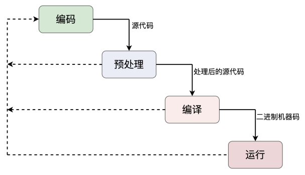
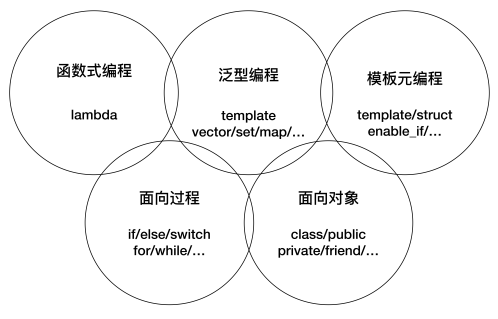

# 生命周期和编程范式

## C++ 程序的生命周期



###  编译阶段编程

```
template <int N>
struct Fib
{
	static const int value = Fib<N - 1>::value + Fib<N - 2>::value;
};

template <>
struct Fib<1>
{
	static const int value = 1;
};

template <>
struct Fib<0>
{
	static const int value = 1;
};

int main()
{
	std::cout << Fib<2>::value << std::endl; 
	std::cout << Fib<40>::value << std::endl;
	return 0;
}
```

### 静态断言

```
template <int N>
struct Fib
{
	static_assert(N >= 0,"N >= 0");
	static const int value = Fib<N - 1>::value + Fib<N - 2>::value;
};
```

static_assert 运行在编译阶段，只能看到编译时的常数和类型，看不到运行时的变量、指针、内存数据等。  

```
template <typename I,typename P>
struct Test{
	static_assert(std::is_integral<I>::value,"int");
	static_assert(std::is_pointer<P>::value, "ptr");
};
```

## C++ 语言的编程范式：



### 面向对象编程

面向对象编程的核心思想：封装，继承和多态。

注意：尽量少用继承和虚函数，减少继承的层次，一般不应该超过三层。  

"final" 标识符可以用于禁止继承：

```
struct Interface {
};

struct Implement final : public Interface{
};
```

现代 C++ 中一共有 6 个基本函数：

- 默认构造函数，拷贝构造函数，移动构造函数
- 赋值函数，移动赋值函数
- 析构函数

"default" 可以强制编译器提供某个函数的默认实现，"delete" 可以强制编译器删除某个函数的实现：

```
struct Test final
{
	Test() = default;
	Test(const Test& t) = delete;
};
```

"explicit"  关键字可以防止类隐式类型转换：

```
struct Test
{
	explicit Test(int i)  //@ 显式单参构造
	{
	}
	
	explicit operator bool() //@ 显式转换为 bool 类型
	{}
};
```

#### 委托构造函数

一个构造函数直接调用另一个构造函数，把构造工作“委托”出去，既简单又高效。  

```
struct Test final
{
public:
	Test(int a) : i(a)
	{
	}

	Test() : Test(0)
	{
	}

	Test(const std::string& s) : i(std::stoi(s))
	{
	}
private:
	int i;
};
```

#### 类内初始化

在 C++11 里，你可以在类里声明变量的同时给它赋值，实现初始化，这样不但简单清晰，也消除了隐患。  

```
struct Test final
{
public:
	Test(int a) : i(a) //@ 可以单独初始化某个数据成员
	{
	}

	Test() = default;  //@ 需要默认构造函数
	~Test() = default; //@ 需要默认析构函数

private:
	int i = 10;
	std::string s{"hello"};
	std::vector<int> v{ 1,2,3 };
};
```

#### 类型别名

C++11 扩展了关键字 using 的用法，增加了 typedef 的能力，可以定义类型别名。  

```
struct Test final
{
public:
	using VecI = std::vector<int>;
};
```

