# HTTP 请求的典型场景  

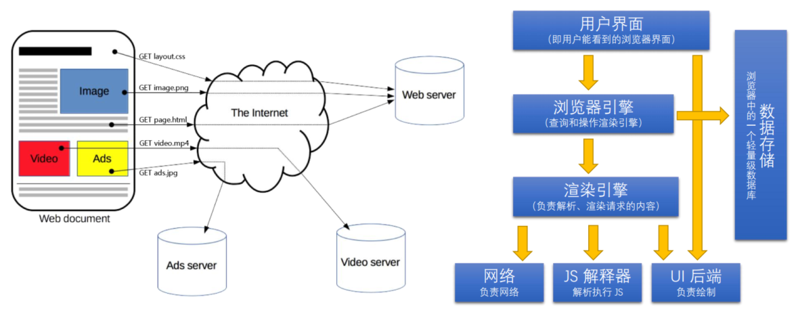

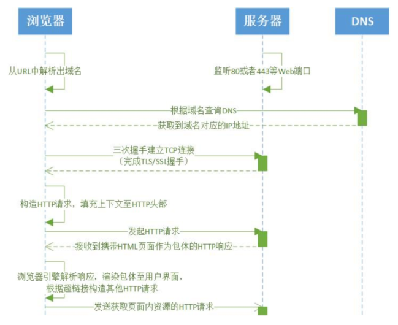

HTTP  协议是一种无状态的、应用层的、以请求/应答方式运行的协议，它使用可扩展的语义和自描述消息格式，与基于网络的超文本信息系统灵活的互动。

# HTTP 协议格式  

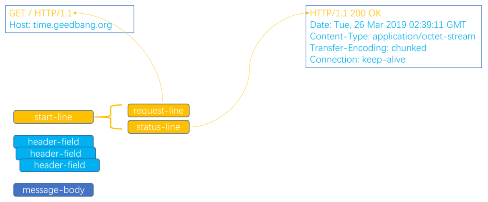

# OSI概念模型  

OSI（Open System Interconnection Reference Model）

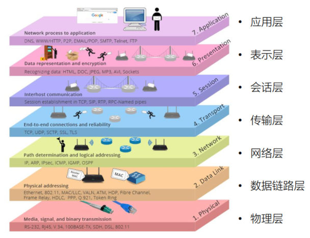

# OSI 模型与 TCP/IP 模型对照  

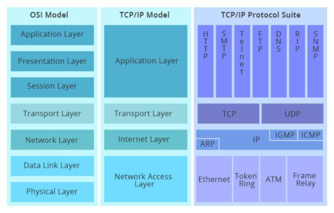

# 报文头部

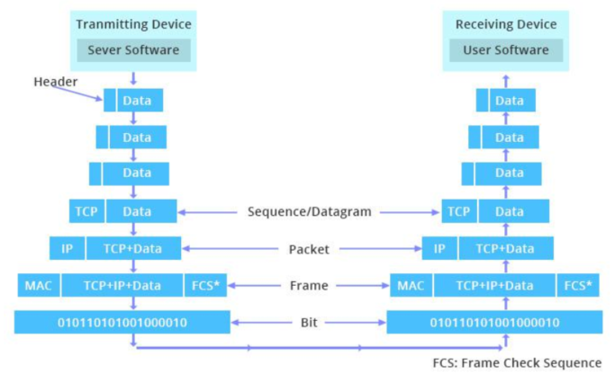

# 评估 Web 架构的关键属性  

HTTP 协议应当在以下属性中取得可接受的均衡：
- 性能 Performance：影响高可用的关键因素
- 可伸缩性 Scalability：支持部署可以互相交互的大量组件
- 简单性 Simplicity：易理解、易实现、易验证
- 可见性 Visiable：对两个组件间的交互进行监视或者仲裁的能力。如缓存、分层设计等
- 可移植性 Portability：在不同的环境下运行的能力
- 可靠性 Reliability：出现部分故障时，对整体影响的程度
- 可修改性 Modifiability：对系统作出修改的难易程度，由可进化性、可定制性、可扩展性、可配置性、可重用性构成

## 架构属性：性能  

- 网络性能 Network Performance
  - Throughput 吞吐量：小于等于带宽 bandwidth
  - Overhead 开销：首次开销，每次开销
- 用户感知到的性能 User-perceived Performance
  - Latency 延迟：发起请求到接收到响应的时间
  - Completion 完成时间：完成一个应用动作所花费的时间
- 网络效率 Network Efficiency
  - 重用缓存、减少交互次数、数据传输距离更近、COD  

## 架构属性：可修改性  

- 可进化性 Evolvability：一个组件独立升级而不影响其他组件
- 可扩展性 Extensibility ：向系统添加功能，而不会影响到系统的其他部分
- 可定制性 Customizability ：临时性、定制性地更改某一要素来提供服务，不对常规客户产生影响
- 可配置性 Configurability ：应用部署后可通过修改配置提供新的功能
- 可重用性 Reusabilit ：组件可以不做修改在其他应用在使用

# REST 架构下的 Web  

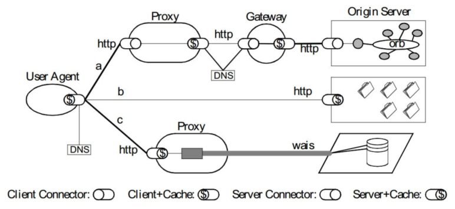

# URI  

URL： Uniform Resource Locator，表示资源的位置，期望提供查找资源的方法  

URN：  Uniform Resource Name，期望为资源提供持久的、位置无关的标识方式，并允许简单地将多个命名空间映射到单个URN命名
空间  

URI ： Uniform Resource Identifier，  用以区分资源，是 URL 和 URN 的超集，用以取代 URL 和 URN 概念    

## Uniform Resource Identifier 统一资源标识符  

Resource 资源，一个资源可以有多个 URI  

Identifier 标识符，将当前资源与其他资源区分开的名称  

Uniform 统一 ：

- 允许不同种类的资源在同一上下文中出现
- 对不同种类的资源标识符可以使用同一种语义进行解读
- 引入新标识符时，不会对已有标识符产生影响
- 允许同一资源标识符在不同的、internet 规模下的上下文中出现 

## URI 的组成  

组成：schema, user information, host, port, path, query, fragment  


## 为什么要进行 URI 编码  

- 传递数据中，如果存在用作分隔符的保留字符怎么办？  

- 对可能产生歧义性的数据编码
	- 不在 ASCII 码范围内的字符
	- ASCII 码中不可显示的字符
	- URI 中规定的保留字符
	- 不安全字符（传输环节中可能会被不正确处理），如空格、引号、尖括号等

## URI 百分号编码  

- 百分号编码的方式  
- 非 ASCII 码字符（例如中文）：建议先 UTF8 编码，再 US-ASCII 编码  
- 对 URI 合法字符，编码与不编码是等价的  

# 请求行  

request-line = method SP request-target SP HTTP-version CRLF  

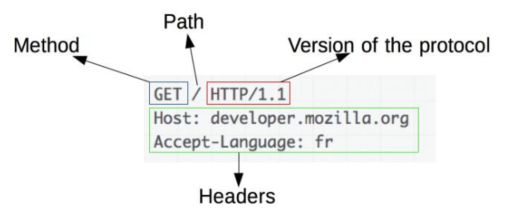

- method 方法：指明操作目的，动词  
- request-target = origin-form / absolute-form / authority-form / asterisk-form  
  - origin-form = absolute-path [ "?" query ]  
    - 向 origin server 发起的请求，path 为空时必须传递 /  
  - absolute-form = absolute-URI  
    - 仅用于向正向代理 proxy 发起请求时  
  - authority-form = authority  
    - 仅用于 CONNECT 方法  
  - asterisk-form = "*“  
    - 仅用于 OPTIONS 方法  

# 常见方法  

- GET：主要的获取信息方法，大量的性能优化都针对该方法，幂等方法
- HEAD：类似 GET 方法，但服务器不发送 BODY，用以获取 HEAD 元数据，幂等方法
- POST：常用于提交 HTML FORM 表单、新增资源等
- PUT：更新资源，带条件时是幂等方法
- DELETE：删除资源，幂等方法
- CONNECT：建立 tunnel 隧道
- OPTIONS：显示服务器对访问资源支持的方法，幂等方法
- TRACE：回显服务器收到的请求，用于定位问题。有安全风险

## 用于文档管理的 WEBDAV 方法(RFC2518)  

- PROPFIND：从 Web 资源中检索以 XML 格式存储的属性。它也被重载，以允许一个检索远程系统的集合结构（也叫目录层次结构）
- PROPPATCH：在单个原子性动作中更改和删除资源的多个属性
- MKCOL：创建集合或者目录
- COPY：将资源从一个 URI 复制到另一个 URI
- MOVE：将资源从一个 URI 移动到另一个 URI
- LOCK：锁定一个资源。WebDAV 支持共享锁和互斥锁。
- UNLOCK：解除资源的锁定

# HTTP 响应行  

status-line = HTTP-version SP status-code SP reason-phrase CRLF  

- status-code = 3DIGIT
- reason-phrase = *( HTAB / SP / VCHAR / obs-text )

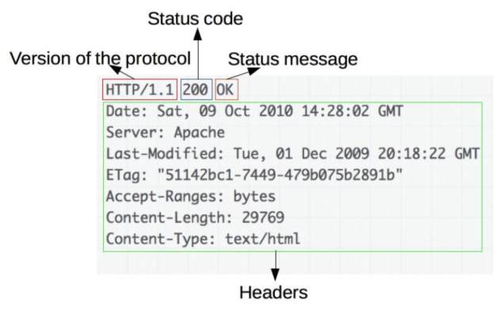

# 响应码  

## 1xx  

请求已接收到，需要进一步处理才能完成，HTTP1.0 不支持  

- 100 Continue：上传大文件前使用，由客户端发起请求中携带 Expect: 100-continue 头部触发  
- 101 Switch Protocols：协议升级使用，由客户端发起请求中携带 Upgrade: 头部触发，如升级 websocket 或者 http/2.0  
- 102 Processing：WebDAV 请求可能包含许多涉及文件操作的子请求，需要很长时间才能完成请求。该代码表示服务器已经收到并正在处理请求，但无响应可用。这样可以防止客户端超时，并假设请求丢失  

## 2xx  

成功处理请求  

- 200 OK: 成功返回响应
- 201 Created: 有新资源在服务器端被成功创建
- 202 Accepted: 服务器接收并开始处理请求，但请求未处理完成。这样一个模糊的概念是有意如此设计，可以覆盖更多的场景。例如异步、需要长时间处理的任务
- 203 Non-Authoritative Information：当代理服务器修改了 origin server 的原始响应包体时（例如更换了HTML中的元素值），代理服务器可以通过修改200为203的方式告知客户端这一事实，方便客户端为这一行为作出相应的处理。203响应可以被缓存
- 204 No Content：成功执行了请求且不携带响应包体，并暗示客户端无需更新当前的页面视图
- 205 Reset Content：成功执行了请求且不携带响应包体，同时指明客户端需要更新当前页面视图
- 206 Partial Content：使用 range 协议时返回部分响应内容时的响应码
- 207 Multi-Status：RFC4918 ，在 WEBDAV 协议中以 XML 返回多个资源的状态
- 208 Already Reported：RFC5842 ，为避免相同集合下资源在207响应码下重复上报，使用 208 可以使用父集合的响应码

## 3xx  

重定向使用 Location 指向的资源或者缓存中的资源。在 RFC2068 中规定客户端重定向次数不应超过 5 次，以防止死循环  

- 300 Multiple Choices：资源有多种表述，通过 300 返回给客户端后由其自行选择访问哪一种表述。由于缺乏明确的细节，300 很少使用
- 301 Moved Permanently：资源永久性的重定向到另一个 URI 中
- 302 Found：资源临时的重定向到另一个 URI 中
- 303 See Other：重定向到其他资源，常用于 POST/PUT 等方法的响应中
- 304 Not Modified：当客户端拥有可能过期的缓存时，会携带缓存的标识etag、时间等信息询问服务器缓存是否仍可复用，而304是告诉客户端可以复用缓存
- 307 Temporary Redirect：类似302，但明确重定向后请求方法必须与原请求方法相同，不得改变
- 308 Permanent Redirect：类似301，但明确重定向后请求方法必须与原请求方法相同，不得改变

## 4xx  

客户端出现错误  

- 400 Bad Request：服务器认为客户端出现了错误，但不能明确判断为以下哪种错误时使用此错误码。例如HTTP请求格式错误
- 401 Unauthorized：用户认证信息缺失或者不正确，导致服务器无法处理请求。
- 407 Proxy Authentication Required：对需要经由代理的请求，认证信息未通过代理服务器的验证
- 403 Forbidden：服务器理解请求的含义，但没有权限执行此请求
- 404 Not Found：服务器没有找到对应的资源
- 410 Gone：服务器没有找到对应的资源，且明确的知道该位置永久性找不到该资源
- 405 Method Not Allowed：服务器不支持请求行中的 method 方法
- 406 Not Acceptable：对客户端指定的资源表述不存在（例如对语言或者编码有要求），服务器返回表述列表供客户端选择。
- 408 Request Timeout：服务器接收请求超时
- 409 Conflict：资源冲突，例如上传文件时目标位置已经存在版本更新的资源
- 411 Length Required：如果请求含有包体且未携带 Content-Length 头部，且不属于chunk类请求时，返回 411
- 412 Precondition Failed：复用缓存时传递的 If-Unmodified-Since 或 IfNone-Match 头部不被满足
- 413 Payload Too Large/Request Entity Too Large：请求的包体超出服务器能处理的最大长度
- 414 URI Too Long：请求的 URI 超出服务器能接受的最大长度
- 415 Unsupported Media Type：上传的文件类型不被服务器支持
- 416 Range Not Satisfiable：无法提供 Range 请求中指定的那段包体
- 417 Expectation Failed：对于 Expect 请求头部期待的情况无法满足时的响应码
- 421 Misdirected Request：服务器认为这个请求不该发给它，因为它没有能力处理
- 426 Upgrade Required：服务器拒绝基于当前 HTTP 协议提供服务，通过Upgrade 头部告知客户端必须升级协议才能继续处理
- 428 Precondition Required：用户请求中缺失了条件类头部，例如 If-Match
- 429 Too Many Requests：客户端发送请求的速率过快
- 431 Request Header Fields Too Large：请求的 HEADER 头部大小超过限制
- 451 Unavailable For Legal Reasons：RFC7725 ，由于法律原因资源不可访问

## 5xx  

服务器端出现错误  

- 500 Internal Server Error：服务器内部错误，且不属于以下错误类型
- 501 Not Implemented：服务器不支持实现请求所需要的功能
- 502 Bad Gateway：代理服务器无法获取到合法响应
- 503 Service Unavailable：服务器资源尚未准备好处理当前请求
- 504 Gateway Timeout：代理服务器无法及时的从上游获得响应
- 505 HTTP Version Not Supported：请求使用的 HTTP 协议版本不支持
- 507 Insufficient Storage：服务器没有足够的空间处理请求
- 508 Loop Detected：访问资源时检测到循环
- 511 Network Authentication Required：代理服务器发现客户端需要进行身份验证才能获得网络访问权限

# HTTP 连接的常见流程  

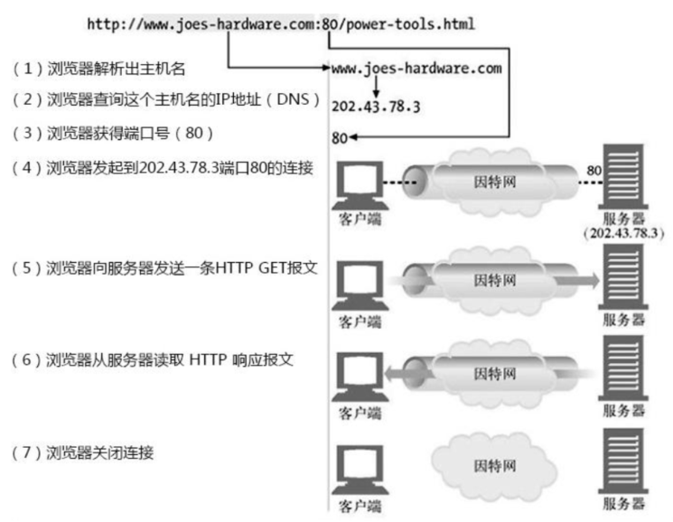

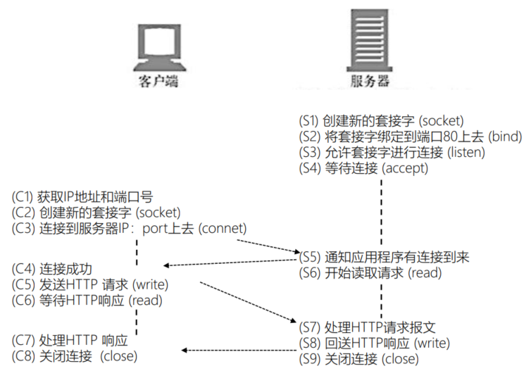

# 短连接与长连接  

Connection 头部  

- Keep-Alive：长连接
  - 客户端请求长连接
    - Connection: Keep-Alive
  - 服务器表示支持长连接
	  - Connection: Keep-Alive
  - 客户端复用连接
  - HTTP/1.1 默认支持长连接
	  - Connection: Keep-Alive 无意义  

- Close：短连接  
- 对代理服务器的要求  
  - 不转发 Connection 列出头部，该头部仅与当前连接相关  

Connection 仅针对当前连接有效，user agent 与 origin server 间有层层 proxy 代理  

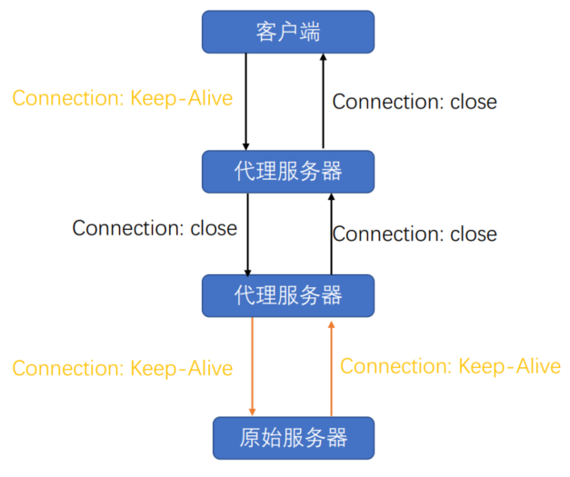

# Host 头部  

Host = uri-host [ ":" port ]  

- HTTP/1.1 规范要求，不传递 Host 头部则返回 400 错误响应码  
- 为防止陈旧的代理服务器，发向正向代理的请求 request-target 必须以absolute-form 形式出现  
  - request-line = method SP request-target SP HTTP-version CRLF  
  - absolute-form = absolute-URI  
    - absolute-URI = scheme ":" hier-part [ "?" query ]  

## Host 头部与消息的路由  

- 建立 TCP 连接，确定服务器的 IP 地址  
- 接收请求  
- 寻找虚拟主机，匹配 Host 头部与域名  
- 寻找 URI 的处理代码，匹配 URI  
- 执行处理请求的代码，访问资源    
- 生成 HTTP 响应，各中间件基于 PF 架构串行修改响应 
- 发送 HTTP 响应  
- 记录访问日志  

# 客户端与源服务器间存在多个代理  

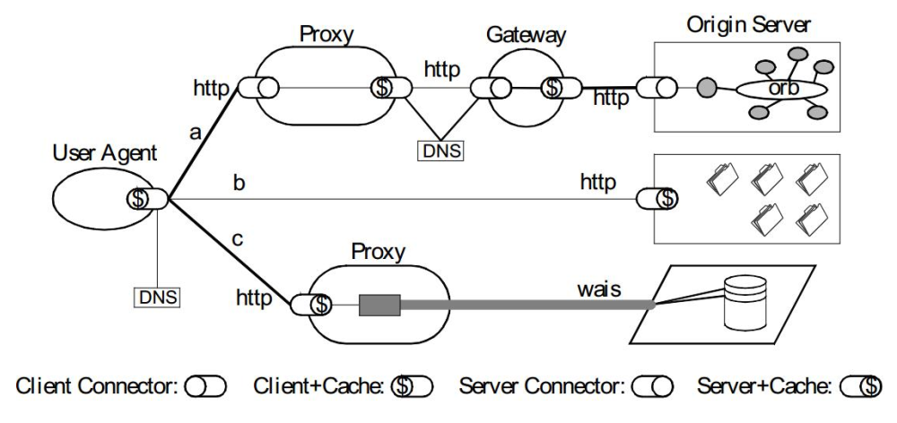

## 消息的转发  

Max-Forwards 头部  

- 限制 Proxy 代理服务器的最大转发次数，仅对 TRACE/OPTIONS 方法有效  
- Max-Forwards = 1*DIGIT  

Via 头部  

- 指明经过的代理服务器名称及版本  

Cache-Control:no-transform  

- 禁止代理服务器修改响应包体  

## 如何传递 IP 地址？  

- TCP 连接四元组（src ip,src port, dst ip,dst port）
- HTTP 头部 X-Real-IP 用于传递用户 IP
- HTTP 头部 X-Forwarded-For 用于传递 IP
- 网络中存在许多反向代理

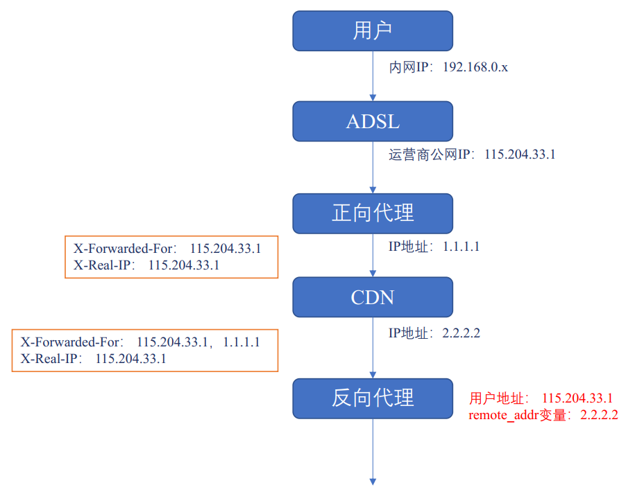

# 请求的上下文: User-Agent  

指明客户端的类型信息，服务器可以据此对资源的表述做抉择：

```
User-Agent = product *( RWS ( product / comment ) )
	product = token ["/" product-version]
	RWS = 1*( SP / HTAB )
```

请求的上下文: Referer，浏览器对来自某一页面的请求自动添加的头部：

Referer = absolute-URI / partial-URI  

Referer 不会被添加的场景：

- 来源页面采用的协议为表示本地文件的 "file" 或者 "data" URI  
- 当前请求页面采用的是 http 协议，而来源页面采用的是 https 协议  

请求的上下文: From，主要用于网络爬虫，告诉服务器如何通过邮件联系到爬虫的负责人  

From = mailbox  

# 响应的上下文

## 响应的上下文：Server  

指明服务器上所用软件的信息，用于帮助客户端定位问题或者统计数据  

Server = product *( RWS ( product / comment ) )  

- product = token ["/" product-version]  

## 响应的上下文： Allow 与 Accept-Ranges  

Allow：告诉客户端，服务器上该 URI 对应的资源允许哪些方法的执行  

Accept-Ranges：告诉客户端服务器上该资源是否允许 range 请求  

# 内容协商  

每个 URI 指向的资源可以是任何事物，可以有多种不同的表述，例如一份文档可以有不同语言的翻译、不同的媒体格式、可以针对不同的浏览器提供不同的压缩编码等。  

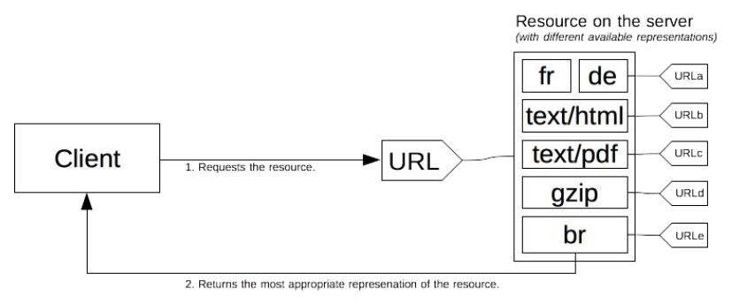

内容协商的两种方式  

- Proactive 主动式内容协商：指由客户端先在请求头部中提出需要的表述形式，而服务器根据这些请求头部提供特定的 representation 表述  
- Reactive 响应式内容协商：   指服务器返回 300 Multiple Choices 或者 406 Not Acceptable，由客户端选择一种表述 URI 使用   

## Proactive 主动式内容协商  

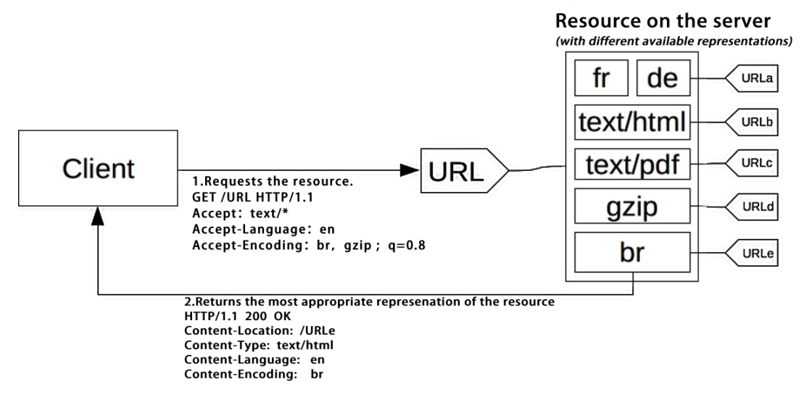

## Reactive 响应式内容协商  

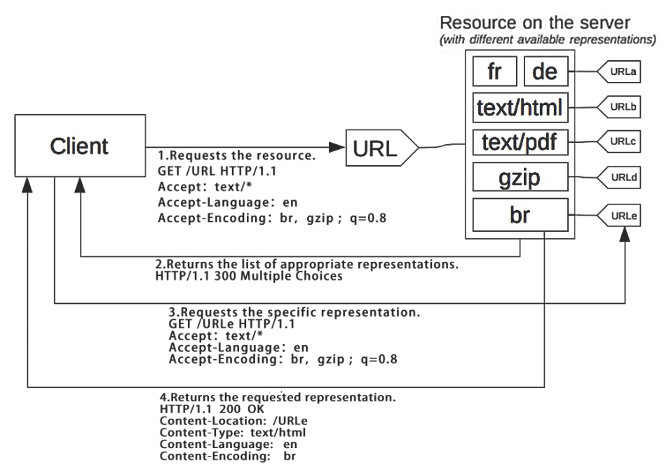

## 常见的协商要素  

- 质量因子 q：内容的质量、可接受类型的优先级  
- 媒体资源的 MIME 类型及质量因子  

## 常见的协商要素  

- 字符编码：由于 UTF-8 格式广为使用， Accept-Charset 已被废弃  
- 内容编码：主要指压缩算法  
- 表述语言  

## 国际化与本地化  

internationalization（i18n，i 和 n 间有 18 个字符），指设计软件时，在不同的国家、地区可以不做逻辑实现层面的修改便能够以不同的语言显示   

localization（l10n，l 和 n 间有 10 个字符）， 指内容协商时，根据请求中的语言及区域信息，选择特定的语言作为资源表述  

## 资源表述的元数据头部  

媒体类型、编码  

- content-type: text/html; charset=utf-8  

内容编码  

- content-encoding: gzip  

语言  

- Content-Language: de-DE, en-CA  

# HTTP 包体：承载的消息内容  

## 请求或者响应都可以携带包体  

HTTP-message = start-line *( header-field CRLF ) CRLF [ message-body ]  

- message-body = *OCTET：二进制字节流  

以下消息不能含有包体：

-  HEAD 方法请求对应的响应  
- 1xx、204、304 对应的响应  
- CONNECT 方法对应的 2xx 响应  

## 两种传输 HTTP 包体的方式  

发送 HTTP 消息时已能够确定包体的全部长度  

- 使用 Content-Length 头部明确指明包体长度  
- Content-Length = 1*DIGIT，用 10 进制（不是 16 进制）表示包体中的字节个数，且必须与实际传输的包体长度一致  
- 接收端处理更简单  

发送 HTTP 消息时不能确定包体的全部长度  

- 使用 Transfer-Encoding 头部指明使用 Chunk 传输方式  
- 含 Transfer-Encoding 头部后 Content-Length 头部应被忽略  
- 优点  
  - 基于长连接持续推送动态内容  
  - 压缩体积较大的包体时，不必完全压缩完（计算出头部）再发送，可以边发送边压缩  
  - 传递必须在包体传输完才能计算出的 Trailer 头部  

## Trailer 头部的传输   

- TE 头部：客户端在请求在声明是否接收 Trailer 头部  
  - TE: trailers  
- Trailer 头部：服务器告知接下来 chunk 包体后会传输哪些 Trailer 头部  
  - Trailer: Date  
- 以下头部不允许出现在 Trailer 的值中：  
  - 用于信息分帧的首部 (例如 Transfer-Encoding 和 Content-Length)  
  - 用于路由用途的首部 (例如 Host)  
  - 请求修饰首部 (例如控制类和条件类的，如 Cache-Control，Max-Forwards，或者 TE)  
  - 身份验证首部 (例如 Authorization 或者 Set-Cookie)  
  - Content-Encoding, Content-Type, Content-Range，以及 Trailer 自身  

## MIME  

MIME（ Multipurpose Internet Mail Extensions ）  

大小写不敏感，但通常是小写  

## Content-Disposition 头部  

disposition-type = "inline" | "attachment" | disp-ext-type  

- inline：指定包体是以 inline 内联的方式，作为页面的一部分展示  
- attachment：指定浏览器将包体以附件的方式下载  
- 在 multipart/form-data 类型应答中，可以用于子消息体部分  

# HTML FORM 表单  

HTML：HyperText Markup Language，结构化的标记语言（非编程语言），浏览器可以将 HTML 文件渲染为可视化网页  

FORM 表单：HTML 中的元素，提供了交互控制元件用来向服务器通过 HTTP 协议提交信息，常见控件有：  

- Text Input Controls：文本输入控件
- Checkboxes Controls：复选框控件
- Radio Box Controls ：单选按钮控件
- Select Box Controls：下拉列表控件
- File Select boxes：选取文件控件
- Clickable Buttons：可点击的按钮控件
- Submit and Reset Button：提交或者重置按钮控件

## HTML FORM 表单提交请求时的关键属性  

- action：提交时发起 HTTP 请求的 URI  
- method：提交时发起 HTTP 请求的 http 方法  
  - GET：通过 URI，将表单数据以 URI 参数的方式提交  
  - POST：将表单数据放在请求包体中提交  
- enctype：在 POST 方法下，对表单内容在请求包体中的编码方式  
  - application/x-www-form-urlencoded
    - 数据被编码成以 ‘&’ 分隔的键-值对, 同时以 ‘=’ 分隔键和值，字符以 URL 编码方式编码  
  - multipart/form-data
    - boundary 分隔符  
    - 每部分表述皆有HTTP头部描述子包体，例如 Content-Type  
    - last boundary 结尾  

##　multipart：一个包体中多个资源表述  

- Content-type 头部指明这是一个多表述包体  
  - Content-type: multipart/form-data;  
  - boundary=----WebKitFormBoundaryRRJKeWfHPGrS4LKe  
- Boundary 分隔符的格式  

# HTTP Range规范  

允许服务器基于客户端的请求只发送响应包体的一部分给到客户端，而客户端自动将多个片断的包体组合成完整的体积更大的包体

- 支持断点续传
- 支持多线程下载
- 支持视频播放器实时拖动  

服务器通过 Accept-Range 头部表示是否支持 Range 请求  

## Range 请求范围的单位  

基于字节，设包体总长度为 10000：

- 第 1 个 500 字节：bytes=0-499  
- 第 2 个 500 字节：
  - bytes=500-999
  - bytes=500-600,601-999
  - bytes=500-700,601-999  
- 最后 1 个 500 字节：
  - bytes=-500  
  - bytes=9500-  
  - 仅要第 1 个和最后 1 个字节：bytes=0-0,-1  

## Range 条件请求  

如果客户端已经得到了 Range 响应的一部分，并想在这部分响应未过期的情况下，获取其他部分的响应，常与 If-Unmodified-Since 或者 If-Match 头部共同使用   

If-Range = entity-tag / HTTP-date，可以使用 Etag 或者 Last-Modified  

## 服务器响应  

206 Partial Content：  

- Content-Range 头部：显示当前片断包体在完整包体中的位置  

416 Range Not Satisfiable：

- 请求范围不满足实际资源的大小，其中 Content-Range 中的 completelength 显示完整响应的长度  

200 OK：

- 服务器不支持 Range 请求时，则以 200 返回完整的响应包体  

## 多重范围与 multipart  

请求：  Range: bytes=0-50, 100-150  

响应：  Content-Type：multipart/byteranges; boundary=…  

# Cookie  

保存在客户端、由浏览器维护、表示应用状态的 HTTP 头部  

- 存放在内存或者磁盘中  
- 服务器端生成 Cookie 在响应中通过Set-Cookie 头部告知客户端（允许多个 Set-Cookie 头部传递多个值）  
- 客户端得到 Cookie 后，后续请求都会自动将 Cookie 头部携带至请求中  

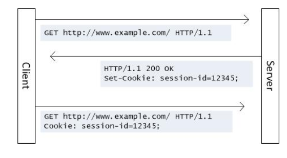

## Cookie 与 Set-Cookie头部的定义  

- Cookie 头部中可以存放多个 name/value 名值对  
- Set-Cookie 头部一次只能传递 1 个 name/value 名值对，响应中可以含多个头部  

## Set-Cookie 中描述 cookie-pair 的属性  

cookie-av = expires-av / max-age-av / domain-av / path-av / secure-av / httponly-av / extension-av  

- expires-av = "Expires=" sane-cookie-date  
  - cookie 到日期 sane-cookie-date 后失效  
- max-age-av = "Max-Age=" non-zero-digit *DIGIT  
  - cookie 经过 *DIGIT 秒后失效。max-age 优先级高于 expires  
- domain-av = "Domain=" domain-value  
  - 指定 cookie 可用于哪些域名，默认可以访问当前域名  
- path-av = "Path=" path-value  
  - 指定 Path 路径下才能使用 cookie  
- secure-av = "Secure“  
  - 只有使用 TLS/SSL 协议（https）时才能使用 cookie  
- httponly-av = "HttpOnly“  
  - 不能使用 JavaScript（Document.cookie 、XMLHttpRequest 、Request APIs）访问到 cookie  

## Cookie 使用的限制  

RFC 规范对浏览器使用 Cookie 的要求  

- 每条 Cookie 的长度（包括 name、value 以及描述的属性等总长度）至于要达到 4KB  
- 每个域名下至少支持 50 个 Cookie  
- 至少要支持 3000 个 Cookie  

代理服务器传递 Cookie 时会有限制  

##　Cookie 在协议设计上的问题  

- Cookie 会被附加在每个 HTTP 请求中，所以无形中增加了流量  
- 由于在 HTTP 请求中的 Cookie 是明文传递的，所以安全性成问题（除非用 HTTPS）  
- Cookie 的大小不应超过 4KB，故对于复杂的存储需求来说是不够用的  

## 登录场景下 Cookie 与 Session 的常见用法  

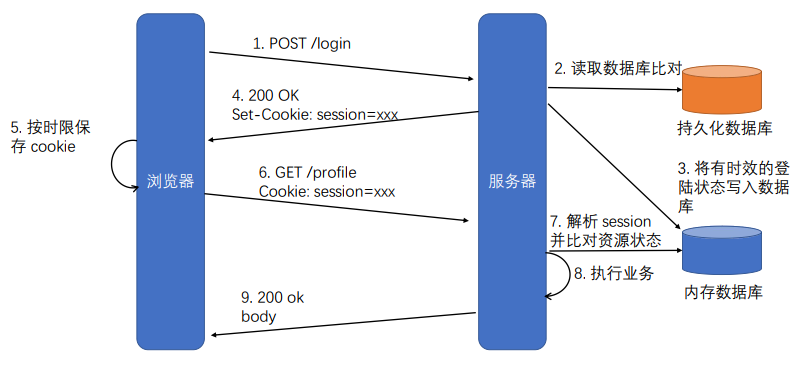

## 无状态的 REST 架构 VS 状态管理  

### 应用状态与资源状态  

应用状态：应由客户端管理，不应由服务器管理

- 如浏览器目前在哪一页
- REST 架构要求服务器不应保存应用状态  

资源状态：应由服务器管理，不应由客户端管理  

- 如数据库中存放的数据状态，例如用户的登陆信息  

### HTTP 请求的状态  

有状态的请求：服务器端保存请求的相关信息，每个请求可以使用以前保留的请求相关信息  

- 服务器 session 机制使服务器保存请求的相关信息
- cookie 使请求可以携带查询信息，与 session 配合完成有状态的请求  

无状态的请求：服务器能够处理的所有信息都来自当前请求所携带的信息  

- 服务器不会保存 session 信息
- 请求可以通过 cookie 携带  

# 为什么需要同源策略？  

同一个浏览器发出的请求，未必都是用户自愿发出的请求

只有 page.html 是用户发出的，其他请求是浏览器自动发出的： 

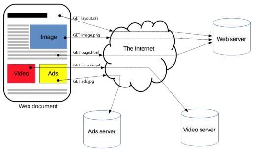

站点 domain-b.com 收到的来自同一浏览器的请求，可能来自于站点domain-a.com：

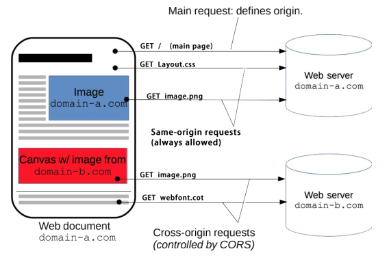

## 没有同源策略下的 Cookie  

只能保证用户请求来自于同一浏览器，不能确保是用户自愿发出的  

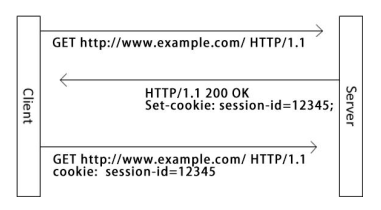

- 访问站点 A 后，站点 A 通过 Set-Cookie：Cookie 头部将 Cookie 返回给浏览器  
- 浏览器会保存 Cookie，留待下次访问
- 站点 B 的脚本访问站点 A 时，浏览器会自动将 Cookie: cookie 添加到请求的头部访问站点 A ，提升用户体验  
- 站点 A 的鉴权策略：取出 Cookie 值与数据库或者缓存中的 token 验证，通过后将数据赋予请求继续处理  

## 浏览器的同源策略  

限制了从同一个源加载的文档或脚本如何与来自另一个源的资源进行交互  

- 何谓同源？协议、主机、端口必须完全相同  

## 安全性与可用性需要一个平衡点  

可用性：HTML 的创作者决定跨域请求是否对本站点安全  

- 带有 src 属性可以跨域访问  
- 允许跨域写操作：例如表单提交或者重定向请求，CSRF安全性问题  

安全性：浏览器需要防止站点 A 的脚本向站点 B 发起危险动作  

- Cookie、LocalStorage 和 IndexDB 无法读取
- DOM 无法获得（防止跨域脚本篡改 DOM 结构）
- AJAX 请求不能发送  

### 跨站请求伪造攻击  

CSRF，Cross-Site Request Forgery：

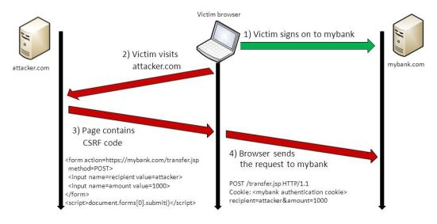

CSRF 的一种防攻击方式：

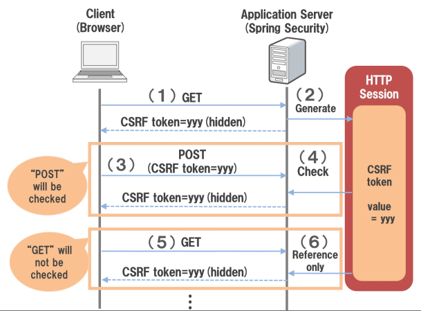

### CORS：Cross-Origin Resource Sharing  

浏览器同源策略下的跨域访问解决方案：

- 如果站点 A 允许站点 B 的脚本访问其资源，必须在 HTTP 响应中显式的告知浏览器：站点 B 是被允许的  
  - 访问站点 A 的请求，浏览器应告知该请求来自站点 B 
  - 站点 A 的响应中，应明确哪些跨域请求是被允许的   

策略 1：何为简单请求？  

- GET/HEAD/POST 方法之一
- 仅能使用 CORS 安全的头部：Accept、Accept-Language、Content-Language、Content-Type
- Content-Type 值只能是： text/plain、multipart/form-data、application/x-www-form-urlencoded 三者其中之一  

策略 2：简单请求以外的其他请求  

- 访问资源前，需要先发起 prefilght 预检请求（方法为 OPTIONS）询问何种请求是被允许的  

### 简单请求的跨域访问  

- 请求中携带 Origin 头部告知来自哪个域
- 响应中携带 Access-Control-Allow-Origin 头部表示允许哪些域
- 浏览器放行  

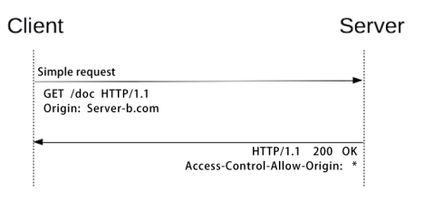

### 预检请求  

预检请求头部

- Access-Control-Request-Method
- Access-Control-Request-Headers  

预检请求响应

- Access-Control-Allow-Methods
- Access-Control-Allow-Headers
- Access-Control-Max-Age  

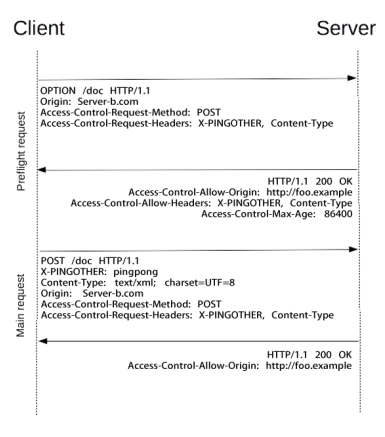

### 跨域访问资源：请求头部  

请求头部

- Origin：一个页面的资源可能来自于多个域名，在 AJAX 等子请求中标明来源于某个域名下的脚本，以通过服务器的安全校验  
- Access-Control-Request-Method  
  - 在 preflight 预检请求 (OPTIONS) 中，告知服务器接下来的请求会使用哪些方法  
- Access-Control-Request-Headers  
  - 在 preflight 预检请求 (OPTIONS) 中，告知服务器接下来的请求会传递哪些头部  

### 跨域访问资源：响应头部  

响应头部
- Access-Control-Allow-Methods
  - 在 preflight 预检请求的响应中，告知客户端后续请求允许使用的方法
- Access-Control-Allow-Headers
  - 在 preflight 预检请求的响应中，告知客户端后续请求允许携带的头部
- Access-Control-Max-Age
  - 在 preflight 预检请求的响应中，告知客户端该响应的信息可以缓存多久
- Access-Control-Expose-Headers
  - 告知浏览器哪些响应头部可以供客户端使用，默认情况下只有 Cache-Control、Content-Language、Content-Type、Expires、Last-Modified、Pragma 可供使用
- Access-Control-Allow-Origin
  - 告知浏览器允许哪些域访问当前资源，*表示允许所有域。为避免缓存错乱，响应中需要携带 Vary: Origin
- Access-Control-Allow-Credentials
  - 告知浏览器是否可以将 Credentials 暴露给客户端使用，Credentials 包含 cookie、authorization 类头部、TLS证书等

# 资源 URI 与资源表述 Representation  

资源 R 可被定义为随时间变化的函数 MR(t)  

- 静态资源：创建后任何时刻值都不变，例如指定版本号的库文件
- 动态资源：其值随时间而频繁地变化，例如某新闻站点首页  

优点：

- 提供了无需人为设定类型或者实现方式的情况下，同一资源多种不同来源的信息  
- 基于请求特性进行内容协商，使资源的渲染延迟绑定  
- 允许表述概念而不是具体的 Representation，故资源变化时不用修改所有链接  

## Preconditon 条件请求  

目的：由客户端携带条件判断信息，而服务器预执行条件验证过程成功后，再返回资源的表述  

常见应用场景：

- 使缓存的更新更有效率  
- 断点续传时对之前内容的验证  
- 当多个客户端并行修改同一资源时，防止某一客户端的更新被错误丢弃  

## 强验证器与弱验证器的概念  

验证器 validator：根据客户端请求中携带的相关头部，以及服务器资源的信息，执行两端的资源验证  

- 强验证器：服务器上的资源表述只要有变动（例如版本更新或者元数据更新），那么以旧的验证头部访问一定会导致验证不过
- 弱验证器：服务器上资源变动时，允许一定程度上仍然可以验证通过（例如一小段时间内仍然允许缓存有效）  

## 验证器响应头部  

Etag 响应头部，给出当前资源表述的标签  

Last-Modified 响应头部，表示对应资源表述的上次修改时间  

## 条件请求头部  

- If-Match = 
- If-None-Match = 
-  If-Modified-Since =
- If-Unmodified-Since =
- If-Range =   

## 缓存更新  

首次缓存：

## 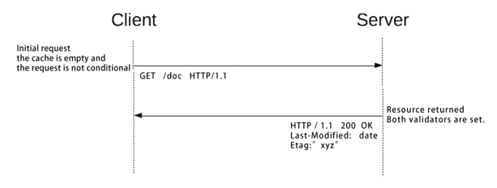

基于过期缓存发起条件请求：

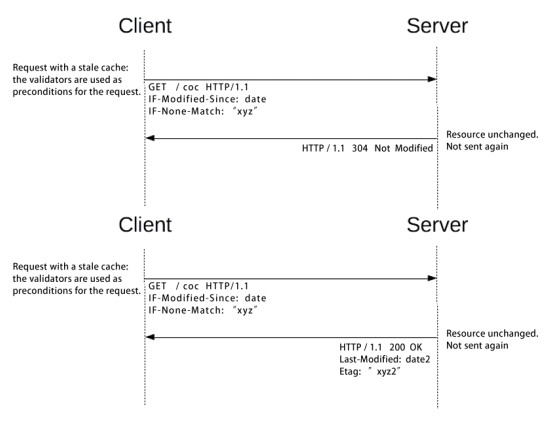

增量更新：

当服务器支持 Range服务时，连接意外中断时已接收到部分数据：

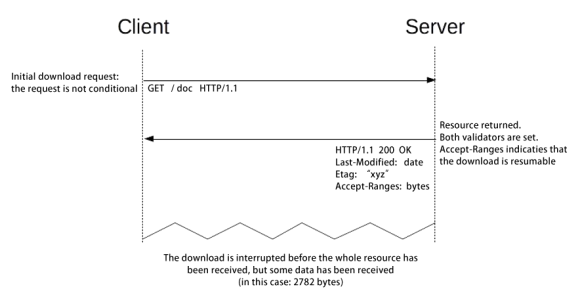

通过 Range 请求下载其他包体时，加入验证器防止两次下载间资源已发生了变更：

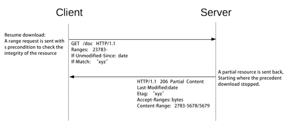

如果两次下载操作中，资源已经变量，则服务器用 412 通知客户端，而客户端重新下载完整包体  

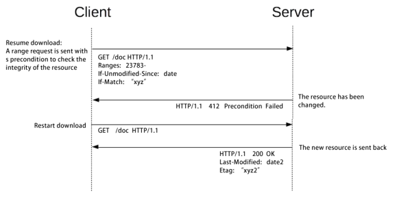

通过 If-Range 头部可以避免 2 次请求交互带来的损耗：

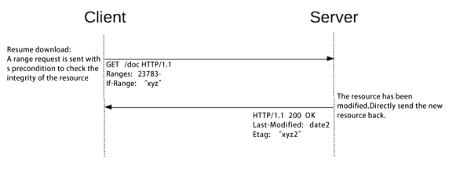

更新资源意味着 2 步操作：先获取资源，再把本地修改后的资源提交  

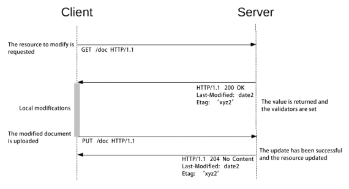

2 个客户端并发修改同一资源会导致更新丢失  

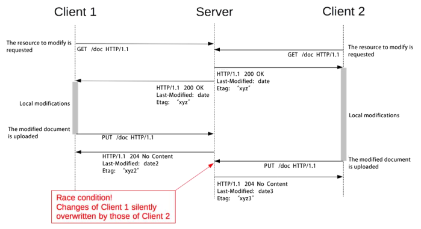

## 乐观锁  

只允许第 1 个提交更新的客户端更新资源  

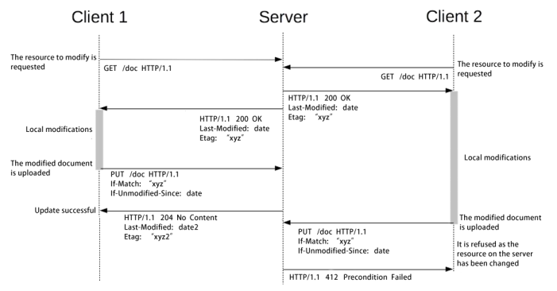

乐观锁解决首次上传  

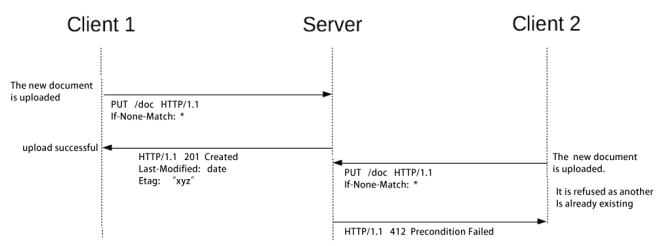

## HTTP 缓存  

为当前请求复用前请求的响应

- 目标：减少时延；降低带宽消耗  
- 可选而又必要  

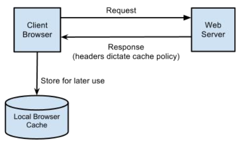

如果缓存没有过期：

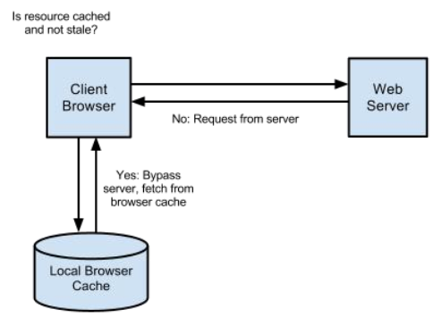

如果缓存过期，则继续从服务器验证：

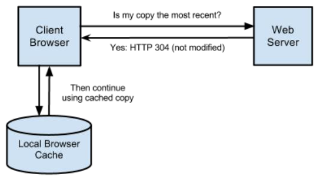

## 私有缓存与共享缓存  

- 私有缓存：仅供一个用户使用的缓存，通常只存在于如浏览器这样的客户端上  
- 共享缓存：可以供多个用户的缓存，存在于网络中负责转发消息的代理服务器（对热点资源常使用共享缓存，以减轻源服务器的压力，并提升网络效率）  
  - Authentication 响应不可被代理服务器缓存  
  - 正向代理  
  - 反向代理  

过期的共享缓存--代理服务器  

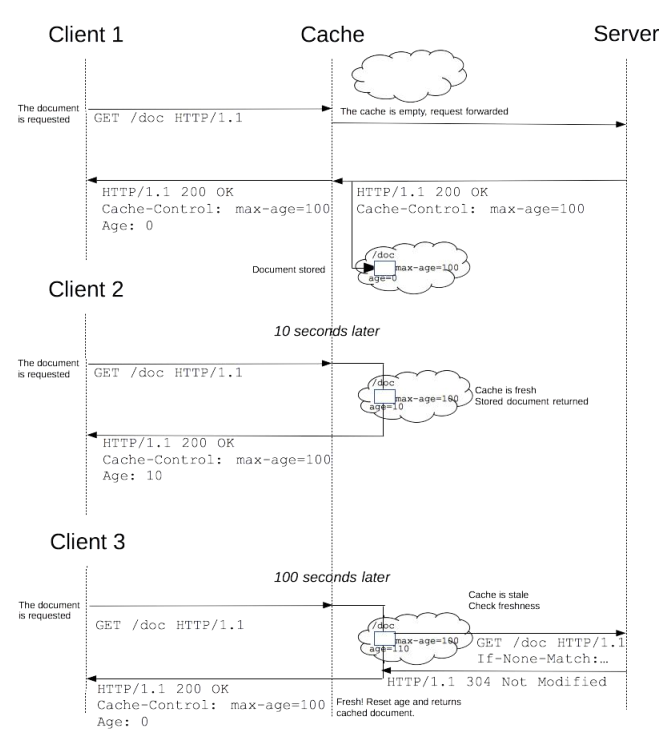

## 判断缓存是否过期  

response_is_fresh = (freshness_lifetime > current_age)  

freshness_lifetime：按优先级，取以下响应头部的值  

s-maxage > max-age > Expires > 预估过期时间  

例如：
• Cache-Control: s-maxage=3600
• Cache-Control: max-age=86400
• Expires: Fri, 03 May 2019 03:15:20 GMT
• Expires = HTTP-date，指明缓存的绝对过期时间  

常见的预估时间：RFC7234 推荐：（DownloadTime– LastModified)*10%   

### Age 头部及 current_age 的计算  

Age 表示自源服务器发出响应（或者验证过期缓存），到使用缓存的响应发出时经过的秒数  

对于代理服务器管理的共享缓存，客户端可以根据 Age 头部判断缓存时间：Age = delta-seconds  

current_age 计算：current_age = corrected_initial_age + resident_time;  

- resident_time = now - response_time(接收到响应的时间);
- corrected_initial_age = max(apparent_age, corrected_age_value);
- corrected_age_value = age_value + response_delay;
- response_delay = response_time - request_time(发起请求的时间);
- apparent_age = max(0, response_time - date_value);  

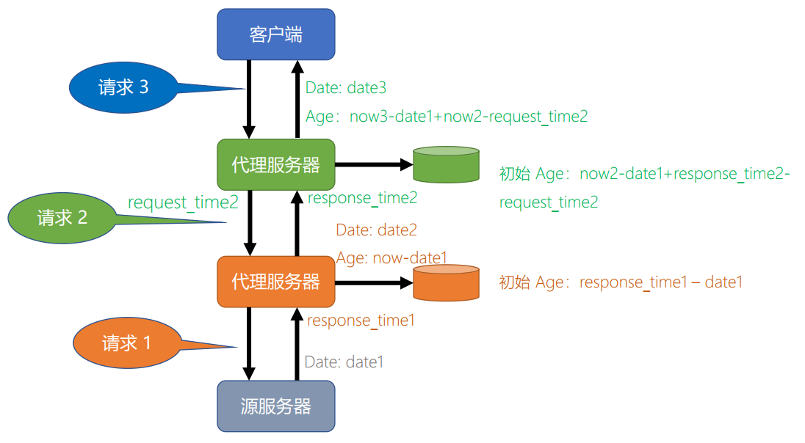

## Cache-Control 头部  

Cache-Control = 1#cache-directive  

cache-directive = token [ "=" ( token / quoted-string ) ]  

- 请求中的头部：max-age、max-stale、min-fresh、no-cache、nostore、no-transform、only-if-cached
- 响应中的头部： max-age、s-maxage 、 must-revalidate 、proxyrevalidate 、no-cache、no-store、no-transform、public、private  

Cache-Control 头部在请求中的值  

### Cache-Control 头部在请求中的值  

- max-age：告诉服务器，客户端不会接受 Age 超出 max-age 秒的缓存
- max-stale：告诉服务器，即使缓存不再新鲜，但陈旧秒数没有超出 max-stale 时，客户端仍打算使用。若 max-stale 后没有值，则表示无论过期多久客户端都可使用
- min-fresh：告诉服务器，Age 至少经过 min-fresh 秒后缓存才可使用
- no-cache：告诉服务器，不能直接使用已有缓存作为响应返回，除非带着缓存条件到上游服务端得到 304 验证返回码才可使用现有缓存
- no-store：告诉各代理服务器不要对该请求的响应缓存（实际有不少不遵守该规定的代理服务器）
- no-transform：告诉代理服务器不要修改消息包体的内容
- only-if-cached：告诉服务器仅能返回缓存的响应，否则若没有缓存则返回 504 错误码  

### Cache-Control 头部在响应中的值  

- must-revalidate：告诉客户端一旦缓存过期，必须向服务器验证后才可使用
- proxy-revalidate：与 must-revalidate 类似，但它仅对代理服务器的共享缓存有效
- no-cache：告诉客户端不能直接使用缓存的响应，使用前必须在源服务器验证得到 304 返回码。如果 no-cache 后指定头部，则若客户端的后续请求及响应
  中不含有这些头则可直接使用缓存
- max-age：告诉客户端缓存 Age 超出 max-age 秒后则缓存过期  
- s-maxage：与 max-age 相似，但仅针对共享缓存，且优先级高于 max-age 和 Expires
- public：表示无论私有缓存或者共享缓存，皆可将该响应缓存
- private：表示该响应不能被代理服务器作为共享缓存使用。若 private 后指定头部，则在告诉代理服务器不能缓存指定的头部，但可缓存其他部分
- no-store：告诉所有下游节点不能对响应进行缓存
- no-transform：告诉代理服务器不能修改消息包体的内容  

## 什么样的 HTTP 响应会缓存？  

- 请求方法可以被缓存理解（不只于 GET 方法）
- 响应码可以被缓存理解（404、206 也可以被缓存）
- 响应与请求的头部没有指明 no-store
- 响应中至少应含有以下头部中的 1 个或者多个：
  - Expires、max-age、s-maxage、public
  - 当响应中没有明确指示过期时间的头部时，如果响应码非常明确，也可以缓存
- 如果缓存在代理服务器上
  - 不含有 private
  - 不含有 Authorization  

## 使用缓存作为当前请求响应的条件  

- URI 是匹配的，URI 作为主要的缓存关键字，当一个 URI 同时对应多份缓存时，选择日期最近的缓存；缓存中的响应允许当前请求的方法使用缓存
- 缓存中的响应 Vary 头部指定的头部必须与请求中的头部相匹配  
- 当前请求以及缓存中的响应都不包含 no-cache 头部  
- 缓存中的响应必须是以下三者之一：  
  - 新鲜的（时间上未过期）  
  - 缓存中的响应头部明确告知可以使用过期的响应  
  - 使用条件请求去服务器端验证请求是否过期，得到 304 响应  

## Vary 缓存  

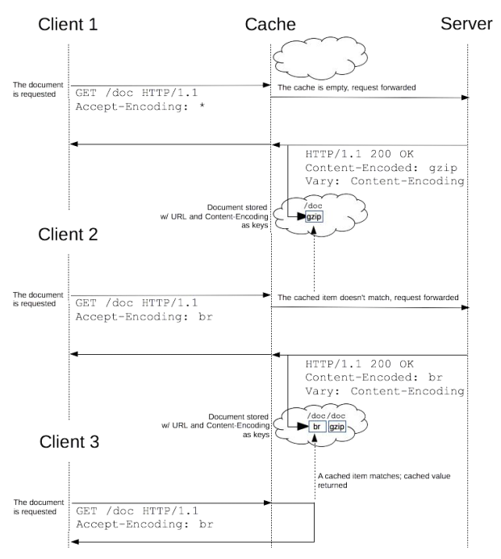

## Warning 头部：对响应码进行补充（缓存或包体转换  

常见的 warn-code：

- Warning: 110 - "Response is Stale“
- Warning: 111 - "Revalidation Failed“
- Warning: 112 - "Disconnected Operation“
-  Warning: 113 - "Heuristic Expiration“
-  Warning: 199 - "Miscellaneous Warning“
-  Warning: 214 - "Transformation Applied“
-  Warning: 299 - "Miscellaneous Persistent Warning"  

## 验证请求与响应  

验证请求

- 若缓存响应中含有 Last-Modified 头部
  - If-Unmodified-Since
  - If-Modified-Since
  - If-Range
- 若缓存响应中含有 Etag 头部
  - If-None-Match
  - If-Match
  - If-Range  

# URI 重定向  

## 重定向的流程
当浏览器接收到重定向响应码时，需要读取响应头部 Location 头部的值，获取到新的 URI 再跳转访问该页面  

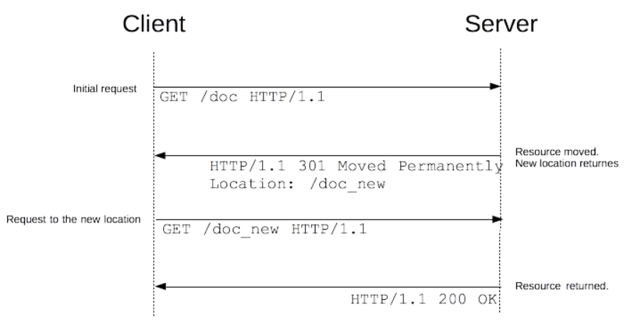

Location 头部，Location = URI-reference（对 201 响应码表示新创建的资源）  

## 重定向响应返回码  

概念

- 原请求：接收到重定向响应码的请求这里称为原请求
- 重定向请求：浏览器接收到重定向响应码后，会发起新的重定向请求  

永久重定向，表示资源永久性变更到新的 URI

- 301（HTTP/1.0）：重定向请求通常（由于历史原因一些浏览器会把 POST 改为 GET）会使用 GET 方法，而不管原请求究竟采用的是什么方法
- 308（HTTP/1.1）  

临时重定向，表示资源只是临时的变更 URI

- 302 （HTTP/1.0）：重定向请求通常会使用 GET 方法，而不管原请求究竟采用的是什么方法
- 303 （HTTP/1.1）：它并不表示资源变迁，而是用新 URI 的响应表述而为原请求服务，重定向请求会使用 GET 方法，例如表单提交后向用户返回新内容（亦可防止重复提交）
- 307 （HTTP/1.1）：重定向请求必须使用原请求的方法和包体发起访问  

特殊重定向

- 300：响应式内容协商中，告知客户端有多种资源表述，要求客户端选择一种自认为合适的表述
- 304：服务器端验证过期缓存有效后，要求客户端使用该缓存  

## 重定向循环  

服务器端在生成 Location 重定向 URI 时，在同一条路径上使用了之前的URI，导致无限循环出现  

## Http Tunnel 隧道  

用于通过 HTTP 连接传输非 HTTP协议格式的消息，常用于穿越防火墙  

建立隧道后，由于传输的并非HTTP 消息，因此不再遵循请求/响应模式，已变为双向传输  

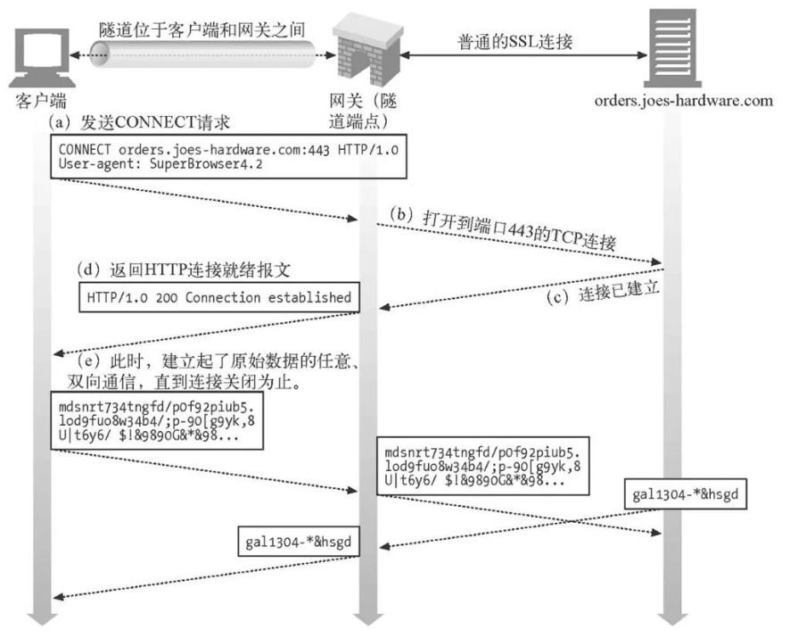

## 请求行  

request-line = method SP request-target SP HTTP-version CRLF
request-target = origin-form / absolute-form / authority-form / asterisk-form
- origin-form = absolute-path [ "?" query ]
	- 向源服务器发起的请求，path 为空时必须传递 /
- absolute-form = absolute-URI
	- 仅用于向正向代理 proxy 发起请求时，详见正向代理与隧道
- authority-form = authority
  - authority = [ userinfo “@” ] host [ “:” port ]，指定源服务器
  - 仅用于 CONNECT 方法，例如 CONNECT www.example.com:80 HTTP/1.1
- asterisk-form = "*“
  - 仅用于 OPTIONS 方法

## tunnel 隧道的常见用途：传递 SSL 消息  

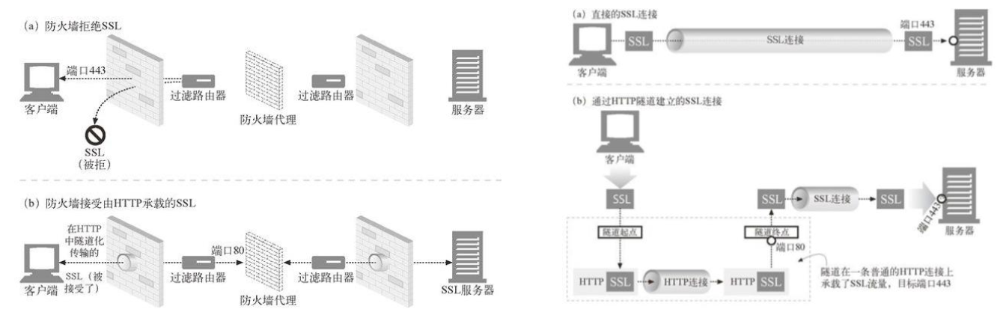

Http Tunnel 隧道的认证：

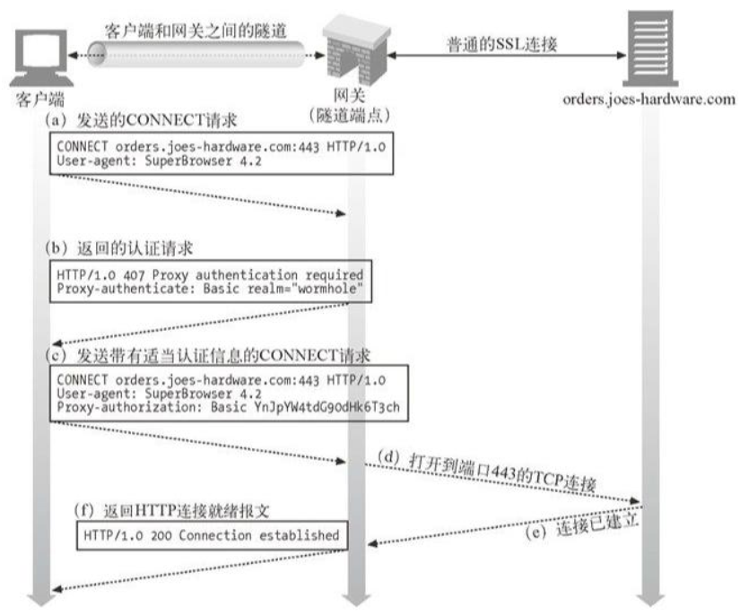

# 什么是 DNS？  

一个用于将人类可读的“域名”（例如 www.taohui.pub）与服务器的IP地址（例如 116.62.160.193）进行映射的数据库  

递归查询

- 根域名服务器
- 权威服务器  

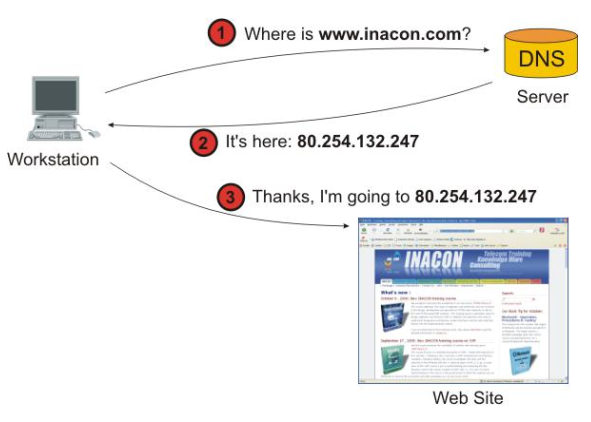

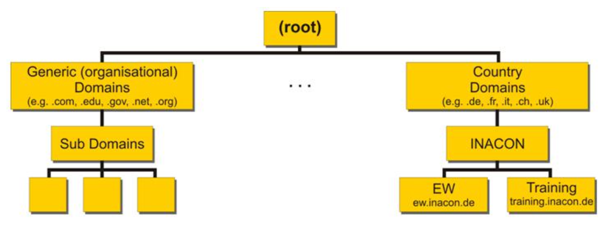

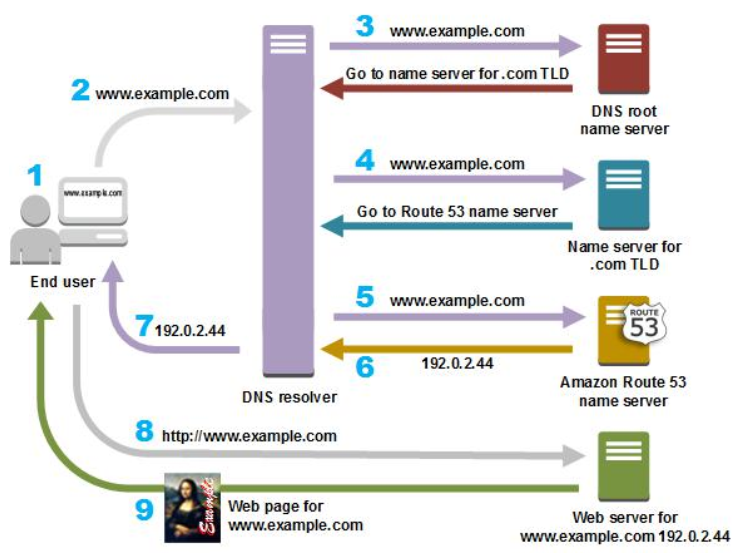

DNS 报文：查询与响应  

- query：查询域名  
- response：返回 IP 地址  

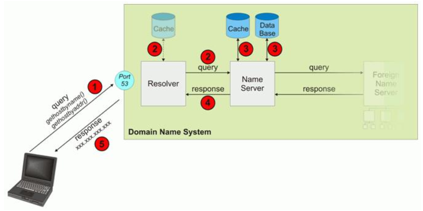

## DNS 报文  

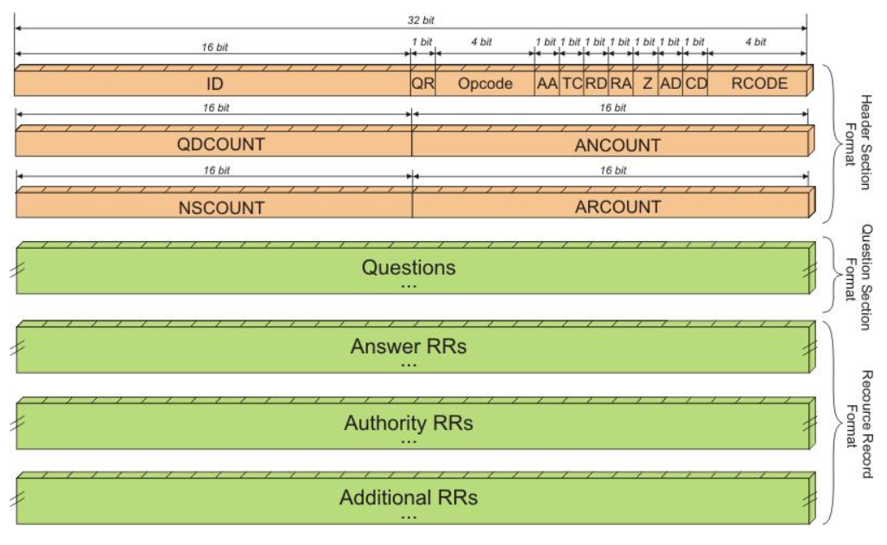

### Questions 格式  

QNAME 编码规则：

- 以.分隔为多段，每段以字节数打头
  - 单字节，前 2 比特必须为 00，只能表示2^6-1=63 字节
- 在 ASCII 编码每段字符
- 以 0 结尾  

QTYPE 常用类型  


QCLASS：IN 表示 internet  

### Answer 格式  

- NAME：前 2 位为 11，接引用 QNAME 偏移
  - 在 DNS 头部的字符偏移数
- TTL：Time To Live
- RDLENGTH：指明 RDATA 的长度
- RDATA：查询值，如 IP 地址，或者别名
  - 别名遵循 QNAME 编码规则
