# HTTP/1.1 发展中遇到的问题  

## HTTP/1.1 发明以来发生了哪些变化？  

- 从几 KB 大小的消息，到几 MB 大小的消息  
- 每个页面小于 10 个资源，到每页面 100 多个资源  
- 从文本为主的内容，到富媒体（如图片、声音、视频）为主的内容  
- 对页面内容实时性高要求的应用越来越多  

## HTTP/1.1 的高延迟问题  

高延迟带来页面加载速度的降低  

- 随着带宽的增加，延迟并没有显著下降
- 并发连接有限
- 同一连接同时只能在完成一个 HTTP 事务（请求/响应）才能处理下一个事务  

## 高延迟 VS 高带宽  

单连接上的串行请求，无状态导致的高传输量（低网络效率）  

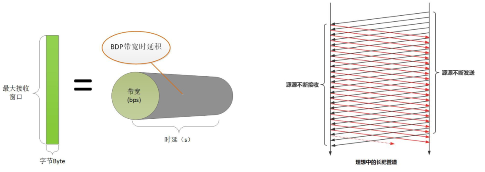

## 无状态特性带来的巨大 HTTP 头部  

重复传输的体积巨大的 HTTP 头部  

## HTTP/1.1 为了解决性能问题做过的努力  

- Spriting 合并多张小图为一张大图供浏览器 JS 切割使用  
  - 不能区别对待  
- Inlining 内联，将图片嵌入到 CSS 或者 HTML 文件中，减少网络请求次数  
- Concatenation 拼接，将多个体积较小的 JavaScript 使用 webpack 等工具打包成 1个体积更大的 JavaScript 文件  
  - 1 个文件的改动导致用户重新下载多个文件  
- Sharding 分片，将同一页面的资源分散到不同域名下，提升连接上限  

## HTTP/1.1 不支持服务器推送消息  

# HTTP/2 有哪些特性  

## 解决 HTTP/1 性能问题的 HTTP/2  

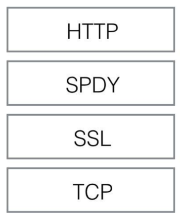

- SPDY（2012-2016）
- HTTP2（RFC7540，2015.5）
  - 在应用层上修改，基于并充分挖掘 TCP 协议性能
  - 客户端向 server 发送 request 这种基本模型不会变
  - 老的 scheme 不会变，没有 http2://
  - 使用 http/1.x 的客户端和服务器可以无缝的通过代理方式转接到 http/2 上
  - 不识别 http/2 的代理服务器可以将请求降级到 http/1.x

## 多路复用带来的提升  

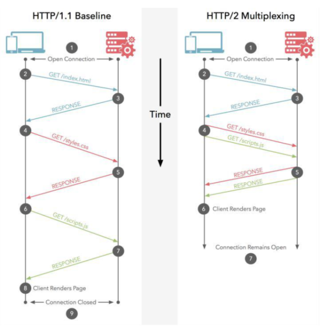

## HTTP/2 主要特性  

- 传输数据量的大幅减少
  - 以二进制方式传输
  - 标头压缩

- 多路复用及相关功能
  - 消息优先级
- 服务器消息推送
  - 并行推送

# h2c：如何从 http://升级到 HTTP/2 协议？  

## HTTP/2 是不是必须基于 TLS/SSL 协议？  

- IETF 标准不要求必须基于TLS/SSL协议
- 浏览器要求必须基于TLS/SSL协议
- 在 TLS 层 ALPN (Application Layer Protocol Negotiation)扩展做协商，只认HTTP/1.x 的代理服务器不会干扰 HTTP/2
- shema：http://和 https:// 默认基于 80 和 443 端口
- h2：基于 TLS 协议运行的 HTTP/2 被称为 h2
- h2c：直接在 TCP 协议之上运行的 HTTP/2 被称为 h2c

## h2 与 h2c  

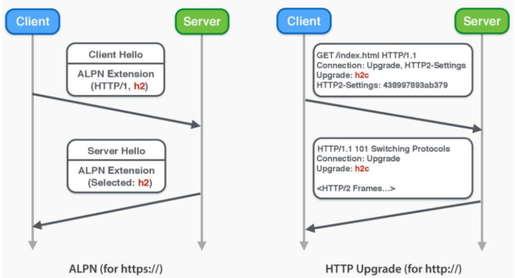

## H2C：不使用 TLS 协议进行协议升级  

## H2C：客户端发送的 Magic 帧  

Preface（ASCII 编码，12字节）  

- 何时发送？
  - 接收到服务器发送来的 101 Switching Protocols
  - TLS 握手成功后
- Preface 内容
  - 0x505249202a20485454502f322e300d0a0d0a534d0d0a0d0a
  - PRI * HTTP/2.0\r\n\r\nSM\r\n\r\n
- 发送完毕后，应紧跟 SETTING 帧  

## 统一的连接过程  

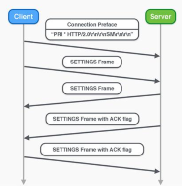

# h2：如何从 https://升级到 HTTP/2 协议？  

## 在 HTTP/2 应用层协议之下的 TLS 层  

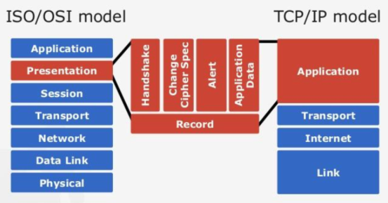

## TLS 通讯过程  

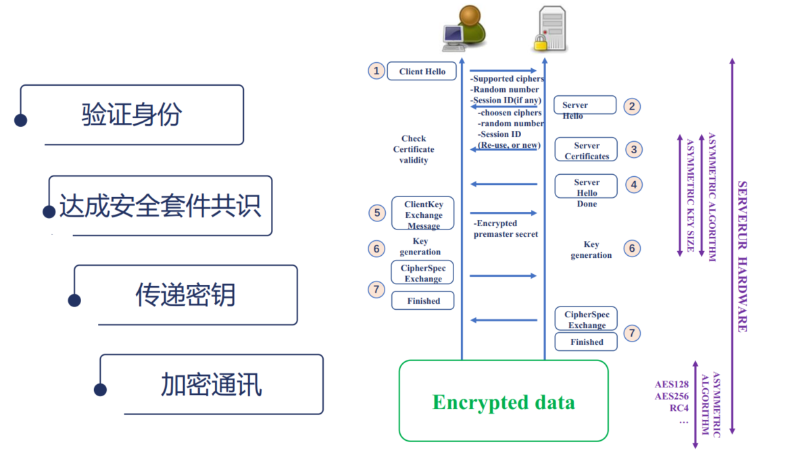

## Next Protocol Negotiation (NPN)  

SPDY 使用的由客户端选择协议的 NPN 扩展  

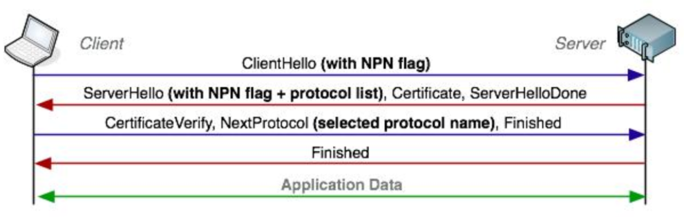

## Application-Layer Protocol Negotiation Extension  

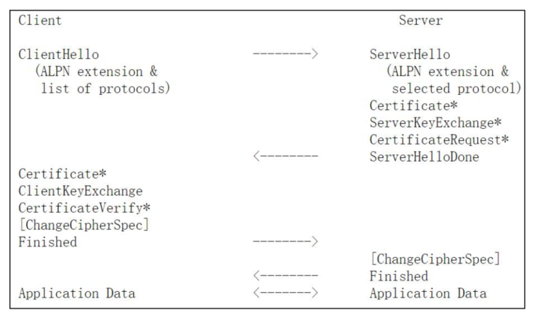

# Stream、Message、Frame 间的关系  

## HTTP/2 核心概念  

- 连接 Connection：1个 TCP 连接，包含一个或者多个 Stream
- 数据流 Stream：一个双向通讯数据流，包含 1 条或者多条 Message
- 消息 Message：对应 HTTP/1 中的请求或者响应，包含一条或者多条 Frame
- 数据帧 Frame：最小单位，以二进制压缩格式存放 HTTP/1 中的内容

## Stream、Message、Frame 间的关系  

## 消息的组成：HEADERS 帧与 DATA 帧  

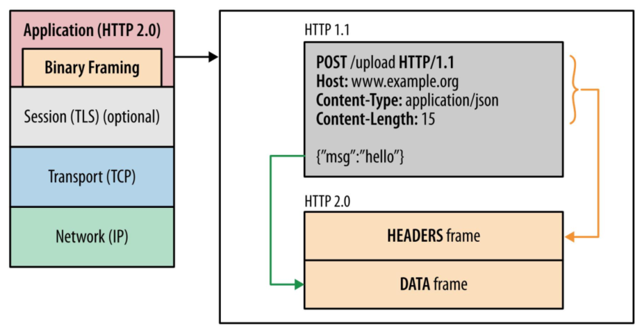

## 传输中无序，接收时组装  

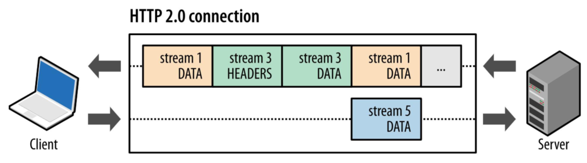

## 消息与帧  

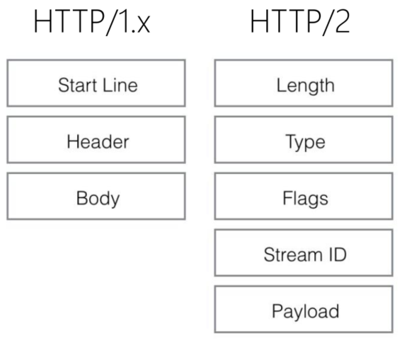

# 帧格式：Stream 流 ID 的作用  

## 9 字节标准帧头部  

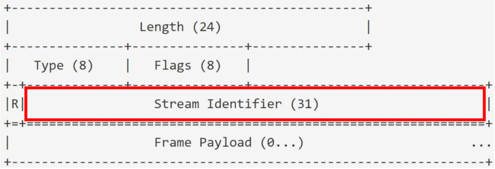

## Stream ID 的作用  

### 实现多路复用的关键  

- 接收端的实现可据此并发组装消息  
- 同一 Stream 内的 frame 必须是有序的（无法并发）  
- SETTINGS_MAX_CONCURRENT_STREAMS 控制着并发 Stream 数  

### 推送依赖性请求的关键  

- 由客户端建立的流必须是奇数  
- 由服务器建立的流必须是偶数  

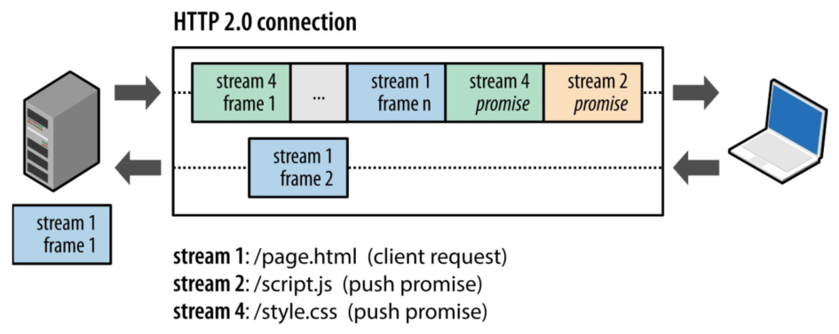

### 流状态管理的约束性规定  

- 新建立的流 ID 必须大于曾经建立过的状态为 opened 或者 reserved 的流 ID  
- 在新建立的流上发送帧时，意味着将更小 ID 且为 idle 状态的流置为 closed 状态  
- Stream ID 不能复用，长连接耗尽 ID 应创建新连接  

### 应用层流控仅影响数据帧  

Stream ID 为 0 的流仅用于传输控制帧  

### 在HTTP/1 升级到 h2c 中，以 ID 为 1 流返回响应，之后流进入half-closed (local)状态  
# 帧格式：帧类型及设置帧的子类型  

## 帧长度  

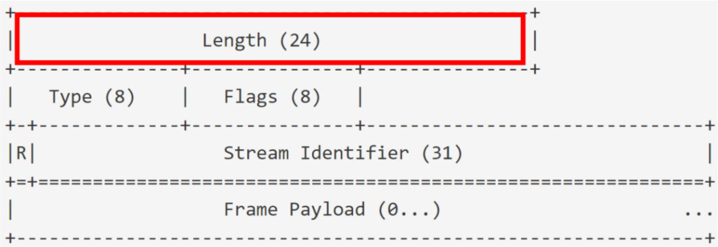

- 0 至 2^14 (16,384) -1，所有实现必须可以支持 16KB 以下的帧  
- 2^14 (16,384) 至 2^24-1 (16,777,215)，传递 16KB 到 16MB 的帧时，必须接收端首先公布自己可以处理此大小，通过 SETTINGS_MAX_FRAME_SIZE 帧（Identifier=5）告知    

## 帧类型 Type  

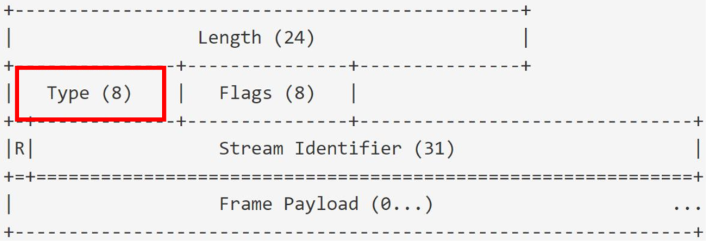

帧类型：

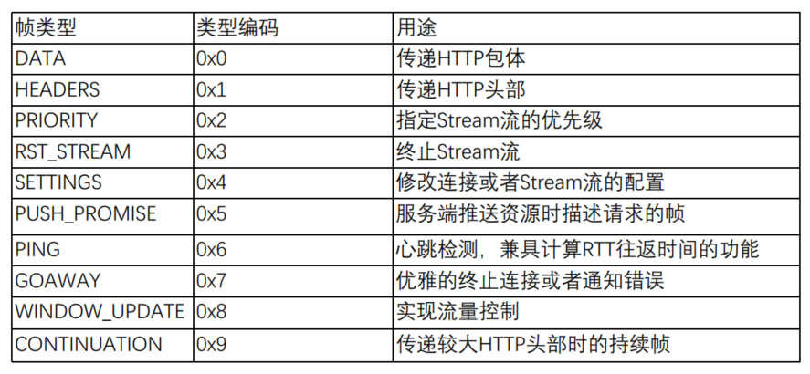

### Setting 设置帧格式（type=0x4）  

- 设置帧并不是“协商”，而是发送方向接收方通知其特性、能力  
- 一个设置帧可同时设置多个对象  

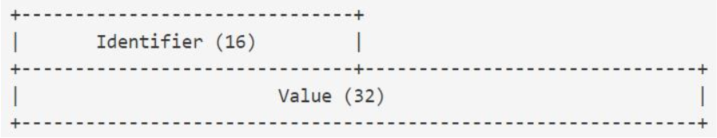

- Identifier：设置对象  
- Value：设置值  

设置类型：

- SETTINGS_HEADER_TABLE_SIZE (0x1)：通知对端索引表的最大尺寸（单位字节，初始 4096 字节）
- SETTINGS_ENABLE_PUSH (0x2)：Value设置为 0 时可禁用服务器推送功能，1 表示启用推送功能
- SETTINGS_MAX_CONCURRENT_STREAMS (0x3)：告诉接收端允许的最大并发流数量
- SETTINGS_INITIAL_WINDOW_SIZE (0x4)：声明发送端的窗口大小，用于Stream级别流控，初始值2^16-1 (65,535)字节
- SETTINGS_MAX_FRAME_SIZE (0x5)：设置帧的最大大小，初始值 2^14 (16,384)字节
- SETTINGS_MAX_HEADER_LIST_SIZE (0x6)：知会对端头部索引表的最大尺寸，单位字节，基于未压缩前的头部

# HPACK 如何减少 HTTP 头部的大小？  

## HPACK 头部压缩  

三种压缩方式

- 静态字典
- 动态字典
- 压缩算法：Huffman 编码（最高压缩比 8:5）  

## 静态字典  

- 含有 value 的表项
- 不含有 value 的表项  

## HPACK 压缩示意  

同一个索引空间的 HEADER 表：  

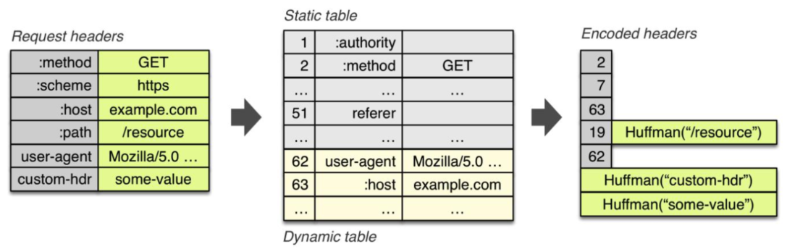

索引表用法示意：

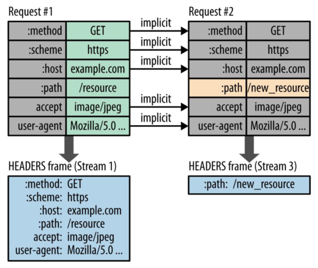

# HPACK 中如何使用 Huffman 树编码  

## Huffman 编码  

原理：出现概率较大的符号采用较短的编码，概率较小的符号采用较长的编码  

- 静态 Huffman 编码  
- 动态 Huffman 编码  

# HPACK 中 HEADER 的编码格式  

## HEADER 帧的格式  

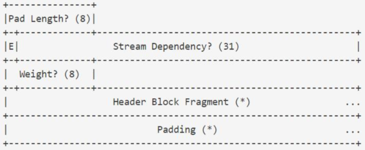

## CONTINUATION 持续帧(type=0x9)  

跟在 HEADER 帧或者 PUSH_PROMISE 帧之后，补充完整的 HTTP 头部  

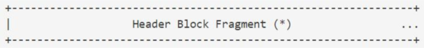

## 同一地址空间下的静态表与动态表  

- 静态表：61 项
- 动态表：先入先出的淘汰策略
  - 动态表大小由 SETTINGS_HEADER_TABLE_SIZE 设置帧定义
  - 允许重复项
  - 初始为空  

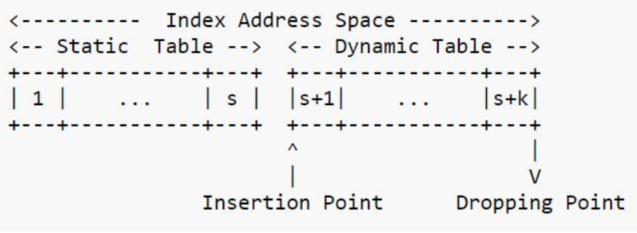

## 字面编码  

### 组成

- header name 和 value 以索引方式编码
- header name 以索引方式编码，而 header value 以字面形式编码
- header name 和 value 都以字面形式编码  

### 可控制是否进入动态表

- 进入动态表，供后续传输优化使用
- 不进入动态表
- 不进入动态表，并约定该头部永远不进入动态表  

## HEADER 二进制编码格式  

### 名称与值都在索引表中（包括静态表与动态表）  

编码方式：首位传 1，其余 7 位传索引号  

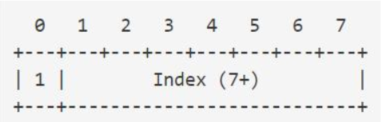

例如，method: GET在静态索引表中序号为 2，其表示应为 1000 0010，HEX 表示为 82  

### 名称在索引表中，值需要编码传递，同时新增至动态表中  

前 2 位传 01

- 名称举例，if-none-match 在静态索引表中序号为 41，表示为 01101001，HEX 表示为 69  
- 值举例，"5cb816f5-19d8” ，value长度 15 个字节，采用 Huffman 编码(H 为1)  ：10001100   

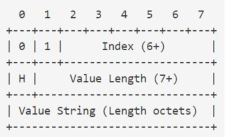

### 名称、值都需要编码传递，同时新增至动态表中  

前 2 位传 01  

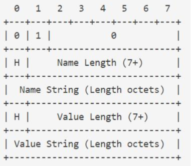

### 名称在索引表中，值需要编码传递，且不更新至动态表中  

前 4 位传 0000  

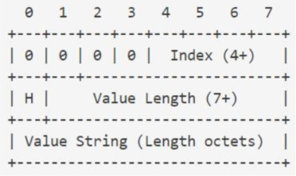

### 名称、值都需要编码传递，且不更新至动态表中  

前 4 位传 0000  

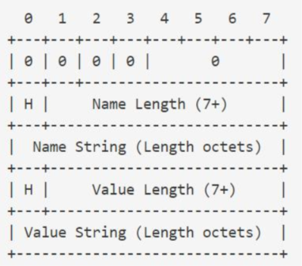

### 名称在索引表中，值需要编码传递，且永远不更新至动态表中  

前 4 位传 0001  

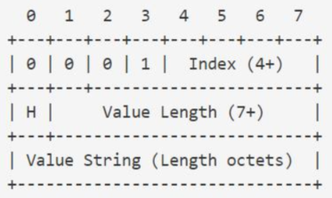

### 名称、值都需要编码传递，且永远不更新至动态表中  

前 4 位传 0001  

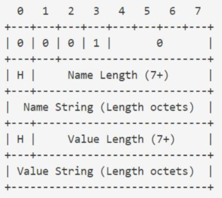

## 动态表大小的两种控制方式  

### 在 HEADER 帧中直接修改  

### 在 SETTING 帧中修改  

SETTINGS_MAX_HEADER_LIST_SIZE (0x6)  

# 服务器端的主动消息推送  

- 提前将资源推送至浏览器缓存  
- 推送可以基于已经发送的请求，例如客户端请求 html，主动推送 js 文件  

实现方式：

- 推送资源必须对应一个请求  
- 请求由服务器端PUSH_PROMISE 帧发送  
- 响应在偶数 ID 的 STREAM 中发送  

## 当获取 HTML 后，需要 CSS 资源时  

浏览器触发方式：需要两次往返！  

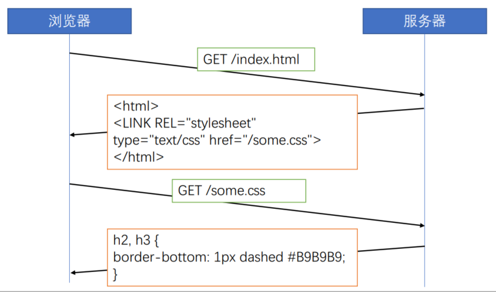

PUSH_PROMISE 方式：

- 在 Stream1 中通知客户端 CSS 资源即将来临
- 在 Stream2 中发送 CSS 资源（Stream1 和 2 可以并发！）  

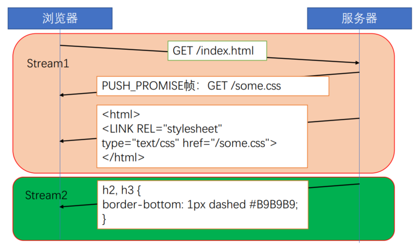

## 服务器推送 PUSH  

## PUSH 帧的格式  

PUSH_PROMISE 帧，type=0x5，只能由服务器发送  

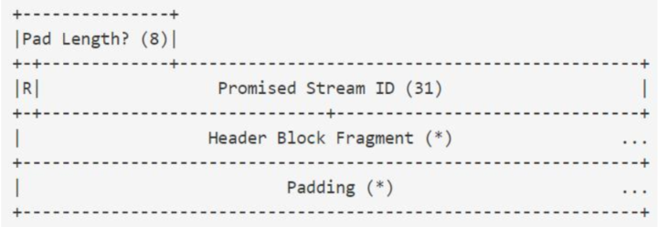

## PUSH 推送模式的禁用  

SETTINGS_ENABLE_PUSH（0x2）  

- 1表示启用推送功能
- 0表示禁用推送功能  

# stream 的状态变迁  

## Stream 特性  

- 一条 TCP 连接上，可以并发存在多个处于 OPEN 状态的 Stream  
- 客户端或者服务器都可以创建新的 Stream  
- 客户端或者服务器都可以首先关闭 Stream  
- 同一条 Stream 内的 Frame 帧是有序的  
- 从 Stream ID 的值可以轻易分辨 PUSH 消息  
  - 所有为发送 HEADER/DATA 消息而创建的流，从1、3、5 等递增奇数开始  
  - 所有为发送 PUSH 消息而创建的流，从 2、4、6 等递增偶数开始  

## Message 特性  

- 一条 HTTP Message 由 1 个 HEADER（可能含有 0 个或者多个持续帧构成）及 0 个或者多个 DATA 帧构成
- HEADER 消息同时包含 HTTP/1.1 中的 start line 与 headers 部分
- 取消 HTTP/1.1 中的不定长 Chunk 消息  

## GET 消息发送示例  

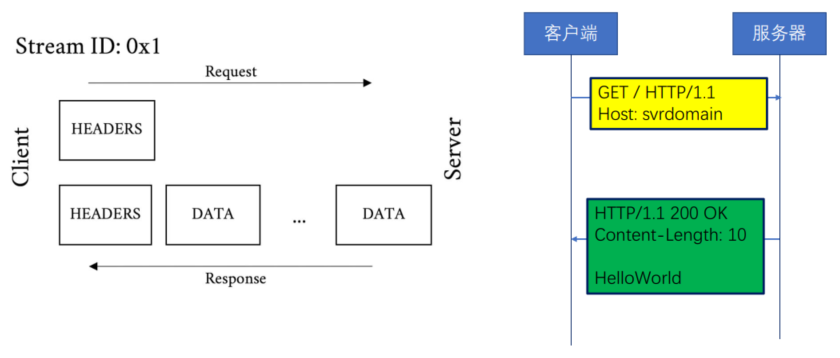

## POST 消息发送示例  

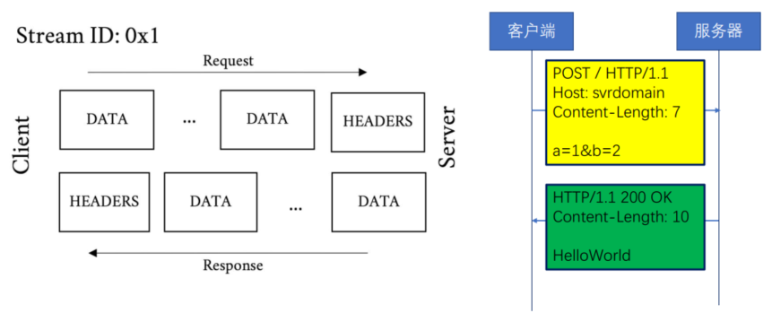

## Stream 流的状态  

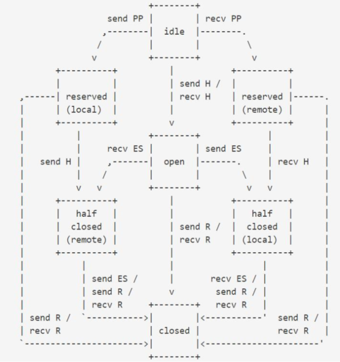

- 帧符号
  - H: HEADERS 帧
  - PP: PUSH_PROMISE 帧
  - ES: END_STREAM 标志位
  - R: RST_STREAM 帧

- 流状态
  - idle： 起始状态
  - closed
  - open： 可以发送任何帧
  - half closed 单向关闭
    - remote： 不再接收数据帧
    - local： 不能再发送数据帧
  - reserved
    - remote
    - local

# RST_STREAM 帧及常见错误码  

## RST_STREAM 帧（type=0x3）  

- HTTP2 多个流共享同一连接，RST 帧允许立刻终止一个未完成的流  
- RST_STRAM 帧不使用任何 flag  
- RST_STREAM 帧的格式  

## 常见错误码  

- NO_ERROR (0x0): 没有错误。GOAWAY帧优雅关闭连接时可以使用此错误码
- PROTOCOL_ERROR (0x1): 检测到不识别的协议字段
- INTERNAL_ERROR (0x2):内部错误
- FLOW_CONTROL_ERROR (0x3): 检测到对端没有遵守流控策略
- SETTINGS_TIMEOUT (0x4): 某些设置帧发出后需要接收端应答，在期待时间内没有得到应答则由此错误码表示
- STREAM_CLOSED (0x5): 当Stream已经处于半关闭状态不再接收Frame帧时，又接收到了新的Frame帧
- FRAME_SIZE_ERROR (0x6): 接收到的Frame Size不合法
- REFUSED_STREAM (0x7): 拒绝先前的Stream流的执行
- CANCEL (0x8): 表示Stream不再存在
- COMPRESSION_ERROR (0x9): 对HPACK压缩算法执行失败
- CONNECT_ERROR (0xa): 连接失败
- ENHANCE_YOUR_CALM (0xb): 检测到对端的行为可能导致负载的持续增加，提醒对方“冷静”一点
- INADEQUATE_SECURITY (0xc): 安全等级不够
- HTTP_1_1_REQUIRED (0xd): 对端只能接受HTTP/1.1协议

# 不同请求的优先级  

## Priority 优先级设置帧  

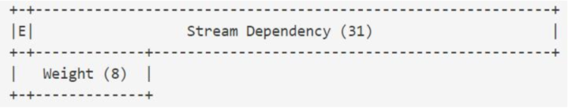

- 帧类型：type=0x2
- 不使用 flag 标志位字段
- Stream Dependency：依赖流
- Weight权重：取值范围为 1 到 256。默认权重16
- 仅针对 Stream 流，若 ID 为 0 试图影响连接，则接收端必须报错
- 在 idle 和 closed 状态下，仍然可以发送 Priority 帧

## 数据流优先级  

- 每个数据流有优先级（1-256）
- 数据流间可以有依赖关系  

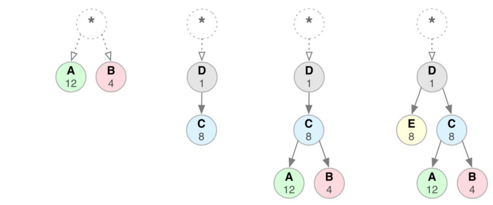

## exclusive 标志位  

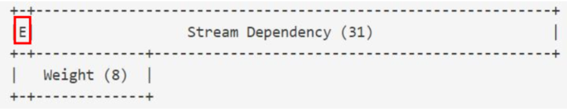

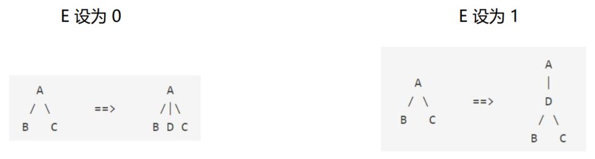

# 不同于 TCP 的流量控制  

## 为什么需要 HTTP/2 应用层流控？  

- HTTP/1.1 中由 TCP 层进行流量控制，前提：HTTP/1 的 TCP 连接上没有多路复用    

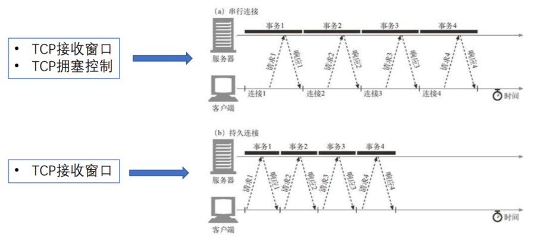

- HTTP/2 中，多路复用意味着多个 Stream 必须共享 TCP 层的流量控制  

多 Stream 争夺 TCP 的流控制，互相干扰可能造成 Stream 阻塞，代理服务器内存有限，上下游网速不一致时，通过流控管理内存：

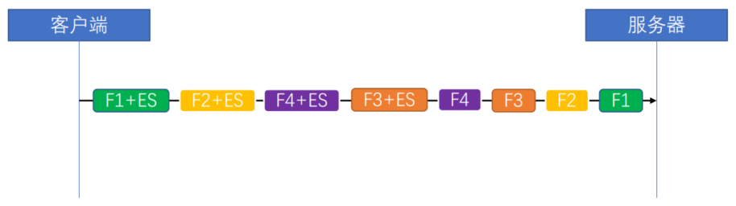  

## 由应用层决定发送速度  

HTTP/2 中的流控制既针对单个 Stream，也针对整个 TCP 连接：

- 客户端与服务器都具备流量控制能力
- 单向流控制：发送和接收独立设定流量控制
- 以信用为基础：接收端设定上限，发送端应当遵循接收端发出的指令
- 流量控制窗口（流或者连接）的初始值是 65535 字节
- 只有 DATA 帧服从流量控制
- 流量控制不能被禁用

## WINDOW_UPDATE 帧 

- type=0x8，不使用任何 flag  
- 窗口范围 1 to 2^31-1 (2,147,483,647)字节，0 是错误的，接收端应返回 PROTOCOL_ERROR  
- 当 Stream ID 为 0 时表示对连接流控，否则为对 Stream 流控  
- 流控仅针对直接建立 TCP 连接的两端  
  - 代理服务器并不需要透传 WINDOW_UPDATE 帧  
  - 接收端的缩小流控窗口会最终传递到源发送端  

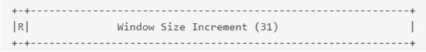

## 流控制窗口  

- 窗口大小由接收端告知  
- 窗口随着 DATA 帧的发送而减少  

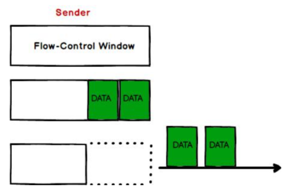

## SETTINGS_MAX_CONCURRENT_STREAMS 并发流  

- 并发仅统计 open 或者 half-close 状态的流（不包含用于推送的 reserved 状态）  
- 超出限制后的错误码  
  - PROTOCOL_ERROR  
  - REFUSED_STREAM  

# HTTP/2 与 gRPC 框架  

## gRPC：支持多语言编程、基于 HTTP/2 通讯的中间件  

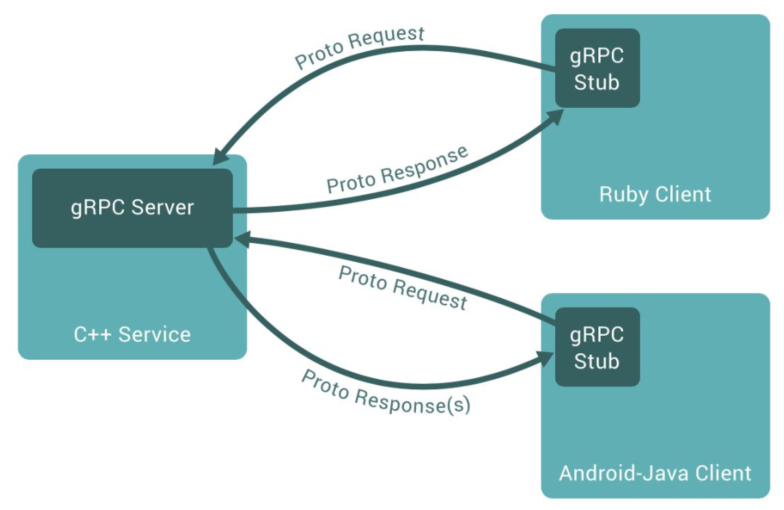

## Protocol Buffers 编码：消息结构  

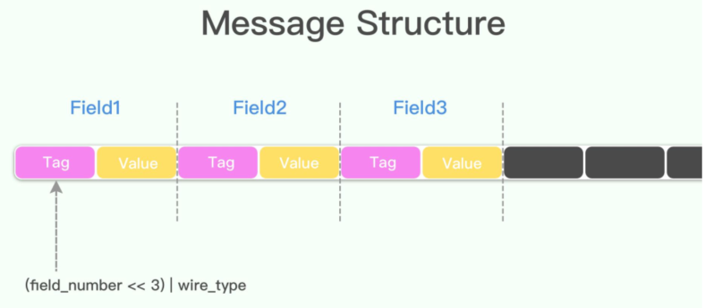

## Protocol Buffers 编码：数据类型 Wire Type  

## Protocol Buffers 字符串编码举例  

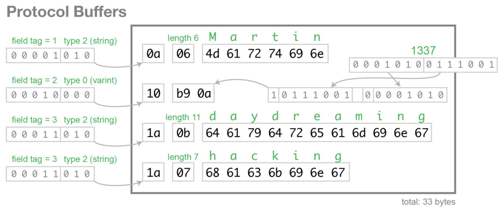

# HTTP/2 的问题及 HTTP/3 的意义  

## TCP 以及 TCP+TLS 建链握手过多的问题  

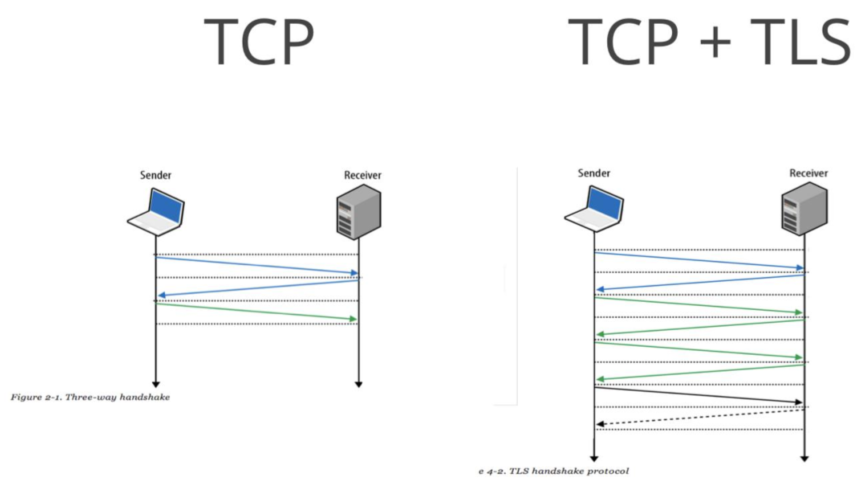

## 多路复用与 TCP 的队头阻塞问题  

资源的有序到达：

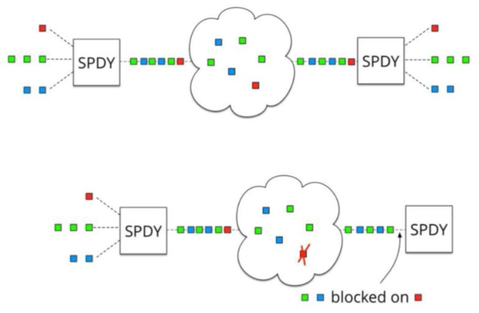

TCP的问题：由操作系统内核实现，更新缓慢  

# HTTP/3：QUIC 协议概述  

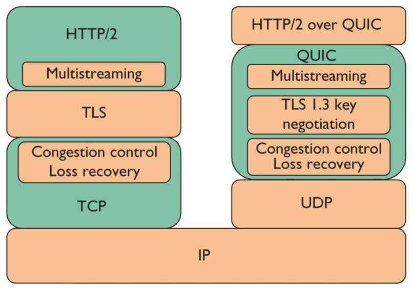

## HTTP3 的连接迁移  

允许客户端更换 IP 地址、端口后，仍然可以复用前连接  

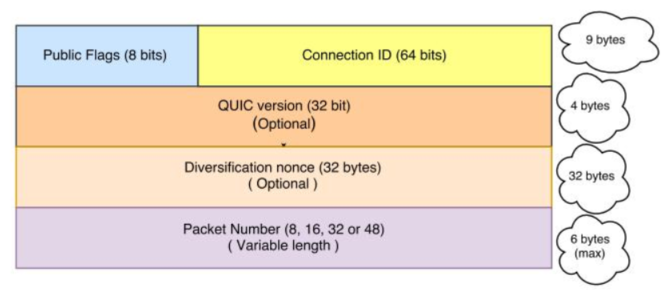

## 解决了队头阻塞问题的 HTTP3  

UDP 报文：先天没有队列概念：

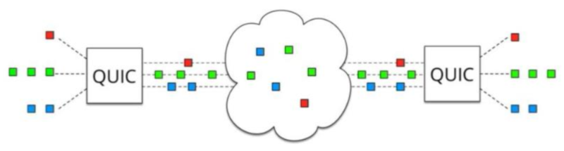

## HTTP3：1RTT 完全握手  

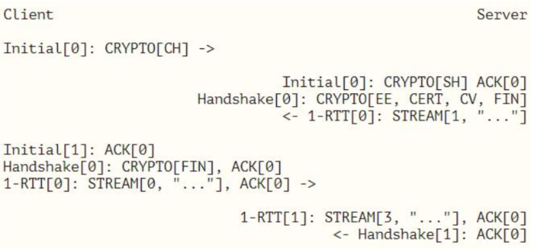

## 会话恢复场景下的 0RTT 握手  

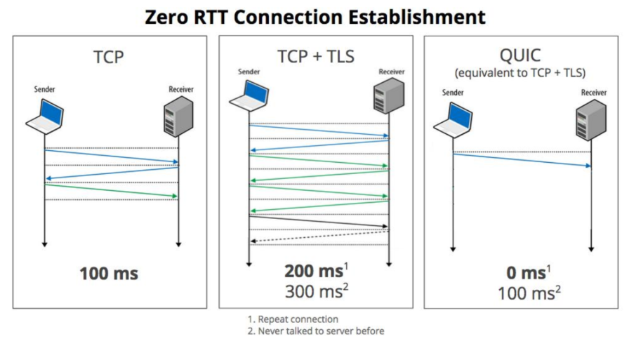

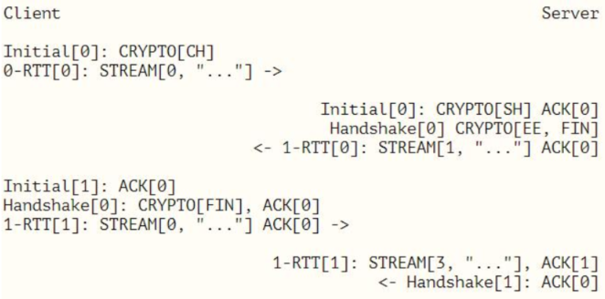

# 七层负载均衡做了些什么？  

## 四层负载均衡  

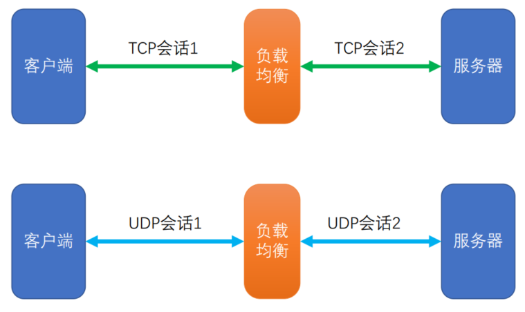

## 七层负载均衡协议转换举例  

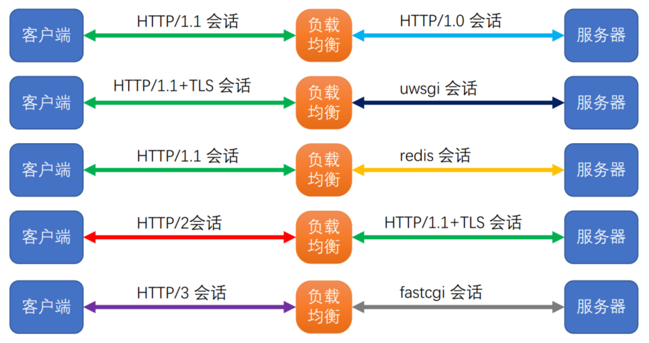

## HTTP 协议转换  

- request line 起始行
  - URL 重写（包括 query 参数转换）
  - method 变换
  - http version 版本变换

- header 头部
  - header 名字、值作转换（如 HTTP/2 索引表中查询头部，转换为适配协议格式）
  - 负载均衡对 header 作修改
    - 隐藏某个 header（例如隐藏 X-Accel-Expires 等头部）
    - 新增 header（例如 CORS 允许跨域访问）
    - 修改 header 的 value 值（例如修改 Server 头部的值）
- body 包体
  - 对内容使用通用算法（如压缩算法）转换
  - 按固定协议格式对内容进行转换

## WAF 防火墙（Web Application Firewall）  

- request line 请求行
  - 检查 URL 及 query 参数是否合法（如 SQL 注入）
  - method 方法是否合法（例如阻止 TRACE 方法）
  - http version 版本是否合法（例如不接收 HTTP/1.0 请求）

- header 头部
  - 检查 header 项是否符合应用场景要求
- body 包体
  - 对于FORM表单等通用格式做过滤

## 负载均衡算法  

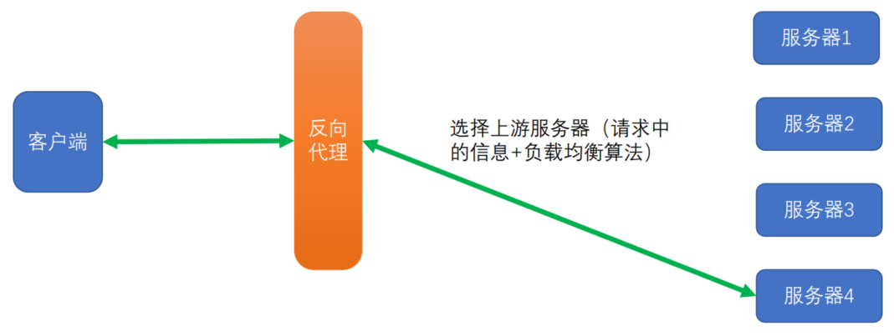

## 缓存功能  

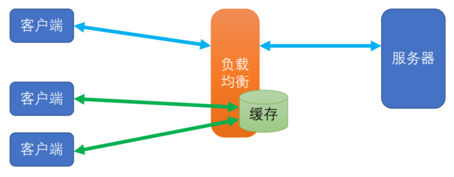

