# 网络层功能  

- IP 寻址  
- 选路  
- 封装打包  
- 分片

# 数据链路层功能  

- 逻辑链路控制
- 媒体访问控制
- 封装链路层帧
- MAC 寻址
- 差错检测与处理
- 定义物理层标准  

# IP 网络层  

- 无连接
- 非可靠
- 无确认  

# 多播：广播与组播  

- 全球作用域
- 组织内
- 场点内
- 本地链路层
- 本机作用域  

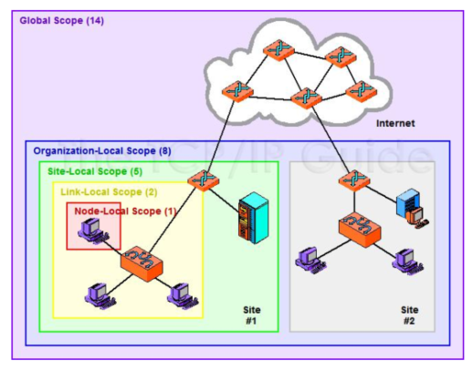

# 路由器与交换机  

工作在网络层的路由器
- 连接不同网络的设备

工作在数据链路层的交换机
- 同一个网络下连接不同主机的设备  

# IPv4 分类地址  

## IPv4 地址的点分十进制表示  

32 位二进制数，IP 地址空间：2^32 个  

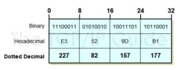

## IP 地址的分配机构  

层层分配的 IP 地址：

当互联网规律很小时，类别信息被编码进 IP 地址：

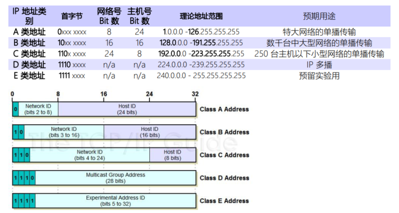

分类 IP 寻址的问题：

- 缺少私有网络下的地址灵活性：同一个网络下没有地址层次
- 3 类地址块太少，无法与现实网络很好的匹配  

# CIDR无分类地址  

CIDR：Classless Inter-Domain Routing

表示方法：A.B.C.D/N，N 范围[0, 32]  

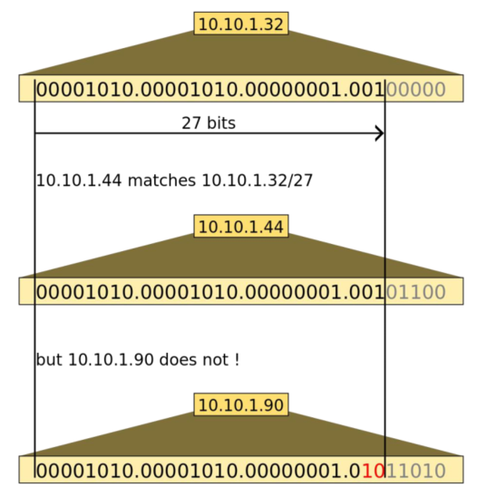

CIDR 子网划分示例：

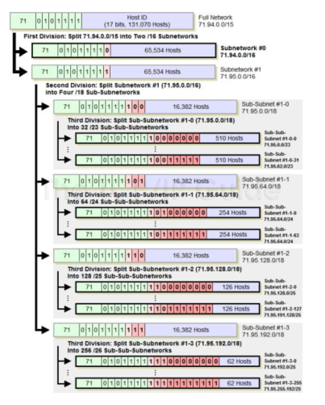

全 0 或者全 1 的特殊含义：

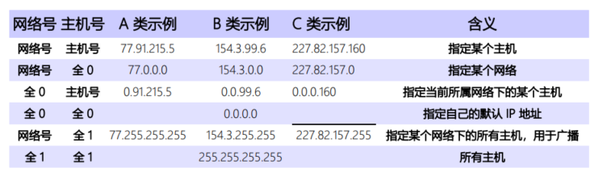

预留 IP 地址：

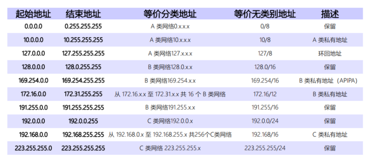

# ARP 与 RARP 协议  

链路层 MAC 地址

- 链路层地址 MAC（Media Access Control Address）
- 实现本地网络设备间的直接传输

网络层地址 IP（Internet Protocol address）

- 实现大型网络间的传输

## 从 IP 地址寻找 MAC 地址

动态地址解析协议 ARP，动态地址解析：广播  

- 检查本地缓存
    - Windows: arp –a
    - Linux: arp –nv
    - Mac: arp -nla
- 播形式的请求
- 单播形式的应答  

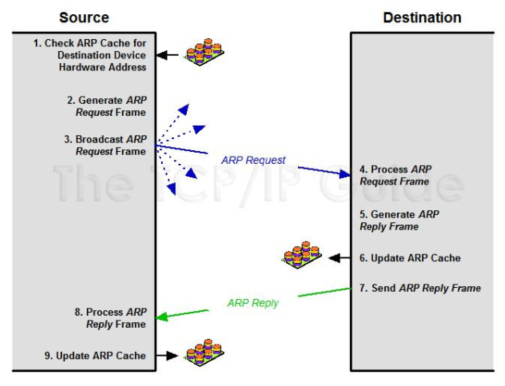

ARP 报文格式：FrameType=0x0806：

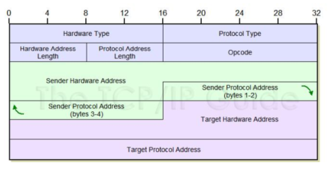

- 硬件类型，如 1 表示以太网
- 协议类型，如 0x0800 表示 IPv4
- 硬件地址长度，如 6
- 协议地址长度，如 4 表示 IPv4
- 操作码，如 1 表示请求，2 表示应答
- 发送方硬件地址
- 发送方协议地址
- 目标硬件地址
- 目标协议地址

硬件类型取值：

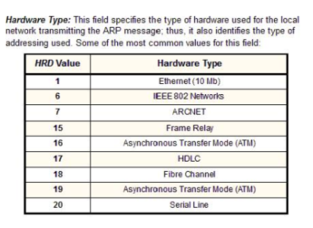

操作码取值：

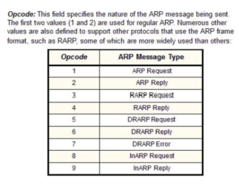

## 从 MAC 地址中寻找 IP 地址  

动态地址解析协议 RARP，Reverse Address Resolution Protocol  

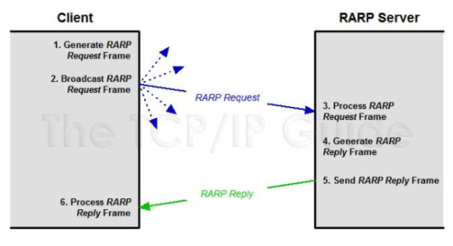

- 广播形式的请求
- 单播形式的应答  

RARP 报文格式：FrameType=0x8035：

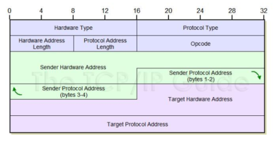

- 硬件类型，如 1 表示以太网
- 协议类型，如 0x0800 表示 IPv4
- 硬件地址长度，如 6
- 协议地址长度，如 4 表示 IPv4
- 操作码，如 3 表示请求，4 表示应答
- 发送方硬件地址
- 发送方协议地址
- 目标硬件地址
- 目标协议地址

## ARP 欺骗（ARP spoofing/poisoning）  

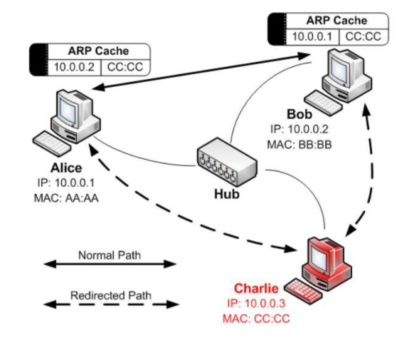

# NAT 地址转换与 LVS 负载均衡  

IPv4 地址短缺：

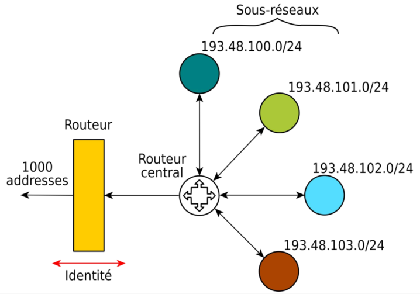

少量的公网 IP VS 大量的主机：

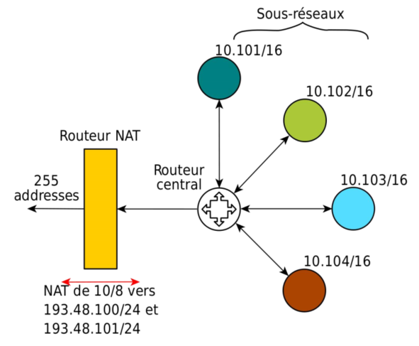

NAT（IP Network Address Translator）应用的前提：

- 内网中主要用于客户端访问互联网
- 同一时间仅少量主机访问互联网
- 网中存在一个路由器负责访问外网

单向（向外）转换 NAT：动态映射：

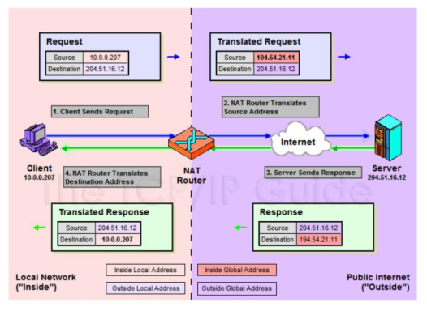

NAPT 端口映射：Network Address Port Translation：

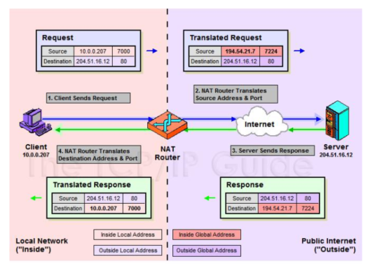

双向（向内）NAT：IP 地址静态映射：

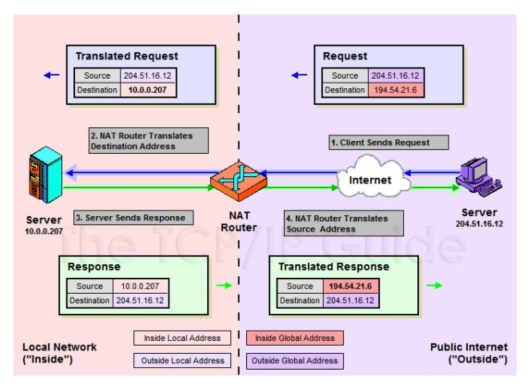

## LVS（Linux Virtual Server）/NAT 工作模式  

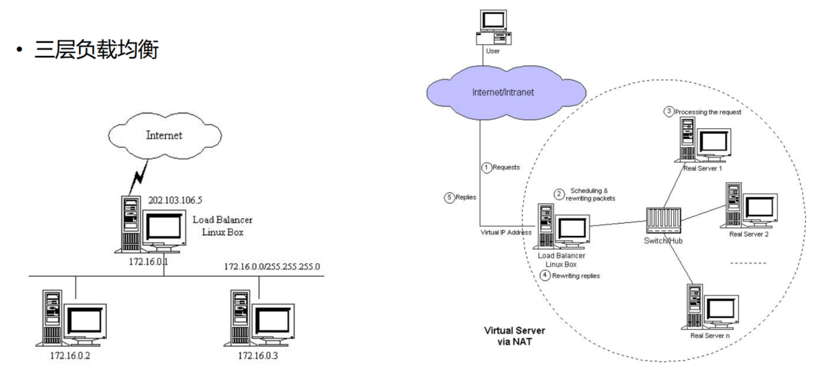

NAT 优点：
- 共享公共 IP 地址，节约开支
- 扩展主机时不涉及公共地址
- 更换 ISP 服务商（更换公网 IP 地址），不对主机地址产生影响
- 更好的安全性，外部服务无法主动访问内网服务
- 更好的隔离性

NAT 缺点
- 网络管理复杂
- 性能下降
- 重新修改校验和
- 客户端缺乏公网 IP 导致功能缺失
- 某些应用层协议由于传递网络层信息而功能受限

# IP 选路协议  

如何传输 IP 报文？  

- 直接传输
- 本地网络间接传输
	- 内部选路协议
	- RIP
	- OSPF
- 公网间接传输
 - 外部选路协议
	- BGP

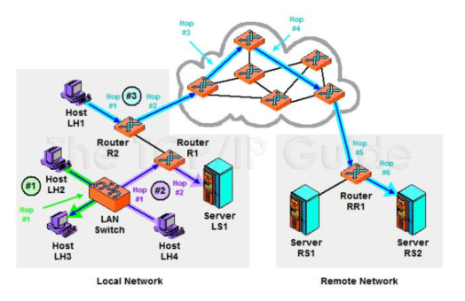

## 路由表 routing table  

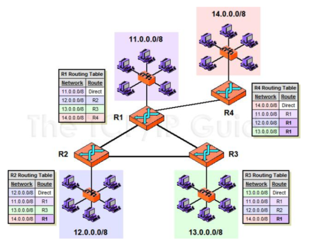

## RIP 内部选路协议  

Routing Information Protocol  

- 特点
	- 基于跳数确定路由
	- UDP 协议向相邻路由器通知路由表
- 问题
	- 跳数度量
	- 慢收敛
	- 选路环路

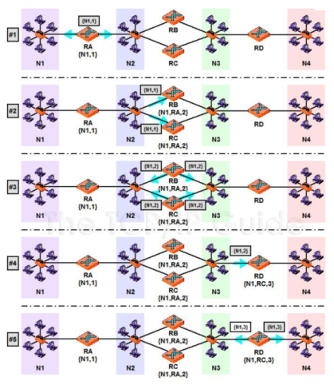

## OSPF 内部选路协议  

Open Shortest Path First，多级拓扑结构：同级拓扑中的每台路由器都具有最终相同的数据信息（LSDB）  

直接使用 IP 协议（协议号 0x06 为 TCP，0x11 为 UDP，而 0x59 为 OSPF）传递路由信息  

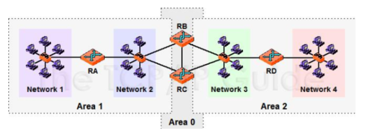

OSPF 最短路径树：

只有路由器到达网络有开销，网络到达路由器没有开销    

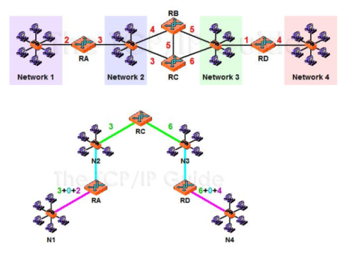

RC 的最短路径树：

- 第一级：RC 直达设备
	- N2：3
	- N3：6
	- RB：5
- 第二级：间隔 1 跳设备
	- 经过 N2 到 RA：3
	- 经过 N3 到 RD：6
- 第三级：间隔 2 跳设备
	- 经过 N2、RA 到 N1：5
	- 经过 N3、RD 到 N4：10

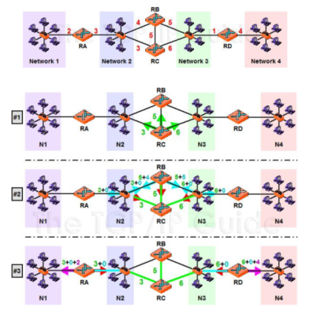

BGP：Border Gateway Protocol  

- 网络间的选路协议
- 放网络间信息 RIB
	- Routing Information Base
	- TCP 协议传输 RIB 信息
- E(External)BGP
	- 外部对等方传输使用
- I(Internal)BGP
	- 部对等方传输使用

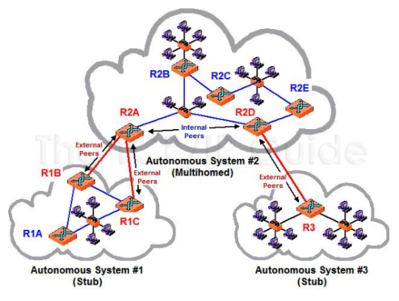

路由跟踪工具：

- Windows: tracert  
- Linux/Mac: traceroute  

# MTU 与 IP 报文分片  

## IP 报文格式  

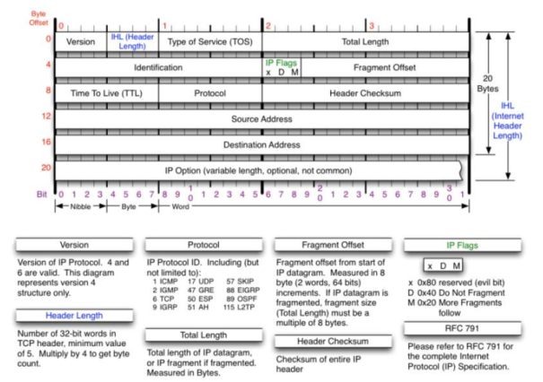

- IHL：头部长度，单位字
- TL：总长度，单位字节
- Id：分片标识
- Flags：分片控制
- DF 为1：不能分片
- MF 为1：中间分片
- FO：分片内偏移，单位 8 字节
- TTL：路由器跳数生存期
- Protocol：承载协议
- HC：校验和

## MTU（Maximum Transmission Unit）分片  

MTU 最大传输单元（ RFC791 ：>=576 字节）  

ping 命令
- -f：设置 DF 标志位为 1
- -l：指定负载中的数据长度

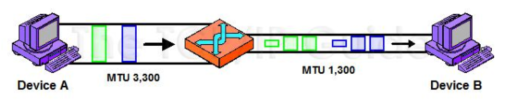

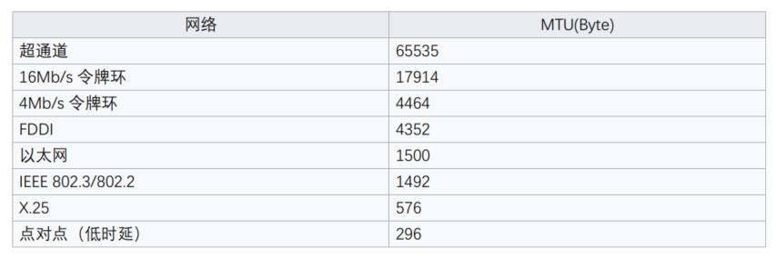

可能出现多次分片：

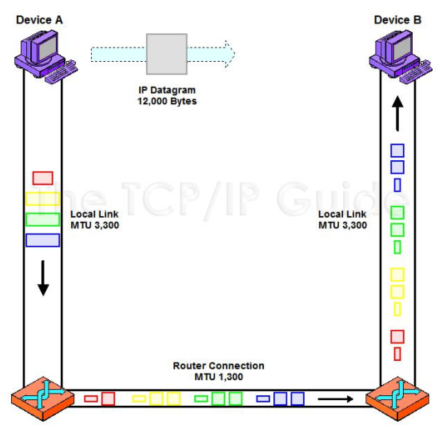  

IP 分片示例：

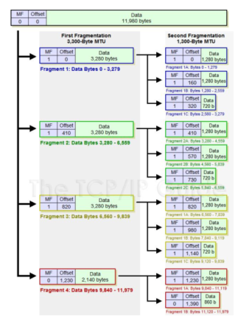

- 分片主体
	- 源主机
	- 路由器
- 重组主体
	- 目的主机

# ICMP 协议  

ICMP：Internet Control Message Protocol  

IP 助手
- 告知错误
- 传递信息

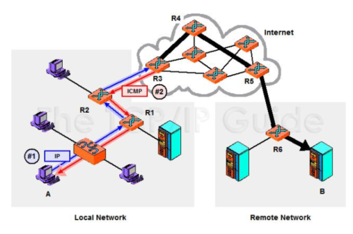

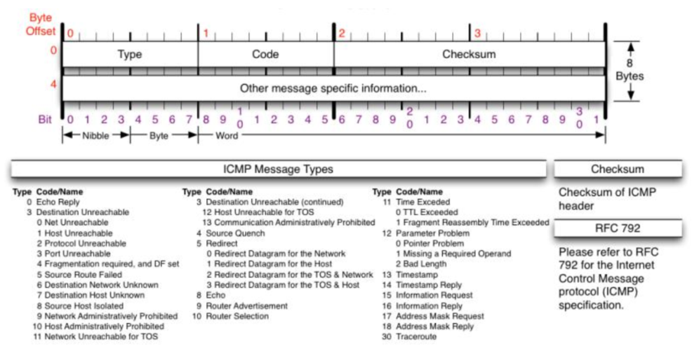

- 承载在 IP 之上
- 组成字段
	- 类型
	- 子类型
	- 校验和

## ICMPv4 报文类型  

- 错误报文
	- 3：目的地不可达
	- 4：发生拥塞，要求发送方降低速率
	- 5：告诉主机更好的网络路径
	- 11：路径超出 TTL 限制
	- 12：其他问题

- 信息报文
  - 0：连通性测试中的响应
  - 8：连通性测试中的请求
  - 9：路由器通告其能力
  - 10：路由器通知请求
  - 13：时间戳请求
  - 14：时间戳应答
  - 17：掩码请求
  - 18：掩码应答
  - 30：Traceroute

### 目的地不可达报文：Type=3  

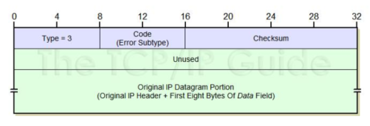

- 常用子类型 Code
	- 0：网络不可达
	- 1：主机不可达
	- 2：协议不可达
	- 3：端口不可达
	- 4：要分片但 DF 为1
	- 10：不允许向特定主机通信
	- 13：管理受禁

###  Echo 与 Echo Reply 报文

ping 联通性测试 : 

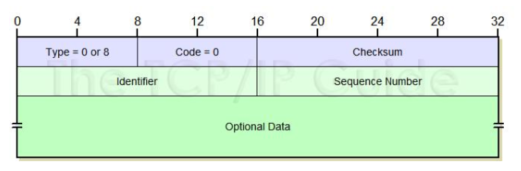

### TTL 超限：Type=11  

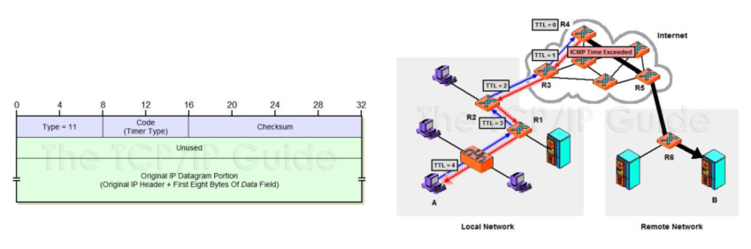

# 多播与 IGMP 协议  

## 广播与组播  

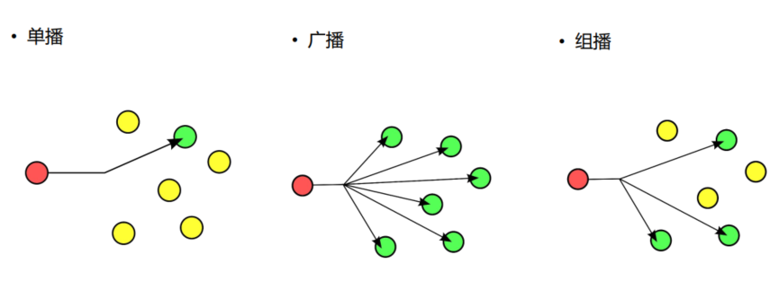

## 广播地址  

- 以太网地址： ff:ff:ff:ff:ff:ff
- IP 地址  

## 组播地址  

组播 IP 地址，预留组播地址：

- 224.0.0.1： 子网内的所有系统组
- 224.0.0.2： 子网内的所有路由器组
- 224.0.1.1： 用于 NTP 同步系统时钟
- 224.0.0.9： 用于 RIP-2 协议

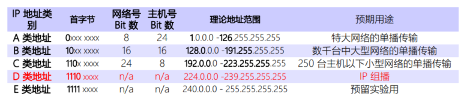

组播以太网地址：01:00:5e:00:00:00 到 01:00:5e:7f:ff:ff  

低 23 位：映射 IP 组播地址至以太网地址：

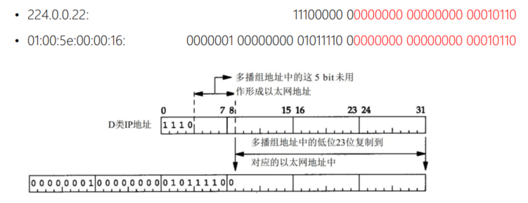

## IGMP  

IGMP（Internet Group Management Protocol）协议  

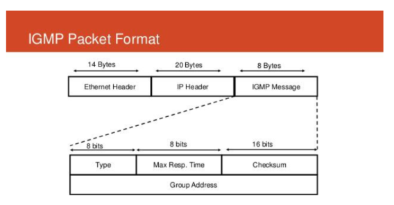

Type 类型
- 0x11 Membership Query [RFC3376]
- 0x22 Version 3 Membership Report [RFC3376]
- 0x12 Version 1 Membership Report [RFC-1112]
- 0x16 Version 2 Membership Report [RFC-2236]
- 0x17 Version 2 Leave Group [RFC-2236]

0x22 Membership Report：状态变更通知  

Group Record 格式：

Record Type 类型
- 当前状态
	- 1: MODE_IS_INCLUDE
	- 2: MODE_IS_EXCLUDE
- 过滤模式变更（如从 INCLUDE 奕为 EXCLUDE）
	- 3: CHANGE_TO_INCLUDE
	- 4: CHANGE_TO_EXCLUDE
- 源地址列表变更（过滤模式同时决定状态）
	- 5: ALLOW_NEW_SOURCES
	- 6: BLOCK_OLD_SOURCES

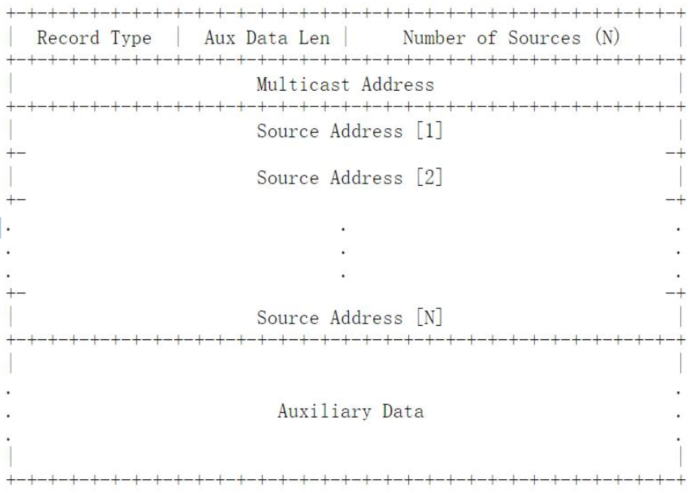

# 支持万物互联的 IPv6 地址  

## IPv6 目的  

- 更大的地址空间：128 位长度
- 更好的地址空间管理
- 消除了 NAT 等寻址技术
- 更简易的 IP 配置管理
- 优秀的选路设计
- 更好的多播支持
- 安全性
- 移动性

## IPv6 地址的冒分十六进制表示法  

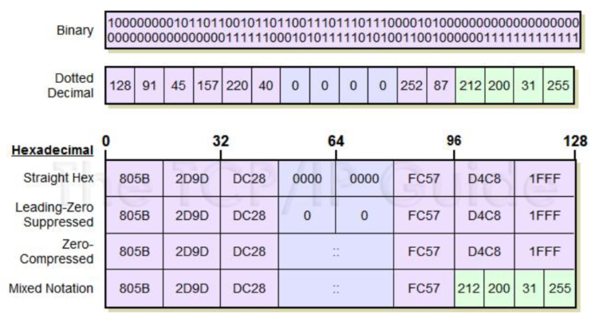

- 首零去除
- 零压缩
	- FF00:4501:0:0:0:0:0:32
		- FF00:4501::32
	- 805B:2D9D:DC28:0:0:FC57:0:0
		- 805B:2D9D:DC28::FC57:0:0
		- 805B:2D9D:DC28:0:0:FC57::
	- 环回地址0:0:0:0:0:0:0:1
		- ::1

## IPv6 地址分布  

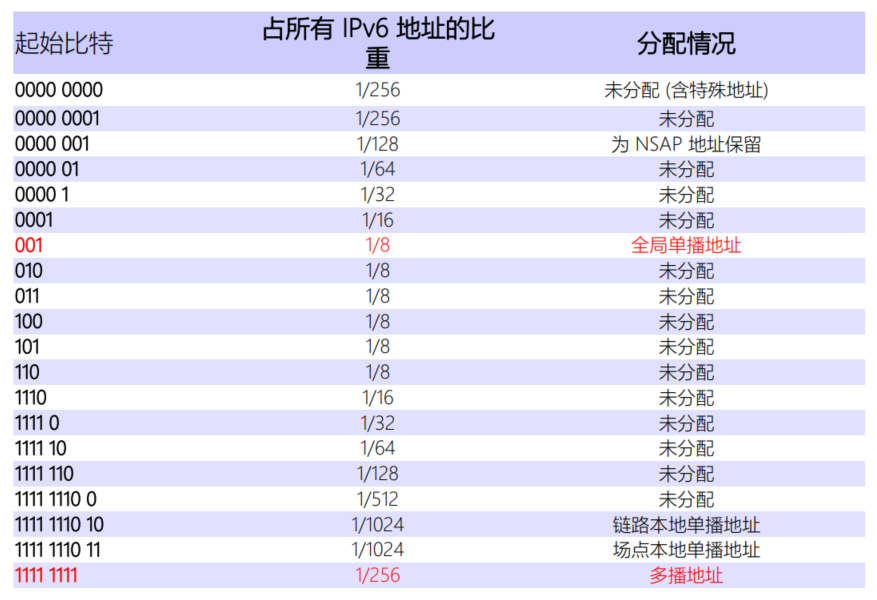

## 不同作用域下的多播  

Scope ID
- 14：全局作用域
- 8：组织作用域
- 5：场点作用域
- 2：本地链路作用域
- 1：本机作用域

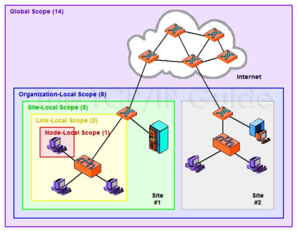

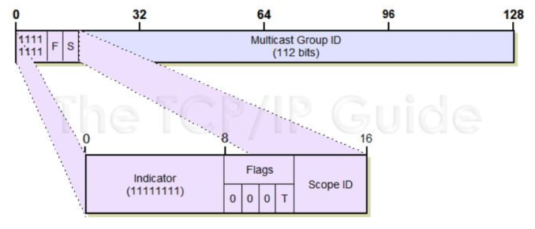

## 网络地址与主机地址  

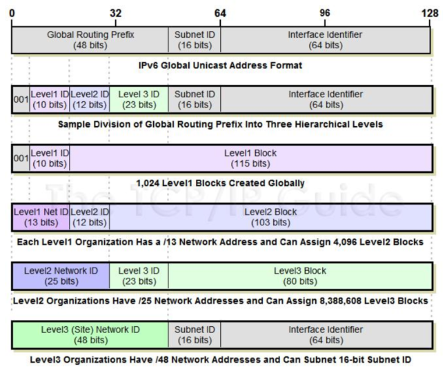

- 全局路由前缀：48
	- 可任意划分为多级
- 子网ID：16
	- 可任意划分为多级
- 接口ID：64
	- 直接映射 MAC 地址

## IEEE802 48 位 MAC 地址映射主机地址（EUI-64）  

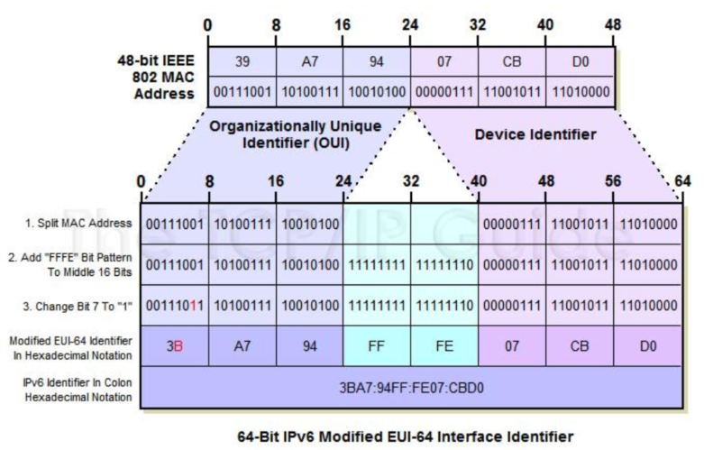

- 取 OUI(组织唯一标识)放左 24 比特
- 中间 16 比特置为 FFFE
- 置 OUI 第 7 位为 1 表示全局

# IPv6 报文及分片  

