# TCP 协议

TCP 协议在网络分层协议中的位置：

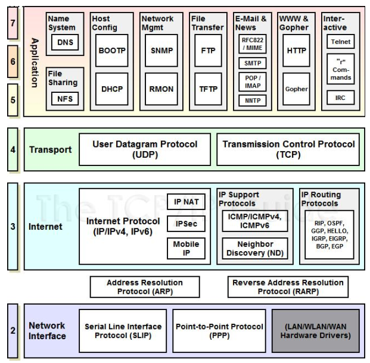

数据流传递：

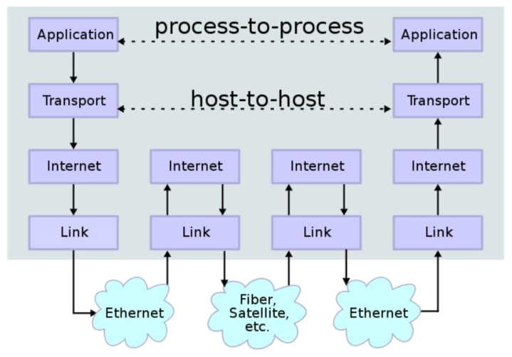

层层嵌套的报文头部：

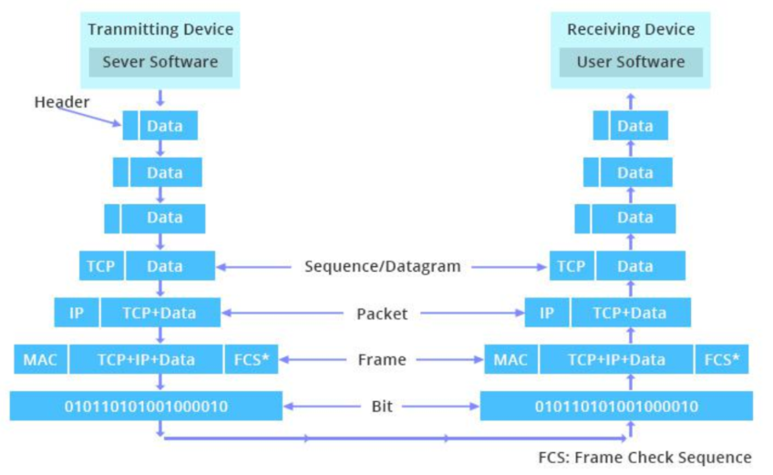

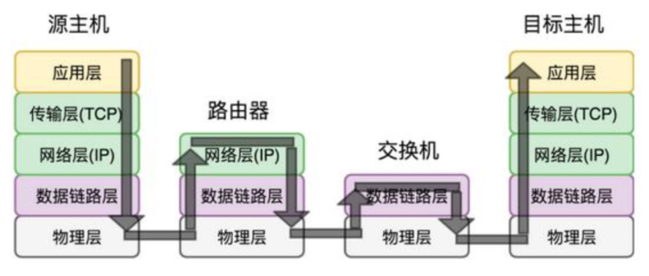

TCP 协议是面向连接的，可靠的，基于字节流的传输层通讯协议。

# TCP 协议特点  

- 点对点，不能广播，不能多播，面向连接
- 双向传递，即全双工
- 字节流：打包成报文段，保证有序，重复报文丢弃
  - 缺点：不维护应用报文的边界，比如：HTTP，GRPC
  - 优点：不强制要求应用必须离散的创建数据块，不限制数据块大小
- 流量缓冲：解决速度不匹配的问题
- 拥塞控制

# IP 头部

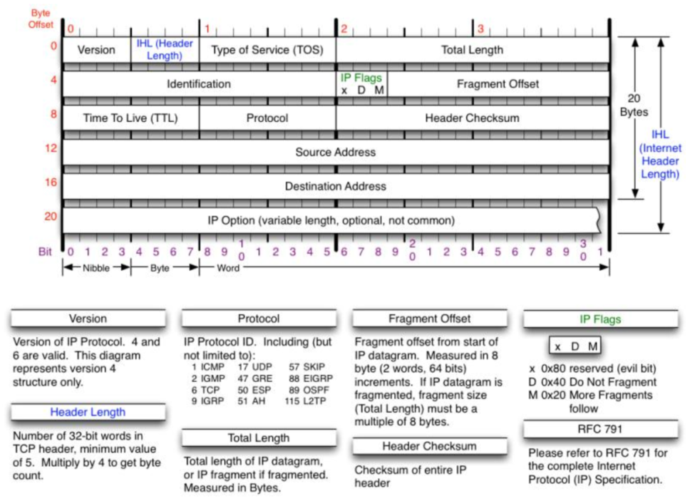

# UDP

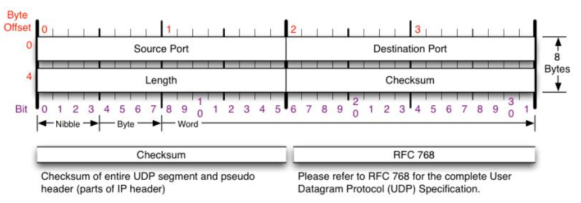

# TCP 协议的任务

- 主机内的进程寻址  
- 创建、管理、终止连接  
- 处理并将字节（8bit）流打包成报文段（如 IP 报文）  
- 传输数据  
- 保持可靠性与传输质量  
- 流控制与拥塞控制  

# 标识一个连接  

TCP 四元组（源地址，源端口，目的地址，目的端口）

- 对于 IPv4 地址，单主机最大 TCP 连接数为 **2 ^(32+16+32+16) ** 

使用连接ID：QUIC 协议  

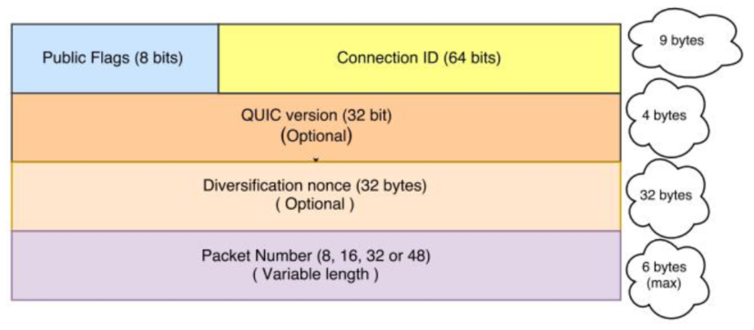

# TCP 报文段

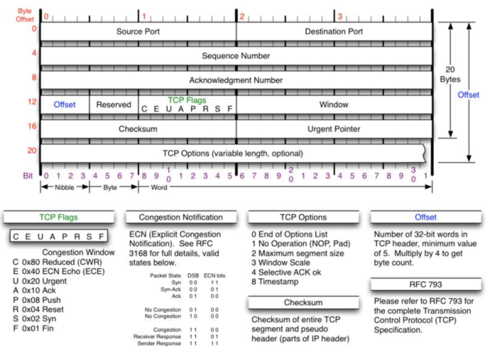

- 默认头部 20 字节
- 常用可选项：

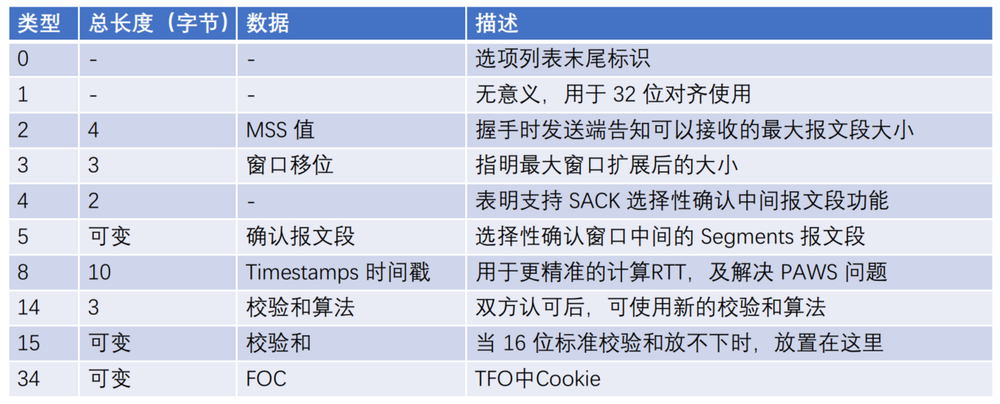

# TCP 建立连接

## 握手的目的

- 同步 Sequence 序列号
  - 初始序列号 ISN（Initial Sequence Number），每次的 ISN 是随机的，客户端和服务端也不相同
- 交换 TCP 通讯参数
    - 如 MSS、窗口比例因子、选择性确认、指定校验和算法  

## 三次握手

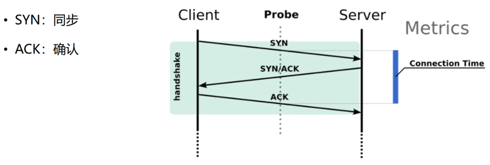

## 三次握手状态变迁  

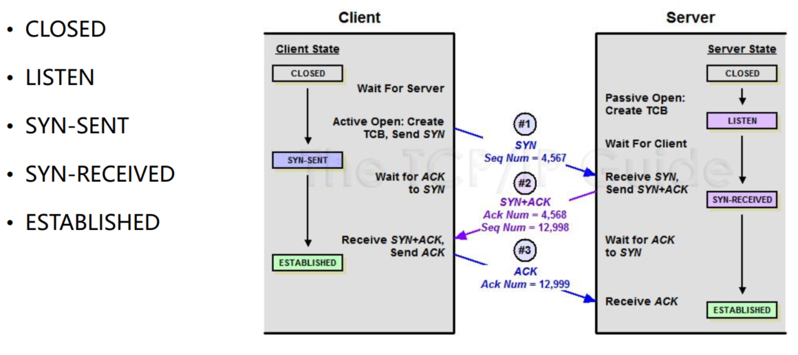

TCB： Transmission Control Block，保存连接使用的源端口、目的端口、目的 ip、序号、应答序号、对方窗口大小、己方窗口大小、tcp 状态、tcp 输入/输出队列、应用层输出队列、tcp 的重传有关变量等  

两端同时发送SYN：双方使用固定源端口且同时建连接：

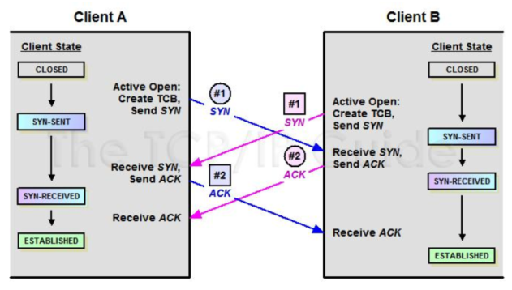

## 三次握手中的性能优化与安全问题  

### 超时时间与缓冲队列  

- 应用层 connect 超时时间调整
- 操作系统内核限制调整
  - 服务器端 SYN_RCV 状态
    - net.ipv4.tcp_max_syn_backlog：SYN_RCVD 状态连接的最大个数
    - net.ipv4.tcp_synack_retries：被动建立连接时，发SYN/ACK的重试次数
  - 客户端 SYN_SENT 状态
      - net.ipv4.tcp_syn_retries = 6 主动建立连接时，发 SYN 的重试次数
      - net.ipv4.ip_local_port_range = 32768 60999 建立连接时的本地端口可用范围
  - ACCEPT队列设置  

### Fast Open 降低时延  

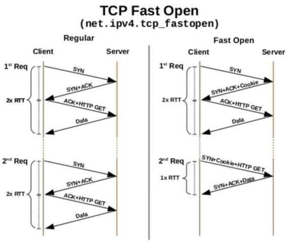

Linux net.ipv4.tcp_fastopen：系统开启 TFO 功能：

- 0：关闭
- 1：作为客户端时可以使用 TFO
- 2：作为服务器时可以使用 TFO
- 3：无论作为客户端还是服务器，都可以使用 TFO  

### 如何应对 SYN 攻击  

SYN 攻击:攻击者短时间伪造不同 IP 地址的 SYN 报文，快速占满 backlog 队列，使服务器不能为正常用户服。

- net.core.netdev_max_backlog
  - 接收自网卡、但未被内核协议栈处理的报文队列长度
- net.ipv4.tcp_max_syn_backlog
  - SYN_RCVD 状态连接的最大个数
- net.ipv4.tcp_abort_on_overflow
  - 超出处理能力时，对新来的 SYN 直接回包 RST，丢弃连接  

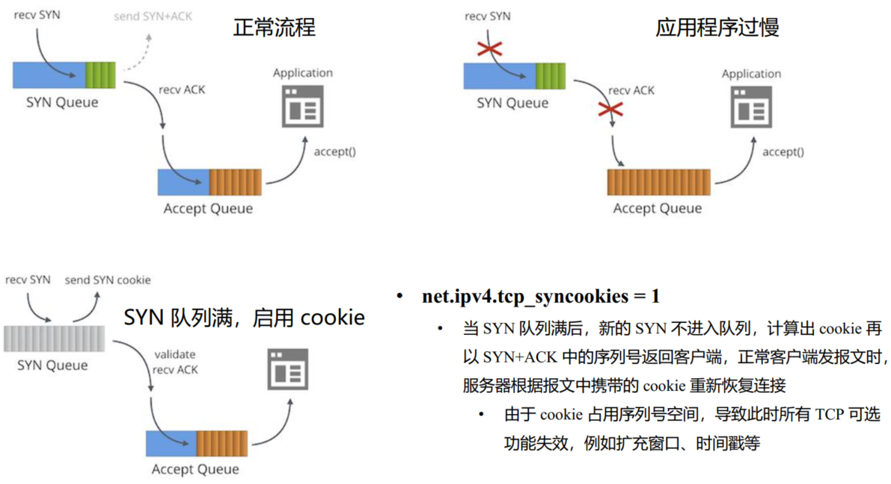

### TCP_DEFER_ACCEPT

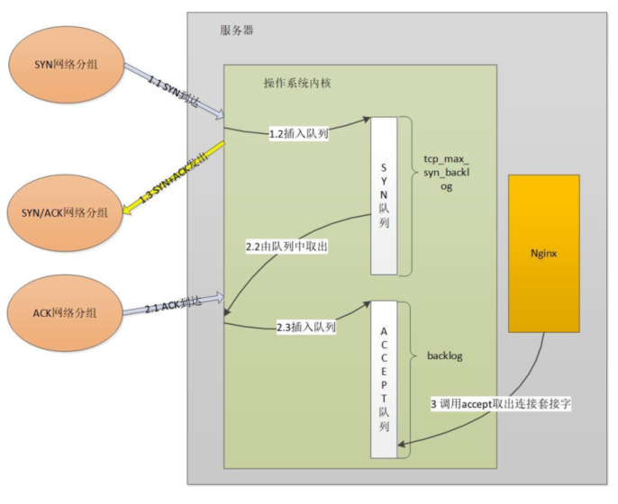

# 数据传输与 MSS 分段  

TCP 编程示例：

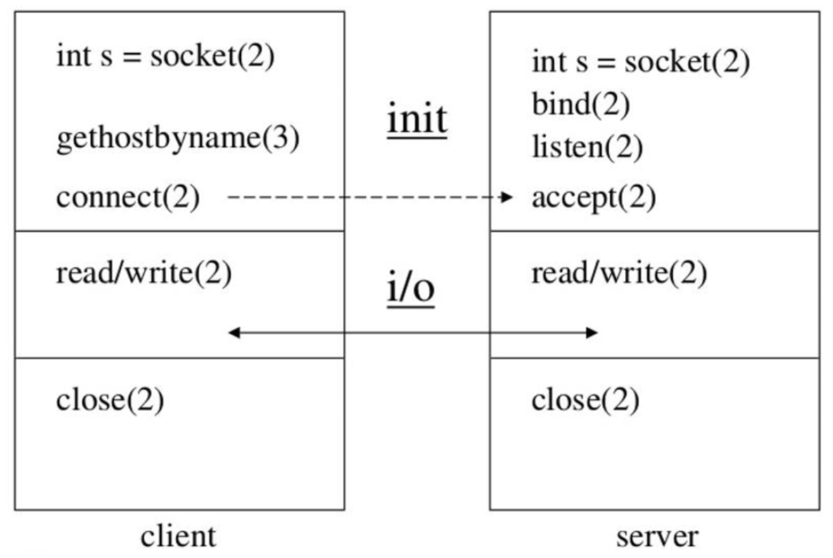

TCP 流与报文段：

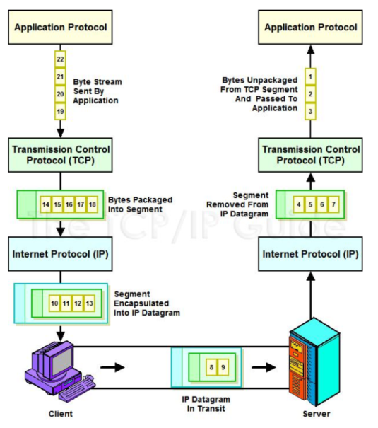

流分段的依据：

- MSS：防止 IP 层分段  
- 流控：接收端的能力  

##　MSS  

Max Segment Size，仅指 TCP 承载数据，不包含 TCP 头部的大小，参见 RFC879  

MSS 选择目的：

- 尽量每个 Segment 报文段携带更多的数据，以减少头部空间占用比率  
- 防止 Segment 被某个设备的 IP 层基于 MTU 拆分  

默认 MSS：536 字节（默认 MTU576 字节，20 字节 IP 头部，20 字节 TCP 头部）  

握手阶段协商 MSS，通过 TCP 选项  

MSS 分类

- 发送方最大报文段 SMSS：SENDER MAXIMUM SEGMENT SIZE
- 接收方最大报文段 RMSS：RECEIVER MAXIMUM SEGMENT SIZE  

# 重传与确认  

## 报文有可能丢失  

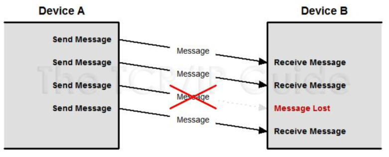

## PAR

PAR：Positive Acknowledgment with Retransmission  

问题：效率低  

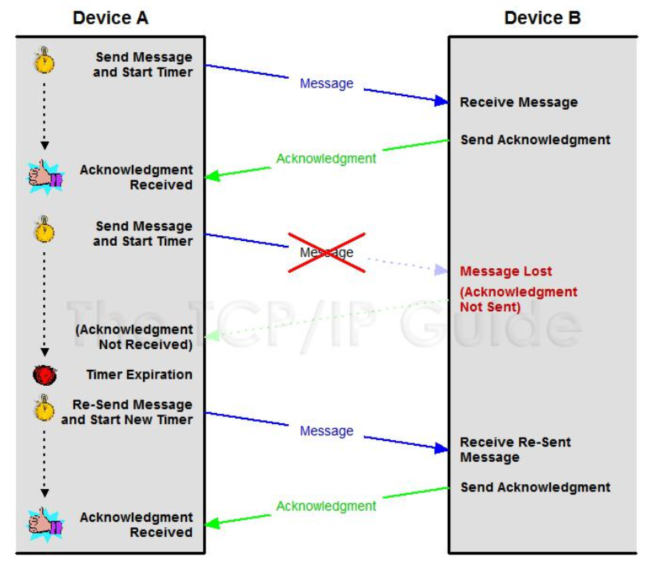

## 提升并发能力的 PAR 改进版  

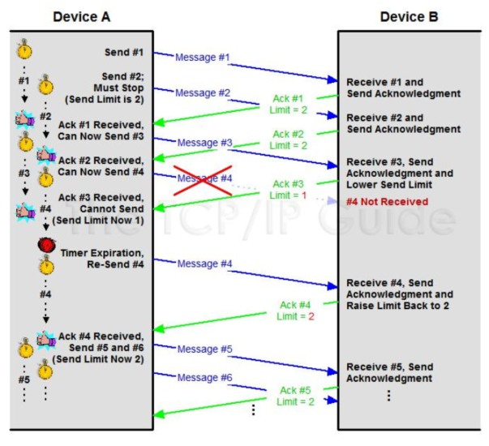

Limit 限制发送方。

##　Sequence 序列号/Ack 序列号  

- 设计目的：解决应用层字节流的可靠发送
  - 跟踪应用层的发送端数据是否送达
  - 确定接收端有序的接收到字节流
- 序列号的值针对的是字节而不是报文  

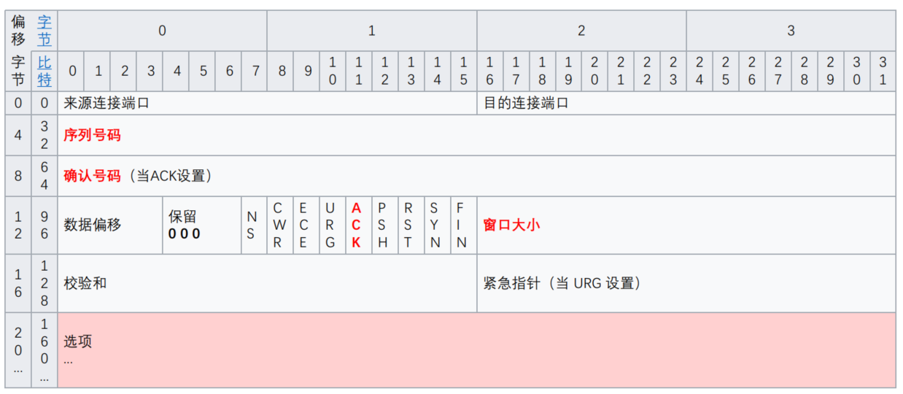

##　ISN 复用

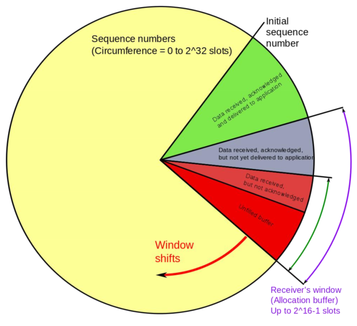

PAWS (Protect Against Wrapped Sequence numbers)  

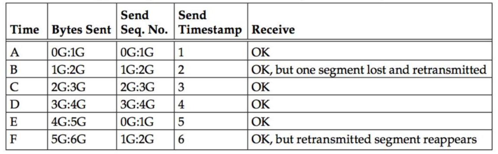

防止序列号回绕：结合 timestamp 去判断

## RTO 重传定时器的计算  

RTT：

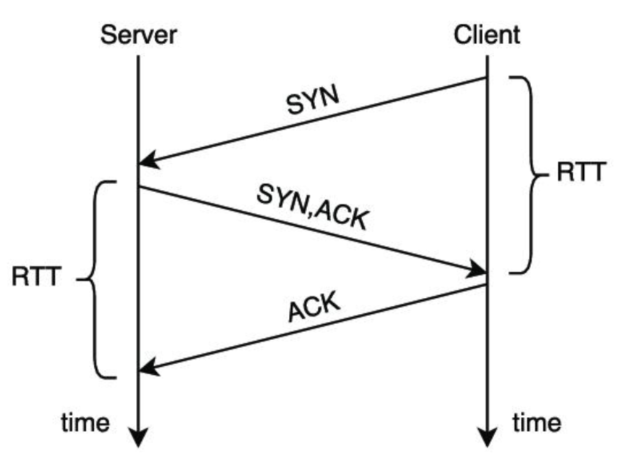

基于 timestamp 计算 RTT

RTO（ Retransmission TimeOut ）应当设多大 ?

RTO 应当略大于 RTT：

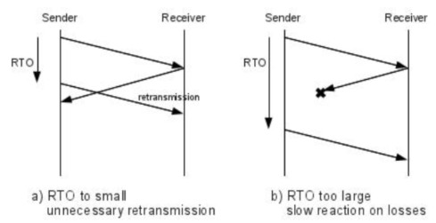

因为 RTT 是变化的，所以 RTO 应当更平滑：

- SRTT （smoothed round-trip time） = ( α * SRTT ) + ((1 - α) * RTT)
  - α 从 0到 1（RFC 推荐 0.9），越大越平滑
- RTO = min[ UBOUND, max[ LBOUND, (β * SRTT) ] ]
 - 如 UBOUND为1分钟，LBOUND为 1 秒钟， β从 1.3 到 2 之间
- 不适用于 RTT 波动大（方差大）的场景  

实际 Linux 使用的方法：追踪 RTT 方差  ，RFC6298（RFC2988），其中α = 1/8， β = 1/4，K = 4，G 为最小时间颗粒：

- 首次计算 RTO，R为第 1 次测量出的 RTT
  - SRTT（smoothed round-trip time） = R
  - RTTVAR（round-trip time variation） = R/2
  - RTO = SRTT + max (G, K*RTTVAR)
- 后续计算 RTO，R’为最新测量出的 RTT
    - SRTT = (1 - α) * SRTT + α * R’
    - RTTVAR = (1 - β) * RTTVAR + β * |SRTT - R’|
    - RTO = SRTT + max (G, K*RTTVAR)  

# 滑动窗口：发送窗口与接收窗口  

## 发送窗口

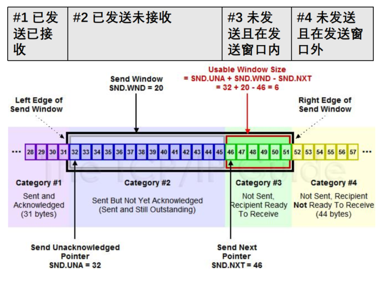

- 已发送并收到 Ack 确认的数据：1-31 字节
- 已发送未收到 Ack 确认的数据：32-45 字节
- 未发送但总大小在接收方处理范围内：46-51 字节
- 未发送但总大小超出接收方处理范围：52-字节  

### 可用窗口/发送窗口  

可用窗口：46-51 字节 / 发送窗口：32-51 字节：
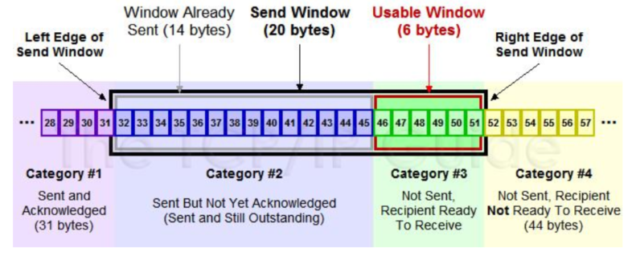

### 可用窗口耗尽  

46-51 字节已发送：

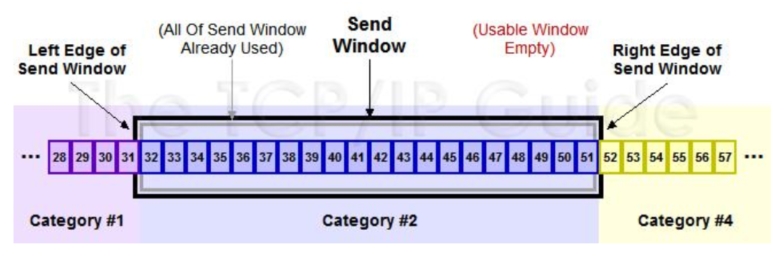

### 发送窗口移动  

32 到 36 字节已确认：

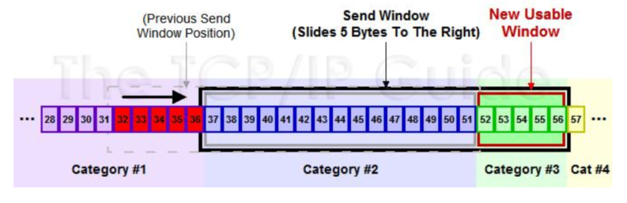

## 接收窗口  

对端发送窗口约等于接收窗口  

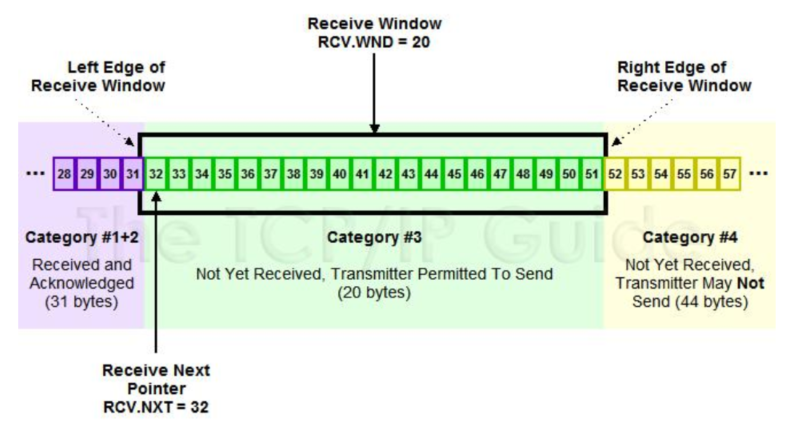

## 窗口的滑动与流量控制  

假设：MSS 不产生影响， 窗口不变  

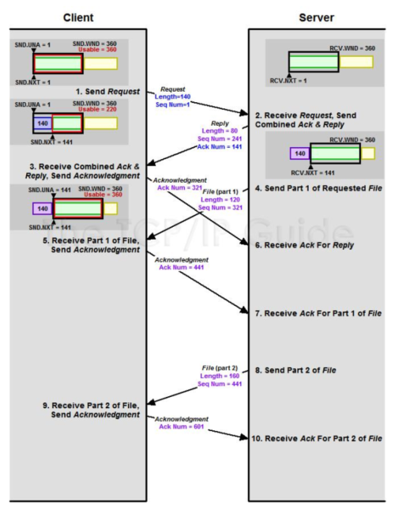

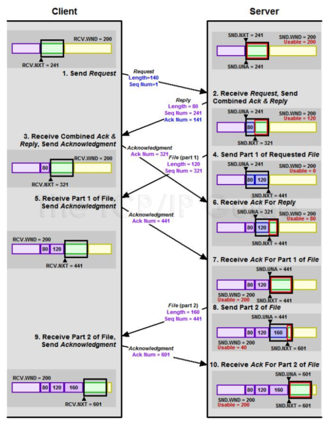

## 操作系统缓冲区与滑动窗口的关系  

### 应用层没有及时读取缓存

### 收缩窗口导致的丢包  

- 先收缩窗口，再减少缓存  
- 窗口关闭后，定时探测窗口大小  

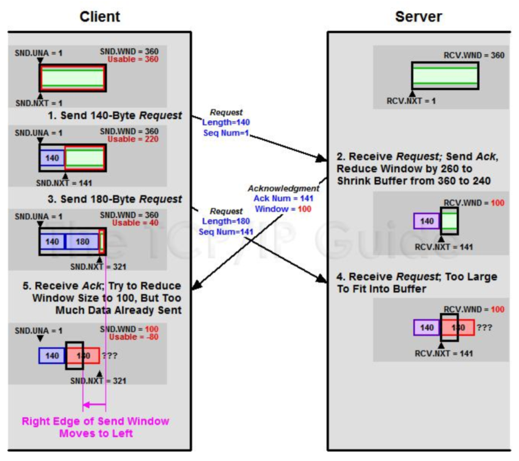

### 飞行中报文的适合数量  

bps*RTT  

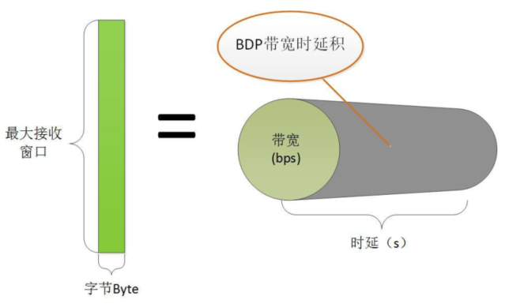

### Linux下调整接收窗口与应用缓存  

- net.ipv4.tcp_adv_win_scale = 1
- 应用缓存 = buffer / (2^tcp_adv_win_scale)  

### Linux中对TCP缓冲区的调整方式  

- net.ipv4.tcp_rmem = 4096 87380 6291456
  - 读缓存最小值、默认值、最大值，单位字节，覆盖 net.core.rmem_max
- net.ipv4.tcp_wmem = 4096 16384 4194304
  - 写缓存最小值、默认值、最大值，单位字节，覆盖net.core.wmem_max
- net.ipv4.tcp_mem = 1541646 2055528 3083292
  - 系统无内存压力、启动压力模式阀值、最大值，单位为页的数量
- net.ipv4.tcp_moderate_rcvbuf = 1
  - 开启自动调整缓存模式
