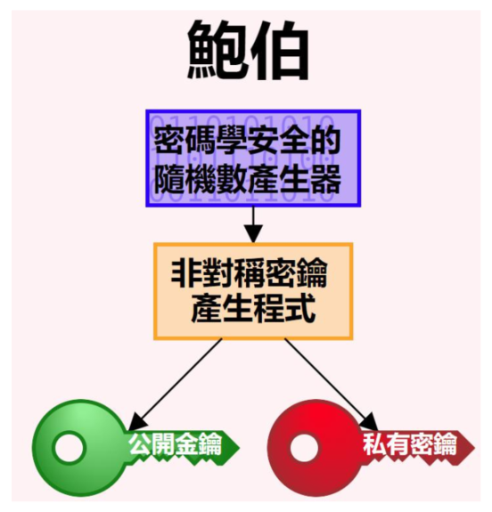
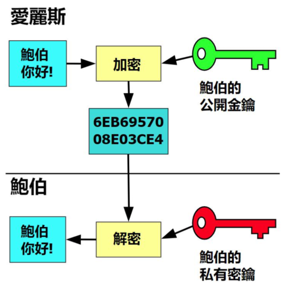
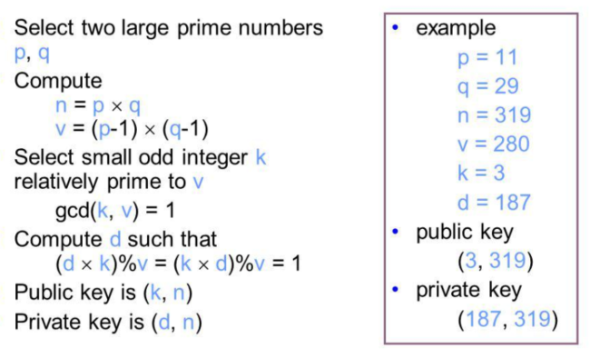
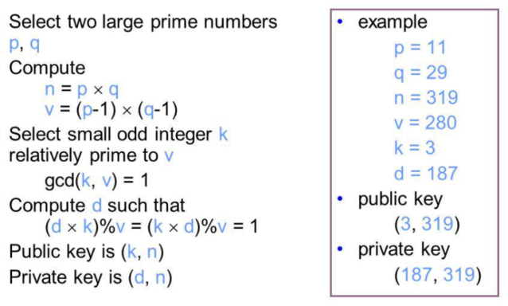
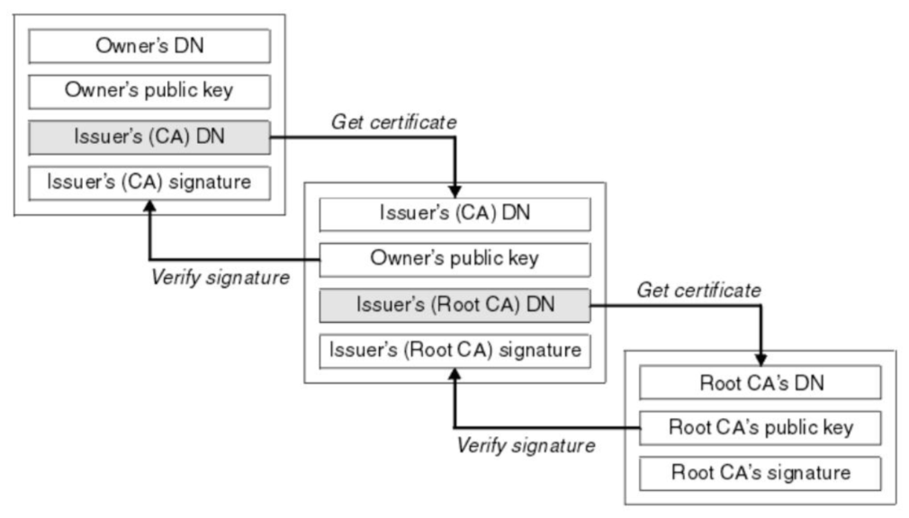
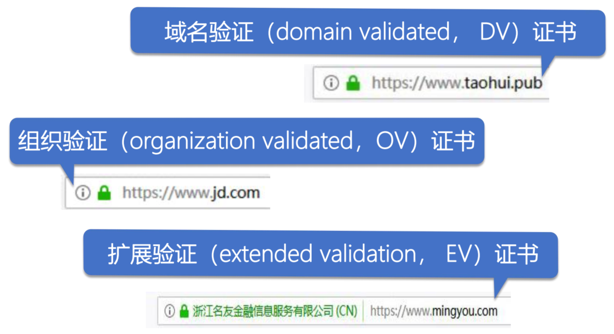
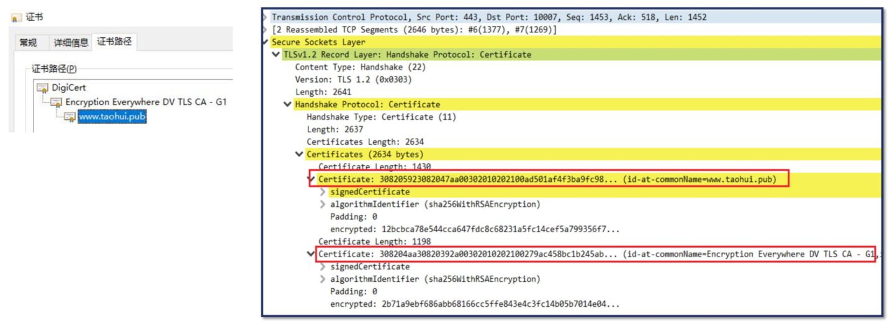
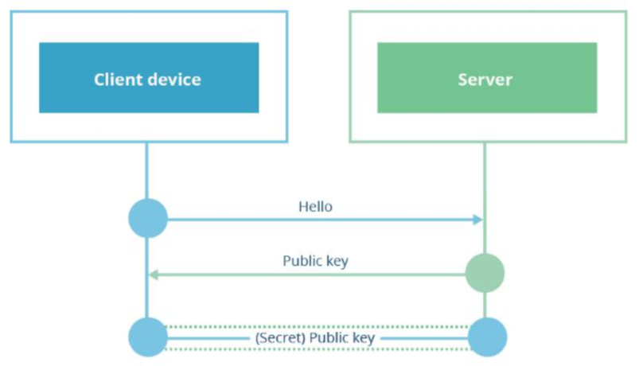
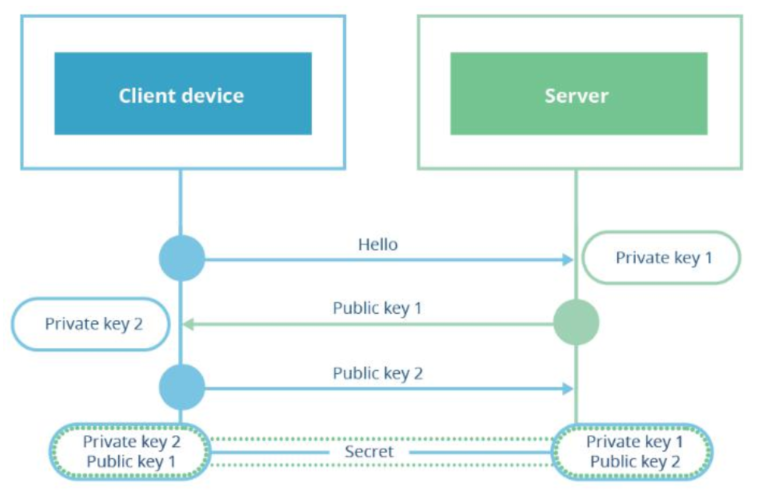
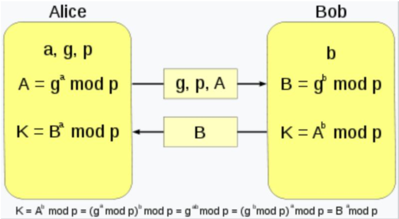

# TLS/SSL 协议的工作原理  

## TLS 设计目的  

- 身份验证
- 保密性
- 完整性  

## TLS/SSL 发展  

## TLS 协议  

- Record 记录协议
  - 对称加密
- Handshake 握手协议
  - 验证通讯双方的身份
  - 交换加解密的安全套件
  - 协商加密参数

## TLS 安全密码套件解读  

# 对称加密的工作原理：XOR 与填充  

## 对称加密  

## AES 对称加密在网络中的应用

## 对称加密与 XOR 异或运算  

## 填充 padding  

- Block cipher 分组加密：将明文分成多个等长的 Block 模块，对每个模块分别加解密
- 目的：当最后一个明文 Block 模块长度不足时，需要填充  
- 填充方法  
  - 位填充：以 bit 位为单位来填充  
  - 字节填充：以字节为单位为填充  

## 分组工作模式 block cipher mode of operation  

允许使用同一个分组密码密钥对多于一块的数据进行加密，并保证其安全性  

### ECB（Electronic codebook）模式  

直接将明文分解为多个块，对每个块独立加密  

问题：无法隐藏数据特征  

### CBC（Cipher-block chaining）模式  

每个明文块先与前一个密文块进行异或后，再进行加密  

问题：加密过程串行化  

### CTR（Counter）模式  

- 通过递增一个加密计数器以产生连续的密钥流
- 问题：不能提供密文消息完整性校验  

## 验证完整性

### hash 函数  

### MAC（Message Authentication Code）  

## GCM  

- Galois/Counter Mode
- CTR+GMAC    

# AES 对称加密算法  

AES（Advanced Encryption Standard）加密算法为比利时密码学家 Joan Daemen 和 Vincent Rijmen 所设计，又称 Rijndael 加密算法    

- 常用填充算法：PKCS7  
- 常用分组工作模式：GCM  

## AES 的三种密钥长度  

AES分组长度是 128 位（16 字节）  

## AES 的加密步骤  

- 把明文按照 128bit（16 字节）拆分成若干个明文块，每个明文块是 4*4 矩阵
- 按照选择的填充方式来填充最后一个明文块
- 每一个明文块利用 AES 加密器和密钥，加密成密文块
- 拼接所有的密文块，成为最终的密文结果  

## AES 加密流程  

C = E(K,P)，E 为每一轮算法，每轮密钥皆不同  

- 初始轮
  - AddRoundKey 轮密钥加

- 普通轮
  - AddRoundKey 轮密钥加
  - SubBytes 字节替代
  - ShiftRows 行移位
  - MixColumns 列混合
- 最终轮
  - SubBytes 字节替代
  - ShiftRows 行移位
  - AddRoundKey 轮密钥加

### AddRoundKey 步骤  

矩阵中的每一个字节都与该次回合密钥（round key）做 XOR 运算；每个子密钥由密钥生成方案产生  

### 密钥扩展  

函数 g 步骤
- a.字循环：左移 1 个字节
- b.使用 S 盒字节代换
- c. 同轮常量 RC[ j]进行异或，其中 j 表示轮数

RC = {0x01, 0x02, 0x04, 0x08, 0x10, 0x20, 0x40, 0x80, 0x1B, 0x36}  

### SubBytes 步骤  

透过一个非线性的替换函数，用查找表的方式把每个字节替换成对应的字节。提供非线性变换能力，避免简单代数性质的攻击  

### S 盒  

### ShiftRows 步骤  

将矩阵中的每个横列进行循环式移位：

- 第一行不变
- 第二行循环左移 1 个字节
- 第三行循环左移 2 个字节
- 第四行循环左移 3 个字节  

### MixColumns 步骤  

# 非对称密码与 RSA 算法  

非对称密码，每个参与方都有一对密钥：

- 公钥
  - 向对方公开
- 私钥
  - 仅自己使用  

## 非对称加解密的过程  

- 加密
  - 使用对方的公钥加密消息

- 解密
  - 使用自己的私钥解密消息

## RSA 算法  

1977 年由罗纳德·李维斯特（Ron Rivest）、阿迪·萨莫尔（Adi Shamir）和伦纳德·阿德曼（Leonard Adleman）一起提出，因此名为 RSA 算法  

### RSA 算法中公私钥的产生  

- 随机选择两个不相等的质数 p 和 q  
- 计算 p 和 q 的乘积 n（明文小于 n）  
- 计算 n 的欧拉函数 v=φ(n)  
- 随机选择一个整数 k ，1< k < v，且 k 与 v 互质  
- 计算 k 对于 v 的模反元素 d  
- 公钥：(k,n)  
- 私钥： (d,n)  

### RSA 算法加解密流程  

加密：c ≡ m^k (mod n)，m 是明文，c 是密文  

解密：m ≡ c^d (mod n)  

举例：对明文数字 123 加解密  

- 公钥（3,319）加密
  - 123^3mod319=140
  - 对140密文用私钥（187,319）解密
    - 140^187mod319=123
- 私钥（187,319）加密
  - 123^187mod319=161
  - 公钥（3,319）解密
    - 161^3mod319=123

# 非对称密码应用：PKI 证书体系  

## 非对称密码应用：数字签名  

基于私钥加密，只能使用公钥解密：起到身份认证的使用  

公钥的管理：Public Key Infrastructure（PKI）公钥基础设施  

- 由 Certificate Authority（CA）数字证书认证机构将用户个人身份与公开密钥关联在一起
- 公钥数字证书组成
  - CA 信息、公钥用户信息、公钥、权威机构的签字、有效期
-  PKI 用户
  - 向 CA 注册公钥的用户
  - 希望使用已注册公钥的用户

## 签发证书流程

## 签名与验签流程

## 证书信任链  

## PKI 公钥基础设施  

## 证书类型  

## 验证证书链  

# 非对称密码应用：DH 密钥交换协议  

## RSA 密钥交换

RSA 密钥交换，由客户端生成对称加密的密钥  

## DH 密钥交换  

1976 年由 Bailey Whitfield Diffie 和 Martin Edward Hellman 首次发表，故称为Diffie–Hellman key exchange，简称 DH。它可以让双方在完全没有对方任何预先信息的条件下通过不安全信道创建起一个密钥  

### DH 密钥交换协议举例  

- g、p、A、B 公开
- a,b 保密
- 生成共同密钥 K  

- 协定使用 p=23 以及 base g=5
- 爱丽丝选择一个秘密整数 a=6, 计算A = ga mod p 并发送给鲍伯
  - A = 5^6 mod 23 = 8
- 鲍伯选择一个秘密整数 b=15, 计算B = g^b mod p 并发送给爱丽丝
  - B = 5^15 mod 23 = 19
- 爱丽丝计算 s = B^a mod p
  - 19^6 mod 23 = 2
- 鲍伯计算 s = A^b mod p
  - 8^15 mod 23 = 2

