# TLS/SSL 协议的工作原理  

## TLS 设计目的  

- 身份验证
- 保密性
- 完整性  

## TLS/SSL 发展  

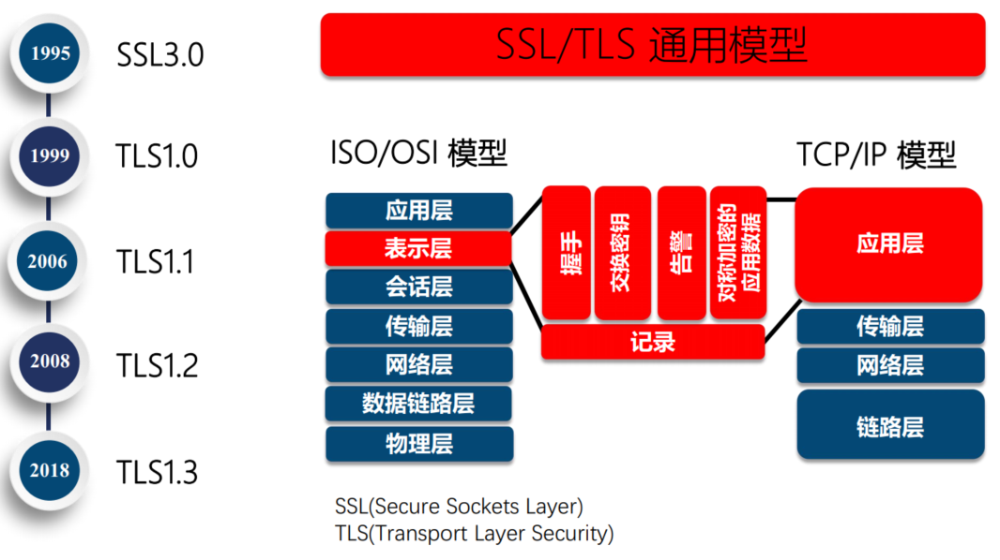

## TLS 协议  

- Record 记录协议
  - 对称加密
- Handshake 握手协议
  - 验证通讯双方的身份
  - 交换加解密的安全套件
  - 协商加密参数

## TLS 安全密码套件解读  

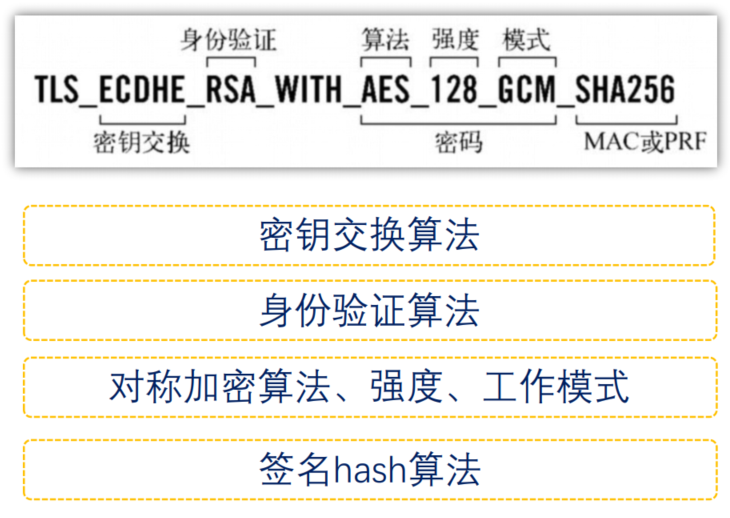

# 对称加密的工作原理：XOR 与填充  

## 对称加密  

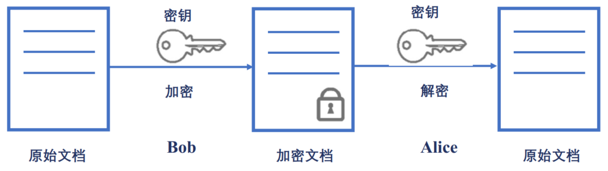

## AES 对称加密在网络中的应用

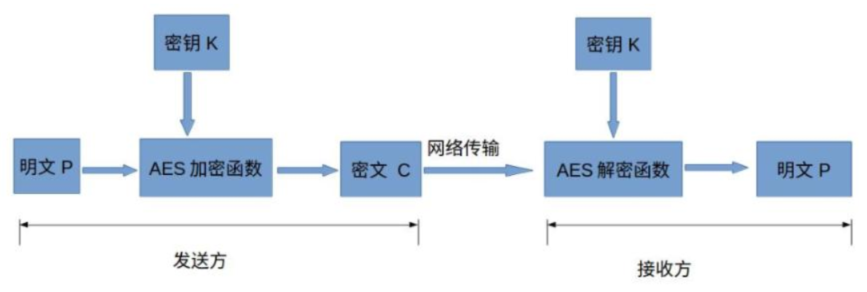

## 对称加密与 XOR 异或运算  

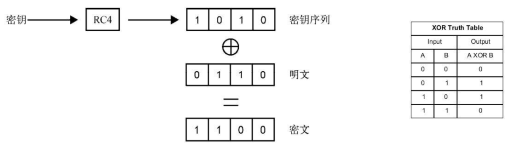

## 填充 padding  

- Block cipher 分组加密：将明文分成多个等长的 Block 模块，对每个模块分别加解密
- 目的：当最后一个明文 Block 模块长度不足时，需要填充  
- 填充方法  
  - 位填充：以 bit 位为单位来填充  
  - 字节填充：以字节为单位为填充  

## 分组工作模式 block cipher mode of operation  

允许使用同一个分组密码密钥对多于一块的数据进行加密，并保证其安全性  

### ECB（Electronic codebook）模式  

直接将明文分解为多个块，对每个块独立加密  

问题：无法隐藏数据特征  

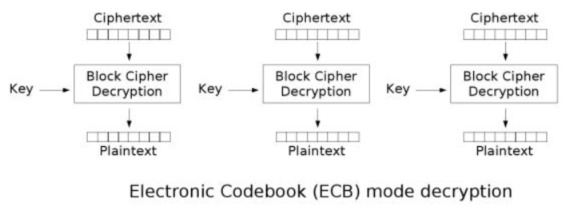

### CBC（Cipher-block chaining）模式  

每个明文块先与前一个密文块进行异或后，再进行加密  

问题：加密过程串行化  

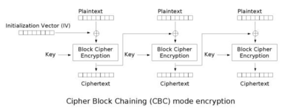

### CTR（Counter）模式  

- 通过递增一个加密计数器以产生连续的密钥流
- 问题：不能提供密文消息完整性校验  

## 验证完整性

### hash 函数  

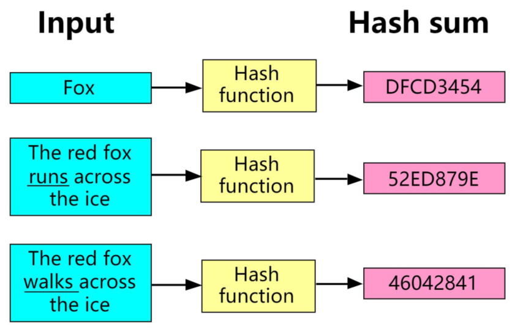

### MAC（Message Authentication Code）  

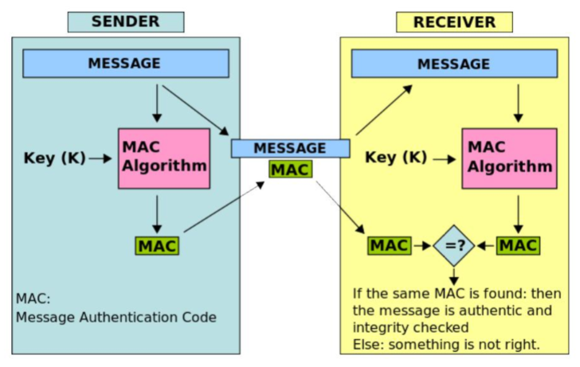

## GCM  

- Galois/Counter Mode
- CTR+GMAC    

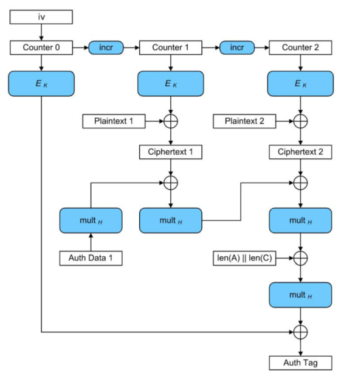

# AES 对称加密算法  

AES（Advanced Encryption Standard）加密算法为比利时密码学家 Joan Daemen 和 Vincent Rijmen 所设计，又称 Rijndael 加密算法    

- 常用填充算法：PKCS7  
- 常用分组工作模式：GCM  

## AES 的三种密钥长度  

AES分组长度是 128 位（16 字节）  

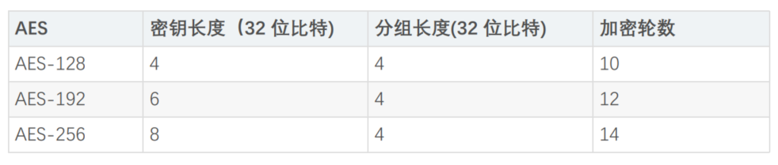

## AES 的加密步骤  

- 把明文按照 128bit（16 字节）拆分成若干个明文块，每个明文块是 4*4 矩阵
- 按照选择的填充方式来填充最后一个明文块
- 每一个明文块利用 AES 加密器和密钥，加密成密文块
- 拼接所有的密文块，成为最终的密文结果  

## AES 加密流程  

C = E(K,P)，E 为每一轮算法，每轮密钥皆不同  

- 初始轮
  - AddRoundKey 轮密钥加

- 普通轮
  - AddRoundKey 轮密钥加
  - SubBytes 字节替代
  - ShiftRows 行移位
  - MixColumns 列混合
- 最终轮
  - SubBytes 字节替代
  - ShiftRows 行移位
  - AddRoundKey 轮密钥加

### AddRoundKey 步骤  

矩阵中的每一个字节都与该次回合密钥（round key）做 XOR 运算；每个子密钥由密钥生成方案产生  

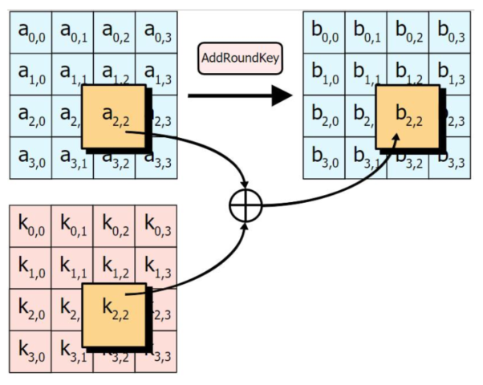

### 密钥扩展  

函数 g 步骤
- a.字循环：左移 1 个字节
- b.使用 S 盒字节代换
- c. 同轮常量 RC[ j]进行异或，其中 j 表示轮数

RC = {0x01, 0x02, 0x04, 0x08, 0x10, 0x20, 0x40, 0x80, 0x1B, 0x36}  

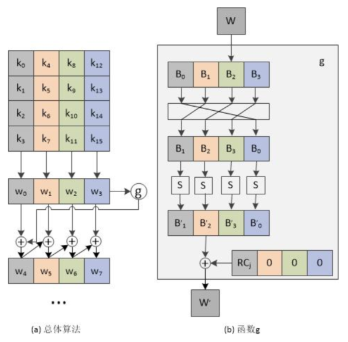

### SubBytes 步骤  

透过一个非线性的替换函数，用查找表的方式把每个字节替换成对应的字节。提供非线性变换能力，避免简单代数性质的攻击  

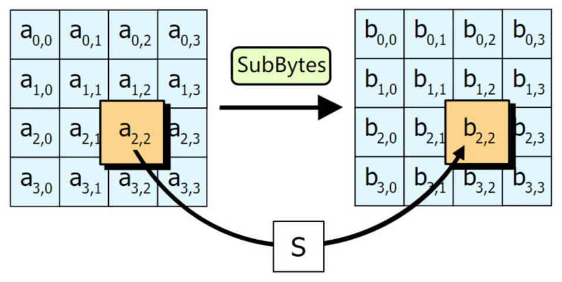

### S 盒  

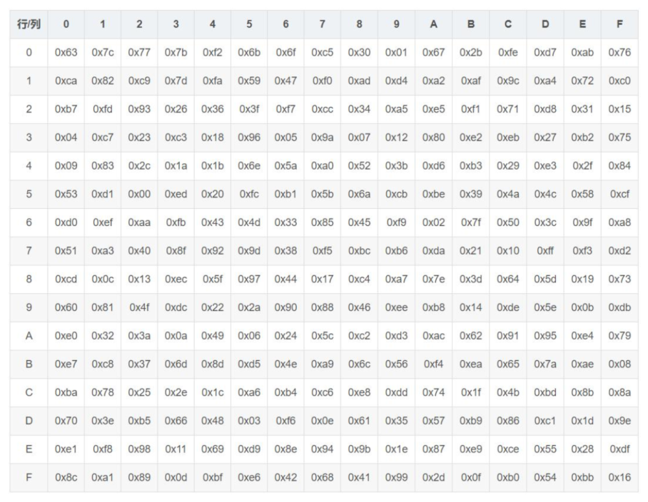

### ShiftRows 步骤  

将矩阵中的每个横列进行循环式移位：

- 第一行不变
- 第二行循环左移 1 个字节
- 第三行循环左移 2 个字节
- 第四行循环左移 3 个字节  

### MixColumns 步骤  

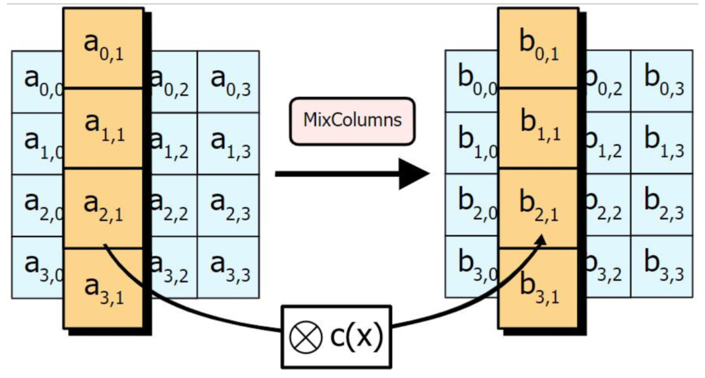

# 非对称密码与 RSA 算法  

