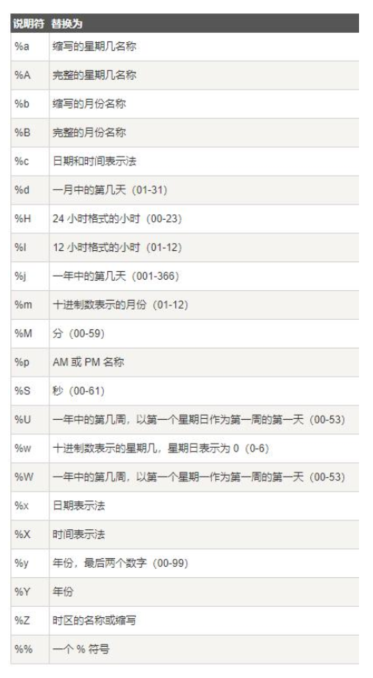

# tcpdump

## 捕获及停止条件  

- D 列举所有网卡设备
- -i 选择网卡设备
- -c 抓取多少条报文
-  --time-stamp-precision 指定捕获时的时间精度，默认毫秒 micro，可选纳秒 nano
-  -s 指定每条报文的最大字节数，默认 262144 字节  

## 文件操作

- -w 输出结果至文件（可被Wireshark读取分析）
- -C 限制输入文件的大小，超出后以后缀加 1 等数字的形式递增。注意单位是 1,000,000 字节
- -W 指定输出文件的最大数量，到达后会重新覆写第 1 个文件
- -G 指定每隔N秒就重新输出至新文件，注意-w 参数应基于 strftime 参数指定文件名
- -r 读取一个抓包文件
- -V 将待读取的多个文件名写入一个文件中，通过读取该文件同时读取多个文件  

## 输出时间戳格式

- -t 不显示时间戳
- -tt 自 1970年 1 月 1 日 0 点至今的秒数
- -ttt 显示邻近两行报文间经过的秒数
- -tttt 带日期的完整时间
- -ttttt 自第一个抓取的报文起经历的秒数  

## 分析信息详情

- -e 显示数据链路层头部
- -q 不显示传输层信息
- -v 显示网络层头部更多的信息，如 TTL、id 等
- -n 显示 IP 地址、数字端口代替 hostname 等
- -S TCP 信息以绝对序列号替代相对序列号
- -A 以 ASCII 方式显示报文内容，适用 HTTP 分析
- -x 以 16 进制方式显示报文内容，不显示数据链路层
- -xx 以 16 进制方式显示报文内容，显示数据链路层
- -X 同时以 16 进制及 ACII 方式显示报文内容，不显示数据链路层
- -XX 同时以 16 进制及 ACII 方式显示报文内容，显示数据链路层  

# netstat

查看 TCP 状态。

- interval: 重新显示选定的统计信息，各个显示间暂停的间隔秒数
- -a: 显示所有连接和侦听端口
- -n: 以数字形式（如 IP 地址）显示地址和端口号
- -r: 显示路由表
- -s: 显示每个协议的统计信息
- -o(Windows): 显示拥有的与每个连接关联的进程 ID
- -b(Windows)/-p(Linux) : 显示对应的可执行程序名字

# BPF

## primitives 原语

由名称或数字，以及描述它的多个限定词组成

- qualifiers 限定词
- Type：设置数字或者名称所指示类型，例如 host www.baidu.com
- Dir：设置网络出入方向，例如 dst port 80
- Proto：指定协议类型，例如 udp
- 其他

##　原语运算符

- 与：&& 或者 and
- 或：|| 或者 or
- 非：! 或者 not  

## 限定词  

### Type

设置数字或者名称所指示类型

- host、port
- net ，设定子网，net 192.168.0.0 mask 255.255.255.0 等价于 net 192.168.0.0/24
- portrange，设置端口范围，例如 portrange 6000-8000  

### Dir

设置网络出入方向

- src、dst、src or dst、src and dst
- ra、ta、addr1、addr2、addr3、addr4（仅对 IEEE 802.11 Wireless LAN 有效）  

### Proto

指定协议类型

- ether、fddi、tr、 wlan、 ip、 ip6、 arp、 rarp、 decnet、 tcp、udp、icmp、igmp、icmp、
  igrp、pim、ah、esp、vrrp  

### 其他

- gateway：指明网关 IP 地址，等价于 ether host ehost and not host host
- broadcast：广播报文，例如 ether broadcast 或者 ip broadcast
- multicast：多播报文，例如 ip multicast 或者 ip6 multicast
- less, greater：小于或者大于  

