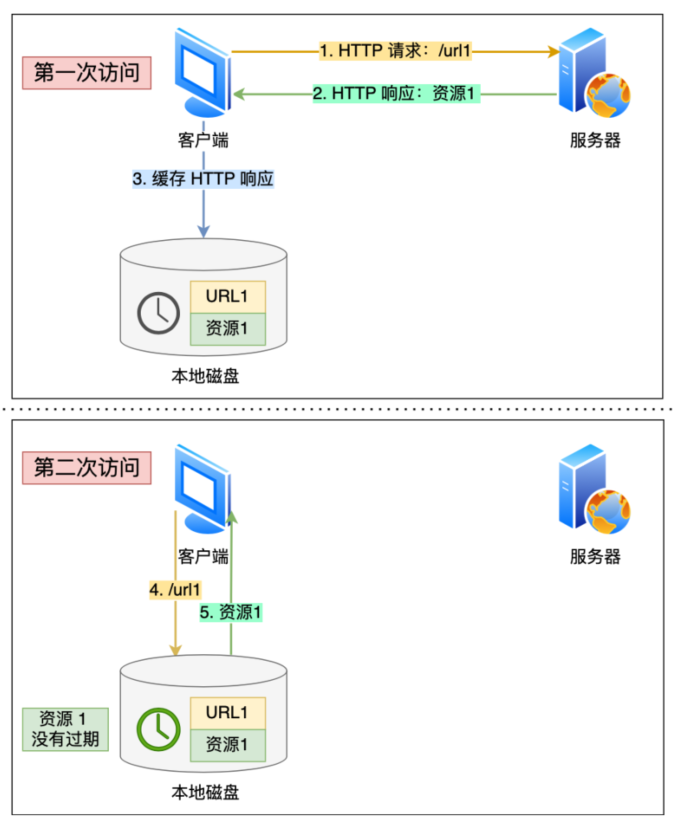
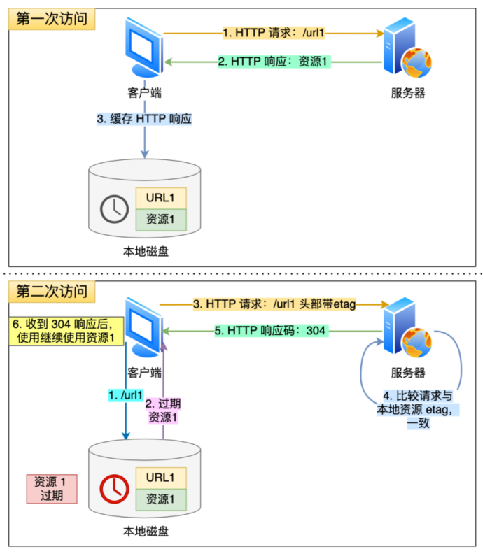
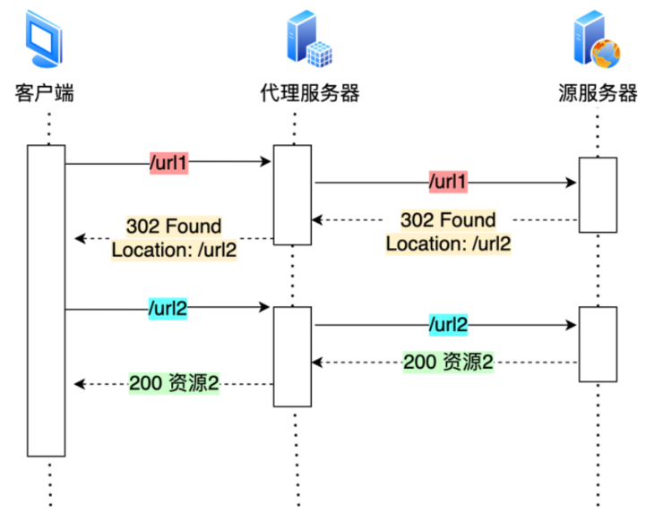
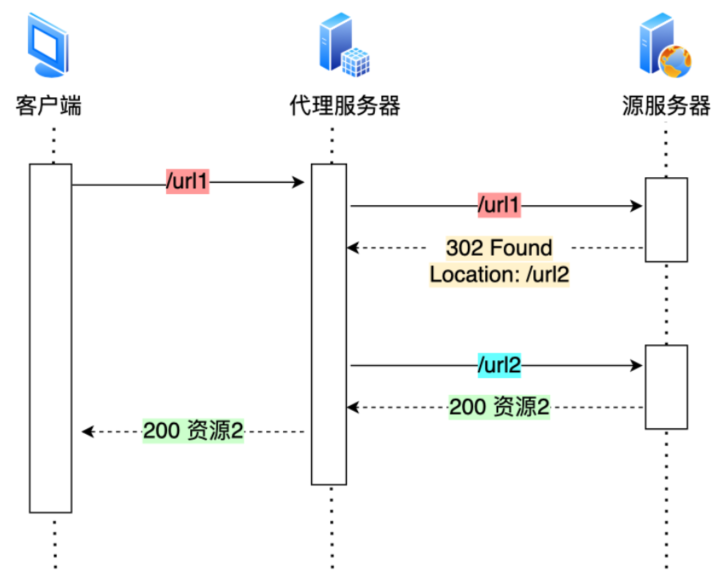
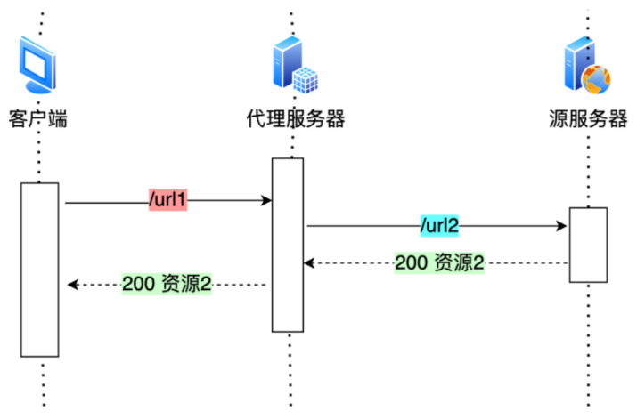
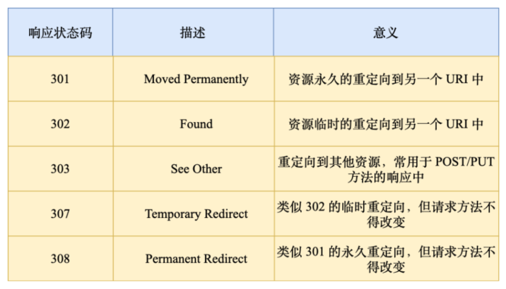
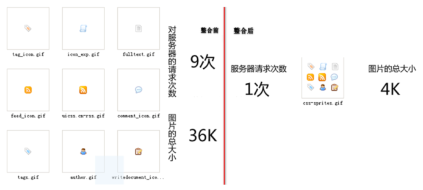

# 避免发送 HTTP 请求

对于⼀些具有重复性的 HTTP 请求，⽐如每次请求得到的数据都⼀样的，我们可以把这对请求-响应的数据都缓存在本地，那么下次就直接读取本地的数据，不必在通过⽹络获取服务器的响应了，这样的话 HTTP/1.1 的性能肯定⾁眼可⻅的提升。  

所以，避免发送 HTTP 请求的⽅法就是通过缓存技术， HTTP 设计者早在之前就考虑到了这点，因此 HTTP 协议的头部有不少是针对缓存的字段。  

客户端会把第⼀次请求以及响应的数据保存在本地磁盘上，其中将请求的 URL 作为 key，⽽响应作为 value，两者形成映射关系。这样当后续发起相同的请求时，可以先在本地磁盘上通过 key 查到对应的 value，也就是响应，如果找到了，就直接从本地读取该响应。毋庸置疑，读取本次磁盘的速度肯定⽐⽹络请求快得多。

服务器在发送 HTTP 响应时，会估算⼀个过期的时间，并把这个信息放到响应头部中，这样客户端在查看响应头部的信息时，⼀旦发现缓存的响应是过期的，则就会重新发送⽹络请求。   

如果客户端从第⼀次请求得到的响应头部中发现该响应过期了，客户端重新发送请求，在请求的 Etag 头部带上第⼀次请求的响应头部中的摘要，这个摘要是唯⼀标识响应的资源，当服务器收到请求后，会将本地资源的摘要与请求中的摘要做个⽐较。如果不同，那么说明客户端的缓存已经没有价值，服务器在响应中带上最新的资源。 如果相同，说明客户端的缓存还是可以继续使⽤的，那么服务器仅返回不含有包体的 304 Not Modified 响应，告诉客户端仍然有效，这样就可以减少响应资源在⽹络中传输的延时。        

# 减少 HTTP 请求次数  

减少 HTTP 请求次数⾃然也就提升了 HTTP 性能，可以从这 3 个⽅⾯⼊⼿：  

- 减少重定向请求次数  
- 合并请求  
- 延迟发送请求  

## 减少重定向请求次数  

服务器上的⼀个资源可能由于迁移、维护等原因从 url1 移⾄ url2 后，⽽客户端不知情，它还是继续请求 url1，这时服务器不能粗暴地返回错误，⽽是通过 302 响应码和 Location 头部，告诉客户端该资源已经迁移⾄ url2 了，于是客户端需要再发送 url2 请求以获得服务器的资源。如果重定向请求越多，那么客户端就要多次发起 HTTP 请求，每⼀次的 HTTP 请求都得经过⽹络，这⽆疑会越降低⽹络性能。  

另外，服务端这⼀⽅往往不只有⼀台服务器，⽐如源服务器上⼀级是代理服务器，然后代理服务器才与客户端通信，这时客户端重定向就会导致客户端与代理服务器之间需要 2 次消息传递，如下图：  

如果重定向的⼯作交由代理服务器完成，就能减少 HTTP 请求次数了，如下图：  

⽽且当代理服务器知晓了重定向规则后，可以进⼀步减少消息传递次数，如下图：  

除了 302 重定向响应码，还有其他⼀些重定向的响应码：

其中， 301 和 308 响应码是告诉客户端可以将重定向响应缓存到本地磁盘，之后客户端就⾃动⽤ url2 替代 url1 访问服务器的资源。  

## 合并请求  

如果把多个访问⼩⽂件的请求合并成⼀个⼤的请求，虽然传输的总资源还是⼀样，但是减少请求，也就意味着减少了重复发送的 HTTP 头部。

由于 HTTP/1.1 是请求响应模型，如果第⼀个发送的请求，未收到对应的响应，那么后续的请求就不会发送，于是为了防⽌单个请求的阻塞，所以⼀般浏览器会同时发起 5-6 个请求，每⼀个请求都是不同的 TCP 连接，那么如果合并了请求，也就会减少 TCP 连接的数量，因⽽省去了 TCP 握⼿和慢启动过程耗费的时间。  

有的⽹⻚会含有很多⼩图⽚、⼩图标，有多少个⼩图⽚，客户端就要发起多少次请求。那么对于这些⼩图⽚，我们可以考虑使⽤ CSS Image Sprites 技术把它们合成⼀个⼤图⽚，这样浏览器就可以⽤⼀次请求获得⼀个⼤图⽚，然后再根据 CSS 数据把⼤图⽚切割成多张⼩图⽚。  

这种⽅式就是通过将多个⼩图⽚合并成⼀个⼤图⽚来减少 HTTP 请求的次数，以减少 HTTP 请求的次数，从⽽减少⽹络的开销。  

除了将⼩图⽚合并成⼤图⽚的⽅式，还有服务端使⽤ webpack 等打包⼯具将 js、 css 等资源合并打包成⼤⽂件，也是能达到类似的效果。  

另外，还可以将图⽚的⼆进制数据⽤ base64 编码后，以 URL 的形式潜⼊到 HTML ⽂件，跟随 HTML ⽂件⼀并发送。这样客户端收到 HTML 后，就可以直接解码出数据，然后直接显示图⽚，就不⽤再发起图⽚相关的请求，这样便减少了请求的次数。    

可以看到， 合并请求的⽅式就是合并资源，以⼀个⼤资源的请求替换多个⼩资源的请求。但是这样的合并请求会带来新的问题， 当⼤资源中的某⼀个⼩资源发⽣变化后，客户端必须重新下载整个完整的⼤资源⽂件，这显然带来了额外的⽹络消耗。  

## 延迟发送请求  

⼀般 HTML ⾥会含有很多 HTTP 的 URL，当前不需要的资源，我们没必要也获取过来，于是可以通过按需获取的⽅式，来减少第⼀时间的 HTTP 请求次数。  

请求⽹⻚的时候，没必要把全部资源都获取到，⽽是只获取当前⽤户所看到的⻚⾯资源，当⽤户向下滑动⻚⾯的时候，再向服务器获取接下来的资源，这样就达到了延迟发送请求的效果。  

# 减少 HTTP 响应的数据⼤⼩  

对于 HTTP 的请求和响应，通常 HTTP 的响应的数据⼤⼩会⽐较⼤，也就是服务器返回的资源会⽐较⼤。于是，我们可以考虑对响应的资源进⾏压缩，这样就可以减少响应的数据⼤⼩，从⽽提⾼⽹络传输的效率。压缩的⽅式⼀般分为 2 种，分别是：  

- ⽆损压缩
- 有损压缩  

## ⽆损压缩  

⽆损压缩是指资源经过压缩后，信息不被破坏，还能完全恢复到压缩前的原样，适合⽤在⽂本⽂件、程序可执⾏⽂件、程序源代码。  

gzip 就是常⻅的⽆损压缩。客户端⽀持的压缩算法，会在 HTTP 请求中通过头部中的 Accept-Encoding 字段告诉服务器：Accept-Encoding: gzip, deflate, br。      

服务器收到后，会从中选择⼀个服务器⽀持的或者合适的压缩算法，然后使⽤此压缩算法对响应资源进⾏压缩，最后通过响应头部中的 content-encoding 字段告诉客户端该资源使⽤的压缩算法：content-encoding: gzip。  

gzip 的压缩效率相⽐ Google 推出的 Brotli 算法还是差点意思，也就是上⽂中的 br，所以如果可以，服务器应该选择压缩效率更⾼的 br 压缩算法。     

## 有损压缩  

与⽆损压缩相对的就是有损压缩，经过此⽅法压缩，解压的数据会与原始数据不同但是⾮常接近。有损压缩主要将次要的数据舍弃，牺牲⼀些质量来减少数据量、提⾼压缩⽐，这种⽅法经常⽤于压缩多媒体数据，⽐如⾳频、视频、图⽚。    

可以通过 HTTP 请求头部中的 Accept 字段⾥的 q 质量因⼦，告诉服务器期望的资源质量：Accept: audio/*; q=0.2, audio/basic。 

关于图⽚的压缩，⽬前压缩⽐较⾼的是 Google 推出的 WebP 格式。 

# 总结  

优化 HTTP/1.1 协议的思路：

第⼀个思路是，通过缓存技术来避免发送 HTTP 请求。客户端收到第⼀个请求的响应后，可以将其缓存在本地磁盘，下次请求的时候，如果缓存没过期，就直接读取本地缓存的响应数据。如果缓存过期，客户端发送请求的时候带上响应数据的摘要，服务器⽐对后发现资源没有变化，就发出不带包体的 304 响应，告诉客户端缓存的响应仍然有效。  

第⼆个思路是，减少 HTTP 请求的次数，有以下的⽅法：

- 将原本由客户端处理的重定向请求，交给代理服务器处理，这样可以减少重定向请求的次数
- 将多个⼩资源合并成⼀个⼤资源再传输，能够减少 HTTP 请求次数以及 头部的重复传输，再来减少 TCP 连接数量，进⽽省去 TCP 握⼿和慢启动的⽹络消
- 按需访问资源，只访问当前⽤户看得到/⽤得到的资源，当客户往下滑动，再访问接下来的资源，以此达到延迟请求，也就减少了同⼀时间的 HTTP 请求次数

第三思路是，通过压缩响应资源，降低传输资源的⼤⼩，从⽽提⾼传输效率，所以应当选择更优秀的压缩算法。  

不管怎么优化 HTTP/1.1 协议都是有限的，不然也不会出现 HTTP/2 和 HTTP/3 协议。

