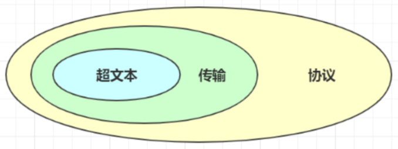
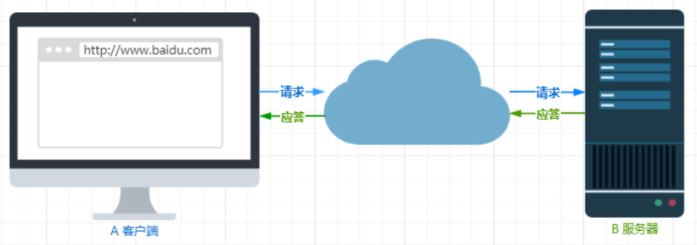
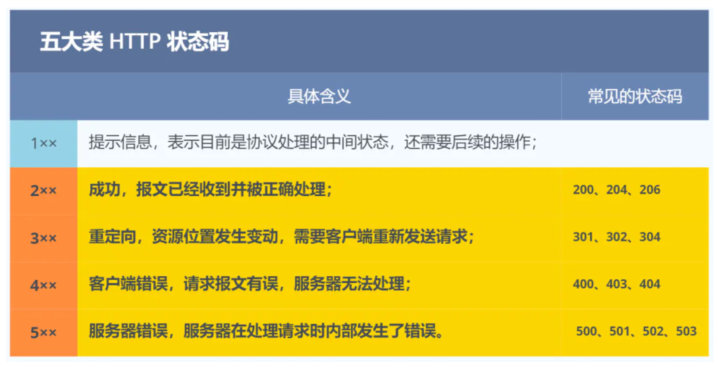
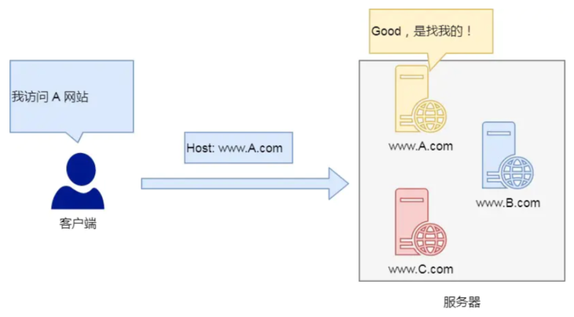
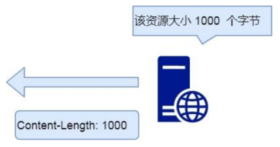
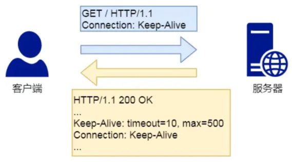
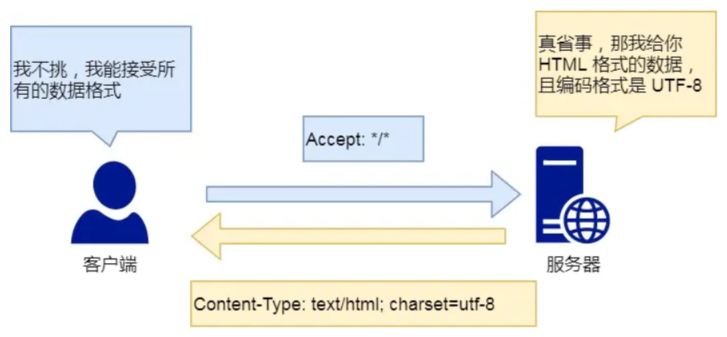
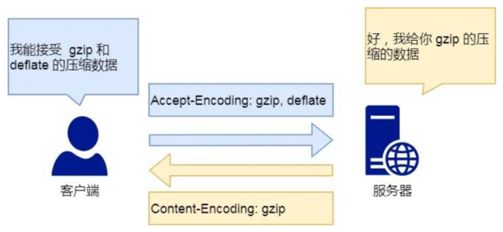
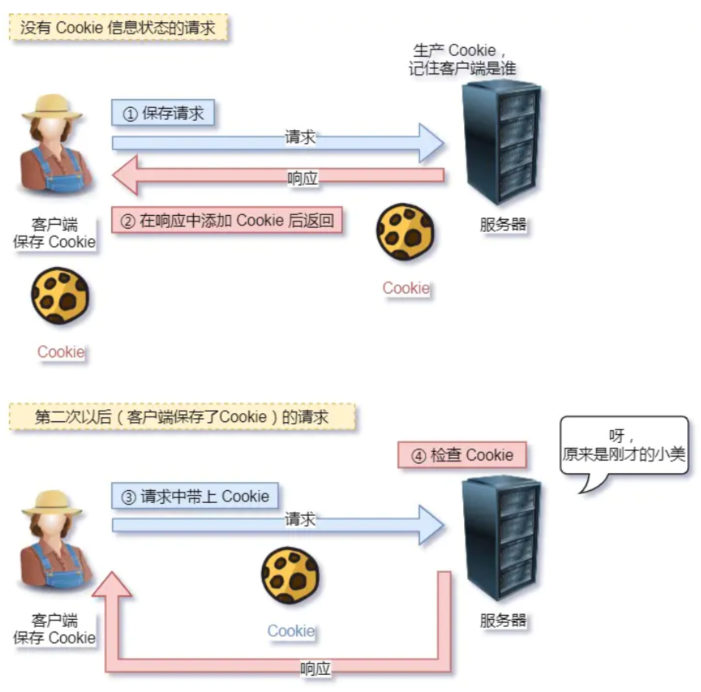
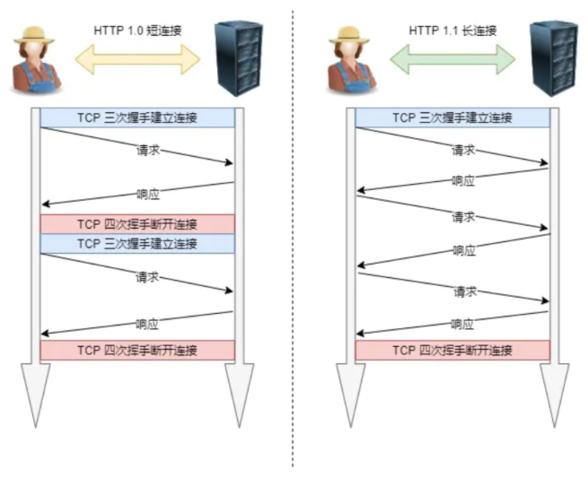

# HTTP 基本概念  

HTTP 是⼀个在计算机世界⾥专⻔在两点之间传输⽂字、图⽚、⾳频、视频等超⽂本数据的约定和规范。  

HTTP 是超⽂本传输协议，也就是HyperText Transfer Protocol。可以拆成三个部分：    

- 超⽂本
- 传输
- 协议  

## 协议  

HTTP 是⼀个⽤在计算机世界⾥的协议。它使⽤计算机能够理解的语⾔确⽴了⼀种计算机之间交流通信的规范（两个以上的参与者），以及相关的各种控制和错误处理⽅式（⾏为约定和规范）。  

## 传输  

HTTP 协议是⼀个双向协议。  

HTTP 是⼀个在计算机世界⾥专⻔⽤来在两点之间传输数据的约定和规范。  

数据虽然是在 A 和 B 之间传输，但允许中间有中转或接⼒。这样的传输⽅式就从「A < --- > B」，变成了「A <-> N <-> M <-> B」。    

## 超⽂本  

HTTP 传输的内容是超⽂本。  

⽂本的涵义已经可以扩展为图⽚、视频、压缩包等，在 HTTP 眼⾥这些都算作⽂本。超⽂本就是超越了普通⽂本的⽂本，它是⽂字、图⽚、视频等的混合体，最关键有超链接，能从⼀个超⽂本跳转到另外⼀个超⽂本。  

HTML 就是最常⻅的超⽂本了，它本身只是纯⽂字⽂件，但内部⽤很多标签定义了图⽚、视频等的链接，再经过浏览器的解释，呈现给我们的就是⼀个⽂字、有画⾯的⽹⻚了。  

# HTTP 常⻅的状态码  

## 1xx
1xx 类状态码属于提示信息，是协议处理中的⼀种中间状态，实际⽤到的⽐较少。  

## 2xx
2xx 类状态码表示服务器成功处理了客户端的请求，也是我们最愿意看到的状态。

- 200 OK，是最常⻅的成功状态码，表示⼀切正常。如果是⾮ HEAD 请求，服务器返回的响应头都会有 body 数据
- 204 No Content，也是常⻅的成功状态码，与 200 OK 基本相同，但响应头没有 body 数据
- 206 Partial Content，是应⽤于 HTTP 分块下载或断点续传，表示响应返回的 body 数据并不是资源的全部⽽是其中的⼀部分，也是服务器处理成功的状态

## 3xx  

3xx 类状态码表示客户端请求的资源发送了变动，需要客户端⽤新的 URL 重新发送请求获取资源，也就是重定向。  

- 301 Moved Permanently，表示永久重定向，说明请求的资源已经不存在了，需改⽤新的 URL 再次访问

- 302 Found，表示临时重定向，说明请求的资源还在，但暂时需要⽤另⼀个 URL 来访问

301 和 302 都会在响应头⾥使⽤字段 Location ，指明后续要跳转的 URL，浏览器会⾃动重定向新的 URL

- 304 Not Modified，不具有跳转的含义，表示资源未修改，重定向已存在的缓冲⽂件，也称缓存重定向，⽤于缓存控制  

## 4xx
4xx 类状态码表示客户端发送的报⽂有误，服务器⽆法处理，也就是错误码的含义。

- 400 Bad Request，表示客户端请求的报⽂有错误，但只是个笼统的错误
- 403 Forbidden，表示服务器禁⽌访问资源，并不是客户端的请求出错
- 404 Not Found，表示请求的资源在服务器上不存在或未找到，所以⽆法提供给客户端

## 5xx
5xx 类状态码表示客户端请求报⽂正确，但是服务器处理时内部发⽣了错误，属于服务器端的错误码。

- 500 Internal Server Error，与 400 类型，是个笼统通⽤的错误码，服务器发⽣了什么错误，我们并不知道
- 501 Not Implemented，表示客户端请求的功能还不⽀持，类似“即将开业，敬请期待”的意思
- 502 Bad Gateway，通常是服务器作为⽹关或代理时返回的错误码，表示服务器⾃身⼯作正常，访问后端服务器发⽣了错误
- 503 Service Unavailable，表示服务器当前很忙，暂时⽆法响应服务器，类似“⽹络服务正忙，请稍后重试”的意思

# HTTP 常⻅字段  

## Host 字段  

客户端发送请求时，⽤来指定服务器的域名。有了 Host 字段，就可以将请求发往同⼀台服务器上的不同⽹站。    

## Content-Length 字段  

服务器在返回数据时，会有 Content-Length 字段，表明本次回应的数据⻓度。  

## Connection 字段  

Connection 字段最常⽤于客户端要求服务器使⽤ TCP 持久连接，以便其他请求复⽤。HTTP/1.1 版本的默认连接都是持久连接，但为了兼容⽼版本的 HTTP，需要指定 Connection ⾸部字段的值为 Keep-Alive 。  

⼀个可以复⽤的 TCP 连接就建⽴了，直到客户端或服务器主动关闭连接。但是，这不是标准字段。  

## Content-Type 字段  

Content-Type 字段⽤于服务器回应时，告诉客户端，本次数据是什么格式。  

客户端请求的时候，可以使⽤ Accept 字段声明⾃⼰可以接受哪些数据格式。  

## Content-Encoding 字段  

Content-Encoding 字段说明数据的压缩⽅法。表示服务器返回的数据使⽤了什么压缩格式。

客户端在请求时，⽤ Accept-Encoding 字段说明⾃⼰可以接受哪些压缩⽅法。  

# GET 与 POST  

Get ⽅法的含义是请求从服务器获取资源，这个资源可以是静态的⽂本、⻚⾯、图⽚视频等。  

⽽ POST ⽅法则是相反操作，它向 URI 指定的资源提交数据，数据就放在报⽂的 body ⾥。  

安全和幂等的概念：  

- 在 HTTP 协议⾥，所谓的安全是指请求⽅法不会破坏服务器上的资源  
- 所谓的幂等，意思是多次执⾏相同的操作，结果都是相同的

GET ⽅法就是安全且幂等的，因为它是「只读」操作，⽆论操作多少次，服务器上的数据都是安全的，且每次的结果都是相同的。  

POST 因为是新增或提交数据的操作，会修改服务器上的资源，所以是不安全的，且多次提交数据就会创建多个资源，所以不是幂等的。  

# HTTP 特性  

HTTP 1.1  最凸出的优点是简单、灵活和易于扩展、应⽤⼴泛和跨平台。  

## 优点

### 简单  

HTTP 基本的报⽂格式就是 header + body ，头部信息也是 key-value 简单⽂本的形式， 易于理解，降低了学习和使⽤的⻔槛。  

### 灵活和易于扩展  

HTTP协议⾥的各类请求⽅法、 URI/URL、状态码、头字段等每个组成要求都没有被固定死，都允许开发⼈员⾃定义和扩充。  

同时 HTTP 由于是⼯作在应⽤层（ OSI 第七层），则它下层可以随意变化。  

### 应⽤⼴泛和跨平台  

HTTP 的应⽤范围⾮常的⼴泛，从台式机的浏览器到⼿机上的各种 APP，同时天然具有跨平台的优越性。    

## 缺点  

HTTP 协议⾥有优缺点⼀体的双刃剑，分别是⽆状态、明⽂传输，同时还有⼀⼤缺点不安全。  

### ⽆状态双刃剑  

⽆状态的好处，因为服务器不会去记忆 HTTP 的状态，所以不需要额外的资源来记录状态信息，这能减轻服务器的负担，能够把更多的 CPU 和内存⽤来对外提供服务。  

⽆状态的坏处，既然服务器没有记忆能⼒，它在完成有关联性的操作时会⾮常麻烦。对于⽆状态的问题，解法⽅案有很多种，其中⽐较简单的⽅式⽤ Cookie 技术。Cookie 通过在请求和响应报⽂中写⼊ Cookie 信息来控制客户端的状态。

### 明⽂传输双刃剑  

明⽂意味着在传输过程中的信息，是可⽅便阅读的。但是这正是这样， HTTP 的所有信息都暴露在了光天化⽇下，相当于信息裸奔。在传输的漫⻓的过程中，信息的内容都毫⽆隐私可⾔，很容易就能被窃取。

### 不安全  

HTTP ⽐较严重的缺点就是不安全：  

- 通信使⽤明⽂不加密，内容可能会被窃听  
- 不验证通信⽅的身份，因此有可能遭遇伪装  
- ⽆法证明报⽂的完整性，所以有可能已遭篡改  

HTTP 的安全问题，可以⽤ HTTPS 的⽅式解决，也就是通过引⼊ SSL/TLS 层，使得在安全上达到了极致。  

## HTTP/1.1 的性能  

HTTP 协议是基于 TCP/IP，并且使⽤了请求 - 应答的通信模式，所以性能的关键就在这两点⾥。  

### ⻓连接  

早期 HTTP/1.0 性能上的⼀个很⼤的问题，那就是每发起⼀个请求，都要新建⼀次 TCP 连接（三次握⼿），⽽且是串⾏请求，做了⽆谓的 TCP 连接建⽴和断开，增加了通信开销。  

为了解决上述 TCP 连接问题， HTTP/1.1 提出了⻓连接的通信⽅式，也叫持久连接。这种⽅式的好处在于减少了 TCP 连接的重复建⽴和断开所造成的额外开销，减轻了服务器端的负载。  

持久连接的特点是，只要任意⼀端没有明确提出断开连接，则保持 TCP 连接状态。  

### 管道⽹络传输  

HTTP/1.1 采⽤了⻓连接的⽅式，这使得管道（pipeline）⽹络传输成为了可能。即可在同⼀个 TCP 连接⾥⾯，客户端可以发起多个请求，只要第⼀个请求发出去了，不必等其回来，就可以发第⼆个请求出去，可以减少整体的响应时间。  

但是服务器还是按照顺序，先回应 A 请求，完成后再回应 B 请求。要是前⾯的回应特别慢，后⾯就会有许多请求排队等着。这称为队头堵塞。  

### 队头阻塞  

