# 离散对数  

ECDHE 密钥协商算法是 DH 算法演进过来的，所以我们先从 DH 算法说起。DH 算法是⾮对称加密算法， 因此它可以⽤于密钥交换，该算法的核⼼数学思想是离散对数。

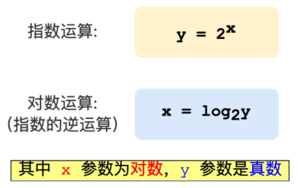    

那么对于底数为 2 的时候， 32 的对数是 5， 64 的对数是 6，计算过程如下：  

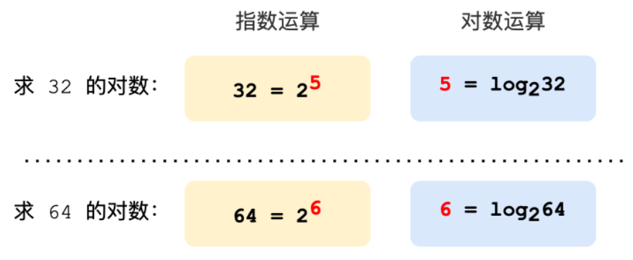

对数运算的取值是可以连续的，⽽离散对数的取值是不能连续的，因此也以离散得名，离散对数是在对数运算的基础上加了模运算，也就说取余数，对应编程语⾔的操作符是 %，也可以⽤ mod 表示。离散对数的概念如下图：  

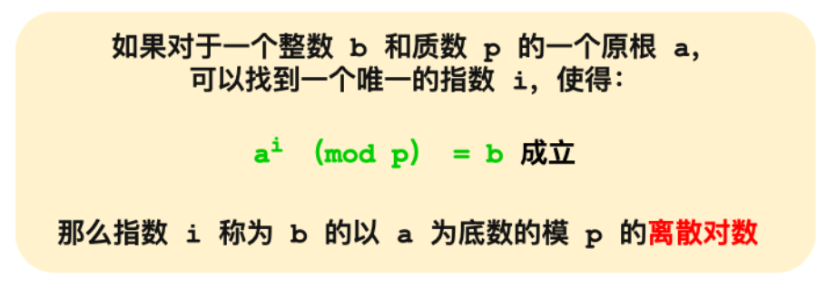

上图的，底数 a 和模数 p 是离散对数的公共参数，也就说是公开的， b 是真数， i 是对数。知道了对数，就可以⽤上⾯的公式计算出真数。但反过来，知道真数却很难推算出对数。  

特别是当模数 p 是⼀个很⼤的质数，即使知道底数 a 和真数 b ，在现有的计算机的计算⽔平是⼏乎⽆法算出离散对数的，这就是 DH 算法的数学基础。  

# DH 算法  

根据私钥⽣成的⽅式， DH 算法分为两种实现：  

- static DH 算法，这个是已经被废弃了  
- DHE 算法，现在常⽤的  

static DH 算法⾥有⼀⽅的私钥是静态的，也就说每次密钥协商的时候有⼀⽅的私钥都是⼀样的，⼀般是服务器⽅固定，即 a 不变，客户端的私钥则是随机⽣成的。  

于是， DH 交换密钥时就只有客户端的公钥是变化，⽽服务端公钥是不变的，那么随着时间延⻓，⿊客就会截获海量的密钥协商过程的数据，因为密钥协商的过程有些数据是公开的，⿊客就可以依据这些数据暴⼒破解出服务器的私钥，然后就可以计算出会话密钥了，于是之前截获的加密数据会被破解，所以 static DH 算法不具备前向安全性。  

既然固定⼀⽅的私钥有被破解的⻛险，那么⼲脆就让双⽅的私钥在每次密钥交换通信时，都是随机⽣成的、临时的，这个⽅式也就是 DHE 算法， E 全称是 ephemeral（临时性的）。 所以，即使有个⽜逼的⿊客破解了某⼀次通信过程的私钥，其他通信过程的私钥仍然是安全的，因为每个通信过程的私钥都是没有任何关系的，都是独⽴的，这样就保证了前向安全 。   

# ECDHE 算法  

DHE 算法由于计算性能不佳，因为需要做⼤量的乘法，为了提升 DHE 算法的性能，所以就出现了现在⼴泛⽤于密钥交换算法 —— ECDHE 算法。ECDHE 算法是在 DHE 算法的基础上利⽤了 ECC 椭圆曲线特性，可以⽤更少的计算量计算出公钥，以及最终的会话密钥。  

⼩红和⼩明使⽤ ECDHE 密钥交换算法的过程：  

- 双⽅事先确定好使⽤哪种椭圆曲线，和曲线上的基点 G，这两个参数都是公开的  
- 双⽅各⾃随机⽣成⼀个随机数作为私钥d，并与基点 G相乘得到公钥Q（Q = dG），此时⼩红的公私钥为 Q1 和 d1，⼩明的公私钥为 Q2 和 d2 
-  双⽅交换各⾃的公钥，最后⼩红计算点（x1， y1） = d1Q2，⼩明计算点（x2， y2） = d2Q1，由于椭圆曲线上是可以满⾜乘法交换和结合律，所以 d1Q2 = d1d2G = d2d1G = d2Q1 ，因此双⽅的 x 坐标是⼀样的，所以它是共享密钥，也就是会话密钥  

这个过程中，双⽅的私钥都是随机、临时⽣成的，都是不公开的，即使根据公开的信息（椭圆曲线、公钥、基点G）也是很难计算出椭圆曲线上的离散对数（私钥）。  

# ECDHE 握⼿过程  

ECDHE 密钥协商算法的 TSL 握⼿过程，可以看到是四次握⼿：  

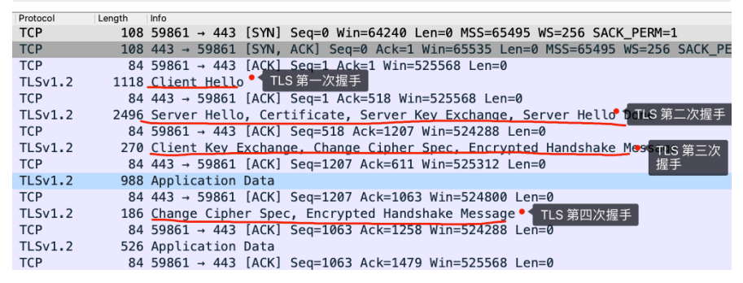

使⽤了 ECDHE，在 TLS 第四次握⼿前，客户端就已经发送了加密的 HTTP 数据，⽽对于 RSA 握⼿过程，必须要完成 TLS 四次握⼿，才能传输应⽤数据。  

## TLS 第⼀次握⼿  

客户端⾸先会发⼀个 Client Hello 消息，消息⾥⾯有客户端使⽤的 TLS 版本号、⽀持的密码套件列表，以及⽣成的随机数（Client Random）。  

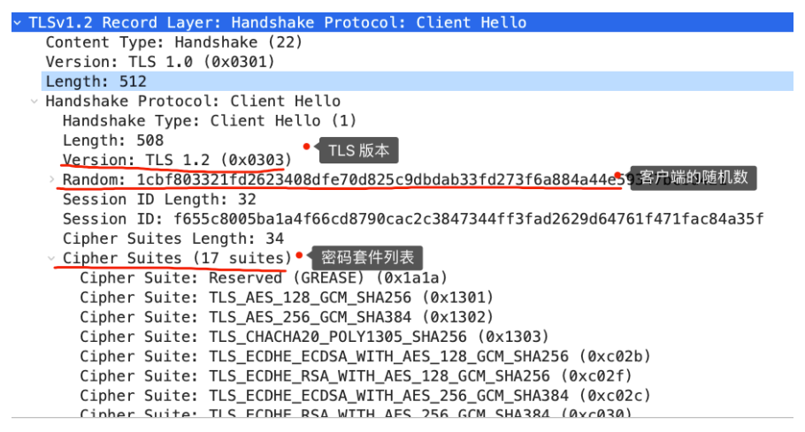

## TLS 第⼆次握⼿  

服务端收到客户端的打招呼，同样也要回礼，会返回 Server Hello 消息，消息⾯有服务器确认的 TLS 版本号，也给出了⼀个随机数（Server Random） ，然后从客户端的密码套件列表选择了⼀个合适的密码套件。  

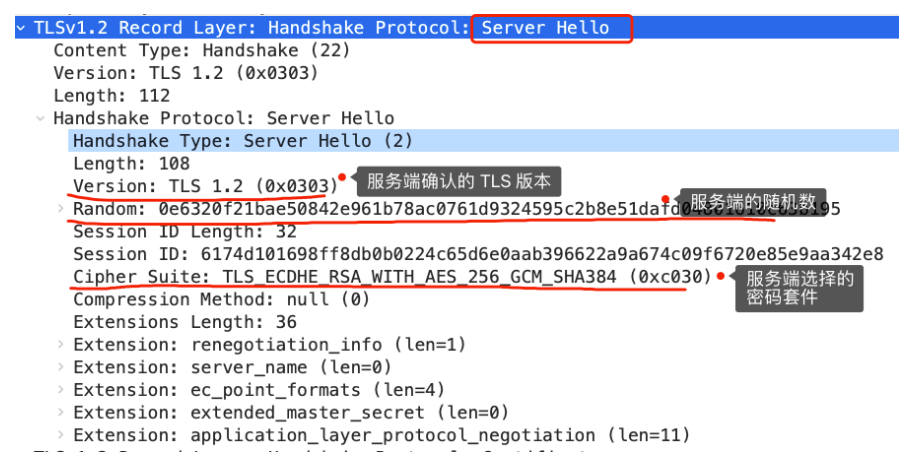

不过，这次选择的密码套件就和 RSA 不⼀样了，我们来分析⼀下这次的密码套件的意思。  

TLS_ECDHE_RSA_WITH_AES_256_GCM_SHA384  

- 密钥协商算法使⽤ ECDHE  
- 签名算法使⽤ RSA  
- 握⼿后的通信使⽤ AES 对称算法，密钥⻓度 256 位，分组模式是 GCM  
- 摘要算法使⽤ SHA384  

接着，服务端为了证明⾃⼰的身份，发送 Certificate 消息，会把证书也发给客户端。  

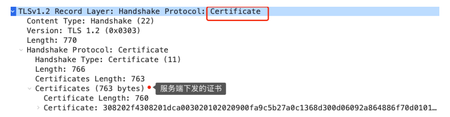

这⼀步就和 RSA 握⼿过程有很⼤到区别了，因为服务端选择了 ECDHE 密钥协商算法，所以会在发送完证书后，发送 Server Key Exchange 消息。  

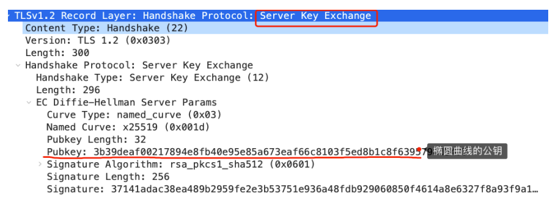

这个过程服务器做了三件事：  

- 选择了名为 named_curve 的椭圆曲线，选好了椭圆曲线相当于椭圆曲线基点 G 也定好了，这些都会公开给客户端  
- ⽣成随机数作为服务端椭圆曲线的私钥，保留到本地  
- 根据基点 G 和私钥计算出服务端的椭圆曲线公钥，这个会公开给客户端  

为了保证这个椭圆曲线的公钥不被第三⽅篡改，服务端会⽤ RSA 签名算法给服务端的椭圆曲线公钥做个签名。  

随后，就是 Server Hello Done 消息，服务端跟客户端表明： “这些就是我提供的信息，打招呼完毕”。  

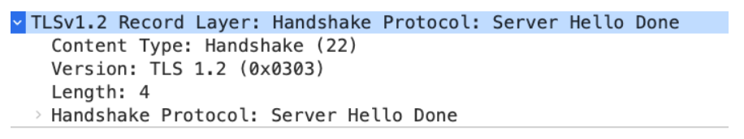

TLS 两次握⼿就已经完成了，⽬前客户端和服务端通过明⽂共享了这⼏个信息： Client Random、 Server Random 、使⽤的椭圆曲线、椭圆曲线基点 G、服务端椭圆曲线的公钥，这⼏个信息很重要，是后续⽣成会话密钥的材料。  

## TLS 第三次握⼿  

客户端收到了服务端的证书后，⾃然要校验证书是否合法，如果证书合法，那么服务端到身份就是没问题的。校验证书到过程，会⾛证书链逐级验证，确认证书的真实性，再⽤证书的公钥验证签名，这样就能确认服务端的身份了，确认⽆误后，就可以继续往下⾛。  

客户端会⽣成⼀个随机数作为客户端椭圆曲线的私钥，然后再根据服务端前⾯给的信息，⽣成客户端的椭圆曲线公钥，然后⽤ Client Key Exchange 消息发给服务端。  

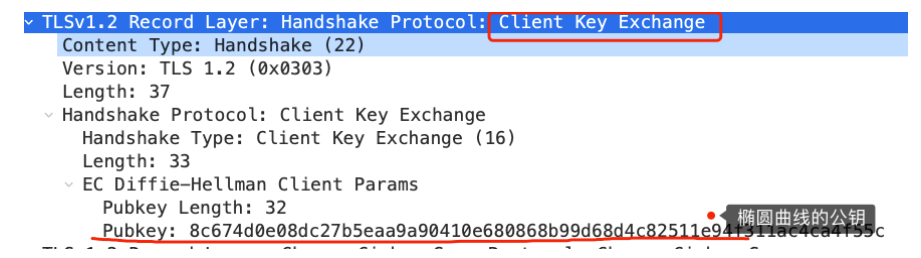

⾄此，双⽅都有对⽅的椭圆曲线公钥、⾃⼰的椭圆曲线私钥、椭圆曲线基点 G。于是，双⽅都就计算出点（x，y），其中 x 坐标值双⽅都是⼀样的，前⾯说 ECDHE 算法时候，说 x 是会话密钥， 但实际应⽤中， x 还不是最终的会话密钥。  

还记得 TLS 握⼿阶段，客户端和服务端都会⽣成了⼀个随机数传递给对⽅吗？  

最终的会话密钥，就是⽤客户端随机数 + 服务端随机数 + x（ECDHE 算法算出的共享密钥）三个材料⽣成的。之所以这么麻烦，是因为 TLS 设计者不信任客户端或服务器伪随机数的可靠性，为了保证真正的完全随机，把三个不可靠的随机数混合起来，那么随机的程度就⾮常⾼了，⾜够让⿊客计算出最终的会话密钥，安全性更⾼。    

算好会话密钥后，客户端会发⼀个 Change Cipher Spec 消息，告诉服务端后续改⽤对称算法加密通信。  

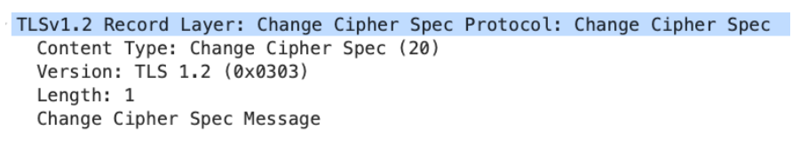

接着，客户端会发 Encrypted Handshake Message 消息，把之前发送的数据做⼀个摘要，再⽤对称密钥加密⼀下，让服务端做个验证，验证下本次⽣成的对称密钥是否可以正常使⽤。  

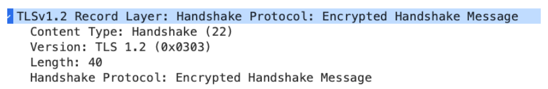

## TLS 第四次握⼿  

最后，服务端也会有⼀个同样的操作，发 Change Cipher Spec 和 Encrypted Handshake Message 消息，如果双⽅都验证加密和解密没问题，那么握⼿正式完成。于是，就可以正常收发加密的 HTTP 请求和响应了。  

## 总结  

RSA 和 ECDHE 握⼿过程的区别：  

- RSA 密钥协商算法不⽀持前向保密， ECDHE 密钥协商算法⽀持前向保密  
- 使⽤了 RSA 密钥协商算法， TLS 完成四次握⼿后，才能进⾏应⽤数据传输，⽽对于 ECDHE 算法，客户端可以不⽤等服务端的最后⼀次 TLS 握⼿，就可以提前发出加密的 HTTP 数据，节省了⼀个消息的往返时间
- 使⽤ ECDHE， 在 TLS 第 2 次握⼿中，会出现服务器端发出的 Server Key Exchange 消息，⽽ RSA 握⼿过程没有该消息  

