#  TLS 握⼿过程  

HTTP 由于是明⽂传输，所谓的明⽂，就是说客户端与服务端通信的信息都是⾁眼可⻅的，随意使⽤⼀个抓包⼯具都可以截获通信的内容。  

所以安全上存在以下三个⻛险：  

- 窃听⻛险，⽐如通信链路上可以获取通信内容  
- 篡改⻛险，⽐如强制植⼊垃圾⼴告，视觉污染  
- 冒充⻛险，⽐如冒充淘宝⽹站  

HTTPS 在 HTTP 与 TCP 层之间加⼊了 TLS 协议，来解决上述的⻛险。  

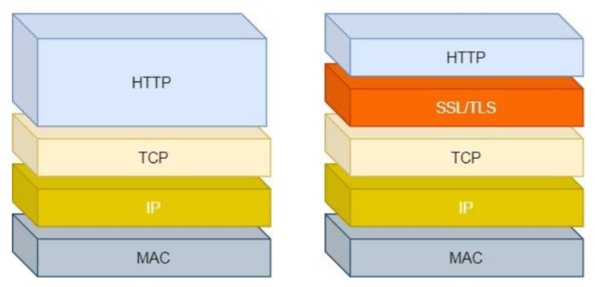

TLS 协议是如何解决 HTTP 的⻛险的：

- 信息加密： HTTP 交互信息是被加密的，第三⽅就⽆法被窃取  
- 校验机制：校验信息传输过程中是否有被第三⽅篡改过，如果被篡改过，则会有警告提示  
- 身份证书：证明淘宝是真的淘宝⽹  

可⻅，有了 TLS 协议，能保证 HTTP 通信是安全的了，那么在进⾏ HTTP 通信前，需要先进⾏ TLS 握⼿。 TLS 的握⼿过程：

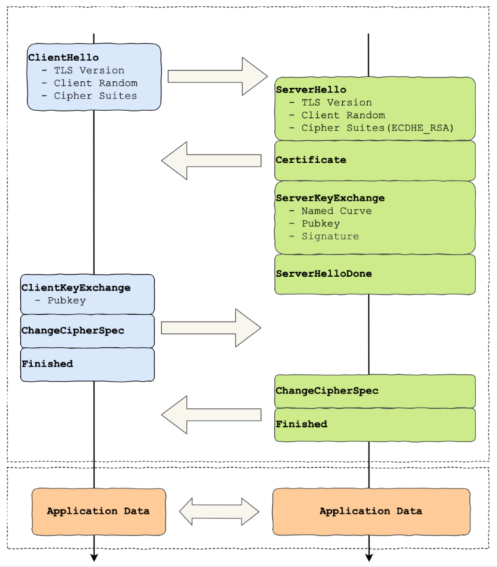

其中每⼀个框都是⼀个记录（record），记录是 TLS 收发数据的基本单位，类似于 TCP ⾥的 segment。多个记录可以组合成⼀个 TCP 包发送，所以通常经过四个消息就可以完成TLS 握⼿，也就是需要 2个 RTT 的时延，然后就可以在安全的通信环境⾥发送 HTTP 报⽂，实现 HTTPS 协议。

所以可以发现， HTTPS 是应⽤层协议，需要先完成 TCP 连接建⽴，然后⾛ TLS 握⼿过程后，才能建⽴通信安全的连接。  

事实上，不同的密钥交换算法， TLS 的握⼿过程可能会有⼀些区别。因为考虑到性能的问题，所以双⽅在加密应⽤信息时使⽤的是对称加密密钥，⽽对称加密密钥是不能被泄漏的，为了保证对称加密密钥的安全性，所以使⽤⾮对称加密的⽅式来保护对称加密密钥的协商，这个⼯作就是密钥交换算法负责的。    

# RSA 握⼿过程  

传统的 TLS 握⼿基本都是使⽤ RSA 算法来实现密钥交换的，在将 TLS 证书部署服务端时，证书⽂件中包含⼀对公私钥，其中公钥会在 TLS 握⼿阶段传递给客户端，私钥则⼀直留在服务端，⼀定要确保私钥不能被窃取。  

在 RSA 密钥协商算法中，客户端会⽣成随机密钥，并使⽤服务端的公钥加密后再传给服务端。根据⾮对称加密算法，公钥加密的消息仅能通过私钥解密，这样服务端解密后，双⽅就得到了相同的密钥，再⽤它加密应⽤消息。  

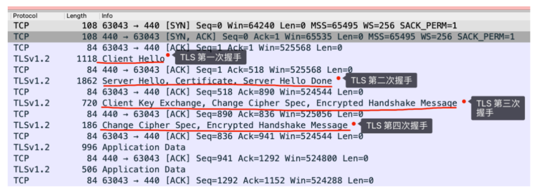

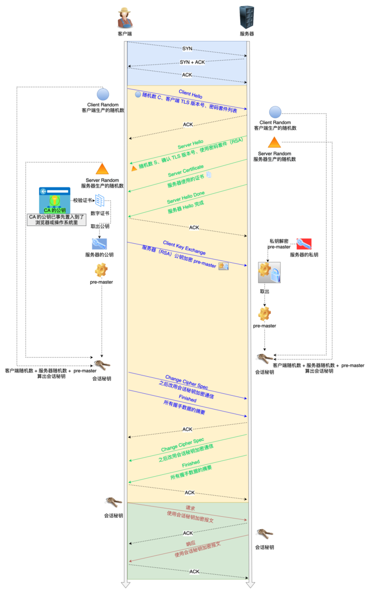

## TLS 第⼀次握⼿  

客户端⾸先会发⼀个 Client Hello 消息，字⾯意思我们也能理解到，这是跟服务器打招呼。  

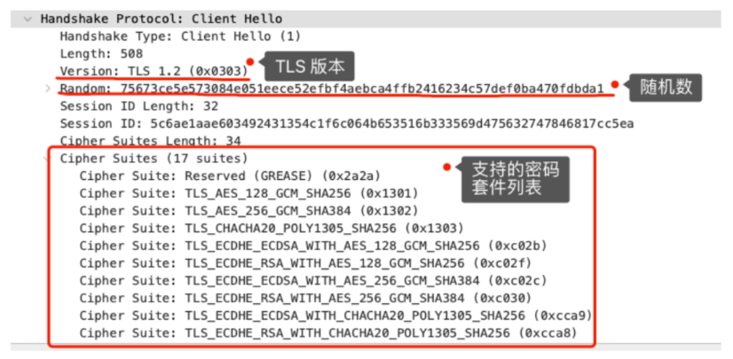

消息⾥⾯有客户端使⽤的 TLS 版本号、⽀持的密码套件列表，以及⽣成的随机数（Client Random） ，这个随机数会被服务端保留，它是⽣成对称加密密钥的材料之⼀。  

## TLS 第⼆次握⼿  

当服务端收到客户端的 Client Hello 消息后，会确认 TLS 版本号是否⽀持，和从密码套件列表中选择⼀个密码套件，以及⽣成随机数（Server Random） 。接着，返回 Server Hello 消息，消息⾥⾯有服务器确认的 TLS 版本号，也给出随机数（Server Random），从客户端的密码套件列表选择了⼀个合适的密码套件。  

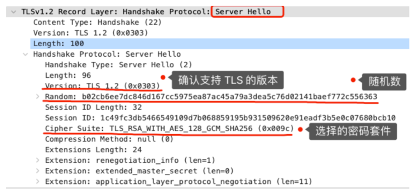

服务端选择的密码套件是 “Cipher Suite: TLS_RSA_WITH_AES_128_GCM_SHA256”。它是有固定格式和规范的。基本的形式是：

密钥交换算法 + 签名算法 + 对称加密算法 + 摘要算法

⼀般 WITH 单词前⾯有两个单词，第⼀个单词是约定密钥交换的算法，第⼆个单词是约定证书的验证算法。⽐如刚才的密码套件的意思就是：    

- 由于 WITH 单词只有⼀个 RSA，则说明握⼿时密钥交换算法和签名算法都是使⽤ RSA  
- 握⼿后的通信使⽤ AES 对称算法，密钥⻓度 128 位，分组模式是 GCM  
- 摘要算法 SHA384 ⽤于消息认证和产⽣随机数  

客户端和服务端就已确认了 TLS 版本和使⽤的密码套件，客户端和服务端都会各⾃⽣成⼀个随机数，并且还会把随机数传递给对⽅，其实这两个随机数是后续作为⽣成会话密钥的条件，所谓的会话密钥就是数据传输时，所使⽤的对称加密密钥。  

然后，服务端为了证明⾃⼰的身份，会发送 Server Certificate 给客户端，这个消息⾥含有数字证书  

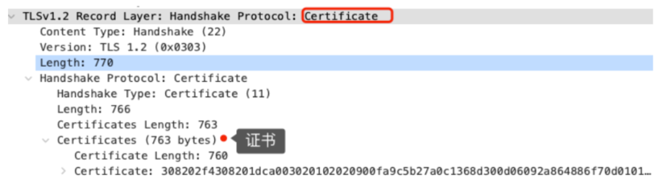

随后，服务端发了 Server Hello Done 消息，⽬的是告诉客户端，我已经把该给你的东⻄都给你了，本次打招呼完毕。  

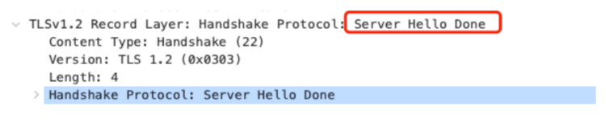

## 客户端验证证书  

### 数字证书和 CA 机构  

⼀个数字证书通常包含了：  

- 公钥
- 持有者信息
- 证书认证机构（CA）的信息
- CA 对这份⽂件的数字签名及使⽤的算法
- 证书有效期
- 还有⼀些其他额外信息

数字证书的作⽤是⽤来认证公钥持有者的身份，以防⽌第三⽅进⾏冒充。说简单些，证书就是⽤来告诉客户端，该服务端是否是合法的，因为只有证书合法，才代表服务端身份是可信的。  

为了让服务端的公钥被⼤家信任，服务端的证书都是由 CA （Certificate Authority，证书认证机构）签名的， CA 就是⽹络世界⾥的公安局、公证中⼼，具有极⾼的可信度，所以由它来给各个公钥签名，信任的⼀⽅签发的证书，那必然证书也是被信任的。之所以要签名，是因为签名的作⽤可以避免中间⼈在获取证书时对证书内容的篡改。    

### 数字证书签发和验证流程  

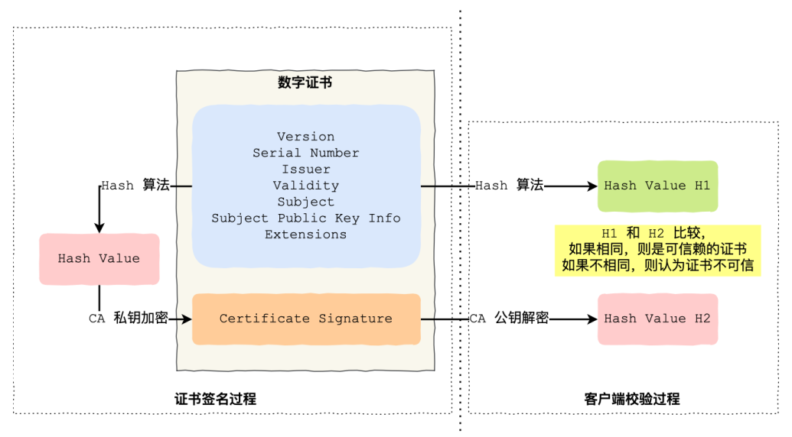

CA 签发证书的过程，如上图左边部分：  

- ⾸先 CA 会把持有者的公钥、⽤途、颁发者、有效时间等信息打成⼀个包，然后对这些信息进⾏ Hash 计算，得到⼀个 Hash 值
- 然后 CA 会使⽤⾃⼰的私钥将该 Hash 值加密，⽣成 Certificate Signature，也就是 CA 对证书做了签名
- 最后将 Certificate Signature 添加在⽂件证书上，形成数字证书  

客户端校验服务端的数字证书的过程，如上图右边部分：  

- ⾸先客户端会使⽤同样的 Hash 算法获取该证书的 Hash 值 H1  
- 通常浏览器和操作系统中集成了 CA 的公钥信息，浏览器收到证书后可以使⽤ CA 的公钥解密 Certificate Signature 内容，得到⼀个 Hash 值 H2
- 最后⽐较 H1 和 H2，如果值相同，则为可信赖的证书，否则则认为证书不可信  

### 证书链  

但事实上，证书的验证过程中还存在⼀个证书信任链的问题，因为我们向 CA 申请的证书⼀般不是根证书签发的，⽽是由中间证书签发的，⽐如百度的证书，从下图你可以看到，证书的层级有三级：  

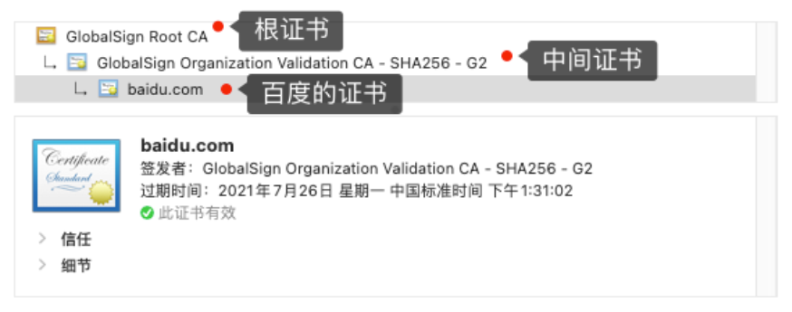

对于这种三级层级关系的证书的验证过程如下：  

- 客户端收到 baidu.com 的证书后，发现这个证书的签发者不是根证书，就⽆法根据本地已有的根证书中的公钥去验证 baidu.com 证书是否可信。于是，客户端根据 baidu.com 证书中的签发者，找到该证书的颁发机构是 “GlobalSign Organization Validation CA - SHA256 - G2”，然后向 CA 请求该中间证书
- 请求到证书后发现 “GlobalSign Organization Validation CA - SHA256 - G2” 证书是由 “GlobalSign Root CA”签发的，由于 “GlobalSign Root CA” 没有再上级签发机构，说明它是根证书，也就是⾃签证书。应⽤软件会检查此证书有否已预载于根证书清单上，如果有，则可以利⽤根证书中的公钥去验证 “GlobalSign Organization Validation CA - SHA256 - G2” 证书，如果发现验证通过，就认为该中间证书是可信的
- “GlobalSign Organization Validation CA - SHA256 - G2” 证书被信任后，可以使⽤ “GlobalSign Organization Validation CA - SHA256 - G2” 证书中的公钥去验证 baidu.com 证书的可信性，如果验证通过，就可以信任 baidu.com 证书   

最开始客户端只信任根证书 GlobalSign Root CA 证书的，然后 “GlobalSign Root CA” 证书信任“GlobalSign Organization Validation CA - SHA256 - G2” 证书，⽽ “GlobalSign Organization Validation CA -SHA256 - G2” 证书⼜信任 baidu.com 证书，于是客户端也信任 baidu.com 证书。  

总括来说，由于⽤户信任 GlobalSign，所以由 GlobalSign 所担保的 baidu.com 可以被信任，另外由于⽤户信任操作系统或浏览器的软件商，所以由软件商预载了根证书的 GlobalSign 都可被信任。  

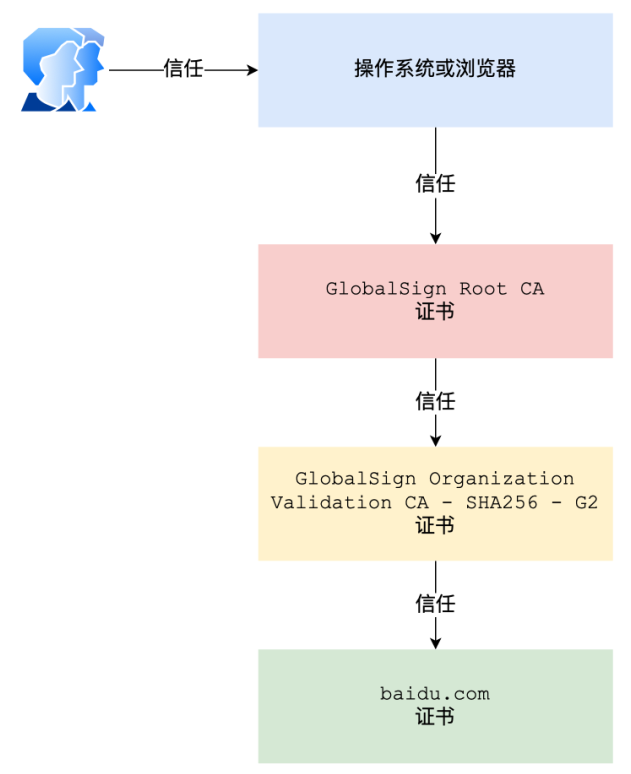

操作系统⾥⼀般都会内置⼀些根证书。

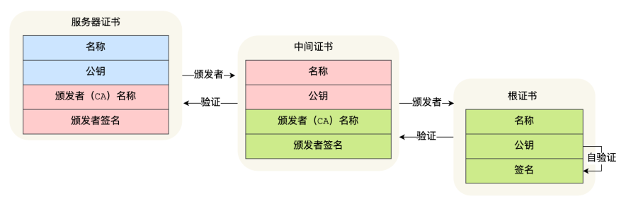

Root CA 为什么不直接颁发证书，⽽是要搞那么多中间层级呢？这是为了确保根证书的绝对安全性，将根证书隔离地越严格越好，不然根证书如果失守了，那么整个信任链都会有问题。    

## TLS 第三次握⼿  

客户端验证完证书后，认为可信则继续往下⾛。接着，客户端就会⽣成⼀个新的随机数 (pre-master)，⽤服务器的 RSA 公钥加密该随机数，通过 Change Cipher Key Exchange 消息传给服务端。  

服务端收到后，⽤ RSA 私钥解密，得到客户端发来的随机数 (pre-master)。⾄此， 客户端和服务端双⽅都共享了三个随机数，分别是 Client Random、 Server Random、 pre-master。于是，双⽅根据已经得到的三个随机数，⽣成会话密钥（Master Secret） ，它是对称密钥，⽤于对后续的 HTTP 请求/响应的数据加解密。      

⽣成完会话密钥后，然后客户端发⼀个 Change Cipher Spec，告诉服务端开始使⽤加密⽅式发送消息。  

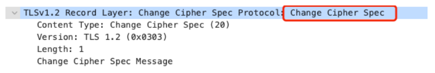

然后，客户端再发⼀个 Encrypted Handshake Message（Finishd） 消息，把之前所有发送的数据做个摘要，再⽤会话密钥（master secret）加密⼀下，让服务器做个验证，验证加密通信是否可⽤和之前握⼿信息是否有被中途篡改过。  

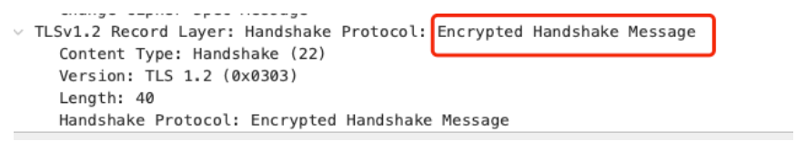

可以发现，Change Cipher Spec 之前传输的 TLS 握⼿数据都是明⽂，之后都是对称密钥加密的密⽂。  

## TLS 第四次握⼿  

服务器也是同样的操作，发 Change Cipher Spec 和 Encrypted Handshake Message 消息，如果双⽅都验证加密和解密没问题，那么握⼿正式完成。  

最后，就⽤会话密钥加解密 HTTP 请求和响应了。  

## RSA 算法的缺陷  

使⽤ RSA 密钥协商算法的最⼤问题是不⽀持前向保密。因为客户端传递随机数（⽤于⽣成对称加密密钥的条件之⼀）给服务端时使⽤的是公钥加密的，服务端收到到后，会⽤私钥解密得到随机数。所以⼀旦服务端的私钥泄漏了，过去被第三⽅截获的所有 TLS 通讯密⽂都会被破解。  

为了解决这⼀问题，于是就有了 DH 密钥协商算法，这⾥简单介绍它的⼯作流程。  

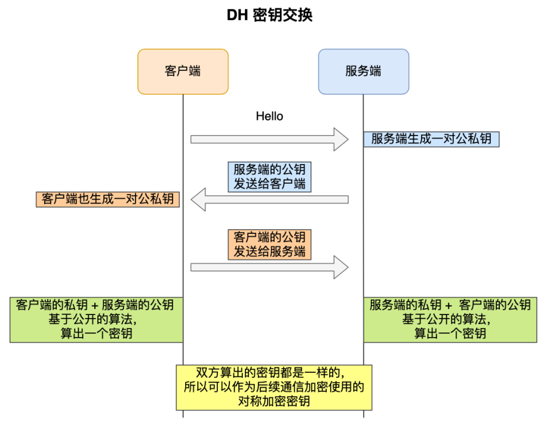

客户端和服务端各⾃会⽣成随机数，并以此作为私钥，然后根据公开的 DH 计算公示算出各⾃的公钥，通过 TLS 握⼿双⽅交换各⾃的公钥，这样双⽅都有⾃⼰的私钥和对⽅的公钥，然后双⽅根据各⾃持有的材料算出⼀个随机数，这个随机数的值双⽅都是⼀样的，这就可以作为后续对称加密时使⽤的密钥。  

DH 密钥交换过程中， 即使第三⽅截获了 TLS 握⼿阶段传递的公钥，在不知道的私钥的情况下，也是⽆法计算出密钥的，⽽且每⼀次对称加密密钥都是实时⽣成的，实现前向保密。  

但因为 DH 算法的计算效率问题，后⾯出现了 ECDHE 密钥协商算法，我们现在⼤多数⽹站使⽤的正是 ECDHE 密钥协商算法。
