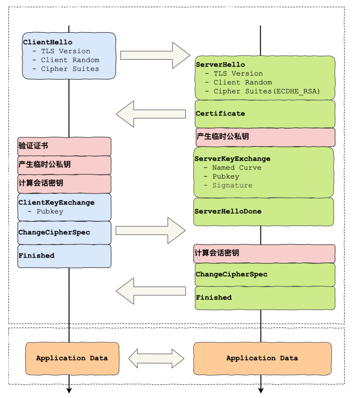
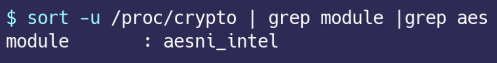
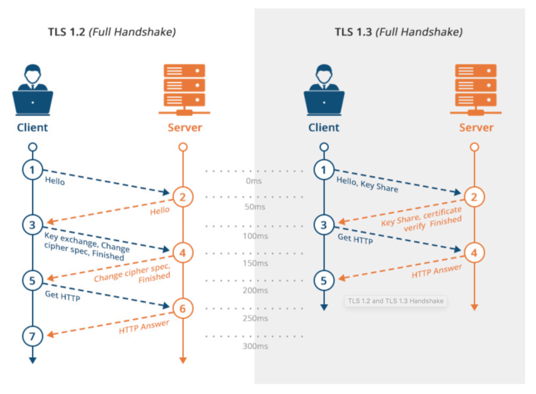
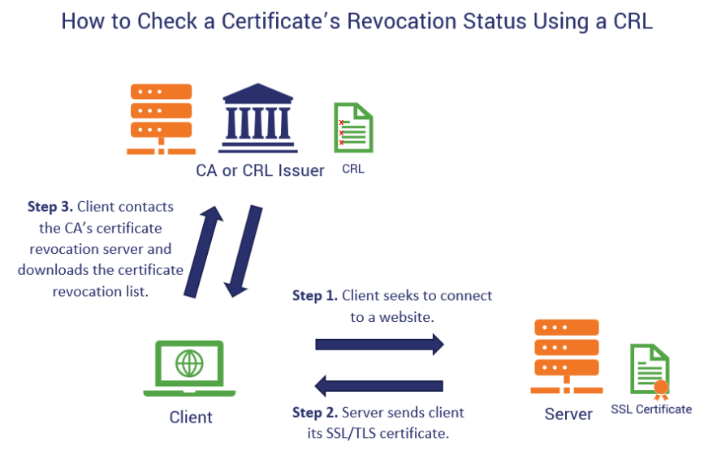
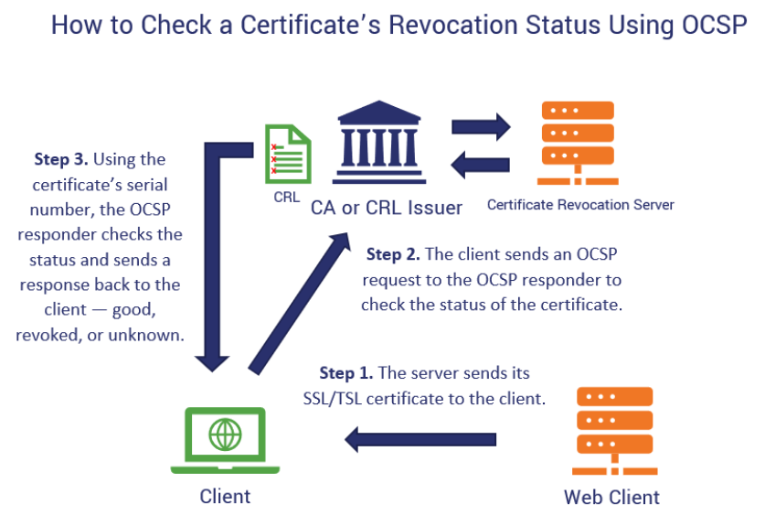
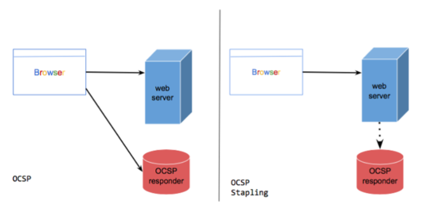
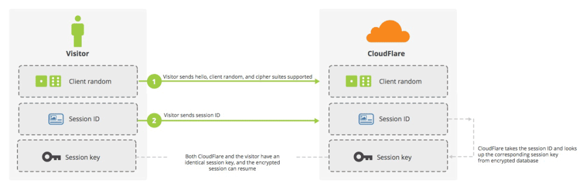
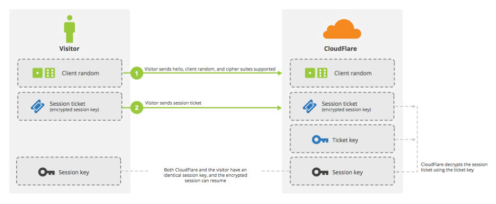
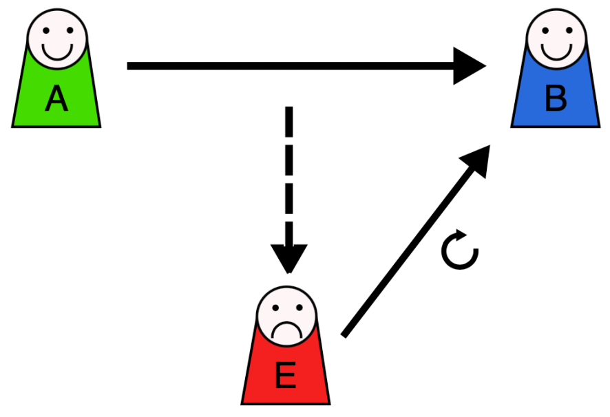
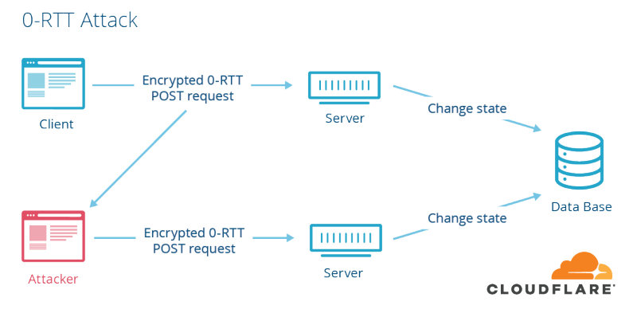

# 分析性能损耗  

产⽣性能消耗的两个环节：  

- 第⼀个环节， TLS 协议握⼿过程  
- 第⼆个环节，握⼿后的对称加密报⽂传输  

对于第⼆环节，现在主流的对称加密算法 AES、 ChaCha20 性能都是不错的，⽽且⼀些 CPU ⼚商还针对它们做了硬件级别的优化，因此这个环节的性能消耗可以说⾮常地⼩。

第⼀个环节， TLS 协议握⼿过程不仅增加了⽹络延时（最⻓可以花费掉 2 RTT），⽽且握⼿过程中的⼀些步骤也会产⽣性能损耗，⽐如：  

- 对于 ECDHE 密钥协商算法，握⼿过程中会客户端和服务端都需要临时⽣成椭圆曲线公私钥  
- 客户端验证证书时，会访问 CA 获取 CRL 或者 OCSP，⽬的是验证服务器的证书是否有被吊销  
- 双⽅计算 Pre-Master，也就是对称加密密钥  

# 硬件优化  

HTTPS 协议是计算密集型，⽽不是 I/O 密集型，⼀个好的 CPU，可以提⾼计算性能，因为 HTTPS 连接过程中就有⼤量需要计算密钥的过程，所以这样可以加速 TLS 握⼿过程。  

另外，如果可以，应该选择可以⽀持 AES-NI 特性的 CPU，因为这种款式的 CPU 能在指令级别优化了 AES 算法，这样便加速了数据的加解密传输过程。  

Linux 系统可以使⽤下⾯这⾏命令查看 CPU 是否⽀持 AES-NI 指令集：  

如果我们的 CPU ⽀持 AES-NI 特性，那么对于对称加密的算法应该选择 AES 算法。否则可以选择 ChaCha20 对称加密算法，因为 ChaCha20 算法的运算指令相⽐ AES 算法会对 CPU 更友好⼀点。  

# 软件优化  

软件的优化⽅向可以分层两种，⼀个是软件升级，⼀个是协议优化。  

软件升级就是将正在使⽤的软件升级到最新版本，因为最新版本不仅提供了最新的特性，也优化了以前软件的问题或性能。  

## 协议优化  

协议的优化就是对密钥交换过程进⾏优化。  

### 密钥交换算法优化  

TLS 1.2 版本如果使⽤的是 RSA 密钥交换算法，那么需要 4 次握⼿，也就是要花费 2 RTT，才可以进⾏应⽤数据的传输，⽽且 RSA 密钥交换算法不具备前向安全性。总之使⽤ RSA 密钥交换算法的 TLS 握⼿过程，不仅慢，⽽且安全性也不⾼。    

因此如果可以，尽量选⽤ ECDHE 密钥交换算法替换 RSA 算法，因为该算法由于⽀持 Fast Start，它是“抢跑”的意思，客户端可以在 TLS 协议的第 3 次握⼿后，第 4 次握⼿前，发送加密的应⽤数据，以此将 TLS 握⼿的消息往返由 2 RTT 减少到 1 RTT，⽽且安全性也⾼，具备前向安全性。  

ECDHE 算法是基于椭圆曲线实现的，不同的椭圆曲线性能也不同，应该尽量选择 x25519 曲线，该曲线是⽬前最快的椭圆曲线。  

对于对称加密算法⽅⾯，如果对安全性不是特别⾼的要求，可以选⽤ AES_128_GCM，它⽐ AES_256_GCM 快⼀些，因为密钥的⻓度短⼀些。  

### TLS 升级  

如果可以，直接把 TLS 1.2 升级成 TLS 1.3， TLS 1.3 ⼤幅度简化了握⼿的步骤， 完成 TLS 握⼿只要 1 RTT，⽽且安全性更⾼。  

在 TLS 1.2 的握⼿中，⼀般是需要 4 次握⼿，先要通过 Client Hello （第 1 次握⼿）和 Server Hello（第 2 次握⼿） 消息协商出后续使⽤的加密算法，再互相交换公钥（第 3 和 第 4 次握⼿），然后计算出最终的会话密钥：

可以发现 TLS 1.3 把 Hello 和公钥交换这两个消息合并成了⼀个消息，于是这样就减少到只需 1 RTT 就能完成 TLS 握⼿。  

客户端在 Client Hello 消息⾥带上了⽀持的椭圆曲线，以及这些椭圆曲线对应的公钥。  

服务端收到后，选定⼀个椭圆曲线等参数，然后返回消息时，带上服务端这边的公钥。经过这 1 个 RTT，双⽅⼿上已经有⽣成会话密钥的材料了，于是客户端计算出会话密钥，就可以进⾏应⽤数据的加密传输了。  

TLS1.3 对密码套件进⾏“减肥”了，对于密钥交换算法，废除了不⽀持前向安全性的 RSA 和 DH 算法，只⽀持 ECDHE 算法。  

对于对称加密和签名算法，只⽀持⽬前最安全的⼏个密码套件，⽐如 openssl 中仅⽀持下⾯ 5 种密码套件：  

- TLS_AES_256_GCM_SHA384  
- TLS_CHACHA20_POLY1305_SHA256  
- TLS_AES_128_GCM_SHA256  
- TLS_AES_128_CCM_8_SHA256  
- TLS_AES_128_CCM_SHA256  

之所以 TLS1.3 仅⽀持这么少的密码套件，是因为 TLS1.2 由于⽀持各种古⽼且不安全的密码套件，中间⼈可以利⽤降级攻击，伪造客户端的 Client Hello 消息，替换客户端⽀持的密码套件为⼀些不安全的密码套件，使得服务器被迫使⽤这个密码套件进⾏ HTTPS 连接，从⽽破解密⽂。  

# 证书优化  

- ⼀个是证书传输  
- ⼀个是证书验证  

## 证书传输优化  

要让证书更便于传输，那必然是减少证书的⼤⼩，这样可以节约带宽，也能减少客户端的运算量。所以， 对于服务器的证书应该选择椭圆曲线（ECDSA）证书，⽽不是 RSA 证书，因为在相同安全强度下， ECC 密钥⻓度⽐ RSA 短的多。  

## 证书验证优化  

客户端在验证证书时，是个复杂的过程，会⾛证书链逐级验证，验证的过程不仅需要⽤ CA 公钥解密证书以及⽤签名算法验证证书的完整性，⽽且为了知道证书是否被 CA 吊销，客户端有时还会再去访问 CA， 下载 CRL 或者 OCSP 数据，以此确认证书的有效性。这个访问过程是 HTTP 访问，因此⼜会产⽣⼀系列⽹络通信的开销，如 DNS 查询、建⽴连接、收发数据等。  

### CRL  

CRL 称为证书吊销列表（Certificate Revocation List），这个列表是由 CA 定期更新，列表内容都是被撤销信任的证书序号，如果服务器的证书在此列表，就认为证书已经失效，不在的话，则认为证书是有效的。  

但是 CRL 存在两个问题：  

- 第⼀个问题，由于 CRL 列表是由 CA 维护的，定期更新，如果⼀个证书刚被吊销后，客户端在更新 CRL 之前还是会信任这个证书， 实时性较差  
- 第⼆个问题， 随着吊销证书的增多，列表会越来越⼤，下载的速度就会越慢，下载完客户端还得遍历这么⼤的列表，那么就会导致客户端在校验证书这⼀环节的延时很⼤，进⽽拖慢了 HTTPS 连接  

### OCSP  

现在基本都是使⽤ OCSP ，名为在线证书状态协议（Online Certificate Status Protocol）来查询证书的有效性，它的⼯作⽅式是向 CA 发送查询请求，让 CA 返回证书的有效状态。  

不必像 CRL ⽅式客户端需要下载⼤⼤的列表还要从列表查询，同时因为可以实时查询每⼀张证书的有效性，解决了 CRL 的实时性问题。  

OCSP 需要向 CA 查询，因此也是要发⽣⽹络请求，⽽且还得看 CA 服务器的“脸⾊”，如果⽹络状态不好，或者CA 服务器繁忙，也会导致客户端在校验证书这⼀环节的延时变⼤。  

### OCSP Stapling  

为了解决这⼀个⽹络开销，就出现了 OCSP Stapling，其原理是：服务器向 CA 周期性地查询证书状态，获得⼀个带有时间戳和签名的响应结果并缓存它。  

当有客户端发起连接请求时，服务器会把这个响应结果在 TLS 握⼿过程中发给客户端。由于有签名的存在，服务器⽆法篡改，因此客户端就能得知证书是否已被吊销了，这样客户端就不需要再去查询。  

# 会话复⽤  

TLS 握⼿的⽬的就是为了协商出会话密钥，也就是对称加密密钥，那我们如果我们把⾸次 TLS 握⼿协商的对称加密密钥缓存起来，待下次需要建⽴ HTTPS 连接时，直接复⽤这个密钥，不就减少 TLS 握⼿的性能损耗了吗？  

这种⽅式就是会话复⽤（TLS session resumption），会话复⽤分两种：  

- 第⼀种叫 Session ID  
- 第⼆种叫 Session Ticket  

## Session ID  

Session ID 的⼯作原理是， 客户端和服务器⾸次 TLS 握⼿连接后，双⽅会在内存缓存会话密钥，并⽤唯⼀的 Session ID 来标识， Session ID 和会话密钥相当于 key-value 的关系。  

当客户端再次连接时， hello 消息⾥会带上 Session ID，服务器收到后就会从内存找，如果找到就直接⽤该会话密钥恢复会话状态，跳过其余的过程，只⽤⼀个消息往返就可以建⽴安全通信。当然为了安全性，内存中的会话密钥会定期失效。  

但是它有两个缺点：  

- 服务器必须保持每⼀个客户端的会话密钥，随着客户端的增多， 服务器的内存压⼒也会越⼤  
- 现在⽹站服务⼀般是由多台服务器通过负载均衡提供服务的， 客户端再次连接不⼀定会命中上次访问过的服务器，于是还要⾛完整的 TLS 握⼿过程  

## Session Ticket  

为了解决 Session ID 的问题，就出现了 Session Ticket， 服务器不再缓存每个客户端的会话密钥，⽽是把缓存的⼯作交给了客户端，类似于 HTTP 的 Cookie。  

客户端与服务器⾸次建⽴连接时，服务器会加密会话密钥作为 Ticket 发给客户端，交给客户端缓存该 Ticket。

客户端再次连接服务器时，客户端会发送 Ticket，服务器解密后就可以获取上⼀次的会话密钥，然后验证有效期，如果没问题，就可以恢复会话了，开始加密通信。  

对于集群服务器的话， 要确保每台服务器加密会话密钥的密钥是⼀致的，这样客户端携带 Ticket 访问任意⼀台服务器时都能恢复会话。  

Session ID 和 Session Ticket 都不具备前向安全性，因为⼀旦加密会话密钥的密钥被破解或者服务器泄漏会话密钥，前⾯劫持的通信密⽂都会被破解。  

同时应对重放攻击也很困难，这⾥简单介绍下重放攻击⼯作的原理：

假设 Alice 想向 Bob 证明⾃⼰的身份。 Bob 要求 Alice 的密码作为身份证明，爱丽丝应尽全⼒提供（可能是在经过如哈希函数的转换之后）。与此同时， Eve 窃听了对话并保留了密码（或哈希）。交换结束后， Eve（冒充 Alice ）连接到 Bob。当被要求提供身份证明时， Eve 发送从 Bob 接受的最后⼀个会话中读取的 Alice 的密码（或哈希），从⽽授予 Eve 访问权限。    

重放攻击的危险之处在于，如果中间⼈截获了某个客户端的 Session ID 或 Session Ticket 以及 POST 报⽂，⼀般 POST 请求会改变数据库的数据，中间⼈就可以利⽤此截获的报⽂，不断向服务器发送该报⽂，这样会导致数据库的数据被中间⼈改变了，⽽客户是不知情的。  

避免重放攻击的⽅式就是需要对会话密钥设定⼀个合理的过期时间。  

## Pre-shared Key  

前⾯的 Session ID 和 Session Ticket ⽅式都需要在 1 RTT 才能恢复会话。  

⽽ TLS1.3 更为⽜逼，对于重连 TLS1.3 只需要 0 RTT，原理和 Ticket 类似，只不过在重连时，客户端会把 Ticket 和 HTTP 请求⼀同发送给服务端，这种⽅式叫 Pre-shared Key。  

同样的， Pre-shared Key 也有重放攻击的危险。  

假设中间⼈通过某种⽅式，截获了客户端使⽤会话重⽤技术的 POST 请求，通常 POST 请求是会改变数据库的数据，然后中间⼈就可以把截获的这个报⽂发送给服务器，服务器收到后，也认为是合法的，于是就恢复会话，致使数据库的数据⼜被更改，但是此时⽤户是不知情的。  

所以，应对重放攻击可以给会话密钥设定⼀个合理的过期时间，以及只针对安全的 HTTP 请求如 GET/HEAD 使⽤会话重⽤。  

# 总结  

对于硬件优化的⽅向，因为 HTTPS 是属于计算密集型，应该选择计算⼒更强的 CPU，⽽且最好选择⽀持 AES-NI 特性的 CPU，这个特性可以在硬件级别优化 AES 对称加密算法，加快应⽤数据的加解密。  

对于软件优化的⽅向，如果可以，把软件升级成较新的版本，⽐如将 Linux 内核 2.X 升级成 4.X，将 openssl 1.0.1 升级到 1.1.1，因为新版本的软件不仅会提供新的特性，⽽且还会修复⽼版本的问题。  

对于协议优化的⽅向：  

- 密钥交换算法应该选择 ECDHE 算法，⽽不⽤ RSA 算法，因为 ECDHE 算法具备前向安全性，⽽且客户端可以在第三次握⼿之后，就发送加密应⽤数据，节省了 1 RTT  
- 将 TSL1.2 升级 TSL1.3，因为 TSL1.3 的握⼿过程只需要 1 RTT，⽽且安全性更强  

对于证书优化的⽅向：  

- 服务器应该选⽤ ECDSA 证书，⽽⾮ RSA 证书，因为在相同安全级别下， ECC 的密钥⻓度⽐ RSA 短很多，这样可以提⾼证书传输的效率  
- 服务器应该开启 OCSP Stapling 功能，由服务器预先获得 OCSP 的响应，并把响应结果缓存起来，这样TLS 握⼿的时候就不⽤再访问 CA 服务器，减少了⽹络通信的开销，提⾼了证书验证的效率  

对于重连 HTTPS 时，我们可以使⽤⼀些技术让客户端和服务端使⽤上⼀次 HTTPS 连接使⽤的会话密钥，直接恢复会话，⽽不⽤再重新⾛完整的 TLS 握⼿过程。  

常⻅的会话重⽤技术有 Session ID 和 Session Ticket，⽤了会话重⽤技术，当再次重连 HTTPS 时，只需要 1 RTT 就可以恢复会话。对于 TLS1.3 使⽤ Pre-shared Key 会话重⽤技术，只需要 0 RTT 就可以恢复会话。  

这些会话重⽤技术虽然好⽤，但是存在⼀定的安全⻛险，它们不仅不具备前向安全，⽽且有重放攻击的⻛险，所以应当对会话密钥设定⼀个合理的过期时间。  