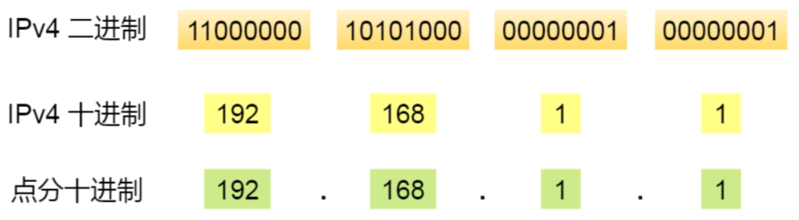
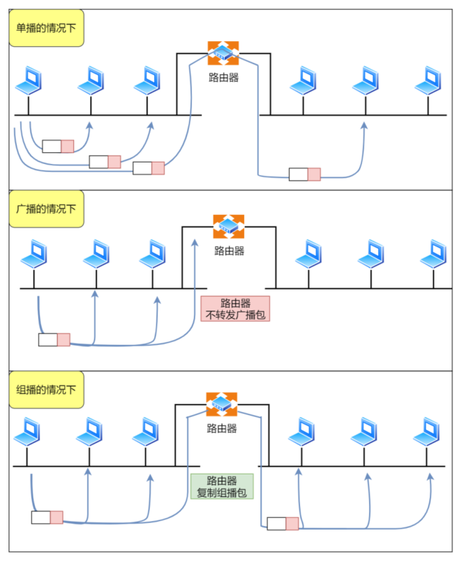
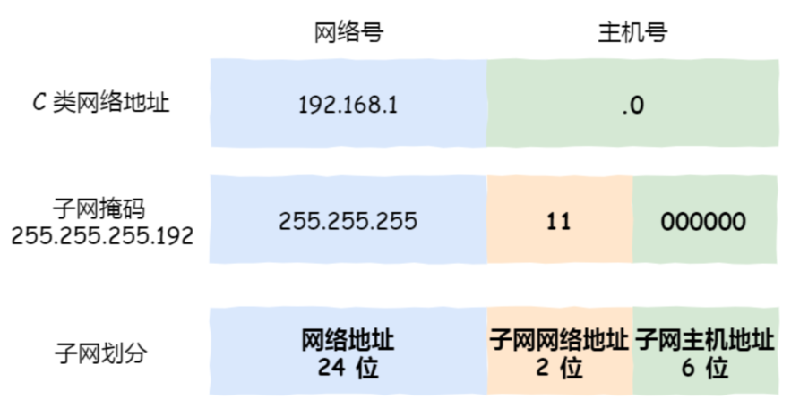

# IP 基本认识  

⽹络层的主要作⽤是： 实现主机与主机之间的通信，也叫点对点（end to end）通信。  

⽹络层与数据链路层的关系：MAC （数据链路层）的作⽤则是实现直连的两个设备之间通信，⽽ IP（⽹络层） 则负责在没有直连的两个⽹络之间进⾏通信传输。  


# IP 地址  

## IPv4 的表示

IP 地址（IPv4 地址）由 32 位正整数来表示， IP 地址在计算机是以⼆进制的⽅式处理的。为了⽅便记忆采⽤了点分⼗进制的标记⽅式：



IP 地址最⼤值也就是：2^32 ≈ 42 亿

## IPv4 的分类

IP 地址分类成了 5 种类型，分别是 A 类、 B 类、 C 类、 D 类、 E 类：


### A、B、C 类地址  

A、 B、 C 类主要分为两个部分，分别是⽹络号和主机号：


最⼤主机个数，就是要看主机号的位数，如 C 类地址的主机号占 8 位，那么 C 类地址的最⼤主机个数：2 ^ 8 -2 = 254。

在 IP 地址中，有两个 IP 是特殊的，分别是主机号全为 1 和 全为 0 地址，在分配过程中，应该去掉这两种情况  ：

- 主机号全为 1 指定某个⽹络下的所有主机，⽤于⼴播  
- 主机号全为 0 指定某个⽹络  


### ⼴播地址的作用

⼴播地址⽤于在同⼀个链路中相互连接的主机之间发送数据包。  

⼴播地址可以分为本地⼴播和直接⼴播两种：

- 在本⽹络内⼴播的叫做本地⼴播
- 在不同⽹络之间的⼴播叫做直接⼴播

⽹络地址为 192.168.0.0/24 的情况下，⼴播地址是 192.168.0.255 。因为这个⼴播地址的 IP 包会被路由器屏蔽，所以不会到达 192.168.0.0/24 以外的其他链路上  


⽹络地址为 192.168.0.0/24 的主机向 192.168.1.255/24 的⽬标地址发送 IP 包。收到这个包的路由器，将数据转发给 192.168.1.0/24，从⽽使得所有192.168.1.1~192.168.1.254 的主机都能收到这个包（由于直接⼴播有⼀定的安全问题，多数情况下会在路由器上设置为不转发。） 


### D、E 类地址  

D 类和 E 类地址是没有主机号的，所以不可⽤于主机 IP， D 类常被⽤于多播， E 类是预留的分类，暂时未使⽤。  


###  多播地址的作用

多播⽤于将包发送给特定组内的所有主机。  

由于⼴播⽆法穿透路由，若想给其他⽹段发送同样的包，就可以使⽤可以穿透路由的多播。  



多播使⽤的 D 类地址，其前四位是 1110 就表示是多播地址，⽽剩下的 28 位是多播的组编号。  

从 224.0.0.0 ~ 239.255.255.255 都是多播的可⽤范围，其划分为以下三类：  

- 224.0.0.0 ~ 224.0.0.255 为预留的组播地址，只能在局域⽹中，路由器是不会进⾏转发的  
- 224.0.1.0 ~ 238.255.255.255 为⽤户可⽤的组播地址，可以⽤于 Internet 上  
- 239.0.0.0 ~ 239.255.255.255 为本地管理组播地址，可供内部⽹在内部使⽤，仅在特定的本地范围内有效  

### IP 分类的优缺点

优点：简单明了、选路（基于⽹络地址）简单  

缺点：

- 同⼀⽹络下没有地址层次  
- 不能很好的与现实⽹络匹配，C 类地址能包含的最⼤主机数量实在太少了，只有 254 个，⽽ B 类地址能包含的最⼤主机数量⼜太多了， 6 万多台机器放在⼀个⽹络下⾯  

### ⽆分类地址 CIDR  

这种⽅式不再有分类地址的概念， 32 ⽐特的 IP 地址被划分为两部分，前⾯是⽹络号，后⾯是主机号。  

表示形式：

```
a.b.c.d/x 
```

- `/x` 表示前 x 位属于⽹络号， x 的范围是 0 ~ 32 ，这就使得 IP 地址更加具有灵活性

⽐如 10.100.122.2/24，这种地址表示形式就是 CIDR， /24 表示前 24 位是⽹络号，剩余的 8 位是主机号：


### ⼦⽹掩码

掩码的意思就是掩盖掉主机号，剩余的就是⽹络号。  将⼦⽹掩码和 IP 地址按位计算 AND，就可得到⽹络号。  


#### 分离⽹络号和主机号  

两台计算机要通讯，⾸先要判断是否处于同⼀个⼴播域内，即⽹络地址是否相同。如果⽹络地址相同，表明接受⽅在本⽹络上，那么可以把数据包直接发送到⽬标主机。  

路由器寻址⼯作中，也就是通过这样的⽅式来找到对应的⽹络号的，进⽽把数据包转发给对应的⽹络内。  


#### ⼦⽹划分  

⼦⽹掩码还有⼀个作⽤，那就是划分⼦⽹。⼦⽹划分实际上是将主机地址分为两个部分：⼦⽹⽹络地址和⼦⽹主机地址。

- 未做⼦⽹划分的 ip 地址：⽹络地址＋主机地址  
- 做⼦⽹划分后的 ip 地址：⽹络地址＋（⼦⽹⽹络地址＋⼦⽹主机地址）  


假设对 C 类地址进⾏⼦⽹划分，⽹络地址 192.168.1.0，使⽤⼦⽹掩码 255.255.255.192 对其进⾏⼦⽹划分：



由于⼦⽹⽹络地址被划分成 2 位，那么⼦⽹地址就有 4 个，分别是 00、 01、 10、 11，具体划分如下：


## 公有 IP 地址与私有 IP 地址  

在 A、 B、 C 分类地址，实际上有分公有 IP 地址和私有 IP 地址：


## IP 地址与路由控制  

IP地址的⽹络地址这⼀部分是⽤于进⾏路由控制。  

路由控制表中记录着⽹络地址与下⼀步应该发送⾄路由器的地址。在主机和路由器上都会有各⾃的路由器控制表。  

在发送 IP 包时，⾸先要确定 IP 包⾸部中的⽬标地址，再从路由控制表中找到与该地址具有相同⽹络地址的记录，根据该记录将 IP 包转发给相应的下⼀个路由器。如果路由控制表中存在多条相同⽹络地址的记录，就选择相同位数最多的⽹络地址，也就是最⻓匹配。  


- 主机 A 要发送⼀个 IP 包，其源地址是 10.1.1.30 和⽬标地址是 10.1.2.10 ，由于没有在主机 A 的路由表找到与⽬标地址 10.1.2.10 的⽹络地址，于是包被转发到默认路由（路由器 1 ）  
- 路由器 1 收到 IP 包后，也在路由器 1 的路由表匹配与⽬标地址相同的⽹络地址记录，发现匹配到了，于是就把 IP 数据包转发到了 10.1.0.2 这台路由器 2  
- 路由器 2 收到后，同样对⽐⾃身的路由表，发现匹配到了，于是把 IP 包从路由器 2 的 10.1.2.1 这个接⼝出去，最终经过交换机把 IP 数据包转发到了⽬标主机  

### 环回地址是不会流向⽹络  

环回地址是在同⼀台计算机上的程序之间进⾏⽹络通信时所使⽤的⼀个默认地址。计算机使⽤⼀个特殊的 IP 地址 127.0.0.1 作为环回地址。与该地址具有相同意义的是⼀个叫做 localhost 的主机名。使⽤这个 IP 或主机名时，数据包不会流向⽹络。  

## IP 分⽚与重组  

每种数据链路的最⼤传输单元 MTU 都是不相同的，如 FDDI 数据链路 MTU 4352、以太⽹的 MTU 是 1500 字节等。  

当 IP 数据包⼤⼩⼤于 MTU 时， IP 数据包就会被分⽚。经过分⽚之后的 IP 数据报在被重组的时候，只能由⽬标主机进⾏，路由器是不会进⾏重组的。  

假设发送⽅发送⼀个 4000 字节的⼤数据报，若要传输在以太⽹链路，则需要把数据报分⽚成 3 个⼩数据报进⾏传输：


在分⽚传输中，⼀旦某个分⽚丢失，则会造成整个 IP 数据报作废，所以 TCP 引⼊了 MSS 也就是在 TCP 层进⾏分⽚不由 IP 层分⽚，那么对于 UDP 我们尽量不要发送⼀个⼤于 MTU 的数据报⽂。  


## IPv6  

IPv6 的地址是 128 位的，这可分配的地址数量是⼤的惊⼈，说个段⼦ IPv6 可以保证地球上的每粒沙⼦都能被分配到⼀个 IP 地址。  

### IPv6 的优点

- IPv6 可⾃动配置，即使没有 DHCP 服务器也可以实现⾃动分配IP地址  
- IPv6 包头包⾸部⻓度采⽤固定的值 40 字节，去掉了包头校验和，简化了⾸部结构，减轻了路由器负荷，⼤⼤提⾼了传输的性能  
- IPv6 有应对伪造 IP 地址的⽹络安全功能以及防⽌线路窃听的功能，⼤⼤提升了安全性  

### IPv6  的表示

IPv6 地址⻓度是 128 位，是以每 16 位作为⼀组，每组⽤冒号 `:` 隔开：


如果出现连续的 0 时还可以将这些 0 省略，并⽤两个冒号 `::` 隔开。但是，⼀个 IP 地址中只允许出现⼀次两个连续的冒号：


  ### IPv6 地址的结构  

IPv6 类似 IPv4，也是通过 IP 地址的前⼏位标识 IP 地址的种类。  

IPv6 的地址主要有以下类型地址：  

- 单播地址，⽤于⼀对⼀的通信
- 组播地址，⽤于⼀对多的通信
- 任播地址，⽤于通信最近的节点，最近的节点是由路由协议决定
- 没有⼴播地址  


#### IPv6 单播地址类型  

对于⼀对⼀通信的 IPv6 地址，主要划分了三类单播地址，每类地址的有效范围都不同：

- 在同⼀链路单播通信，不经过路由器，可以使⽤链路本地单播地址， IPv4 没有此类型
- 在内⽹⾥单播通信，可以使⽤唯⼀本地地址，相当于 IPv4 的私有 IP
- 在互联⽹通信，可以使⽤全局单播地址，相当于 IPv4 的公有 IP  


## IPv4 与 IPv6 首部

### IPv4 首部


- IHL：头部长度，单位字
- TL：总长度，单位字节
- Id：分片标识
- Flags：分片控制
- DF 为1：不能分片
- MF 为1：中间分片
- FO：分片内偏移，单位 8 字节
- TTL：路由器跳数生存期
- Protocol：承载协议
- HC：校验和

### IPv6 首部


- 取消了⾸部校验和字段。 因为在数据链路层和传输层都会校验，因此 IPv6 直接取消了 IP 的校验
- 取消了分⽚/重新组装相关字段。 分⽚与重组是耗时的过程， IPv6 不允许在中间路由器进⾏分⽚与重组，这种操作只能在源与⽬标主机，这将⼤⼤提⾼了路由器转发的速度
- 取消选项字段。 选项字段不再是标准 IP ⾸部的⼀部分了，但它并没有消失，⽽是可能出现在 IPv6 ⾸部中的下⼀个⾸部指出的位置上。删除该选项字段使的 IPv6 的⾸部成为固定⻓度的 40 字节

# IP  协议相关技术

## DNS  

DNS 可以将域名⽹址⾃动转换为具体的 IP 地址。

### 域名的层级关系  

DNS 中的域名都是⽤句点来分隔的，⽐如 www.server.com ，这⾥的句点代表了不同层次之间的界限。在域名中， 越靠右的位置表示其层级越⾼。    

根域是在最顶层，它的下⼀层就是 com 顶级域，再下⾯是 server.com。 所以域名的层级关系类似⼀个树状结构：  


根域的 DNS 服务器信息保存在互联⽹中所有的 DNS 服务器中。这样⼀来，任何 DNS 服务器就都可以找到并访问根域 DNS 服务器了。因此，客户端只要能够找到任意⼀台 DNS 服务器，就可以通过它找到根域 DNS 服务器，然后再⼀路顺藤摸⽠找到位于下层的某台⽬标 DNS 服务器。  

### 域名解析的⼯作流程  

浏览器⾸先看⼀下⾃⼰的缓存⾥有没有，如果没有就向操作系统的缓存要，还没有就检查本机域名解析⽂件hosts ，如果还是没有，就会 DNS 服务器进⾏查询，查询的过程如下：  


## ARP  

ARP 是借助 ARP 请求与 ARP 响应两种类型的包确定 MAC 地址的。  


- 主机会通过⼴播发送 ARP 请求，这个包中包含了想要知道的 MAC 地址的主机 IP 地址  
- 当同个链路中的所有设备收到 ARP 请求时，会去拆开 ARP 请求包⾥的内容，如果 ARP 请求包中的⽬标 IP 地址与⾃⼰的 IP 地址⼀致，那么这个设备就将⾃⼰的 MAC 地址塞⼊ ARP 响应包返回给主机  

操作系统通常会把第⼀次通过 ARP 获取的 MAC 地址缓存起来，以便下次直接从缓存中找到对应 IP 地址的 MAC 地址。不过， MAC 地址的缓存是有⼀定期限的，超过这个期限，缓存的内容将被清除。  

### RARP  

ARP 协议是已知 IP 地址求 MAC 地址，那 RARP 协议正好相反，它是已知 MAC 地址求 IP 地址。  

通常这需要架设⼀台 RARP 服务器，在这个服务器上注册设备的 MAC 地址及其 IP 地址。然后再将这个设备接⼊到⽹络，接着：  

- 该设备会发送⼀条我的 MAC 地址是 XXXX，请告诉我，我的IP地址应该是什么的请求信息  
- RARP 服务器接到这个消息后返回MAC地址为 XXXX 的设备， IP地址为 XXXX 的信息给这个设备  
- 最后，设备就根据从 RARP 服务器所收到的应答信息设置⾃⼰的 IP 地址  


## DHCP  

通过 DHCP 动态获取 IP 地址，⼤⼤省去了配 IP 信息繁琐的过程。  


DHCP 客户端进程监听的是 68 端⼝号， DHCP 服务端进程监听的是 67 端⼝号。  

- 客户端⾸先发起 DHCP 发现报⽂（DHCP DISCOVER） 的 IP 数据报，由于客户端没有 IP 地址，也不知道DHCP 服务器的地址，所以使⽤的是 UDP ⼴播通信，其使⽤的⼴播⽬的地址是 255.255.255.255（端⼝67） 并且使⽤ 0.0.0.0（端⼝ 68） 作为源 IP 地址。 DHCP 客户端将该 IP 数据报传递给链路层，链路层然后将帧⼴播到所有的⽹络中设备 
-  DHCP 服务器收到 DHCP 发现报⽂时，⽤ DHCP 提供报⽂（DHCP OFFER） 向客户端做出响应。该报⽂仍然使⽤ IP ⼴播地址 255.255.255.255，该报⽂信息携带服务器提供可租约的 IP 地址、⼦⽹掩码、默认⽹关、DNS 服务器以及 IP 地址租⽤期  
- 客户端收到⼀个或多个服务器的 DHCP 提供报⽂后，从中选择⼀个服务器，并向选中的服务器发送 DHCP 请求报⽂（DHCP REQUEST进⾏响应，回显配置的参数  
- 最后，服务端⽤ DHCP ACK 报⽂对 DHCP 请求报⽂进⾏响应，应答所要求的参数  

⼀旦客户端收到 DHCP ACK 后，交互便完成了，并且客户端能够在租⽤期内使⽤ DHCP 服务器分配的 IP 地址。  如果租约的 DHCP IP 地址快期后，客户端会向服务器发送 DHCP 请求报⽂：  

- 服务器如果同意继续租⽤，则⽤ DHCP ACK 报⽂进⾏应答，客户端就会延⻓租期  
- 服务器如果不同意继续租⽤，则⽤ DHCP NACK 报⽂，客户端就要停⽌使⽤租约的 IP 地址  

### DHCP 中继代理

DHCP 交互中，全程都是使⽤ UDP ⼴播通信。那如果 DHCP 服务器和客户端不是在同⼀个局域⽹内，路由器⼜不会转发⼴播包，那不是每个⽹络都要配⼀个 DHCP 服务器？为了解决这⼀问题，就出现了 DHCP 中继代理。有了 DHCP 中继代理以后，对不同⽹段的 IP 地址分配也可以由⼀个 DHCP 服务器统⼀进⾏管理。  


- DHCP 客户端会向 DHCP 中继代理发送 DHCP 请求包，⽽ DHCP 中继代理在收到这个⼴播包以后，再以单播的形式发给 DHCP 服务器
- 服务器端收到该包以后再向 DHCP 中继代理返回应答，并由 DHCP 中继代理将此包⼴播给 DHCP 客户端

## NAT  

⽹络地址转换 NAT 的⽅法缓解了 IPv4 地址耗尽的问题。简单的来说 NAT 就是同个公司、家庭、教室内的主机对外部通信时，把私有 IP 地址转换成公有 IP 地址。    


普通的 NAT 转换没什么意义：N 个私有 IP 地址，你就要 N 个公有 IP 地址。由于绝⼤多数的⽹络应⽤都是使⽤传输层协议 TCP 或 UDP 来传输数据的，因此，可以把 IP 地址 + 端⼝号⼀起进⾏转换。这样，就⽤⼀个全球 IP 地址就可以了，这种转换技术就叫⽹络地址与端⼝转换 NAPT。      


这种转换表在 NAT 路由器上⾃动⽣成。  

### NAT 存在的问题

由于 NAT/NAPT 都依赖于⾃⼰的转换表，因此会有以下的问题：  

- 外部⽆法主动与 NAT 内部服务器建⽴连接，因为 NAPT 转换表没有转换记录
- 转换表的⽣成与转换操作都会产⽣性能开销  
- 通信过程中，如果 NAT 路由器重启了，所有的 TCP 连接都将被重置  

解决的⽅法主要有两种⽅法：

- 第⼀种就是改⽤ IPv6  
- 第⼆种 NAT 穿透技术，客户端主动从 NAT 设备获取公有 IP 地址，然后⾃⼰建⽴端⼝映射条⽬，然后⽤这个条⽬对外通信，就不需要 NAT 设备来进⾏转换了   

## ICMP  

ICMP 全称是 Internet Control Message Protocol，也就是互联⽹控制报⽂协议。

ICMP 主要的功能包括： 确认 IP 包是否成功送达⽬标地址、报告发送过程中 IP 包被废弃的原因和改善⽹络设置等。  

### ICMP 类型  

ICMP ⼤致可以分为两⼤类：

- ⼀类是⽤于诊断的查询消息，也就是查询报⽂类型
- 另⼀类是通知出错原因的错误消息，也就是差错报⽂类型


## IGMP  

IGMP 是因特⽹组管理协议，⼯作在主机（组播成员）和最后⼀跳路由之间：


- IGMP 报⽂向路由器申请加⼊和退出组播组，默认情况下路由器是不会转发组播包到连接中的主机，除⾮主机通过 IGMP 加⼊到组播组，主机申请加⼊到组播组时，路由器就会记录 IGMP 路由器表，路由器后续就会转发组播包到对应的主机了
- IGMP 报⽂采⽤ IP 封装， IP 头部的协议号为 2，⽽且 TTL 字段值通常为 1，因为 IGMP 是⼯作在主机与连接的路由器之间

IGMP 分为了三个版本分别是， IGMPv1、 IGMPv2、 IGMPv3。

### 常规查询与响应⼯作机制  


- 路由器会周期性发送⽬的地址为 224.0.0.1 （表示同⼀⽹段内所有主机和路由器） IGMP 常规查询报⽂  
- 主机1 和 主机 3 收到这个查询，随后会启动「报告延迟计时器」，计时器的时间是随机的，通常是 0~10 秒，计时器超时后主机就会发送 IGMP 成员关系报告报⽂（源 IP 地址为⾃⼰主机的 IP 地址，⽬的 IP 地址为组播地址）。如果在定时器超时之前，收到同⼀个组内的其他主机发送的成员关系报告报⽂，则⾃⼰不再发送，这样可以减少⽹络中多余的 IGMP 报⽂数量 
-  路由器收到主机的成员关系报⽂后，就会在 IGMP 路由表中加⼊该组播组，后续⽹络中⼀旦该组播地址的数据到达路由器，它会把数据包转发出去  

### 离开组播组⼯作机制  

离开组播组的情况⼀，⽹段中仍有该组播组：  


- 主机 1 要离开组 224.1.1.1，发送 IGMPv2 离组报⽂，报⽂的⽬的地址是 224.0.0.2（表示发向⽹段内的所有路由器）  
- 路由器 收到该报⽂后，以 1 秒为间隔连续发送 IGMP 特定组查询报⽂（共计发送 2 个），以便确认该⽹络是否还有 224.1.1.1 组的其他成员
- 主机 3 仍然是组 224.1.1.1 的成员，因此它⽴即响应这个特定组查询。路由器知道该⽹络中仍然存在该组播组的成员，于是继续向该⽹络转发 224.1.1.1 的组播数据包  

离开组播组的情况⼆，⽹段中没有该组播组：  


- 主机 1 要离开组播组 224.1.1.1，发送 IGMP 离组报⽂  
- 路由器收到该报⽂后，以 1 秒为间隔连续发送 IGMP 特定组查询报⽂（共计发送 2 个）。此时在该⽹段内，组 224.1.1.1 已经没有其他成员了，因此没有主机响应这个查询  
- ⼀定时间后，路由器认为该⽹段中已经没有 224.1.1.1 组播组成员了，将不会再向这个⽹段转发该组播地址的数据包  


