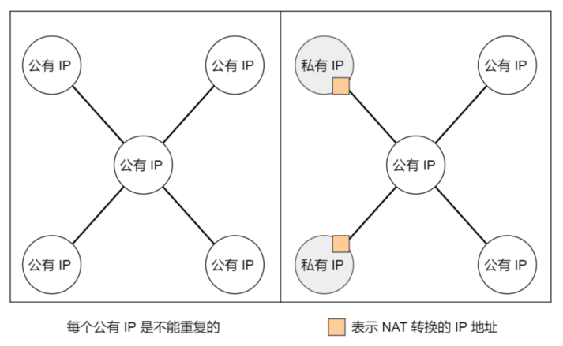
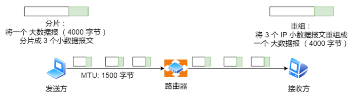

# IP 基本认识  

⽹络层的主要作⽤是： 实现主机与主机之间的通信，也叫点对点（end to end）通信。  

⽹络层与数据链路层的关系：MAC （数据链路层）的作⽤则是实现直连的两个设备之间通信，⽽ IP（⽹络层） 则负责在没有直连的两个⽹络之间进⾏通信传输。  


# IP 地址  

## IPv4 的表示

IP 地址（IPv4 地址）由 32 位正整数来表示， IP 地址在计算机是以⼆进制的⽅式处理的。为了⽅便记忆采⽤了点分⼗进制的标记⽅式：


IP 地址最⼤值也就是：2^32 ≈ 43 亿

## IPv4 的分类

IP 地址分类成了 5 种类型，分别是 A 类、 B 类、 C 类、 D 类、 E 类：


### A、B、C 类地址  

A、 B、 C 类主要分为两个部分，分别是⽹络号和主机号：


最⼤主机个数，就是要看主机号的位数，如 C 类地址的主机号占 8 位，那么 C 类地址的最⼤主机个数：2 ^ 8 -2 = 254。

在 IP 地址中，有两个 IP 是特殊的，分别是主机号全为 1 和 全为 0 地址，在分配过程中，应该去掉这两种情况  ：

- 主机号全为 1 指定某个⽹络下的所有主机，⽤于⼴播  
- 主机号全为 0 指定某个⽹络  


### ⼴播地址的作用

⼴播地址⽤于在同⼀个链路中相互连接的主机之间发送数据包。  

⼴播地址可以分为本地⼴播和直接⼴播两种：

- 在本⽹络内⼴播的叫做本地⼴播
- 在不同⽹络之间的⼴播叫做直接⼴播

⽹络地址为 192.168.0.0/24 的情况下，⼴播地址是 192.168.0.255 。因为这个⼴播地址的 IP 包会被路由器屏蔽，所以不会到达 192.168.0.0/24 以外的其他链路上  


⽹络地址为 192.168.0.0/24 的主机向 192.168.1.255/24 的⽬标地址发送 IP 包。收到这个包的路由器，将数据转发给 192.168.1.0/24，从⽽使得所有192.168.1.1~192.168.1.254 的主机都能收到这个包（由于直接⼴播有⼀定的安全问题，多数情况下会在路由器上设置为不转发。） 


### D、E 类地址  

D 类和 E 类地址是没有主机号的，所以不可⽤于主机 IP， D 类常被⽤于多播， E 类是预留的分类，暂时未使⽤。  


###  多播地址的作用

多播⽤于将包发送给特定组内的所有主机。  

由于⼴播⽆法穿透路由，若想给其他⽹段发送同样的包，就可以使⽤可以穿透路由的多播。  


多播使⽤的 D 类地址，其前四位是 1110 就表示是多播地址，⽽剩下的 28 位是多播的组编号。  

从 224.0.0.0 ~ 239.255.255.255 都是多播的可⽤范围，其划分为以下三类：  

- 224.0.0.0 ~ 224.0.0.255 为预留的组播地址，只能在局域⽹中，路由器是不会进⾏转发的  
- 224.0.1.0 ~ 238.255.255.255 为⽤户可⽤的组播地址，可以⽤于 Internet 上  
- 239.0.0.0 ~ 239.255.255.255 为本地管理组播地址，可供内部⽹在内部使⽤，仅在特定的本地范围内有效  

### IP 分类的优缺点

优点：简单明了、选路（基于⽹络地址）简单  

缺点：

- 同⼀⽹络下没有地址层次  
- 不能很好的与现实⽹络匹配，C 类地址能包含的最⼤主机数量实在太少了，只有 254 个，⽽ B 类地址能包含的最⼤主机数量⼜太多了， 6 万多台机器放在⼀个⽹络下⾯  

### ⽆分类地址 CIDR  

这种⽅式不再有分类地址的概念， 32 ⽐特的 IP 地址被划分为两部分，前⾯是⽹络号，后⾯是主机号。  

表示形式：

```
a.b.c.d/x 
```

- `/x` 表示前 x 位属于⽹络号， x 的范围是 0 ~ 32 ，这就使得 IP 地址更加具有灵活性

⽐如 10.100.122.2/24，这种地址表示形式就是 CIDR， /24 表示前 24 位是⽹络号，剩余的 8 位是主机号：


### ⼦⽹掩码

掩码的意思就是掩盖掉主机号，剩余的就是⽹络号。  将⼦⽹掩码和 IP 地址按位计算 AND，就可得到⽹络号。  


#### 分离⽹络号和主机号  

两台计算机要通讯，⾸先要判断是否处于同⼀个⼴播域内，即⽹络地址是否相同。如果⽹络地址相同，表明接受⽅在本⽹络上，那么可以把数据包直接发送到⽬标主机。  

路由器寻址⼯作中，也就是通过这样的⽅式来找到对应的⽹络号的，进⽽把数据包转发给对应的⽹络内。  


#### ⼦⽹划分  

⼦⽹掩码还有⼀个作⽤，那就是划分⼦⽹。⼦⽹划分实际上是将主机地址分为两个部分：⼦⽹⽹络地址和⼦⽹主机地址。

- 未做⼦⽹划分的 ip 地址：⽹络地址＋主机地址  
- 做⼦⽹划分后的 ip 地址：⽹络地址＋（⼦⽹⽹络地址＋⼦⽹主机地址）  


假设对 C 类地址进⾏⼦⽹划分，⽹络地址 192.168.1.0，使⽤⼦⽹掩码 255.255.255.192 对其进⾏⼦⽹划分：


由于⼦⽹⽹络地址被划分成 2 位，那么⼦⽹地址就有 4 个，分别是 00、 01、 10、 11，具体划分如下：


## 公有 IP 地址与私有 IP 地址  

在 A、 B、 C 分类地址，实际上有分公有 IP 地址和私有 IP 地址：




## IP 地址与路由控制  

IP地址的⽹络地址这⼀部分是⽤于进⾏路由控制。  

路由控制表中记录着⽹络地址与下⼀步应该发送⾄路由器的地址。在主机和路由器上都会有各⾃的路由器控制表。  

在发送 IP 包时，⾸先要确定 IP 包⾸部中的⽬标地址，再从路由控制表中找到与该地址具有相同⽹络地址的记录，根据该记录将 IP 包转发给相应的下⼀个路由器。如果路由控制表中存在多条相同⽹络地址的记录，就选择相同位数最多的⽹络地址，也就是最⻓匹配。  


- 主机 A 要发送⼀个 IP 包，其源地址是 10.1.1.30 和⽬标地址是 10.1.2.10 ，由于没有在主机 A 的路由表找到与⽬标地址 10.1.2.10 的⽹络地址，于是包被转发到默认路由（路由器 1 ）  
- 路由器 1 收到 IP 包后，也在路由器 1 的路由表匹配与⽬标地址相同的⽹络地址记录，发现匹配到了，于是就把 IP 数据包转发到了 10.1.0.2 这台路由器 2  
- 路由器 2 收到后，同样对⽐⾃身的路由表，发现匹配到了，于是把 IP 包从路由器 2 的 10.1.2.1 这个接⼝出去，最终经过交换机把 IP 数据包转发到了⽬标主机  

### 环回地址是不会流向⽹络  

环回地址是在同⼀台计算机上的程序之间进⾏⽹络通信时所使⽤的⼀个默认地址。计算机使⽤⼀个特殊的 IP 地址 127.0.0.1 作为环回地址。与该地址具有相同意义的是⼀个叫做 localhost 的主机名。使⽤这个 IP 或主机名时，数据包不会流向⽹络。  

## IP 分⽚与重组  

每种数据链路的最⼤传输单元 MTU 都是不相同的，如 FDDI 数据链路 MTU 4352、以太⽹的 MTU 是 1500 字节等。  

当 IP 数据包⼤⼩⼤于 MTU 时， IP 数据包就会被分⽚。经过分⽚之后的 IP 数据报在被重组的时候，只能由⽬标主机进⾏，路由器是不会进⾏重组的。  

假设发送⽅发送⼀个 4000 字节的⼤数据报，若要传输在以太⽹链路，则需要把数据报分⽚成 3 个⼩数据报进⾏传输：



在分⽚传输中，⼀旦某个分⽚丢失，则会造成整个 IP 数据报作废，所以 TCP 引⼊了 MSS 也就是在 TCP 层进⾏分⽚不由 IP 层分⽚，那么对于 UDP 我们尽量不要发送⼀个⼤于 MTU 的数据报⽂。  


## IPv6  


