TCP 协议是由操作系统实现，所以操作系统提供了不少调节 TCP 的参数：

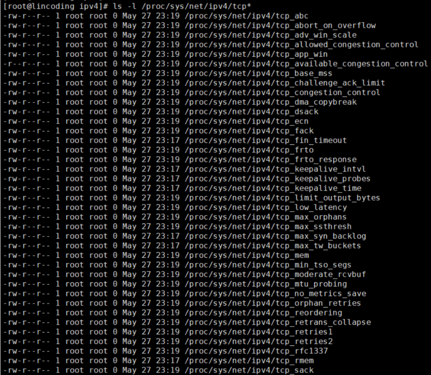

# TCP 三次握⼿的性能提升  

TCP 是⾯向连接的、可靠的、双向传输的传输层通信协议，所以在传输数据之前需要经过三次握⼿才能建⽴连接。  

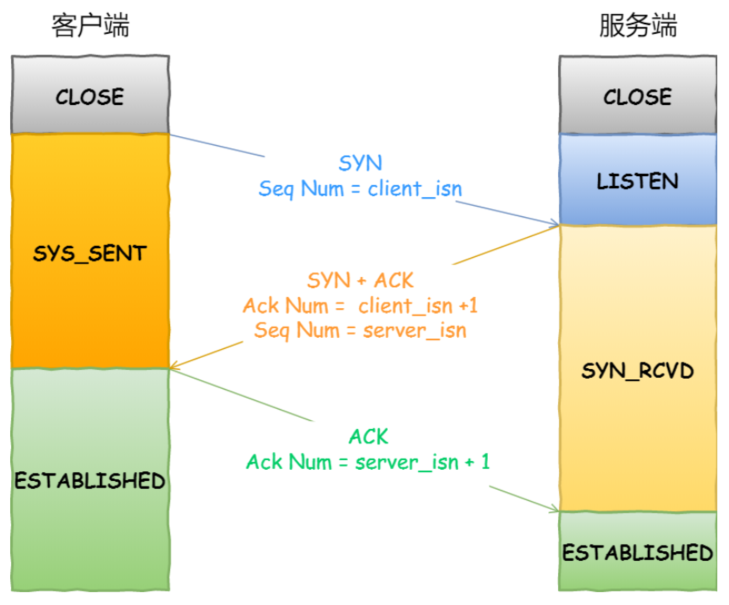

客户端和服务端都可以针对三次握⼿优化性能。主动发起连接的客户端优化相对简单些，⽽服务端需要监听端⼝，属于被动连接⽅，其间保持许多的中间状态，优化⽅法相对复杂⼀些。  

## 客户端优化  

三次握⼿建⽴连接的⾸要⽬的是同步序列号。只有同步了序列号才有可靠传输， TCP 许多特性都依赖于序列号实现，⽐如流量控制、丢包重传等，这也是三次握
⼿中的报⽂称为 SYN 的原因， SYN 的全称就叫 Synchronize Sequence Numbers（同步序列号）。  

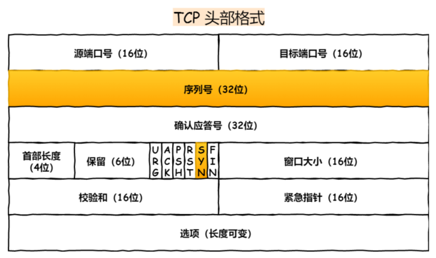

客户端作为主动发起连接⽅，⾸先它将发送 SYN 包，于是客户端的连接就会处于 SYN_SENT 状态。  

客户端在等待服务端回复的 ACK 报⽂，正常情况下，服务器会在⼏毫秒内返回 SYN+ACK ，但如果客户端⻓时间没有收到 SYN+ACK 报⽂，则会重发 SYN 包， 重发的次数由 tcp_syn_retries 参数控制。

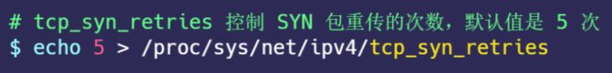

通常，第⼀次超时重传是在 1 秒后，第⼆次超时重传是在 2 秒，第三次超时重传是在 4 秒后，第四次超时重传是在 8 秒后，第五次是在超时重传 16 秒后。每次超时的时间是上⼀次的 2 倍。当第五次超时重传后，会继续等待 32 秒，如果服务端仍然没有回应 ACK，客户端就会终⽌三次握⼿。所以，总耗时是 1+2+4+8+16+32=63 秒，⼤约 1 分钟左右。      

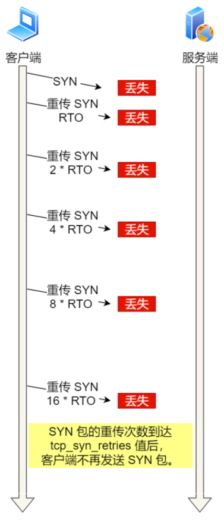

根据⽹络的稳定性和⽬标服务器的繁忙程度修改 SYN 的重传次数，调整客户端的三次握⼿时间上限。⽐如内⽹中通讯时，就可以适当调低重试次数，尽快把错误暴露给应⽤程序。  

## 服务端优化  

当服务端收到 SYN 包后，服务端会⽴⻢回复 SYN+ACK 包，表明确认收到了客户端的序列号，同时也把⾃⼰的序列号发给对⽅。  

此时，服务端出现了新连接，状态是 SYN_RCV 。在这个状态下， Linux 内核就会建⽴⼀个半连接队列来维护未完成的握⼿信息，当半连接队列溢出后，服务端就⽆法再建⽴新的连接。  

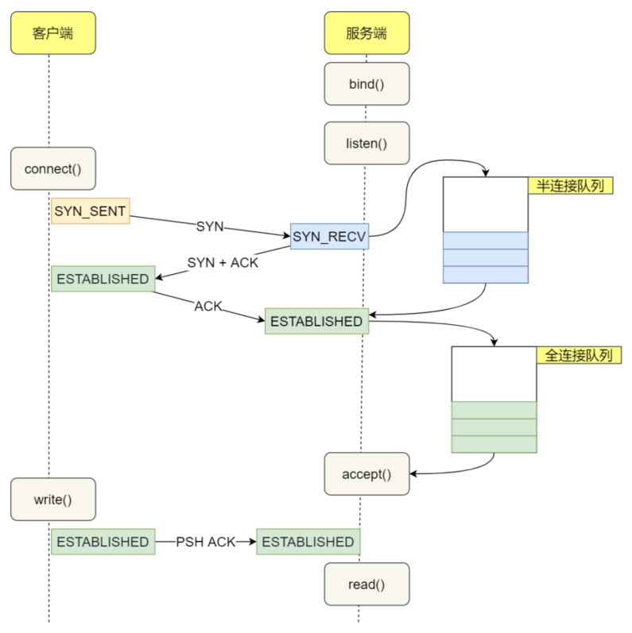

SYN 攻击，攻击的是就是这个半连接队列。  

### 查看由于 SYN 半连接队列已满，⽽被丢弃连接的情况  

可以通过该 netstat -s 命令给出的统计结果中， 可以得到由于半连接队列已满，引发的失败次数：  

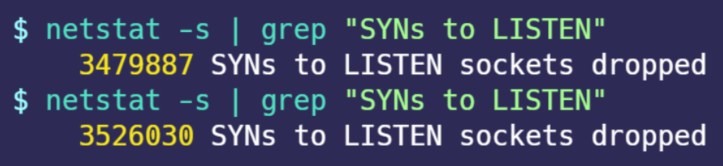

上⾯输出的数值是累计值，表示共有多少个 TCP 连接因为半连接队列溢出⽽被丢弃。 隔⼏秒执⾏⼏次，如果有上升的趋势，说明当前存在半连接队列溢出的现象。  

### 调整 SYN 半连接队列⼤⼩  

要想增⼤半连接队列， 不能只单纯增⼤ tcp_max_syn_backlog 的值，还需⼀同增⼤ somaxconn 和 backlog，也就是增⼤ accept 队列。否则，只单纯增⼤ tcp_max_syn_backlog 是⽆效的。  

增⼤ tcp_max_syn_backlog 和 somaxconn 的⽅法是修改 Linux 内核参数：  

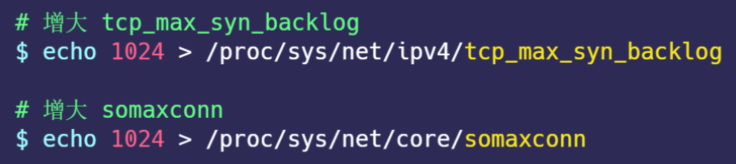

### SYN 半连接队列已满，只能丢弃连接吗

  并不是这样， 开启 syncookies 功能就可以在不使⽤ SYN 半连接队列的情况下成功建⽴连接。  

syncookies 的⼯作原理：服务器根据当前状态计算出⼀个值，放在⼰⽅发出的 SYN+ACK 报⽂中发出，当客户端返回 ACK 报⽂时，取出该值验证，如果合法，就认为连接建⽴成功：

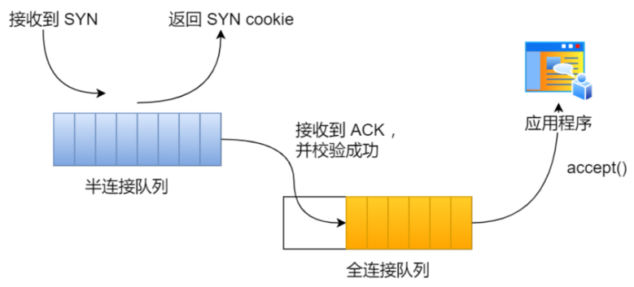

syncookies 参数主要有以下三个值：  

- 0 值，表示关闭该功能  
- 1 值，表示仅当 SYN 半连接队列放不下时，再启⽤它  
- 2 值，表示⽆条件开启功能  

那么在应对 SYN 攻击时，只需要设置为 1 即可：  

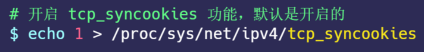

### SYN_RCV 状态的优化  

当客户端接收到服务器发来的 SYN+ACK 报⽂后，就会回复 ACK 给服务器，同时客户端连接状态从 SYN_SENT 转换为 ESTABLISHED，表示连接建⽴成功。  

服务器端连接成功建⽴的时间还要再往后，等到服务端收到客户端的 ACK 后，服务端的连接状态才变为 ESTABLISHED。如果服务器没有收到 ACK，就会重发 SYN+ACK 报⽂，同时⼀直处于 SYN_RCV 状态。  

当⽹络繁忙、不稳定时，报⽂丢失就会变严重，此时应该调⼤重发次数。反之则可以调⼩重发次数。 修改重发次数的⽅法是，调整 tcp_synack_retries 参数：  

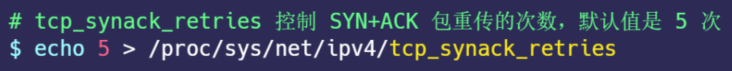

与客户端重传 SYN 类似，它的重传会经历 1、 2、 4、 8、 16 秒，最后⼀次重传后会继续等待 32 秒，如果服务端仍然没有收到 ACK，才会关闭连接，故共需要等待 63 秒。  

服务器收到 ACK 后连接建⽴成功，此时，内核会把连接从半连接队列移除，然后创建新的完全的连接，并将其添加到 accept 队列，等待进程调⽤ accept 函数时把连接取出来。如果进程不能及时地调⽤ accept 函数，就会造成 accept 队列（也称全连接队列）溢出，最终导致建⽴好的 TCP 连接被丢弃。  

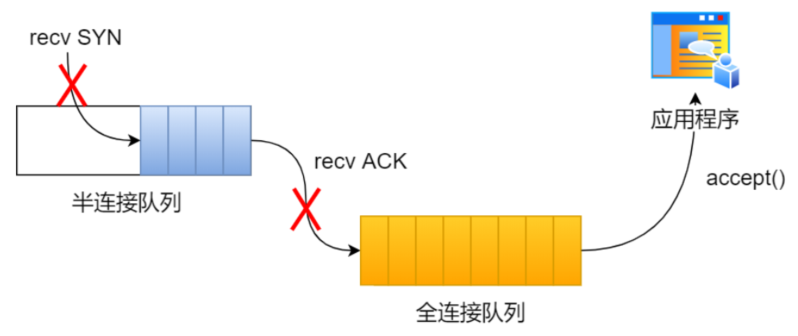

#### accept 队列已满，只能丢弃连接吗

丢弃连接只是 Linux 的默认⾏为，我们还可以选择向客户端发送 RST 复位报⽂，告诉客户端连接已经建⽴失败。打开这⼀功能需要将 tcp_abort_on_overflow 参数设置为 1。  

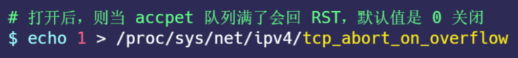

tcp_abort_on_overflow 共有两个值分别是 0 和 1，其分别表示：  

- 0 ：如果 accept 队列满了，那么 server 扔掉 client 发过来的 ack  
- 1 ：如果 accept 队列满了， server 发送⼀个 RST 包给 client，表示废掉这个握⼿过程和这个连接  

如果要想知道客户端连接不上服务端，是不是服务端 TCP 全连接队列满的原因，那么可以把 tcp_abort_on_overflow 设置为 1，这时如果在客户端异常中可以看到很多 connection reset by peer 的错误，那么就可以证明是由于服务端 TCP 全连接队列溢出的问题。 通常情况下，应当把 tcp_abort_on_overflow 设置为 0，因为这样更有利于应对突发流量。  

当 accept 队列满导致服务器丢掉了 ACK，与此同时，客户端的连接状态却是 ESTABLISHED，客户端进程就在建⽴好的连接上发送请求。只要服务器没有为请求回复 ACK，客户端的请求就会被多次重发。 如果服务器上的进程只是短暂的繁忙造成 accept 队列满，那么当 accept 队列有空位时，再次接收到的请求报⽂由于
含有 ACK，仍然会触发服务器端成功建⽴连接。  

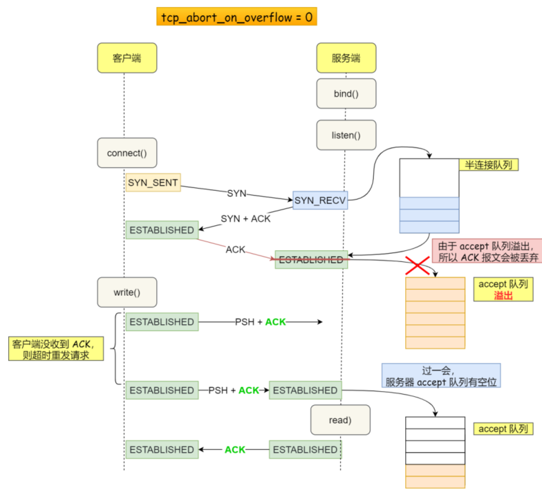

所以， tcp_abort_on_overflow 设为 0 可以提⾼连接建⽴的成功率，只有你⾮常肯定 TCP 全连接队列会⻓期溢出时，才能设置为 1 以尽快通知客户端。  

#### 调整 accept 队列的⻓度  

accept 队列的⻓度取决于 somaxconn 和 backlog 之间的最⼩值，也就是 min(somaxconn, backlog)，其中：  

- somaxconn 是 Linux 内核的参数，默认值是 128，可以通过 net.core.somaxconn 来设置其值  
- backlog 是 listen(int sockfd, int backlog) 函数中的 backlog ⼤⼩  

Tomcat、 Nginx、 Apache 常⻅的 Web 服务的 backlog 默认值都是 511。  

#### 查看服务端进程 accept 队列的⻓度  

可以通过 ss -ltn 命令查看：  

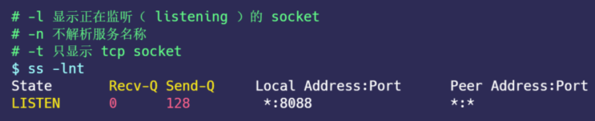

- Recv-Q：当前 accept 队列的⼤⼩，也就是当前已完成三次握⼿并等待服务端 accept() 的 TCP 连接  
- Send-Q： accept 队列最⼤⻓度，上⾯的输出结果说明监听 8088 端⼝的 TCP 服务， accept 队列的最⼤⻓度为 128  

#### 查看由于 accept 连接队列已满，⽽被丢弃的连接

当超过了 accept 连接队列，服务端则会丢掉后续进来的 TCP 连接，丢掉的 TCP 连接的个数会被统计起来，我们可以使⽤ netstat -s 命令来查看：  

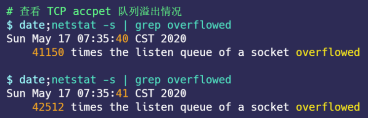

上⾯看到的 41150 times ，表示 accept 队列溢出的次数，注意这个是累计值。可以隔⼏秒钟执⾏下，如果这个数字⼀直在增加的话，说明 accept 连接队列偶尔满了。  

如果持续不断地有连接因为 accept 队列溢出被丢弃，就应该调⼤ backlog 以及 somaxconn 参数。  

## 如何绕过三次握⼿  

三次握⼿建⽴连接造成的后果就是， HTTP 请求必须在⼀个 RTT（从客户端到服务器⼀个往返的时间）后才能发送。  

 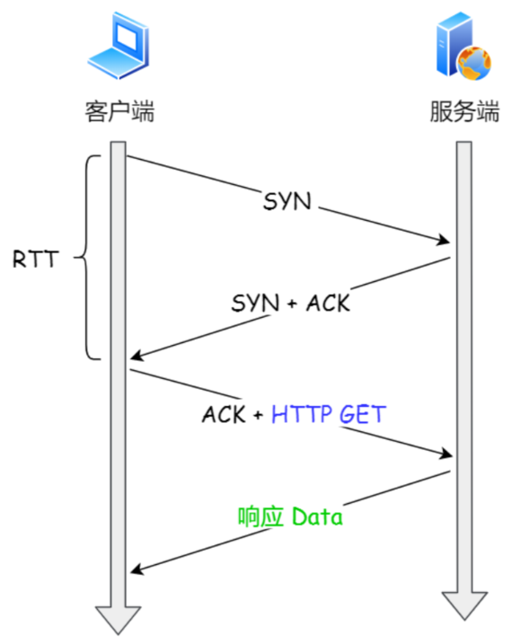

在 Linux 3.7 内核版本之后，提供了 TCP Fast Open 功能，这个功能可以减少 TCP 连接建⽴的时延。  

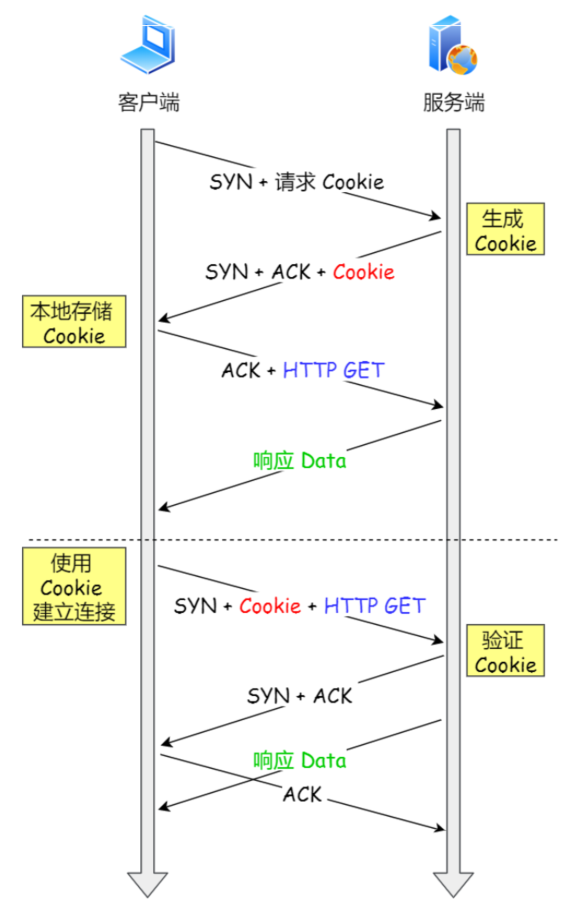

在客户端⾸次建⽴连接时的过程：

- 客户端发送 SYN 报⽂，该报⽂包含 Fast Open 选项，且该选项的 Cookie 为空，这表明客户端请求 Fast Open Cookie
- ⽀持 TCP Fast Open 的服务器⽣成 Cookie，并将其置于 SYN-ACK 数据包中的 Fast Open 选项以发回客户端
- 客户端收到 SYN-ACK 后，本地缓存 Fast Open 选项中的 Cookie

所以，第⼀次发起 HTTP GET 请求的时候，还是需要正常的三次握⼿流程。  

之后，如果客户端再次向服务器建⽴连接时的过程：  

- 客户端发送 SYN 报⽂，该报⽂包含数据（对于⾮ TFO 的普通 TCP 握⼿过程， SYN 报⽂中不包含数据）以及此前记录的 Cookie
- ⽀持 TCP Fast Open 的服务器会对收到 Cookie 进⾏校验：如果 Cookie 有效，服务器将在 SYN-ACK 报⽂中对 SYN 和数据进⾏确认，服务器随后将数据递送⾄相应的应⽤程序；如果 Cookie ⽆效，服务器将丢弃 SYN 报⽂中包含的数据，且其随后发出的 SYN-ACK 报⽂将只确认 SYN 的对应序列号
- 如果服务器接受了 SYN 报⽂中的数据，服务器可在握⼿完成之前发送数据， 这就减少了握⼿带来的1 个 RTT 的时间消耗
- 客户端将发送 ACK 确认服务器发回的 SYN 以及数据，但如果客户端在初始的 SYN 报⽂中发送的数据没有被确认，则客户端将重新发送数据
- 此后的 TCP 连接的数据传输过程和⾮ TFO 的正常情况⼀致   

所以，之后发起 HTTP GET 请求的时候，可以绕过三次握⼿，这就减少了握⼿带来的 1 个 RTT 的时间消耗。  

开启了 TFO 功能， cookie 的值是存放到 TCP option 字段⾥的：  

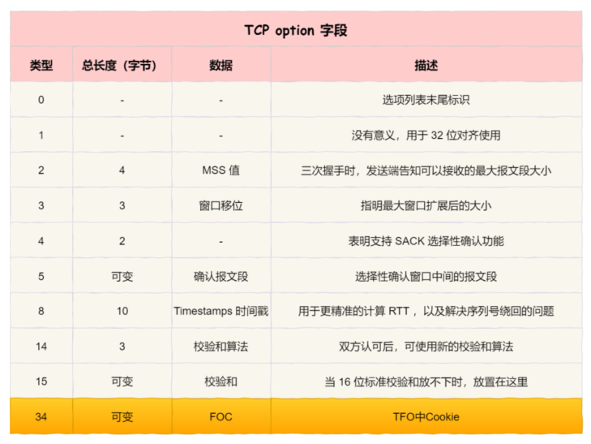

客户端在请求并存储了 Fast Open Cookie 之后，可以不断重复 TCP Fast Open 直⾄服务器认为 Cookie ⽆效（通常为过期）。  

### 打开 TCP Fast Open 功能  

在 Linux 系统中，可以通过设置 tcp_fastopn 内核参数，来打开 Fast Open 功能：  

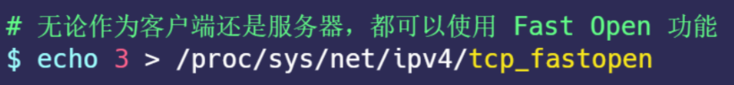

tcp_fastopn 各个值的意义:  

- 0 关闭  
- 1 作为客户端使⽤ Fast Open 功能  
- 2 作为服务端使⽤ Fast Open 功能  
- 3 ⽆论作为客户端还是服务器，都可以使⽤ Fast Open 功能  

TCP Fast Open 功能需要客户端和服务端同时⽀持，才有效果。  

## 小结

TCP 三次握⼿的⼏个 TCP 参数：

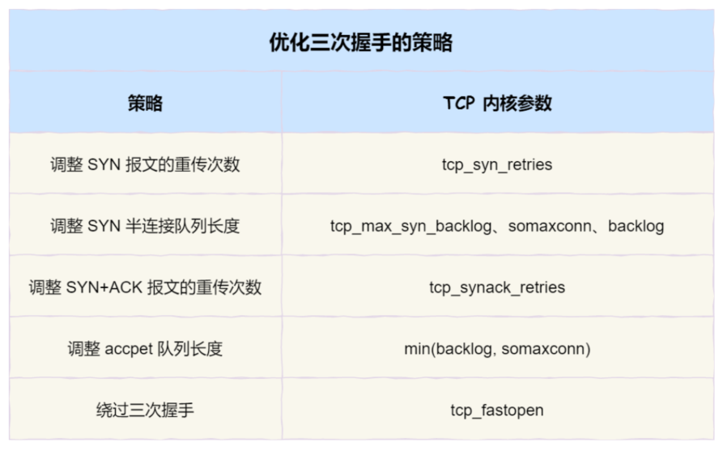

### 客户端的优化  

当客户端发起 SYN 包时，可以通过 tcp_syn_retries 控制其重传的次数。  

### 服务端的优化  

当服务端 SYN 半连接队列溢出后，会导致后续连接被丢弃，可以通过 netstat -s 观察半连接队列溢出的情况，如果 SYN 半连接队列溢出情况⽐较严重，可以通过 tcp_max_syn_backlog、 somaxconn、 backlog 参数来调整SYN 半连接队列的⼤⼩。  

