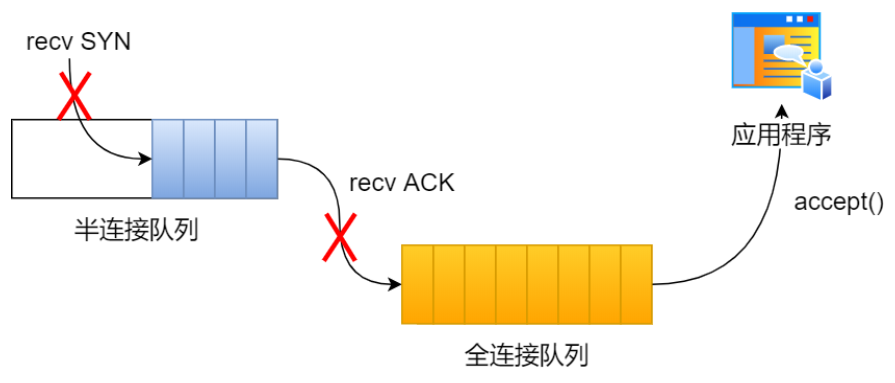
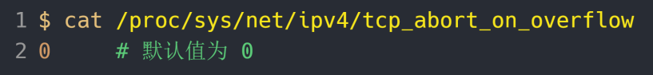
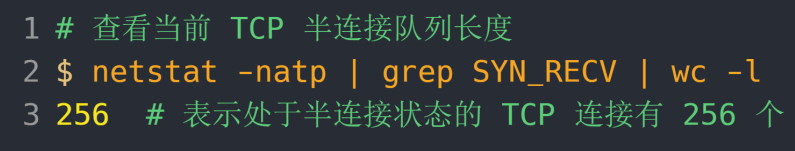
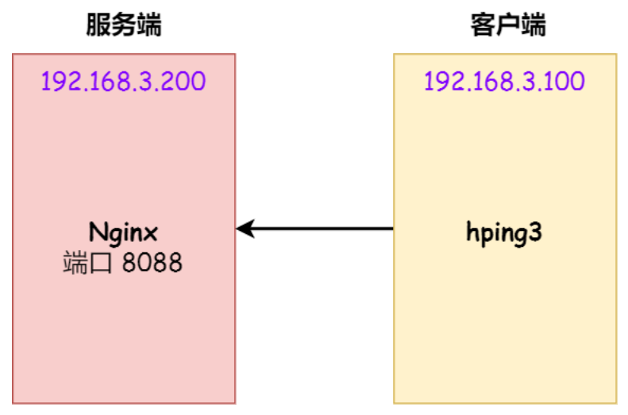
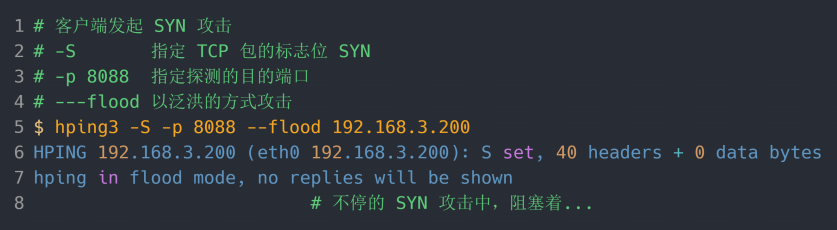
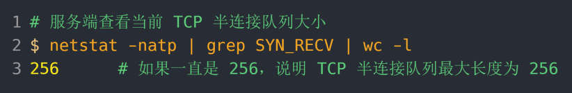

# TCP 半连接队列和全连接队列  

在 TCP 三次握⼿的时候， Linux 内核会维护两个队列，分别是：

- 半连接队列，也称 SYN 队列
- 全连接队列，也称 accepet 队列

服务端收到客户端发起的 SYN 请求后， 内核会把该连接存储到半连接队列，并向客户端响应 SYN+ACK，接着客户端会返回 ACK，服务端收到第三次握⼿的 ACK 后， 内核会把连接从半连接队列移除，然后创建新的完全的连接，并将其添加到 accept 队列，等待进程调⽤ accept 函数时把连接取出来。  

不管是半连接队列还是全连接队列，都有最⼤⻓度限制，超过限制时，内核会直接丢弃，或返回 RST 包。  

# TCP 全连接队列溢出  

在服务端可以使⽤ ss 命令，来查看 TCP 全连接队列的情况：  

ss 命令获取的 Recv-Q/Send-Q 在 LISTEN 状态和⾮ LISTEN 状态所表达的含义是不同的。从下⾯的内核代码可以看出区别：  

在 LISTEN 状态时， Recv-Q/Send-Q 表示的含义如下：  

- Recv-Q：当前全连接队列的⼤⼩，也就是当前已完成三次握⼿并等待服务端 accept() 的 TCP 连接
- Send-Q：当前全连接最⼤队列⻓度，上⾯的输出结果说明监听 8088 端⼝的 TCP 服务，最⼤全连接⻓度为 128

在⾮ LISTEN 状态时， Recv-Q/Send-Q 表示的含义如下：  

- Recv-Q：已收到但未被应⽤进程读取的字节数
- Send-Q：已发送但未收到确认的字节数

## 模拟 TCP 全连接队列溢出  

wrk  是⼀款简单的 HTTP 压测⼯具，它能够在单机多核 CPU 的条件下，使⽤系统⾃带的⾼性能 I/O 机制，通过多线程和事件模式，对⽬标机器产⽣⼤量的负载。  

客户端执⾏ wrk 命令对服务端发起压⼒测试，并发 3 万个连接：  

在服务端可以使⽤ ss 命令，来查看当前 TCP 全连接队列的情况：  

其间共执⾏了两次 ss 命令，从上⾯的输出结果，可以发现当前 TCP 全连接队列上升到了 129 ⼤⼩，超过了最⼤TCP 全连接队列。当超过了 TCP 最⼤全连接队列，服务端则会丢掉后续进来的 TCP 连接，丢掉的 TCP 连接的个数会被统计起来，我们可以使⽤ netstat -s 命令来查看：  

上⾯看到的 41150 times ，表示全连接队列溢出的次数，注意这个是累计值。可以隔⼏秒钟执⾏下，如果这个数字⼀直在增加的话肯定全连接队列偶尔满了。  

从上⾯的模拟结果，可以得知， 当服务端并发处理⼤量请求时，如果 TCP 全连接队列过⼩，就容易溢出。发⽣TCP 全连接队溢出的时候，后续的请求就会被丢弃，这样就会出现服务端请求数量上不去的现象。  

### 全连接队列满了的策略  

实际上，丢弃连接只是 Linux 的默认⾏为，我们还可以选择向客户端发送 RST 复位报⽂，告诉客户端连接已经建⽴失败。  

tcp_abort_on_overflow 共有两个值分别是 0 和 1，其分别表示：

- 0 ：如果全连接队列满了，那么 server 扔掉 client 发过来的 ack 
- 1 ：如果全连接队列满了， server 发送⼀个 reset 包给 client，表示废掉这个握⼿过程和这个连接

如果要想知道客户端连接不上服务端，是不是服务端 TCP 全连接队列满的原因，那么可以把tcp_abort_on_overflow 设置为 1，这时如果在客户端异常中可以看到很多 connection reset by peer 的错误，那么就可以证明是由于服务端 TCP 全连接队列溢出的问题。  

通常情况下，应当把 tcp_abort_on_overflow 设置为 0，因为这样更有利于应对突发流量。  

### 增⼤ TCP 全连接队列  

TCP 全连接队列的最⼤值取决于 somaxconn 和 backlog 之间的最⼩值，也就是 min(somaxconn, backlog)。  

- somaxconn 是 Linux 内核的参数，默认值是 128，可以通过 /proc/sys/net/core/somaxconn 来设置其值
- backlog 是 listen(int sockfd, int backlog) 函数中的 backlog ⼤⼩

如果持续不断地有连接因为 TCP 全连接队列溢出被丢弃，就应该调⼤ backlog 以及 somaxconn 参数。  

# TCP 半连接队列溢出  

## 查看 TCP 半连接队列⻓度  

服务端处于 SYN_RECV 状态的 TCP 连接，就是 TCP 半连接队列。于是，我们可以使⽤如下命令计算当前 TCP 半连接队列⻓度：  

## 模拟 TCP 半连接队列溢出  

模拟 TCP 半连接溢出场景不难，实际上就是对服务端⼀直发送 TCP SYN 包，但是不回第三次握⼿ ACK，这样就会使得服务端有⼤量的处于 SYN_RECV 状态的 TCP 连接。这其实也就是所谓的 SYN 洪泛、 SYN 攻击、 DDos 攻击。  

拟实验是没有开启 tcp_syncookies，使⽤ hping3 ⼯具模拟 SYN 攻击：  

当服务端受到 SYN 攻击后，连接服务端 ssh 就会断开了，⽆法再连上。只能在服务端主机上执⾏查看当前 TCP 半连接队列⼤⼩：  

同时，还可以通过 netstat -s 观察半连接队列溢出的情况：  