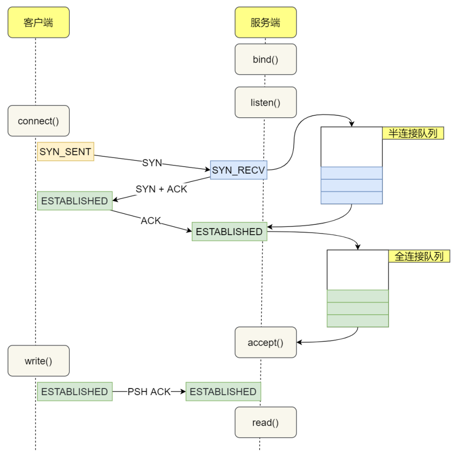
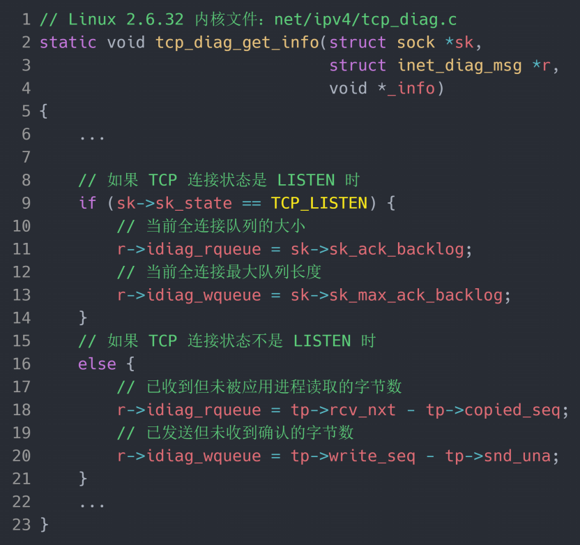
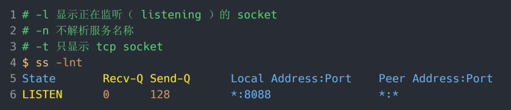
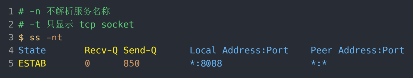
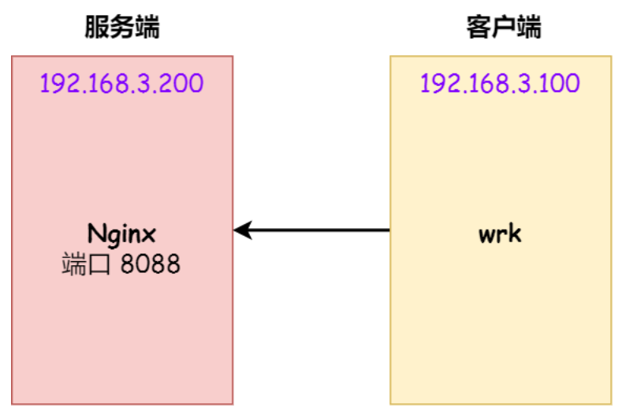
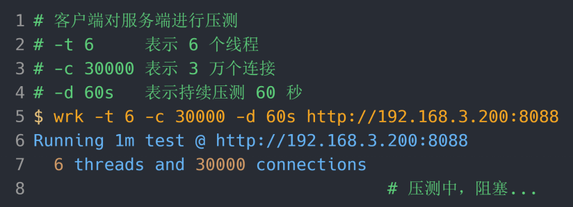
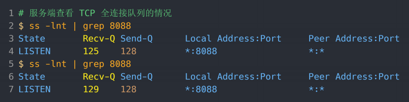
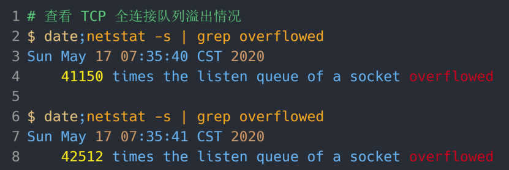

# TCP 半连接队列和全连接队列  

在 TCP 三次握⼿的时候， Linux 内核会维护两个队列，分别是：

- 半连接队列，也称 SYN 队列
- 全连接队列，也称 accepet 队列

服务端收到客户端发起的 SYN 请求后， 内核会把该连接存储到半连接队列，并向客户端响应 SYN+ACK，接着客户端会返回 ACK，服务端收到第三次握⼿的 ACK 后， 内核会把连接从半连接队列移除，然后创建新的完全的连接，并将其添加到 accept 队列，等待进程调⽤ accept 函数时把连接取出来。  

不管是半连接队列还是全连接队列，都有最⼤⻓度限制，超过限制时，内核会直接丢弃，或返回 RST 包。  

## TCP 全连接队列溢出  

在服务端可以使⽤ ss 命令，来查看 TCP 全连接队列的情况：  

ss 命令获取的 Recv-Q/Send-Q 在 LISTEN 状态和⾮ LISTEN 状态所表达的含义是不同的。从下⾯的内核代码可以看出区别：  

在 LISTEN 状态时， Recv-Q/Send-Q 表示的含义如下：  

- Recv-Q：当前全连接队列的⼤⼩，也就是当前已完成三次握⼿并等待服务端 accept() 的 TCP 连接
- Send-Q：当前全连接最⼤队列⻓度，上⾯的输出结果说明监听 8088 端⼝的 TCP 服务，最⼤全连接⻓度为 128

在⾮ LISTEN 状态时， Recv-Q/Send-Q 表示的含义如下：  

- Recv-Q：已收到但未被应⽤进程读取的字节数
- Send-Q：已发送但未收到确认的字节数

## 模拟 TCP 全连接队列溢出  

wrk  是⼀款简单的 HTTP 压测⼯具，它能够在单机多核 CPU 的条件下，使⽤系统⾃带的⾼性能 I/O 机制，通过多线程和事件模式，对⽬标机器产⽣⼤量的负载。  

客户端执⾏ wrk 命令对服务端发起压⼒测试，并发 3 万个连接：  

在服务端可以使⽤ ss 命令，来查看当前 TCP 全连接队列的情况：  

其间共执⾏了两次 ss 命令，从上⾯的输出结果，可以发现当前 TCP 全连接队列上升到了 129 ⼤⼩，超过了最⼤TCP 全连接队列。当超过了 TCP 最⼤全连接队列，服务端则会丢掉后续进来的 TCP 连接，丢掉的 TCP 连接的个数会被统计起来，我们可以使⽤ netstat -s 命令来查看：  

