# tcpdump 和 wireshark

## tcpdump

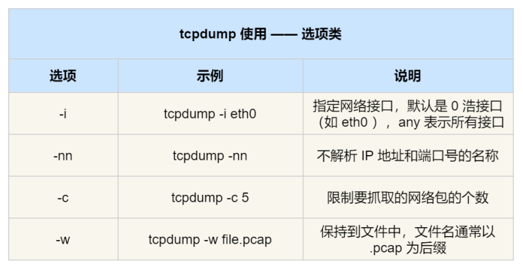

常⽤的过滤表⽤法：

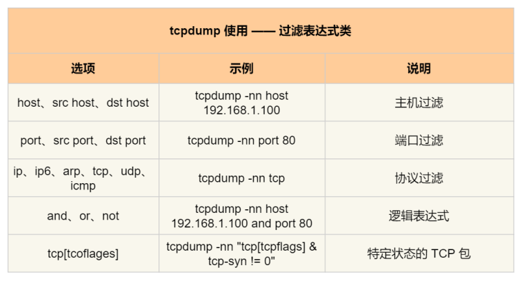

示例：

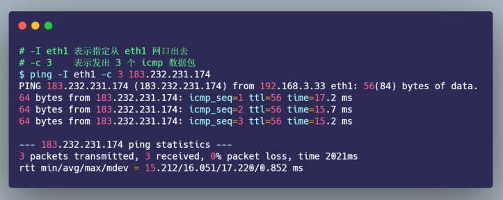

tcpdump 抓取到 icmp 数据包后， 输出格式如下：  


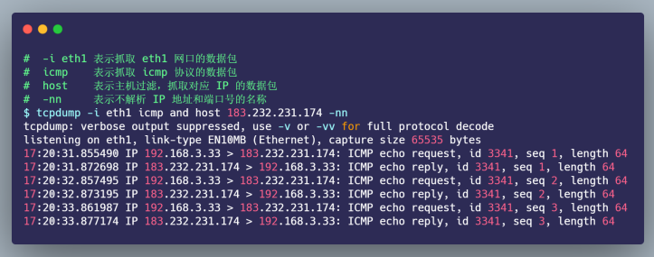

从 tcpdump 抓取的 icmp 数据包，我们很清楚的看到 icmp echo 的交互过程了，⾸先发送⽅发起了 ICMP echo request 请求报⽂，接收⽅收到后回了⼀个 ICMP echo reply 响应报⽂，之后 seq 是递增的。  

## Wireshark 

Wireshark 除了可以抓包外，还提供了可视化分析⽹络包的图形⻚⾯，同时，还内置了⼀系列的汇总分析⼯具。  

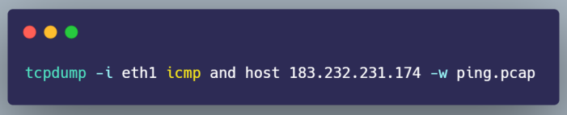

⽤ Wireshark  分析：

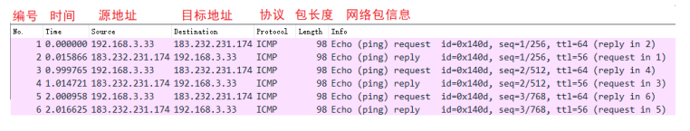

在其下⾯的⽹络包详情中， 可以更清楚的看到，这个⽹络包在协议栈各层的详细信息。⽐如，以编号 1 的⽹络包为例⼦：  

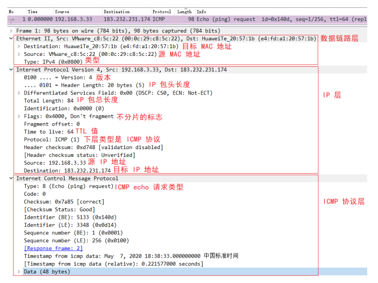

# 解密 TCP 三次握⼿和四次挥⼿  

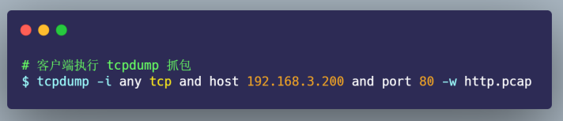

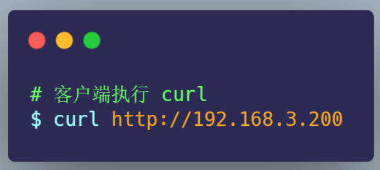

使⽤ Wireshark 打开 http.pcap：

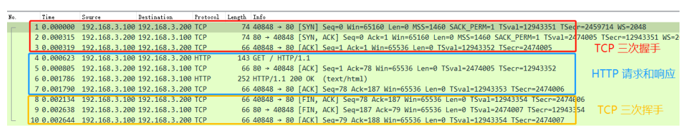

- 最开始的 3 个包就是 TCP 三次握⼿建⽴连接的包
- 中间是 HTTP 请求和响应的包
- ⽽最后的 3 个包则是 TCP 断开连接的挥⼿包  

Wireshark 可以⽤时序图的⽅式显示数据包交互的过程，从菜单栏中，点击 "统计 (Statistics)" -> "流量图 (Flow Graph)"，然后，在弹出的界⾯中的 "流量类型" 选择 "TCP Flows"，你可以更清晰的看到，整个过程中 TCP 流的执⾏过程：  

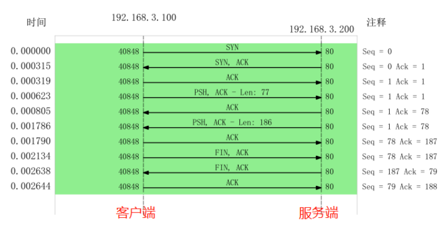

Wireshark ⼯具帮我们做了优化，它默认显示的是序列号 seq 是相对值，⽽不是真实值。  如果你想看到实际的序列号的值，可以右键菜单， 然后找到 "协议⾸选项"，接着找到Relative Seq后，把它给取消，操作如下：  

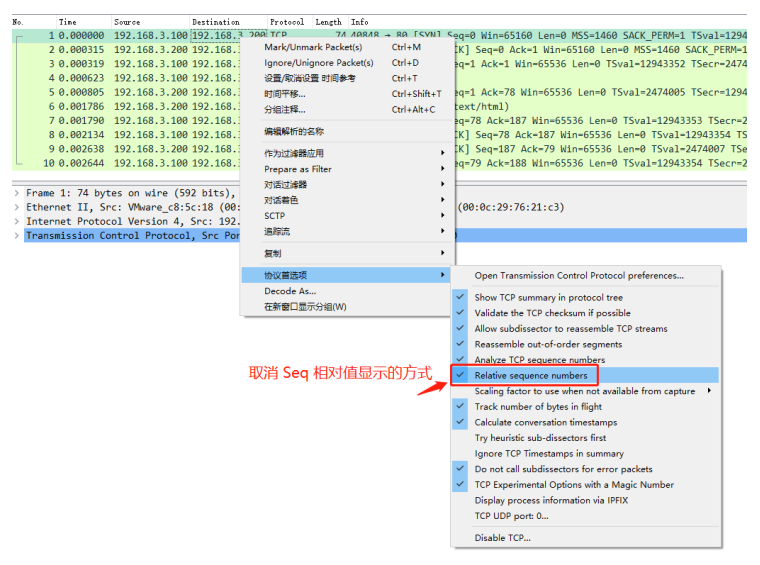

取消后， Seq 显示的就是真实值了：  

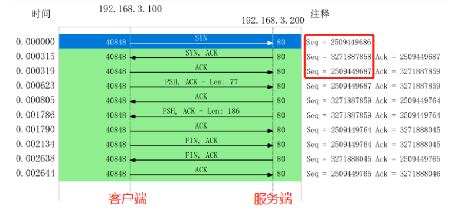

上面的流程可以总结为：

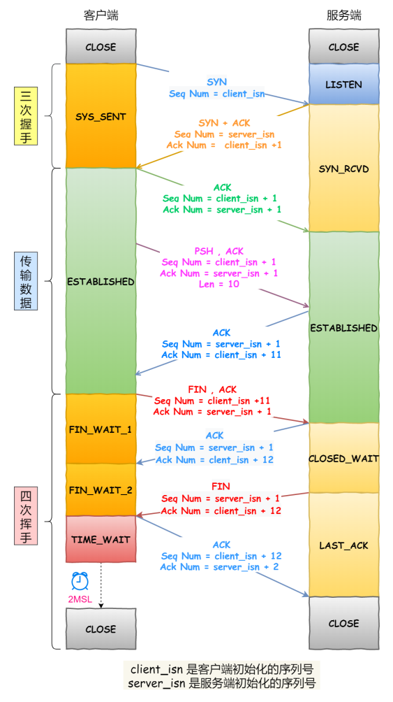

为什么抓到的 TCP 挥⼿是三次，⽽不是书上说的四次？  

因为服务器端收到客户端的 FIN 后，服务器端同时也要关闭连接，这样就可以把 ACK 和 FIN 合并到⼀起发送，节省了⼀个包，变成了“三次挥⼿”。⽽通常情况下，服务器端收到客户端的 FIN 后，很可能还没发送完数据，所以就会先回复客户端⼀个 ACK包，稍等⼀会⼉，完成所有数据包的发送后，才会发送 FIN 包，这也就是四次挥⼿了。  

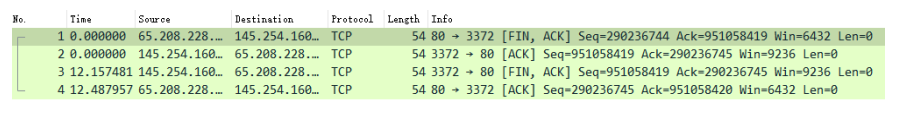

# TCP 三次握⼿异常情况实战分析  

## TCP 第⼀次握⼿ SYN 丢包  

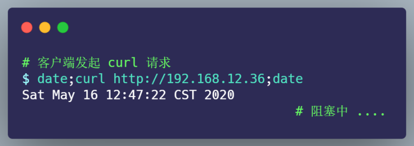

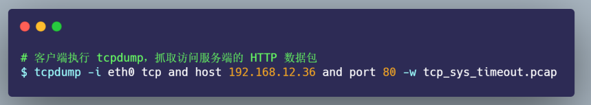

过了⼀会， curl 返回了超时连接的错误：  

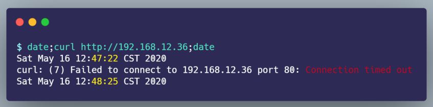

把 tcp_sys_timeout.pcap ⽂件⽤ Wireshark 打开分析，显示如下图：  

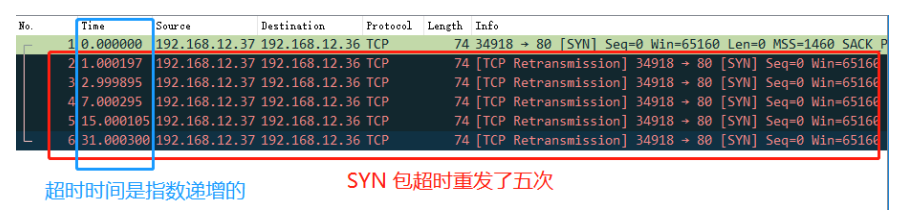

客户端发起了 SYN 包后，⼀直没有收到服务端的 ACK ，所以⼀直超时重传了 5 次，并且每次RTO 超时时间是不同的：  

- 第⼀次是在 1 秒超时重传
- 第⼆次是在 3 秒超时重传
- 第三次是在 7 秒超时重传
- 第四次是在 15 秒超时重传
- 第五次是在 31 秒超时重传  

可以发现，每次超时时间 RTO 是指数（翻倍）上涨的，当超过最⼤重传次数后，客户端不再发送 SYN 包  

在 Linux 中，第⼀次握⼿的 SYN 超时重传次数，是如下内核参数指定的：  

```
cat /proc/sys/net/ipv4/tcp_syn_retries
```

小结：

当客户端发起的 TCP 第⼀次握⼿ SYN 包，在超时时间内没收到服务端的ACK，就会在超时重传 SYN 数据包，每次超时重传的 RTO 是翻倍上涨的，直到 SYN 包的重传次数到达tcp_syn_retries 值后，客户端不再发送 SYN 包。  

## TCP 第⼆次握⼿ SYN、 ACK 丢包  

在客户端加上防⽕墙限制，直接粗暴的把来⾃服务端的数据都丢弃，防⽕墙的配置如下：  

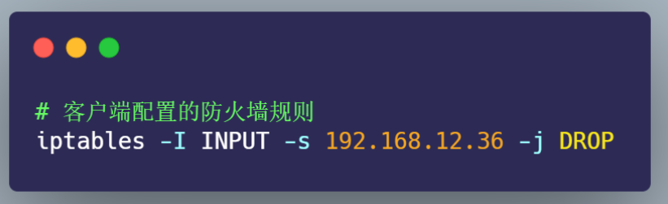

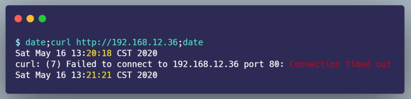

客户端在这其间抓取的数据包，⽤ Wireshark 打开分析，显示的时序图如下：  

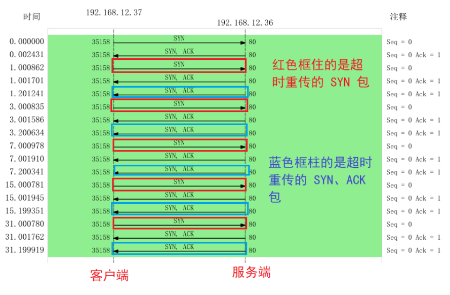

- 客户端发起 SYN 后，由于防⽕墙屏蔽了服务端的所有数据包，所以 curl 是⽆法收到服务端的 SYN、 ACK包，当发⽣超时后，就会重传 SYN 包
- 服务端收到客户的 SYN 包后，就会回 SYN、 ACK 包，但是客户端⼀直没有回 ACK，服务端在超时后，重传了 SYN、 ACK 包， 接着⼀会，客户端超时重传的 SYN 包⼜抵达了服务端，服务端收到后，超时定时器就重新计时，然后回了 SYN、 ACK 包，所以相当于服务端的超时定时器只触发了⼀次，⼜被重置
- 最后，客户端 SYN 超时重传次数达到了 5 次（tcp_syn_retries 默认值 5 次），就不再继续发送 SYN 包了  

可以发现， 当第⼆次握⼿的 SYN、 ACK 丢包时，客户端会超时重发 SYN 包，服务端也会超时重传 SYN、 ACK 包。  

客户端设置了防⽕墙，屏蔽了服务端的⽹络包，为什么 tcpdump 还能抓到服务端的⽹络包？  

添加 iptables 限制后， tcpdump 是否能抓到包 ，这要看添加的 iptables 限制条件：

- 如果添加的是 INPUT 规则，则可以抓得到包
- 如果添加的是 OUTPUT 规则，则抓不到包  

⽹络包进⼊主机后的顺序如下：  

- 进来的顺序 Wire -> NIC -> tcpdump -> netfilter/iptables  
- 出去的顺序 iptables -> tcpdump -> NIC -> Wire  

第⼆次握⼿ SYN、 ACK 限制最⼤重传次数是多少？  

TCP 第⼆次握⼿ SYN、 ACK 包的最⼤重传次数是通过 tcp_synack_retries 内核参数限制的，其默认值如下：  

```
cat /proc/sys/net/ipv4/tcp_synack_retries
```

⼩结：

当 TCP 第⼆次握⼿ SYN、 ACK 包丢了后，客户端 SYN 包会发⽣超时重传，服务端 SYN、 ACK 也会发⽣超时重传。

客户端 SYN 包超时重传的最⼤次数，是由 tcp_syn_retries 决定的；服务端 SYN、 ACK 包时重传的最⼤次数，是由 tcp_synack_retries 决定的。  

## TCP 第三次握⼿ ACK 丢包  

在服务端配置防⽕墙，屏蔽客户端 TCP 报⽂中标志位是ACK 的包，也就是当服务端收到客户端的 TCP ACK 的报⽂时就会丢弃， iptables 配置命令如下：  

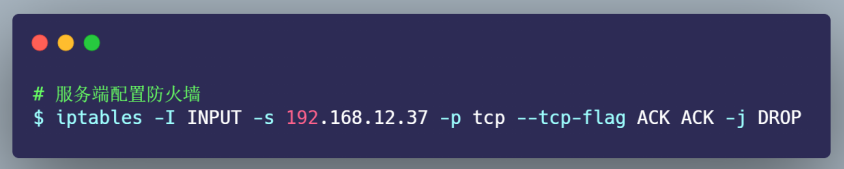

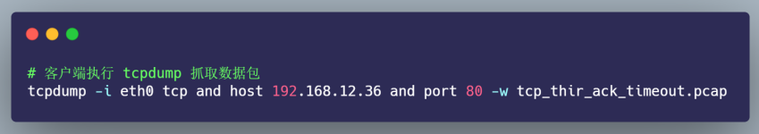

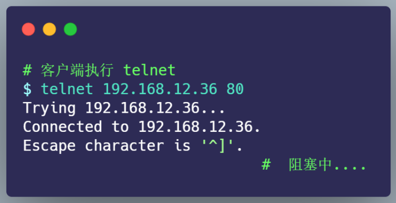

此时，由于服务端收不到第三次握⼿的 ACK 包，所以⼀直处于 SYN_RECV 状态：

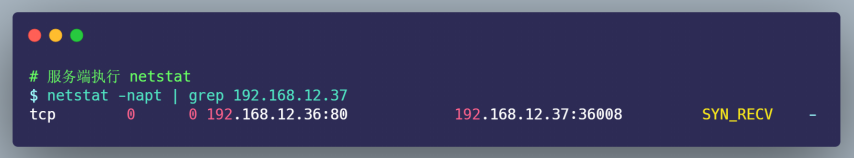

⽽客户端是已完成 TCP 连接建⽴，处于 ESTABLISHED 状态：  

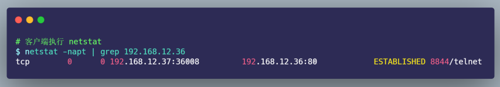

过了 1 分钟后，观察发现服务端的 TCP 连接不⻅了：  

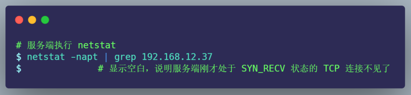

过了 30 分后，客户端依然还是处于 ESTABLISHED 状态：  

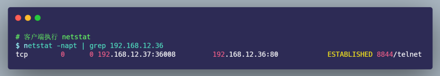

接着，在刚才客户端建⽴的 telnet 会话，输⼊ 123456 字符，进⾏发送：  

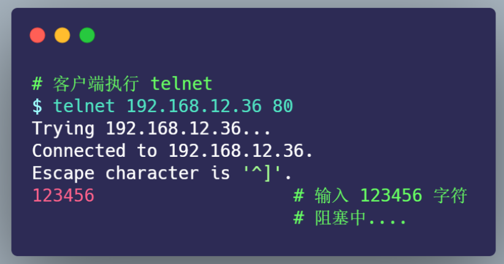

持续好⻓⼀段时间，客户端的 telnet 才断开连接：  

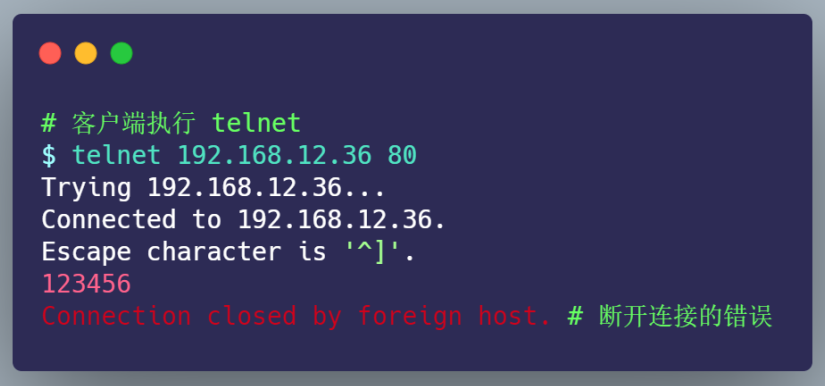

把刚抓的数据包，⽤ Wireshark 打开分析，显示的时序图如下：  

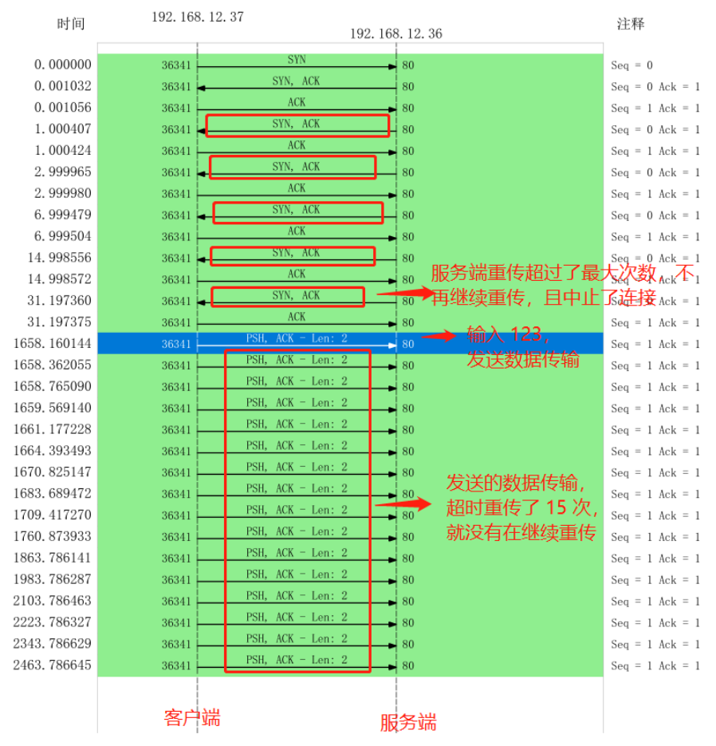

- 客户端发送 SYN 包给服务端，服务端收到后，回了个 SYN、 ACK 包给客户端，此时服务端的 TCP 连接处于 SYN_RECV 状态  
- 客户端收到服务端的 SYN、 ACK 包后，给服务端回了个 ACK 包，此时客户端的 TCP 连接处于 ESTABLISHED 状态  
- 由于服务端配置了防⽕墙，屏蔽了客户端的 ACK 包，所以服务端⼀直处于 SYN_RECV 状态，没有进⼊ESTABLISHED 状态， tcpdump 之所以能抓到客户端的 ACK 包，是因为数据包进⼊系统的顺序是先进⼊ tcpudmp，后经过 iptables  
- 接着，服务端超时重传了 SYN、 ACK 包，重传了 5 次后，也就是超过 tcp_synack_retries 的值（默认值是5），然后就没有继续重传了，此时服务端的 TCP 连接主动中⽌了，所以刚才处于 SYN_RECV 状态的 TCP 连接断开了，⽽客户端依然处于 ESTABLISHED 状态 
- 虽然服务端 TCP 断开了，但过了⼀段时间，发现客户端依然处于 ESTABLISHED 状态，于是就在客户端的 telnet 会话输⼊了 123456 字符
- 此时由于服务端已经断开连接， 客户端发送的数据报⽂，⼀直在超时重传，每⼀次重传， RTO 的值是指数增⻓的，所以持续了好⻓⼀段时间，客户端的 telnet 才报错退出了，此时共重传了 15 次  

TCP 建⽴连接后的数据包最⼤超时重传次数是多少？  

TCP 建⽴连接后的数据包传输，最⼤超时重传次数是由 tcp_retries2 指定：

```
cat /proc/sys/net/ipv4/tcp_retries2
```

如果客户端不发送数据，什么时候才会断开处于 ESTABLISHED 状态的连接?

这⾥就需要提到 TCP 的 保活机制。这个机制的原理是这样的：

定义⼀个时间段，在这个时间段内，如果没有任何连接相关的活动， TCP 保活机制会开始作⽤，每隔⼀个时间间隔，发送⼀个探测报⽂，该探测报⽂包含的数据⾮常少，如果连续⼏个探测报⽂都没有得到响应，则认为当前的 TCP 连接已经死亡，系统内核将错误信息通知给上层应⽤程序。  

在 Linux 内核可以有对应的参数可以设置保活时间、保活探测的次数、保活探测的时间间隔，以下都为默认值：

```
net.ipv4.tcp_keepalive_time=7200
net.ipv4.tcp_keepalive_intvl=75
net.ipv4.tcp_keepalive_probes=9
```

- tcp_keepalive_time=7200：表示保活时间是 7200 秒（2⼩时），也就 2 ⼩时内如果没有任何连接相关的活动，则会启动保活机制

- tcp_keepalive_intvl=75：表示每次检测间隔 75 秒  

- tcp_keepalive_probes=9：表示检测 9 次⽆响应，认为对⽅是不可达的，从⽽中断本次的连接  

也就是说在 Linux 系统中，最少需要经过 2 ⼩时 11 分 15 秒才可以发现⼀个死亡连接：

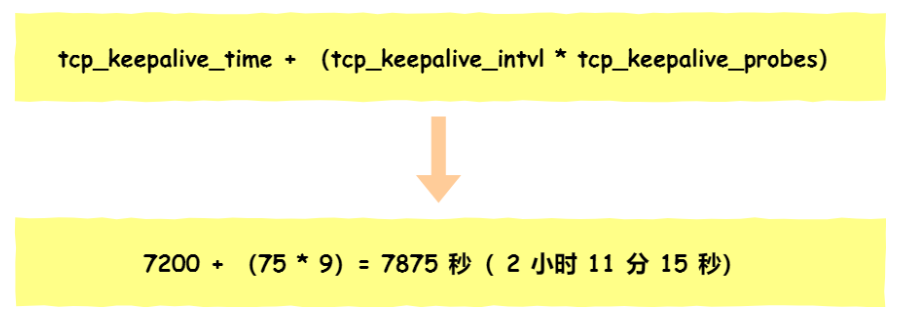

⼩结：

在建⽴ TCP 连接时，如果第三次握⼿的 ACK，服务端⽆法收到，则服务端就会短暂处于 SYN_RECV 状态，⽽
客户端会处于 ESTABLISHED 状态。
由于服务端⼀直收不到 TCP 第三次握⼿的 ACK，则会⼀直重传 SYN、 ACK 包，直到重传次数超过
tcp_synack_retries 值（默认值 5 次）后，服务端就会断开 TCP 连接。
⽽客户端则会有两种情况：
如果客户端没发送数据包，⼀直处于 ESTABLISHED 状态，然后经过 2 ⼩时 11 分 15 秒才可以发现⼀个
「死亡」连接，于是客户端连接就会断开连接。
如果客户端发送了数据包，⼀直没有收到服务端对该数据包的确认报⽂，则会⼀直重传该数据包，直到重传
次数超过 tcp_retries2 值（默认值 15 次）后，客户端就会断开 TCP 连接。  
