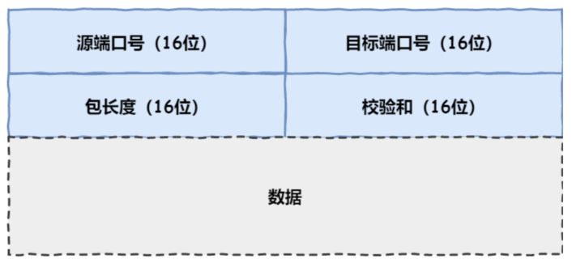
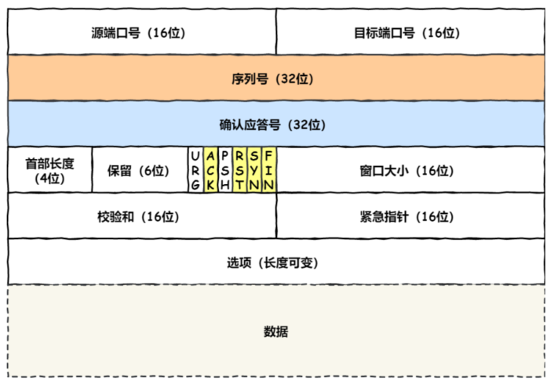

# TCP 三次握⼿与四次挥⼿  

## TCP 基本认识  

### 为什么需要 TCP 协议

IP 层是「不可靠」的，它不保证⽹络包的交付、不保证⽹络包的按序交付、也不保证⽹络包中的数据的完整性。  

如果需要保障⽹络数据包的可靠性，那么就需要由上层（传输层）的 TCP 协议来负责。因为 TCP 是⼀个⼯作在传输层的可靠数据传输的服务，它能确保接收端接收的⽹络包是⽆损坏、⽆间隔、⾮冗余和按序的。  

### 什么是 TCP 

TCP 是⾯向连接的、可靠的、基于字节流的传输层通信协议。  

- ⾯向连接：⼀定是⼀对⼀才能连接，不能像 UDP 协议可以⼀个主机同时向多个主机发送消息，也就是⼀对多是⽆法做到的
- 可靠的：⽆论的⽹络链路中出现了怎样的链路变化， TCP 都可以保证⼀个报⽂⼀定能够到达接收端  
- 字节流：消息是没有边界的，所以⽆论消息有多⼤都可以进⾏传输。并且消息是有序的，当前⼀个消息没有收到的时候，即使它先收到了后⾯的字节，那么也不能扔给应⽤层去处理，同时对重复的报⽂会⾃动丢弃

### 什么是 TCP 连接  

⽤于保证可靠性和流量控制维护的某些状态信息，这些信息的组合，包括Socket、序列号和窗⼝⼤⼩称为连接。  

所以我们可以知道，建⽴⼀个 TCP 连接是需要客户端与服务器端达成上述三个信息的共识：

- Socket：由 IP 地址和端⼝号组成
- 序列号：⽤来解决乱序问题等
- 窗⼝⼤⼩：⽤来做流量控制  

### 如何唯⼀确定⼀个 TCP 连接  

TCP 四元组可以唯⼀的确定⼀个连接，四元组包括如下：  

- 源地址  
- 源端⼝
- ⽬的地址
- ⽬的端⼝  

源地址和⽬的地址的字段（32位）是在 IP 头部中，作⽤是通过 IP 协议发送报⽂给对⽅主机。

源端⼝和⽬的端⼝的字段（16位）是在 TCP 头部中，作⽤是告诉 TCP 协议应该把报⽂发给哪个进程。

### 监听了⼀个端⼝的TCP 的最⼤连接数  

服务器通常固定在某个本地端⼝上监听，等待客户端的连接请求。因此，客户端 IP 和 端⼝是可变的，其理论值计算公式如下：

对 IPv4，客户端的 IP 数最多为 2 的 32 次⽅，客户端的端⼝数最多为 2 的 16 次⽅，也就是服务端单机最⼤ TCP 连接数，约为 2 的 48 次⽅。  

当然，服务端最⼤并发 TCP 连接数远不能达到理论上限：

- ⾸先主要是⽂件描述符限制， Socket 都是⽂件，所以⾸先要通过 ulimit 配置⽂件描述符的数⽬  
- 另⼀个是内存限制，每个 TCP 连接都要占⽤⼀定内存，操作系统的内存是有限的  

### UDP 和 TCP 有什么区别  

UDP 不提供复杂的控制机制，利⽤ IP 提供⾯向⽆连接的通信服务。

UDP 协议⾮常简单，头部只有 8 个字节（ 64 位）， UDP 的头部格式如下：   
  

- ⽬标和源端⼝：主要是告诉 UDP 协议应该把报⽂发给哪个进程
- 包⻓度：该字段保存了 UDP ⾸部的⻓度跟数据的⻓度之和
- 校验和：校验和是为了提供可靠的 UDP ⾸部和数据⽽设计  

#### TCP 和 UDP 区别

- 连接  
  - TCP 是⾯向连接的传输层协议，传输数据前先要建⽴连接  
  - UDP 是不需要连接，即刻传输数据  
- 服务对象  
  - TCP 是⼀对⼀的两点服务，即⼀条连接只有两个端点  
  - UDP ⽀持⼀对⼀、⼀对多、多对多的交互通信  
- 可靠性
  - TCP 是可靠交付数据的，数据可以⽆差错、不丢失、不重复、按需到达  
  - UDP 是尽最⼤努⼒交付，不保证可靠交付数据  
- 拥塞控制、流量控制  
  - TCP 有拥塞控制和流量控制机制，保证数据传输的安全性  
  - UDP 则没有，即使⽹络⾮常拥堵了，也不会影响 UDP 的发送速  
- ⾸部开销  
  - TCP ⾸部⻓度较⻓，会有⼀定的开销，⾸部在没有使⽤选项字段时是 20 个字节，如果使⽤了选项字段则会变⻓的
  - UDP ⾸部只有 8 个字节，并且是固定不变的，开销较⼩  
- 传输⽅式  
  - TCP 是流式传输，没有边界，但保证顺序和可靠  
  - UDP 是⼀个包⼀个包的发送，是有边界的，但可能会丢包和乱序  
- 分⽚不同  
  - TCP 的数据⼤⼩如果⼤于 MSS ⼤⼩，则会在传输层进⾏分⽚，⽬标主机收到后，也同样在传输层组装 TCP 数据包，如果中途丢失了⼀个分⽚，只需要传输丢失的这个分⽚
  - UDP 的数据⼤⼩如果⼤于 MTU ⼤⼩，则会在 IP 层进⾏分⽚，⽬标主机收到后，在 IP 层组装完数据，接着再传给传输层，但是如果中途丢了⼀个分⽚，在实现可靠传输的 UDP 时则就需要重传所有的数据包，这样传输效率⾮常差，所以通常 UDP 的报⽂应该⼩于 MTU  

#### 首部长度

UDP 头部没有⾸部⻓度字段，⽽ TCP 头部有⾸部⻓度字段。

因为 TCP 有可变⻓的选项字段，⽽ UDP 头部⻓度则是不会变化的，⽆需多⼀个字段去记录 UDP 的⾸部⻓度。

#### 包⻓度

UDP 头部有包⻓度字段，⽽ TCP 头部则没有包⻓度字段。

TCP 计算负载数据⻓度的方法：

  

其中 IP 总⻓度 和 IP ⾸部⻓度，在 IP ⾸部格式是已知的。 TCP ⾸部⻓度，则是在 TCP ⾸部格式已知的，所以就可以求得 TCP 数据的⻓度。 

UDP 也是基于 IP 层的呀，那 UDP 的数据⻓度也可以通过这个公式计算，为何还要有包⻓度呢？因为为了⽹络设备硬件设计和处理⽅便，⾸部⻓度需要是 4 字节的整数倍。如果去掉 UDP 包⻓度字段，那 UDP ⾸部⻓度就不是 4 字节的整数倍了。  

#### TCP 和 UDP 应⽤场景  

由于 TCP 是⾯向连接，能保证数据的可靠性交付，因此经常⽤于：  

- FTP ⽂件传输  
- HTTP/HTTPS

由于 UDP ⾯向⽆连接，它可以随时发送数据，再加上UDP本身的处理既简单⼜⾼效，因此经常⽤于：  

- 包总量较少的通信，如 DNS 、 SNMP 等  
- 视频、⾳频等多媒体通信  
- ⼴播通信  

### TCP 头部格式  

- 序列号：在建⽴连接时由计算机⽣成的随机数作为其初始值，通过 SYN 包传给接收端主机，每发送⼀次数据，就累加⼀次该数据字节数的⼤⼩。 ⽤来解决⽹络包乱序问题
- 确认应答号：指下⼀次期望收到的数据的序列号，发送端收到这个确认应答以后可以认为在这个序号以前的数据都已经被正常接收。 ⽤来解决不丢包的问题。 

- 控制位：
  - ACK：该位为 1 时，确认应答的字段变为有效， TCP 规定除了最初建⽴连接时的 SYN 包之外该位必须设置为 1 
  - RST：该位为 1 时，表示 TCP 连接中出现异常必须强制断开连接
  - SYN：该位为 1 时，表示希望建⽴连接，并在其序列号的字段进⾏序列号初始值的设定
  - FIN：该位为 1 时，表示不会再有数据发送，希望断开连接。当通信结束希望断开连接时，通信双⽅的主机之间就可以相互交换 FIN 位为 1 的 TCP 段

