# 键⼊⽹址到⽹⻚显示过程

## 解析 URL  

⾸先浏览器做的第⼀步⼯作就是要对 URL 进⾏解析，从⽽⽣成发送给 Web 服务器的请求信息。  

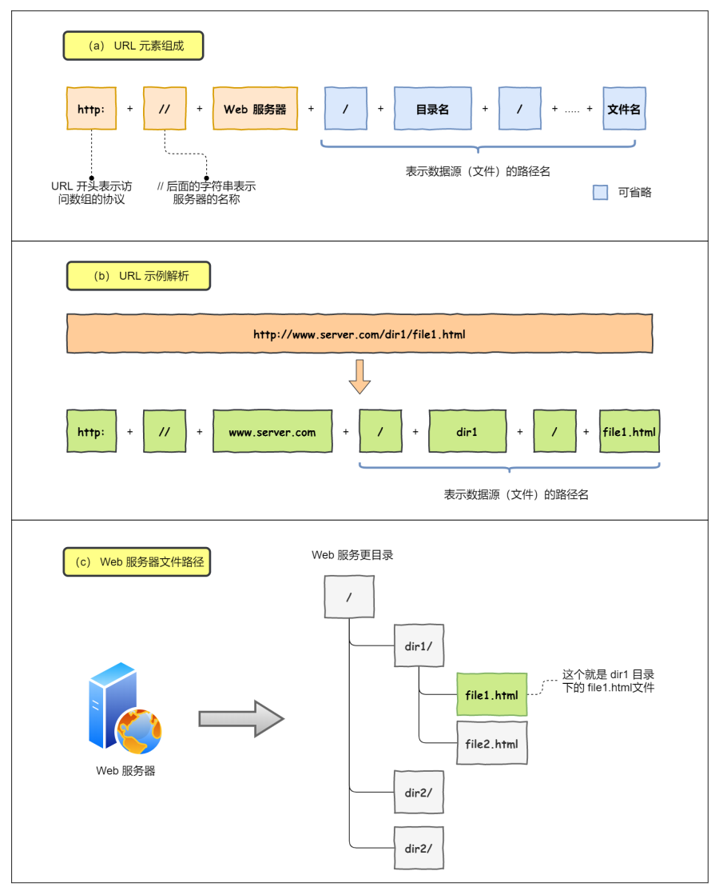

当没有路径名时，就代表访问根⽬录下事先设置的默认⽂件，也就是 /index.html 或者 /default.html 这些⽂件，这样就不会发⽣混乱了。  

## ⽣产 HTTP 请求信息  

对 URL 进⾏解析之后，浏览器确定了 Web 服务器和⽂件名，接下来就是根据这些信息来⽣成 HTTP 请求消息了。  

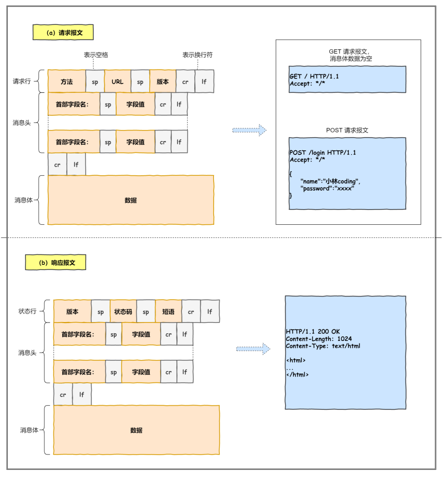

## DNS  

通过浏览器解析 URL 并⽣成 HTTP 消息后，需要委托操作系统将消息发送给 Web 服务器。但在发送之前，还有⼀项⼯作需要完成，那就是查询服务器域名对应的 IP 地址，因为委托操作系统发送消息时，必须提供通信对象的 IP 地址。  

### 域名的层级关系  

DNS 中的域名都是⽤句点来分隔的，⽐如 www.server.com ，这⾥的句点代表了不同层次之间的界限。在域名中， 越靠右的位置表示其层级越⾼。  

所以域名的层级关系类似⼀个树状结构：

- 根 DNS 服务器
- 顶级域 DNS 服务器（com）
- 权威 DNS 服务器（server.com）  

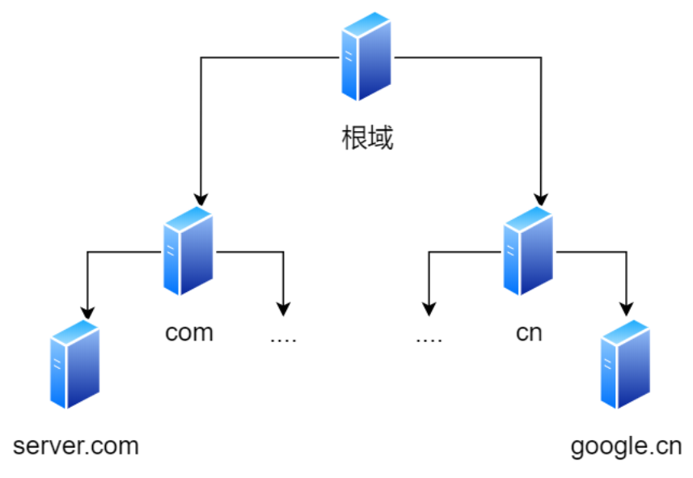

根域的 DNS 服务器信息保存在互联⽹中所有的 DNS 服务器中。这样⼀来，任何 DNS 服务器就都可以找到并访问根域 DNS 服务器了。因此，客户端只要能够找到任意⼀台 DNS 服务器，就可以通过它找到根域 DNS 服务器，然后再⼀路顺藤摸⽠找到位于下层的某台⽬标 DNS 服务器。  

### 域名解析的⼯作流程  

- 客户端⾸先会发出⼀个 DNS 请求，问 www.server.com 的 IP 是啥，并发给本地 DNS 服务器（也就是客户端的 TCP/IP 设置中填写的 DNS 服务器地址）
- 本地域名服务器收到客户端的请求后，如果缓存⾥的表格能找到 www.server.com，则它直接返回 IP 地址。如果没有，本地 DNS 会去问它的根域名服务器： “⽼⼤， 能告诉我 www.server.com 的 IP 地址吗？ ” 根域名服务器是最⾼层次的，它不直接⽤于域名解析，但能指明⼀条道路
- 根 DNS 收到来⾃本地 DNS 的请求后，发现后置是 .com，说： “www.server.com 这个域名归 .com 区域管理”，我给你 .com 顶级域名服务器地址给你，你去问问它吧 ”  
- 本地 DNS 收到顶级域名服务器的地址后，发起请求问“⽼⼆， 你能告诉我 www.server.com 的 IP 地址吗”  
- 顶级域名服务器说： “我给你负责 www.server.com 区域的权威 DNS 服务器的地址，你去问它应该能问到”  
- 本地 DNS 于是转向问权威 DNS 服务器： “⽼三， www.server.com对应的IP是啥呀？ ” server.com 的权威DNS 服务器，它是域名解析结果的原出处。为啥叫权威呢？就是我的域名我做主
- 权威 DNS 服务器查询后将对应的 IP 地址 X.X.X.X 告诉本地 DNS  
- 本地 DNS 再将 IP 地址返回客户端，客户端和⽬标建⽴连接   

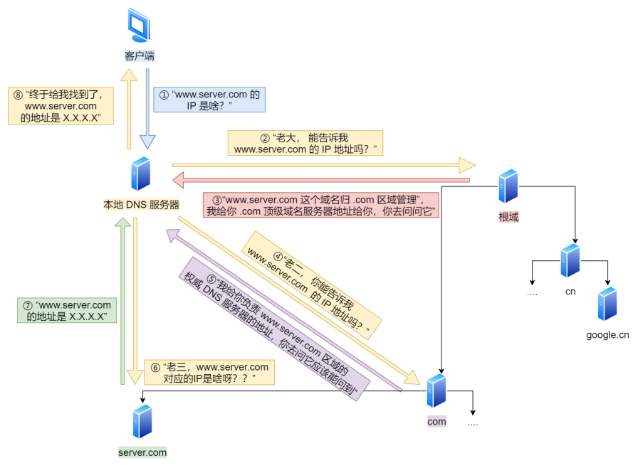

DNS 域名解析的过程蛮有意思的，整个过程就和我们⽇常⽣活中找⼈问路的过程类似， 只指路不带路。  

## 协议栈  

通过 DNS 获取到 IP 后，就可以把 HTTP 的传输⼯作交给操作系统中的协议栈。协议栈的内部分为⼏个部分，分别承担不同的⼯作。上下关系是有⼀定的规则的，上⾯的部分会向下⾯的部分委托⼯作，下⾯的部分收到委托的⼯作并执⾏。  

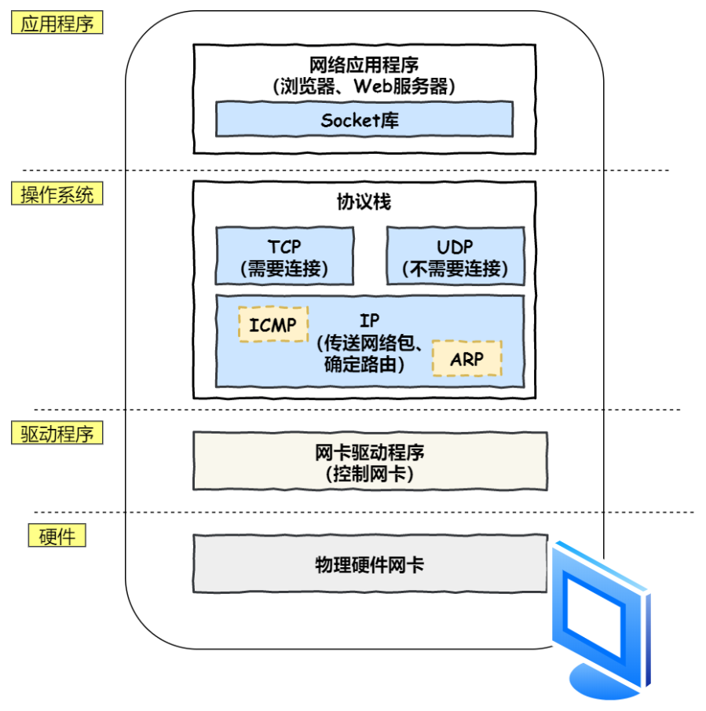

应⽤程序（浏览器）通过调⽤ Socket 库，来委托协议栈⼯作。协议栈的上半部分有两块，分别是负责收发数据的TCP 和 UDP 协议，它们两会接受应⽤层的委托执⾏收发数据的操作。协议栈的下⾯⼀半是⽤ IP 协议控制⽹络包收发操作，在互联⽹上传数据时，数据会被切分成⼀块块的⽹络包，⽽将⽹络包发送给对⽅的操作就是由 IP 负责的。  

此外 IP 中还包括 ICMP 协议和 ARP 协议：

- ICMP ⽤于告知⽹络包传送过程中产⽣的错误以及各种控制信息
- ARP ⽤于根据 IP 地址查询相应的以太⽹ MAC 地址

IP 下⾯的⽹卡驱动程序负责控制⽹卡硬件，⽽最下⾯的⽹卡则负责完成实际的收发操作，也就是对⽹线中的信号执⾏发送和接收操作。  

### 可靠传输 —— TCP  

HTTP 是基于 TCP 协议传输的。

#### TCP 包头格式  

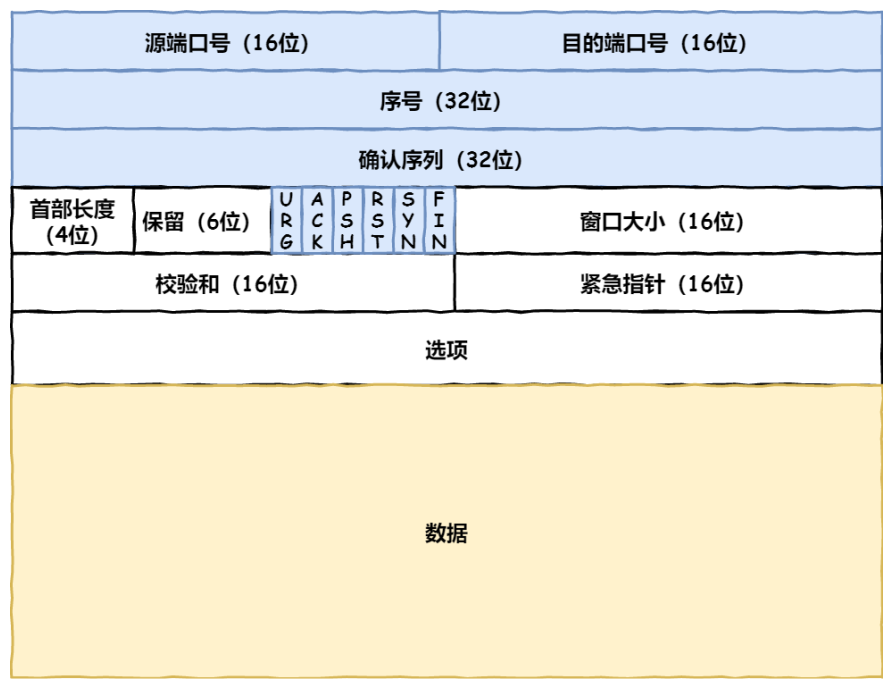

⾸先， 源端⼝号和⽬标端⼝号是不可少的，如果没有这两个端⼝号，数据就不知道应该发给哪个应⽤。  

包的序号，这个是为了解决包乱序的问题。  

确认号⽬的是确认发出去对⽅是否有收到。如果没有收到就应该重新发送，直到送达，这个是为了解决不丢包的问题。  

接下来还有⼀些状态位。例如 SYN 是发起⼀个连接， ACK 是回复， RST 是重新连接， FIN 是结束连接等。 TCP 是⾯向连接的，因⽽双⽅要维护连接的状态，这些带状态位的包的发送，会引起双⽅的状态变更。  

还有⼀个重要的就是窗⼝⼤⼩。 TCP 要做流量控制，通信双⽅各声明⼀个窗⼝（缓存⼤⼩），标识⾃⼰当前能够的处理能⼒。  

除了做流量控制以外， TCP还会做拥塞控制，对于真正的通路堵⻋不堵⻋，它⽆能为⼒，唯⼀能做的就是控制⾃⼰，也即控制发送的速度。  

#### 三次握⼿建⽴连接  

在 HTTP 传输数据之前，⾸先需要 TCP 建⽴连接， TCP 连接的建⽴，通常称为三次握⼿。这个所谓的连接，只是双⽅计算机⾥维护⼀个状态机。

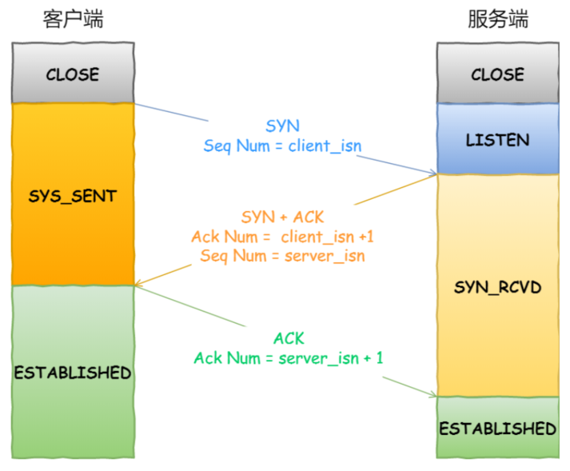

- ⼀开始，客户端和服务端都处于 CLOSED 状态。先是服务端主动监听某个端⼝，处于 LISTEN 状态
- 然后客户端主动发起连接 SYN ，之后处于 SYN-SENT 状态
- 服务端收到发起的连接，返回 SYN ，并且 ACK 客户端的 SYN ，之后处于 SYN-RCVD 状态
- 客户端收到服务端发送的 SYN 和 ACK 之后，发送 ACK 的 ACK ，之后处于 ESTABLISHED 状态，因为它⼀发⼀收成功了
- 服务端收到 ACK 的 ACK 之后，处于 ESTABLISHED 状态，因为它也⼀发⼀收了

所以三次握⼿⽬的是保证双⽅都有发送和接收的能⼒。  

在 Linux 可以通过 netstat -napt 命令查看 TCP 的连接状态：

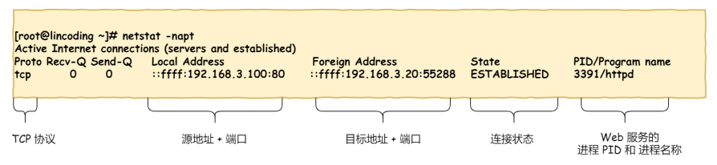

    #### TCP 分割数据  

如果 HTTP 请求消息⽐较⻓，超过了 MSS 的⻓度，这时 TCP 就需要把 HTTP 的数据拆解成⼀块块的数据发送，⽽不是⼀次性发送所有数据。  

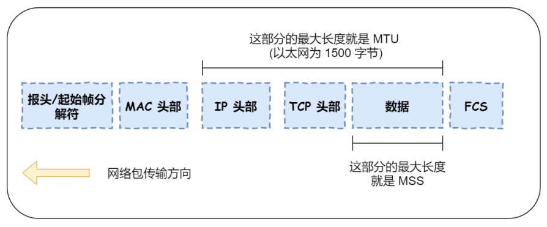

- MTU ：⼀个⽹络包的最⼤⻓度，以太⽹中⼀般为 1500 字节  
- MSS ：除去 IP 和 TCP 头部之后，⼀个⽹络包所能容纳的 TCP 数据的最⼤⻓度  

数据会被以 MSS 的⻓度为单位进⾏拆分，拆分出来的每⼀块数据都会被放进单独的⽹络包中。也就是在每个被拆分的数据加上 TCP 头信息，然后交给 IP 模块来发送数据。  

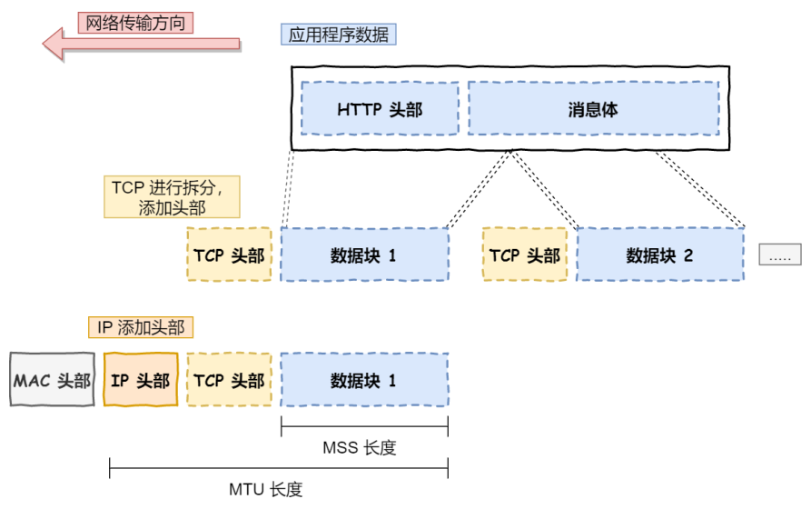

#### TCP 报⽂⽣成  

TCP 协议⾥⾯会有两个端⼝，⼀个是浏览器监听的端⼝（通常是随机⽣成的），⼀个是 Web 服务器监听的端⼝（HTTP 默认端⼝号是 80 ， HTTPS 默认端⼝号是 443 ）。  

在双⽅建⽴了连接后， TCP 报⽂中的数据部分就是存放 HTTP 头部 + 数据，组装好 TCP 报⽂之后，就需交给下⾯的⽹络层处理。⾄此，⽹络包的报⽂如下图。  

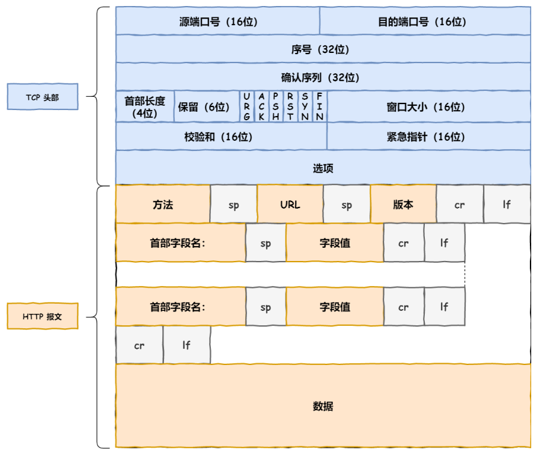

### 远程定位 —— IP  

TCP 模块在执⾏连接、收发、断开等各阶段操作时，都需要委托 IP 模块将数据封装成⽹络包发送给通信对象。  

#### IP 包头格式  

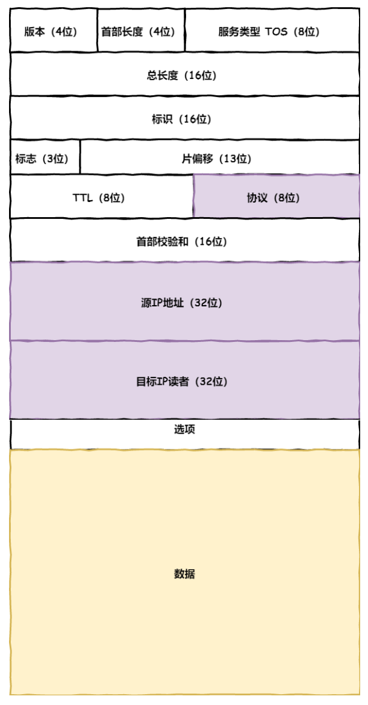

在 IP 协议⾥⾯需要有源地址 IP 和 ⽬标地址 IP：

- 源地址IP，即是客户端输出的 IP 地址
- ⽬标地址，即通过 DNS 域名解析得到的 Web 服务器 IP

因为 HTTP 是经过 TCP 传输的，所以在 IP 包头的协议号，要填写为 06 （⼗六进制），表示协议为 TCP。  

当存在多个⽹卡时，在填写源地址 IP 时，就需要判断到底应该填写哪个地址。这个判断相当于在多块⽹卡中判断应该使⽤哪个⼀块⽹卡来发送包。这个时候就需要根据路由表规则，来判断哪⼀个⽹卡作为源地址 IP。在 Linux 操作系统，我们可以使⽤ route -n 命令查看当前系统的路由表。  

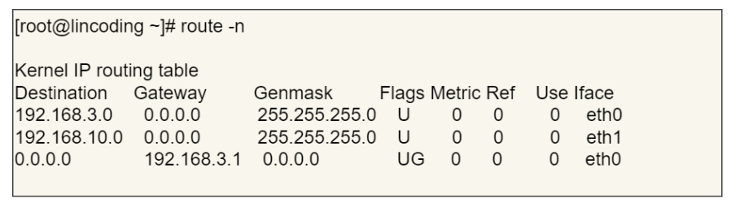

举个例⼦，根据上⾯的路由表，我们假设 Web 服务器的⽬标地址是 192.168.10.200 。  

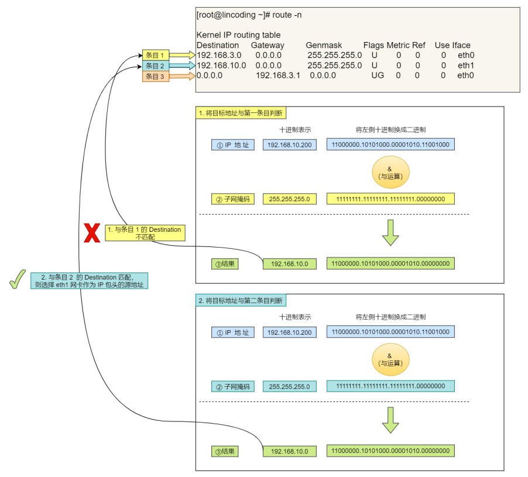

- ⾸先先和第⼀条⽬的⼦⽹掩码（Genmask ）进⾏ 与运算，得到结果为 192.168.10.0 ，但是第⼀个条⽬的 Destination 是 192.168.3.0 ，两者不⼀致所以匹配失败  
- 再与第⼆条⽬的⼦⽹掩码进⾏ 与运算，得到的结果为 192.168.10.0 ，与第⼆条⽬的 Destination 192.168.10.0 匹配成功，所以将使⽤ eth1 ⽹卡的 IP 地址作为 IP 包头的源地址  

那么假设 Web 服务器的⽬标地址是 10.100.20.100 ，那么依然依照上⾯的路由表规则判断，判断后的结果是和第三条⽬匹配。第三条⽬⽐较特殊，它⽬标地址和⼦⽹掩码都是 0.0.0.0 ，这表示默认⽹关，如果其他所有条⽬都⽆法匹配，就会⾃动匹配这⼀⾏。并且后续就把包发给路由器， Gateway 即是路由器的 IP 地址。  

#### IP 报⽂⽣成  

⽹络包的报⽂如下图：

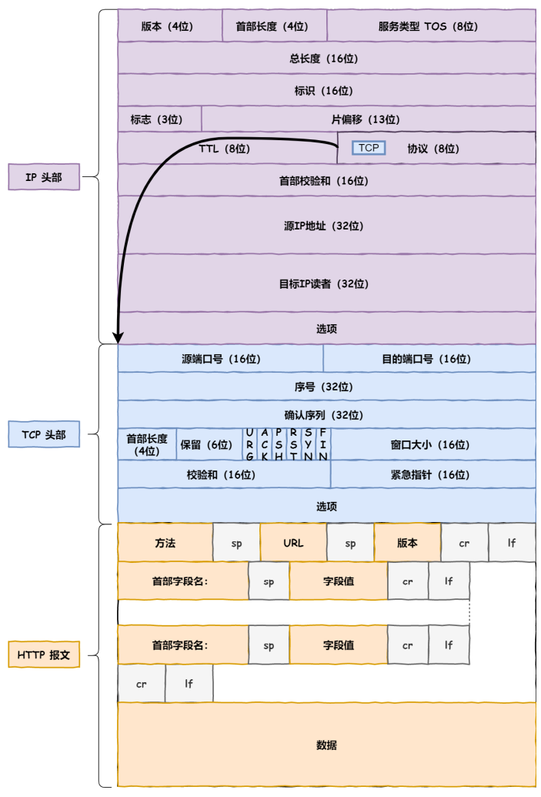

### 两点传输 —— MAC  

⽣成了 IP 头部之后，接下来⽹络包还需要在 IP 头部的前⾯加上 MAC 头部。  

#### MAC 包头格式  

MAC 头部是以太⽹使⽤的头部，它包含了接收⽅和发送⽅的 MAC 地址等信息。  

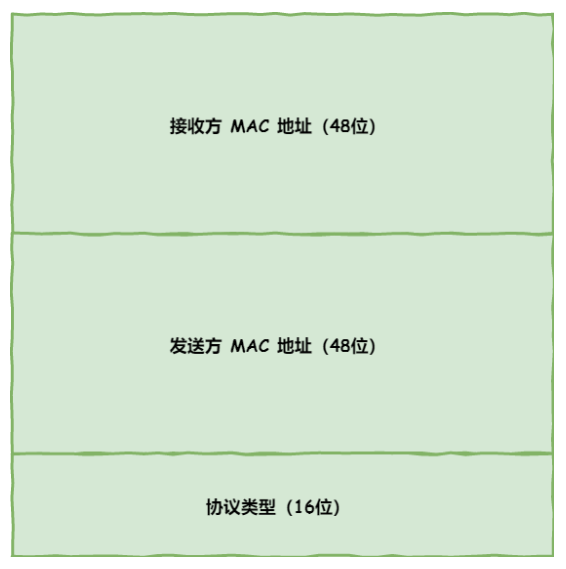

在 MAC 包头⾥需要发送⽅ MAC 地址和接收⽅⽬标 MAC 地址，⽤于两点之间的传输。
⼀般在 TCP/IP 通信⾥， MAC 包头的协议类型只使⽤：

- 0800 ： IP 协议
- 0806 ： ARP 协议  

#### MAC 发送⽅和接收⽅如何确认  

发送⽅的 MAC 地址获取就⽐较简单了， MAC 地址是在⽹卡⽣产时写⼊到 ROM ⾥的，只要将这个值读取出来写⼊到 MAC 头部就可以了。

接收⽅的 MAC 地址就有点复杂了，只要告诉以太⽹对⽅的 MAC 的地址，以太⽹就会帮我们把包发送过去，那么很显然这⾥应该填写对⽅的 MAC 地址。  

此时就需要 ARP 协议帮我们找到路由器的 MAC 地址。ARP 协议会在以太⽹中以⼴播的形式，对以太⽹所有的设备喊出： “这个 IP 地址是谁的？请把你的 MAC 地址告诉我”。然后就会有⼈回答： “这个 IP 地址是我的，我的 MAC 地址是 XXXX”。如果对⽅和⾃⼰处于同⼀个⼦⽹中，那么通过上⾯的操作就可以得到对⽅的 MAC 地址。然后，我们将这个 MAC 地址写⼊ MAC 头部， MAC 头部就完成了。    

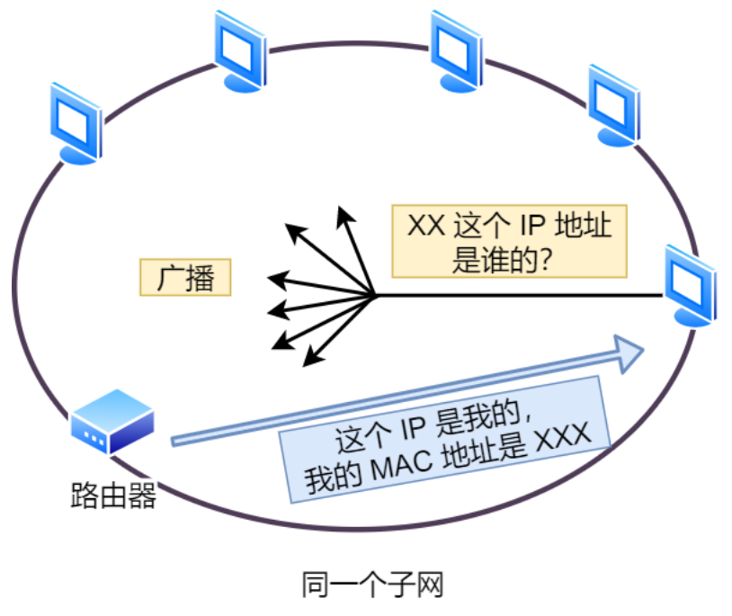

在后续操作系统会把本次查询结果放到⼀块叫做 ARP 缓存的内存空间留着以后⽤，不过缓存的时间就⼏分钟。  

也就是说，在发包时：  

- 先查询 ARP 缓存，如果其中已经保存了对⽅的 MAC 地址，就不需要发送 ARP 查询，直接使⽤ ARP 缓存中的地址
- ⽽当 ARP 缓存中不存在对⽅ MAC 地址时，则发送 ARP ⼴播查询  

查看 ARP 缓存内容：

在 Linux 系统中，我们可以使⽤ arp -a 命令来查看 ARP 缓存的内容：

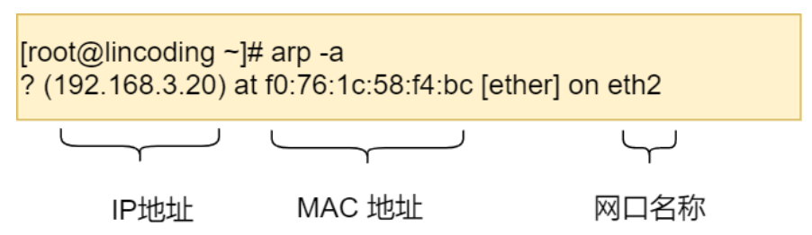

#### MAC 报⽂⽣成  

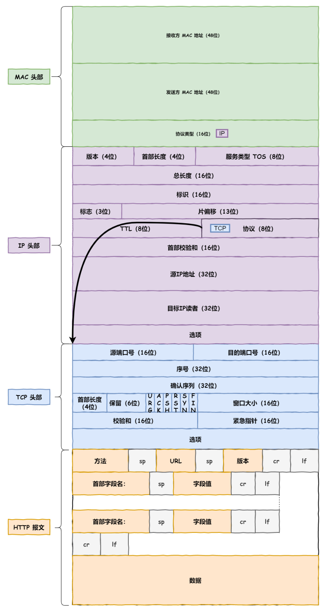

### 出⼝ —— ⽹卡  

⽹络包只是存放在内存中的⼀串⼆进制数字信息，没有办法直接发送给对⽅。因此，我们需要将数字信息转换为电信号，才能在⽹线上传输，也就是说，这才是真正的数据发送过程。负责执⾏这⼀操作的是⽹卡，要控制⽹卡还需要靠⽹卡驱动程序。⽹卡驱动从 IP 模块获取到包之后，会将其复制到⽹卡内的缓存区中，接着会在其开头加上报头和起始帧分界符，在末尾加上⽤于检测错误的帧校验序列。  

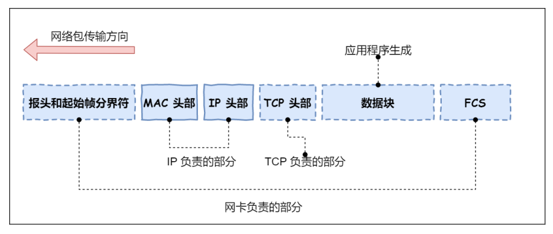

- 起始帧分界符是⼀个⽤来表示包起始位置的标记  
- 末尾的 FCS （帧校验序列）⽤来检查包传输过程是否有损坏  

最后⽹卡会将包转为电信号，通过⽹线发送出去。  

### 送别者 —— 交换机  

交换机的设计是将⽹络包原样转发到⽬的地。交换机⼯作在 MAC 层，也称为⼆层⽹络设备。  

#### 交换机的包接收操作  

⾸先，电信号到达⽹线接⼝，交换机⾥的模块进⾏接收，接下来交换机⾥的模块将电信号转换为数字信号。然后通过包末尾的 FCS 校验错误，如果没问题则放到缓冲区。这部分操作基本和计算机的⽹卡相同，但交换机的⼯作⽅式和⽹卡不同。  

计算机的⽹卡本身具有 MAC 地址，并通过核对收到的包的接收⽅ MAC 地址判断是不是发给⾃⼰的，如果不是发给⾃⼰的则丢弃；相对地，交换机的端⼝不核对接收⽅ MAC 地址，⽽是直接接收所有的包并存放到缓冲区中。因此，和⽹卡不同， 交换机的端⼝不具有 MAC 地址。将包存⼊缓冲区后，接下来需要查询⼀下这个包的接收⽅ MAC 地址是否已经在 MAC 地址表中有记录了。交换机的 MAC 地址表主要包含两个信息：  

- ⼀个是设备的 MAC 地址  
- 另⼀个是该设备连接在交换机的哪个端⼝上  

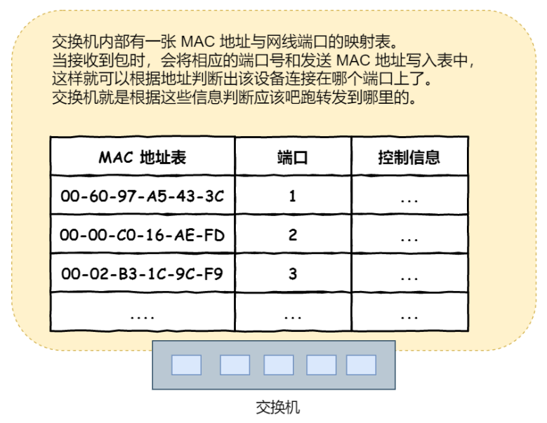

举个例⼦，如果收到的包的接收⽅ MAC 地址为 00-02-B3-1C-9C-F9 ，则与图中表中的第 3 ⾏匹配，根据端⼝列的信息，可知这个地址位于 3 号端⼝上，然后就可以通过交换电路将包发送到相应的端⼝了。所以， 交换机根据 MAC 地址表查找 MAC 地址，然后将信号发送到相应的端⼝。  

#### 当 MAC 地址表找不到指定的 MAC 地址会怎么样  

地址表中找不到指定的 MAC 地址。这可能是因为具有该地址的设备还没有向交换机发送过包，或者这个设备⼀段时间没有⼯作导致地址被从地址表中删除了。这种情况下，交换机⽆法判断应该把包转发到哪个端⼝，只能将包转发到除了源端⼝之外的所有端⼝上，⽆论该设备连接在哪个端⼝上都能收到这个包。这样做不会产⽣什么问题，因为以太⽹的设计本来就是将包发送到整个⽹络的，然后只有相应的接收者才接收包，⽽其他设备则会忽略这个包。发送了包之后⽬标设备会作出响应，只要返回了响应包，交换机就可以将它的地址写⼊ MAC 地址表，下次也就不需要把包发到所有端⼝。    

此外，如果接收⽅ MAC 地址是⼀个⼴播地址，那么交换机会将包发送到除源端⼝之外的所有端⼝。  以下两个属于⼴播地址：

- MAC 地址中的 FF:FF:FF:FF:FF:FF
- IP 地址中的 255.255.255.255  

### 出境⼤⻔ —— 路由器  

#### 路由器与交换机的区别  

⽹络包经过交换机之后，现在到达了路由器，并在此被转发到下⼀个路由器或⽬标设备。这⼀步转发的⼯作原理和交换机类似，也是通过查表判断包转发的⽬标。不过在具体的操作过程上，路由器和交换机是有区别的：

- 因为路由器是基于 IP 设计的，俗称三层⽹络设备，路由器的各个端⼝都具有 MAC 地址和 IP 地址  
- ⽽交换机是基于以太⽹设计的，俗称⼆层⽹络设备，交换机的端⼝不具有 MAC 地址  

#### 路由器基本原理  

路由器的端⼝具有 MAC 地址，因此它就能够成为以太⽹的发送⽅和接收⽅；同时还具有 IP 地址，从这个意义上来说，它和计算机的⽹卡是⼀样的。当转发包时，⾸先路由器端⼝会接收发给⾃⼰的以太⽹包，然后路由表查询转发⽬标，再由相应的端⼝作为发送⽅将以太⽹包发送出去。  

#### 路由器的包接收操作  

⾸先，电信号到达⽹线接⼝部分，路由器中的模块会将电信号转成数字信号，然后通过包末尾的 FCS 进⾏错误校验。如果没问题则检查 MAC 头部中的接收⽅ MAC 地址，看看是不是发给⾃⼰的包，如果是就放到接收缓冲区中，否则就丢弃这个包。总的来说，路由器的端⼝都具有 MAC 地址，只接收与⾃身地址匹配的包，遇到不匹配的包则直接丢弃。  

#### 查询路由表确定输出端⼝  

完成包接收操作之后，路由器就会去掉包开头的 MAC 头部。MAC 头部的作⽤就是将包送达路由器，其中的接收⽅ MAC 地址就是路由器端⼝的 MAC 地址。因此，当包到达路由器之后， MAC 头部的任务就完成了，于是 MAC 头部就会被丢弃。接下来，路由器会根据 MAC 头部后⽅的 IP 头部中的内容进⾏包的转发操作。转发操作分为⼏个阶段，⾸先是查询路由表判断转发⽬标：

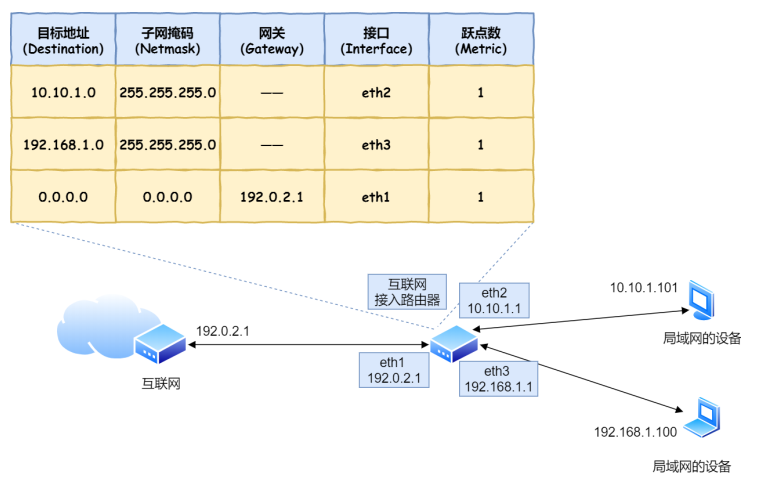

假设地址为 10.10.1.101 的计算机要向地址为 192.168.1.100 的服务器发送⼀个包，这个包先到达图中的路由器。  

判断转发⽬标的第⼀步，就是根据包的接收⽅ IP 地址查询路由表中的⽬标地址栏，以找到相匹配的记录。每个条⽬的⼦⽹掩码和 192.168.1.100 IP 做 & 与运算后，得到的结果与对应条⽬的⽬标地址进⾏匹配，如果匹配就会作为候选转发⽬标，如果不匹配就继续与下个条⽬进⾏路由匹配。如第⼆条⽬的⼦⽹掩码 255.255.255.0 与 192.168.1.100 IP 做 & 与运算后，得到结果是 192.168.1.0 ，这与第⼆条⽬的⽬标地址 192.168.1.0 匹配，第⼆条⽬记录就会被作为转发⽬标。 实在找不到匹配路由时，就会选择默认路由，路由表中⼦⽹掩码为 0.0.0.0 的记录表示默认路由。       

#### 路由器的发送操作  

接下来就会进⼊包的发送操作。

⾸先，我们需要根据路由表的⽹关列判断对⽅的地址：

- 如果⽹关是⼀个 IP 地址，则这个IP 地址就是我们要转发到的⽬标地址， 还未抵达终点，还需继续需要路由器转发
- 如果⽹关为空，则 IP 头部中的接收⽅ IP 地址就是要转发到的⽬标地址，也是就终于找到 IP 包头⾥的⽬标地址了，说明已抵达终点    

知道对⽅的 IP 地址之后，接下来需要通过 ARP 协议根据 IP 地址查询 MAC 地址，并将查询的结果作为接收⽅ MAC 地址。  

路由器也有 ARP 缓存，因此⾸先会在 ARP 缓存中查询，如果找不到则发送 ARP 查询请求。接下来是发送⽅ MAC 地址字段，这⾥填写输出端⼝的 MAC 地址。还有⼀个以太类型字段，填写 0800 （⼗六进制）表示 IP 协议。⽹络包完成后，接下来会将其转换成电信号并通过端⼝发送出去。这⼀步的⼯作过程和计算机也是相同的。发送出去的⽹络包会通过交换机到达下⼀个路由器。由于接收⽅ MAC 地址就是下⼀个路由器的地址，所以交换机会根据这⼀地址将包传输到下⼀个路由器。接下来，下⼀个路由器会将包转发给再下⼀个路由器，经过层层转发之后，⽹络包就到达了最终的⽬的地。  

在⽹络包传输的过程中， 源 IP 和⽬标 IP 始终是不会变的，⼀直变化的是 MAC 地址，因为需要 MAC 地址在以太⽹内进⾏两个设备之间的包传输。  

## 互相扒⽪ —— 服务器 与 客户端  

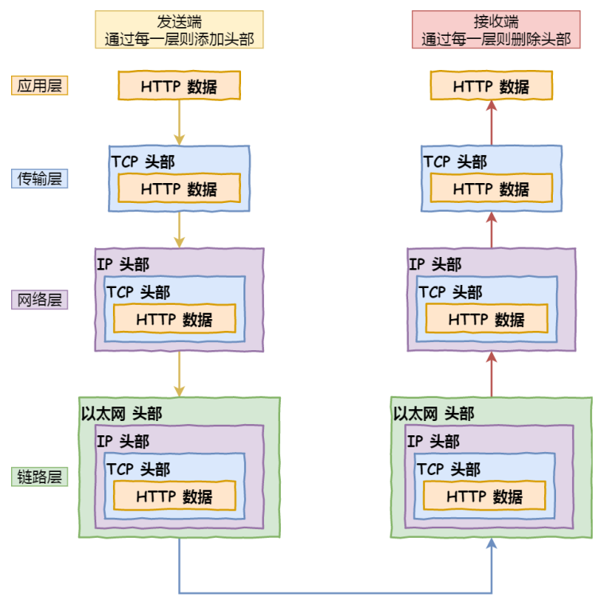

- 数据包抵达服务器后，服务器会先扒开数据包的 MAC 头部，查看是否和服务器⾃⼰的 MAC 地址符合，符合就将包收起来
- 接着继续扒开数据包的 IP 头，发现 IP 地址符合，根据 IP 头中协议项，知道⾃⼰上层是 TCP 协议
- 于是，扒开 TCP 的头，⾥⾯有序列号，需要看⼀看这个序列包是不是我想要的，如果是就放⼊缓存中然后返回⼀个 ACK，如果不是就丢弃。 TCP头部⾥⾯还有端⼝号， HTTP 的服务器正在监听这个端⼝号
- 于是，服务器⾃然就知道是 HTTP 进程想要这个包，于是就将包发给 HTTP 进程
- 服务器的 HTTP 进程看到，原来这个请求是要访问⼀个⻚⾯，于是就把这个⽹⻚封装在 HTTP 响应报⽂⾥
- HTTP 响应报⽂也需要穿上 TCP、 IP、 MAC 头部，不过这次是源地址是服务器 IP 地址，⽬的地址是客户端 IP 地址
- 穿好头部⾐服后，从⽹卡出去，交由交换机转发到出城的路由器，路由器就把响应数据包发到了下⼀个路由器，就这样跳啊跳
- 最后跳到了客户端的城⻔把⼿的路由器，路由器扒开 IP 头部发现是要找城内的⼈，于是⼜把包发给了城内的交换机，再由交换机转发到客户端
- 客户端收到了服务器的响应数据包后，同样也⾮常的⾼兴，客户能拆快递了
- 于是，客户端开始扒⽪，把收到的数据包的⽪扒剩 HTTP 响应报⽂后，交给浏览器去渲染⻚⾯，⼀份特别的数据包快递，就这样显示出来了
- 最后，客户端要离开了，向服务器发起了 TCP 四次挥⼿，⾄此双⽅的连接就断开了

# Linux 系统是如何收发⽹络包的  

## OSI 模型和 TCP/IP 模型

为了使得多种设备能通过⽹络相互通信，和为了解决各种不同设备在⽹络互联中的兼容性问题，国际标标准化组织制定了开放式系统互联通信参考模型（pen System Interconnection Reference Model），也就是 OSI ⽹络模型，该模型主要有 7 层，分别是应⽤层、表示层、会话层、传输层、⽹络层、数据链路层以及物理层。  

每⼀层负责的职能都不同，如下：

- 应⽤层，负责给应⽤程序提供统⼀的接⼝
- 表示层，负责把数据转换成兼容另⼀个系统能识别的格式
- 会话层，负责建⽴、管理和终⽌表示层实体之间的通信会话
- 传输层，负责端到端的数据传输
- ⽹络层，负责数据的路由、转发、分⽚
- 数据链路层，负责数据的封帧和差错检测，以及 MAC 寻址
- 物理层，负责在物理⽹络中传输数据帧

由于 OSI 模型实在太复杂，提出的也只是概念理论上的分层，并没有提供具体的实现⽅案。事实上，我们⽐较常⻅，也⽐较实⽤的是四层模型，即 TCP/IP ⽹络模型， Linux 系统正是按照这套⽹络模型来实现⽹络协议栈的。  

TCP/IP ⽹络模型共有 4 层，分别是应⽤层、传输层、⽹络层和⽹络接⼝层，每⼀层负责的职能如下：

- 应⽤层，负责向⽤户提供⼀组应⽤程序，⽐如 HTTP、 DNS、 FTP 等
- 传输层，负责端到端的通信，⽐如 TCP、 UDP 等
- ⽹络层，负责⽹络包的封装、分⽚、路由、转发，⽐如 IP、 ICMP 等
- ⽹络接⼝层，负责⽹络包在物理⽹络中的传输，⽐如⽹络包的封帧、 MAC 寻址、差错检测，以及通过⽹卡传输⽹络帧等

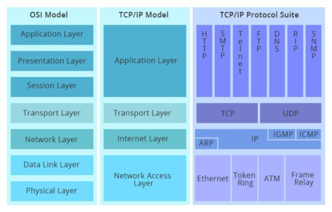

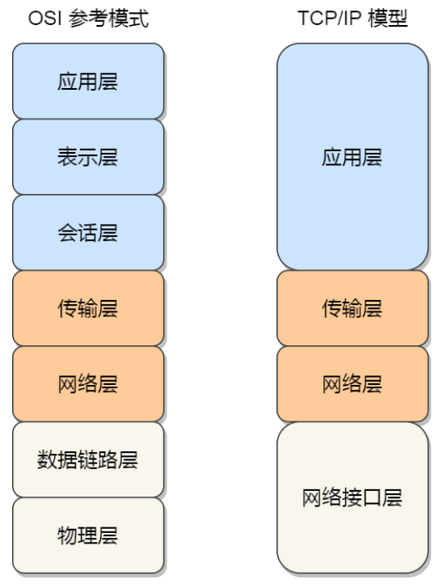

不过，我们常说的七层和四层负载均衡，是⽤ OSI ⽹络模型来描述的，七层对应的是应⽤层，四层对应的是传输层。  

## Linux ⽹络协议栈  

Linux ⽹络协议栈：

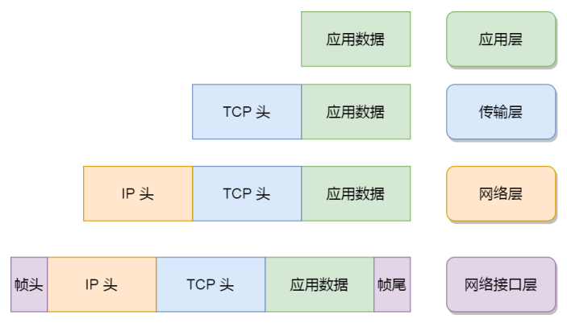

其中：

- 传输层，给应⽤数据前⾯增加了 TCP 头
- ⽹络层，给 TCP 数据包前⾯增加了 IP 头
- ⽹络接⼝层，给 IP 数据包前后分别增加了帧头和帧尾

这些新增和头部和尾部，都有各⾃的作⽤，也都是按照特定的协议格式填充，这每⼀层都增加了各⾃的协议头，那⾃然⽹络包的⼤⼩就增⼤了，但物理链路并不能传输任意⼤⼩的数据包，所以在以太⽹中，规定了最⼤传输单元（MTU）是 1500 字节，也就是规定了单次传输的最⼤ IP 包⼤⼩。  

当⽹络包超过 MTU 的⼤⼩，就会在⽹络层分⽚，以确保分⽚后的 IP 包不会超过 MTU ⼤⼩，如果 MTU 越⼩，需要的分包就越多，那么⽹络吞吐能⼒就越差，相反的，如果 MTU 越⼤，需要的分包就越⼩，那么⽹络吞吐能⼒就越好。  

Linux ⽹络协议栈就类似于 TCP/IP 的四层结构：   

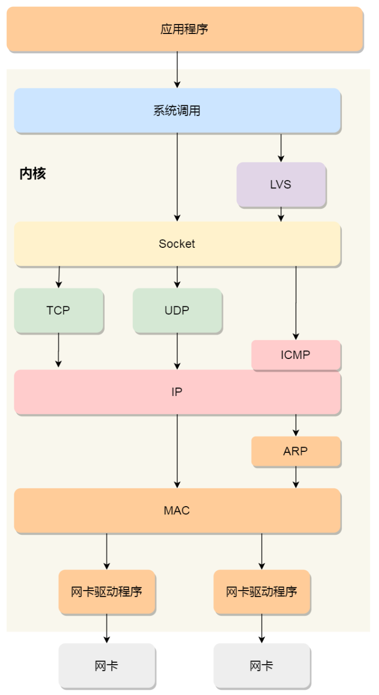

从上图的的⽹络协议栈，你可以看到：

- 应⽤程序需要通过系统调⽤，来跟 Socket 层进⾏数据交互
- Socket 层的下⾯就是传输层、⽹络层和⽹络接⼝层
- 最下⾯的⼀层，则是⽹卡驱动程序和硬件⽹卡设备

## Linux 接收⽹络包的流程  

