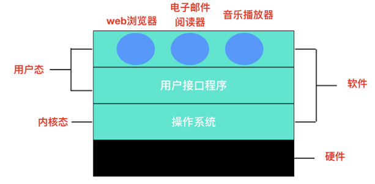
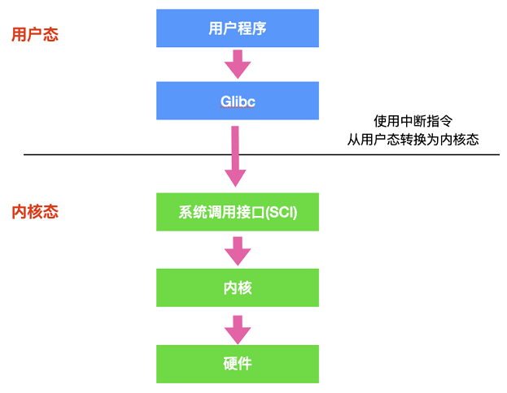

# 操作系统概念

操作系统是管理硬件和软件的一种应用程序。操作系统是运行在计算机上最重要的一种软件，它管理计算机的资源和进程以及所有的硬件和软件。它为计算机硬件和软件提供了一种中间层，使应用软件和硬件进行分离，让我们无需关注硬件的实现，把关注点更多放在软件应用上。

## 操作系统的主要功能

- 进程管理: 进程管理的主要作用就是任务调度，在单核处理器下，操作系统会为每个进程分配一个任务，进程管理的工作十分简单；而在多核处理器下，操作系统除了要为进程分配任务外，还要解决处理器的调度、分配和回收等问题
- 内存管理：内存管理主要是操作系统负责管理内存的分配、回收，在进程需要时分配内存以及在进程完成时回收内存，协调内存资源，通过合理的页面置换算法进行页面的换入换出
- 设备管理：根据确定的设备分配原则对设备进行分配，使设备与主机能够并行工作，为用户提供良好的设备使用界面
- 文件管理：有效地管理文件的存储空间，合理地组织和管理文件系统，为文件访问和文件保护提供更有效的方法及手段
  提供用户接口：操作系统提供了访问应用程序和硬件的接口，使用户能够通过应用程序发起系统调用从而操纵硬件，实现想要的功能

## 软件访问硬件的几种方式

I/O 操作可以分为四类：

- 直接访问：直接访问由用户进程直接控制主存或 CPU 和外围设备之间的信息传送。直接程序控制方式又称为忙等待方式
- 中断驱动：为了减少程序直接控制方式下 CPU 的等待时间以及提高系统的并行程度，系统引入了中断机制。中断机制引入后，外围设备仅当操作正常结束或异常结束时才向 CPU 发出中断请求。在 I/O 设备输入每个数据的过程中，由于无需 CPU 的干预，一定程度上实现了 CPU 与 I/O 设备的并行工作

上述两种方法的特点都是以 CPU 为中心，数据传送通过一段程序来实现，软件的传送手段限制了数据传送的速度。接下来介绍的这两种 I/O 控制方式采用硬件的方法来显示 I/O 的控制：

- DMA 直接内存访问：为了进一步减少 CPU 对 I/O 操作的干预，防止因并行操作设备过多使 CPU 来不及处理或因速度不匹配而造成的数据丢失现象，引入了 DMA 控制方式
- 通道控制方式：通道独立于 CPU 的专门负责输入输出控制的处理机，它控制设备与内存直接进行数据交换。有自己的通道指令，这些指令由 CPU 启动，并在操作结束时向 CPU 发出中断信号

# 用户态和内核态

用户态和内核态是操作系统的两种运行状态。

内核态：处于内核态的 CPU 可以访问任意的数据，包括外围设备，比如网卡、硬盘等，处于内核态的 CPU 可以从一个程序切换到另外一个程序，并且占用 CPU 不会发生抢占情况，一般处于特权级 0 的状态我们称之为内核态。

用户态：处于用户态的 CPU 只能受限的访问内存，并且不允许访问外围设备，用户态下的 CPU 不允许独占，也就是说 CPU 能够被其他程序获取。

## 用户态和内核态是如何切换的

所有的用户进程都是运行在用户态的，但是我们上面也说了，用户程序的访问能力有限，一些比较重要的比如从硬盘读取数据，从键盘获取数据的操作则是内核态才能做的事情，而这些数据却又对用户程序来说非常重要。所以就涉及到两种模式下的转换，即用户态 -> 内核态 -> 用户态，而唯一能够做这些操作的只有 系统调用，而能够执行系统调用的就只有 操作系统。

一般用户态 -> 内核态的转换我们都称之为 trap 进内核，也被称之为 陷阱指令：

