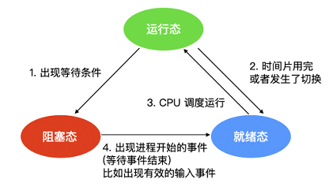
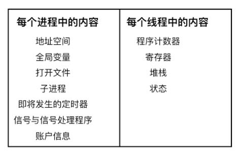

# 进程

进程就是正在执行程序的实例。操作系统负责管理所有正在运行的进程，操作系统会为每个进程分配特定的时间来占用 CPU，操作系统还会为每个进程分配特定的资源。

操作系统为了跟踪每个进程的活动状态，维护了一个进程表。在进程表的内部，列出了每个进程的状态以及每个进程使用的资源等。

## 上下文切换
对于单核单线程 CPU 而言，在某一时刻只能执行一条 CPU 指令。上下文切换是一种 将 CPU 资源从一个进程分配给另一个进程的机制。从用户角度看，计算机能够并行运行多个进程，这恰恰是操作系统通过快速上下文切换造成的结果。在切换的过程中，操作系统需要先存储当前进程的状态 (包括内存空间的指针，当前执行完的指令等等)，再读入下一个进程的状态，然后执行此进程。

## 进程终止的方式
进程的终止方式：

- 正常退出(自愿的)
- 错误退出(自愿的)
- 严重错误(非自愿的)
- 被其他进程杀死(非自愿的)

## 进程间的通信方式
进程间通信的方式主要有以下 7 种：

- 消息传递：消息传递是进程间实现通信和同步等待的机制，使用消息传递，进程间的交流不需要共享变量，直接就可以进行通信；消息传递一般分为发送方和接收方
- 先进先出队列：先进先出队列指的是两个不相关联进程间的通信，两个进程之间可以彼此相互进程通信，这是一种全双工通信方式
- 管道：管道用于两个相关进程之间的通信，这是一种半双工的通信方式，如果需要全双工，需要另外一个管道
- 直接通信：在这种进程通信的方式中，进程与进程之间只存在一条链接，进程间要明确通信双方的命名
- 间接通信：间接通信是通信双方不会直接建立连接，而是找到一个中介者，这个中介者可能是个对象等等，进程可以在其中放置消息，并且可以从中删除消息，以此达到进程间通信的目的
- 消息队列：消息队列是内核中存储消息的链表，它由消息队列标识符进行标识，这种方式能够在不同的进程之间提供全双工的通信连接
- 共享内存：共享内存是使用所有进程之间的内存来建立连接，这种类型需要同步进程访问来相互保护
  

# 进程的三态模型

- 运行态：运行态指的就是进程实际占用 CPU 时间片运行时
- 就绪态：就绪态指的是可运行，但因为其他进程正在运行而处于就绪状态
- 阻塞态：阻塞态又被称为睡眠态，它指的是进程不具备运行条件，正在等待被 CPU 调度。

逻辑上来说，运行态和就绪态是很相似的。这两种情况下都表示进程可运行，但是第二种情况没有获得 CPU 时间分片。第三种状态与前两种状态不同的原因是这个进程不能运行，CPU 空闲时也不能运行。

三种状态会涉及四种状态间的切换，在操作系统发现进程不能继续执行时会发生状态1的轮转，在某些系统中进程执行系统调用，例如 pause，来获取一个阻塞的状态。在其他系统中包括 UNIX，当进程从管道或特殊文件（例如终端）中读取没有可用的输入时，该进程会被自动终止。

转换 2 和转换 3 都是由进程调度程序（操作系统的一部分）引起的，进程本身不知道调度程序的存在。转换 2 的出现说明进程调度器认定当前进程已经运行了足够长的时间，是时候让其他进程运行 CPU 时间片了。当所有其他进程都运行过后，这时候该是让第一个进程重新获得 CPU 时间片的时候了，就会发生转换 3。

程序调度指的是，决定哪个进程优先被运行和运行多久，这是很重要的一点。已经设计出许多算法来尝试平衡系统整体效率与各个流程之间的竞争需求。

当进程等待的一个外部事件发生时（如从外部输入一些数据后），则发生转换 4。如果此时没有其他进程在运行，则立刻触发转换 3，该进程便开始运行，否则该进程会处于就绪阶段，等待 CPU 空闲后再轮到它运行。
————————————————
版权声明：本文为CSDN博主「程序员cxuan」的原创文章，遵循CC 4.0 BY-SA版权协议，转载请附上原文出处链接及本声明。
原文链接：https://blog.csdn.net/qq_36894974/article/details/115654242

## 线程

进程是正在运行的程序的实例，而线程其实就是进程中的单条流向，因为线程具有进程中的某些属性，所以线程又被称为轻量级的进程。

## 区别

进程和线程持有的资源：

线程不像进程那样具有很强的独立性，线程之间会共享数据

创建线程的开销要比进程小很多，因为创建线程仅仅需要`堆栈指针`和`程序计数器`就可以了，而创建进程需要操作系统分配新的地址空间，数据资源等，这个开销比较大。

多线程编程的好处：

- 能够提高对用户的响应顺序
- 在流程中的资源共享
- 比较经济适用
- 能够对多线程架构有深入的理解