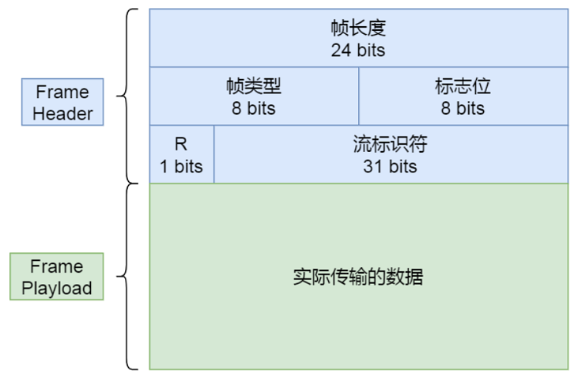
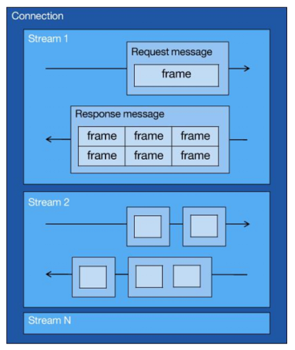
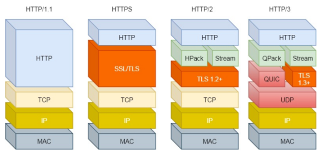

# HTTP/1.1 

HTTP/1.1 相⽐ HTTP/1.0 性能上的改进：

- 使⽤ TCP ⻓连接的⽅式改善了 HTTP/1.0 短连接造成的性能开销
- ⽀持管道⽹络传输，只要第⼀个请求发出去了，不必等其回来，就可以发第⼆个请求出去，可以减少整体的响应时间

但 HTTP/1.1 还是有性能瓶颈：  

- 请求/响应头部未经压缩就发送，⾸部信息越多延迟越⼤。只能压缩 Body 的部分  
- 发送冗⻓的⾸部。每次互相发送相同的⾸部造成的浪费较多  
- 服务器是按请求的顺序响应的，如果服务器响应慢，会招致客户端⼀直请求不到数据，也就是队头阻塞  
- 没有请求优先级控制  
- 请求只能从客户端开始，服务器只能被动响应 

优化的策略：

为了解决 HTTP/1.1 性能问题，⼏个常⻅的优化⼿段：    

- 将多张⼩图合并成⼀张⼤图供浏览器 JavaScript 来切割使⽤，这样可以将多个请求合并成⼀个请求，但是带来了新的问题，当某张⼩图⽚更新了，那么需要重新请求⼤图⽚，浪费了⼤量的⽹络带宽  
- 将图⽚的⼆进制数据通过 base64 编码后，把编码数据嵌⼊到 HTML 或 CSS ⽂件中，以此来减少⽹络请求次数  
- 将多个体积较⼩的 JavaScript ⽂件使⽤ webpack 等⼯具打包成⼀个体积更⼤的 JavaScript ⽂件，以⼀个请求替代了很多个请求，但是带来的问题，当某个 js ⽂件变化了，需要重新请求同⼀个包⾥的所有 js ⽂件
- 将同⼀个⻚⾯的资源分散到不同域名，提升并发连接上限，因为浏览器通常对同⼀域名的 HTTP 连接最⼤只能是 6 个   

# HTTP/2  

HTTP/2 协议是基于 HTTPS 的，所以 HTTP/2 的安全性也是有保障的。  

HTTP/2 做到了兼容 HTTP/1.1：

- 第⼀点，HTTP/2 没有在 URI ⾥引⼊新的协议名，仍然⽤ http:// 表示明⽂协议，⽤ https:// 表示加密协议，于是只需要浏览器和服务器在背后⾃动升级协议，这样可以让⽤户意识不到协议的升级，很好的实现了协议的平滑升级
- 第⼆点，只在应⽤层做了改变，还是基于 TCP 协议传输，应⽤层⽅⾯为了保持功能上的兼容，HTTP/2 把 HTTP 分解成了语义和语法两个部分，语义层不做改动，与 HTTP/1.1 完全⼀致，⽐如请求⽅法、状态码、头字段等规则保留不变。HTTP/2 在语法层⾯做了很多改造，基本改变了 HTTP 报⽂的传输格式

那 HTTP/2 相⽐ HTTP/1.1 性能上的改进：  

- 头部压缩  
- ⼆进制格式报⽂
- 基于数据流
- 多路复⽤  
- 服务器推送  

## 头部压缩

HTTP/2 没使⽤常⻅的 gzip 压缩⽅式来压缩头部，⽽是开发了 HPACK 算法， HPACK 算法主要包含三个组成部分：  

- 静态字典
- 动态字典
- Huffman 编码（压缩算法）

客户端和服务器两端都会建⽴和维护字典，⽤⻓度较⼩的索引号表示重复的字符串，再⽤ Huffman 编码压缩数据， 可达到 50%~90% 的⾼压缩率。  

静态表编码：

HTTP/2 为⾼频出现在头部的字符串和字段建⽴了⼀张静态表，它是写⼊到 HTTP/2 框架⾥的不会变化的，静态表⾥共有 61 组：

表中的 Index 表示索引（Key），Header Value 表示索引对应的 Value， Header Name 表示字段的名字，⽐如 Index 为 2 代表 GET， Index 为 8 代表状态码 200。表中有的 Index 没有对应的 Header Value，这是因为这些 Value 并不是固定的⽽是变化的，这些 Value 都会经过 Huffman 编码后，才会发送出去。  

根据 RFC7541 规范，如果头部字段属于静态表范围，并且 Value 是变化，那么它的 HTTP/2 头部前 2 位固定为01 ，所以整个头部格式如下图：  

HTTP/2 头部由于基于⼆进制编码，就不需要冒号空格和末尾的 "\r\n" 作为分隔符，于是改⽤表示字符串⻓度（Value Length）来分割 Index 和 Value。  

动态表编码：

静态表只包含了 61 种⾼频出现在头部的字符串，不在静态表范围内的头部字符串就要⾃⾏构建动态表，它的 Index 从 62 起步，会在编码解码的时候随时更新。第⼀次发送时头部中的 user-agent  字段数据有上百个字节，经过 Huffman 编码发送出去后，客户端和服务器双⽅都会更新⾃⼰的动态表，添加⼀个新的 Index 号 62。 那么在下⼀次发送的时候，就不⽤重复发这个字段的数据了，只⽤发 1 个字节的 Index 号就好了，因为双⽅都可以根据⾃⼰的动态表获取到字段的数据。  

所以，使得动态表⽣效有⼀个前提： 必须同⼀个连接上，重复传输完全相同的 HTTP 头部。如果消息字段在 1 个连接上只发送了 1 次，或者重复传输时，字段总是略有变化，动态表就⽆法被充分利⽤了。  

因此，随着在同⼀ HTTP/2 连接上发送的报⽂越来越多，客户端和服务器双⽅的字典积累的越来越多，理论上最终每个头部字段都会变成 1 个字节的 Index，这样便避免了⼤量的冗余数据的传输，⼤⼤节约了带宽。动态表越⼤，占⽤的内存也就越⼤，如果占⽤了太多内存，是会影响服务器性能的，因此 Web 服务器都会提供类似 http2_max_requests 的配置，⽤于限制⼀个连接上能够传输的请求数量，避免动态表⽆限增⼤，请求数量到达上限后，就会关闭 HTTP/2 连接来释放内存。  

综上， HTTP/2 头部的编码通过静态表、动态表、 Huffman 编码共同完成的。 

## ⼆进制帧  

HTTP/2 厉害的地⽅在于将 HTTP/1 的⽂本格式改成⼆进制格式传输数据，极⼤提⾼了 HTTP 传输效率，⽽且⼆进制数据使⽤位运算能⾼效解析。  

HTTP/2 把响应报⽂划分成了两个帧（Frame） ，图中的 HEADERS（⾸部）和 DATA（消息负载） 是帧的类型，也就是说⼀条 HTTP 响应，划分成了两个帧来传输，并且采⽤⼆进制来编码。  

HTTP/2 ⼆进制帧的结构如下图：  

- 帧头很⼩，只有 9 个字节，帧开头的前 3 个字节表示帧数据的⻓度
- 帧⻓度后⾯的⼀个字节是表示帧的类型， HTTP/2 总共定义了 10 种类型的帧，⼀般分为数据帧和控制帧两类，如下表：

- 帧类型后⾯的⼀个字节是标志位，可以保存 8 个标志位，⽤于携带简单的控制信息，⽐如：  
  - END_HEADERS 表示头数据结束标志，相当于 HTTP/1 ⾥头后的空⾏（“\r\n”）  
  - END_STREAM 表示单⽅向数据发送结束，后续不会再有数据帧  
  - PRIORITY 表示流的优先级  

- 帧头的最后 4 个字节是流标识符（Stream ID），但最⾼位被保留不⽤，只有 31 位可以使⽤，因此流标识符的最⼤值是 2^31，⼤约是 21 亿，它的作⽤是⽤来标识该 Fream 属于哪个 Stream，接收⽅可以根据这个信息从乱序的帧⾥找到相同 Stream ID 的帧，有序组装信息
- 最后⾯就是帧数据了，它存放的是通过 HPACK 算法压缩过的 HTTP 头部和包体

## 并发传输  

HTTP/1.1 的实现是基于请求-响应模型的。同⼀个连接中， HTTP 完成⼀个事务（请求与响应），才能处理下⼀个事务，也就是说在发出请求等待响应的过程中，是没办法做其他事情的，如果响应迟迟不来，那么后续的请求是⽆法发送的，也造成了队头阻塞的问题。  

HTTP/2 就很⽜逼了，通过 Stream 这个设计， 多个 Stream 复⽤⼀条 TCP 连接，达到并发的效果，解决了HTTP/1.1 队头阻塞的问题，提⾼了 HTTP 传输的吞吐量。 HTTP/2 中的 Stream、 Message、 Frame：

- 1 个 TCP 连接包含⼀个或者多个 Stream， Stream 是 HTTP/2 并发的关键技术
- Stream ⾥可以包含 1 个或多个 Message， Message 对应 HTTP/1 中的请求或响应，由 HTTP 头部和包体构成
- Message ⾥包含⼀条或者多个 Frame， Frame 是 HTTP/2 最⼩单位，以⼆进制压缩格式存放 HTTP/1 中的内容（头部和包体）  

在 HTTP/2 连接上， 不同 Stream 的帧是可以乱序发送的（因此可以并发不同的 Stream ） ，因为每个帧的头部会携带 Stream ID 信息，所以接收端可以通过 Stream ID 有序组装成 HTTP 消息，⽽同⼀ Stream 内部的帧必须是严格有序的。  

客户端和服务器双⽅都可以建⽴ Stream， Stream ID 也是有区别的，客户端建⽴的 Stream 必须是奇数号，⽽服务器建⽴的 Stream 必须是偶数号。同⼀个连接中的 Stream ID 是不能复⽤的，只能顺序递增，所以当 Stream ID 耗尽时，需要发⼀个控制帧 GOAWAY ，⽤来关闭 TCP 连接。  

HTTP/2 通过 Stream 实现的并发，⽐ HTTP/1.1 通过 TCP 连接实现并发要⽜逼的多， 因为当 HTTP/2 实现 100 个并发 Stream 时，只需要建⽴⼀次 TCP 连接，⽽ HTTP/1.1 需要建⽴ 100 个 TCP 连接，每个 TCP 连接都要经过TCP 握⼿、慢启动以及 TLS 握⼿过程，这些都是很耗时的。  

HTTP/2 还可以对每个 Stream 设置不同优先级，帧头中的标志位可以设置优先级，⽐如客户端访问 HTML/CSS 和图⽚资源时，希望服务器先传递 HTML/CSS，再传图⽚，那么就可以通过设置 Stream 的优先级来实现，以此提⾼⽤户体验。  

## 服务器主动推送

HTTP/1.1 不⽀持服务器主动推送资源给客户端，都是由客户端向服务器发起请求后，才能获取到服务器响应的资源。  

⽐如，客户端通过 HTTP/1.1 请求从服务器那获取到了 HTML ⽂件，⽽ HTML 可能还需要依赖 CSS 来渲染⻚⾯，这时客户端还要再发起获取 CSS ⽂件的请求，需要两次消息往返：

在 HTTP/2 中，客户端在访问 HTML 时，服务器可以直接主动推送 CSS ⽂件，减少了消息传递的次数。  

客户端发起的请求，必须使⽤的是奇数号 Stream，服务器主动的推送，使⽤的是偶数号 Stream。服务器在推送资源时，会通过 PUSH_PROMISE 帧传输 HTTP 头部，并通过帧中的 Promised Stream ID 字段告知客户端，接下来会在偶数号 Stream 中发送包体。  

## 缺陷

HTTP/2 通过头部压缩、⼆进制编码、多路复⽤、服务器推送等新特性⼤幅度提升了 HTTP/1.1 的性能，⽽美中不⾜的是 HTTP/2 协议是基于 TCP 实现的，于是存在的缺陷有三个：

- 队头阻塞  
- TCP 与 TLS 的握⼿时延迟  
- ⽹络迁移需要重新连接  

这些问题都是 TCP 协议固有的问题，⽆论应⽤层的 HTTP/2 在怎么设计都⽆法逃脱。要解决这个问题，就必须把传输层协议替换成 UDP，这个⼤胆的决定， HTTP/3 做了！  

### 队头阻塞  

HTTP/2 多个请求是跑在⼀个 TCP 连接中的，那么当 TCP 丢包时，整个 TCP 都要等待重传，那么就会阻塞该TCP 连接中的所有请求。  

因为 TCP 是字节流协议， TCP 层必须保证收到的字节数据是完整且有序的，如果序列号较低的 TCP 段在⽹络传输中丢失了，即使序列号较⾼的 TCP 段已经被接收了，应⽤层也⽆法从内核中读取到这部分数据，从 HTTP 视⻆看，就是请求被阻塞了。  

图中发送⽅发送了很多个 packet，每个 packet 都有⾃⼰的序号，你可以认为是 TCP 的序列号，其中 packet 3 在⽹络中丢失了，即使 packet 4-6 被接收⽅收到后，由于内核中的 TCP 数据不是连续的，于是接收⽅的应⽤层就⽆法从内核中读取到，只有等到 packet 3 重传后，接收⽅的应⽤层才可以从内核中读取到数据，这就是 HTTP/2 的队头阻塞问题，是在 TCP 层⾯发⽣的。  

### TCP 与 TLS 的握⼿时延迟  

发起 HTTP 请求时，需要经过 TCP 三次握⼿和 TLS 四次握⼿（TLS 1.2）的过程，因此共需要 3 个 RTT 的时延才能发出请求数据。

TCP 由于具有拥塞控制的特性，所以刚建⽴连接的 TCP 会有个慢启动的过程，它会对 TCP 连接产⽣"减速"效果。  

### ⽹络迁移需要重新连接  

⼀个 TCP 连接是由四元组（源 IP 地址，源端⼝，⽬标 IP 地址，⽬标端⼝）确定的，这意味着如果 IP 地址或者端⼝变动了，就会导致需要 TCP 与 TLS 重新握⼿，这不利于移动设备切换⽹络的场景，⽐如 4G ⽹络环境切换成 WIFI。  

# HTTP/3

## QUIC 协议

UDP 是⼀个简单、不可靠的传输协议，⽽且是 UDP 包之间是⽆序的，也没有依赖关系。⽽且， UDP 是不需要连接的，也就不需要握⼿和挥⼿的过程，所以天然的就⽐ TCP 快。    

HTTP/3  不仅仅只是简单将传输协议替换成了 UDP，还基于 UDP 协议在应⽤层实现了 QUIC 协议，它具有类似 TCP 的连接管理、拥塞窗⼝、流量控制的⽹络特性，相当于将不可靠传输的 UDP 协议变成“可靠”的了，所以不⽤担⼼数据包丢失的问题。  

QUIC 协议的优点有很多，比如：

- ⽆队头阻塞
- 更快的连接建⽴
- 连接迁移

### ⽆队头阻塞  

QUIC 协议也有类似 HTTP/2 Stream 与多路复⽤的概念，也是可以在同⼀条连接上并发传输多个 Stream，Stream 可以认为就是⼀条 HTTP 请求。由于 QUIC 使⽤的传输协议是 UDP，UDP 不关⼼数据包的顺序，如果数据包丢失，UDP 也不关⼼。    

不过 QUIC 协议会保证数据包的可靠性，每个数据包都有⼀个序号唯⼀标识。当某个流中的⼀个数据包丢失了，即使该流的其他数据包到达了，数据也⽆法被 HTTP/3 读取，直到 QUIC 重传丢失的报⽂，数据才会交给 HTTP/3。⽽其他流的数据报⽂只要被完整接收，TTP/3 就可以读取到数据。这与 HTTP/2 不同， HTTP/2 只要某个流中的数据包丢失了，其他流也会因此受影响。所以， QUIC 连接上的多个 Stream 之间并没有依赖，都是独⽴的，某个流发⽣丢包了，只会影响该流，其他流不受影响。    

### 更快的连接建⽴  

对于 HTTP/1 和 HTTP/2 协议， TCP 和 TLS 是分层的，分别属于内核实现的传输层、 openssl 库实现的表示层，因此它们难以合并在⼀起，需要分批次来握⼿，先 TCP 握⼿，再 TLS 握⼿。HTTP/3 在传输数据前虽然需要 QUIC 协议握⼿，这个握⼿过程只需要 1 RTT，握⼿的⽬的是为确认双⽅的连接ID，连接迁移就是基于连接 ID 实现的。  

但是 HTTP/3 的 QUIC 协议并不是与 TLS 分层，⽽是QUIC 内部包含了 TLS，它在⾃⼰的帧会携带 TLS ⾥的“记录”，再加上 QUIC 使⽤的是 TLS1.3，因此仅需 1 个 RTT 就可以同时完成建⽴连接与密钥协商，甚⾄在第⼆次连接的时候，应⽤数据包可以和 QUIC 握⼿信息（连接信息 + TLS 信息）⼀起发送，从而，达到 0-RTT 的效果。  

### 连接迁移  

基于 TCP 传输协议的 HTTP 协议，由于是通过四元组（源 IP、源端⼝、⽬的 IP、⽬的端⼝）确定⼀条 TCP 连接，那么当移动设备的⽹络从 4G 切换到 WIFI 时，意味着 IP 地址变化了，那么就必须要断开连接，然后重新建⽴连接，⽽建⽴连接的过程包含 TCP 三次握⼿和 TLS 四次握⼿的时延，以及 TCP 慢启动的减速过程，给⽤户的感觉就是⽹络突然卡顿了⼀下，因此连接的迁移成本是很⾼的。

⽽ QUIC 协议没有⽤四元组的⽅式来“绑定”连接，⽽是通过连接 ID来标记通信的两个端点，客户端和服务器可以各⾃选择⼀组 ID 来标记⾃⼰，因此即使移动设备的⽹络变化后，导致 IP 地址变化了，只要仍保有上下⽂信息（⽐如连接 ID、 TLS 密钥等），就可以“⽆缝”地复⽤原连接，消除重连的成本，没有丝毫卡顿感，达到了连接迁移的功能。  

## HTTP/3 协议  

HTTP/3 同 HTTP/2 ⼀样采⽤⼆进制帧的结构，不同的地⽅在于 HTTP/2 的⼆进制帧⾥需要定义 Stream，⽽HTTP/3 ⾃身不需要再定义 Stream，直接使⽤ QUIC ⾥的 Stream，于是 HTTP/3 的帧的结构也变简单了。  

- HTTP/3 帧头只有两个字段：类型和⻓度
- 根据帧类型的不同，⼤体上分为数据帧和控制帧两⼤类， HEADERS 帧（HTTP 头部）和 DATA 帧（HTTP 包体）属于数据帧 
- HTTP/3 在头部压缩算法这⼀⽅便也做了升级，升级成了 QPACK。与 HTTP/2 中的 HPACK 编码⽅式相似，HTTP/3 中的 QPACK 也采⽤了静态表、动态表及 Huffman 编码
  - 对于静态表的变化， HTTP/2 中的 HPACK 的静态表只有 61 项，⽽ HTTP/3 中的 QPACK 的静态表扩⼤到 91 项。HTTP/2 和 HTTP/3 的 Huffman 编码并没有多⼤不同，但是动态表编解码⽅式不同
  - 所谓的动态表，在⾸次请求-响应后，双⽅会将未包含在静态表中的 Header 项更新各⾃的动态表，接着后续传输时仅⽤ 1 个数字表示，然后对⽅可以根据这 1 个数字从动态表查到对应的数据，就不必每次都传输⻓⻓的数据，⼤⼤提升了编码效率      

可以看到， 动态表是具有时序性的，如果⾸次出现的请求发⽣了丢包，后续的收到请求，对⽅就⽆法解码出 HPACK 头部，因为对⽅还没建⽴好动态表，因此后续的请求解码会阻塞到⾸次请求中丢失的数据包重传过来，HTTP/3 的 QPACK 解决了这⼀问题，那它是如何解决的呢？  

QUIC 会有两个特殊的单向流，所谓的单项流只有⼀端可以发送消息，双向则指两端都可以发送消息，传输 HTTP 消息时⽤的是双向流，这两个单向流的⽤法：  

- ⼀个叫 QPACK Encoder Stream， ⽤于将⼀个字典（key-value）传递给对⽅，⽐如⾯对不属于静态表的HTTP 请求头部，客户端可以通过这个 Stream 发送字典  
- ⼀个叫 QPACK Decoder Stream，⽤于响应对⽅，告诉它刚发的字典已经更新到⾃⼰的本地动态表了，后续就可以使⽤这个字典来编码了  

这两个特殊的单向流是⽤来同步双⽅的动态表，编码⽅收到解码⽅更新确认的通知后，才使⽤动态表编码 HTTP 头部。  

