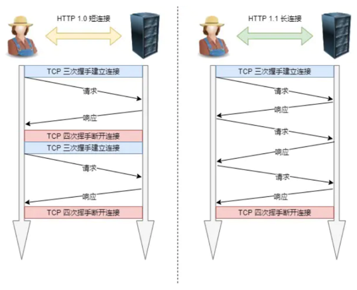
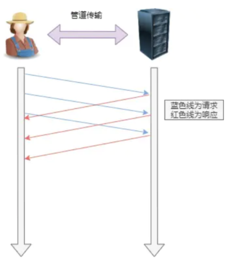

# HTTP 特点

## 基本特点

- 用于客户端和服务器端之间的通信：应用 HTTP 协议时，必定是一端担任客户端角色，另一端担任服务器端角色
- 通过请求和响应的交换达成通信：HTTP 协议规定，请求从客户端发出，最后服务器端响应该请求并返回
- 请求 URI 定位资源：HTTP 协议使用 URI 定位互联网上的资源。正是因为 URI 的特定功能，在互联网上任意位置的资源都能访问到
- 告知服务器意图的 HTTP 方法：向请求 URI 指定的资源发送请求报文时，采用称为方法的命令。方法的作用在于， 可以指定请求的资源按期望产生某种行为

## 优点

- 简单：HTTP 基本的报⽂格式就是 header + body ，头部信息也是 key-value 简单⽂本的形式， 易于理解，降低了学习和使⽤的⻔槛。  

- 灵活和易于扩展 ： 
  - HTTP协议⾥的各类请求⽅法、 URI/URL、状态码、头字段等每个组成要求都没有被固定死，都允许开发⼈员⾃定义和扩充
  - 同时 HTTP 由于是⼯作在应⽤层（OSI 第七层），则它下层可以随意变化。不仅可以使用 TCP、UNIX Domain Socket，还可以使用SSL/TLS，甚至是基于 UDP 的 QUIC
- 应⽤⼴泛和跨平台：HTTP 的应⽤范围⾮常的⼴泛，从台式机的浏览器到⼿机上的各种 APP，同时天然具有跨平台的优越性。    

## 缺点

HTTP 协议⾥有优缺点⼀体的双刃剑，分别是⽆状态、明⽂传输，同时还有⼀⼤缺点不安全。  

- ⽆状态双刃剑  
  - ⽆状态的好处，因为服务器不会去记忆 HTTP 的状态，所以不需要额外的资源来记录状态信息，这能减轻服务器的负担，能够把更多的 CPU 和内存⽤来对外提供服务
  - ⽆状态的坏处，既然服务器没有记忆能⼒，它在完成有关联性的操作时会⾮常麻烦。对于⽆状态的问题，解法⽅案有很多种，其中⽐较简单的⽅式⽤ Cookie 技术。Cookie 通过在请求和响应报⽂中写⼊ Cookie 信息来控制客户端的状态

- 明⽂传输双刃剑  
  - 明⽂意味着在传输过程中的信息，是可⽅便阅读的
  - 但是这正是这样， HTTP 的所有信息都暴露在了光天化⽇下，相当于信息裸奔。在传输的漫⻓的过程中，信息的内容都毫⽆隐私可⾔，很容易就能被窃取

- 不安全：HTTP ⽐较严重的缺点就是不安全：  
  - 通信使⽤明⽂不加密，内容可能会被窃听  
  - 不验证通信⽅的身份，因此有可能遭遇伪装  
  - ⽆法证明报⽂的完整性，所以有可能已遭篡改  

# HTTP/1.1 的性能  

## ⻓连接  

早期 HTTP/1.0 性能上的⼀个很⼤的问题，那就是每发起⼀个请求，都要新建⼀次 TCP 连接（三次握⼿），⽽且是串⾏请求，做了⽆谓的 TCP 连接建⽴和断开，增加了通信开销。 为了解决上述 TCP 连接问题， HTTP/1.1 提出了⻓连接的通信⽅式，也叫持久连接。这种⽅式的好处在于减少了 TCP 连接的重复建⽴和断开所造成的额外开销，减轻了服务器端的负载。  

持久连接的特点是，只要任意⼀端没有明确提出断开连接，则保持 TCP 连接状态。  



## 管道⽹络传输  

HTTP/1.1 采⽤了⻓连接的⽅式，这使得管道（pipeline）⽹络传输成为了可能。即可在同⼀个 TCP 连接⾥⾯，客户端可以发起多个请求，只要第⼀个请求发出去了，不必等其回来，就可以发第⼆个请求出去，可以减少整体的响应时间。  



但是服务器还是按照顺序，先回应 A 请求，完成后再回应 B 请求。要是前⾯的回应特别慢，后⾯就会有许多请求排队等着。这称为队头堵塞。  

## 队头阻塞  

请求 - 应答的模式加剧了 HTTP 的性能问题。  

因为当顺序发送的请求序列中的⼀个请求因为某种原因被阻塞时，在后⾯排队的所有请求也⼀同被阻塞了，会招致客户端⼀直请求不到数据，这也就是队头阻塞。 好⽐上班的路上塞⻋。  


# HTTP 方法

##  标准方法

HTTP 1.0/1.1 支持的方法：


## 扩展方法

可以任意添加请求动作，只要请求方和响应方都能理解就行。

## 安全与幂等

在 HTTP 协议里，所谓的“安全”是指请求方法不会“破坏”服务器上的资源，即不会对服务器上的资源造成实质的修改。

- 只有 GET 和 HEAD 方法是“安全”的，因为它们是“只读”操作，只要服务器不故意曲解请求方法的处理方式，无论 GET 和 HEAD 操作多少次，服务器上的数据都是“安全的”
- POST/PUT/DELETE 操作会修改服务器上的资源，增加或删除数据，所以是“不安全”的

所谓的“幂等”实际上是一个数学用语，被借用到了HTTP协议里，意思是多次执行相同的操作，结果也都是相同的，即多次“幂”后结果“相等”。

- GET 和 HEAD 既是安全的也是幂等的
- DELETE 可以多次删除同一个资源，效果都是“资源不存在”，所以也是幂等的
- POST 是“新增或提交数据”，多次提交数据会创建多个资源，所以不是幂等的
- PUT 是“替换或更新数据”，多次更新一个资源，资源还是会第一次更新的状态，所以是幂等的


# HTTP 常⻅的状态码  


1xx：

1xx 类状态码属于提示信息，是协议处理中的⼀种中间状态，实际⽤到的⽐较少。  

- 101 Switching Protocols，该状态码表示客户端使用 Upgrade 头字段，要求在 HTTP 协议的基础上改成其他的协议继续通信。比如：WebSocket。而如果服务器也同意变更协议，就会发送状态码 101，但这之后的数据传输就不会再使用 HTTP 了

2xx：

2xx 类状态码表示服务器成功处理了客户端的请求，也是我们最愿意看到的状态。

- 200 OK，是最常⻅的成功状态码，表示⼀切正常。如果是⾮ HEAD 请求，服务器返回的响应头都会有 body 数据
- 204 No Content，也是常⻅的成功状态码，与 200 OK 基本相同，但响应头没有 body 数据
- 206 Partial Content，是应⽤于 HTTP 分块下载或断点续传，表示响应返回的 body 数据并不是资源的全部⽽是其中的⼀部分，也是服务器处理成功的状态

3xx：  

3xx 类状态码表示客户端请求的资源发送了变动，需要客户端⽤新的 URL 重新发送请求获取资源，也就是重定向。  

- 301 Moved Permanently，表示永久重定向，说明请求的资源已经不存在了，需改⽤新的 URL 再次访问

- 302 Found，表示临时重定向，说明请求的资源还在，但暂时需要⽤另⼀个 URL 来访问

301 和 302 都会在响应头⾥使⽤字段 Location ，指明后续要跳转的 URL，浏览器会⾃动重定向新的 URL

- 304 Not Modified，不具有跳转的含义，表示资源未修改，重定向已存在的缓冲⽂件，也称缓存重定向，⽤于缓存控制  

4xx：

4xx 类状态码表示客户端发送的报⽂有误，服务器⽆法处理，也就是错误码的含义。

- 400 Bad Request，表示客户端请求的报⽂有错误，但只是个笼统的错误
- 401 Unauthorized，表示发送的请求需要有通过 HTTP 认证（BASIC 认证、DIGEST 认证）。 另外若之前已进行过 1 次请求，则表示用户认证失败
- 403 Forbidden，表示服务器禁⽌访问资源，并不是客户端的请求出错
- 404 Not Found，表示请求的资源在服务器上不存在或未找到，所以⽆法提供给客户端

5xx：

5xx 类状态码表示客户端请求报⽂正确，但是服务器处理时内部发⽣了错误，属于服务器端的错误码。

- 500 Internal Server Error，与 400 类型，是个笼统通⽤的错误码，服务器发⽣了什么错误，我们并不知道
- 501 Not Implemented，表示客户端请求的功能还不⽀持，类似“即将开业，敬请期待”的意思
- 502 Bad Gateway，通常是服务器作为⽹关或代理时返回的错误码，表示服务器⾃身⼯作正常，访问后端服务器发⽣了错误
- 503 Service Unavailable，表示服务器当前很忙，暂时⽆法响应服务器，类似“⽹络服务正忙，请稍后重试”的意思

# HTTP 报文

用于 HTTP 协议交互的信息被称为 HTTP 报文：

- 请求端（客户端）的HTTP 报文叫做请求报文
- 响应端（服务器端）的叫做响应报文
- HTTP 报文本身是由多行（用 CR+LF 作换行符）数据构成的字符串文本
- HTTP 报文大致可分为报文首部和报文主体两块，两者由空行（ CR+LF）来划分 ，通常，并不一定要有报文主体  


## 请求报文及响应报文的结构  


请求报文和响应报文的首部内容由以下数据组成：

- 请求行，包含用于请求的方法，请求 URI 和 HTTP 版本
- 状态行，包含表明响应结果的状态码，原因短语和 HTTP 版本
- 首部字段，包含表示请求和响应的各种条件和属性的各类首部，一般有 4 种首部，分别是：
  - 通用首部
  - 请求首部
  - 响应首部
  - 实体首部

## 编码提升传输速率  

HTTP 协议中有一种被称为内容编码的功能，指明应用在实体内容上的编码格式， 并保持实体信息原样压缩。内容编码后的实体由客户端接收并负责解码。   

常用的内容编码有以下几种：

- gzip（GNU zip）
- compress（UNIX 系统的标准压缩）
- deflate（zlib）
- identity（不进行编码）

### 分块传输编码

在 HTTP 通信过程中，请求的编码实体资源尚未全部传输完成之前，浏览器无法显示请求页面。 在传输大容量数据时，通过把数据分割成多块，能够让浏览器逐步显示页面。这种把实体主体分块的功能称为分块传输编码（ Chunked TransferCoding）。  

- 分块传输编码会将实体主体分成多个部分（块）。每一块都会用十六进制来标记块的大小， 而实体主体的最后一块会使用“0(CR+LF)”来标记
- 使用分块传输编码的实体主体会由接收的客户端负责解码， 恢复到编码前的实体主体

### 发送多种数据的多部分对象集合

HTTP 协议中也采纳了多部分对象集合，发送的一份报文主体内可含有多类型实体。通常是在图片或文本文件等上传时使用：

- 多部分对象集合包含的对象：multipart/form-data  
- 在 Web 表单文件上传时：multipart/byteranges    

多部分对象集合的每个部分类型中， 都可以含有首部字段。另外，可以在某个部分中嵌套使用多部分对象集合。   

## 获取部分内容的范围请求  

指定范围发送的请求叫做范围请求。  

对一份 10 000 字节大小的资源，如果使用范围请求，可以只请求 5001~10 000 字节内的资源：


执行范围请求时，会用到首部字段 Range 来指定资源的 byte 范围：

```
Range: bytes=5001-10000       		 # 5001~10000 字节
Range: bytes=5001-			 		# 从 5001 字节之后全部的字节
Range: bytes=-3000, 5000-7000		 # 从一开始到 3000字节和 5000~7000 字节的多重范围
```

针对范围请求，响应会返回状态码为 206 Partial Content 的响应报文。另外，对于多重范围的范围请求，响应会在首部字段 Content-Type
标明 multipart/byteranges 后返回响应报文。

如果服务器端无法响应范围请求， 则会返回状态码 200 OK 和完整的实体内容。  

## 内容协商返回最合适的内容  

 内容协商机制是指客户端和服务器端就响应的资源内容进行交涉，然后提供给客户端最为适合的资源。  

包含在请求报文中的某些首部字段：

- Accept
- Accept-Charset
- Accept-Encoding
- Accept-Language
- Content-Language

内容协商技术有以下 3 种类型：

- 服务器驱动协商：由服务器端进行内容协商。以请求的首部字段为参考，在服务器端自动处理，但对用户来说，以浏览器发送的信息作为判定的依据，并不一定能筛选出最优内容  
- 客户端驱动协商：由客户端进行内容协商的方式。用户从浏览器显示的可选项列表中手动选择。还可以利用 JavaScript 脚本在 Web 页面上自动进行上述选择  
- 透明协商：是服务器驱动和客户端驱动的结合体，是由服务器端和客户端各自进行内容协商的一种方法  

# HTTP 首部字段

HTTP 首部字段是由首部字段名和字段值构成的，中间用冒号“:”分隔：

```
首部字段名: 字段值
```

字段值对应单个 HTTP 首部字段可以有多个值，多个值之间通过“,”分隔。

## 通用首部字段


## 请求首部字段


## 响应首部字段


## 实体首部字段


 ## End-to-end 和 Hop-by-hop 首部  

HTTP 首部字段将定义成缓存代理和非缓存代理的行为，分成 2 种类型：

- 端到端首部（End-to-endHeader），分在此类别中的首部会转发给请求/响应对应的最终接收目标，且必须保存在由缓存生成的响应中，另外规定它必须被转发
- 逐跳首部（Hop-by-hopHeader），分在此类别中的首部只对单次转发有效，会因通过缓存或代理而不再转发。 HTTP/1.1 和之后版本中，如果要使用 hop-by-hop 首部，需提供 Connection 首部字段

HTTP/1.1 中，除下面 8 个首部字段之外，其他所有字段都属于端到端首部：

- Connection
- Keep-Alive
- Proxy-Authenticate
- Proxy-Authorization
- Trailer
- TE
- Transfer-Encoding
- Upgrade
