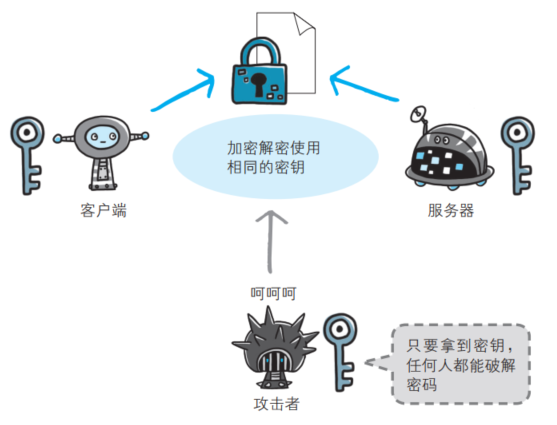
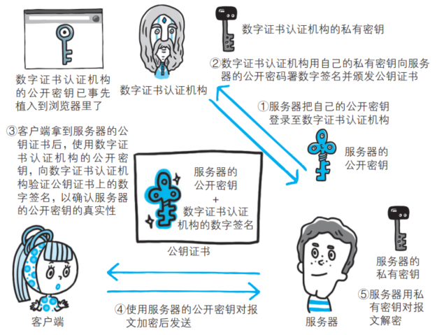

# HTTP 与 HTTPS 

## 区别

- HTTP 是超⽂本传输协议，信息是明⽂传输，存在安全⻛险的问题。 HTTPS 则解决 HTTP 不安全的缺陷，在TCP 和 HTTP ⽹络层之间加⼊了 SSL/TLS 安全协议，使得报⽂能够加密传输
- HTTP 连接建⽴相对简单， TCP 三次握⼿之后便可进⾏ HTTP 的报⽂传输。⽽ HTTPS 在 TCP 三次握⼿之后，还需进⾏ SSL/TLS 的握⼿过程，才可进⼊加密报⽂传输
- HTTP 的端⼝号是 80， HTTPS 的端⼝号是 443 
- HTTPS 协议需要向 CA（证书权威机构）申请数字证书，来保证服务器的身份是可信的

## HTTPS 解决的问题

- 通信使用明文（不加密），内容可能会被窃听
- 不验证通信方的身份，因此有可能遭遇伪装
- 无法证明报文的完整性，所以有可能已遭篡改

HTTPS 在 HTTP 与 TCP 层之间加⼊了 SSL/TLS 协议，可以很好的解决了上述的⻛险：

- 信息加密：混合加密的⽅式实现信息的机密性，解决了窃听的⻛险
- 校验机制：摘要算法的⽅式来实现完整性，它能够为数据⽣成独⼀⽆⼆的指纹，指纹⽤于校验数据的完整性，解决了篡改的⻛险
- 身份证书：将服务器公钥放⼊到数字证书中，解决了冒充的⻛险  

# HTTPS 混合加密  

## 共享密钥加密

加密和解密同用一个密钥的方式称为共享密钥加密，也被叫做对称密钥加密。  

以共享密钥方式加密时必须将密钥也发给对方。  在互联网上转发密钥时，如果通信被监听那么密钥就可会落入攻击者之手， 同时也就失去了加密的意义。另外还得设法安全地保管接收到的密钥。  

## 使用两把密钥的公开密钥加密  

公开密钥加密使用一对非对称的密钥。 一把叫做私有密钥，另一把叫做公开密钥。私有密钥不能让其他任何人知道，而公开密钥则可以随意发布，任何人都可以获得。  

使用公开密钥加密方式， 发送密文的一方使用对方的公开密钥进行加密处理，对方收到被加密的信息后，再使用自己的私有密钥进行解密。 利用这种方式， 不需要发送用来解密的私有密钥，也不必担心密钥被攻击者窃听而盗走。 

要想根据密文和公开密钥，恢复到信息原文是异常困难的，因为解密过程就是在对离散对数进行求值， 这并非轻而易举就能办到。退一步讲，如果能对一个非常大的整数做到快速地因式分解，那么密码破解还是存在希望的。但就目前的技术来看是不太现实的。  

## HTTPS 采用混合加密

HTTPS 采用共享密钥加密和公开密钥加密两者并用的混合加密机制。若密钥能够实现安全交换， 那么有可能会考虑仅使用公开密钥加密来通信。但是公开密钥加密与共享密钥加密相比，其处理速度要慢。所以应充分利用两者各自的优势， 将多种方法组合起来用于通信：

- 在交换密钥环节使用公开密钥加密方式
- 之后的建立通信交换报文阶段则使用共享密钥加密方式

# 证明公开密钥正确性的证书  

公开密钥加密方式还是存在一些问题的。那就是无法证明公开密钥本身就是货真价实的公开密钥。 比如，正准备和某台服务器建立公开密钥加密方式下的通信时，如何证明收到的公开密钥就是原本预想的那台服务器发行的公开密钥。 或许在公开密钥传输途中，真正的公开密钥已经被攻击者替换掉了。  

为了解决上述问题，可以使用由数字证书认证机构和其相关机关颁发的公开密钥证书。  

数字证书认证机构处于客户端与服务器双方都可信赖的第三方机构的立场上：

- 服务器的运营人员向数字证书认证机构提出公开密钥的申请
- 数字证书认证机构在判明提出申请者的身份之后，会对已申请的公开密钥做数字签名，然后分配这个已签名的公开密钥，并将该公开密钥放入公钥证书后绑定在一起
- 服务器会将这份由数字证书认证机构颁发的公钥证书发送给客户端，以进行公开密钥加密方式通信。 公钥证书也可叫做数字证书或直接称为证书
- 接到证书的客户端可使用数字证书认证机构的公开密钥， 对那张证书上的数字签名进行验证， 一旦验证通过，客户端便可明确两件事：
  - 认证服务器的公开密钥的是真实有效的数字证书认证机构
  - 服务器的公开密钥是值得信赖的

认证机关的公开密钥必须安全地转交给客户端。 使用通信方式时，如何安全转交是一件很困难的事， 因此，多数浏览器开发商发布版本时，会事先在内部植入常用认证机关的公开密钥。  

## 可证明组织真实性的 EV SSL 证书  

证书的一个作用是用来证明作为通信一方的服务器是否规范，另外一个作用是可确认对方服务器背后运营的企业是否真实存在。 拥有该特性的证书就是 EV SSL 证书（Extended Validation SSL Certificate）。  

EV SSL 证书是基于国际标准的认证指导方针颁发的证书。其严格规定了对运营组织是否真实的确认方针，因此，通过认证的 Web 网站能够获得更高的认可度。  

## 用以确认客户端的客户端证书

HTTPS 中还可以使用客户端证书。以客户端证书进行客户端认证，证明服务器正在通信的对方始终是预料之内的客户端， 其作用跟服务器证书如出一辙。  

但客户端证书仍存在几处问题点：

- 证书的获取及发布：想获取证书时， 用户得自行安装客户端证书，这需要费用和一定的技术基础
- 客户端证书毕竟只能用来证明客户端实际存在， 而不能用来证明用户本人的真实有效性，也就是说，只要获得了安装有客户端证书的计算机的使用权限， 也就意味着同时拥有了客户端证书的使用权限  

## 认证机构信誉第一  

虽然存在可将证书无效化的证书吊销列表（Certificate Revocation List， CRL）机制， 以及从客户端删除根证书颁发机构（Root Certificate Authority， RCA）的对策， 但是距离生效还需要一段时间，而在这段时间内，到底会有多少用户的利益蒙受损失就不得而知了。  

## 由自认证机构颁发的证书称为自签名证书  

使用 OpenSSL 这套开源程序，每个人都可以构建一套属于自己的认证机构， 从而自己给自己颁发服务器证书。但该服务器证书在互联网上不可作为证书使用。  

独立构建的认证机构叫做自认证机构， 由自认证机构颁发的“无用”证书也被戏称为自签名证书。浏览器访问该服务器时，会显示“无法确认连接安全性”或“该网站的安全证书存在问题”等警告消息。  

自由认证机构颁发的服务器证书之所以不起作用，是因为它无法消除伪装的可能性。   

# SSL/TLS 的建⽴过程

SSL/TLS 协议基本流程：

- 客户端向服务器索要并验证服务器的公钥
- 双⽅协商⽣产会话秘钥
- 双⽅采⽤会话秘钥进⾏加密通信

前两步也就是 SSL/TLS 的建⽴过程，也就是握⼿阶段。SSL/TLS 的握⼿阶段涉及四次通信：

## ClientHello  

⾸先，由客户端向服务器发起加密通信请求，也就是 ClientHello 请求。在这⼀步，客户端主要向服务器发送以下信息：  

- 客户端⽀持的 SSL/TLS 协议版本，如 TLS 1.2 版本  
- 客户端⽣产的随机数（Client Random ），后⾯⽤于⽣产会话秘钥
- 客户端⽀持的密码套件列表，如 RSA 加密算法  

## SeverHello

服务器收到客户端请求后，向客户端发出响应，也就是 SeverHello 。服务器回应的内容有如下内容：  

- 确认 SSL/TLS 协议版本，如果浏览器不⽀持，则关闭加密通信  
- 服务器⽣产的随机数（Server Random ），后⾯⽤于⽣产会话秘钥
- 确认的密码套件列表，如 RSA 加密算法  
- 服务器的数字证书  

## 客户端回应  

客户端收到服务器的回应之后，⾸先通过浏览器或者操作系统中的 CA 公钥，确认服务器的数字证书的真实性。如果证书没有问题，客户端会从数字证书中取出服务器的公钥，然后使⽤它加密报⽂，向服务器发送如下信息：  

- ⼀个随机数（pre-master key）。该随机数会被服务器公钥加密
- 加密通信算法改变通知，表示随后的信息都将⽤会话秘钥加密通信
- 客户端握⼿结束通知，表示客户端的握⼿阶段已经结束。这⼀项同时把之前所有内容的发⽣的数据做个摘要，⽤来供服务端校验

上⾯第⼀项的随机数是整个握⼿阶段的第三个随机数，这样服务器和客户端就同时有三个随机数，接着就⽤双⽅协商的加密算法， 各⾃⽣成本次通信的会话秘钥。  

## 服务器的最后回应  

服务器收到客户端的第三个随机数（pre-master key ）之后，通过协商的加密算法，计算出本次通信的会话秘钥。然后，向客户端发⽣最后的信息：  

- 加密通信算法改变通知，表示随后的信息都将⽤会话秘钥加密通信  
- 服务器握⼿结束通知，表示服务器的握⼿阶段已经结束。这⼀项同时把之前所有内容的发⽣的数据做个摘要，⽤来供客户端校验  

⾄此，整个 SSL/TLS 的握⼿阶段全部结束。接下来，客户端与服务器进⼊加密通信，就完全是使⽤普通的 HTTP 协议，只不过⽤会话秘钥加密内容。 

