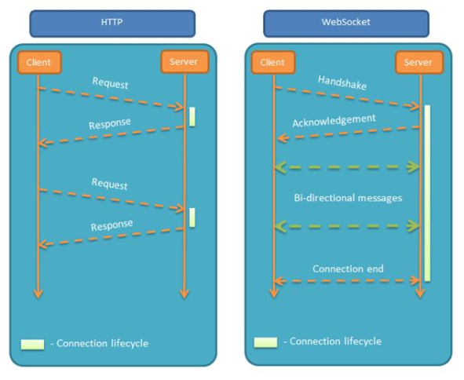

# 支持双向通讯的 WebSocket  



长连接的心跳保持：  

- HTTP 长连接只能基于简单的超时（常见为 65 秒）  
- WebSocket 连接基于 ping/pong 心跳机制维持  

兼容 HTTP 协议：  

- 默认使用 80 或者 443 端口  
- 协议升级  
- 代理服务器可以简单支持  


# 设计哲学：在 Web 约束下暴露 TCP 给上层  

- 元数据去哪了？  
  - 对比：HTTP 协议头部会存放元数据  
  - 由 WebSocket 上传输的应用层存放元数据  

- 基于帧：不是基于流（HTTP、TCP）  
  - 每一帧要么承载字符数据，要么承载二进制数据  

- 基于浏览器的同源策略模型（非浏览器无效）  
  - 可以使用 Access-Control-Allow-Origin 等头部  

- 基于 URI、子协议支持同主机同端口上的多个服务  

# 帧格式  


- RSV1/RSV2/RSV3：默认为 0，仅当使用 extension 扩展时，由扩展决定其值  
- 数据帧格式：帧类型 (opcode) 
  - 持续帧  
    - 0：继续前一帧  
  - 非控制帧  
    - 1：文本帧（UTF8）  
    - 2：二进制帧  
    - 3-7：为非控制帧保留  
  - 3-7：为非控制帧保留  
    - 8：关闭帧  
    - 9：心跳帧 ping  
    - A：心跳帧 pong  
    - B-F：为控制帧保留  

# URI 格式  

```
ws-URI = "ws:" "//" host [ ":" port ] path [ "?" query ]  
```

- 默认 port 端口 80  

```
wss-URI = "wss:" "//" host [ ":" port ] path [ "?" query ]  
```

- 默认 port 端口 443  

客户端提供信息  

- host 与 port：主机名与端口  
- shema：是否基于 SSL  
- 访问资源：URI  
- 握手随机数：Sec-WebSocket-Key  
- 选择子协议： Sec-WebSocket-Protocol  
- 扩展协议： Sec-WebSocket-Extensions  
- CORS 跨域：Origin  