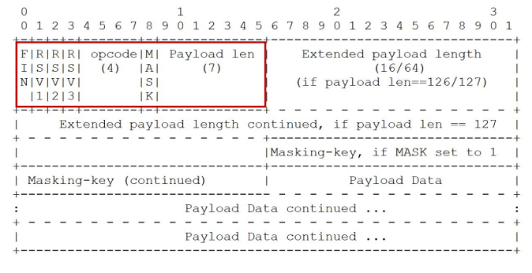

# 支持双向通讯的 WebSocket  


长连接的心跳保持：  

- HTTP 长连接只能基于简单的超时（常见为 65 秒）  
- WebSocket 连接基于 ping/pong 心跳机制维持  

兼容 HTTP 协议：  

- 默认使用 80 或者 443 端口  
- 协议升级  
- 代理服务器可以简单支持  


# 设计哲学：在 Web 约束下暴露 TCP 给上层  

- 元数据去哪了？  
  - 对比：HTTP 协议头部会存放元数据  
  - 由 WebSocket 上传输的应用层存放元数据  

- 基于帧：不是基于流（HTTP、TCP）  
  - 每一帧要么承载字符数据，要么承载二进制数据  

- 基于浏览器的同源策略模型（非浏览器无效）  
  - 可以使用 Access-Control-Allow-Origin 等头部  

- 基于 URI、子协议支持同主机同端口上的多个服务  

# 帧格式  



- RSV1/RSV2/RSV3：默认为 0，仅当使用 extension 扩展时，由扩展决定其值  
- 数据帧格式：帧类型 (opcode) 
  - 持续帧  
    - 0：继续前一帧  
  - 非控制帧  
    - 1：文本帧（UTF8）  
    - 2：二进制帧  
    - 3-7：为非控制帧保留  
  - 3-7：为非控制帧保留  
    - 8：关闭帧  
    - 9：心跳帧 ping  
    - A：心跳帧 pong  
    - B-F：为控制帧保留  

# URI 格式  

```
ws-URI = "ws:" "//" host [ ":" port ] path [ "?" query ]  
```

- 默认 port 端口 80  

```
wss-URI = "wss:" "//" host [ ":" port ] path [ "?" query ]  
```

- 默认 port 端口 443  

客户端提供信息  

- host 与 port：主机名与端口  
- shema：是否基于 SSL  
- 访问资源：URI  
- 握手随机数：Sec-WebSocket-Key  
- 选择子协议： Sec-WebSocket-Protocol  
- 扩展协议： Sec-WebSocket-Extensions  
- CORS 跨域：Origin  

# 建立握手  


## 如何证明握手被服务器接受？预防意外  

- 请求中的 Sec-WebSocket-Key 随机数
  - 例如 Sec-WebSocket-Key: A1EEou7Nnq6+BBZoAZqWlg==
- 响应中的 Sec-WebSocket-Accept 证明值
  - GUID（RFC4122）：258EAFA5-E914-47DA-95CA-C5AB0DC85B11
  - 值构造规则：BASE64(SHA1(Sec-WebSocket-KeyGUID))
    -  拼接值：A1EEou7Nnq6+BBZoAZqWlg==258EAFA5-E914-47DA-95CA-C5AB0DC85B11
    -  SHA1 值：713f15ece2218612fcadb1598281a35380d1790f
    -  BASE 64 值：cT8V7OIhhhL8rbFZgoGjU4DReQ8=
    -  最终头部：Sec-WebSocket-Accept: cT8V7OIhhhL8rbFZgoGjU4DReQ8=  

## 消息与数据帧  

- Message 消息
  - 1 条消息由 1 个或者多个帧组成，这些数据帧属于同一类型
  - 代理服务器可能合并、拆分消息的数据帧
- Frame 数据帧
  - 持续帧
  - 文本帧、二进制帧  

## 非控制帧的消息分片：有序  


## 数据帧格式：消息内容的长度  

消息内容长度组成

- 应用消息长度
- 扩展数据长度  

<=125 字节

- 仅使用 Payload len  

126 至 2^16-1  

- Payload len 值为 126
- Extended payload length16 位表示长度  

2^16 至 2^64-1  

- Payload len 值为 127  
- Extended payload length 共8 字节 64 位表示长度  


# 发送消息  

- 确保 WebSocket 会话处于 OPEN 状态
- 以帧来承载消息，一条消息可以拆分多个数据帧
- 客户端发送的帧必须基于掩码编码
- 一旦发送或者接收到关闭帧，连接处于 CLOSING 状态
- 一旦发送了关闭帧，且接收到关闭帧，连接处于 CLOSED 状态
- TCP 连接关闭后，WebSocket 连接才完全被关闭  

## frame-masking-key 掩码  

- 客户端消息：MASK 为 1（包括控制帧），传递 32 位无法预测的、随机的 Masking-key  
- 服务器端消息：MASK 为 0  


强制浏览器执行以下方法：

- 生成随机的 32 位 frame-masking-key，不能让 JS 代码猜出（否则可以反向构造）
- 对传输的包体按照 frame-masking-key 执行可对称解密的 XOR 异或操作，使代理服务器不识

## 心跳帧  

心跳帧可以插在数据帧中传输  

- ping 帧
  - opcode=9
  - 可以含有数据
- pong 帧
  - opcode=A
  - 必须与 ping 帧数据相同  

## 关闭会话的方式  

- 控制帧中的关闭帧：在 TCP 连接之上的双向关闭
  - 发送关闭帧后，不能再发送任何数据
  - 接收到关闭帧后，不再接收任何到达的数据  

- TCP 连接意外中断  

### 关闭帧格式  

- opcode=8
- 可以含有数据，但仅用于解释关闭会话的原因
  - 前 2 字节为无符号整型
  - 遵循 mask 掩码规则  

关闭帧的错误码  


