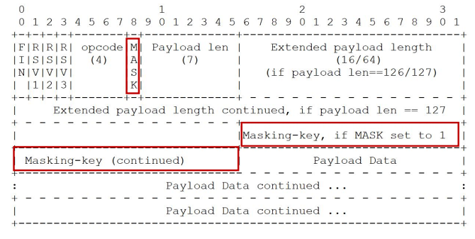

# 支持双向通讯的 WebSocket  


## 主要特点

- 推送功能
  - 支持由服务器向客户端推送数据的推送功能。这样，服务器可直接发送数据，而不必等待客户端的请求

- 减少通信量
  - 只要建立起 WebSocket 连接，就希望一直保持连接状态。和 HTTP 相比，不但每次连接时的总开销减少，而且由于 WebSocket 的首部信息很小，通信量也相应减少了

## 设计哲学

在 Web 约束下暴露 TCP 给上层  

- 元数据去哪了？  
  - 对比：HTTP 协议头部会存放元数据  
  - 由 WebSocket 上传输的应用层存放元数据  

- 基于帧：不是基于流（HTTP、TCP）  
  - 每一帧要么承载字符数据，要么承载二进制数据  

- 基于浏览器的同源策略模型（非浏览器无效）  
  - 可以使用 Access-Control-Allow-Origin 等头部  

- 基于 URI、子协议支持同主机同端口上的多个服务  

# 帧格式  

下图就是 WebSocket 的帧结构定义，长度不固定，最少2个字节，最多14字节：


- 第一个字节的第一位“FIN”是消息结束的标志位，相当于HTTP/2里的“END_STREAM”，表示数据发送完毕。一个消息可以拆成多个帧，接收方看到“FIN”后，就可以把前面的帧拼起来，组成完整的消息，“FIN”后面的三个位是保留位，目前没有任何意义，但必须是 0

- 第一个字节的后4位很重要，叫“Opcode”，操作码，其实就是帧类型：
  - 持续帧  
    - 0：继续前一帧  
  - 非控制帧  
    - 1：文本帧（UTF8）  
    - 2：二进制帧  
    - 3-7：为非控制帧保留  
  - 3-7：为非控制帧保留  
    - 8：关闭帧  
    - 9：心跳帧 ping  
    - A：心跳帧 pong  
    - B-F：为控制帧保留  
- 第二个字节第一位是掩码标志位“MASK”，表示帧内容是否使用异或操作（xor）做简单的加密。目前的 WebSocket 标准规定，客户端发送数据必须使用掩码，而服务器发送则必须不使用掩码
- 第二个字节后7位是 “Payload len”，表示帧内容的长度。它是另一种变长编码，最少 7 位，最多是 7+64 位，也就是额外增加 8 个字节，所以一个 WebSocket帧最大是 2^64
- 长度字段后面是 “Masking-key”，掩码密钥，它是由上面的标志位“MASK”决定的，如果使用掩码就是 4 个字节的随机数，否则就不存在

# 握手

为了实现 WebSocket 通信，在 HTTP 连接建立之后，需要完成一次 “握手” 的步骤。  


## 握手-请求  

为了实现 WebSocket 通信，需要用到 HTTP 的 Upgrade 首部字段，告知服务器通信协议发生改变，以达到握手的目的。  

WebSocket 的握手是一个标准的 HTTP GET 请求，但要带上两个协议升级的专用头字段：

- “Connection: Upgrade”，表示要求协议“升级”
- “Upgrade: websocket”，表示要“升级”成 WebSocket 协议

为了防止普通的 HTTP 消息被“意外”识别成 WebSocket，握手消息还增加了两个额外的认证用头字段：

- Sec-WebSocket-Key：一个 Base64 编码的 16 字节随机数，作为简单的认证密钥
- Sec-WebSocket-Version：协议的版本号，当前必须是 13


## 握手-响应  

服务器收到 HTTP 请求报文，看到上面的四个字段，就知道这不是一个普通的 GET 请求，而是 WebSocket 的升级请求，于是就不走普通的 HTTP 处理流程，而是构造一个特殊的 “101 Switching Protocols” 响应报文，通知客户端，接下来就不用 HTTP 了，全改用 WebSocket 协议通信。


WebSocket 的握手响应报文也是有特殊格式的，要用字段 “Sec-WebSocket-Accept” 验证客户端请求报文，同样也是为了防止误连接。具体的做法是把请求头里“ Sec-WebSocket-Key” 的值，加上一个专用的 UUID “258EAFA5-E914-47DA-95CA-C5AB0DC85B11”，再计算 SHA-1 摘要。客户端收到响应报文，就可以用同样的算法，比对值是否相等，如果相等，就说明返回的报文确实是刚才握手时连接的服务器，认证成功。握手完成，后续传输的数据就不再是 HTTP 报文，而是 WebSocket 格式的二进制帧了。

# URI 格式  

```
ws-URI = "ws:" "//" host [ ":" port ] path [ "?" query ]  
```

- 默认 port 端口 80  

```
wss-URI = "wss:" "//" host [ ":" port ] path [ "?" query ]  
```

- 默认 port 端口 443  

客户端提供信息  

- host 与 port：主机名与端口  
- shema：是否基于 SSL  
- 访问资源：URI  
- 握手随机数：Sec-WebSocket-Key  
- 选择子协议： Sec-WebSocket-Protocol  
- 扩展协议： Sec-WebSocket-Extensions  
- CORS 跨域：Origin  

# 发送消息  

- 确保 WebSocket 会话处于 OPEN 状态
- 以帧来承载消息，一条消息可以拆分多个数据帧
- 客户端发送的帧必须基于掩码编码
- 一旦发送或者接收到关闭帧，连接处于 CLOSING 状态
- 一旦发送了关闭帧，且接收到关闭帧，连接处于 CLOSED 状态
- TCP 连接关闭后，WebSocket 连接才完全被关闭  

## 数据帧格式：消息内容的长度  

消息内容长度组成

- 应用消息长度
- 扩展数据长度  

<=125 字节

- 仅使用 Payload len  

126 至 2^16-1  

- Payload len 值为 126
- Extended payload length16 位表示长度  

2^16 至 2^64-1  

- Payload len 值为 127  
- Extended payload length 共8 字节 64 位表示长度  


## frame-masking-key 掩码  

- 客户端消息：MASK 为 1（包括控制帧），传递 32 位无法预测的、随机的 Masking-key  
- 服务器端消息：MASK 为 0  



强制浏览器执行以下方法：

- 生成随机的 32 位 frame-masking-key，不能让 JS 代码猜出（否则可以反向构造）
- 对传输的包体按照 frame-masking-key 执行可对称解密的 XOR 异或操作，使代理服务器不识

## 心跳帧  

心跳帧可以插在数据帧中传输  

- ping 帧
  - opcode=9
  - 可以含有数据
- pong 帧
  - opcode=A
  - 必须与 ping 帧数据相同  

## 关闭会话的方式  

- 控制帧中的关闭帧：在 TCP 连接之上的双向关闭
  - 发送关闭帧后，不能再发送任何数据
  - 接收到关闭帧后，不再接收任何到达的数据  

- TCP 连接意外中断  

关闭帧格式：  

- opcode=8
- 可以含有数据，但仅用于解释关闭会话的原因
  - 前 2 字节为无符号整型
  - 遵循 mask 掩码规则  

关闭帧的错误码  


