TCP 协议是由操作系统实现，所以操作系统提供了不少调节 TCP 的参数，可以通过如下命令查看：

```
ls -l /proc/sys/net/ipv4/tcp*
```

# TCP 三次握⼿的性能提升  

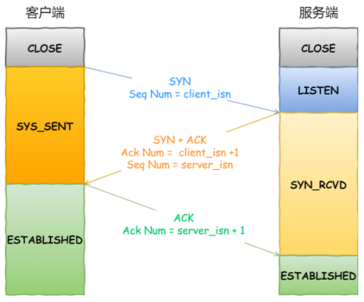

## 客户端优化  

客户端作为主动发起连接⽅，⾸先它将发送 SYN 包，于是客户端的连接就会处于 SYN_SENT 状态。客户端在等待服务端回复的 ACK 报⽂，正常情况下，服务器会在⼏毫秒内返回 SYN+ACK ，但如果客户端⻓时间没有收到 SYN+ACK 报⽂，则会重发 SYN 包， 重发的次数由 tcp_syn_retries 参数控制。


通常，第⼀次超时重传是在 1 秒后，第⼆次超时重传是在 2 秒，第三次超时重传是在 4 秒后，第四次超时重传是在 8 秒后，第五次是在超时重传 16 秒后。每次超时的时间是上⼀次的 2 倍。当第五次超时重传后，会继续等待 32 秒，如果服务端仍然没有回应 ACK，客户端就会终⽌三次握⼿。所以，总耗时是 1+2+4+8+16+32=63 秒，⼤约 1 分钟左右：


根据⽹络的稳定性和⽬标服务器的繁忙程度修改 SYN 的重传次数，调整客户端的三次握⼿时间上限。⽐如内⽹中通讯时，就可以适当调低重试次数，尽快把错误暴露给应⽤程序。  

## 服务端优化  

当服务端收到 SYN 包后，服务端会⽴⻢回复 SYN+ACK 包，表明确认收到了客户端的序列号，同时也把⾃⼰的序列号发给对⽅。此时，服务端出现了新连接，状态是 SYN_RCV 。在这个状态下， Linux 内核就会建⽴⼀个半连接队列来维护未完成的握⼿信息，当半连接队列溢出后，服务端就⽆法再建⽴新的连接。SYN 攻击，攻击的是就是这个半连接队列。  

可以通过该 netstat -s 命令给出的统计结果中， 可以得到由于半连接队列已满，引发的失败次数：  


上⾯输出的数值是累计值，表示共有多少个 TCP 连接因为半连接队列溢出⽽被丢弃。 隔⼏秒执⾏⼏次，如果有上升的趋势，说明当前存在半连接队列溢出的现象。  

要想增⼤半连接队列， 不能只单纯增⼤ tcp_max_syn_backlog 的值，还需⼀同增⼤ somaxconn 和 backlog，也就是增⼤ accept 队列。否则，只单纯增⼤ tcp_max_syn_backlog 是⽆效的。增⼤ tcp_max_syn_backlog 和 somaxconn 的⽅法是修改 Linux 内核参数：   


开启 syncookies 功能就可以在不使⽤ SYN 半连接队列的情况下成功建⽴连接。syncookies 的⼯作原理：服务器根据当前状态计算出⼀个值，放在⼰⽅发出的 SYN+ACK 报⽂中发出，当客户端返回 ACK 报⽂时，取出该值验证，如果合法，就认为连接建⽴成功：


syncookies 参数主要有以下三个值：  

- 0 值，表示关闭该功能  
- 1 值，表示仅当 SYN 半连接队列放不下时，再启⽤它  
- 2 值，表示⽆条件开启功能  

那么在应对 SYN 攻击时，只需要设置为 1 即可： 


当客户端接收到服务器发来的 SYN+ACK 报⽂后，就会回复 ACK 给服务器，同时客户端连接状态从 SYN_SENT 转换为 ESTABLISHED，表示连接建⽴成功。服务器端连接成功建⽴的时间还要再往后，等到服务端收到客户端的 ACK 后，服务端的连接状态才变为 ESTABLISHED。如果服务器没有收到 ACK，就会重发 SYN+ACK 报⽂，同时⼀直处于 SYN_RCV 状态。  

当⽹络繁忙、不稳定时，报⽂丢失就会变严重，此时应该调⼤重发次数。反之则可以调⼩重发次数。 修改重发次数的⽅法是，调整 tcp_synack_retries 参数：  


与客户端重传 SYN 类似，它的重传会经历 1、 2、 4、 8、 16 秒，最后⼀次重传后会继续等待 32 秒，如果服务端仍然没有收到 ACK，才会关闭连接，故共需要等待 63 秒。  

服务器收到 ACK 后连接建⽴成功，此时，内核会把连接从半连接队列移除，然后创建新的完全的连接，并将其添加到 accept 队列，等待进程调⽤ accept 函数时把连接取出来。如果进程不能及时地调⽤ accept 函数，就会造成 accept 队列（也称全连接队列）溢出，最终导致建⽴好的 TCP 连接被丢弃。  


accept 队列已满，丢弃连接只是 Linux 的默认⾏为，我们还可以选择向客户端发送 RST 复位报⽂，告诉客户端连接已经建⽴失败。打开这⼀功能需要将 tcp_abort_on_overflow 参数设置为 1。 


tcp_abort_on_overflow 共有两个值分别是 0 和 1，其分别表示：  

- 0 ：如果 accept 队列满了，那么 server 扔掉 client 发过来的 ack  
- 1 ：如果 accept 队列满了， server 发送⼀个 RST 包给 client，表示废掉这个握⼿过程和这个连接  

如果要想知道客户端连接不上服务端，是不是服务端 TCP 全连接队列满的原因，那么可以把 tcp_abort_on_overflow 设置为 1，这时如果在客户端异常中可以看到很多 connection reset by peer 的错误，那么就可以证明是由于服务端 TCP 全连接队列溢出的问题。 通常情况下，应当把 tcp_abort_on_overflow 设置为 0，因为这样更有利于应对突发流量。  

当 accept 队列满导致服务器丢掉了 ACK，与此同时，客户端的连接状态却是 ESTABLISHED，客户端进程就在建⽴好的连接上发送请求。只要服务器没有为请求回复 ACK，客户端的请求就会被多次重发。 如果服务器上的进程只是短暂的繁忙造成 accept 队列满，那么当 accept 队列有空位时，再次接收到的请求报⽂由于含有 ACK，仍然会触发服务器端成功建⽴连接。  

tcp_abort_on_overflow 设为 0 可以提⾼连接建⽴的成功率，只有你⾮常肯定 TCP 全连接队列会⻓期溢出时，才能设置为 1 以尽快通知客户端：


accept 队列的⻓度取决于 somaxconn 和 backlog 之间的最⼩值，也就是 min(somaxconn, backlog)，其中：  

- somaxconn 是 Linux 内核的参数，默认值是 128，可以通过 net.core.somaxconn 来设置其值  
- backlog 是 listen(int sockfd, int backlog) 函数中的 backlog ⼤⼩  

可以通过 ss -ltn 命令查看 accept 队列的⻓度  ：  


- Recv-Q：当前 accept 队列的⼤⼩，也就是当前已完成三次握⼿并等待服务端 accept() 的 TCP 连接  
- Send-Q： accept 队列最⼤⻓度，上⾯的输出结果说明监听 8088 端⼝的 TCP 服务， accept 队列的最⼤⻓度为 128  

当超过了 accept 连接队列，服务端则会丢掉后续进来的 TCP 连接，丢掉的 TCP 连接的个数会被统计起来，我们可以使⽤ netstat -s 命令来查看：  


上⾯看到的 41150 times ，表示 accept 队列溢出的次数，注意这个是累计值。可以隔⼏秒钟执⾏下，如果这个数字⼀直在增加的话，说明 accept 连接队列偶尔满了。如果持续不断地有连接因为 accept 队列溢出被丢弃，就应该调⼤ backlog 以及 somaxconn 参数。  

## 如何绕过三次握⼿  

三次握⼿建⽴连接造成的后果就是， HTTP 请求必须在⼀个 RTT（从客户端到服务器⼀个往返的时间）后才能发送。


在 Linux 3.7 内核版本之后，提供了 TCP Fast Open 功能，这个功能可以减少 TCP 连接建⽴的时延。  


在客户端⾸次建⽴连接时的过程：

- 客户端发送 SYN 报⽂，该报⽂包含 Fast Open 选项，且该选项的 Cookie 为空，这表明客户端请求 Fast Open Cookie
- ⽀持 TCP Fast Open 的服务器⽣成 Cookie，并将其置于 SYN-ACK 数据包中的 Fast Open 选项以发回客户端
- 客户端收到 SYN-ACK 后，本地缓存 Fast Open 选项中的 Cookie

所以，第⼀次发起 HTTP GET 请求的时候，还是需要正常的三次握⼿流程。 之后，如果客户端再次向服务器建⽴连接时的过程：  

- 客户端发送 SYN 报⽂，该报⽂包含数据（对于⾮ TFO 的普通 TCP 握⼿过程， SYN 报⽂中不包含数据）以及此前记录的 Cookie
- ⽀持 TCP Fast Open 的服务器会对收到 Cookie 进⾏校验：如果 Cookie 有效，服务器将在 SYN-ACK 报⽂中对 SYN 和数据进⾏确认，服务器随后将数据递送⾄相应的应⽤程序；如果 Cookie ⽆效，服务器将丢弃 SYN 报⽂中包含的数据，且其随后发出的 SYN-ACK 报⽂将只确认 SYN 的对应序列号
- 如果服务器接受了 SYN 报⽂中的数据，服务器可在握⼿完成之前发送数据， 这就减少了握⼿带来的1 个 RTT 的时间消耗
- 客户端将发送 ACK 确认服务器发回的 SYN 以及数据，但如果客户端在初始的 SYN 报⽂中发送的数据没有被确认，则客户端将重新发送数据
- 此后的 TCP 连接的数据传输过程和⾮ TFO 的正常情况⼀致   

所以，之后发起 HTTP GET 请求的时候，可以绕过三次握⼿，这就减少了握⼿带来的 1 个 RTT 的时间消耗。  

开启了 TFO 功能， cookie 的值是存放到 TCP option 字段⾥的，客户端在请求并存储了 Fast Open Cookie 之后，可以不断重复 TCP Fast Open 直⾄服务器认为 Cookie ⽆效（通常为过期）：


在 Linux 系统中，可以通过设置 tcp_fastopn 内核参数，来打开 Fast Open 功能：  

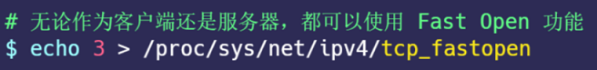

tcp_fastopn 各个值的意义:  

- 0 关闭  
- 1 作为客户端使⽤ Fast Open 功能  
- 2 作为服务端使⽤ Fast Open 功能  
- 3 ⽆论作为客户端还是服务器，都可以使⽤ Fast Open 功能  

TCP Fast Open 功能需要客户端和服务端同时⽀持，才有效果。  

## 小结

TCP 三次握⼿的⼏个内核参数：

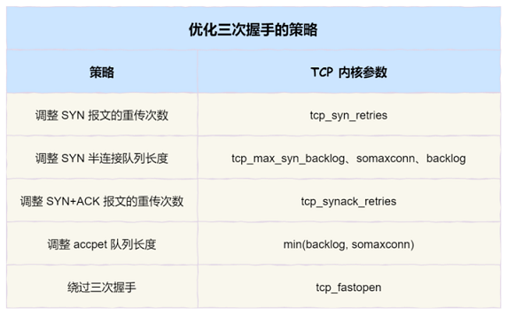

客户端的优化：

- 当客户端发起 SYN 包时，可以通过 tcp_syn_retries 控制其重传的次数  

服务端的优化：  

- 当服务端 SYN 半连接队列溢出后，会导致后续连接被丢弃，可以通过 netstat -s 观察半连接队列溢出的情况，如果 SYN 半连接队列溢出情况⽐较严重，可以通过 tcp_max_syn_backlog、 somaxconn、 backlog 参数来调整 SYN 半连接队列的⼤⼩  
- 服务端回复 SYN+ACK 的重传次数由 tcp_synack_retries 参数控制。如果遭受 SYN 攻击，应把 tcp_syncookies 参数设置为 1，表示仅在 SYN 队列满后开启 syncookie 功能，可以保证正常的连接成功建⽴
- 服务端收到客户端返回的 ACK，会把连接移⼊ accpet 队列，等待进⾏调⽤ accpet() 函数取出连接。可以通过 ss -lnt 查看服务端进程的 accept 队列⻓度，如果 accept 队列溢出，系统默认丢弃 ACK，如果可以把 tcp_abort_on_overflow 设置为 1 ，表示⽤ RST 通知客户端连接建⽴失败。如果 accpet 队列溢出严重，可以通过 listen 函数的 backlog 参数和 somaxconn 系统参数提⾼队列⼤⼩，accept 队列⻓度取决于 min(backlog, somaxconn)  

绕过三次握⼿：

- TCP Fast Open 功能可以绕过三次握⼿，使得 HTTP 请求减少了 1 个 RTT 的时间， Linux 下可以通过 tcp_fastopen 开启该功能，同时必须保证服务端和客户端同时⽀持  

# TCP 四次挥⼿的性能提升  

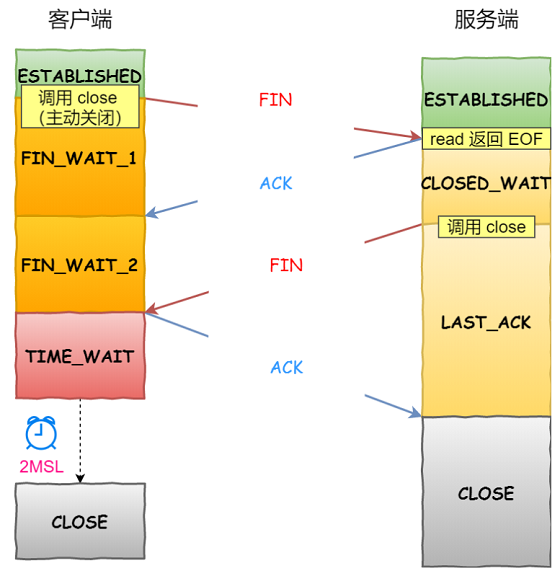

通常先关闭连接的⼀⽅称为主动⽅，后关闭连接的⼀⽅称为被动⽅。需要注意是： 主动关闭连接的，才有 TIME_WAIT 状态。    

## 主动⽅的优化  

关闭连接的⽅式通常有两种，分别是 RST 报⽂关闭和 FIN 报⽂关闭：

- 如果进程异常退出了，内核就会发送 RST 报⽂来关闭，它可以不⾛四次挥⼿流程，是⼀个暴⼒关闭连接的⽅式
- 安全关闭连接的⽅式必须通过四次挥⼿，它由进程调⽤ close 和 shutdown 函数发起 FIN 报⽂（shutdown 参数须传⼊ SHUT_WR 或者 SHUT_RDWR 才会发送 FIN）

调⽤了 close 函数意味着完全断开连接， 完全断开不仅指⽆法传输数据，⽽且也不能发送数据。 此时，调⽤了close 函数的⼀⽅的连接叫做孤⼉连接，如果你⽤ netstat -p 命令，会发现连接对应的进程名为空。使⽤ close 函数关闭连接是不优雅的。于是，就出现了⼀种优雅关闭连接的 shutdown 函数， 它可以控制只关闭⼀个⽅向的连接：  

```
int shutdown(int sockfd, int how);
```

第⼆个参数决定断开连接的⽅式，主要有以下三种⽅式：  

- SHUT_RD(0)： 关闭连接的读这个⽅向，如果接收缓冲区有已接收的数据，则将会被丢弃，并且后续再收到新的数据，会对数据进⾏ ACK，然后悄悄地丢弃。也就是说，对端还是会接收到 ACK，在这种情况下根本不知道数据已经被丢弃了    
- SHUT_WR(1)： 关闭连接的写这个⽅向，这就是常被称为半关闭的连接。如果发送缓冲区还有未发送的数据，将被⽴即发送出去，并发送⼀个 FIN 报⽂给对端
- SHUT_RDWR(2)：相当于 SHUT_RD 和 SHUT_WR 操作各⼀次， 关闭套接字的读和写两个⽅向  

### FIN_WAIT1 状态的优化  

主动⽅发送 FIN 报⽂后，连接就处于 FIN_WAIT1 状态，正常情况下，如果能及时收到被动⽅的 ACK，则会很快变为 FIN_WAIT2 状态。但是当迟迟收不到对⽅返回的 ACK 时，连接就会⼀直处于 FIN_WAIT1 状态。此时， 内核会定时重发 FIN 报⽂，其中重发次数由 tcp_orphan_retries 参数控制（注意， orphan 虽然是孤⼉的意思，该参数却不只对孤⼉连接有效，事实上，它对所有 FIN_WAIT1 状态下的连接都有效），默认值是 0，实际上当为 0 时，特指 8 次  。 

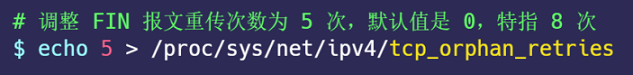

如果 FIN_WAIT1 状态连接很多，我们就需要考虑降低 tcp_orphan_retries 的值，当重传次数超过 tcp_orphan_retries 时，连接就会直接关闭掉。  

如果遇到恶意攻击， FIN 报⽂根本⽆法发送出去，这由 TCP 两个特性导致的：  

- ⾸先， TCP 必须保证报⽂是有序发送的， FIN 报⽂也不例外，当发送缓冲区还有数据没有发送时， FIN 报⽂也不能提前发送
- 其次， TCP 有流量控制功能，当接收⽅接收窗⼝为 0 时，发送⽅就不能再发送数据。所以，当攻击者下载⼤⽂件时，就可以通过接收窗⼝设为 0 ，这就会使得 FIN 报⽂都⽆法发送出去，那么连接会⼀直处于 FIN_WAIT1 状态

解决这种问题的⽅法，是调整 tcp_max_orphans 参数，它定义了孤⼉连接的最⼤数量：  

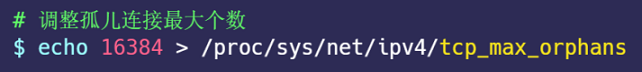

当进程调⽤了 close 函数关闭连接，此时连接就会是孤⼉连接，因为它⽆法再发送和接收数据。 Linux 系统为了防⽌孤⼉连接过多，导致系统资源⻓时间被占⽤，就提供了 tcp_max_orphans 参数。如果孤⼉连接数量⼤于它，新增的孤⼉连接将不再⾛四次挥⼿，⽽是直接发送 RST 复位报⽂强制关闭。  

### FIN_WAIT2 状态的优化  

当主动⽅收到 ACK 报⽂后，会处于 FIN_WAIT2 状态，就表示主动⽅的发送通道已经关闭，接下来将等待对⽅发送FIN 报⽂，关闭对⽅的发送通道。

这时， 如果连接是⽤ shutdown 函数关闭的，连接可以⼀直处于 FIN_WAIT2 状态，因为它可能还可以发送或接收数据。但对于 close 函数关闭的孤⼉连接，由于⽆法再发送和接收数据，所以这个状态不可以持续太久，⽽ tcp_fin_timeout 控制了这个状态下连接的持续时⻓，默认值是 60 秒：  

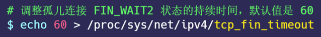

它意味着对于孤⼉连接（调⽤ close 关闭的连接），如果在 60 秒后还没有收到 FIN 报⽂，连接就会直接关闭。这个 60 秒不是随便决定的，它与 TIME_WAIT 状态持续的时间是相同的。  

### TIME_WAIT 状态的优化  

TIME_WAIT 是主动⽅四次挥⼿的最后⼀个状态，也是最常遇⻅的状态。当收到被动⽅发来的 FIN 报⽂后，主动⽅会⽴刻回复 ACK，表示确认对⽅的发送通道已经关闭，接着就处于 TIME_WAIT 状态。在 Linux 系统， TIME_WAIT 状态会持续 60 秒后才会进⼊关闭状态。  

TIME_WAIT 状态的连接，在主动⽅看来确实快已经关闭了。然后，被动⽅没有收到 ACK 报⽂前，还是处于 LAST_ACK 状态。如果这个 ACK 报⽂没有到达被动⽅，被动⽅就会重发 FIN 报⽂。重发次数仍然由 tcp_orphan_retries 参数控制。  

TIME-WAIT 的状态尤其重要，主要是两个原因：  

- 防⽌具有相同四元组的旧数据包被收到
- 保证被动关闭连接的⼀⽅能被正确的关闭，即保证最后的 ACK 能让被动关闭⽅接收，从⽽帮助其正常关闭

为什么 TIME_WAIT 状态要保持 60 秒呢？这与孤⼉连接 FIN_WAIT2 状态默认保留 60 秒的原理是⼀样的， 因为这两个状态都需要保持 2MSL 时⻓。 MSL 全称是 Maximum Segment Lifetime，它定义了⼀个报⽂在⽹络中的最⻓⽣存时间（报⽂每经过⼀次路由器的转发， IP 头部的 TTL 字段就会减 1，减到 0 时报⽂就被丢弃，这就限制了报⽂的最⻓存活时间）。这其实是相当于⾄少允许报⽂丢失⼀次。⽐如，若 ACK 在⼀个 MSL 内丢失，这样被动⽅重发的 FIN 会在第 2 个 MSL 内到达， TIME_WAIT 状态的连接可以应对。  

虽然 TIME_WAIT 状态有存在的必要，但它毕竟会消耗系统资源。 如果发起连接⼀⽅的 TIME_WAIT 状态过多，占满了所有端⼝资源，则会导致⽆法创建新连接。  

 Linux 提供了 tcp_max_tw_buckets 参数，当 TIME_WAIT 的连接数量超过该参数时，新关闭的连接就不再经历 TIME_WAIT ⽽直接关闭： 

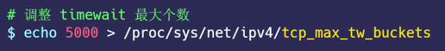

当服务器的并发连接增多时，相应地，同时处于 TIME_WAIT 状态的连接数量也会变多，此时就应当调⼤ tcp_max_tw_buckets 参数，减少不同连接间数据错乱的概率。tcp_max_tw_buckets 也不是越⼤越好，毕竟内存和端⼝都是有限的。    

有⼀种⽅式可以在建⽴新连接时，复⽤处于 TIME_WAIT 状态的连接，那就是打开 tcp_tw_reuse 参数。但是需要注意，该参数是只⽤于客户端（建⽴连接的发起⽅），因为是在调⽤ connect() 时起作⽤的，⽽对于服务端（被动连接⽅）是没有⽤的。  

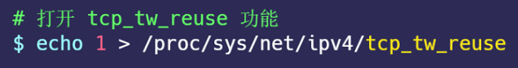

tcp_tw_reuse 从协议⻆度理解是安全可控的，可以复⽤处于 TIME_WAIT 的端⼝为新的连接所⽤。什么是协议⻆度理解的安全可控呢？主要有两点：    

- 只适⽤于连接发起⽅，也就是 C/S 模型中的客户端
- 对应的 TIME_WAIT 状态的连接创建时间超过 1 秒才可以被复⽤  

使⽤这个选项，还有⼀个前提，需要打开对 TCP 时间戳的⽀持（对⽅也要打开 ）：  


由于引⼊了时间戳，它能带来了些好处：

- 前⾯提到的 2MSL 问题就不复存在了，因为重复的数据包会因为时间戳过期被⾃然丢弃
- 同时，它还可以防⽌序列号绕回，也是因为重复的数据包会由于时间戳过期被⾃然丢弃

时间戳是在 TCP 的选项字段⾥定义的，开启了时间戳功能，在 TCP 报⽂传输的时候会带上发送报⽂的时间戳：

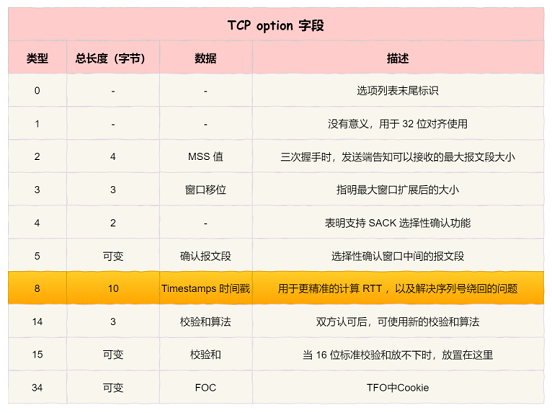

开启了 tcp_tw_reuse 功能，如果四次挥⼿中的最后⼀次 ACK 在⽹络中丢失了，会发⽣什么：

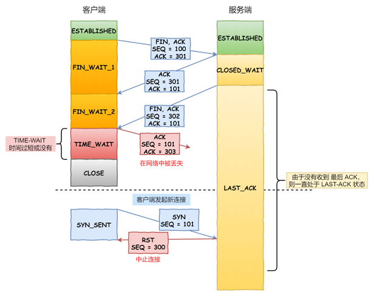

- 四次挥⼿中的最后⼀次 ACK 在⽹络中丢失了，服务端⼀直处于 LAST_ACK 状态
- 客户端由于开启了 tcp_tw_reuse 功能，客户端再次发起新连接的时候，会复⽤超过 1 秒后的 time_wait 状态的连接。 但客户端新发的 SYN 包会被忽略（由于时间戳），因为服务端⽐较了客户端的上⼀个报⽂与 SYN 报⽂的时间戳，过期的报⽂就会被服务端丢弃
- 服务端 FIN 报⽂迟迟没有收到四次挥⼿的最后⼀次 ACK，于是超时重发了 FIN 报⽂给客户端
- 处于 SYN_SENT 状态的客户端，由于收到了 FIN 报⽂，则会回 RST 给服务端，于是服务端就离开了LAST_ACK 状态
- 最初的客户端 SYN 报⽂超时重发了（ 1 秒钟后） ，此时就与服务端能正确的三次握⼿了

所以会说开启了 tcp_tw_reuse，可以在复⽤了 time_wait 状态的 1 秒过后成功建⽴连接，这 1 秒主要是花费在 SYN 包重传。  

另外，我们可以在程序中设置 socket 选项，来设置调⽤ close 关闭连接⾏为：


如果 l_onoff 为⾮ 0， 且 l_linger 值为 0， 那么调⽤ close 后，会⽴该发送⼀个 RST 标志给对端，该 TCP 连接将跳过四次挥⼿，也就跳过了 TIME_WAIT 状态，直接关闭。但这为跨越 TIME_WAIT 状态提供了⼀个可能，不过是⼀个⾮常危险的⾏为，不值得提倡。   

## 被动⽅的优化  

当被动⽅收到 FIN 报⽂时，内核会⾃动回复 ACK，同时连接处于 CLOSE_WAIT 状态，顾名思义，它表示等待应⽤进程调⽤ close 函数关闭连接。内核没有权利替代进程去关闭连接，因为如果主动⽅是通过 shutdown 关闭连接，那么它就是想在半关闭连接上接收数据或发送数据。因此，Linux 并没有限制 CLOSE_WAIT 状态的持续时间。  

当然，⼤多数应⽤程序并不使⽤ shutdown 函数关闭连接。所以， 当你⽤ netstat 命令发现⼤量 CLOSE_WAIT 状态。就需要排查你的应⽤程序，因为可能因为应⽤程序出现了 Bug， read 函数返回 0 时，没有调⽤ close 函数。处于 CLOSE_WAIT 状态时，调⽤了 close 函数，内核就会发出 FIN 报⽂关闭发送通道，同时连接进⼊ LAST_ACK 状态，等待主动⽅返回 ACK 来确认连接关闭。  

如果迟迟收不到这个 ACK，内核就会重发 FIN 报⽂，重发次数仍然由 tcp_orphan_retries 参数控制，这与主动⽅重发 FIN 报⽂的优化策略⼀致。

还有⼀点我们需要注意的， 如果被动⽅迅速调⽤ close 函数，那么被动⽅的 ACK 和 FIN 有可能在⼀个报⽂中发送，这样看起来，四次挥⼿会变成三次挥⼿，这只是⼀种特殊情况。  

### 双⽅同时关闭连接  

由于 TCP 是双全⼯的协议，所以是会出现两⽅同时关闭连接的现象，也就是同时发送了 FIN 报⽂。此时，上⾯介绍的优化策略仍然适⽤。两⽅发送 FIN 报⽂时，都认为⾃⼰是主动⽅，所以都进⼊了 FIN_WAIT1 状态， FIN 报⽂的重发次数仍由 tcp_orphan_retries 参数控制。  

接下来， 双⽅在等待 ACK 报⽂的过程中，都等来了 FIN 报⽂。这是⼀种新情况，所以连接会进⼊⼀种叫做 CLOSING 的新状态，它替代了 FIN_WAIT2 状态。接着，双⽅内核回复 ACK 确认对⽅发送通道的关闭后，进⼊TIME_WAIT 状态，等待 2MSL 的时间后，连接⾃动关闭。  

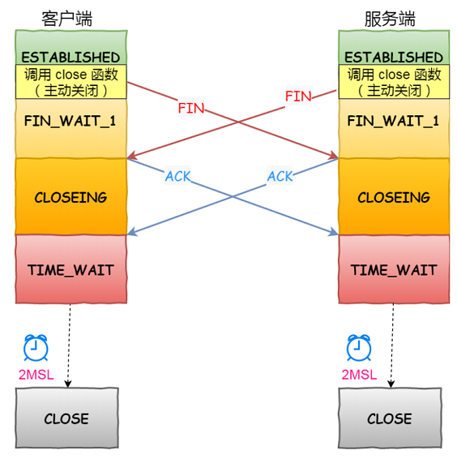

## ⼩结  

针对 TCP 四次挥⼿的优化，我们需要根据主动⽅和被动⽅四次挥⼿状态变化来调整系统 TCP 内核参数。  

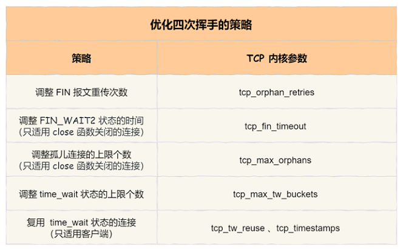

主动⽅的优化：  

- 主动发起 FIN 报⽂断开连接的⼀⽅，如果迟迟没收到对⽅的 ACK 回复，则会重传 FIN 报⽂，重传的次数由 tcp_orphan_retries 参数决定
- 当主动⽅收到 ACK 报⽂后，连接就进⼊ FIN_WAIT2 状态，根据关闭的⽅式不同，优化的⽅式也不同：  
  - 如果这是 close 函数关闭的连接，那么它就是孤⼉连接。如果 tcp_fin_timeout 秒内没有收到对⽅的 FIN 报⽂，连接就直接关闭。同时，为了应对孤⼉连接占⽤太多的资源， tcp_max_orphans 定义了最⼤孤⼉连接的数量，超过时连接就会直接释放
  - 如果是 shutdown 函数关闭的连接，则不受此参数限制  

- 当主动⽅接收到 FIN 报⽂，并返回 ACK 后，主动⽅的连接进⼊ TIME_WAIT 状态。这⼀状态会持续 1 分钟，为了防⽌ TIME_WAIT 状态占⽤太多的资源， tcp_max_tw_buckets 定义了最⼤数量，超过时连接也会直接释放
- 当 TIME_WAIT 状态过多时，还可以通过设置 tcp_tw_reuse 和 tcp_timestamps 为 1 ，将 TIME_WAIT 状态的端⼝复⽤于作为客户端的新连接，注意该参数只适⽤于客户端

被动⽅的优化：

- 被动关闭的连接⽅应对⾮常简单，它在回复 ACK 后就进⼊了 CLOSE_WAIT 状态，等待进程调⽤ close 函数关闭连接。因此，出现⼤量 CLOSE_WAIT 状态的连接时，应当从应⽤程序中找问题
- 当被动⽅发送 FIN 报⽂后，连接就进⼊ LAST_ACK 状态，在未等到 ACK 时，会在 tcp_orphan_retries 参数的控制下重发 FIN 报⽂  
