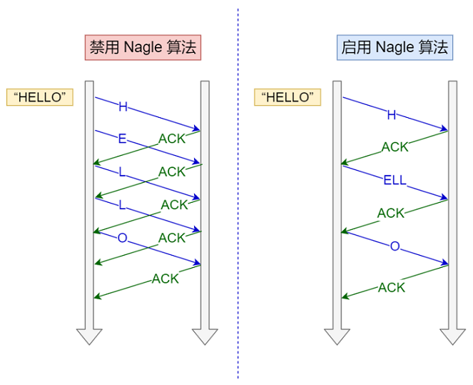

# tcpdump 和 wireshark

## tcpdump


常⽤的过滤表⽤法：


## Wireshark 

Wireshark 除了可以抓包外，还提供了可视化分析⽹络包的图形⻚⾯，同时，还内置了⼀系列的汇总分析⼯具。  

```
tcpdump -i eth1 icmp and host 183.232.231.174 -w ping.pcap
```

⽤ Wireshark  分析：


在其下⾯的⽹络包详情中， 可以更清楚的看到，这个⽹络包在协议栈各层的详细信息。⽐如，以编号 1 的⽹络包为例⼦：  


# 解密 TCP 三次握⼿和四次挥⼿  

```
tcpdump -i any tcp and host 192.168.3.200 and port 80 -w http.cap

curl http://192.168.3.200
```

使⽤ Wireshark 打开 http.pcap：


- 最开始的 3 个包就是 TCP 三次握⼿建⽴连接的包
- 中间是 HTTP 请求和响应的包
- ⽽最后的 3 个包则是 TCP 断开连接的挥⼿包  

Wireshark 可以⽤时序图的⽅式显示数据包交互的过程，从菜单栏中，点击 "统计 (Statistics)" -> "流量图 (Flow Graph)"，然后，在弹出的界⾯中的 "流量类型" 选择 "TCP Flows"，你可以更清晰的看到，整个过程中 TCP 流的执⾏过程：  


Wireshark ⼯具帮我们做了优化，它默认显示的是序列号 seq 是相对值，⽽不是真实值。  如果你想看到实际的序列号的值，可以右键菜单， 然后找到 "协议⾸选项"，接着找到Relative Seq后，把它给取消，操作如下：  


取消后， Seq 显示的就是真实值了：  


为什么抓到的 TCP 挥⼿是三次，⽽不是书上说的四次？  

因为服务器端收到客户端的 FIN 后，服务器端同时也要关闭连接，这样就可以把 ACK 和 FIN 合并到⼀起发送，节省了⼀个包，变成了“三次挥⼿”。⽽通常情况下，服务器端收到客户端的 FIN 后，很可能还没发送完数据，所以就会先回复客户端⼀个 ACK包，稍等⼀会⼉，完成所有数据包的发送后，才会发送 FIN 包，这也就是四次挥⼿了。  

# TCP 三次握⼿异常情况分析  

## TCP 第⼀次握⼿ SYN 丢包  

```
date;curl http://192.1682.12.36;date
//@ 阻塞。。。。。。

tcpdump  -i eth0 tcp and host 192.1682.12.36 and port 80 -w tcp_sys_timeout.pcap
```

把 tcp_sys_timeout.pcap ⽂件⽤ Wireshark 打开分析，显示如下图：  


客户端发起了 SYN 包后，⼀直没有收到服务端的 ACK ，所以⼀直超时重传了 5 次，并且每次RTO 超时时间是不同的：  

- 第⼀次是在 1 秒超时重传
- 第⼆次是在 3 秒超时重传
- 第三次是在 7 秒超时重传
- 第四次是在 15 秒超时重传
- 第五次是在 31 秒超时重传  

可以发现，每次超时时间 RTO 是指数（翻倍）上涨的，当超过最⼤重传次数后，客户端不再发送 SYN 包  

在 Linux 中，第⼀次握⼿的 SYN 超时重传次数，是如下内核参数指定的：  

```
cat /proc/sys/net/ipv4/tcp_syn_retries
```

## TCP 第⼆次握⼿ SYN、 ACK 丢包  

在客户端加上防⽕墙限制，直接粗暴的把来⾃服务端的数据都丢弃，防⽕墙的配置如下：  

```
iptables -I INPUT -s 192.1682.12.36 -j DROP

date;curl http://192.1682.12.36;date
```

客户端在这其间抓取的数据包，⽤ Wireshark 打开分析，显示的时序图如下：  


- 客户端发起 SYN 后，由于防⽕墙屏蔽了服务端的所有数据包，所以 curl 是⽆法收到服务端的 SYN、 ACK包，当发⽣超时后，就会重传 SYN 包
- 服务端收到客户的 SYN 包后，就会回 SYN、 ACK 包，但是客户端⼀直没有回 ACK，服务端在超时后，重传了 SYN、 ACK 包， 接着⼀会，客户端超时重传的 SYN 包⼜抵达了服务端，服务端收到后，超时定时器就重新计时，然后回了 SYN、 ACK 包，所以相当于服务端的超时定时器只触发了⼀次，⼜被重置
- 最后，客户端 SYN 超时重传次数达到了 5 次（tcp_syn_retries 默认值 5 次），就不再继续发送 SYN 包了  

可以发现， 当第⼆次握⼿的 SYN、 ACK 丢包时，客户端会超时重发 SYN 包，服务端也会超时重传 SYN、 ACK 包。  

客户端设置了防⽕墙，屏蔽了服务端的⽹络包，为什么 tcpdump 还能抓到服务端的⽹络包？  

添加 iptables 限制后， tcpdump 是否能抓到包 ，这要看添加的 iptables 限制条件：

- 如果添加的是 INPUT 规则，则可以抓得到包
- 如果添加的是 OUTPUT 规则，则抓不到包  

⽹络包进⼊主机后的顺序如下：  

- 进来的顺序 Wire -> NIC -> tcpdump -> netfilter/iptables  
- 出去的顺序 iptables -> tcpdump -> NIC -> Wire  

第⼆次握⼿ SYN、 ACK 限制最⼤重传次数是多少？  

TCP 第⼆次握⼿ SYN、 ACK 包的最⼤重传次数是通过 tcp_synack_retries 内核参数限制的，其默认值如下：  

```
cat /proc/sys/net/ipv4/tcp_synack_retries
```

## TCP 第三次握⼿ ACK 丢包  

在服务端配置防⽕墙，屏蔽客户端 TCP 报⽂中标志位是ACK 的包，也就是当服务端收到客户端的 TCP ACK 的报⽂时就会丢弃， iptables 配置命令如下：  

```
iptables -I INPUT -s 192.1682.12.36 -p tcp --tcp-flag ACK ACK -j DROP

tcpdump -i eth0 tcp and host 192.1682.12.36 and port 80 -w tcp_thir_ack_timeout.pcap

telnet 192.1682.12.36 80
```

此时，由于服务端收不到第三次握⼿的 ACK 包，所以⼀直处于 SYN_RECV 状态：

```
netstat -napt | grep 192.168.12.36
```

过了 1 分钟后，观察发现服务端的 TCP 连接不⻅了：  

```
netstat -napt | grep 192.168.12.37
```

过了 30 分后，客户端依然还是处于 ESTABLISHED 状态：  

```
netstat -napt | grep 192.168.12.36
```

接着，在刚才客户端建⽴的 telnet 会话，输⼊ 123456 字符，进⾏发送：  

```
telnet 192.168.12.36  80
```

持续好⻓⼀段时间，客户端的 telnet 才断开连接。

把刚抓的数据包，⽤ Wireshark 打开分析，显示的时序图如下：  


- 客户端发送 SYN 包给服务端，服务端收到后，回了个 SYN、 ACK 包给客户端，此时服务端的 TCP 连接处于 SYN_RECV 状态  
- 客户端收到服务端的 SYN、 ACK 包后，给服务端回了个 ACK 包，此时客户端的 TCP 连接处于 ESTABLISHED 状态  
- 由于服务端配置了防⽕墙，屏蔽了客户端的 ACK 包，所以服务端⼀直处于 SYN_RECV 状态，没有进⼊ESTABLISHED 状态， tcpdump 之所以能抓到客户端的 ACK 包，是因为数据包进⼊系统的顺序是先进⼊ tcpudmp，后经过 iptables  
- 接着，服务端超时重传了 SYN、 ACK 包，重传了 5 次后，也就是超过 tcp_synack_retries 的值（默认值是5），然后就没有继续重传了，此时服务端的 TCP 连接主动中⽌了，所以刚才处于 SYN_RECV 状态的 TCP 连接断开了，⽽客户端依然处于 ESTABLISHED 状态 
- 虽然服务端 TCP 断开了，但过了⼀段时间，发现客户端依然处于 ESTABLISHED 状态，于是就在客户端的 telnet 会话输⼊了 123456 字符
- 此时由于服务端已经断开连接， 客户端发送的数据报⽂，⼀直在超时重传，每⼀次重传， RTO 的值是指数增⻓的，所以持续了好⻓⼀段时间，客户端的 telnet 才报错退出了，此时共重传了 15 次  

TCP 建⽴连接后的数据包最⼤超时重传次数是多少？  

TCP 建⽴连接后的数据包传输，最⼤超时重传次数是由 tcp_retries2 指定：

```
cat /proc/sys/net/ipv4/tcp_retries2
```

这⾥就需要提到 TCP 的保活机制。这个机制的原理是这样的：

定义⼀个时间段，在这个时间段内，如果没有任何连接相关的活动， TCP 保活机制会开始作⽤，每隔⼀个时间间隔，发送⼀个探测报⽂，该探测报⽂包含的数据⾮常少，如果连续⼏个探测报⽂都没有得到响应，则认为当前的 TCP 连接已经死亡，系统内核将错误信息通知给上层应⽤程序。在 Linux 内核可以有对应的参数可以设置保活时间、保活探测的次数、保活探测的时间间隔，以下都为默认值：

```
net.ipv4.tcp_keepalive_time=7200
net.ipv4.tcp_keepalive_intvl=75
net.ipv4.tcp_keepalive_probes=9
```

- tcp_keepalive_time=7200：表示保活时间是 7200 秒（2⼩时），也就 2 ⼩时内如果没有任何连接相关的活动，则会启动保活机制

- tcp_keepalive_intvl=75：表示每次检测间隔 75 秒  

- tcp_keepalive_probes=9：表示检测 9 次⽆响应，认为对⽅是不可达的，从⽽中断本次的连接  

也就是说在 Linux 系统中，最少需要经过 2 ⼩时 11 分 15 秒才可以发现⼀个死亡连接。

# TCP 快速建⽴连接  

客户端在向服务端发起 HTTP GET 请求时，⼀个完整的交互过程，需要 2.5 个 RTT 的时延。  由于第三次握⼿是可以携带数据的，这时如果在第三次握⼿发起 HTTP GET 请求，需要 2 个 RTT 的时延。  


在 Linux 3.7 内核版本中，提供了 TCP Fast Open 功能，这个功能可以减少 TCP 连接建⽴的时延：


- 在第⼀次建⽴连接的时候，服务端在第⼆次握⼿产⽣⼀个 Cookie （已加密）并通过 SYN、 ACK 包⼀起发给客户端，于是客户端就会缓存这个 Cookie ，所以第⼀次发起 HTTP Get 请求的时候，还是需要 2 个 RTT 的时延
- 在下次请求的时候，客户端在 SYN 包带上 Cookie 发给服务端，就提前可以跳过三次握⼿的过程，因为 Cookie 中维护了⼀些信息，服务端可以从 Cookie 获取 TCP 相关的信息，这时发起的 HTTP GET 请求就只需要 1 个 RTT 的时延  

客户端在请求并存储了 Fast Open Cookie 之后，可以不断重复 TCP Fast Open 直⾄服务器认为 Cookie ⽆效（通常为过期）。  

可以通过设置 net.ipv4.tcp_fastopn 内核参数，来打开 Fast Open 功能。net.ipv4.tcp_fastopn 各个值的意义:  

- 0 关闭
- 1 作为客户端使⽤ Fast Open 功能
- 2 作为服务端使⽤ Fast Open 功能
- 3 ⽆论作为客户端还是服务器，都可以使⽤ Fast Open 功能  

## TCP Fast Open 抓包分析 

数据包 7 号，客户端发起了第⼆次 TCP 连接时， SYN 包会携带 Cooike，并且⻓度为 5 的数据。服务端收到后，校验 Cooike 合法，于是就回了 SYN、 ACK 包，并且确认应答收到了客户端的数据包， ACK = 5 + 1 = 6。

 

# TCP 重复确认和快速重传  

当接收⽅收到乱序数据包时，会发送重复的 ACK，告知发送⽅要重发该数据包， 当发送⽅收到 3 个重复 ACK 时，就会触发快速重传，⽴刻重发丢失数据包。 


- 数据包 1 期望的下⼀个数据包 Seq 是 1，但是数据包 2 发送的 Seq 却是 10945，说明收到的是乱序数据包
- 于是回了数据包 3 ，还是同样的 Seq = 1， Ack = 1，这表明是重复的 ACK
- 数据包 4 和 6 依然是乱序的数据包，于是依然回了重复的 ACK
- 当对⽅收到三次重复的 ACK 后，于是就快速重传了 Seq = 1 、 Len = 1368 的数据包 8
- 当收到重传的数据包后，发现 Seq = 1 是期望的数据包，于是就发送了个确认收到快速重传的 ACK  

快速重传和重复 ACK 标记信息是 Wireshark 的功能，⾮数据包本身的信息。  

以上案例在 TCP 三次握⼿时协商开启了选择性确认 SACK，因此⼀旦数据包丢失并收到重复 ACK ，即使在丢失数据包之后还成功接收了其他数据包，也只需要重传丢失的数据包。如果不启⽤ SACK，就必须重传丢失包之后的每个数据包。

如果要⽀持 SACK ，必须双⽅都要⽀持。在 Linux 下，可以通过 net.ipv4.tcp_sack 参数打开这个功能（Linux 2.4 后默认打开）。  

# TCP 流量控制  

## 发送窗⼝的分析  

TCP 为了防⽌发送⽅⽆脑的发送数据，导致接收⽅缓冲区被填满，所以就有了滑动窗⼝的机制，它可利⽤接收⽅的接收窗⼝来控制发送⽅要发送的数据量，也就是流量控制。接收窗⼝是由接收⽅指定的值，存储在 TCP 头部中，它可以告诉发送⽅⾃⼰的 TCP 缓冲空间区⼤⼩，这个缓冲区是给应⽤程序读取数据的空间：  

- 如果应⽤程序读取了缓冲区的数据，那么缓冲空间区就会把被读取的数据移除  
- 如果应⽤程序没有读取数据，则数据会⼀直滞留在缓冲区  

接收窗⼝的⼤⼩，是在 TCP 三次握⼿中协商好的，后续数据传输时，接收⽅发送确认应答 ACK 报⽂时，会携带当前的接收窗⼝的⼤⼩，以此来告知发送⽅。

现实中服务器会出现繁忙的情况，当应⽤程序读取速度慢，那么缓存空间会慢慢被占满，于是为了保证发送⽅发送的数据不会超过缓冲区⼤⼩，服务器则会调整窗⼝⼤⼩的值，接着通过 ACK 报⽂通知给对⽅，告知现在的接收窗⼝⼤⼩，从⽽控制发送⽅发送的数据⼤⼩。  


假设接收⽅处理数据的速度跟不上接收数据的速度，缓存就会被占满，从⽽导致接收窗⼝为 0，当发送⽅接收到零窗⼝通知时，就会停⽌发送数据。 


接着，发送⽅会定时发送窗⼝⼤⼩探测报⽂，以便及时知道接收⽅窗⼝⼤⼩的变化：


- 发送⽅发送了数据包 1 给接收⽅，接收⽅收到后，由于缓冲区被占满，回了个零窗⼝通知
- 发送⽅收到零窗⼝通知后，就不再发送数据了，直到过了 3.4 秒后，发送了⼀个 TCP Keep-Alive 报⽂，也就是窗⼝⼤⼩探测报⽂
- 当接收⽅收到窗⼝探测报⽂后，就⽴⻢回⼀个窗⼝通知，但是窗⼝⼤⼩还是 0
- 发送⽅发现窗⼝还是 0，于是继续等待了 6.8 （翻倍） 秒后，⼜发送了窗⼝探测报⽂，接收⽅依然还是回了窗⼝为 0 的通知
- 发送⽅发现窗⼝还是 0，于是继续等待了 13.5 （翻倍） 秒后，⼜发送了窗⼝探测报⽂，接收⽅依然还是回了窗⼝为 0 的通知

可以发现，这些窗⼝探测报⽂以 3.4s、 6.5s、 13.5s 的间隔出现，说明超时时间会翻倍递增。  

在 Wireshark 看到的 Windows size 也就是 " win = "，这个值表示在向对⽅声明⾃⼰的接收窗⼝。    

真实窗⼝⼤⼩的计算公式如下：  

```
Window size value * Window size scaling factor = Caculated window size
```


实际上是 Caculated window size 的值是 Wireshark ⼯具帮我们算好的， Window size scaling factor 和 Windos size value 的值是在 TCP 头部中，其中 Window size scaling factor 是在三次握⼿过程中确定的，如果你抓包的数据没有 TCP 三次握⼿，那可能就⽆法算出真实的窗⼝⼤⼩的值，如下图：  


发送窗⼝虽然是由接收窗⼝决定，但是它⼜可以被⽹络因素影响，也就是拥塞窗⼝，实际上发送窗⼝是值是 min(拥塞窗⼝，接收窗⼝)。  

发送窗⼝决定了⼀⼝⽓能发多少字节，⽽ MSS 决定了这些字节要分多少包才能发完。举个例⼦，如果发送窗⼝为 16000 字节的情况下，如果 MSS 是 1000 字节，那就需要发送 1600/1000 = 16 个包。  

发送⽅在⼀个窗⼝发出 n 个包，是不是需要 n 个 ACK 确认报⽂? 不⼀定，因为 TCP 有累计确认机制，所以当收到多个数据包时，只需要应答最后⼀个数据包的 ACK 报⽂就可以了。  

## TCP 延迟确认与 Nagle 算法  

当我们 TCP 报⽂的承载的数据⾮常⼩的时候，例如⼏个字节，那么整个⽹络的效率是很低的，因为每个 TCP 报⽂中都会有 20 个字节的 TCP 头部，也会有 20 个字节的 IP 头部，⽽数据只有⼏个字节，所以在整个报⽂中有效数据占有的⽐重就会⾮常低。  

那么就出现了常⻅的两种策略，来减少⼩报⽂的传输，分别是：

- Nagle 算法
- 延迟确认  

### Nagle 算法  

Nagle 算法做了⼀些策略来避免过多的⼩数据报⽂发送，这可提⾼传输效率。Nagle 算法的策略：

- 没有已发送未确认报⽂时，⽴刻发送数据
- 存在未确认报⽂时，直到没有已发送未确认报⽂或数据⻓度达到 MSS ⼤⼩时，再发送数据

只要没满⾜上⾯条件中的⼀条，发送⽅⼀直在囤积数据，直到满⾜上⾯的发送条件。  



上图右侧启⽤了 Nagle 算法，它的发送数据的过程：

- ⼀开始由于没有已发送未确认的报⽂，所以就⽴刻发了 H 字符
- 接着，在还没收到对 H 字符的确认报⽂时，发送⽅就⼀直在囤积数据，直到收到了确认报⽂后，此时没有已发送未确认的报⽂，于是就把囤积后的 ELL 字符⼀起发给了接收⽅
- 待收到对 ELL 字符的确认报⽂后，于是把最后⼀个 O 字符发送了出去  

可以看出， Nagle 算法⼀定会有⼀个⼩报⽂，也就是在最开始的时候。  

另外， Nagle 算法默认是打开的，如果对于⼀些需要⼩数据包交互的场景的程序，⽐如， telnet 或 ssh 这样的交互性⽐较强的程序，则需要关闭 Nagle 算法。可以在 Socket 设置 TCP_NODELAY 选项来关闭这个算法（关闭 Nagle 算法没有全局参数，需要根据每个应⽤⾃⼰的特点来关闭）。  

```
setsocket(sock_fd,IPPROTO_TCP,TCP_NODELAY,(char*)&value,sizeof(int));
```

### 延迟确认  

事实上当没有携带数据的 ACK，它的⽹络效率也是很低的，因为它也有 40 个字节的 IP 头 和 TCP 头，但却没有携带数据报⽂。为了解决 ACK 传输效率低问题，所以就衍⽣出了 TCP 延迟确认。  

TCP 延迟确认的策略：

- 当有响应数据要发送时， ACK 会随着响应数据⼀起⽴刻发送给对⽅
- 当没有响应数据要发送时， ACK 将会延迟⼀段时间，以等待是否有响应数据可以⼀起发送
- 如果在延迟等待发送 ACK 期间，对⽅的第⼆个数据报⽂⼜到达了，这时就会⽴刻发送 ACK  


延迟等待的时间是在 Linux 内核中定义的，如下图：  


关键就需要 HZ 这个数值⼤⼩， HZ 是跟系统的时钟频率有关，每个操作系统都不⼀样，如下图：  


知道了 HZ 的⼤⼩，那么就可以算出：

- 最⼤延迟确认时间是 200 ms （1000/5）
- 最短延迟确认时间是 40 ms （1000/25）  

TCP 延迟确认可以在 Socket 设置 TCP_QUICKACK 选项来关闭这个算法：

```
setsocket(sock_fd,IPPROTO_TCP,TCP_QUICKACK,(char*)&value,sizeof(int));
```

### 延迟确认 和 Nagle 算法混合使⽤  

当 TCP 延迟确认 和 Nagle 算法混合使⽤时，会导致时耗增⻓，如下图： 


发送⽅使⽤了 Nagle 算法，接收⽅使⽤了 TCP 延迟确认会发⽣如下的过程：  

- 发送⽅先发出⼀个⼩报⽂，接收⽅收到后，由于延迟确认机制，⾃⼰⼜没有要发送的数据，只能⼲等着发送⽅的下⼀个报⽂到达
- ⽽发送⽅由于 Nagle 算法机制，在未收到第⼀个报⽂的确认前，是不会发送后续的数据
- 所以接收⽅只能等待最⼤时间 200 ms 后，才回 ACK 报⽂，发送⽅收到第⼀个报⽂的确认报⽂后，也才可以发送后续的数据

很明显，这两个同时使⽤会造成额外的时延，这就会使得⽹络"很慢"的感觉。要解决这个问题，只有两个办法：

- 要不发送⽅关闭 Nagle 算法
- 要不接收⽅关闭 TCP 延迟确认  