# TCP 基本认识  

## 为什么需要 TCP 协议

IP 层是不可靠的，它不保证⽹络包的交付、不保证⽹络包的按序交付、也不保证⽹络包中的数据的完整性。  

如果需要保障⽹络数据包的可靠性，那么就需要由上层（传输层）的 TCP 协议来负责。因为 TCP 是⼀个⼯作在传输层的可靠数据传输的服务，它能确保接收端接收的⽹络包是⽆损坏、⽆间隔、⾮冗余和按序的。  

## 什么是 TCP 

TCP 是⾯向连接的、可靠的、基于字节流的传输层通信协议。

- ⾯向连接：⼀定是⼀对⼀才能连接，不能像 UDP 协议可以⼀个主机同时向多个主机发送消息，也就是⼀对多是⽆法做到的
- 可靠的：⽆论的⽹络链路中出现了怎样的链路变化， TCP 都可以保证⼀个报⽂⼀定能够到达接收端  
- 字节流：消息是没有边界的，所以⽆论消息有多⼤都可以进⾏传输。并且消息是有序的，前⼀个消息没有收到的时候，即使先收到了后⾯的字节，那么也不能扔给应⽤层去处理，同时对重复的报⽂会⾃动丢弃

## 如何唯⼀确定⼀个 TCP 连接  

TCP 四元组可以唯⼀的确定⼀个连接，四元组包括如下：  

- 源地址  
- 源端⼝
- ⽬的地址
- ⽬的端⼝  


- 源地址和⽬的地址的字段（32位）是在 IP 头部中，作⽤是通过 IP 协议发送报⽂给对⽅主机
- 源端⼝和⽬的端⼝的字段（16位）是在 TCP 头部中，作⽤是告诉 TCP 协议应该把报⽂发给哪个进程

## 监听⼀个端⼝的 TCP 的最⼤连接数  

服务器通常固定在某个本地端⼝上监听，等待客户端的连接请求。因此，客户端 IP 和端⼝是可变的，其理论值计算公式如下：


对 IPv4，客户端的 IP 数最多为 2 的 32 次⽅，客户端的端⼝数最多为 2 的 16 次⽅，也就是服务端单机最⼤ TCP 连接数，约为 2 的 48 次⽅。  

当然，服务端最⼤并发 TCP 连接数远不能达到理论上限：

- ⾸先主要是⽂件描述符限制， Socket 都是⽂件，所以⾸先要通过 ulimit 配置⽂件描述符的数⽬  
- 另⼀个是内存限制，每个 TCP 连接都要占⽤⼀定内存，操作系统的内存是有限的  

## UDP 和 TCP 有什么区别  

UDP 不提供复杂的控制机制，利⽤ IP 提供⾯向⽆连接的通信服务。UDP 协议⾮常简单，头部只有 8 个字节（64 位）， UDP 的头部格式如下：   


- ⽬标和源端⼝：主要是告诉 UDP 协议应该把报⽂发给哪个进程
- 包⻓度：该字段保存了 UDP ⾸部的⻓度跟数据的⻓度之和
- 校验和：校验和是为了提供可靠的 UDP ⾸部和数据⽽设计  

TCP 和 UDP 区别：

- 连接  
  - TCP 是⾯向连接的传输层协议，传输数据前先要建⽴连接  
  - UDP 是不需要连接，即刻传输数据  
- 服务对象  
  - TCP 是⼀对⼀的两点服务，即⼀条连接只有两个端点  
  - UDP ⽀持⼀对⼀、⼀对多、多对多的交互通信  
- 可靠性
  - TCP 是可靠交付数据的，数据可以⽆差错、不丢失、不重复、按需到达  
  - UDP 是尽最⼤努⼒交付，不保证可靠交付数据  
- 拥塞控制、流量控制  
  - TCP 有拥塞控制和流量控制机制，保证数据传输的安全性  
  - UDP 则没有，即使⽹络⾮常拥堵了，也不会影响 UDP 的发送速  
- ⾸部开销  
  - TCP ⾸部⻓度较⻓，会有⼀定的开销，⾸部在没有使⽤选项字段时是 20 个字节，如果使⽤了选项字段则会变⻓的
  - UDP ⾸部只有 8 个字节，并且是固定不变的，开销较⼩  
- 传输⽅式  
  - TCP 是流式传输，没有边界，但保证顺序和可靠  
  - UDP 是⼀个包⼀个包的发送，是有边界的，但可能会丢包和乱序  
- 分⽚不同  
  - TCP 的数据⼤⼩如果⼤于 MSS ⼤⼩，则会在传输层进⾏分⽚，⽬标主机收到后，也同样在传输层组装 TCP 数据包，如果中途丢失了⼀个分⽚，只需要传输丢失的这个分⽚
  - UDP 的数据⼤⼩如果⼤于 MTU ⼤⼩，则会在 IP 层进⾏分⽚，⽬标主机收到后，在 IP 层组装完数据，接着再传给传输层，但是如果中途丢了⼀个分⽚，在实现可靠传输的 UDP 时则就需要重传所有的数据包，这样传输效率⾮常差，所以通常 UDP 的报⽂应该⼩于 MTU  

由于 TCP 是⾯向连接，能保证数据的可靠性交付，因此经常⽤于：  

- FTP ⽂件传输  
- HTTP/HTTPS

由于 UDP ⾯向⽆连接，它可以随时发送数据，再加上UDP本身的处理既简单⼜⾼效，因此经常⽤于：  

- 包总量较少的通信，如 DNS 、 SNMP 等  
- 视频、⾳频等多媒体通信  
- ⼴播通信  

# TCP 头部格式  


- 序列号：在建⽴连接时由计算机⽣成的随机数作为其初始值，通过 SYN 包传给接收端主机，每发送⼀次数据，就累加⼀次该数据字节数的⼤⼩。 ⽤来解决⽹络包乱序问题
- 确认应答号：指下⼀次期望收到的数据的序列号，发送端收到这个确认应答以后可以认为在这个序号以前的数据都已经被正常接收。 ⽤来解决不丢包的问题

- 控制位：
  - ACK：该位为 1 时，确认应答的字段变为有效， TCP 规定除了最初建⽴连接时的 SYN 包之外该位必须设置为 1 
  - RST：该位为 1 时，表示 TCP 连接中出现异常必须强制断开连接
  - SYN：该位为 1 时，表示希望建⽴连接，并在其序列号的字段进⾏序列号初始值的设定
  - FIN：该位为 1 时，表示不会再有数据发送，希望断开连接。当通信结束希望断开连接时，通信双⽅的主机之间就可以相互交换 FIN 位为 1 的 TCP 段

# TCP 连接建⽴  

## 三次握⼿过程和状态变迁  

TCP 是⾯向连接的协议，所以使⽤ TCP 前必须先建⽴连接，⽽建⽴连接是通过三次握⼿来进⾏的：

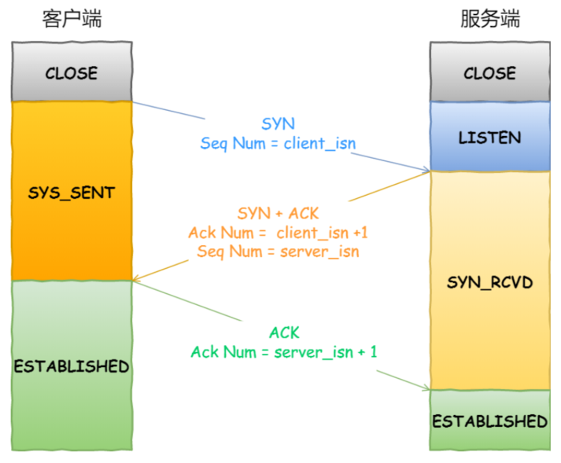

- ⼀开始，客户端和服务端都处于 CLOSED 状态。先是服务端主动监听某个端⼝，处于 LISTEN 状态  
- 客户端会随机初始化序号（client_isn），将此序号置于 TCP ⾸部的序号字段中，同时把 SYN 标志位置为 1 ，表示 SYN 报⽂。接着把第⼀个 SYN 报⽂发送给服务端，表示向服务端发起连接，该报⽂不包含应⽤层数据，之后客户端处于 SYN-SENT 状态
- 服务端收到客户端的 SYN 报⽂后，⾸先服务端也随机初始化⾃⼰的序号（server_isn ），将此序号填⼊TCP ⾸部的序号字段中，其次把 TCP ⾸部的确认应答号字段填⼊ client_isn + 1 , 接着把 SYN 和 ACK 标志位置为 1 。最后把该报⽂发给客户端，该报⽂也不包含应⽤层数据，之后服务端处于 SYNRCVD 状态 
- 客户端收到服务端报⽂后，还要向服务端回应最后⼀个应答报⽂，⾸先该应答报⽂ TCP ⾸部 ACK 标志位置为 1 ，其次确认应答号字段填⼊ server_isn + 1 ，最后把报⽂发送给服务端，这次报⽂可以携带客户到服务器的数据，之后客户端处于 ESTABLISHED 状态
- 服务器收到客户端的应答报⽂后，也进⼊ ESTABLISHED 状态  

⼀旦完成三次握⼿，双⽅都处于 ESTABLISHED 状态，此时连接就已建⽴完成，客户端和服务端就可以相互发送数据了。第三次握⼿是可以携带数据的，前两次握⼿是不可以携带数据的。

## 为什么是三次握⼿  

通过三次握⼿能防⽌历史连接的建⽴，能减少双⽅不必要的资源开销，能帮助双⽅同步初始化序列号。序列号能够保证数据包不重复、不丢弃和按序传输。  

- 两次握⼿：⽆法防⽌历史连接的建⽴，会造成双⽅资源的浪费，也⽆法可靠的同步双⽅序列号
- 四次握⼿：三次握⼿就已经理论上最少可靠连接建⽴，所以不需要使⽤更多的通信次数   

### 三次握手避免历史连接  


客户端连续发送多次 SYN 建⽴连接的报⽂，在⽹络拥堵情况下：  

- ⼀个旧 SYN 报⽂⽐最新的 SYN 报⽂早到达了服务端  
- 那么此时服务端就会回⼀个 SYN + ACK 报⽂给客户端  
- 客户端收到后可以根据⾃身的上下⽂，判断这是⼀个历史连接（序列号过期或超时），那么客户端就会发送 RST 报⽂给服务端，表示中⽌这⼀次连接  

如果是两次握⼿连接，就不能判断当前连接是否是历史连接，三次握⼿则可以在客户端（发送⽅）准备发送第三次报⽂时，客户端因有⾜够的上下⽂来判断当前连接是否是历史连接：  

- 如果是历史连接（序列号过期或超时），则第三次握⼿发送的报⽂是 RST 报⽂，以此中⽌历史连接  
- 如果不是历史连接，则第三次发送的报⽂是 ACK 报⽂，通信双⽅就会成功建⽴连接  

### 三次握手同步双⽅初始序列号  

TCP 协议的通信双⽅， 都必须维护⼀个序列号， 序列号是可靠传输的⼀个关键因素，它的作⽤：  

- 接收⽅可以去除重复的数据  
- 接收⽅可以根据数据包的序列号按序接收  
- 可以标识发送出去的数据包中， 哪些是已经被对⽅收到的  

序列号在 TCP 连接中占据着⾮常重要的作⽤，所以当客户端发送携带初始序列号的 SYN 报⽂的时候，需要服务端回⼀个 ACK 应答报⽂，表示客户端的 SYN 报⽂已被服务端成功接收，那当服务端发送初始序列号给客户端的时候，依然也要得到客户端的应答回应， 这样⼀来⼀回，才能确保双⽅的初始序列号能被可靠的
同步。  


四次握⼿其实也能够可靠的同步双⽅的初始化序号，但由于第⼆步和第三步可以优化成⼀步，所以就成了三次握⼿。⽽两次握⼿只保证了⼀⽅的初始序列号能被对⽅成功接收，没办法保证双⽅的初始序列号都能被确认接收。  

### 三次握手避免资源浪费  

如果只有两次握⼿，当客户端的 SYN 请求连接在⽹络中阻塞，客户端没有接收到 ACK 报⽂，就会重新发送 SYN ，由于没有第三次握⼿，服务器不清楚客户端是否收到了⾃⼰发送的建⽴连接的 ACK 确认信号，所以每收到⼀个 SYN 就只能先主动建⽴⼀个连接。

如果客户端的 SYN 阻塞了，重复发送多次 SYN 报⽂，那么服务器在收到请求后就会建⽴多个冗余的⽆效连接，造成不必要的资源浪费。即两次握⼿会造成消息滞留情况下，服务器重复接受⽆⽤的连接请求 SYN 报⽂，⽽造成重复分配资源。  

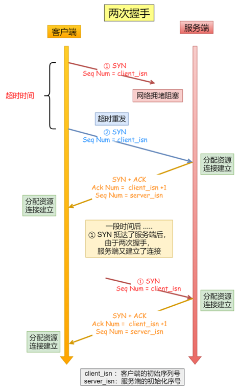

## 初始序列号 ISN

为什么客户端和服务端的初始序列号 ISN 是不相同的？ 

- 根据序号将不属于本连接的报⽂段丢弃：如果⼀个已经失效的连接被重⽤了，但是该旧连接的历史报⽂还残留在⽹络中，如果序列号相同，那么就⽆法分辨出该报⽂是不是历史报⽂，如果历史报⽂被新的连接接收了，则会产⽣数据错乱
- 为了安全性：防⽌⿊客伪造的相同序列号的 TCP 报⽂被对⽅接收

初始序列号 ISN 是如何随机产⽣的？ 

RFC1948 中提出了⼀个较好的初始化序列号 ISN 随机⽣成算法：ISN = M + F (localhost, localport, remotehost, remoteport)  

-  M 是⼀个计时器，这个计时器每隔 4 毫秒加 1  
-  F 是⼀个 Hash 算法，根据源 IP、⽬的 IP、源端⼝、⽬的端⼝⽣成⼀个随机数值。要保证 Hash 算法不能被外部轻易推算得出，⽤ MD5 算法是⼀个⽐较好的选择  

## MSS   

- MTU ：⼀个⽹络包的最⼤⻓度，以太⽹中⼀般为 1500 字节  
- MSS ：除去 IP 和 TCP 头部之后，⼀个⽹络包所能容纳的 TCP 数据的最⼤⻓度  


IP 层分片：当 IP 层有⼀个超过 MTU ⼤⼩的数据（TCP 头部 + TCP 数据）要发送，那么 IP 层就要进⾏分⽚，把数据分⽚成若⼲⽚，保证每⼀个分⽚都⼩于 MTU。把⼀份 IP 数据报进⾏分⽚以后，由⽬标主机的 IP 层来进⾏重新组装后，再交给上⼀层 TCP 传输层。那么当如果⼀个 IP 分⽚丢失，整个 IP 报⽂的所有分⽚都得重传

TCP 层分片：可以得知如果由 IP 层进⾏分⽚传输，是⾮常没有效率的。  为了达到最佳的传输效能 TCP 协议在建⽴连接的时候通常要协商双⽅的 MSS 值，当 TCP 层发现数据超过 MSS 时，则就先会进⾏分⽚，当然由它形成的 IP 包的⻓度也就不会⼤于 MTU ，⾃然也就不⽤ IP 分⽚了，经过 TCP 层分⽚后，如果⼀个 TCP 分⽚丢失后， 进⾏重发时也是以 MSS 为单位，⽽不⽤重传所有的分⽚，⼤⼤增加了重传的效率

## SYN 攻击  

假设攻击者短时间伪造不同 IP 地址的 SYN 报⽂，服务端每接收到⼀个 SYN 报⽂，就进⼊ SYN_RCVD 状态，但服务端发送出去的 ACK + SYN 报⽂，⽆法得到未知 IP 主机的ACK 应答，久⽽久之就会占满服务端的 SYN 接收队列（未连接队列） ，使得服务器不能为正常⽤户服务。  


### 避免 SYN 攻击⽅式⼀  

当⽹卡接收数据包的速度⼤于内核处理的速度时，会有⼀个队列保存这些数据包。控制该队列的最⼤值如下参数：

```
net.core.netdev_max_backlog  
```

SYN_RCVD 状态连接的最⼤个数：  

```
net.ipv4.tcp_max_syn_backlog
```

超出处理能时，对新的 SYN 直接回报 RST，丢弃连接：  

```
net.ipv4.tcp_abort_on_overflow
```

### 避免 SYN 攻击⽅式⼆  

Linux 内核的 SYN （未完成连接建⽴）队列与 Accpet （已完成连接建⽴）队列。

正常流程：

- 当服务端接收到客户端的 SYN 报⽂时，会将其加⼊到内核的 SYN 队列
- 接着发送 SYN + ACK 给客户端，等待客户端回应 ACK 报⽂
- 服务端接收到 ACK 报⽂后，从 SYN 队列 移除放⼊到 Accept 队列
- 应⽤通过调⽤ accpet() socket 接⼝，从 Accept 队列取出连接


如果应⽤程序过慢时，就会导致 Accept 队列被占满：


如果不断受到 SYN 攻击，就会导致 SYN 队列被占满：


tcp_syncookies 的⽅式可以应对 SYN 攻击的⽅法：  

```
net.ipv4.tcp_syncookies = 1
```

当 SYN 队列满之后，后续服务器收到 SYN 包，不进⼊SYN 队列，计算出⼀个 cookie 值，再以 SYN + ACK 中的序列号返回客户端。服务端接收到客户端的应答报⽂时，服务器会检查这个 ACK 包的合法性。如果合法，直接放⼊到 Accept 队列，最后应⽤通过调⽤ accpet() 接⼝，从 Accept 队列 取出的连接 ：   


# TCP 连接断开 

## 四次挥⼿过程和状态变迁

TCP 断开连接是通过四次挥⼿⽅式。双⽅都可以主动断开连接，断开连接后主机中的资源将被释放。


- 客户端打算关闭连接，此时会发送⼀个 TCP ⾸部 FIN 标志位被置为 1 的报⽂，也即 FIN 报⽂，之后客户端进⼊ FIN_WAIT_1 状态 
- 服务端收到该报⽂后，就向客户端发送 ACK 应答报⽂，接着服务端进⼊ CLOSED_WAIT 状态  
- 客户端收到服务端的 ACK 应答报⽂后，之后进⼊ FIN_WAIT_2 状态  
- 等待服务端处理完数据后，也向客户端发送 FIN 报⽂，之后服务端进⼊ LAST_ACK 状态
- 客户端收到服务端的 FIN 报⽂后，回⼀个 ACK 应答报⽂，之后进⼊ TIME_WAIT 状态
- 服务器收到了 ACK 应答报⽂后，就进⼊了 CLOSED 状态，⾄此服务端已经完成连接的关闭 
- 客户端在经过 2MSL ⼀段时间后，⾃动进⼊ CLOSED 状态，⾄此客户端也完成连接的关闭  

## 为什么挥⼿需要四次

- 关闭连接时，客户端向服务端发送 FIN 时，仅仅表示客户端不再发送数据了但是还能接收数据
- 服务器收到客户端的 FIN 报⽂时，先回⼀个 ACK 应答报⽂，⽽服务端可能还有数据需要处理和发送，等服务端不再发送数据时，才发送 FIN 报⽂给客户端来表示同意现在关闭连接，所以服务端的 ACK 和 FIN ⼀般都会分开发送，从⽽⽐三次握⼿导致多了⼀次

## TIME_WAIT

MSL 是 Maximum Segment Lifetime， 报⽂最⼤⽣存时间，它是任何报⽂在⽹络上存在的最⻓时间，超过这个时间报⽂将被丢弃。

因为 TCP 报⽂基于是 IP 协议的，⽽ IP 头中有⼀个 TTL 字段是 IP 数据报可以经过的最⼤路由数，每经过⼀个路由器处理此值就减 1，当此值为 0 则数据报将被丢弃，同时发送 ICMP 报⽂通知源主机。MSL 与 TTL 的区别： MSL 的单位是时间，⽽ TTL 是经过路由跳数。所以 MSL 应该要⼤于等于 TTL 消耗为 0 的时间，以确保报⽂已被⾃然消亡。  

TIME_WAIT 等待 2 倍的 MSL，⽐较合理的解释是： ⽹络中可能存在来⾃发送⽅的数据包，当这些发送⽅的数据包被接收⽅处理后⼜会向对⽅发送响应，所以⼀来⼀回需要等待 2 倍的时间。⽐如如果被动关闭⽅没有收到断开连接的最后的 ACK 报⽂，就会触发超时重发 Fin 报⽂，另⼀⽅接收到 FIN 后，会重发 ACK 给被动关闭⽅， ⼀来⼀去正好 2 个 MSL。  

2MSL 的时间是从客户端接收到 FIN 后发送 ACK 开始计时的。如果在 TIME-WAIT 时间内，因为客户端的 ACK 没有传输到服务端，客户端⼜接收到了服务端重发的 FIN 报⽂，那么 2MSL 时间将重新计时。  

在 Linux 系统⾥ 2MSL 默认是 60 秒，那么⼀个 MSL 也就是 30 秒。 Linux 系统停留在 TIME_WAIT 的时间为固定的 60 秒。其定义在 Linux 内核代码⾥的名称为 TCP_TIMEWAIT_LEN：  

```
#define TCP_TIMEWAIT_LEN (60*HZ) /* how long to wait to destroy TIME-WAIT state, about 60 seconds */
```

如果要修改 TIME_WAIT 的时间⻓度，只能修改 Linux 内核代码⾥ TCP_TIMEWAIT_LEN 的值，并重新编译 Linux 内核。  

### 为什么需要 TIME_WAIT 状态  

主动发起关闭连接的⼀⽅，才会有 TIME-WAIT 状态。  需要 TIME-WAIT 状态，主要是两个原因：  

- 防⽌具有相同四元组的旧数据包被收到
- 保证被动关闭连接的⼀⽅能被正确的关闭，即保证最后的 ACK 能让被动关闭⽅接收，从⽽帮助其正常关闭  

#### 防⽌旧连接的数据包  

假设 TIME-WAIT 没有等待时间或时间过短：

- 服务端在关闭连接之前发送的 SEQ = 301 报⽂，被⽹络延迟了  
- 这时有相同端⼝的 TCP 连接被复⽤后，被延迟的 SEQ = 301 抵达了客户端，那么客户端有可能正常接收这个过期的报⽂，这就会产⽣数据错乱等严重的问题  


所以， TCP 就设计出了这么⼀个机制，经过 2MSL 这个时间， ⾜以让两个⽅向上的数据包都被丢弃，使得原来连接的数据包在⽹络中都⾃然消失，再出现的数据包⼀定都是新建⽴连接所产⽣的。  

#### 保证连接正确关闭  

TIME-WAIT 作⽤是等待⾜够的时间以确保最后的 ACK 能让被动关闭⽅接收，从⽽帮助其正常关闭。  

假设 TIME-WAIT 没有等待时间或时间过短：

- 客户端四次挥⼿的最后⼀个 ACK 报⽂如果在⽹络中被丢失了，此时如果客户端 TIME-WAIT 过短或没有，则就直接进⼊了 CLOSED 状态了，那么服务端则会⼀直处在 LASE_ACK 状态  
- 当客户端发起建⽴连接的 SYN 请求报⽂后，服务端会发送 RST 报⽂给客户端，连接建⽴的过程就会被终⽌  


如果 TIME-WAIT 等待⾜够⻓的情况就会遇到两种情况：  

- 服务端正常收到四次挥⼿的最后⼀个 ACK 报⽂，则服务端正常关闭连接
- 服务端没有收到四次挥⼿的最后⼀个 ACK 报⽂时，则会重发 FIN 关闭连接报⽂并等待新的 ACK 报⽂  

所以客户端在 TIME-WAIT 状态等待 2MSL 时间后，就可以保证双⽅的连接都可以正常的关闭。  

### TIME_WAIT 过多有什么危害  

过多的 TIME-WAIT 状态主要的危害有两种：  

- 第⼀是内存资源占⽤  
- 第⼆是对端⼝资源的占⽤，⼀个 TCP 连接⾄少消耗⼀个本地端⼝  

第⼆个危害是会造成严重的后果的，端⼝资源也是有限的，⼀般可以开启的端⼝为 32768～61000 ，也可以通过如下参数设置指定：

```
net.ipv4.ip_local_port_range
```

如果发起连接⼀⽅的 TIME_WAIT 状态过多，占满了所有端⼝资源，则会导致⽆法创建新连接。  

- 客户端受端⼝资源限制：客户端TIME_WAIT过多，就会导致端⼝资源被占⽤，因为端⼝就 65536 个，被占满就会导致⽆法创建新的连接
- 服务端受系统资源限制：由于⼀个四元组表示 TCP 连接，理论上服务端可以建⽴很多连接，服务端确实只监听⼀个端⼝，但是会把连接扔给处理线程，所以理论上监听的端⼝可以继续监听。但是线程池处理不了那么多⼀直不断的连接了。当服务端出现⼤量 TIME_WAIT 时，系统资源被占满时，会导致处理不过来新的连接    

### 优化 TIME_WAIT  

优化 TIME-WAIT 的⼏个⽅式：  

- 打开 net.ipv4.tcp_tw_reuse 和 net.ipv4.tcp_timestamps 选项  
- net.ipv4.tcp_max_tw_buckets  
- 程序中使⽤ SO_LINGER ，应⽤强制使⽤ RST 关闭  

net.ipv4.tcp_tw_reuse 和 tcp_timestamps：

如下的 Linux 内核参数开启后，则可以复⽤处于 TIME_WAIT 的 socket 为新的连接所⽤：

```
net.ipv4.tcp_tw_reuse = 1  
```

tcp_tw_reuse 功能只能⽤客户端（连接发起⽅），因为开启了该功能，在调⽤ connect() 函数时，内核会随机找⼀个 time_wait 状态超过 1 秒的连接给新的连接复⽤。使⽤这个选项，还有⼀个前提，需要打开对 TCP 时间戳的⽀持，即：

```
net.ipv4.tcp_timestamps=1  #（默认即为 1）
```

这个时间戳的字段是在 TCP 头部的选项⾥，⽤于记录 TCP 发送⽅的当前时间戳和从对端接收到的最新时间戳。由于引⼊了时间戳，前⾯提到的 2MSL 问题就不复存在了，因为重复的数据包会因为时间戳过期被⾃然丢弃。

net.ipv4.tcp_max_tw_buckets：

这个值默认为 18000，当系统中处于 TIME_WAIT 的连接⼀旦超过这个值时，系统就会将后⾯的 TIME_WAIT 连接状态重置。这个⽅法过于暴⼒，⽽且治标不治本，带来的问题远⽐解决的问题多，不推荐使⽤。  

程序中使⽤ SO_LINGER：

可以通过设置 socket 选项，来设置调⽤ close 关闭连接⾏为：

```
struct linger so_linger;
so_linger.l_onoff = 1;
so_linger.l_linger = 0;
setsockopt(s, SOL_SOCKET, SO_LINGER, &so_linger,sizeof(so_linger));
```

如果 l_onoff 为⾮ 0， 且 l_linger 值为 0，那么调⽤ close 后，会⽴该发送⼀个 RST 标志给对端，该 TCP 连接将跳过四次挥⼿，也就跳过了 TIME_WAIT 状态，直接关闭。 但这为跨越 TIME_WAIT 状态提供了⼀个可能，不过是⼀个⾮常危险的⾏为，不值得提倡。   

## TCP 保活机制  

定义⼀个时间段，在这个时间段内，如果没有任何连接相关的活动， TCP 保活机制会开始作⽤，每隔⼀个时间间隔，发送⼀个探测报⽂，该探测报⽂包含的数据⾮常少，如果连续⼏个探测报⽂都没有得到响应，则认为当前的TCP 连接已经死亡，系统内核将错误信息通知给上层应⽤程序。  

在 Linux 内核可以有对应的参数可以设置保活时间、保活探测的次数、保活探测的时间间隔，以下都为默认值：  

```
net.ipv4.tcp_keepalive_time=7200
net.ipv4.tcp_keepalive_intvl=75
net.ipv4.tcp_keepalive_probes=9
```

- tcp_keepalive_time=7200：表示保活时间是 7200 秒（2⼩时），也就 2 ⼩时内如果没有任何连接相关的活动，则会启动保活机制  
- tcp_keepalive_intvl=75：表示每次检测间隔 75 秒  
- tcp_keepalive_probes=9：表示检测 9 次⽆响应，认为对⽅是不可达的，从⽽中断本次的连接  

也就是说在 Linux 系统中，最少需要经过 2 ⼩时 11 分 15 秒才可以发现⼀个死亡连接：


如果开启了 TCP 保活，需要考虑以下⼏种情况：  

- 第⼀种，对端程序是正常⼯作的。当 TCP 保活的探测报⽂发送给对端, 对端会正常响应，这样 TCP 保活时间会被重置，等待下⼀个 TCP 保活时间的到来  
- 第⼆种，对端程序崩溃并重启。当 TCP 保活的探测报⽂发送给对端后，对端是可以响应的，但由于没有该连接的有效信息， 会产⽣⼀个 RST 报⽂，这样很快就会发现 TCP 连接已经被重置
- 第三种，对端程序崩溃，或对端由于其他原因导致报⽂不可达。当 TCP 保活的探测报⽂发送给对端后，⽯沉⼤海，没有响应，连续⼏次，达到保活探测次数后， TCP 会报告该 TCP 连接已经死亡  

# TCP 重传

在 TCP 中，当发送端的数据到达接收主机时，接收端主机会返回⼀个确认应答消息，表示已收到消息：

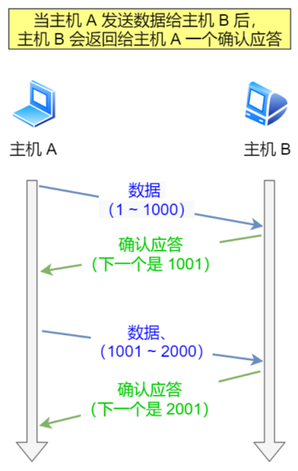

TCP 针对数据包丢失的情况，会⽤重传机制解决：

- 超时重传
- 快速重传
- SACK
- D-SACK  

## 超时重传  

重传机制的其中⼀个⽅式，就是在发送数据时，设定⼀个定时器，当超过指定的时间后，没有收到对⽅的 ACK 确认应答报⽂，就会重发该数据，也就是我们常说的超时重传。  

TCP 会在以下两种情况发⽣超时重传：

- 数据包丢失
- 确认应答丢失  


RTT （Round-Trip Time 往返时延），就是数据从⽹络⼀端传送到另⼀端所需的时间，也就是包的往返时间：


超时重传时间是以 RTO （Retransmission Timeout 超时重传时间）表示，假设在重传的情况下，超时时间 RTO 较⻓或较短时：

- 当超时时间 RTO 较⼤时，重发就慢，丢了⽼半天才重发，没有效率，性能差  
- 当超时时间 RTO 较⼩时，会导致可能并没有丢就重发，于是重发的就快，会增加⽹络拥塞，导致更多的超时，更多的超时导致更多的重发  

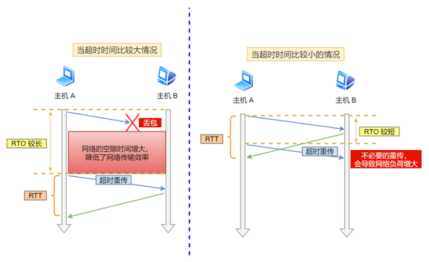

超时重传时间 RTO 的值应该略⼤于报⽂往返 RTT 的值：


在发送端发包时记下 t0 ，然后接收端再把这个 ack 回来时再记⼀个 t1 ，于是 RTT = t1 – t0 。没那么简单， 这只是⼀个采样，不能代表普遍情况。实际上报⽂往返 RTT 的值是经常变化的，因为我们的⽹络也是时常变化的。也就因为报⽂往返 RTT 的值是经常波动变化的，所以超时重传时间 RTO 的值应该是⼀个动态变化的值。  

Linux 计算 RTO，估计往返时间，通常需要采样以下两个  ：

- 需要 TCP 通过采样 RTT 的时间，然后进⾏加权平均，算出⼀个平滑 RTT 的值，⽽且这个值还是要不断变化的，因为⽹络状况不断地变化
- 除了采样 RTT，还要采样 RTT 的波动范围，这样就避免如果 RTT 有⼀个⼤的波动的话，很难被发现的情况  

RFC6289 建议使⽤以下的公式计算 RTO： 

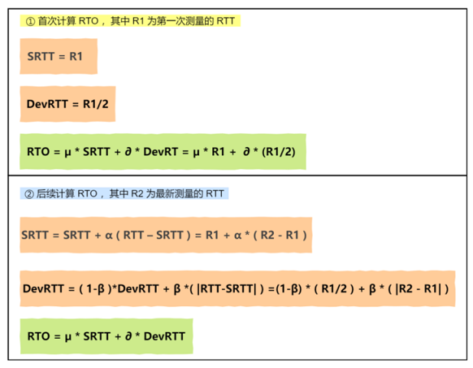

其中 SRTT 是计算平滑的 RTT ， DevRTR 是计算平滑的 RTT 与 最新 RTT 的差距。 在 Linux 下：

```
 α = 0.125， β = 0.25， μ = 1， ∂ = 4
```

如果超时重发的数据，再次超时的时候，⼜需要重传的时候， TCP 的策略是超时间隔加倍。也就是每当遇到⼀次超时重传的时候，都会将下⼀次超时时间间隔设为先前值的两倍。两次超时，就说明⽹络环境差，不宜频繁反复发送。  

超时触发重传存在的问题是，超时周期可能相对较⻓。 于是就可以⽤快速重传机制来解决超时重发的时间等待。 

## 快速重传  

TCP 还有另外⼀种快速重传（Fast Retransmit）机制，它不以时间为驱动，⽽是以数据驱动重传，快速重传的⼯作⽅式是当收到三个相同的 ACK 报⽂时，会在定时器过期之前，重传丢失的报⽂段。


- 第⼀份 Seq1 先送到了，于是就 Ack 回 2  
- 结果 Seq2 因为某些原因没收到， Seq3 到达了，于是还是 Ack 回 2  
- 后⾯的 Seq4 和 Seq5 都到了，但还是 Ack 回 2，因为 Seq2 还是没有收到  
- 发送端收到了三个 Ack = 2 的确认，知道了 Seq2 还没有收到，就会在定时器过期之前，重传丢失的 Seq2  
- 最后，收到了 Seq2，此时因为 Seq3， Seq4， Seq5 都收到了，于是 Ack 回 6  

快速重传机制只解决了⼀个问题，就是超时时间的问题，但是它依然⾯临着另外⼀个问题。就是重传的时候，是重传之前的⼀个，还是重传所有的问题。  

⽐如对于上⾯的例⼦，是重传 Seq2 呢？还是重传 Seq2、 Seq3、 Seq4、 Seq5 呢？因为发送端并不清楚这连续的三个 Ack 2 是谁传回来的。根据 TCP 不同的实现，以上两种情况都是有可能的。可⻅，这是⼀把双刃剑。 为了解决不知道该重传哪些 TCP 报⽂，于是就有 SACK ⽅法。     

## SACK ⽅法  

SACK（Selective Acknowledgment 选择性确认）。  

这种⽅式需要在 TCP 头部选项字段⾥加⼀个 SACK 的东⻄，它可以将缓存的地图发送给发送⽅，这样发送⽅就可以知道哪些数据收到了，哪些数据没收到，知道了这些信息，就可以只重传丢失的数据。  

如下图，发送⽅收到了三次同样的 ACK 确认报⽂，于是就会触发快速重发机制，通过 SACK 信息发现只有 200~299 这段数据丢失，则重发时，就只选择了这个 TCP 段进⾏重复。  

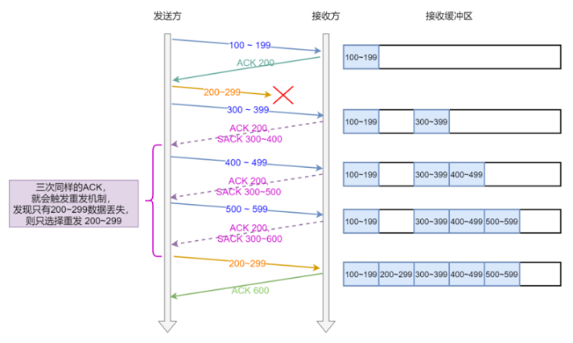

如果要⽀持 SACK ，必须双⽅都要⽀持。在 Linux 下，可以通过 net.ipv4.tcp_sack 参数打开这个功能（Linux 2.4 后默认打开）。

## D-SACK  

Duplicate SACK ⼜称 D-SACK ，其主要使⽤了 SACK 来告诉发送⽅有哪些数据被重复接收了。  

ACK 丢包：

- 接收⽅发给发送⽅的两个 ACK 确认应答都丢失了，所以发送⽅超时后，重传第⼀个数据包（3000 ~ 3499）  
- 于是接收⽅发现数据是重复收到的，于是回了⼀个 SACK = 3000~3500，告诉发送⽅ 3000~3500 的数据早已被接收了，因为 ACK 都到了 4000 了，已经意味着 4000 之前的所有数据都已收到，所以这个 SACK 就代表着 D-SACK  
- 这样发送⽅就知道了，数据没有丢，是接收⽅的 ACK 确认报⽂丢了  

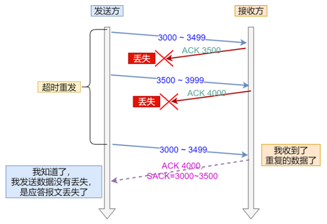

⽹络延时：

- 数据包（1000~1499）被⽹络延迟了，导致发送⽅没有收到 Ack 1500 的确认报⽂  
- 后⾯报⽂到达的三个相同的 ACK 确认报⽂，就触发了快速重传机制，但是在重传后，被延迟的数据包（1000~1499）⼜到了接收⽅  
- 所以接收⽅回了⼀个 SACK=1000~1500，因为 ACK 已经到了 3000，所以这个 SACK 是 D-SACK，表示收到了重复的包 
- 这样发送⽅就知道快速重传触发的原因不是发出去的包丢了，也不是因为回应的 ACK 包丢了，⽽是因为⽹络延迟了  


可⻅， D-SACK 有这么⼏个好处：

- 可以让发送⽅知道，是发出去的包丢了，还是接收⽅回应的 ACK 包丢了
- 可以知道是不是发送⽅的数据包被⽹络延迟了
- 可以知道⽹络中是不是把发送⽅的数据包给复制了

在 Linux 下可以通过 net.ipv4.tcp_dsack 参数开启/关闭这个功能（Linux 2.4 后默认打开）。  

# TCP 滑动窗⼝  

TCP 是每发送⼀个数据，都要进⾏⼀次确认应答。当上⼀个数据包收到了应答了， 再发送下⼀个。 但这种⽅式的缺点是效率⽐较低的。  数据包的往返时间越⻓，通信的效率就越低。

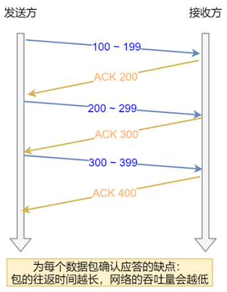

为解决这个问题， TCP 引⼊了窗⼝这个概念。即使在往返时间较⻓的情况下，它也不会降低⽹络通信的效率。那么有了窗⼝，就可以指定窗⼝⼤⼩，窗⼝⼤⼩就是指⽆需等待确认应答，⽽可以继续发送数据的最⼤值。  

窗⼝的实现实际上是操作系统开辟的⼀个缓存空间，发送⽅主机在等到确认应答返回之前，必须在缓冲区中保留已发送的数据。如果按期收到确认应答，此时数据就可以从缓存区清除。  

假设窗⼝⼤⼩为 3 个 TCP 段，那么发送⽅就可以连续发送 3 个 TCP 段，并且中途若有 ACK 丢失，可以通过下⼀个确认应答进⾏确认：


ACK 600 确认应答报⽂丢失，也没关系，因为可以通过下⼀个确认应答进⾏确认，只要发送⽅收到了 ACK 700 确认应答，就意味着 700 之前的所有数据接收⽅都收到了。这个模式就叫累计确认或者累计应答。

## 窗⼝⼤⼩  

TCP 头⾥有⼀个字段叫 Window ，也就是窗⼝⼤⼩。这个字段是接收端告诉发送端⾃⼰还有多少缓冲区可以接收数据。于是发送端就可以根据这个接收端的处理能⼒来发送数据，⽽不会导致接收端处理不过来。    

所以，通常窗⼝的⼤⼩是由接收⽅的窗⼝⼤⼩来决定的。  发送⽅发送的数据⼤⼩不能超过接收⽅的窗⼝⼤⼩，否则接收⽅就⽆法正常接收到数据。  

## 发送⽅的滑动窗⼝  

- \#1 是已发送并收到 ACK确认的数据： 1~31 字节
- \#2 是已发送但未收到 ACK确认的数据： 32~45 字节
- \#3 是未发送但总⼤⼩在接收⽅处理范围内（接收⽅还有空间）： 46~51字节
- \#4 是未发送但总⼤⼩超过接收⽅处理范围（接收⽅没有空间）： 52字节以后  


当发送⽅把数据全部都⼀下发送出去后，可⽤窗⼝的⼤⼩就为 0 ，表明可⽤窗⼝耗尽，在没收到 ACK 确认之前是⽆法继续发送数据了。  


当收到之前发送的数据 32~36 字节的 ACK 确认应答后，如果发送窗⼝的⼤⼩没有变化，则滑动窗⼝往右边移动 5 个字节，因为有 5 个字节的数据被应答确认，接下来 52~56 字节⼜变成了可⽤窗⼝，那么后续也就可以发送 52~56 这 5 个字节的数据了。 

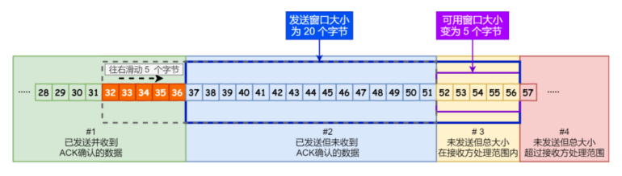

TCP 滑动窗⼝⽅案使⽤三个指针来跟踪在四个传输类别中的每⼀个类别中的字节。其中两个指针是绝对指针（指特定的序列号），⼀个是相对指针（需要做偏移）。  

- SND.WND ：表示发送窗⼝的⼤⼩（⼤⼩是由接收⽅指定的）
- SND.UNA ：是⼀个绝对指针，它指向的是已发送但未收到确认的第⼀个字节的序列号，也就是 #2 的第⼀个字节
- SND.NXT ：也是⼀个绝对指针，它指向未发送但可发送范围的第⼀个字节的序列号，也就是 #3 的第⼀个字节
- 指向 #4 的第⼀个字节是个相对指针，它需要 SND.UNA 指针加上 SND.WND ⼤⼩的偏移量，就可以指向 \#4 的第⼀个字节了  


可⽤窗⼝⼤⼩的计算就可以是： 可⽤窗⼝大小 = SND.WND -（SND.NXT - SND.UNA）。

## 接收⽅的滑动窗⼝  

接收窗⼝相对简单⼀些，根据处理的情况划分成三个部分：  

- \#1 + #2 是已成功接收并确认的数据（等待应⽤进程读取）
- #3 是未收到数据但可以接收的数据
- #4 未收到数据并不可以接收的数据

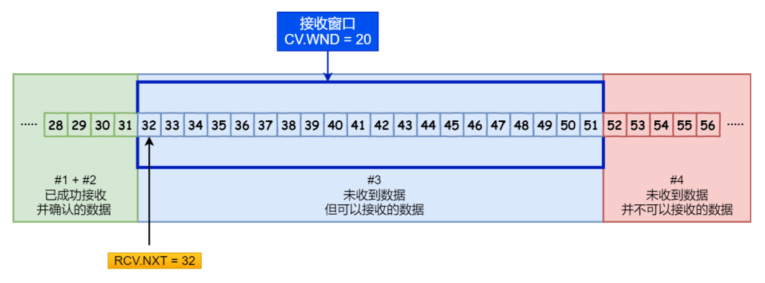

其中三个接收部分，使⽤两个指针进⾏划分:

- RCV.WND ：表示接收窗⼝的⼤⼩，它会通告给发送⽅
- RCV.NXT ：是⼀个指针，它指向期望从发送⽅发送来的下⼀个数据字节的序列号，也就是 #3 的第⼀个字节
- 指向 #4 的第⼀个字节是个相对指针，它需要 RCV.NXT 指针加上 RCV.WND ⼤⼩的偏移量，就可以指向 \#4 的第⼀个字节了  

接收窗⼝和发送窗⼝的⼤⼩是相等的吗？  

并不是完全相等，接收窗⼝的⼤⼩是约等于发送窗⼝的⼤⼩的。因为滑动窗⼝并不是⼀成不变的。⽐如，当接收⽅的应⽤进程读取数据的速度⾮常快的话，这样的话接收窗⼝可以很快的就空缺出来。那么新的接收窗⼝⼤⼩，是通过 TCP 报⽂中的 Windows 字段来告诉发送⽅。那么这个传输过程是存在时延的，所以接收窗⼝和发送窗⼝是约等于的关系。  

# TCP 流量控制  

发送⽅不能⽆脑的发数据给接收⽅，要考虑接收⽅处理能⼒。如果⼀直⽆脑的发数据给对⽅，但对⽅处理不过来，那么就会导致触发重发机制，从⽽导致⽹络流量的⽆端的浪费。为了解决这种现象发⽣， TCP 提供⼀种机制可以让发送⽅根据接收⽅的实际接收能⼒控制发送的数据量，这就是所谓的流量控制。  

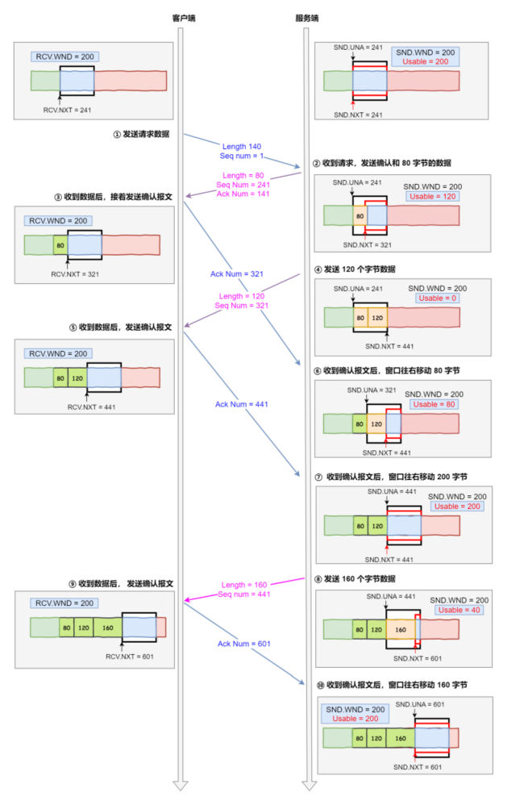

客户端是接收⽅，服务端是发送⽅，假设接收窗⼝和发送窗⼝相同，都为 200，假设两个设备在整个传输过程中都保持相同的窗⼝⼤⼩，不受外界影响。

- 客户端向服务端发送请求数据报⽂。这⾥要说明下，本次例⼦是把服务端作为发送⽅，所以没有画出服务端的接收窗⼝
- 服务端收到请求报⽂后，发送确认报⽂和 80 字节的数据，于是可⽤窗⼝ Usable 减少为 120 字节，同时SND.NXT 指针也向右偏移 80 字节后，指向 321， 这意味着下次发送数据的时候，序列号是 321
- 客户端收到 80 字节数据后，于是接收窗⼝往右移动 80 字节， RCV.NXT 也就指向 321， 这意味着客户端期望的下⼀个报⽂的序列号是 321，接着发送确认报⽂给服务端
- 服务端再次发送了 120 字节数据，于是可⽤窗⼝耗尽为 0，服务端⽆法再继续发送数据
- 客户端收到 120 字节的数据后，于是接收窗⼝往右移动 120 字节， RCV.NXT 也就指向 441，接着发送确认报⽂给服务端
- 服务端收到对 80 字节数据的确认报⽂后， SND.UNA 指针往右偏移后指向 321，于是可⽤窗⼝ Usable 增⼤到 80
- 服务端收到对 120 字节数据的确认报⽂后， SND.UNA 指针往右偏移后指向 441，于是可⽤窗⼝ Usable 增⼤到 200 
- 服务端可以继续发送了，于是发送了 160 字节的数据后， SND.NXT 指向 601，于是可⽤窗⼝ Usable 减少到 40
- 客户端收到 160 字节后，接收窗⼝往右移动了 160 字节， RCV.NXT 也就是指向了 601，接着发送确认报⽂给服务端
- 服务端收到对 160 字节数据的确认报⽂后，发送窗⼝往右移动了 160 字节，于是 SND.UNA 指针偏移了160 后指向 601，可⽤窗⼝ Usable 也就增⼤⾄了 200

## 操作系统缓冲区与滑动窗⼝的关系 

前⾯的流量控制例⼦，我们假定了发送窗⼝和接收窗⼝是不变的，但是实际上，发送窗⼝和接收窗⼝中所存放的字节数，都是放在操作系统内存缓冲区中的，⽽操作系统的缓冲区，会被操作系统调整。当应⽤进程没办法及时读取缓冲区的内容时，也会对我们的缓冲区造成影响。当应⽤程序没有及时读取缓存时，发送窗⼝和接收窗⼝的变化：

- 客户端作为发送⽅，服务端作为接收⽅，发送窗⼝和接收窗⼝初始⼤⼩为 360
- 服务端⾮常的繁忙，当收到客户端的数据时，应⽤层不能及时读取数据  


- 客户端发送 140 字节数据后，可⽤窗⼝变为 220 （360 - 140）
- 服务端收到 140 字节数据， 但是服务端⾮常繁忙，应⽤进程只读取了 40 个字节，还有 100 字节占⽤着缓冲区，于是接收窗⼝收缩到了 260 （360 - 100） ，最后发送确认信息时，将窗⼝⼤⼩通告给客户端
- 客户端收到确认和窗⼝通告报⽂后，发送窗⼝减少为 260
- 客户端发送 180 字节数据，此时可⽤窗⼝减少到 80
- 服务端收到 180 字节数据， 但是应⽤程序没有读取任何数据，这 180 字节直接就留在了缓冲区，于是接收窗⼝收缩到了 80 （260 - 180） ，并在发送确认信息时，通过窗⼝⼤⼩给客户端
- 客户端收到确认和窗⼝通告报⽂后，发送窗⼝减少为 80
- 客户端发送 80 字节数据后，可⽤窗⼝耗尽
- 服务端收到 80 字节数据， 但是应⽤程序依然没有读取任何数据，这 80 字节留在了缓冲区，于是接收窗⼝收缩到了 0，并在发送确认信息时，通过窗⼝⼤⼩给客户端
- 客户端收到确认和窗⼝通告报⽂后，发送窗⼝减少为 0

可⻅最后窗⼝都收缩为 0 了，也就是发⽣了窗⼝关闭。当发送⽅可⽤窗⼝变为 0 时，发送⽅实际上会定时发送窗⼝探测报⽂，以便知道接收⽅的窗⼝是否发⽣了改变。

当服务端系统资源⾮常紧张的时候，操⼼系统可能会直接减少了接收缓冲区⼤⼩，这时应⽤程序⼜⽆法及时读取缓存数据，那么这时候就有严重的事情发⽣了，会出现数据包丢失的现象。  

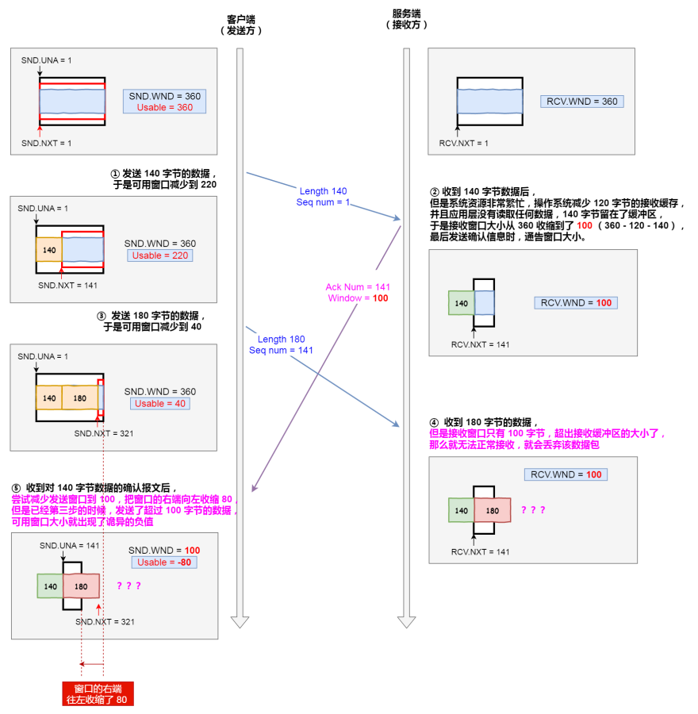

- 客户端发送 140 字节的数据，于是可⽤窗⼝减少到了 220  
- 服务端因为现在⾮常的繁忙，操作系统于是就把接收缓存减少了 120 字节，当收到 140 字节数据后，⼜因为应⽤程序没有读取任何数据，所以 140 字节留在了缓冲区中，于是接收窗⼝⼤⼩从 360 收缩成了 100，最后发送确认信息时，通告窗⼝⼤⼩给对⽅
- 此时客户端因为还没有收到服务端的通告窗⼝报⽂，所以不知道此时接收窗⼝收缩成了 100，客户端只会看⾃⼰的可⽤窗⼝还有 220，所以客户端就发送了 180 字节数据，于是可⽤窗⼝减少到 40  
- 服务端收到了 180 字节数据时， 发现数据⼤⼩超过了接收窗⼝的⼤⼩，于是就把数据包丢失了  
- 客户端收到第 2 步时，服务端发送的确认报⽂和通告窗⼝报⽂，尝试减少发送窗⼝到 100，把窗⼝的右端向左收缩了 80，此时可⽤窗⼝的⼤⼩就会出现诡异的负值  

所以，如果发⽣了先减少缓存，再收缩窗⼝，就会出现丢包的现象。为了防⽌这种情况发⽣， TCP 规定是不允许同时减少缓存⼜收缩窗⼝的，⽽是采⽤先收缩窗⼝，过段时间再减少缓存，这样就可以避免了丢包情况。  

## 窗⼝关闭  

如果窗⼝⼤⼩为 0 时，就会阻⽌发送⽅给接收⽅传递数据，直到窗⼝变为⾮ 0 为⽌，这就是窗⼝关闭。 

接收⽅向发送⽅通告窗⼝⼤⼩时，是通过 ACK 报⽂来通告的。那么，当发⽣窗⼝关闭时，接收⽅处理完数据后，会向发送⽅通告⼀个窗⼝⾮ 0 的 ACK 报⽂，如果这个通告窗⼝的 ACK 报⽂在⽹络中丢失了，那麻烦就⼤了。  


这会导致发送⽅⼀直等待接收⽅的⾮ 0 窗⼝通知，接收⽅也⼀直等待发送⽅的数据，如不采取措施，这种相互等待的过程，会造成了死锁的现象。  

为了解决这个问题， TCP 为每个连接设有⼀个持续定时器， 只要 TCP 连接⼀⽅收到对⽅的零窗⼝通知，就启动持续计时器。如果持续计时器超时，就会发送窗⼝探测 (Window probe) 报⽂，⽽对⽅在确认这个探测报⽂时，给出⾃⼰现在的接收窗⼝⼤⼩。  


- 如果接收窗⼝仍然为 0，那么收到这个报⽂的⼀⽅就会重新启动持续计时器
- 如果接收窗⼝不是 0，那么死锁的局⾯就可以被打破了 
- 窗⼝探测的次数⼀般为 3 次，每次⼤约 30-60 秒（不同的实现可能会不⼀样）。如果 3 次过后接收窗⼝还是 0 的话，有的 TCP 实现会发 RST 报⽂来中断连接

##　糊涂窗⼝综合症  

如果接收⽅太忙了，来不及取⾛接收窗⼝⾥的数据，那么就会导致发送⽅的发送窗⼝越来越⼩。到最后， 如果接收⽅腾出⼏个字节并告诉发送⽅现在有⼏个字节的窗⼝，⽽发送⽅会义⽆反顾地发送这⼏个字节，这就是糊涂窗⼝综合症。TCP + IP 头有 40 个字节，为了传输那⼏个字节的数据，要达上这么⼤的开销，这太不经济了。  

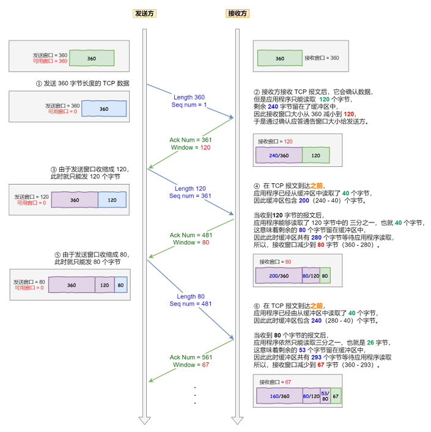

可以发现窗⼝不断减少了，并且发送的数据都是⽐较⼩的了。  所以，糊涂窗⼝综合症的现象是可以发⽣在发送⽅和接收⽅：

- 接收⽅可以通告⼀个⼩的窗⼝
- ⽽发送⽅可以发送⼩数据  

于是，要解决糊涂窗⼝综合症，就解决上⾯两个问题就可以：

- 让接收⽅不通告⼩窗⼝给发送⽅  
- 让发送⽅避免发送⼩数据  

接收⽅不通告⼩窗⼝，接收⽅通常的策略如下：

当窗⼝⼤⼩⼩于 min( MSS，缓存空间/2 ) ，也就是⼩于 MSS 与 1/2 缓存⼤⼩中的最⼩值时，就会向发送⽅通告窗⼝为 0 ，也就阻⽌了发送⽅再发数据过来。等到接收⽅处理了⼀些数据后，窗⼝⼤⼩ >= MSS，或者接收⽅缓存空间有⼀半可以使⽤，就可以把窗⼝打开让发送⽅发送数据过来。  

发送⽅避免发送⼩数据 ，使⽤ Nagle 算法，该算法的思路是延时处理，它满⾜以下两个条件中的⼀条才可以发送数据：  

- 要等到窗⼝⼤⼩ >= MSS 或是数据⼤⼩ >= MSS  
- 收到之前发送数据的 ack 回包  

只要没满⾜上⾯条件中的⼀条，发送⽅⼀直在囤积数据，直到满⾜上⾯的发送条件。  

Nagle 算法默认是打开的，如果对于⼀些需要⼩数据包交互的场景的程序，⽐如， telnet 或 ssh 这样的交互性⽐较强的程序，则需要关闭 Nagle 算法。可以在 Socket 设置 TCP_NODELAY 选项来关闭这个算法（关闭 Nagle 算法没有全局参数，需要根据每个应⽤⾃⼰的特点来关闭） ：

```
setsockopt(sock_fd, IPPROTO_TCP, TCP_NODELAY, (char *)&value, sizeof(int));
```

# 拥塞控制  