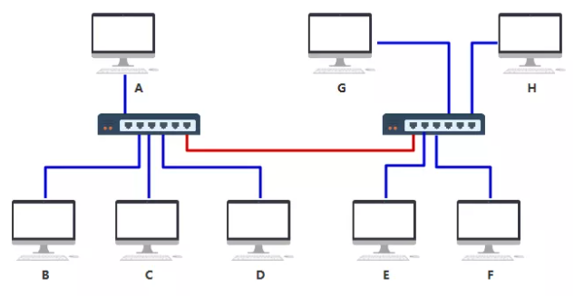

# OSI 模型和 TCP/IP 模型

## OSI 模型

OSI ⽹络模型(Open System Interconnection Reference Model)，该模型主要有 7 层，分别是应⽤层、表示层、会话层、传输层、⽹络层、数据链路层以及物理层。  

- 应⽤层，是 app 访问网络、向用户显示接收到信息的窗口
- 表示层，提取应用层的数据，并根据需要转换格式，以便通过网络传输
  - 转换。例如，将 ASCII 转换为 EBCDIC
  - 加密、解密。加密时将数据转换为另一种样式，加密后的数据被称为密文，解密后的数据被称为明文。加密、解密时需要使用对应的 key
  - 压缩：压缩可以减少需传送的数据量
- 会话层，负责建立连接，维护会话、认证，并确保安全
  - 建立、维护、终止会话
  - 同步：会话层允许进程向数据中添加同步点，用于定位错误，避免数据丢失
  - 对话控制：会话层允许两个系统以半双工或全双工方式互相通信
- 传输层，提供端到端的消息传递服务
  - 发送方：从上层接收格式化数据，对数据进行分片，流量、错误控制，确保正确的数据传输。还会将源、目标主机端口号添加到 header，并将段数据转发给网络层
  - 接收方：从 header 读取端口号，并将数据转发给对应 app，还会对分段数据进行排序和重组

- ⽹络层，网络层用于将数据从一台主机传输到位于不同网络中的另一台主机
  - 路由：网络层协议决定从源到目的地选取哪条线路
  - 逻辑寻址：为唯一标识互联网上的每个设备，网络层定义了一种寻址方案。发送者和接收者的 IP 地址由网络层放置到 header 中
  - 设备：路由器
- 负责数据的路由、转发、分⽚，路由器
- 数据链路层，负责节点到节点的消息传递，该层的主要功能是确保在物理层上从一个节点到另一个节点正确传输数据。当数据包到达时使用 MAC 地址传输给目标主机
  - 封装成帧：它为发送方提供了一种对接收方有意义的一组比特，其通过将特殊的位模式附加到帧的开头和结尾来实现
  - 物理寻址：创建帧后，为每一帧的 header 添加发送方、接收方的 MAC 地址
  - 错误控制：检测、重发丢失或损坏的帧
  - 流控制：双方的速率必须保持恒定，否则数据可能会被损坏。流控制协调在收到确认之前可发送的数据量
  - 访问控制：多个设备共享一个通信通道时，用于确定给定时间哪个设备可以控制该通道
  - 设备：网桥，交换机

- 物理层，负责在设备和物理传输介质之间传输、接收非结构化数据，它将数字 bits 转换为电、无线电或光信号
  - 比特同步：物理层通过提供原子钟，实现发送、接收比特同步
  - 比特率控制：物理层定义了传输控制，决定每秒发送数据量
  - 物理拓扑：物理层指定在网络中排列不同设备、节点的方式，如总线、星形或网状拓扑
  - 传输模式：单工，半双工，全双工
  - 设备：网卡，网线，集线器，中继器，调制解调器

## TCP/IP 模型

由于 OSI 模型实在太复杂，提出的也只是概念理论上的分层，并没有提供具体的实现⽅案。事实上，⽐较常⻅也⽐较实⽤的是四层模型，即 TCP/IP ⽹络模型， Linux 系统正是按照这套⽹络模型来实现⽹络协议栈的。  

TCP/IP ⽹络模型共有 4 层，分别是应⽤层、传输层、⽹络层和⽹络接⼝层，每⼀层负责的职能如下：

- 应⽤层，负责向⽤户提供⼀组应⽤程序，⽐如 HTTP、 DNS、 FTP 等
- 传输层，负责端到端的通信，⽐如 TCP、 UDP 等
- ⽹络层，负责⽹络包的封装、分⽚、路由、转发，⽐如 IP、 ICMP 等
- ⽹络接⼝层，负责⽹络包在物理⽹络中的传输，⽐如⽹络包的封帧、 MAC 寻址、差错检测，以及通过⽹卡传输⽹络帧等

不过，我们常说的七层和四层负载均衡，是⽤ OSI ⽹络模型来描述的，七层对应的是应⽤层，四层对应的是传输层。  

## 五层模型

# 常见网络设备及其作用

## 集线器

集线器工作在物理层。

交换机仅仅是无脑将电信号转发到所有出口（广播）,其他主机收到信息后，根据头部的目标 MAC 地址信息，判断这个数据包的确是发给自己的，于是便收下，如果不是发给自己的就丢弃。因此，在数据包头部需要有下面的结构：

集线器将信息发送给连接到集线器中的所有电脑，这样既不安全，又不节省网络资源。

## 交换机

交换机工作在数据链路层。

交换机内部维护一张 MAC 地址表，记录着每一个 MAC 地址的设备，连接在其哪一个端口上。数据包到达交换机时，交换机内部通过自己维护的 MAC 地址表，将数据包转发到指定的端口上。通过这样传输方式而组成的小范围的网络，叫做以太网。最开始的时候，MAC 地址表是空的，在收发数据包的过程中逐步建立。

随着机器数量增多，端口不够用，此时可以将多个交换机连接起来：

上面那根红色的线，最终在 MAC 地址表中要把 ABCDEFGH 这8台机器与相应端口的映射全部记录在表中。

## 路由器

路由器工作在网络层。

路由器的每一个端口，都有独立的 MAC 地址。

为了划分网络，引入了IP 地址。现在每一台电脑，同时有自己的 MAC 地址，又有自己的 IP 地址，只不过 IP 地址是软件层面上的，可以随时修改，MAC 地址一般是无法修改的。现在两个设备之间传输，除了加上数据链路层的头部之外，还要再增加一个网络层的头部：

如果源 IP 与目的 IP 处于一个子网，直接将数据包通过交换机发出去。如果源 IP 与目的 IP 不处于一个子网，就交给路由器去处理。

判断是否在一个子网：将源 IP 与目的 IP 分别同这个子网掩码进行与运算，相等则是在一个子网，不相等就是在不同子网。

默认网关：就是在设备里配置的一个 IP 地址，以便在发给不同子网的机器时，发给这个 IP 地址。

路由器收到的数据包有目的 IP ，需要转化成从自己的哪个端口出去，此时需要依赖路由表。

如果不清楚 MAC 地址，就需要使用 ARP 协议，把 IP 地址对应的 MAC 地址找到，同时 设备中也会有 arp 缓存表，记录着 IP 与 MAC 地址的对应关系。

## 路由器和二层交换机的区别

- 工作层次不同：最初的的交换机是工作在数据链路层，而路由器一开始就设计工作在网络层
- 数据转发所依据的对象不同：交换机是利用物理地址或者说 MAC 地址来确定转发数据的目的地址。而路由器则是利用 IP 地址来确定数据转发的地址
- 传统的交换机只能分割冲突域，不能分割广播域；而路由器可以分割广播域：由交换机连接的网段仍属于同一个广播域，广播数据包会在交换机连接的所有网段上传播，在某些情况下会导致通信拥挤和安全漏洞。连接到路由器上的网段会被分配成不同的广播域，广播数据不会穿过路由器
- 路由器提供了防火墙的服务：路由器仅仅转发特定地址的数据包，不传送不支持路由协议的数据包传送和未知目标网络数据包的传送，从而可以防止广播风暴

## 小结

电脑视角：

- 首先我要知道我的 IP 以及对方的 IP
- 通过子网掩码判断我们是否在同一个子网
- 在同一个子网就通过 arp 获取对方 mac 地址直接扔出去
- 不在同一个子网就通过 arp 获取默认网关的 mac 地址直接扔出去

交换机视角：

- 我收到的数据包必须有目标 MAC 地址
- 通过 MAC 地址表查映射关系
- 查到了就按照映射关系从我的指定端口发出去
- 查不到就所有端口都发出去

路由器视角：

- 我收到的数据包必须有目标 IP 地址
- 通过路由表查映射关系
- 查到了就按照映射关系从我的指定端口发出去（不在任何一个子网范围，走其路由器的默认网关也是查到了）
- 查不到则返回一个路由不可达的数据包

三张表：

- 交换机中有 MAC 地址表用于映射 MAC 地址和它的端口，通过以太网内各节点之间不断通过交换机通信，不断完善起来的
- 路由器中有路由表用于映射 IP 地址(段)和它的端口，各种路由算法和人工配置逐步完善起来的
- 电脑和路由器中都有arp 缓存表用于缓存 IP 和 MAC 地址的映射关系，不断通过 arp 协议的请求逐步完善起来的

完整过程：

- 首先 A（192.168.0.1）通过子网掩码（255.255.255.0）计算出自己与 F（192.168.2.2）并不在同一个子网内，于是决定发送给默认网关（192.168.0.254）
- A 通过 ARP 找到默认网关 192.168.0.254 的 MAC 地址
- A 将源 MAC 地址（AAAA）与网关 MAC 地址（ABAB）封装在数据链路层头部，又将源 IP 地址（192.168.0.1）和目的 IP 地址（192.168.2.2）（注意这里千万不要以为填写的是默认网关的 IP 地址，从始至终这个数据包的两个 IP 地址都是不变的，只有 MAC 地址在不断变化）封装在网络层头部，然后发包
- 交换机 1 收到数据包后，发现目标 MAC 地址是 ABAB，转发给路由器1
- 数据包来到了路由器 1，发现其目标 IP 地址是 192.168.2.2，查看其路由表，发现了下一跳的地址是 192.168.100.5
- 此时路由器 1 需要做两件事，第一件是再次匹配路由表，发现匹配到了端口为 2，于是将其封装到数据链路层，最后把包从 2 号口发出去
- 此时路由器 2 收到了数据包，看到其目的地址是 192.168.2.2，查询其路由表，匹配到端口号为 1，准备从 1 号口把数据包送出去
- 此时路由器 2 需要知道 192.168.2.2 的 MAC 地址了，于是查看其 arp 缓存，找到其 MAC 地址为 FFFF，封装在数据链路层头部，并从 1 号端口把包发出去
- 交换机 3 收到了数据包，发现目的 MAC 地址为 FFFF，查询其 MAC 地址表，发现应该从其 6 号端口出去，于是从 6 号端口把数据包发出去
- F 最终收到了数据包！并且发现目的 MAC 地址就是自己，于是收下了这个包

# 键⼊⽹址到⽹⻚显示过程

- URL地址解析
- DNS域名解析
- 客户端与服务端建立TCP连接（三次握手)
- 把客户端信息传递给服务器端（发送HTTP请求）
- 服务器得到并处理请求（HTTP响应内容）
- 客户端渲染服务器返回的内容
- 和服务端断开TCP连接（四次挥手）

