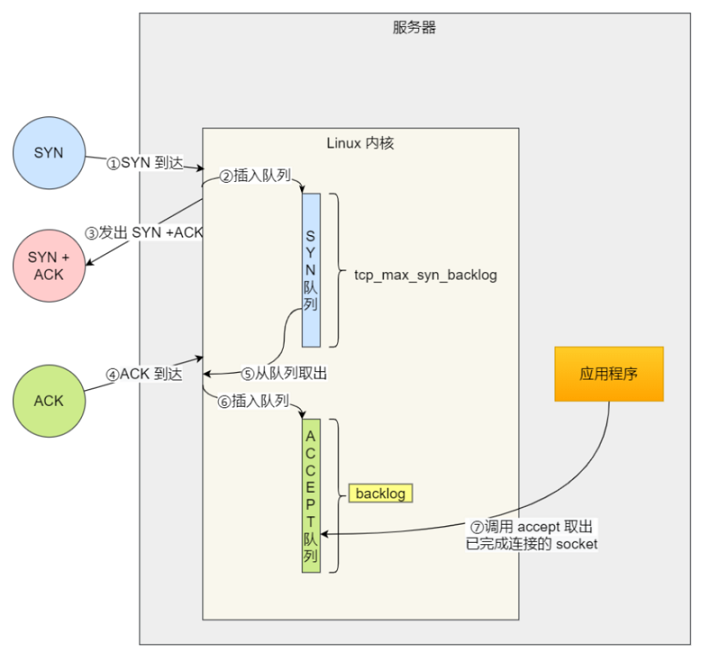

# Socket 编程

## TCP  编程   

- 服务端和客户端初始化 socket ，得到⽂件描述符
- 服务端调⽤ bind ，将绑定在 IP 地址和端⼝
- 服务端调⽤ listen ，进⾏监听
- 服务端调⽤ accept ，等待客户端连接
- 客户端调⽤ connect ，向服务器端的地址和端⼝发起连接请求
- 服务端 accept 返回⽤于传输的 socket 的⽂件描述符
- 客户端调⽤ write 写⼊数据；服务端调⽤ read 读取数据
- 客户端断开连接时，会调⽤ close ，那么服务端 read 读取数据的时候，就会读取到了 EOF ，待处理完数据后，服务端调⽤ close ，表示连接关闭    


需要注意的是：

- 服务端调⽤ accept 时，连接成功了会返回⼀个已完成连接的 socket，后续⽤来传输数据
- 监听的 socket 和真正⽤来传送数据的 socket，是两个 socket，⼀个叫作监听 socket，⼀个叫作已完成连接 socket
- 成功连接建⽴之后，双⽅开始通过 read 和 write 函数来读写数据，就像往⼀个⽂件流⾥⾯写东⻄⼀样

## listen 

Linux 内核中会维护两个队列：  

- 未完成连接队列（SYN 队列）：接收到⼀个 SYN 建⽴连接请求，处于 SYN_RCVD 状态  
- 已完成连接队列（Accpet 队列）：已完成 TCP 三次握⼿过程，处于 ESTABLISHED 状态  



```
int listen (int socketfd, int backlog);
```

- 参数⼀ socketfd 为 socketfd ⽂件描述符
- 参数⼆ backlog，这参数在历史版本有⼀定的变化  

在早期 Linux 内核 backlog 是 SYN 队列⼤⼩，也就是未完成的队列⼤⼩。在 Linux 内核 2.2 之后， backlog 变成 accept 队列，也就是已完成连接建⽴的队列⻓度， 所以现在通常认为 backlog 是 accept 队列。但是上限值是内核参数 somaxconn 的⼤⼩，也就说 accpet 队列⻓度 = min(backlog, somaxconn)。    

## accept  


- 客户端的协议栈向服务器端发送了 SYN 包，并告诉服务器端当前发送序列号 client_isn，客户端进⼊SYN_SENT 状态
- 服务器端的协议栈收到这个包之后，和客户端进⾏ ACK 应答，应答的值为 client_isn+1，表示对 SYN 包 client_isn 的确认，同时服务器也发送⼀个 SYN 包，告诉客户端当前我的发送序列号为 server_isn，服务器端进⼊ SYN_RCVD 状态
- 客户端协议栈收到 ACK 之后，使得应⽤程序从 connect 调⽤返回，表示客户端到服务器端的单向连接建⽴成功，客户端的状态为 ESTABLISHED，同时客户端协议栈也会对服务器端的 SYN 包进⾏应答，应答数据为 server_isn+1
- 应答包到达服务器端后，服务器端协议栈使得 accept 阻塞调⽤返回，这个时候服务器端到客户端的单向连接也建⽴成功，服务器端也进⼊ ESTABLISHED 状态    

可以得知客户端 connect 成功返回是在第⼆次握⼿，服务端 accept 成功返回是在三次握⼿成功之后。  

## close  

客户端主动调⽤了 close ：


- 客户端调⽤ close ，表明客户端没有数据需要发送了，则此时会向服务端发送 FIN 报⽂，进⼊ FIN_WAIT_1 状态  
- 服务端接收到了 FIN 报⽂， TCP 协议栈会为 FIN 包插⼊⼀个⽂件结束符 EOF 到接收缓冲区中，应⽤程序可以通过 read 调⽤来感知这个 FIN 包。这个 EOF 会被放在已排队等候的其他已接收的数据之后，这就意味着服务端需要处理这种异常情况，因为 EOF 表示在该连接上再⽆额外数据到达。此时，服务端进⼊ CLOSE_WAIT 状态 
- 接着，当处理完数据后，⾃然就会读到 EOF ，于是也调⽤ close 关闭它的套接字，这会使得客户端会发出⼀个 FIN 包，之后处于 LAST_ACK 状态  
- 客户端接收到服务端的 FIN 包，并发送 ACK 确认包给服务端，此时客户端将进⼊ TIME_WAIT 状态
- 服务端收到 ACK 确认包后，就进⼊了最后的 CLOSE 状态  
- 客户端经过 2MSL 时间之后，也进⼊ CLOSE 状态  

#  IO 多路复用

## 阻塞 IO

服务端为了处理客户端的连接和请求的数据，写了如下代码：

```
listenfd = socket();   // 打开一个网络通信端口
bind(listenfd);        // 绑定
listen(listenfd);      // 监听
while(1) {
  connfd = accept(listenfd);  // 阻塞建立连接
  int n = read(connfd, buf);  // 阻塞读数据
  doSomeThing(buf);  // 利用读到的数据做些什么
  close(connfd);     // 关闭连接，循环等待下一个连接
}
```


可以看到，服务端的线程阻塞在了两个地方，一个是 accept 函数，一个是 read 函数。如果再把 read 函数的细节展开，我们会发现其阻塞在了两个阶段：


这就是传统的阻塞 IO。整体流程如下：


所以，如果这个连接的客户端一直不发数据，那么服务端线程将会一直阻塞在 read 函数上不返回，也无法接受其他客户端连接。这肯定是不行的。

## **非阻塞 IO**

为了解决上面的问题，其关键在于改造这个 read 函数。有一种聪明的办法是，每次都创建一个新的进程或线程，去调用 read 函数，并做业务处理：

```
while(1) {
  connfd = accept(listenfd);  // 阻塞建立连接
  pthread_create（doWork);  // 创建一个新的线程
}

void doWork() {
  int n = read(connfd, buf);  // 阻塞读数据
  doSomeThing(buf);  // 利用读到的数据做些什么
  close(connfd);     // 关闭连接，循环等待下一个连接
}
```

这样，当给一个客户端建立好连接后，就可以立刻等待新的客户端连接，而不用阻塞在原客户端的 read 请求上：


不过，这不叫非阻塞 IO，只不过用了多线程的手段使得主线程没有卡在 read 函数上不往下走罢了。操作系统为我们提供的 read 函数仍然是阻塞的。

真正的非阻塞 IO，不能是通过我们用户层的小把戏，而是要恳请操作系统为我们提供一个非阻塞的 read 函数。这个 read 函数的效果是，如果没有数据到达时（到达网卡并拷贝到了内核缓冲区），立刻返回一个错误值（-1），而不是阻塞地等待。操作系统提供了这样的功能，只需要在调用 read 前，将文件描述符设置为非阻塞即可：

```
```


