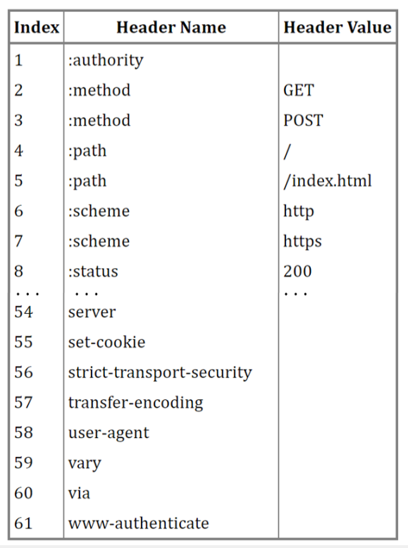
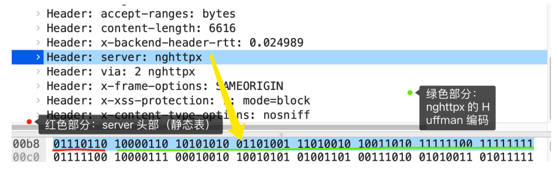
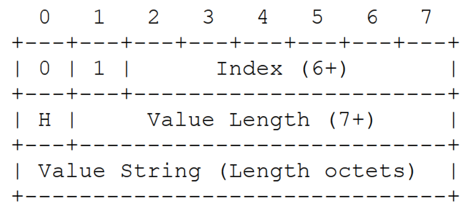
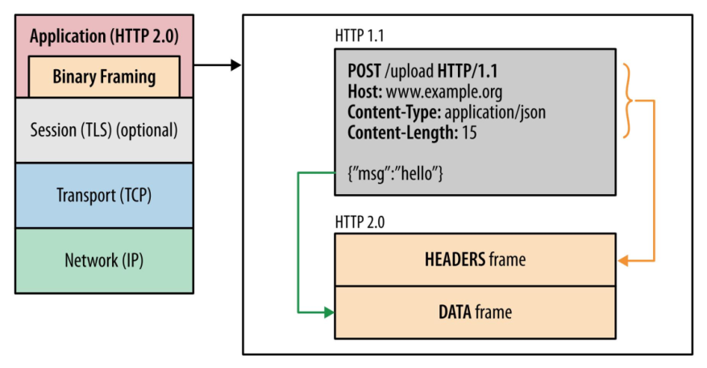
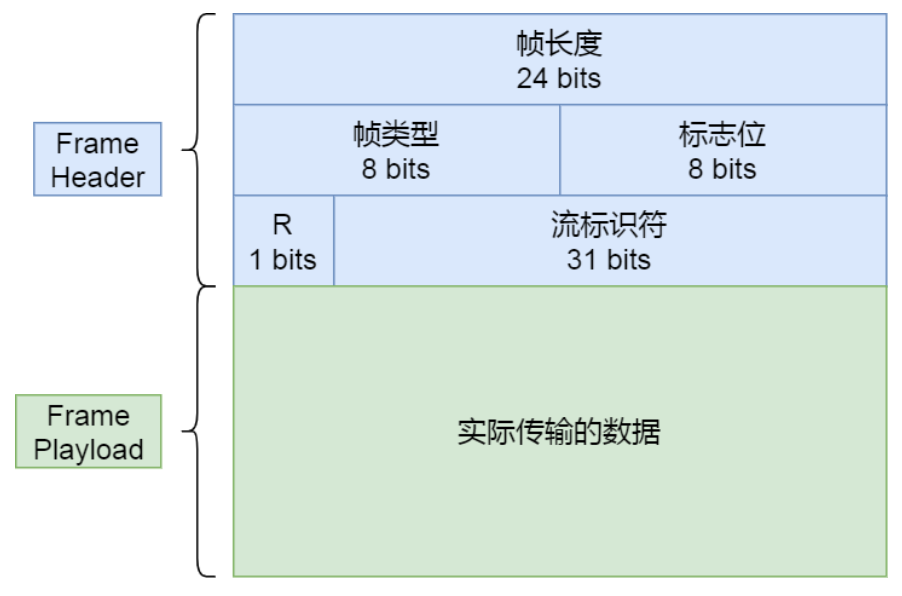
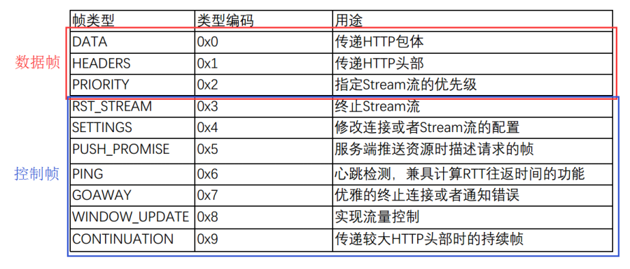
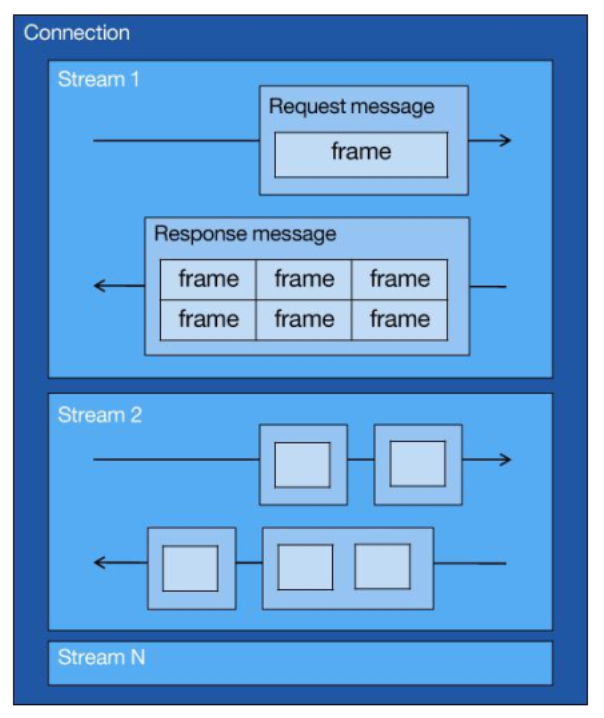
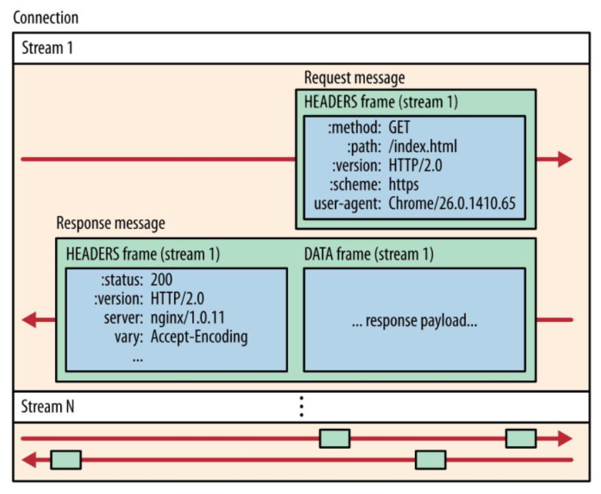
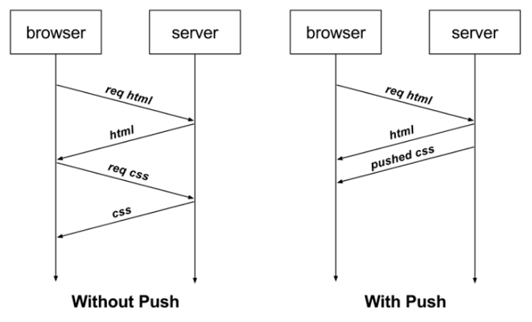
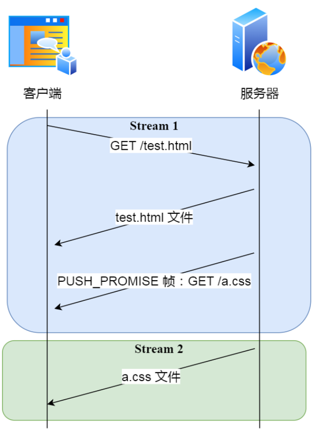

# HTTP/1.1 协议的性能问题  

现在的站点相⽐以前变化太多了，⽐如：  

- 消息的⼤⼩变⼤了，从⼏ KB ⼤⼩的消息，到⼏ MB ⼤⼩的消息  
- ⻚⾯资源变多了，从每个⻚⾯不到 10 个的资源，到每⻚超 100 多个资源  
- 内容形式变多样了，从单纯到⽂本内容，到图⽚、视频、⾳频等内容  
- 实时性要求变⾼了，对⻚⾯的实时性要求的应⽤越来越多  

这些变化带来的最⼤性能问题就是 HTTP/1.1 的⾼延迟，延迟⾼必然影响的就是⽤户体验。主要原因如下⼏个：  

- 延迟难以下降  
- 并发连接有限  
- 队头阻塞问题  
- HTTP 头部巨⼤且重复  
- 不⽀持服务器推送消息  

为了解决 HTTP/1.1 性能问题，⼏个常⻅的优化⼿段：    

- 将多张⼩图合并成⼀张⼤图供浏览器 JavaScript 来切割使⽤，这样可以将多个请求合并成⼀个请求，但是带来了新的问题，当某张⼩图⽚更新了，那么需要重新请求⼤图⽚，浪费了⼤量的⽹络带宽  
- 将图⽚的⼆进制数据通过 base64 编码后，把编码数据嵌⼊到 HTML 或 CSS ⽂件中，以此来减少⽹络请求次数  
- 将多个体积较⼩的 JavaScript ⽂件使⽤ webpack 等⼯具打包成⼀个体积更⼤的 JavaScript ⽂件，以⼀个请求替代了很多个请求，但是带来的问题，当某个 js ⽂件变化了，需要重新请求同⼀个包⾥的所有 js ⽂件
- 将同⼀个⻚⾯的资源分散到不同域名，提升并发连接上限，因为浏览器通常对同⼀域名的 HTTP 连接最⼤只能是 6 个    

尽管对 HTTP/1.1 协议的优化⼿段如此之多，但是效果还是不尽⼈意，因为这些⼿段都是对 HTTP/1.1 协议的“外部”做优化， ⽽⼀些关键的地⽅是没办法优化的，⽐如请求-响应模型、头部巨⼤且重复、并发连接耗时、服务器不能主动推送等，要改变这些必须重新设计 HTTP 协议，于是 HTTP/2 就出来了！  

# 兼容 HTTP/1.1  

HTTP/2 出来的⽬的是为了改善 HTTP 的性能。协议升级有⼀个很重要的地⽅，就是要兼容⽼版本的协议，否则新协议推⼴起来就相当困难，所幸 HTTP/2 做到了兼容 HTTP/1.1 。  

- 第⼀点， HTTP/2 没有在 URI ⾥引⼊新的协议名，仍然⽤ http:// 表示明⽂协议，⽤ https:// 表示加密协议，于是只需要浏览器和服务器在背后⾃动升级协议，这样可以让⽤户意识不到协议的升级，很好的实现了协议的平滑升级
- 第⼆点，只在应⽤层做了改变，还是基于 TCP 协议传输，应⽤层⽅⾯为了保持功能上的兼容， HTTP/2 把 HTTP 分解成了语义和语法两个部分，语义层不做改动，与 HTTP/1.1 完全⼀致，⽐如请求⽅法、状态码、头字段等规则保留不变

但是， HTTP/2 在语法层⾯做了很多改造，基本改变了 HTTP 报⽂的传输格式。  

# 头部压缩  

HTTP 协议的报⽂是由 Header + Body 构成的，对于 Body 部分， HTTP/1.1 协议可以使⽤头字段  ContentEncoding 指定 Body 的压缩⽅式，⽐如⽤ gzip 压缩，这样可以节约带宽，但报⽂中的另外⼀部分 Header，是没有针对它的优化⼿段。  

HTTP/1.1 报⽂中 Header 部分存在的问题：  

- 含很多固定的字段，⽐如Cookie、 User Agent、 Accept 等，这些字段加起来也⾼达⼏百字节甚⾄上千字节，所以有必要压缩 
- ⼤量的请求和响应的报⽂⾥有很多字段值都是重复的，这样会使得⼤量带宽被这些冗余的数据占⽤了，所以有必须要避免重复性   
- 字段是 ASCII 编码的，虽然易于⼈类观察，但效率低，所以有必要改成⼆进制编码  

HTTP/2 对 Header 部分做了⼤改造，把以上的问题都解决了。  

HTTP/2 没使⽤常⻅的 gzip 压缩⽅式来压缩头部，⽽是开发了 HPACK 算法， HPACK 算法主要包含三个组成部分：  

- 静态字典
- 动态字典
- Huffman 编码（压缩算法）

客户端和服务器两端都会建⽴和维护字典，⽤⻓度较⼩的索引号表示重复的字符串，再⽤ Huffman 编码压缩数据， 可达到 50%~90% 的⾼压缩率。  

## 静态表编码  

HTTP/2 为⾼频出现在头部的字符串和字段建⽴了⼀张静态表，它是写⼊到 HTTP/2 框架⾥的不会变化的，静态表⾥共有 61 组：

表中的 Index 表示索引（Key）， Header Value 表示索引对应的 Value， Header Name 表示字段的名字，⽐如 Index 为 2 代表 GET， Index 为 8 代表状态码 200。  

表中有的 Index 没有对应的 Header Value，这是因为这些 Value 并不是固定的⽽是变化的，这些 Value 都会经过 Huffman 编码后，才会发送出去。  

下⾯这个 server 头部字段，在 HTTP/1.1 的形式如下：  

server: nghttpx\r\n  

算上冒号空格和末尾的\r\n，共占⽤了 17 字节， ⽽使⽤了静态表和 Huffman 编码，可以将它压缩成 8 字节，压缩率⼤概 47 %。  

⾼亮部分就是 server 头部字段，只⽤了 8 个字节来表示 server 头部数据：

根据 RFC7541 规范，如果头部字段属于静态表范围，并且 Value 是变化，那么它的 HTTP/2 头部前 2 位固定为01 ，所以整个头部格式如下图：  

HTTP/2 头部由于基于⼆进制编码，就不需要冒号空格和末尾的\r\n作为分隔符，于是改⽤表示字符串⻓度（Value Length）来分割 Index 和 Value。  

- ⾸先，从静态表中能查到 server 头部字段的 Index 为 54，⼆进制为 110110，再加上固定 01，头部格式第 1 个字节就是 01110110 ，这正是上⾯抓包标注的红⾊部分的⼆进制数据
- 然后，第⼆个字节的⾸个⽐特位表示 Value 是否经过 Huffman 编码，剩余的 7 位表示 Value 的⻓度，⽐如这次例⼦的第⼆个字节为 10000110 ，⾸位⽐特位为 1 就代表 Value 字符串是经过 Huffman 编码的，经过 Huffman 编码的 Value ⻓度为 6
- 最后，字符串 nghttpx 经过 Huffman 编码后压缩成了 6 个字节， Huffman 编码的原理是将⾼频出现的信息⽤较短的编码表示，从⽽缩减字符串⻓度

于是，在统计⼤量的 HTTP 头部后， HTTP/2 根据出现频率将 ASCII 码编码为了 Huffman 编码表，可以在 RFC7541 ⽂档找到这张静态 Huffman 表。

## 动态表编码  

静态表只包含了 61 种⾼频出现在头部的字符串，不在静态表范围内的头部字符串就要⾃⾏构建动态表，它的 Index 从 62 起步，会在编码解码的时候随时更新。  

第⼀次发送时头部中的 user-agent  字段数据有上百个字节，经过 Huffman 编码发送出去后，客户端和服务器双⽅都会更新⾃⼰的动态表，添加⼀个新的 Index 号 62。 那么在下⼀次发送的时候，就不⽤重复发这个字段的数据了，只⽤发 1 个字节的 Index 号就好了，因为双⽅都可以根据⾃⼰的动态表获取到字段的数据。  

所以，使得动态表⽣效有⼀个前提： 必须同⼀个连接上，重复传输完全相同的 HTTP 头部。如果消息字段在 1 个连接上只发送了 1 次，或者重复传输时，字段总是略有变化，动态表就⽆法被充分利⽤了。  

因此，随着在同⼀ HTTP/2 连接上发送的报⽂越来越多，客户端和服务器双⽅的字典积累的越来越多，理论上最终每个头部字段都会变成 1 个字节的 Index，这样便避免了⼤量的冗余数据的传输，⼤⼤节约了带宽。  

动态表越⼤，占⽤的内存也就越⼤，如果占⽤了太多内存，是会影响服务器性能的，因此 Web 服务器都会提供类似 http2_max_requests 的配置，⽤于限制⼀个连接上能够传输的请求数量，避免动态表⽆限增⼤，请求数量到达上限后，就会关闭 HTTP/2 连接来释放内存。  

综上， HTTP/2 头部的编码通过静态表、动态表、 Huffman 编码共同完成的。  

# ⼆进制帧  

HTTP/2 厉害的地⽅在于将 HTTP/1 的⽂本格式改成⼆进制格式传输数据，极⼤提⾼了 HTTP 传输效率，⽽且⼆进制数据使⽤位运算能⾼效解析。  

HTTP/2 把响应报⽂划分成了两个帧（Frame） ，图中的 HEADERS（⾸部）和 DATA（消息负载） 是帧的类型，也就是说⼀条 HTTP 响应，划分成了两个帧来传输，并且采⽤⼆进制来编码。  

HTTP/2 ⼆进制帧的结构如下图：  

帧头（Fream Header）很⼩，只有 9 个字节，帧开头的前 3 个字节表示帧数据（Fream Playload）的⻓度。

帧⻓度后⾯的⼀个字节是表示帧的类型， HTTP/2 总共定义了 10 种类型的帧，⼀般分为数据帧和控制帧两类，如下表格：

  

帧类型后⾯的⼀个字节是标志位，可以保存 8 个标志位，⽤于携带简单的控制信息，⽐如：  

- END_HEADERS 表示头数据结束标志，相当于 HTTP/1 ⾥头后的空⾏（“\r\n”）  
- END_STREAM 表示单⽅向数据发送结束，后续不会再有数据帧  
- PRIORITY 表示流的优先级  

帧头的最后 4 个字节是流标识符（Stream ID），但最⾼位被保留不⽤，只有 31 位可以使⽤，因此流标识符的最⼤值是 2^31，⼤约是 21 亿，它的作⽤是⽤来标识该 Fream 属于哪个 Stream，接收⽅可以根据这个信息从乱序的帧⾥找到相同 Stream ID 的帧，有序组装信息。  

最后⾯就是帧数据了，它存放的是通过 HPACK 算法压缩过的 HTTP 头部和包体。  

# 并发传输  

HTTP/1.1 的实现是基于请求-响应模型的。同⼀个连接中， HTTP 完成⼀个事务（请求与响应），才能处理下⼀个事务，也就是说在发出请求等待响应的过程中，是没办法做其他事情的，如果响应迟迟不来，那么后续的请求是⽆法发送的，也造成了队头阻塞的问题。  

HTTP/2 就很⽜逼了，通过 Stream 这个设计， 多个 Stream 复⽤⼀条 TCP 连接，达到并发的效果，解决了HTTP/1.1 队头阻塞的问题，提⾼了 HTTP 传输的吞吐量。  

HTTP/2 中的 Stream、 Message、 Frame：

- 1 个 TCP 连接包含⼀个或者多个 Stream， Stream 是 HTTP/2 并发的关键技术
- Stream ⾥可以包含 1 个或多个 Message， Message 对应 HTTP/1 中的请求或响应，由 HTTP 头部和包体构成
- Message ⾥包含⼀条或者多个 Frame， Frame 是 HTTP/2 最⼩单位，以⼆进制压缩格式存放 HTTP/1 中的内容（头部和包体）  

HTTP 消息可以由多个 Frame 构成，以及 1 个 Frame 可以由多个 TCP 报⽂构成。  

在 HTTP/2 连接上， 不同 Stream 的帧是可以乱序发送的（因此可以并发不同的 Stream ） ，因为每个帧的头部会携带 Stream ID 信息，所以接收端可以通过 Stream ID 有序组装成 HTTP 消息，⽽同⼀ Stream 内部的帧必须是严格有序的。  

客户端和服务器双⽅都可以建⽴ Stream， Stream ID 也是有区别的，客户端建⽴的 Stream 必须是奇数号，⽽服务器建⽴的 Stream 必须是偶数号。同⼀个连接中的 Stream ID 是不能复⽤的，只能顺序递增，所以当 Stream ID 耗尽时，需要发⼀个控制帧 GOAWAY ，⽤来关闭 TCP 连接。  

HTTP/2 通过 Stream 实现的并发，⽐ HTTP/1.1 通过 TCP 连接实现并发要⽜逼的多， 因为当 HTTP/2 实现 100 个并发 Stream 时，只需要建⽴⼀次 TCP 连接，⽽ HTTP/1.1 需要建⽴ 100 个 TCP 连接，每个 TCP 连接都要经过TCP 握⼿、慢启动以及 TLS 握⼿过程，这些都是很耗时的。  

HTTP/2 还可以对每个 Stream 设置不同优先级，帧头中的标志位可以设置优先级，⽐如客户端访问HTML/CSS 和图⽚资源时，希望服务器先传递 HTML/CSS，再传图⽚，那么就可以通过设置 Stream 的优先级来实现，以此提⾼⽤户体验。  

# 服务器主动推送资源  

HTTP/1.1 不⽀持服务器主动推送资源给客户端，都是由客户端向服务器发起请求后，才能获取到服务器响应的资源。  

⽐如，客户端通过 HTTP/1.1 请求从服务器那获取到了 HTML ⽂件，⽽ HTML 可能还需要依赖 CSS 来渲染⻚⾯，这时客户端还要再发起获取 CSS ⽂件的请求，需要两次消息往返：

在 HTTP/2 中，客户端在访问 HTML 时，服务器可以直接主动推送 CSS ⽂件，减少了消息传递的次数。  

客户端发起的请求，必须使⽤的是奇数号 Stream，服务器主动的推送，使⽤的是偶数号 Stream。服务器在推送资源时，会通过 PUSH_PROMISE 帧传输 HTTP 头部，并通过帧中的 Promised Stream ID 字段告知客户端，接下来会在偶数号 Stream 中发送包体。  

如上图，在 Stream 1 中通知客户端 CSS 资源即将到来，然后在 Stream 2 中发送 CSS 资源，注意 Stream 1 和 2 是可以并发的。  

# 总结  

HTTP/2  相⽐ HTTP/1 ⼤⼤提⾼了传输效率、吞吐能⼒：

- 第⼀点，对于常⻅的 HTTP 头部通过静态表和 Huffman 编码的⽅式，将体积压缩了近⼀半，⽽且针对后续的请求头部，还可以建⽴动态表，将体积压缩近 90%，⼤⼤提⾼了编码效率，同时节约了带宽资源，不过，动态表并⾮可以⽆限增⼤， 因为动态表是会占⽤内存的，动态表越⼤，内存也越⼤，容易影响服务器总体的并发能⼒，因此服务器需要限制 HTTP/2 连接时⻓或者请求次数
- 第⼆点， HTTP/2 实现了 Stream 并发，多个 Stream 只需复⽤ 1 个 TCP 连接，节约了 TCP 和 TLS 握⼿时间，以及减少了 TCP 慢启动阶段对流量的影响。不同的 Stream ID 才可以并发，即时乱序发送帧也没问题，但是同⼀个 Stream ⾥的帧必须严格有序，另外，可以根据资源的渲染顺序来设置 Stream 的优先级，从⽽提⾼⽤户体验
- 第三点， 服务器⽀持主动推送资源，⼤⼤提升了消息的传输性能，服务器推送资源时，会先发送 PUSH_PROMISE 帧，告诉客户端接下来在哪个 Stream 发送资源，然后⽤偶数号 Stream 发送资源给客户端      

HTTP/2 通过 Stream 的并发能⼒，解决了 HTTP/1 队头阻塞的问题，看似很完美了，但是 HTTP/2 还是存在“队头阻塞”的问题，只不过问题不是在 HTTP 这⼀层⾯，⽽是在 TCP 这⼀层。  

HTTP/2 是基于 TCP 协议来传输数据的， TCP 是字节流协议， TCP 层必须保证收到的字节数据是完整且连续的，这样内核才会将缓冲区⾥的数据返回给 HTTP 应⽤，那么当前 1 个字节数据没有到达时，后收到的字节数据只能存放在内核缓冲区⾥，只有等到这 1 个字节数据到达时， HTTP/2 应⽤层才能从内核中拿到数据，这就是HTTP/2 队头阻塞问题。  

