# TCP 半连接队列和全连接队列  

在 TCP 三次握⼿的时候， Linux 内核会维护两个队列，分别是：

- 半连接队列，也称 SYN 队列
- 全连接队列，也称 accepet 队列

服务端收到客户端发起的 SYN 请求后， 内核会把该连接存储到半连接队列，并向客户端响应 SYN+ACK，接着客户端会返回 ACK，服务端收到第三次握⼿的 ACK 后， 内核会把连接从半连接队列移除，然后创建新的完全的连接，并将其添加到 accept 队列，等待进程调⽤ accept 函数时把连接取出来。  

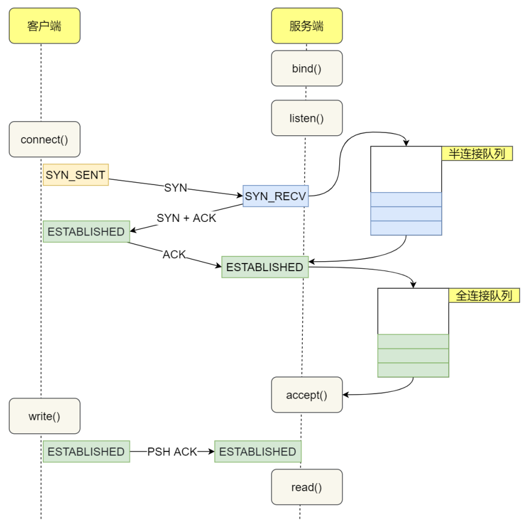

不管是半连接队列还是全连接队列，都有最⼤⻓度限制，超过限制时，内核会直接丢弃，或返回 RST 包。  

# TCP 全连接队列溢出  

在服务端可以使⽤ ss 命令，来查看 TCP 全连接队列的情况：  

ss 命令获取的 Recv-Q/Send-Q 在 LISTEN 状态和⾮ LISTEN 状态所表达的含义是不同的。从下⾯的内核代码可以看出区别：  

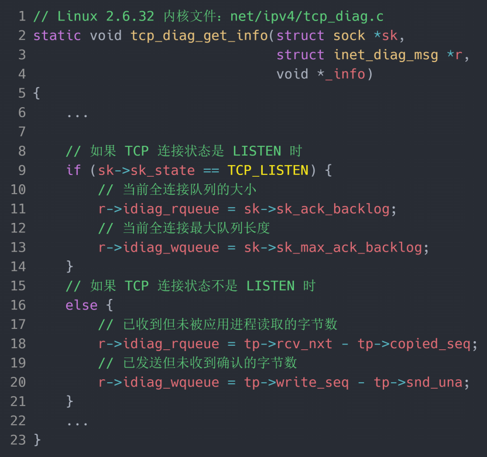

在 LISTEN 状态时， Recv-Q/Send-Q 表示的含义如下：  

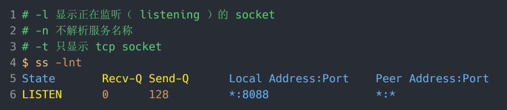

- Recv-Q：当前全连接队列的⼤⼩，也就是当前已完成三次握⼿并等待服务端 accept() 的 TCP 连接
- Send-Q：当前全连接最⼤队列⻓度，上⾯的输出结果说明监听 8088 端⼝的 TCP 服务，最⼤全连接⻓度为 128

在⾮ LISTEN 状态时， Recv-Q/Send-Q 表示的含义如下：  

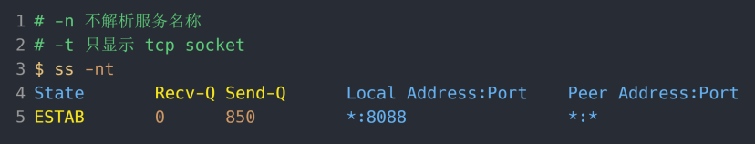

- Recv-Q：已收到但未被应⽤进程读取的字节数
- Send-Q：已发送但未收到确认的字节数

## 模拟 TCP 全连接队列溢出  

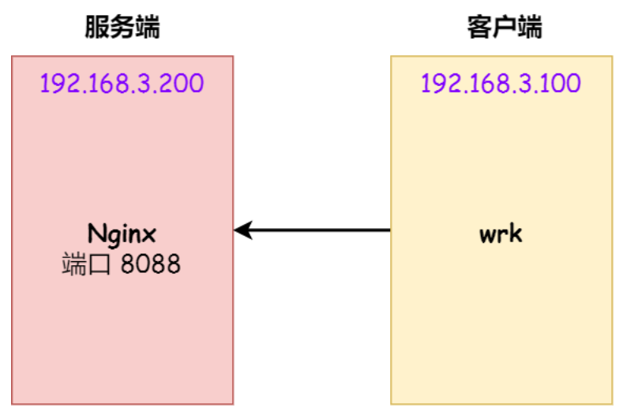

wrk  是⼀款简单的 HTTP 压测⼯具，它能够在单机多核 CPU 的条件下，使⽤系统⾃带的⾼性能 I/O 机制，通过多线程和事件模式，对⽬标机器产⽣⼤量的负载。  

客户端执⾏ wrk 命令对服务端发起压⼒测试，并发 3 万个连接：  

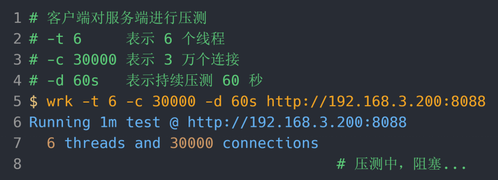

在服务端可以使⽤ ss 命令，来查看当前 TCP 全连接队列的情况：  

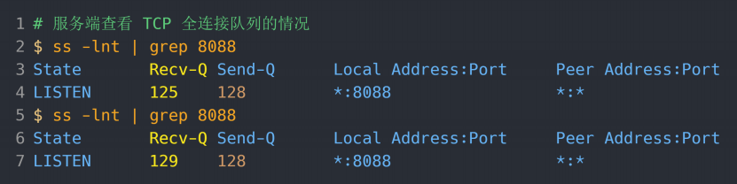

其间共执⾏了两次 ss 命令，从上⾯的输出结果，可以发现当前 TCP 全连接队列上升到了 129 ⼤⼩，超过了最⼤TCP 全连接队列。当超过了 TCP 最⼤全连接队列，服务端则会丢掉后续进来的 TCP 连接，丢掉的 TCP 连接的个数会被统计起来，我们可以使⽤ netstat -s 命令来查看：  

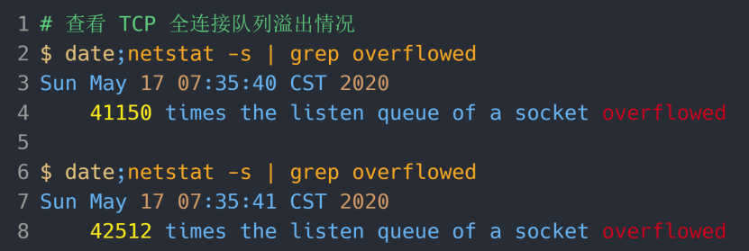

上⾯看到的 41150 times ，表示全连接队列溢出的次数，注意这个是累计值。可以隔⼏秒钟执⾏下，如果这个数字⼀直在增加的话肯定全连接队列偶尔满了。  

从上⾯的模拟结果，可以得知， 当服务端并发处理⼤量请求时，如果 TCP 全连接队列过⼩，就容易溢出。发⽣TCP 全连接队溢出的时候，后续的请求就会被丢弃，这样就会出现服务端请求数量上不去的现象。  

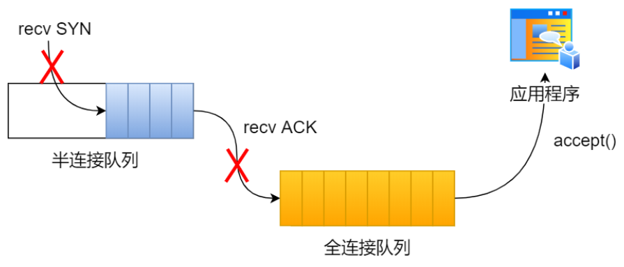

### 全连接队列满了的策略  

实际上，丢弃连接只是 Linux 的默认⾏为，我们还可以选择向客户端发送 RST 复位报⽂，告诉客户端连接已经建⽴失败。  

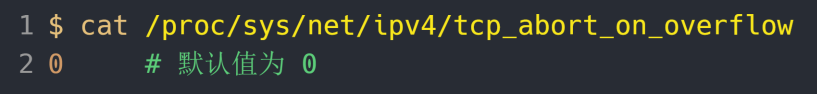

tcp_abort_on_overflow 共有两个值分别是 0 和 1，其分别表示：

- 0 ：如果全连接队列满了，那么 server 扔掉 client 发过来的 ack 
- 1 ：如果全连接队列满了， server 发送⼀个 reset 包给 client，表示废掉这个握⼿过程和这个连接

如果要想知道客户端连接不上服务端，是不是服务端 TCP 全连接队列满的原因，那么可以把tcp_abort_on_overflow 设置为 1，这时如果在客户端异常中可以看到很多 connection reset by peer 的错误，那么就可以证明是由于服务端 TCP 全连接队列溢出的问题。  

通常情况下，应当把 tcp_abort_on_overflow 设置为 0，因为这样更有利于应对突发流量。  

### 增⼤ TCP 全连接队列  

TCP 全连接队列的最⼤值取决于 somaxconn 和 backlog 之间的最⼩值，也就是 min(somaxconn, backlog)。  

- somaxconn 是 Linux 内核的参数，默认值是 128，可以通过 /proc/sys/net/core/somaxconn 来设置其值
- backlog 是 listen(int sockfd, int backlog) 函数中的 backlog ⼤⼩

如果持续不断地有连接因为 TCP 全连接队列溢出被丢弃，就应该调⼤ backlog 以及 somaxconn 参数。  

# TCP 半连接队列溢出  

## 查看 TCP 半连接队列⻓度  

服务端处于 SYN_RECV 状态的 TCP 连接，就是 TCP 半连接队列。于是，我们可以使⽤如下命令计算当前 TCP 半连接队列⻓度：  

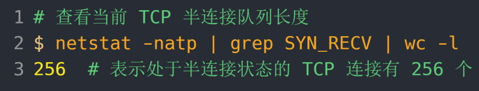

## 模拟 TCP 半连接队列溢出  

模拟 TCP 半连接溢出场景不难，实际上就是对服务端⼀直发送 TCP SYN 包，但是不回第三次握⼿ ACK，这样就会使得服务端有⼤量的处于 SYN_RECV 状态的 TCP 连接。这其实也就是所谓的 SYN 洪泛、 SYN 攻击、 DDos 攻击。  

拟实验是没有开启 tcp_syncookies，使⽤ hping3 ⼯具模拟 SYN 攻击：  

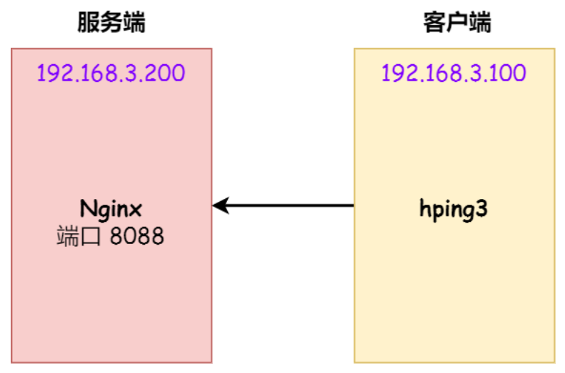

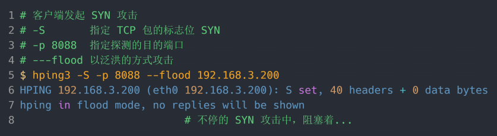

当服务端受到 SYN 攻击后，连接服务端 ssh 就会断开了，⽆法再连上。只能在服务端主机上执⾏查看当前 TCP 半连接队列⼤⼩：  

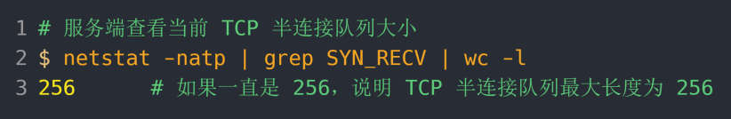

同时，还可以通过 netstat -s 观察半连接队列溢出的情况：  

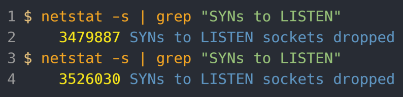

上⾯输出的数值是累计值，表示共有多少个 TCP 连接因为半连接队列溢出⽽被丢弃。 隔⼏秒执⾏⼏次，如果有上升的趋势，说明当前存在半连接队列溢出的现象。  

### TCP 半连接队列的最⼤值  

TCP 第⼀次握⼿（收到 SYN 包）时会被丢弃的三种条件：  

- 如果半连接队列满了，并且没有开启 tcp_syncookies，则会丢弃
- 若全连接队列满了，且没有重传 SYN+ACK 包的连接请求多于 1 个，则会丢弃
- 如果没有开启 tcp_syncookies，并且 max_syn_backlog 减去 当前半连接队列⻓度⼩于 (max_syn_backlog >> 2)，则会丢弃

半连接队列的⼤⼩并不单单只跟 tcp_max_syn_backlog 有关系：

- 当 max_syn_backlog > min(somaxconn, backlog) 时， 半连接队列最⼤值 max_qlen_log = min(somaxconn,backlog) * 2;
- 当 max_syn_backlog < min(somaxconn, backlog) 时， 半连接队列最⼤值 max_qlen_log =max_syn_backlog * 2;  

另外需要注意的是：每个 Linux 内核版本理论半连接最⼤值计算⽅式会不同。  

### 处于 SYN_REVC 状态的最⼤个数

max_qlen_log 是理论半连接队列最⼤值，并不⼀定代表服务端处于 SYN_REVC 状态的最⼤个数：如果当前半连接队列的⻓度 没有超过理论半连接队列最⼤值 max_qlen_log，那么如果条件 3 成⽴，则依然会丢弃 SYN 包，也就会使得服务端处于 SYN_REVC 状态的最⼤个数不会是理论值 max_qlen_log。  

服务端处于 SYN_RECV 状态的最⼤个数分为如下两种情况：  

- 如果当前半连接队列没超过理论半连接队列最⼤值，但是超过 max_syn_backlog -(max_syn_backlog >> 2)，那么处于 SYN_RECV 状态的最⼤个数就是 max_syn_backlog -(max_syn_backlog >> 2)
- 如果当前半连接队列超过理论半连接队列最⼤值，那么处于 SYN_RECV 状态的最⼤个数就是理论半连接队列最⼤值

### 如果 SYN 半连接队列已满，只能丢弃连接吗  

开启 syncookies 功能就可以在不使⽤ SYN 半连接队列的情况下成功建⽴连接，开启了 syncookies 功能就不会丢弃连接。  

syncookies 是这么做的：服务器根据当前状态计算出⼀个值，放在⼰⽅发出的 SYN+ACK 报⽂中发出，当客户端返回 ACK 报⽂时，取出该值验证，如果合法，就认为连接建⽴成功：

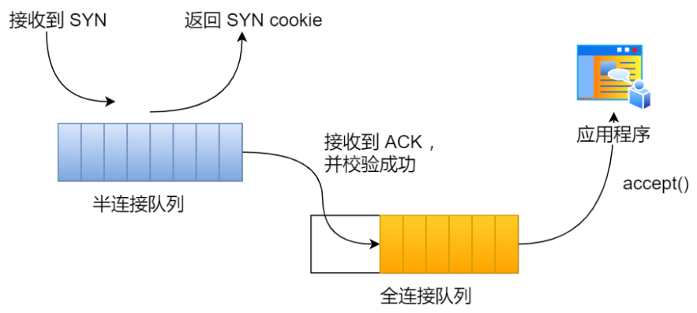

syncookies 参数主要有以下三个值：

- 0 值，表示关闭该功能
- 1 值，表示仅当 SYN 半连接队列放不下时，再启⽤它
- 2 值，表示⽆条件开启功能

## 防御 SYN 攻击  

防御 SYN 攻击的⽅法：  

- 增⼤半连接队列
- 开启 tcp_syncookies 功能
- 减少 SYN+ACK 重传次数  

### 增⼤半连接队列  

要想增⼤半连接队列，我们得知不能只单纯增⼤ tcp_max_syn_backlog 的值，还需⼀同增⼤ somaxconn 和 backlog，也就是增⼤全连接队列。否则，只单纯增⼤ tcp_max_syn_backlog 是⽆效的。  

增⼤ tcp_max_syn_backlog 和 somaxconn 的⽅法是修改 Linux 内核参数：  

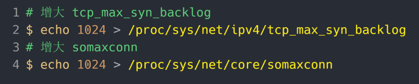

### 开启 tcp_syncookies 功能  

开启 tcp_syncookies 功能的⽅式也很简单，修改 Linux 内核参数：  

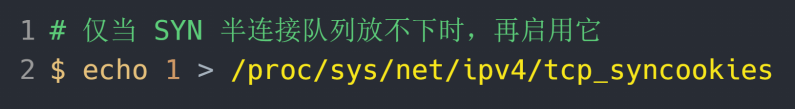

### 减少 SYN+ACK 重传次数  

当服务端受到 SYN 攻击时，就会有⼤量处于 SYN_REVC 状态的 TCP 连接，处于这个状态的 TCP 会重传SYN+ACK ，当重传超过次数达到上限后，就会断开连接。那么针对 SYN 攻击的场景，我们可以减少 SYN+ACK 的重传次数，以加快处于 SYN_REVC 状态的 TCP 连接断开。  

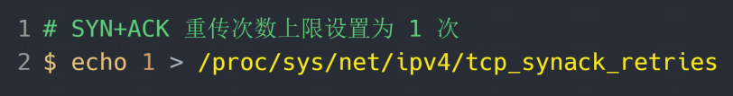

